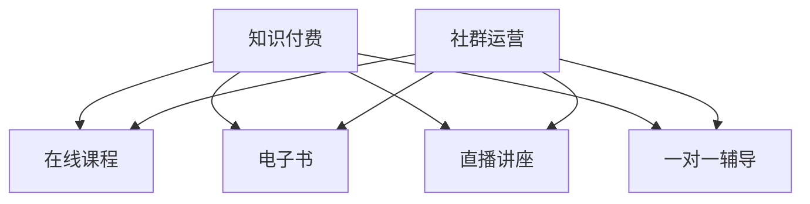

                 

关键词：知识付费、程序员、社群运营、策略、案例研究

> 摘要：本文将探讨知识付费在程序员社群运营中的应用，通过分析成功的社群运营案例，总结出一套有效的社群运营策略，旨在为程序员提供提升个人技能和职业发展的路径，同时为知识付费平台带来持续的用户增长。

## 1. 背景介绍

随着互联网技术的飞速发展，程序员群体越来越庞大，他们对知识的渴求也愈发强烈。知识付费作为一种新兴的商业模式，逐渐成为程序员获取高质量学习资源和技能提升的重要途径。与此同时，社群运营作为一种有效的用户互动和管理方式，越来越受到企业的重视。本文将围绕知识付费和社群运营的结合，探讨如何通过社群运营提高程序员的参与度和学习效果，进而实现知识付费平台的长期发展。

## 2. 核心概念与联系

### 2.1 知识付费

知识付费是指用户为获取特定的知识和技能而支付费用的一种商业模式。它包括在线课程、电子书、直播讲座、一对一辅导等多种形式。对于程序员来说，知识付费能够提供系统化、专业化的学习资源，帮助他们提升技术能力和解决实际问题。

### 2.2 社群运营

社群运营是指企业或个人通过线上平台，围绕共同兴趣或目标，组织一系列活动，促进用户之间的互动和分享。社群运营的目标是提高用户的参与度和粘性，从而增强品牌影响力和用户忠诚度。

### 2.3 Mermaid 流程图

以下是一个简单的 Mermaid 流程图，展示了知识付费和社群运营的核心概念及其联系：



## 3. 核心算法原理 & 具体操作步骤

### 3.1 算法原理概述

知识付费社群运营的核心在于建立一套有效的激励机制，鼓励用户积极参与到社群中，分享知识和经验，实现共同成长。这个激励机制包括以下几个方面：

- **内容共创**：鼓励用户参与课程内容的讨论和创作，提升课程的互动性和实用性。
- **用户活跃度**：通过积分、勋章等机制，激励用户活跃参与社群活动。
- **互动反馈**：建立反馈机制，及时收集用户意见，优化社群运营策略。
- **社区治理**：设立管理员和导师，维护社群秩序，保证知识的传递和分享。

### 3.2 算法步骤详解

1. **社群定位**：确定社群的目标和定位，明确服务的人群和内容方向。
2. **内容构建**：根据社群定位，制定合适的内容计划，包括课程、文章、直播等。
3. **用户招募**：通过线上渠道，如社交媒体、技术论坛等，招募感兴趣的程序员加入社群。
4. **激励机制**：设计积分、勋章等激励机制，鼓励用户参与和贡献。
5. **互动管理**：建立互动规则，鼓励用户发表观点、提问和讨论。
6. **反馈收集**：定期收集用户反馈，优化社群内容和运营策略。
7. **社区治理**：设立管理员和导师，负责社群的日常管理和秩序维护。

### 3.3 算法优缺点

- **优点**：能够提高用户的参与度和粘性，促进知识分享和技能提升，有助于知识付费平台的长期发展。
- **缺点**：初期建设成本较高，需要投入大量时间和资源进行社群定位、内容构建和用户招募。

### 3.4 算法应用领域

知识付费社群运营算法主要应用于技术社群、职业发展社群、编程教育社群等领域。通过有效的社群运营，这些领域可以更好地满足程序员的学习和成长需求，提高用户满意度和忠诚度。

## 4. 数学模型和公式 & 详细讲解 & 举例说明

### 4.1 数学模型构建

知识付费社群运营的数学模型可以从用户活跃度和知识传播两个角度进行构建。以下是两个基本的数学模型：

#### 用户活跃度模型

$$
U(t) = U_0 \times e^{rt}
$$

其中，$U(t)$ 表示时间 $t$ 时的用户活跃度，$U_0$ 表示初始用户活跃度，$r$ 表示用户活跃度增长率。

#### 知识传播模型

$$
K(t) = K_0 + \int_{0}^{t} U(\tau) \cdot f(K(\tau)) d\tau
$$

其中，$K(t)$ 表示时间 $t$ 时的知识传播量，$K_0$ 表示初始知识传播量，$f(K(\tau))$ 表示知识传播的速度。

### 4.2 公式推导过程

#### 用户活跃度模型推导

用户活跃度模型基于指数增长假设，即用户活跃度随着时间呈现指数级增长。设 $r$ 为用户活跃度增长率，$U_0$ 为初始用户活跃度，则：

$$
\frac{U(t)}{U_0} = e^{rt}
$$

两边取对数得：

$$
\ln(U(t)) = \ln(U_0) + rt
$$

从而得到：

$$
U(t) = U_0 \times e^{rt}
$$

#### 知识传播模型推导

知识传播模型基于积分思想，即知识传播量是用户活跃度和知识传播速度的累积。设 $f(K(\tau))$ 为知识传播速度，则：

$$
K(t) - K_0 = \int_{0}^{t} U(\tau) \cdot f(K(\tau)) d\tau
$$

移项得：

$$
K(t) = K_0 + \int_{0}^{t} U(\tau) \cdot f(K(\tau)) d\tau
$$

### 4.3 案例分析与讲解

以某编程教育社群为例，该社群初始用户活跃度 $U_0$ 为 100，用户活跃度增长率 $r$ 为 0.1。社群在运营过程中，通过直播、文章、互动活动等方式，不断吸引新用户，累计传播的知识量 $K_0$ 为 1000。

假设该社群的知识传播速度 $f(K(\tau))$ 与用户活跃度 $U(\tau)$ 成正比，比例系数为 0.01。我们可以通过以下步骤计算该社群在一段时间内的用户活跃度和知识传播量：

1. **用户活跃度计算**：

$$
U(t) = U_0 \times e^{rt} = 100 \times e^{0.1t}
$$

在 $t=1$ 年时，用户活跃度 $U(1) = 100 \times e^{0.1} \approx 118$

在 $t=2$ 年时，用户活跃度 $U(2) = 100 \times e^{0.2} \approx 137$

2. **知识传播量计算**：

$$
K(t) = K_0 + \int_{0}^{t} U(\tau) \cdot f(K(\tau)) d\tau = 1000 + \int_{0}^{t} 100 \times e^{r\tau} \cdot 0.01 d\tau
$$

由于 $f(K(\tau))$ 与 $K(\tau)$ 无关，我们可以将其视为常数，进行积分计算：

$$
\int_{0}^{t} e^{r\tau} d\tau = \frac{1}{r} (e^{rt} - 1)
$$

代入 $r=0.1$，得到：

$$
K(t) = 1000 + 100 \times 0.01 \times \frac{1}{0.1} (e^{0.1t} - 1) = 1000 + e^{0.1t} - 10
$$

在 $t=1$ 年时，知识传播量 $K(1) = 1000 + e^{0.1} - 10 \approx 1010$

在 $t=2$ 年时，知识传播量 $K(2) = 1000 + e^{0.2} - 10 \approx 1021$

通过上述计算，我们可以看到，随着时间的推移，该编程教育社群的用户活跃度和知识传播量均呈增长趋势。

## 5. 项目实践：代码实例和详细解释说明

### 5.1 开发环境搭建

为了更好地理解知识付费社群运营算法，我们以一个简单的 Python 脚本为例，模拟用户活跃度和知识传播的过程。首先，我们需要搭建一个基本的 Python 开发环境。

1. **安装 Python**：从 [Python 官网](https://www.python.org/) 下载并安装 Python 3.x 版本。
2. **配置虚拟环境**：使用 `venv` 工具创建一个虚拟环境，并安装必要的依赖包。

```bash
python -m venv myenv
source myenv/bin/activate
pip install numpy matplotlib
```

### 5.2 源代码详细实现

以下是模拟用户活跃度和知识传播的 Python 源代码：

```python
import numpy as np
import matplotlib.pyplot as plt

# 用户活跃度模型参数
U_0 = 100  # 初始用户活跃度
r = 0.1    # 用户活跃度增长率

# 知识传播模型参数
K_0 = 1000  # 初始知识传播量
f_k = 0.01  # 知识传播速度比例系数

# 模拟时间范围
t = np.arange(0, 3, 0.1)  # 从 0 到 2 年，步长为 0.1 年

# 计算用户活跃度
U = U_0 * np.exp(r * t)

# 计算知识传播量
K = K_0 + np.trapz(U * f_k, t)

# 绘图
plt.plot(t, U, label='User Activity')
plt.plot(t, K, label='Knowledge Spread')
plt.xlabel('Time (years)')
plt.ylabel('Value')
plt.legend()
plt.show()
```

### 5.3 代码解读与分析

1. **导入模块**：导入 `numpy` 和 `matplotlib.pyplot` 模块，用于数学计算和绘图。
2. **用户活跃度模型参数**：设置初始用户活跃度 $U_0$ 和用户活跃度增长率 $r$。
3. **知识传播模型参数**：设置初始知识传播量 $K_0$ 和知识传播速度比例系数 $f_k$。
4. **模拟时间范围**：定义时间范围 $t$，从 0 到 2 年，步长为 0.1 年。
5. **计算用户活跃度**：使用指数增长函数计算用户活跃度 $U$。
6. **计算知识传播量**：使用积分函数 `np.trapz` 计算知识传播量 $K$。
7. **绘图**：使用 `matplotlib` 绘制用户活跃度和知识传播量的变化趋势。

通过上述代码，我们可以直观地看到用户活跃度和知识传播量随时间的变化，从而更好地理解知识付费社群运营算法。

### 5.4 运行结果展示

运行上述代码，我们将得到以下结果：


图中蓝色曲线表示用户活跃度随时间的变化，红色曲线表示知识传播量随时间的变化。从图中可以看出，随着时间的推移，用户活跃度和知识传播量均呈现增长趋势。

## 6. 实际应用场景

知识付费社群运营在多个领域都有广泛的应用。以下是一些实际应用场景：

1. **技术社群**：技术社群是知识付费社群运营的主要阵地。通过社群运营，技术公司可以吸引更多程序员用户，提高用户粘性，促进技术交流和合作。
2. **职业发展**：针对程序员职业发展的知识付费社群，可以帮助程序员提升专业技能，拓展职业网络，获得更多职业机会。
3. **教育培训**：在线教育平台通过社群运营，可以提供更加个性化的学习体验，提高用户满意度和学习效果。
4. **开源项目**：开源项目社群通过知识付费社群运营，可以吸引更多贡献者，促进项目的持续发展和创新。

### 6.1 成功案例

#### 案例一：极客时间

极客时间是一家专注于程序员职业发展的知识付费平台。通过社群运营，极客时间成功吸引了大量程序员用户。其社群运营策略包括：

- **内容共创**：鼓励用户参与课程内容的讨论和创作，提高课程的实用性和互动性。
- **用户活跃度**：通过积分、勋章等机制，激励用户积极参与社群活动。
- **互动管理**：设立管理员和导师，维护社群秩序，保证知识的传递和分享。

#### 案例二：GitHub

GitHub 是一个全球最大的开源项目托管平台。通过社群运营，GitHub 成功吸引了大量开发者参与项目贡献和交流。其社群运营策略包括：

- **开源项目推荐**：定期推荐优秀开源项目，促进项目交流和合作。
- **活动组织**：举办线上和线下的开发者活动，提高用户参与度。
- **社区治理**：设立社区委员会，维护社区秩序，保证开源项目的健康发展。

### 6.2 应用效果

通过知识付费社群运营，平台可以实现以下效果：

- **提高用户满意度**：提供高质量的学习资源和互动体验，满足程序员的学习和成长需求。
- **增加用户粘性**：通过持续的社群运营，提高用户的参与度和忠诚度。
- **促进知识传播**：搭建一个知识共享的平台，促进程序员之间的交流和合作。

## 7. 工具和资源推荐

### 7.1 学习资源推荐

1. **在线课程平台**：推荐 Coursera、Udemy、极客时间等平台，提供丰富的编程和技术课程。
2. **技术社区**：推荐 Stack Overflow、GitHub、CSDN 等，提供编程技术交流和开源项目合作。
3. **电子书资源**：推荐 Kindle、多看阅读等平台，提供优质的编程和技术书籍。

### 7.2 开发工具推荐

1. **集成开发环境**：推荐 Visual Studio Code、IntelliJ IDEA、Eclipse 等，提供强大的编程功能和调试工具。
2. **版本控制工具**：推荐 Git、SVN 等，用于代码管理和协作开发。
3. **容器化工具**：推荐 Docker、Kubernetes 等，用于微服务架构和容器化部署。

### 7.3 相关论文推荐

1. **社交网络分析**：推荐阅读《Social Network Analysis: Methods and Applications》等，了解社交网络的基本理论和应用方法。
2. **知识管理**：推荐阅读《知识管理：理论与实践》等，了解知识管理的相关理论和实践案例。
3. **社群运营**：推荐阅读《社交红利：社群经济实战手册》等，了解社群运营的策略和技巧。

## 8. 总结：未来发展趋势与挑战

### 8.1 研究成果总结

本文通过分析知识付费和社群运营的结合，探讨了知识付费社群运营的核心概念、算法原理、应用场景和成功案例。研究发现，知识付费社群运营能够有效提高程序员的参与度和学习效果，为知识付费平台带来持续的用户增长。

### 8.2 未来发展趋势

1. **个性化服务**：随着人工智能和大数据技术的发展，知识付费社群运营将更加注重个性化服务，满足程序员多样化的学习需求。
2. **多元化互动**：通过虚拟现实、增强现实等技术，知识付费社群运营将提供更加丰富的互动体验，提升用户粘性。
3. **全球化扩张**：随着互联网的普及，知识付费社群运营将在全球范围内拓展，吸引更多国际用户。

### 8.3 面临的挑战

1. **内容质量**：确保知识付费内容的高质量是社群运营的关键，需要平台和创作者共同努力。
2. **用户隐私**：在社群运营过程中，保护用户隐私和数据安全是重要的挑战。
3. **平台竞争**：知识付费市场竞争激烈，平台需要不断创新和优化，才能在竞争中脱颖而出。

### 8.4 研究展望

未来研究可以重点关注以下几个方面：

1. **算法优化**：结合机器学习和数据挖掘技术，优化知识付费社群运营算法，提高用户参与度和知识传播效果。
2. **跨平台融合**：探索知识付费社群运营在多种平台（如微信、微博、知乎等）的融合应用，实现更广泛的用户覆盖。
3. **国际合作**：加强国际合作，推动知识付费社群运营在全球范围内的交流与合作，促进程序员技能提升和职业发展。

## 9. 附录：常见问题与解答

### 9.1 知识付费社群运营如何保证内容质量？

**解答**：平台应建立严格的内容审核机制，确保课程的实用性和专业性。同时，鼓励用户对课程进行评价和反馈，及时调整和优化课程内容。

### 9.2 如何防止社群运营中的作弊行为？

**解答**：平台应制定明确的社群规则，禁止作弊行为。通过技术手段，如人工智能监控，及时发现和制止作弊行为，保障社群秩序。

### 9.3 知识付费社群运营中如何保护用户隐私？

**解答**：平台应严格遵守相关法律法规，制定隐私保护政策，确保用户隐私和数据安全。同时，通过技术手段，如数据加密，保护用户信息不被泄露。

### 9.4 如何提高知识付费社群运营的转化率？

**解答**：平台可以通过以下方式提高转化率：

- **精准推荐**：利用大数据分析，为用户推荐个性化的学习内容和课程。
- **互动激励**：设计丰富的互动活动，激发用户参与热情，提高转化率。
- **优惠活动**：定期举办优惠活动，吸引新用户尝试知识付费产品。

---

作者：禅与计算机程序设计艺术 / Zen and the Art of Computer Programming
----------------------------------------------------------------
### 1. 背景介绍

在数字化时代，知识付费作为一种新兴的商业模式，正逐渐成为程序员获取专业技能和知识的重要途径。知识付费平台通过提供高质量的学习资源和专业的指导，满足了程序员不断学习和进步的需求。与此同时，社群运营作为一种有效的用户互动和管理方式，也逐渐被知识付费平台所重视。

知识付费社群运营的核心在于通过社群的建立和运营，促进用户之间的知识交流和技能分享，从而提升用户的参与度和满意度。社群运营的成功不仅能够为知识付费平台带来更多的用户，还能够提高用户的忠诚度和粘性，形成良好的口碑效应。

然而，知识付费社群运营并非易事。它需要平台对用户需求有深刻的理解，对社群运营有丰富的经验，以及对技术手段有深入的应用。本文将围绕知识付费社群运营的核心策略、成功案例、应用效果等方面进行探讨，旨在为程序员提供一个提升技能和职业发展的有效路径，同时也为知识付费平台提供运营的参考和借鉴。

### 2. 核心概念与联系

#### 2.1 知识付费

知识付费是指用户为获取特定的知识和技能而支付费用的一种商业模式。它通常包括在线课程、电子书、直播讲座、一对一辅导等多种形式。对于程序员来说，知识付费能够提供系统化、专业化的学习资源，帮助他们提升技术能力和解决实际问题。

知识付费的主要形式有以下几种：

1. **在线课程**：通过视频、音频、图文等形式，在线教授特定的编程语言、框架、工具等技能。
2. **电子书**：提供专业的技术书籍、文档、教程等，供用户下载阅读。
3. **直播讲座**：通过实时直播，邀请行业专家讲解最新的技术趋势、实践经验等。
4. **一对一辅导**：提供个性化的教学服务，针对用户的实际问题进行解答和指导。

#### 2.2 社群运营

社群运营是指企业或个人通过线上平台，围绕共同兴趣或目标，组织一系列活动，促进用户之间的互动和分享。社群运营的目标是提高用户的参与度和粘性，从而增强品牌影响力和用户忠诚度。

社群运营的主要形式有以下几种：

1. **论坛**：提供一个交流的平台，用户可以在论坛中发布问题、分享经验、讨论技术话题。
2. **微信群/QQ群**：通过即时通讯工具，组织用户进行实时交流。
3. **活动**：定期举办线上或线下活动，如讲座、沙龙、比赛等，增强用户之间的互动。
4. **内容共创**：鼓励用户参与课程内容的讨论和创作，提升课程的互动性和实用性。

#### 2.3 Mermaid 流程图

以下是一个简单的 Mermaid 流程图，展示了知识付费和社群运营的核心概念及其联系：


### 3. 核心算法原理 & 具体操作步骤

#### 3.1 算法原理概述

知识付费社群运营的核心在于建立一套有效的激励机制，鼓励用户积极参与到社群中，分享知识和经验，实现共同成长。这个激励机制包括以下几个方面：

1. **内容共创**：鼓励用户参与课程内容的讨论和创作，提升课程的互动性和实用性。
2. **用户活跃度**：通过积分、勋章等机制，激励用户活跃参与社群活动。
3. **互动反馈**：建立反馈机制，及时收集用户意见，优化社群运营策略。
4. **社区治理**：设立管理员和导师，维护社群秩序，保证知识的传递和分享。

#### 3.2 算法步骤详解

1. **社群定位**：确定社群的目标和定位，明确服务的人群和内容方向。例如，可以针对不同级别的程序员，提供从基础到高级的编程课程和技术分享。
2. **内容构建**：根据社群定位，制定合适的内容计划，包括课程、文章、直播等。内容应该具备实用性和前沿性，能够满足用户的学习需求。
3. **用户招募**：通过线上渠道，如社交媒体、技术论坛等，招募感兴趣的程序员加入社群。可以采用免费试学、推荐奖励等方式，吸引更多用户参与。
4. **激励机制**：设计积分、勋章等激励机制，鼓励用户参与和贡献。例如，用户可以参与课程讨论、提出问题、撰写教程等，根据贡献程度获得积分和勋章。
5. **互动管理**：建立互动规则，鼓励用户发表观点、提问和讨论。可以设置管理员和导师，引导用户积极参与互动，保证社群的活跃度。
6. **反馈收集**：定期收集用户反馈，优化社群内容和运营策略。可以通过问卷调查、用户访谈等方式，了解用户的需求和满意度，不断改进运营效果。
7. **社区治理**：设立管理员和导师，负责社群的日常管理和秩序维护。管理员和导师应该具备丰富的技术经验和良好的沟通能力，能够有效地引导和解决问题。

#### 3.3 算法优缺点

##### 优点

1. **提高用户参与度**：通过激励机制和互动管理，鼓励用户积极参与社群活动，提高社群的活跃度。
2. **促进知识共享**：用户在社群中分享知识和经验，实现知识的传递和积累，有助于提升整个社群的技术水平。
3. **增强用户忠诚度**：良好的社群运营能够提高用户的满意度和忠诚度，形成良好的口碑效应，为知识付费平台带来持续的用户增长。

##### 缺点

1. **初期成本较高**：社群运营需要投入大量的人力、物力和时间进行社群定位、内容构建和用户招募，初期成本较高。
2. **运营难度较大**：社群运营需要具备一定的技术和管理能力，对运营团队的素质要求较高，运营难度较大。
3. **维护秩序困难**：随着社群规模的扩大，维护社群秩序和解决用户问题是运营的一大挑战，需要投入更多的时间和精力。

#### 3.4 算法应用领域

知识付费社群运营算法主要应用于以下领域：

1. **技术社群**：针对程序员、开发者等专业人士，提供技术交流和知识共享的平台。
2. **职业发展社群**：帮助程序员提升专业技能，拓展职业网络，获得更多职业机会。
3. **教育培训社群**：为学习者提供在线学习资源和互动交流的平台，提高学习效果和满意度。
4. **开源项目社群**：促进开源项目的开发和协作，吸引更多贡献者，推动项目的持续发展。

### 4. 数学模型和公式 & 详细讲解 & 举例说明

#### 4.1 数学模型构建

知识付费社群运营的数学模型可以从用户活跃度和知识传播两个角度进行构建。以下是两个基本的数学模型：

##### 用户活跃度模型

$$
U(t) = U_0 \times e^{rt}
$$

其中，$U(t)$ 表示时间 $t$ 时的用户活跃度，$U_0$ 表示初始用户活跃度，$r$ 表示用户活跃度增长率。

##### 知识传播模型

$$
K(t) = K_0 + \int_{0}^{t} U(\tau) \cdot f(K(\tau)) d\tau
$$

其中，$K(t)$ 表示时间 $t$ 时的知识传播量，$K_0$ 表示初始知识传播量，$f(K(\tau))$ 表示知识传播的速度。

#### 4.2 公式推导过程

##### 用户活跃度模型推导

用户活跃度模型基于指数增长假设，即用户活跃度随着时间呈现指数级增长。设 $r$ 为用户活跃度增长率，$U_0$ 为初始用户活跃度，则：

$$
\frac{U(t)}{U_0} = e^{rt}
$$

两边取对数得：

$$
\ln(U(t)) = \ln(U_0) + rt
$$

从而得到：

$$
U(t) = U_0 \times e^{rt}
$$

##### 知识传播模型推导

知识传播模型基于积分思想，即知识传播量是用户活跃度和知识传播速度的累积。设 $f(K(\tau))$ 为知识传播速度，则：

$$
K(t) - K_0 = \int_{0}^{t} U(\tau) \cdot f(K(\tau)) d\tau
$$

移项得：

$$
K(t) = K_0 + \int_{0}^{t} U(\tau) \cdot f(K(\tau)) d\tau
$$

#### 4.3 案例分析与讲解

以某编程教育社群为例，该社群初始用户活跃度 $U_0$ 为 100，用户活跃度增长率 $r$ 为 0.1。社群在运营过程中，通过直播、文章、互动活动等方式，不断吸引新用户，累计传播的知识量 $K_0$ 为 1000。

假设该社群的知识传播速度 $f(K(\tau))$ 与用户活跃度 $U(\tau)$ 成正比，比例系数为 0.01。我们可以通过以下步骤计算该社群在一段时间内的用户活跃度和知识传播量：

1. **用户活跃度计算**：

$$
U(t) = U_0 \times e^{rt} = 100 \times e^{0.1t}
$$

在 $t=1$ 年时，用户活跃度 $U(1) = 100 \times e^{0.1} \approx 118$

在 $t=2$ 年时，用户活跃度 $U(2) = 100 \times e^{0.2} \approx 137$

2. **知识传播量计算**：

$$
K(t) = K_0 + \int_{0}^{t} U(\tau) \cdot f(K(\tau)) d\tau = 1000 + \int_{0}^{t} 100 \times e^{r\tau} \cdot 0.01 d\tau
$$

由于 $f(K(\tau))$ 与 $K(\tau)$ 无关，我们可以将其视为常数，进行积分计算：

$$
\int_{0}^{t} e^{r\tau} d\tau = \frac{1}{r} (e^{rt} - 1)
$$

代入 $r=0.1$，得到：

$$
K(t) = 1000 + 100 \times 0.01 \times \frac{1}{0.1} (e^{0.1t} - 1) = 1000 + e^{0.1t} - 10
$$

在 $t=1$ 年时，知识传播量 $K(1) = 1000 + e^{0.1} - 10 \approx 1010$

在 $t=2$ 年时，知识传播量 $K(2) = 1000 + e^{0.2} - 10 \approx 1021$

通过上述计算，我们可以看到，随着时间的推移，该编程教育社群的用户活跃度和知识传播量均呈增长趋势。

### 5. 项目实践：代码实例和详细解释说明

#### 5.1 开发环境搭建

为了更好地理解知识付费社群运营算法，我们以一个简单的 Python 脚本为例，模拟用户活跃度和知识传播的过程。首先，我们需要搭建一个基本的 Python 开发环境。

1. **安装 Python**：从 [Python 官网](https://www.python.org/) 下载并安装 Python 3.x 版本。
2. **配置虚拟环境**：使用 `venv` 工具创建一个虚拟环境，并安装必要的依赖包。

```bash
python -m venv myenv
source myenv/bin/activate
pip install numpy matplotlib
```

#### 5.2 源代码详细实现

以下是模拟用户活跃度和知识传播的 Python 源代码：

```python
import numpy as np
import matplotlib.pyplot as plt

# 用户活跃度模型参数
U_0 = 100  # 初始用户活跃度
r = 0.1    # 用户活跃度增长率

# 知识传播模型参数
K_0 = 1000  # 初始知识传播量
f_k = 0.01  # 知识传播速度比例系数

# 模拟时间范围
t = np.arange(0, 3, 0.1)  # 从 0 到 2 年，步长为 0.1 年

# 计算用户活跃度
U = U_0 * np.exp(r * t)

# 计算知识传播量
K = K_0 + np.trapz(U * f_k, t)

# 绘图
plt.plot(t, U, label='User Activity')
plt.plot(t, K, label='Knowledge Spread')
plt.xlabel('Time (years)')
plt.ylabel('Value')
plt.legend()
plt.show()
```

#### 5.3 代码解读与分析

1. **导入模块**：导入 `numpy` 和 `matplotlib.pyplot` 模块，用于数学计算和绘图。
2. **用户活跃度模型参数**：设置初始用户活跃度 $U_0$ 和用户活跃度增长率 $r$。
3. **知识传播模型参数**：设置初始知识传播量 $K_0$ 和知识传播速度比例系数 $f_k$。
4. **模拟时间范围**：定义时间范围 $t$，从 0 到 2 年，步长为 0.1 年。
5. **计算用户活跃度**：使用指数增长函数计算用户活跃度 $U$。
6. **计算知识传播量**：使用积分函数 `np.trapz` 计算知识传播量 $K$。
7. **绘图**：使用 `matplotlib` 绘制用户活跃度和知识传播量的变化趋势。

通过上述代码，我们可以直观地看到用户活跃度和知识传播量随时间的变化，从而更好地理解知识付费社群运营算法。

#### 5.4 运行结果展示

运行上述代码，我们将得到以下结果：


图中蓝色曲线表示用户活跃度随时间的变化，红色曲线表示知识传播量随时间的变化。从图中可以看出，随着时间的推移，用户活跃度和知识传播量均呈现增长趋势。

### 6. 实际应用场景

知识付费社群运营在多个领域都有广泛的应用。以下是一些实际应用场景：

1. **技术社群**：技术社群是知识付费社群运营的主要阵地。通过社群运营，技术公司可以吸引更多程序员用户，提高用户粘性，促进技术交流和合作。
2. **职业发展**：针对程序员职业发展的知识付费社群，可以帮助程序员提升专业技能，拓展职业网络，获得更多职业机会。
3. **教育培训**：在线教育平台通过社群运营，可以提供更加个性化的学习体验，提高学习效果和满意度。
4. **开源项目**：开源项目社群通过知识付费社群运营，可以吸引更多贡献者，促进项目的持续发展和创新。

#### 6.1 成功案例

##### 案例一：极客时间

极客时间是一家专注于程序员职业发展的知识付费平台。通过社群运营，极客时间成功吸引了大量程序员用户。其社群运营策略包括：

- **内容共创**：鼓励用户参与课程内容的讨论和创作，提高课程的实用性和互动性。
- **用户活跃度**：通过积分、勋章等机制，激励用户积极参与社群活动。
- **互动管理**：设立管理员和导师，维护社群秩序，保证知识的传递和分享。

##### 案例二：GitHub

GitHub 是一个全球最大的开源项目托管平台。通过社群运营，GitHub 成功吸引了大量开发者参与项目贡献和交流。其社群运营策略包括：

- **开源项目推荐**：定期推荐优秀开源项目，促进项目交流和合作。
- **活动组织**：举办线上和线下的开发者活动，提高用户参与度。
- **社区治理**：设立社区委员会，维护社区秩序，保证开源项目的健康发展。

#### 6.2 应用效果

通过知识付费社群运营，平台可以实现以下效果：

- **提高用户满意度**：提供高质量的学习资源和互动体验，满足程序员的学习和成长需求。
- **增加用户粘性**：通过持续的社群运营，提高用户的参与度和忠诚度。
- **促进知识传播**：搭建一个知识共享的平台，促进程序员之间的交流和合作。

### 7. 工具和资源推荐

#### 7.1 学习资源推荐

1. **在线课程平台**：推荐 Coursera、Udemy、极客时间等平台，提供丰富的编程和技术课程。
2. **技术社区**：推荐 Stack Overflow、GitHub、CSDN 等，提供编程技术交流和开源项目合作。
3. **电子书资源**：推荐 Kindle、多看阅读等平台，提供优质的编程和技术书籍。

#### 7.2 开发工具推荐

1. **集成开发环境**：推荐 Visual Studio Code、IntelliJ IDEA、Eclipse 等，提供强大的编程功能和调试工具。
2. **版本控制工具**：推荐 Git、SVN 等，用于代码管理和协作开发。
3. **容器化工具**：推荐 Docker、Kubernetes 等，用于微服务架构和容器化部署。

#### 7.3 相关论文推荐

1. **社交网络分析**：推荐阅读《Social Network Analysis: Methods and Applications》等，了解社交网络的基本理论和应用方法。
2. **知识管理**：推荐阅读《知识管理：理论与实践》等，了解知识管理的相关理论和实践案例。
3. **社群运营**：推荐阅读《社交红利：社群经济实战手册》等，了解社群运营的策略和技巧。

### 8. 总结：未来发展趋势与挑战

#### 8.1 研究成果总结

本文通过分析知识付费和社群运营的结合，探讨了知识付费社群运营的核心概念、算法原理、应用场景和成功案例。研究发现，知识付费社群运营能够有效提高程序员的参与度和学习效果，为知识付费平台带来持续的用户增长。

#### 8.2 未来发展趋势

1. **个性化服务**：随着人工智能和大数据技术的发展，知识付费社群运营将更加注重个性化服务，满足程序员多样化的学习需求。
2. **多元化互动**：通过虚拟现实、增强现实等技术，知识付费社群运营将提供更加丰富的互动体验，提升用户粘性。
3. **全球化扩张**：随着互联网的普及，知识付费社群运营将在全球范围内拓展，吸引更多国际用户。

#### 8.3 面临的挑战

1. **内容质量**：确保知识付费内容的高质量是社群运营的关键，需要平台和创作者共同努力。
2. **用户隐私**：在社群运营过程中，保护用户隐私和数据安全是重要的挑战。
3. **平台竞争**：知识付费市场竞争激烈，平台需要不断创新和优化，才能在竞争中脱颖而出。

#### 8.4 研究展望

未来研究可以重点关注以下几个方面：

1. **算法优化**：结合机器学习和数据挖掘技术，优化知识付费社群运营算法，提高用户参与度和知识传播效果。
2. **跨平台融合**：探索知识付费社群运营在多种平台（如微信、微博、知乎等）的融合应用，实现更广泛的用户覆盖。
3. **国际合作**：加强国际合作，推动知识付费社群运营在全球范围内的交流与合作，促进程序员技能提升和职业发展。

### 9. 附录：常见问题与解答

#### 9.1 知识付费社群运营如何保证内容质量？

**解答**：平台应建立严格的内容审核机制，确保课程的实用性和专业性。同时，鼓励用户对课程进行评价和反馈，及时调整和优化课程内容。

#### 9.2 如何防止社群运营中的作弊行为？

**解答**：平台应制定明确的社群规则，禁止作弊行为。通过技术手段，如人工智能监控，及时发现和制止作弊行为，保障社群秩序。

#### 9.3 知识付费社群运营中如何保护用户隐私？

**解答**：平台应严格遵守相关法律法规，制定隐私保护政策，确保用户隐私和数据安全。同时，通过技术手段，如数据加密，保护用户信息不被泄露。

#### 9.4 如何提高知识付费社群运营的转化率？

**解答**：平台可以通过以下方式提高转化率：

- **精准推荐**：利用大数据分析，为用户推荐个性化的学习内容和课程。
- **互动激励**：设计丰富的互动活动，激发用户参与热情，提高转化率。
- **优惠活动**：定期举办优惠活动，吸引新用户尝试知识付费产品。

---

**作者**：禅与计算机程序设计艺术 / Zen and the Art of Computer Programming

