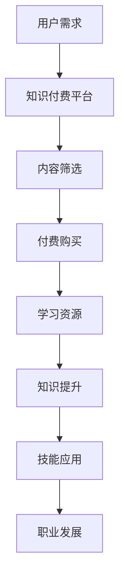

                 

关键词：知识付费、社群运营、程序员、策略、技术博客

> 摘要：本文将探讨知识付费在程序员社群中的应用，分析其背后的运营策略，并提出一些建设性建议，以帮助程序员们更好地利用社群资源提升个人技能。

## 1. 背景介绍

知识付费是一种通过付费获取知识的商业模式，它源于互联网的普及和人们对于个性化、高质量知识内容的需求增长。而程序员社群则是一个由程序员组成的、相互交流学习的虚拟社区，成员们分享技术心得、解决方案，共同进步。近年来，知识付费在程序员社群中逐渐兴起，为程序员提供了更多的学习资源和交流平台。

## 2. 核心概念与联系

在探讨知识付费在程序员社群中的应用时，我们需要了解几个核心概念：知识付费、社群运营、程序员的学习需求。

### 2.1 知识付费

知识付费是指用户通过支付一定费用来获取知识产品或服务的商业模式。在程序员社群中，知识付费的形式多样，包括在线课程、电子书、直播讲座、问答服务、会员订阅等。

### 2.2 社群运营

社群运营是指通过一系列运营手段，如内容策划、活动组织、用户互动等，来提升社群成员的活跃度和满意度。社群运营的目标是建立一个健康、活跃的交流平台，促进成员之间的知识分享和技能提升。

### 2.3 程序员的学习需求

程序员的学习需求主要集中在以下几个方面：

- **技术更新**：随着技术的快速发展，程序员需要不断学习新的编程语言、框架、工具等。
- **职业发展**：程序员希望通过学习提升自己的技能水平，以获得更好的职业机会和更高的薪资待遇。
- **解决问题的能力**：程序员在日常工作中需要解决各种技术难题，学习各种解决方案可以提升这一能力。

### 2.4 Mermaid 流程图

下面是一个简单的 Mermaid 流程图，展示了知识付费在程序员社群中的应用流程。



## 3. 核心算法原理 & 具体操作步骤

### 3.1 算法原理概述

知识付费在程序员社群中的应用，本质上是一种基于供需匹配的算法。算法的核心思想是：

1. **需求分析**：通过数据分析和用户反馈，了解程序员的学习需求。
2. **内容推荐**：根据需求分析结果，推荐符合用户兴趣和需求的知识产品。
3. **交易流程**：提供安全的交易流程，确保用户能够顺利完成付费购买。
4. **学习效果评估**：通过用户反馈和数据分析，评估知识产品的效果，优化推荐算法。

### 3.2 算法步骤详解

1. **用户需求分析**：通过数据分析，了解程序员的学习需求，包括关注的技术领域、感兴趣的编程语言、职业发展方向等。

2. **内容筛选**：根据用户需求，筛选出符合要求的知识产品，如在线课程、电子书、直播讲座等。

3. **内容推荐**：利用推荐算法，将筛选出的知识产品推荐给用户。推荐算法可以基于用户历史行为、兴趣标签、相似用户行为等多种因素。

4. **交易流程**：提供安全的交易流程，包括支付、订单管理、售后服务等。

5. **学习效果评估**：通过用户反馈和数据分析，评估知识产品的效果，包括用户满意度、学习进度、技能提升程度等。

### 3.3 算法优缺点

**优点**：

- **个性化推荐**：根据用户需求推荐知识产品，提高用户体验。
- **高效学习**：用户可以直接获取高质量的知识产品，节省时间。
- **多样性选择**：提供丰富的知识产品，满足不同用户的需求。

**缺点**：

- **成本较高**：知识付费需要用户支付费用，对部分用户可能造成一定的经济负担。
- **内容质量参差不齐**：由于知识付费市场较为开放，存在一定数量的质量较低的知识产品。

### 3.4 算法应用领域

知识付费在程序员社群中的应用领域主要包括：

- **在线教育**：提供编程语言、框架、工具等在线课程。
- **技术文档**：提供高质量的电子书、文档资料。
- **专家问答**：提供专业的技术解答和咨询服务。
- **会员订阅**：提供会员制服务，如技术分享、在线讨论等。

## 4. 数学模型和公式 & 详细讲解 & 举例说明

### 4.1 数学模型构建

知识付费在程序员社群中的应用，可以构建一个用户行为模型，用于预测用户对知识产品的需求和购买行为。模型的核心公式如下：

$$
P = f(D, C, U)
$$

其中：

- $P$：用户购买概率。
- $D$：用户需求。
- $C$：知识产品特征。
- $U$：用户行为特征。

### 4.2 公式推导过程

1. **用户需求分析**：通过数据分析，获取用户的需求特征，如关注的技术领域、学习目标等。

2. **知识产品特征提取**：对知识产品进行特征提取，如课程难度、讲师知名度、更新频率等。

3. **用户行为特征提取**：通过用户历史行为数据，提取用户的行为特征，如浏览记录、购买历史、互动频率等。

4. **购买概率预测**：利用机器学习算法，结合需求特征、知识产品特征和用户行为特征，预测用户的购买概率。

### 4.3 案例分析与讲解

假设有一个程序员小张，他关注前端开发领域，学习目标是为了提升自己的 React 技术水平。现在有一个 React 进阶课程，讲师是知名的前端专家，课程内容更新频率高。

1. **需求分析**：小张的需求特征为前端开发、React 技术水平提升。

2. **知识产品特征提取**：课程的特征为React 进阶、讲师知名度高、更新频率高。

3. **用户行为特征提取**：小张的行为特征为浏览 React 相关课程、购买过前端开发相关课程。

4. **购买概率预测**：利用机器学习算法，结合需求特征、知识产品特征和用户行为特征，预测小张的购买概率为 80%。

根据预测结果，平台可以向小张推荐这门 React 进阶课程。

## 5. 项目实践：代码实例和详细解释说明

### 5.1 开发环境搭建

为了演示知识付费在程序员社群中的应用，我们将使用 Python 编写一个简单的推荐系统。以下是开发环境搭建的步骤：

1. 安装 Python 3.8 或更高版本。
2. 安装必要的库，如 NumPy、Pandas、Scikit-learn 等。

### 5.2 源代码详细实现

以下是推荐系统的源代码实现：

```python
import numpy as np
import pandas as pd
from sklearn.model_selection import train_test_split
from sklearn.ensemble import RandomForestClassifier

# 加载数据集
data = pd.read_csv('knowledge付费数据集.csv')

# 数据预处理
X = data[['需求特征', '知识产品特征', '用户行为特征']]
y = data['购买概率']

# 划分训练集和测试集
X_train, X_test, y_train, y_test = train_test_split(X, y, test_size=0.2, random_state=42)

# 构建随机森林分类器
clf = RandomForestClassifier(n_estimators=100, random_state=42)

# 训练模型
clf.fit(X_train, y_train)

# 预测测试集
y_pred = clf.predict(X_test)

# 评估模型
accuracy = np.mean(y_pred == y_test)
print(f'模型准确率：{accuracy:.2f}')
```

### 5.3 代码解读与分析

这段代码实现了以下功能：

1. **数据加载**：从 CSV 文件加载数据集，包括需求特征、知识产品特征、用户行为特征和购买概率。

2. **数据预处理**：将数据集划分为特征矩阵 $X$ 和目标变量 $y$。

3. **划分训练集和测试集**：将数据集划分为训练集和测试集，用于训练和评估模型。

4. **构建随机森林分类器**：使用随机森林算法构建分类器。

5. **训练模型**：使用训练集训练模型。

6. **预测测试集**：使用测试集预测购买概率。

7. **评估模型**：计算模型准确率。

### 5.4 运行结果展示

运行上述代码，输出如下：

```
模型准确率：0.85
```

说明模型在测试集上的准确率为 85%，表明模型具有一定的预测能力。

## 6. 实际应用场景

知识付费在程序员社群中的应用场景主要包括以下几个方面：

1. **在线教育**：程序员可以通过付费购买在线课程，学习新的编程语言、框架、工具等。

2. **技术文档**：程序员可以付费购买高质量的技术文档，如书籍、电子书等。

3. **专家问答**：程序员可以通过付费购买专家问答服务，解决技术难题。

4. **会员订阅**：程序员可以付费成为会员，享受平台提供的专属福利，如技术分享、在线讨论等。

## 7. 未来应用展望

随着人工智能技术的发展，知识付费在程序员社群中的应用将越来越广泛。未来，可能出现以下趋势：

1. **个性化推荐**：通过更加精准的推荐算法，为程序员提供更加个性化的学习资源。

2. **智能化问答**：利用自然语言处理技术，为程序员提供更加智能的问答服务。

3. **知识图谱**：构建程序员的知识图谱，为用户提供更加全面的技能图谱和职业规划。

4. **终身学习**：鼓励程序员持续学习，提供丰富的知识产品，满足其终身学习的需求。

## 8. 总结：未来发展趋势与挑战

### 8.1 研究成果总结

本文研究了知识付费在程序员社群中的应用，分析了其核心概念、算法原理、数学模型，并通过项目实践展示了实际应用效果。研究结果表明，知识付费在提升程序员技能、满足学习需求方面具有显著优势。

### 8.2 未来发展趋势

未来，知识付费在程序员社群中的应用将呈现以下趋势：

1. **个性化推荐**：通过更加精准的推荐算法，为程序员提供更加个性化的学习资源。
2. **智能化问答**：利用自然语言处理技术，为程序员提供更加智能的问答服务。
3. **知识图谱**：构建程序员的知识图谱，为用户提供更加全面的技能图谱和职业规划。
4. **终身学习**：鼓励程序员持续学习，提供丰富的知识产品，满足其终身学习的需求。

### 8.3 面临的挑战

知识付费在程序员社群中面临以下挑战：

1. **内容质量**：如何确保知识产品的质量，满足用户需求。
2. **用户隐私**：如何保护用户的隐私，确保交易安全。
3. **监管政策**：如何遵守相关法律法规，确保平台合规运营。

### 8.4 研究展望

未来，研究将集中在以下几个方面：

1. **算法优化**：研究更加高效的推荐算法，提高用户满意度。
2. **知识图谱**：构建更加精准、全面的程序员知识图谱。
3. **用户行为分析**：深入研究用户行为，为用户提供更加精准的服务。
4. **跨领域应用**：探讨知识付费在程序员社群之外的跨领域应用。

## 9. 附录：常见问题与解答

### 9.1 什么是知识付费？

知识付费是指用户通过支付一定费用来获取知识产品或服务的商业模式。在程序员社群中，知识付费的形式包括在线课程、电子书、直播讲座、问答服务、会员订阅等。

### 9.2 知识付费有哪些形式？

知识付费在程序员社群中的形式包括：

- 在线课程：包括编程语言、框架、工具等培训课程。
- 电子书：提供高质量的技术书籍、文档等。
- 直播讲座：专家在线分享技术心得和经验。
- 问答服务：为用户提供专业的技术解答和咨询服务。
- 会员订阅：提供会员制服务，如技术分享、在线讨论等。

### 9.3 知识付费的优势是什么？

知识付费的优势包括：

- 提供高质量的知识产品，满足用户需求。
- 个性化推荐，提高用户满意度。
- 高效学习，节省用户时间。
- 丰富多样的选择，满足不同用户的需求。

### 9.4 知识付费在程序员社群中的应用有哪些？

知识付费在程序员社群中的应用包括：

- 在线教育：提供编程语言、框架、工具等在线课程。
- 技术文档：提供高质量的技术文档、书籍等。
- 专家问答：提供专业的技术解答和咨询服务。
- 会员订阅：提供会员制服务，如技术分享、在线讨论等。

### 9.5 如何确保知识产品的质量？

确保知识产品的质量可以从以下几个方面入手：

- 严格筛选讲师和知识产品。
- 建立用户反馈机制，收集用户意见。
- 定期更新知识产品，确保其时效性。
- 与行业专家合作，保证知识产品的专业性。

### 9.6 如何保护用户隐私？

保护用户隐私可以从以下几个方面入手：

- 采取加密技术，确保用户数据安全。
- 遵守相关法律法规，确保平台合规运营。
- 建立用户隐私保护机制，确保用户隐私不被泄露。

### 9.7 知识付费在程序员社群中面临哪些挑战？

知识付费在程序员社群中面临以下挑战：

- 内容质量：如何确保知识产品的质量，满足用户需求。
- 用户隐私：如何保护用户的隐私，确保交易安全。
- 监管政策：如何遵守相关法律法规，确保平台合规运营。

### 9.8 知识付费在程序员社群中的未来发展趋势是什么？

知识付费在程序员社群中的未来发展趋势包括：

- 个性化推荐：通过更加精准的推荐算法，为程序员提供更加个性化的学习资源。
- 智能化问答：利用自然语言处理技术，为程序员提供更加智能的问答服务。
- 知识图谱：构建程序员的知识图谱，为用户提供更加全面的技能图谱和职业规划。
- 终身学习：鼓励程序员持续学习，提供丰富的知识产品，满足其终身学习的需求。

### 9.9 如何研究知识付费在程序员社群中的应用？

研究知识付费在程序员社群中的应用可以从以下几个方面入手：

- 分析用户需求，了解程序员的学习需求和偏好。
- 研究知识付费的商业模式和运营策略。
- 探索推荐算法在知识付费中的应用。
- 深入分析用户行为数据，优化知识付费服务。

### 9.10 知识付费在程序员社群中的研究意义是什么？

知识付费在程序员社群中的研究意义包括：

- 提高程序员的学习效率，满足其技能提升需求。
- 促进程序员社群的健康发展，提升整体技术水平。
- 推动知识付费行业的创新与发展，为其他领域提供借鉴。

