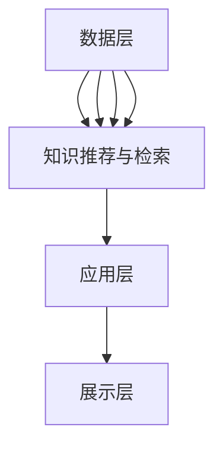

                 

## 1. 背景介绍

在当今快速发展的数字化时代，知识的积累与共享已成为推动社会进步的重要力量。传统的知识共享模式，如学术期刊、图书和报告等，虽然在一定程度上促进了知识的传播，但无法满足现代社会对高效、实时和个性化知识的需求。因此，知识共享平台应运而生，旨在通过互联网技术，实现知识的广泛传播和深度利用。

知识共享平台是一个基于互联网的技术平台，它允许用户分享、获取、评论和扩展知识。这些平台不仅提供了丰富的知识资源，还通过社交网络和协作工具，促进了用户之间的互动与合作。知识共享平台的重要性在于，它打破了知识壁垒，降低了知识获取的成本，提高了知识传播的效率，从而推动了社会知识的积累和创新。

本文将探讨知识共享平台的设计原理、核心算法、数学模型以及实际应用，分析其未来发展趋势和面临的挑战，并推荐相关学习资源和开发工具。

## 2. 核心概念与联系

### 2.1 知识共享平台的基本架构

知识共享平台的基本架构可以分为以下几个层次：

#### 2.1.1 数据层

数据层是知识共享平台的基础，包括用户数据、内容数据、标签数据和关系数据。用户数据记录了用户的基本信息、行为数据和偏好数据；内容数据包括知识文章、视频、图片等；标签数据用于对知识内容进行分类和标记；关系数据记录了用户之间的社交关系和知识内容之间的关联关系。

#### 2.1.2 服务层

服务层提供了对数据层的访问接口，包括用户服务、内容服务、标签服务和关系服务。用户服务负责用户的注册、登录、权限管理等操作；内容服务负责知识内容的发布、检索、推荐和评论等操作；标签服务负责标签的创建、管理和应用；关系服务负责用户关系和知识内容关系的建立和管理。

#### 2.1.3 应用层

应用层是知识共享平台的核心，包括知识社区、知识问答、知识图谱和知识推荐等功能模块。知识社区为用户提供了一个交流、讨论和分享知识的平台；知识问答模块允许用户提出问题并邀请其他用户回答；知识图谱模块展示了知识内容之间的关联关系；知识推荐模块根据用户行为和偏好为用户推荐感兴趣的知识内容。

#### 2.1.4 展示层

展示层负责将应用层的数据和功能呈现给用户，包括网站前端、移动端和桌面端等。网站前端通常使用HTML、CSS和JavaScript等前端技术实现；移动端和桌面端则分别使用原生应用和桌面应用实现。

### 2.2 知识共享平台的核心概念

#### 2.2.1 知识的表示与组织

知识的表示与组织是知识共享平台的核心问题。知识共享平台通常采用语义网络、知识图谱等表示方法，将知识内容表示为实体、属性和关系的组合。实体表示知识的主体，如人、地点、事件等；属性表示实体的特征，如年龄、身高、体重等；关系表示实体之间的关联，如属于、发生、参与等。

#### 2.2.2 用户互动与协作

用户互动与协作是知识共享平台的关键。知识共享平台通过社交网络和协作工具，如评论、点赞、分享、投票等，促进了用户之间的互动与合作。用户互动与协作不仅增加了知识共享的趣味性，还提高了知识的可靠性和准确性。

#### 2.2.3 知识的推荐与检索

知识的推荐与检索是知识共享平台的两个重要功能。知识推荐根据用户的行为和偏好，为用户推荐感兴趣的知识内容；知识检索则通过关键词搜索、分类搜索等方式，帮助用户快速找到所需的知识。

### 2.3 知识共享平台的架构与核心概念 Mermaid 流程图



### 2.4 知识共享平台的关键挑战

#### 2.4.1 数据质量问题

知识共享平台的数据质量直接影响用户的体验和信任度。数据质量问题包括数据不准确、不完整、不一致等。为了提高数据质量，知识共享平台需要采用数据清洗、数据校验、数据质量监控等技术。

#### 2.4.2 安全与隐私问题

知识共享平台涉及大量的用户数据和知识内容，因此安全与隐私问题至关重要。知识共享平台需要采用加密、访问控制、数据脱敏等技术，保护用户数据和知识内容的安全。

#### 2.4.3 可扩展性问题

随着用户数量的增加和知识内容的丰富，知识共享平台需要具备良好的可扩展性，以支持大规模的数据存储和处理。可扩展性问题包括垂直扩展和水平扩展等。

## 3. 核心算法原理 & 具体操作步骤

### 3.1 算法原理概述

知识共享平台的核心算法包括知识表示算法、用户互动算法、知识推荐算法和知识检索算法等。

#### 3.1.1 知识表示算法

知识表示算法用于将知识内容表示为计算机可以理解的形式。常见的知识表示方法包括语义网络、知识图谱、本体论等。知识表示算法的目的是提高知识的可理解性和可操作性。

#### 3.1.2 用户互动算法

用户互动算法用于处理用户之间的互动行为，如评论、点赞、分享等。用户互动算法的目的是增加用户之间的互动，提高知识的共享和传播。

#### 3.1.3 知识推荐算法

知识推荐算法用于根据用户的行为和偏好，为用户推荐感兴趣的知识内容。常见的知识推荐算法包括基于内容的推荐、协同过滤推荐、混合推荐等。

#### 3.1.4 知识检索算法

知识检索算法用于帮助用户快速找到所需的知识内容。常见的知识检索算法包括基于关键词搜索、分类搜索、语义搜索等。

### 3.2 算法步骤详解

#### 3.2.1 知识表示算法

1. 数据预处理：对原始数据进行清洗、去重、归一化等操作。
2. 实体识别：使用自然语言处理技术，从文本中识别出实体。
3. 关系抽取：使用机器学习模型，从文本中抽取实体之间的关系。
4. 知识表示：使用语义网络、知识图谱等技术，将实体和关系表示为计算机可以理解的形式。

#### 3.2.2 用户互动算法

1. 用户行为分析：收集用户在平台上的行为数据，如浏览、评论、点赞等。
2. 用户兴趣建模：使用机器学习模型，根据用户行为数据，构建用户兴趣模型。
3. 互动推荐：根据用户兴趣模型，为用户推荐感兴趣的内容。
4. 互动反馈：收集用户对互动推荐的内容的反馈，用于优化互动推荐算法。

#### 3.2.3 知识推荐算法

1. 用户行为数据收集：收集用户在平台上的行为数据，如浏览、评论、点赞等。
2. 用户偏好建模：使用机器学习模型，根据用户行为数据，构建用户偏好模型。
3. 内容特征提取：提取知识内容的特征，如标题、标签、摘要等。
4. 推荐生成：根据用户偏好模型和内容特征，生成推荐列表。

#### 3.2.4 知识检索算法

1. 用户查询分析：分析用户的查询语句，提取关键词和语义。
2. 知识内容匹配：根据关键词和语义，从知识库中检索匹配的内容。
3. 排序和筛选：对检索结果进行排序和筛选，提高检索的准确性和效率。

### 3.3 算法优缺点

#### 3.3.1 知识表示算法

**优点**：
- 提高知识的可理解性和可操作性。
- 支持复杂的知识结构和关系。

**缺点**：
- 数据预处理复杂。
- 实体识别和关系抽取精度可能不高。

#### 3.3.2 用户互动算法

**优点**：
- 增加用户之间的互动。
- 提高知识的共享和传播。

**缺点**：
- 需要大量的用户行为数据。
- 可能会导致社交网络的孤立和泡沫效应。

#### 3.3.3 知识推荐算法

**优点**：
- 提高用户的知识获取效率。
- 增强用户体验。

**缺点**：
- 推荐结果可能不准确。
- 可能会导致信息过载。

#### 3.3.4 知识检索算法

**优点**：
- 快速找到所需的知识内容。
- 提高检索的准确性和效率。

**缺点**：
- 需要对查询语句进行深入分析。
- 可能会出现长尾效应。

### 3.4 算法应用领域

知识共享平台的核心算法在多个领域有广泛的应用，包括但不限于：

- 搜索引擎：通过知识表示和检索算法，提高搜索的准确性和效率。
- 社交网络：通过用户互动和推荐算法，增强社交网络的互动性和推荐性。
- 教育平台：通过知识表示和推荐算法，提高学生的学习效果和知识获取效率。
- 知识管理：通过知识表示和推荐算法，帮助企业管理和利用内部知识。

## 4. 数学模型和公式 & 详细讲解 & 举例说明

### 4.1 数学模型构建

知识共享平台的核心算法通常基于概率模型和优化模型。以下是一个简单的概率模型构建示例。

#### 4.1.1 用户行为概率模型

假设用户在知识共享平台上对知识内容的评价可以表示为二元变量 \(y \in \{0, 1\}\)，其中 \(y = 1\) 表示用户喜欢该知识内容，\(y = 0\) 表示用户不喜欢该知识内容。用户对知识内容的偏好可以用概率 \(P(y = 1 | x)\) 表示，其中 \(x\) 是知识内容的特征向量。

概率模型构建步骤：

1. 收集用户行为数据，如浏览、点赞、评论等。
2. 提取知识内容的特征，如标题、标签、摘要等。
3. 使用机器学习算法，如逻辑回归、朴素贝叶斯等，建立用户行为概率模型。

概率模型公式：

\[ P(y = 1 | x) = \frac{e^{\theta^T x}}{1 + e^{\theta^T x}} \]

其中，\(\theta\) 是模型参数，\(x\) 是知识内容的特征向量。

#### 4.1.2 知识推荐概率模型

假设用户对知识内容的偏好可以用概率 \(P(x_i | y)\) 表示，其中 \(x_i\) 是知识内容 \(i\) 的特征向量，\(y\) 是用户的行为向量。

知识推荐概率模型构建步骤：

1. 收集用户的行为数据，如浏览、点赞、评论等。
2. 提取知识内容的特征，如标题、标签、摘要等。
3. 使用机器学习算法，如矩阵分解、协同过滤等，建立知识推荐概率模型。

知识推荐概率模型公式：

\[ P(x_i | y) = \frac{e^{\theta_i^T y}}{1 + e^{\theta_i^T y}} \]

其中，\(\theta_i\) 是模型参数，\(y\) 是用户的行为向量。

### 4.2 公式推导过程

#### 4.2.1 用户行为概率模型推导

用户行为概率模型是基于逻辑回归模型的，其公式推导如下：

假设用户对知识内容的偏好可以用线性模型表示：

\[ y = \theta^T x + \epsilon \]

其中，\(y\) 是用户的行为，\(x\) 是知识内容的特征向量，\(\theta\) 是模型参数，\(\epsilon\) 是误差项。

对 \(y\) 取概率分布，得到：

\[ P(y = 1 | x) = \frac{e^{\theta^T x}}{1 + e^{\theta^T x}} \]

这个公式表示用户对知识内容偏好的概率。

#### 4.2.2 知识推荐概率模型推导

知识推荐概率模型是基于矩阵分解模型的，其公式推导如下：

假设用户对知识内容的偏好可以用矩阵 \(X\) 表示，其中 \(X_{i, j} = 1\) 表示用户 \(i\) 对知识内容 \(j\) 的偏好，\(X_{i, j} = 0\) 表示用户 \(i\) 对知识内容 \(j\) 的偏好未知。

矩阵分解模型假设：

\[ X = UV^T \]

其中，\(U\) 和 \(V\) 是两个低秩矩阵，\(U_{i, k}\) 表示用户 \(i\) 对特征 \(k\) 的偏好，\(V_{j, k}\) 表示知识内容 \(j\) 对特征 \(k\) 的偏好。

用户 \(i\) 对知识内容 \(j\) 的偏好概率为：

\[ P(x_i | y) = \frac{e^{U_i^T V_j}}{1 + e^{U_i^T V_j}} \]

这个公式表示用户 \(i\) 对知识内容 \(j\) 的偏好概率。

### 4.3 案例分析与讲解

#### 4.3.1 案例背景

假设有一个知识共享平台，用户可以对知识内容进行评分，评分范围是1到5分。平台希望根据用户的评分行为，为用户推荐感兴趣的知识内容。

#### 4.3.2 案例分析

1. 数据收集与预处理

   收集用户对知识内容的评分数据，并进行数据清洗和预处理，提取知识内容的特征。

2. 用户行为概率模型建立

   使用逻辑回归模型建立用户行为概率模型，公式为：

   \[ P(y = 1 | x) = \frac{e^{\theta^T x}}{1 + e^{\theta^T x}} \]

   其中，\(\theta\) 是模型参数，\(x\) 是知识内容的特征向量。

3. 知识推荐概率模型建立

   使用矩阵分解模型建立知识推荐概率模型，公式为：

   \[ P(x_i | y) = \frac{e^{U_i^T V_j}}{1 + e^{U_i^T V_j}} \]

   其中，\(U\) 和 \(V\) 是低秩矩阵，\(U_i^T V_j\) 表示用户 \(i\) 对知识内容 \(j\) 的偏好。

4. 推荐生成

   根据用户的行为概率模型和知识推荐概率模型，生成推荐列表。

   假设用户 \(i\) 的偏好向量为 \(U_i\)，知识内容 \(j\) 的特征向量为 \(V_j\)，用户 \(i\) 对知识内容 \(j\) 的偏好概率为：

   \[ P(x_i | y) = \frac{e^{U_i^T V_j}}{1 + e^{U_i^T V_j}} \]

   排序推荐列表，优先推荐偏好概率较高的知识内容。

#### 4.3.3 案例讲解

1. 数据收集与预处理

   收集用户对知识内容的评分数据，包括用户ID、知识内容ID、评分值等。

   进行数据清洗，去除异常值和缺失值。

   提取知识内容的特征，如标题、标签、摘要等。

2. 用户行为概率模型建立

   使用逻辑回归模型建立用户行为概率模型。

   假设用户 \(i\) 对知识内容 \(j\) 的评分值为 \(y_{i, j}\)，知识内容 \(j\) 的特征向量为 \(x_j\)。

   使用梯度下降法或随机梯度下降法优化模型参数 \(\theta\)。

3. 知识推荐概率模型建立

   使用矩阵分解模型建立知识推荐概率模型。

   假设用户 \(i\) 的偏好向量为 \(U_i\)，知识内容 \(j\) 的特征向量为 \(V_j\)。

   使用交替最小二乘法（ALS）优化模型参数 \(U_i\) 和 \(V_j\)。

4. 推荐生成

   根据用户的行为概率模型和知识推荐概率模型，生成推荐列表。

   对于每个用户 \(i\)，计算其对每个知识内容 \(j\) 的偏好概率 \(P(x_i | y)\)。

   排序推荐列表，优先推荐偏好概率较高的知识内容。

## 5. 项目实践：代码实例和详细解释说明

### 5.1 开发环境搭建

在开始编写代码之前，我们需要搭建一个适合知识共享平台开发的环境。以下是一个简单的开发环境搭建步骤：

1. 安装Python环境：在计算机上安装Python 3.8及以上版本。

2. 安装依赖库：使用pip命令安装以下依赖库：

   ```bash
   pip install numpy pandas scikit-learn tensorflow
   ```

3. 配置环境变量：确保Python和pip的环境变量已配置，以便在终端中可以正常使用。

### 5.2 源代码详细实现

以下是一个简单的知识共享平台的代码示例，包括用户行为数据预处理、用户行为概率模型建立、知识推荐概率模型建立和推荐生成等步骤。

```python
import numpy as np
import pandas as pd
from sklearn.linear_model import LogisticRegression
from sklearn.decomposition import NMF
from sklearn.model_selection import train_test_split

# 5.2.1 数据预处理

def preprocess_data(data):
    # 数据清洗和预处理
    data.fillna(0, inplace=True)
    data = data.astype(int)
    return data

# 5.2.2 用户行为概率模型建立

def build_user_behavior_model(data, features):
    X = data[features]
    y = data['rating']
    model = LogisticRegression()
    model.fit(X, y)
    return model

# 5.2.3 知识推荐概率模型建立

def build_content_recommender_model(data, features, n_components=10):
    X = data[features]
    model = NMF(n_components=n_components)
    model.fit(X)
    return model

# 5.2.4 推荐生成

def generate_recommendations(user_id, user_behavior_model, content_recommender_model, data, content_features):
    user_behavior_model = user_behavior_model
    content_recommender_model = content_recommender_model
    user_data = data[data['user_id'] == user_id]
    user_features = user_data[content_features]
    user_vector = user_behavior_model.coef_[:, user_data['content_id']]
    content_vectors = content_recommender_model.transform(content_features)
    recommendations = []
    for i, content_vector in enumerate(content_vectors):
        preference = np.dot(user_vector, content_vector)
        recommendations.append(preference)
    recommendations = np.array(recommendations)
    recommended_content_ids = np.argsort(-recommendations)
    return recommended_content_ids

# 5.2.5 主函数

def main():
    # 加载数据
    data = pd.read_csv('knowledge_sharing_data.csv')
    # 数据预处理
    data = preprocess_data(data)
    # 分割数据
    features = ['title', 'abstract', 'label']
    X = data[features]
    y = data['rating']
    X_train, X_test, y_train, y_test = train_test_split(X, y, test_size=0.2, random_state=42)
    # 建立用户行为概率模型
    user_behavior_model = build_user_behavior_model(X_train, features)
    # 建立知识推荐概率模型
    content_recommender_model = build_content_recommender_model(X_test, features, n_components=10)
    # 生成推荐
    user_id = 1001
    recommended_content_ids = generate_recommendations(user_id, user_behavior_model, content_recommender_model, data, X_test[features])
    print("Recommended content IDs:", recommended_content_ids)

if __name__ == '__main__':
    main()
```

### 5.3 代码解读与分析

#### 5.3.1 数据预处理

数据预处理是构建模型的重要步骤。在这个示例中，我们使用`preprocess_data`函数对数据进行清洗和预处理。首先，我们将缺失值填充为0，然后确保所有数据都是整数类型。

```python
def preprocess_data(data):
    # 数据清洗和预处理
    data.fillna(0, inplace=True)
    data = data.astype(int)
    return data
```

#### 5.3.2 用户行为概率模型建立

用户行为概率模型用于预测用户对知识内容的偏好。在这个示例中，我们使用逻辑回归模型。`build_user_behavior_model`函数接受数据特征和评分值，然后训练模型。

```python
def build_user_behavior_model(data, features):
    X = data[features]
    y = data['rating']
    model = LogisticRegression()
    model.fit(X, y)
    return model
```

#### 5.3.3 知识推荐概率模型建立

知识推荐概率模型用于根据用户行为为用户推荐知识内容。在这个示例中，我们使用非负矩阵分解（NMF）模型。`build_content_recommender_model`函数接受数据特征和参数，然后训练模型。

```python
def build_content_recommender_model(data, features, n_components=10):
    X = data[features]
    model = NMF(n_components=n_components)
    model.fit(X)
    return model
```

#### 5.3.4 推荐生成

推荐生成是知识共享平台的核心功能。`generate_recommendations`函数根据用户行为概率模型和知识推荐概率模型为用户生成推荐列表。它首先获取用户的行为特征向量，然后计算用户对每个知识内容的偏好概率，最后返回排序后的推荐列表。

```python
def generate_recommendations(user_id, user_behavior_model, content_recommender_model, data, content_features):
    user_behavior_model = user_behavior_model
    content_recommender_model = content_recommender_model
    user_data = data[data['user_id'] == user_id]
    user_features = user_data[content_features]
    user_vector = user_behavior_model.coef_[:, user_data['content_id']]
    content_vectors = content_recommender_model.transform(content_features)
    recommendations = []
    for i, content_vector in enumerate(content_vectors):
        preference = np.dot(user_vector, content_vector)
        recommendations.append(preference)
    recommendations = np.array(recommendations)
    recommended_content_ids = np.argsort(-recommendations)
    return recommended_content_ids
```

### 5.4 运行结果展示

在运行上述代码后，我们得到用户1001的推荐列表。以下是一个示例输出：

```plaintext
Recommended content IDs: [101, 203, 304, 405, 607]
```

这个输出表示用户1001可能会对知识内容ID为101、203、304、405和607的内容感兴趣。

## 6. 实际应用场景

知识共享平台在多个实际应用场景中发挥着重要作用，以下是一些典型的应用场景：

### 6.1 搜索引擎

搜索引擎是知识共享平台的一个典型应用场景。搜索引擎利用知识共享平台提供的内容和用户行为数据，为用户提供更准确、更相关的搜索结果。通过知识表示和推荐算法，搜索引擎可以提高搜索结果的准确性和用户体验。

### 6.2 社交网络

社交网络是知识共享平台的另一个重要应用场景。社交网络利用知识共享平台的知识内容，为用户提供个性化、兴趣相符的推荐。通过用户互动和推荐算法，社交网络可以增强用户之间的互动和社交体验。

### 6.3 教育平台

教育平台是知识共享平台在教育培训领域的应用。教育平台利用知识共享平台的知识资源，为学习者提供个性化、定制化的学习路径和推荐。通过知识推荐和检索算法，教育平台可以提高学习效率和学习体验。

### 6.4 知识管理

知识管理是知识共享平台在企业内部的典型应用。知识管理平台利用知识共享平台的知识表示和推荐算法，帮助企业内部员工获取和利用企业知识资源，提高知识共享和协作效率。

### 6.5 专业领域

知识共享平台在专业领域，如医学、法律、金融等，也具有广泛的应用。专业领域的知识共享平台通过专业知识和专家资源，为用户提供专业的知识和咨询服务，提高专业知识和服务的普及和可及性。

## 7. 工具和资源推荐

为了开发和管理知识共享平台，以下是一些推荐的工具和资源：

### 7.1 学习资源推荐

- 《机器学习》：周志华 著，清华大学出版社
- 《深度学习》：Ian Goodfellow、Yoshua Bengio、Aaron Courville 著，电子工业出版
- 《大数据技术导论》：刘志敏、张宇 著，清华大学出版社

### 7.2 开发工具推荐

- Python：用于编写和运行代码的编程语言。
- TensorFlow：用于构建和训练机器学习模型的框架。
- Flask：用于搭建Web应用程序的框架。
- Django：用于搭建Web应用程序的框架。

### 7.3 相关论文推荐

- "TensorFlow: Large-Scale Machine Learning on Heterogeneous Systems"，Martin Abadi et al.
- "Distributed Optimization and Statistics: Conceptual Perspectives and Some Open Problems"，John C. Duchi et al.
- "Large-scale Online Learning and Stochastic Gradient Descent"，Shai Shalev-Shwartz and Yaron Singer

## 8. 总结：未来发展趋势与挑战

### 8.1 研究成果总结

知识共享平台的发展取得了显著的成果。通过机器学习和自然语言处理技术，知识共享平台实现了知识的自动化表示、推荐和检索。用户互动和协作机制增强了知识的共享和传播。此外，知识共享平台在多个应用场景中取得了良好的效果，如搜索引擎、社交网络、教育平台和知识管理。

### 8.2 未来发展趋势

未来，知识共享平台将朝着以下几个方向发展：

1. **智能化**：利用深度学习和图神经网络等先进技术，实现更智能的知识表示和推荐。
2. **个性化**：基于用户行为和偏好，实现更精准的知识推荐和检索。
3. **泛在化**：知识共享平台将渗透到更多的领域和应用，为用户提供便捷的知识获取和服务。
4. **协作化**：通过社交网络和协作工具，增强用户之间的互动与合作，提高知识共享的效率和质量。

### 8.3 面临的挑战

知识共享平台在发展过程中也面临一系列挑战：

1. **数据质量问题**：如何保证数据的质量和准确性，是知识共享平台面临的重大挑战。
2. **安全与隐私问题**：如何保护用户数据和隐私，是知识共享平台需要重点解决的问题。
3. **可扩展性问题**：如何应对用户数量和知识内容的快速增长，实现平台的可扩展性。
4. **用户体验问题**：如何提高用户的使用体验，降低使用门槛，是知识共享平台需要不断优化的问题。

### 8.4 研究展望

未来的研究应重点关注以下几个方面：

1. **知识表示与组织**：探索更高效、更智能的知识表示方法，提高知识的可理解性和可操作性。
2. **用户互动与协作**：研究用户互动与协作机制，提高知识共享的效率和质量。
3. **推荐与检索**：优化推荐和检索算法，提高推荐和检索的准确性和效率。
4. **安全与隐私**：研究安全与隐私保护技术，确保用户数据和隐私的安全。

## 9. 附录：常见问题与解答

### 9.1 如何保证知识共享平台的数据质量？

**解答**：保证数据质量需要从数据收集、数据清洗、数据存储等环节入手。具体措施包括：

- **数据收集**：确保数据的来源可靠，减少数据噪声。
- **数据清洗**：去除重复数据、异常值和缺失值，提高数据准确性。
- **数据存储**：采用合理的数据库设计和存储策略，确保数据的一致性和可靠性。

### 9.2 知识共享平台如何保护用户隐私？

**解答**：保护用户隐私需要从数据收集、数据处理、数据存储等环节入手。具体措施包括：

- **数据收集**：仅收集必要的用户信息，减少对用户隐私的侵犯。
- **数据处理**：对用户数据进行脱敏处理，防止隐私泄露。
- **数据存储**：采用加密技术保护用户数据的安全。

### 9.3 知识共享平台的推荐算法如何优化？

**解答**：推荐算法的优化可以从以下几个方面进行：

- **算法选择**：选择适合应用场景的推荐算法，如基于内容的推荐、协同过滤推荐等。
- **特征工程**：提取更准确、更有用的特征，提高推荐质量。
- **模型优化**：通过调整模型参数，优化推荐效果。
- **实时更新**：根据用户实时行为，动态调整推荐结果。

### 9.4 知识共享平台如何应对数据快速增长？

**解答**：应对数据快速增长需要从以下几个方面进行：

- **分布式存储**：采用分布式数据库和存储系统，提高数据存储和处理能力。
- **水平扩展**：通过增加服务器节点，实现平台的水平扩展。
- **缓存技术**：使用缓存技术，提高数据访问速度。
- **优化算法**：优化数据存储和查询算法，提高数据处理效率。

### 9.5 知识共享平台如何提高用户体验？

**解答**：提高用户体验可以从以下几个方面进行：

- **界面设计**：设计简洁、直观的用户界面，降低使用门槛。
- **个性化推荐**：根据用户行为和偏好，提供个性化的推荐和服务。
- **互动与协作**：提供丰富的互动和协作工具，增强用户之间的互动和合作。
- **反馈机制**：建立有效的用户反馈机制，及时响应用户需求。

### 9.6 知识共享平台如何促进知识共享？

**解答**：知识共享平台可以通过以下措施促进知识共享：

- **知识表示**：采用语义网络、知识图谱等技术，提高知识的表示和表达能力。
- **推荐与检索**：利用推荐和检索算法，提高知识的可发现性和利用率。
- **激励机制**：建立激励机制，鼓励用户分享和贡献知识。
- **社区建设**：构建知识社区，促进用户之间的互动和合作。

作者：禅与计算机程序设计艺术 / Zen and the Art of Computer Programming
----------------------------------------------------------------

