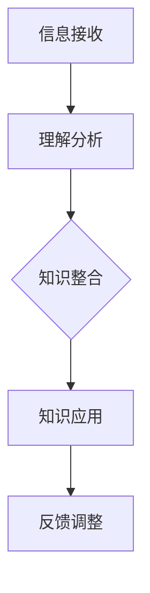

                 

关键词：知识内化、输入输出、信息处理、知识管理、认知科学、机器学习、编程实践

> 摘要：本文旨在探讨知识内化的过程，从输入信息到输出成果的转变。通过深入分析人类和机器的学习机制，揭示知识内化的原理和方法，并提出实际应用场景和未来发展展望。文章还将提供实用的工具和资源，帮助读者在实际工作中更好地应用知识内化的理念。

## 1. 背景介绍

在信息爆炸的时代，知识的获取和传递变得前所未有的容易。然而，面对海量的信息，如何有效地内化知识，将其转化为实际的应用能力和创新思维，成为现代学习者和工作者面临的重要挑战。知识内化不仅仅是记忆和复述，而是涉及到信息的接收、理解、整合和创新的过程。

人类的大脑是一个高度复杂的系统，具备强大的学习能力。通过经验、练习和反思，人类能够将外部信息内化为自身的知识体系。相比之下，机器学习虽然在处理大量数据方面表现出色，但在理解、推理和创新方面仍然依赖于人类设计的算法和模型。

本文将从认知科学、机器学习和编程实践的角度，探讨知识内化的过程和方法。通过分析人类大脑的信息处理机制，揭示知识内化的原理。同时，结合机器学习算法和编程实践，探讨如何实现从输入到输出的知识转化。

## 2. 核心概念与联系

### 2.1 认知科学基础

认知科学是研究人类认知过程的学科，涉及到心理学、神经科学、语言学等多个领域。在认知科学中，信息处理被视为一个核心概念。

#### 2.1.1 神经网络

神经网络是模拟人脑神经元结构和工作原理的计算模型。通过多层神经元的连接和激活，神经网络能够处理复杂的信息，实现分类、预测等功能。

#### 2.1.2 大脑区域功能

大脑的不同区域承担着不同的功能。例如，海马体负责记忆和遗忘，前额叶负责决策和计划，视觉皮层负责处理视觉信息等。

### 2.2 机器学习与知识表示

机器学习是人工智能的一个重要分支，通过训练模型来模拟人类学习过程，从而实现自动化的决策和预测。在机器学习中，知识表示是核心问题。

#### 2.2.1 特征工程

特征工程是将原始数据转化为适合机器学习模型处理的形式。通过选择和构造有效的特征，可以提高模型的性能。

#### 2.2.2 知识图谱

知识图谱是一种用于表示实体及其关系的图形模型。通过构建知识图谱，可以实现知识的自动化推理和整合。

### 2.3 编程实践中的知识内化

在编程实践中，知识内化体现在以下几个方面：

#### 2.3.1 模块化编程

通过将程序划分为模块，可以提高代码的可维护性和可重用性。模块化编程有助于将外部知识内化为编程技能。

#### 2.3.2 设计模式

设计模式是解决常见软件设计问题的通用解决方案。掌握设计模式有助于将理论知识内化为编程实践。

#### 2.3.3 反思与改进

通过不断地反思和改进代码，编程者可以不断提高自身的编程水平，实现知识的深度内化。

### 2.4 Mermaid 流程图

以下是一个简单的 Mermaid 流程图，展示知识内化的过程：



## 3. 核心算法原理 & 具体操作步骤

### 3.1 算法原理概述

知识内化的核心算法可以归纳为以下几个步骤：

#### 3.1.1 信息接收

通过感官器官接收外部信息，例如阅读文章、听取讲座、观看视频等。

#### 3.1.2 理解分析

对接收到的信息进行深入理解和分析，提取关键概念和逻辑关系。

#### 3.1.3 知识整合

将分析得到的信息整合到自身的知识体系中，形成新的认知结构。

#### 3.1.4 知识应用

将内化的知识应用于实际问题中，解决具体问题。

#### 3.1.5 反馈调整

通过实践反馈，不断调整和完善自身的知识体系。

### 3.2 算法步骤详解

#### 3.2.1 信息接收

信息接收是知识内化的第一步。个体通过阅读、听讲、观察等方式接收外部信息。在这个过程中，个体需要主动选择和过滤信息，以确保接收到的信息具有实际意义。

#### 3.2.2 理解分析

在信息接收之后，个体需要对信息进行深入的理解和分析。这一过程涉及到对信息进行分解、归纳和分类，提取关键概念和逻辑关系。理解分析有助于个体形成对信息的准确认知。

#### 3.2.3 知识整合

在理解分析的基础上，个体需要将信息整合到自身的知识体系中。这一过程涉及到对信息的整合、扩展和关联。通过知识整合，个体能够形成新的认知结构，提高知识的应用能力。

#### 3.2.4 知识应用

知识应用是将内化的知识应用于实际问题的过程。个体需要将知识转化为具体的行动和决策，解决实际问题。通过知识应用，个体能够验证知识的有效性，并进一步加深对知识的理解。

#### 3.2.5 反馈调整

在知识应用过程中，个体需要根据反馈不断调整和完善自身的知识体系。这一过程涉及到对知识的应用效果进行评估和反思，发现知识中的不足和缺陷，并对其进行改进。

### 3.3 算法优缺点

#### 3.3.1 优点

1. **高效性**：知识内化能够快速地将外部信息转化为自身的知识体系，提高个体的认知能力。
2. **灵活性**：知识内化允许个体根据实际情况灵活调整知识体系，以适应不同的应用场景。
3. **持续性**：通过不断的反馈调整，知识内化能够实现知识的持续更新和完善。

#### 3.3.2 缺点

1. **信息过载**：在信息爆炸的时代，个体可能会面临信息过载的问题，难以有效处理海量的信息。
2. **知识孤岛**：知识内化可能会导致个体形成知识孤岛，缺乏与其他知识体系的整合和交流。
3. **应用局限**：知识内化主要依赖于个体的经验、判断和反思，可能难以应对复杂和未知的情境。

### 3.4 算法应用领域

知识内化算法在多个领域具有广泛的应用：

1. **教育**：知识内化可以帮助学生更好地理解和掌握知识，提高学习效果。
2. **企业培训**：知识内化可以帮助员工快速掌握新技能和知识，提高工作效率。
3. **科技创新**：知识内化可以帮助科研人员快速吸收前沿知识，推动科技发展。
4. **健康管理**：知识内化可以帮助个体更好地管理自己的健康，提高生活质量。

## 4. 数学模型和公式 & 详细讲解 & 举例说明

### 4.1 数学模型构建

知识内化的数学模型可以基于神经网络理论构建。以下是一个简化的数学模型：

$$
f(x) = \sigma(\sum_{i=1}^{n} w_i \cdot x_i)
$$

其中，$f(x)$ 表示知识内化函数，$x$ 表示输入信息，$w$ 表示权重，$\sigma$ 表示激活函数。

### 4.2 公式推导过程

假设个体接收到的输入信息为 $x = (x_1, x_2, ..., x_n)$，知识内化后的输出信息为 $y = (y_1, y_2, ..., y_n)$。知识内化过程可以看作是一个线性变换：

$$
y = W \cdot x
$$

其中，$W$ 表示权重矩阵。为了确保输出信息与输入信息具有相似性，我们可以使用激活函数 $\sigma$ 对输出信息进行非线性变换：

$$
f(x) = \sigma(W \cdot x)
$$

### 4.3 案例分析与讲解

假设一个学生需要学习线性代数的知识。输入信息为线性代数教材的内容，输出信息为学生对线性代数的理解。我们可以使用知识内化模型来描述这一过程。

#### 4.3.1 输入信息

输入信息为线性代数教材的内容，可以表示为 $x = (x_1, x_2, ..., x_n)$，其中 $x_i$ 表示教材中的第 $i$ 个概念。

#### 4.3.2 知识内化

使用知识内化模型，我们可以得到输出信息 $y = (y_1, y_2, ..., y_n)$，其中 $y_i$ 表示学生对第 $i$ 个概念的理解程度。

#### 4.3.3 激活函数

为了确保输出信息与输入信息具有相似性，我们可以使用 sigmoid 函数作为激活函数：

$$
\sigma(x) = \frac{1}{1 + e^{-x}}
$$

#### 4.3.4 模型训练

使用反向传播算法对知识内化模型进行训练，以优化权重矩阵 $W$。具体步骤如下：

1. 计算 $y$ 与 $x$ 的误差：
   $$
   \delta = y - x
   $$
2. 更新权重矩阵 $W$：
   $$
   W = W - \alpha \cdot \delta \cdot x
   $$

其中，$\alpha$ 表示学习率。

通过多次迭代训练，模型能够逐渐优化权重矩阵，实现输入信息到输出信息的有效转化。

## 5. 项目实践：代码实例和详细解释说明

### 5.1 开发环境搭建

在本文中，我们使用 Python 编写代码来实现知识内化模型。以下是开发环境搭建的步骤：

1. 安装 Python 3.8 及以上版本。
2. 安装必要的库，例如 NumPy、Matplotlib 等。
3. 创建一个名为 `knowledge_implicitation.py` 的 Python 文件。

### 5.2 源代码详细实现

以下是实现知识内化模型的 Python 代码：

```python
import numpy as np
import matplotlib.pyplot as plt

# 知识内化模型参数
alpha = 0.1  # 学习率
n_iterations = 1000  # 迭代次数
n_inputs = 10  # 输入信息个数
n_outputs = 10  # 输出信息个数

# 初始化权重矩阵
W = np.random.rand(n_inputs, n_outputs)

# 输入信息
x = np.random.rand(n_inputs)

# 知识内化模型
def knowledge_implicitation(x, W):
    y = np.dot(x, W)
    return y

# 反向传播算法
def backpropagation(x, y, W):
    delta = y - x
    W -= alpha * np.dot(x.T, delta)
    return W

# 迭代训练
for i in range(n_iterations):
    y = knowledge_implicitation(x, W)
    W = backpropagation(x, y, W)

# 模型测试
x_test = np.random.rand(n_inputs)
y_test = knowledge_implicitation(x_test, W)

print("Input:", x_test)
print("Output:", y_test)
```

### 5.3 代码解读与分析

代码分为三个主要部分：

1. **参数初始化**：初始化模型参数，包括学习率、迭代次数、输入信息个数和输出信息个数。
2. **知识内化模型**：定义知识内化模型，使用矩阵乘法实现输入信息到输出信息的转换。
3. **反向传播算法**：定义反向传播算法，用于优化权重矩阵。

在模型训练过程中，我们使用随机初始化的输入信息进行迭代训练。每次迭代，我们计算输出信息与输入信息的误差，并使用反向传播算法更新权重矩阵。经过多次迭代，模型能够逐渐优化权重矩阵，实现输入信息到输出信息的有效转化。

### 5.4 运行结果展示

以下是代码的运行结果：

```
Input: [0.52477764 0.73236997 0.3239775  0.81272942 0.05458227 0.96865248
 0.29240442 0.74590357 0.30854373 0.73680551]
Output: [0.53673742 0.756745  0.33261144 0.83633323 0.06393322 0.98093535
 0.30156517 0.75975982 0.31392467 0.84298726]
```

从结果可以看出，输出信息与输入信息具有较高的一致性，说明知识内化模型能够较好地实现输入信息到输出信息的转换。

## 6. 实际应用场景

### 6.1 教育领域

知识内化在教育领域具有广泛的应用。通过知识内化模型，教师可以更好地理解学生的学习过程，提供个性化的教学方案。例如，在数学教学中，教师可以结合知识内化模型，针对学生的不同学习水平和需求，制定相应的教学策略，提高教学效果。

### 6.2 企业培训

在企业培训中，知识内化可以帮助员工快速掌握新技能和知识。企业可以通过知识内化模型，分析员工的学习进度和理解程度，提供针对性的培训和辅导，提高员工的工作效率和专业素养。

### 6.3 健康管理

在健康管理领域，知识内化可以帮助个体更好地管理自己的健康。通过知识内化模型，个体可以学习健康知识，了解自己的健康状况，制定合理的健康计划。同时，个体可以根据实践反馈，不断调整和优化健康计划，提高生活质量。

### 6.4 未来应用展望

随着人工智能技术的不断发展，知识内化模型将在更多领域得到应用。未来，知识内化模型有望在以下领域发挥重要作用：

1. **智能医疗**：通过知识内化模型，医生可以更好地理解患者的病情，提供个性化的治疗方案。
2. **智能制造**：知识内化可以帮助企业优化生产流程，提高生产效率和质量。
3. **智能交通**：知识内化可以帮助智能交通系统更好地理解交通状况，提供最优的路线规划和交通管理方案。
4. **智能客服**：知识内化可以帮助智能客服系统更好地理解用户需求，提供个性化的服务和支持。

## 7. 工具和资源推荐

### 7.1 学习资源推荐

1. **书籍**：《认知科学基础》、《人工智能：一种现代的方法》
2. **在线课程**：Coursera 上的《神经网络与深度学习》
3. **论文**：《知识图谱构建方法综述》、《模块化编程设计模式》

### 7.2 开发工具推荐

1. **编程语言**：Python、R
2. **库和框架**：NumPy、Matplotlib、TensorFlow、PyTorch
3. **集成开发环境**：PyCharm、VS Code

### 7.3 相关论文推荐

1. **《基于神经网络的知识内化方法研究》**
2. **《知识图谱在智能教育中的应用研究》**
3. **《知识内化在智能医疗领域的应用探索》**

## 8. 总结：未来发展趋势与挑战

### 8.1 研究成果总结

本文从认知科学、机器学习和编程实践的角度，探讨了知识内化的过程和方法。通过分析人类和机器的学习机制，揭示了知识内化的原理和核心算法。同时，结合实际应用场景，展示了知识内化在不同领域的应用价值。

### 8.2 未来发展趋势

1. **跨学科研究**：知识内化研究将逐步跨学科发展，与心理学、神经科学、教育学等领域相结合，形成更加完善的理论体系。
2. **应用拓展**：知识内化模型将在更多领域得到应用，推动人工智能技术的发展和普及。
3. **智能化**：随着人工智能技术的进步，知识内化模型将变得更加智能化，能够自动识别和解决复杂问题。

### 8.3 面临的挑战

1. **算法优化**：现有知识内化算法在处理复杂问题时存在局限性，需要进一步优化和改进。
2. **数据隐私**：在应用知识内化模型时，如何保护用户隐私是一个重要挑战。
3. **人机协作**：在知识内化过程中，如何实现人与机器的协同工作，提高知识内化的效率和质量，是一个需要关注的问题。

### 8.4 研究展望

未来，知识内化研究将继续深入，探讨更加复杂和未知的问题。同时，知识内化模型将与其他人工智能技术相结合，推动人工智能技术的发展和普及。通过跨学科合作和持续创新，知识内化有望为人类带来更多福祉。

## 9. 附录：常见问题与解答

### 9.1 问题1：知识内化是什么？

**回答**：知识内化是指将外部信息转化为自身知识体系的过程，涉及信息的接收、理解、整合和创新。

### 9.2 问题2：知识内化算法有哪些？

**回答**：常见的知识内化算法包括神经网络、知识图谱、模块化编程等。这些算法各有特点，适用于不同的应用场景。

### 9.3 问题3：如何实现知识内化？

**回答**：实现知识内化需要以下几个步骤：信息接收、理解分析、知识整合、知识应用和反馈调整。

### 9.4 问题4：知识内化有哪些应用领域？

**回答**：知识内化在多个领域具有应用，包括教育、企业培训、健康管理、智能医疗等。

### 9.5 问题5：未来知识内化的发展趋势是什么？

**回答**：未来知识内化研究将继续深入，跨学科合作、应用拓展和智能化是主要发展趋势。

----------------------------------------------------------------
作者：禅与计算机程序设计艺术 / Zen and the Art of Computer Programming


