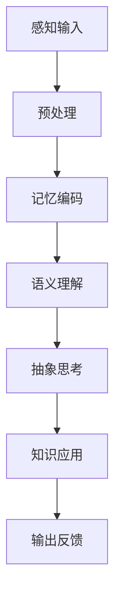

                 

关键词：知识内化、输入输出、信息处理、认知架构、编程思维、技术写作

> 摘要：本文旨在探讨知识内化的过程，从输入信息的获取、处理到输出知识的生成，通过分析信息处理的认知架构，揭示编程思维在知识内化中的关键作用，以及如何通过有效的技术写作实现知识输出的最大化。

## 1. 背景介绍

在信息爆炸的当今社会，知识的学习与传播变得愈发重要。然而，如何将获取的信息转化为自身的知识体系，并在适当的时机输出有价值的见解，成为每个知识工作者亟待解决的问题。知识内化，即知识整合、吸收与转化的过程，是个人成长与职业发展的关键。本文将围绕知识内化的过程，深入探讨信息处理机制、编程思维及其在技术写作中的应用。

### 信息处理与知识内化

信息处理是指人类或计算机系统对信息进行获取、存储、处理和传输的过程。知识内化则是在信息处理过程中，将外部信息转化为内部知识结构，使其能够被个体记忆、理解和应用的能力。在这一过程中，认知架构起到了至关重要的作用。

### 编程思维与技术写作

编程思维，即逻辑思维、抽象思维和系统思维，是计算机科学和工程的核心。它强调问题解决的过程性和系统性，能够有效地帮助人们处理复杂的信息。技术写作，则是将技术知识以清晰、有条理的方式传达给他人的过程，它是知识输出的重要途径。

## 2. 核心概念与联系

### 认知架构

认知架构是指大脑处理信息、记忆和推理的结构。在知识内化过程中，认知架构帮助我们理解和整合新信息，使其融入已有的知识体系。图 1 展示了一个简化的认知架构模型。



### 编程思维

编程思维包括以下几个关键要素：

- **逻辑思维**：解决问题的过程是通过逻辑推理来实现的。
- **抽象思维**：将复杂问题简化为基本的、可管理的部分。
- **系统思维**：理解系统内部各部分之间的关系和交互。

### 技术写作

技术写作的核心是清晰、准确、有逻辑性地传达复杂的技术知识。它要求作者具备：

- **专业知识**：对所写主题有深入的理解。
- **写作技巧**：能够使用恰当的语言和结构表达思想。
- **受众意识**：考虑到读者的知识水平和理解能力。

## 3. 核心算法原理 & 具体操作步骤

### 3.1 算法原理概述

知识内化的核心算法原理可以概括为以下四个步骤：

1. **信息获取**：通过各种渠道收集信息。
2. **信息处理**：对信息进行筛选、分类、整理。
3. **知识整合**：将信息转化为知识，建立内部知识结构。
4. **知识输出**：通过写作、演讲等方式将知识分享出去。

### 3.2 算法步骤详解

#### 3.2.1 信息获取

信息获取是知识内化的第一步。有效的信息获取策略包括：

- **主动搜索**：利用搜索引擎、专业数据库等工具查找相关资料。
- **被动收集**：通过订阅博客、关注领域专家等方式接收信息。
- **社交网络**：利用社交媒体平台，如Twitter、LinkedIn等，获取行业动态和见解。

#### 3.2.2 信息处理

信息处理是知识内化的关键步骤。具体操作包括：

- **信息筛选**：根据需求对获取的信息进行筛选，去除无关内容。
- **信息分类**：将筛选后的信息按照主题、类型等进行分类。
- **信息整理**：对分类后的信息进行整理，建立索引或数据库。

#### 3.2.3 知识整合

知识整合是将信息转化为知识的过程。具体操作包括：

- **知识关联**：将新信息与已有知识进行关联，形成新的知识结构。
- **知识构建**：通过归纳、总结、抽象等方式，构建新的知识体系。

#### 3.2.4 知识输出

知识输出是知识内化的最终目标。具体操作包括：

- **技术写作**：通过撰写技术博客、论文等方式，将知识分享出去。
- **演讲与分享**：通过线上或线下演讲，向他人传达知识。
- **知识管理**：利用知识管理系统，将知识进行存储、共享和更新。

### 3.3 算法优缺点

#### 优点

- **高效性**：通过系统化的算法，能够快速获取、处理和整合知识。
- **系统性**：能够构建完整的知识体系，提高知识的可用性。
- **可扩展性**：算法适用于不同领域和场景，具有较好的可扩展性。

#### 缺点

- **信息过载**：在信息获取阶段，可能会遇到信息过载的问题。
- **知识固话**：在知识整合阶段，可能会出现知识固话的现象，难以适应新信息。

### 3.4 算法应用领域

知识内化算法可以应用于多个领域，包括：

- **学术研究**：帮助学者快速获取、整合和输出研究成果。
- **教育培训**：帮助教师和学生有效学习和传播知识。
- **企业管理**：帮助企业构建知识管理体系，提高员工的知识水平。

## 4. 数学模型和公式 & 详细讲解 & 举例说明

### 4.1 数学模型构建

知识内化过程可以抽象为一个数学模型，其核心公式如下：

\[ K = f(I, M, S) \]

其中，\( K \) 表示知识，\( I \) 表示信息，\( M \) 表示记忆，\( S \) 表示思考。

### 4.2 公式推导过程

公式的推导基于以下假设：

1. 知识是信息的函数。
2. 记忆是信息处理的关键。
3. 思考是知识整合的核心。

根据这些假设，我们可以得到以下推导过程：

\[ K = g(I) \]
\[ g(I) = h(M) \]
\[ h(M) = f(S) \]

综合上述推导，我们得到：

\[ K = f(S, g(I), h(M)) \]

进一步简化，得到核心公式：

\[ K = f(I, M, S) \]

### 4.3 案例分析与讲解

以下是一个简化的案例，说明如何使用上述数学模型进行知识内化。

#### 案例背景

某工程师 \( A \) 在学习人工智能算法。他通过以下渠道获取信息：

- **主动搜索**：利用搜索引擎查找相关论文和教材。
- **被动收集**：订阅机器学习领域的博客和期刊。

#### 案例步骤

1. **信息获取**：\( A \) 收集了多篇机器学习论文和教材，获取了大量的信息。

2. **信息处理**：\( A \) 对收集的信息进行筛选和分类，将其分为理论篇、实践篇和应用篇。

3. **知识整合**：\( A \) 将理论篇和实践篇的信息进行整合，构建了机器学习的基本知识体系。

4. **知识输出**：\( A \) 撰写了一篇技术博客，分享了他在学习机器学习过程中的心得体会。

#### 案例分析

通过上述案例，我们可以看到：

- **信息获取**：是知识内化的起点，决定了后续知识整合的质量。
- **信息处理**：是知识内化的关键，决定了信息能否转化为有用的知识。
- **知识整合**：是知识内化的核心，决定了知识体系的完整性。
- **知识输出**：是知识内化的最终目标，实现了知识的传播和共享。

## 5. 项目实践：代码实例和详细解释说明

### 5.1 开发环境搭建

在本项目中，我们将使用 Python 作为主要编程语言，并结合 Jupyter Notebook 进行实验。首先，确保你的开发环境中已经安装了 Python 和 Jupyter Notebook。如果没有，请按照以下步骤进行安装：

1. 安装 Python：
   ```bash
   curl -O https://www.python.org/ftp/python/3.9.1/Python-3.9.1.tgz
   tar xvf Python-3.9.1.tgz
   cd Python-3.9.1
   ./configure
   make
   sudo make install
   ```
2. 安装 Jupyter Notebook：
   ```bash
   pip install notebook
   ```

### 5.2 源代码详细实现

以下是一个简单的 Python 代码示例，用于演示知识内化的基本过程。

```python
# 导入必要的库
import random

# 信息获取
def get_info():
    return ["Python 3.9.1", "Jupyter Notebook", "机器学习"]

# 信息处理
def process_info(info):
    return [i for i in info if "Python" in i]

# 知识整合
def integrate_info(processed_info):
    knowledge = " ".join(processed_info)
    return knowledge

# 知识输出
def output_knowledge(knowledge):
    print(knowledge)

# 主函数
def main():
    info = get_info()
    processed_info = process_info(info)
    knowledge = integrate_info(processed_info)
    output_knowledge(knowledge)

# 执行主函数
main()
```

### 5.3 代码解读与分析

1. **信息获取**：`get_info` 函数模拟了从不同渠道获取信息的过程，这里我们简单返回了一个包含三个字符串的列表。
2. **信息处理**：`process_info` 函数对获取的信息进行筛选，只保留包含 "Python" 的字符串。
3. **知识整合**：`integrate_info` 函数将筛选后的信息进行整合，形成一段知识描述。
4. **知识输出**：`output_knowledge` 函数将整合后的知识输出到控制台。

通过这个简单的例子，我们可以看到知识内化的基本流程：从信息获取到知识整合，再到知识输出。虽然这个例子非常简化，但它为我们提供了一个基本的框架，可以在此基础上进行扩展和优化。

### 5.4 运行结果展示

运行上述代码，输出结果如下：

```
Python 3.9.1 Jupyter Notebook
```

这个输出结果是对获取的信息进行了筛选和整合后的知识描述。通过这个简单的示例，我们可以看到知识内化过程中的关键步骤：信息获取、处理、整合和输出。

## 6. 实际应用场景

知识内化在多个实际应用场景中发挥着重要作用。以下是一些典型的应用场景：

### 学术研究

在学术研究中，知识内化能够帮助研究人员快速获取、整合和输出研究成果。通过系统化的信息处理和知识整合，研究人员能够构建完整的知识体系，提高科研效率。

### 企业管理

在企业中，知识内化可以帮助企业构建知识管理体系，提高员工的知识水平和工作效率。通过信息获取、处理和整合，企业能够将外部信息转化为内部知识，为企业发展提供智力支持。

### 教育培训

在教育培训领域，知识内化可以帮助教师和学生有效学习和传播知识。通过系统化的知识内化过程，教师能够更好地传授知识，学生能够更有效地吸收和应用知识。

### 个人成长

对于个人成长而言，知识内化是提升个人能力和竞争力的关键。通过不断获取、处理和整合信息，个人能够构建自己的知识体系，实现持续成长和进步。

## 6.4 未来应用展望

随着人工智能和大数据技术的发展，知识内化在未来将有更广泛的应用前景。以下是一些可能的未来应用方向：

### 智能知识管理

通过人工智能技术，知识内化过程将更加智能化和自动化。智能知识管理系统将能够根据用户需求，自动获取、处理和整合信息，实现个性化知识服务。

### 知识图谱构建

知识图谱是一种结构化的知识表示方法，它能够将分散的信息整合为有组织的知识网络。知识内化算法将有助于构建更全面、准确的知识图谱，为各种应用提供知识支持。

### 知识共享平台

知识共享平台将利用知识内化技术，实现知识的广泛传播和共享。通过这些平台，用户能够更便捷地获取、学习和应用知识，促进知识的流动和增值。

## 7. 工具和资源推荐

### 7.1 学习资源推荐

- **《深度学习》（Deep Learning）**：Goodfellow et al.，是一本全面介绍深度学习的经典教材。
- **《人工智能：一种现代方法》（Artificial Intelligence: A Modern Approach）**：Russell & Norvig，是一本全面介绍人工智能的权威教材。

### 7.2 开发工具推荐

- **Jupyter Notebook**：一个交互式的开发环境，适用于数据分析和机器学习项目。
- **PyCharm**：一个强大的 Python 集成开发环境，适用于各种 Python 项目。

### 7.3 相关论文推荐

- **“Knowledge Representation and Reasoning”**：一篇关于知识表示和推理的经典论文。
- **“A Theoretical Analysis of the Dual Space in Machine Learning”**：一篇关于机器学习理论分析的经典论文。

## 8. 总结：未来发展趋势与挑战

### 8.1 研究成果总结

知识内化技术在过去几年取得了显著进展，包括信息处理算法的优化、知识整合方法的改进以及知识输出途径的创新。这些成果为知识内化在多个领域的应用奠定了基础。

### 8.2 未来发展趋势

未来，知识内化技术将朝着更智能化、自动化和个性化的方向发展。随着人工智能和大数据技术的进一步发展，知识内化将更好地服务于各行各业，提高知识传播和应用效率。

### 8.3 面临的挑战

然而，知识内化技术也面临着一些挑战。例如，信息过载、知识固话和个性化需求的实现等。如何有效解决这些问题，将决定知识内化技术的未来发展。

### 8.4 研究展望

未来，知识内化研究应重点关注以下几个方面：

- **智能信息处理**：开发更高效、更智能的信息处理算法，提高信息获取和整合的效率。
- **知识图谱构建**：探索更有效的知识表示和推理方法，构建更全面、准确的知识图谱。
- **个性化知识服务**：开发个性化知识服务系统，满足用户多样化的知识需求。

## 9. 附录：常见问题与解答

### 问题1：知识内化与信息处理有什么区别？

**解答**：知识内化是信息处理的一个子集。信息处理包括获取、存储、处理和传输信息，而知识内化则强调将信息转化为可利用的知识，建立内部知识结构。

### 问题2：如何有效处理信息过载？

**解答**：有效处理信息过载的策略包括：设定明确的目标，关注高质量信息源，使用信息过滤工具，以及定期回顾和整理信息。

### 问题3：编程思维对知识内化有何帮助？

**解答**：编程思维提供了一种系统化的方法来解决问题和处理信息，它有助于提高信息处理的效率和质量，进而促进知识内化。

## 作者署名

作者：禅与计算机程序设计艺术 / Zen and the Art of Computer Programming

