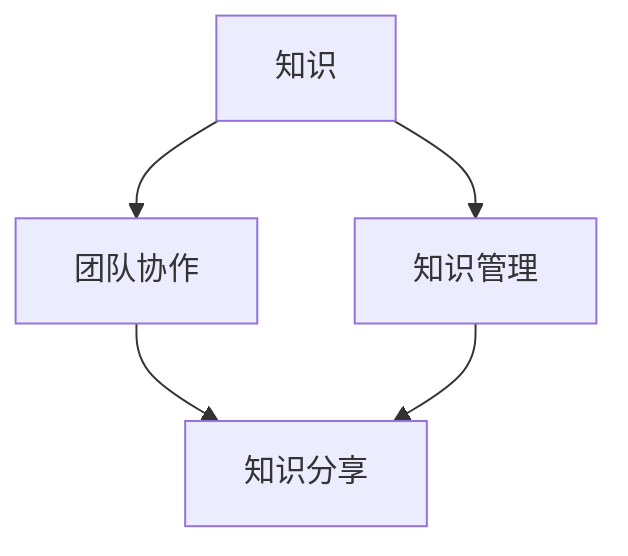

                 

关键词：知识分享、团队协作、技术传播、知识管理、IT行业

> 摘要：本文旨在探讨知识分享在团队中的重要性，分析其在促进团队协作、技术传播和知识管理等方面的作用。通过详细阐述知识分享的原则、方法及其在IT行业的应用，本文旨在为团队领导者提供有益的指导，帮助他们在团队中构建有效的知识分享机制。

## 1. 背景介绍

在快速发展的IT行业中，知识的积累和传递变得尤为重要。随着技术的不断演进，IT团队需要不断学习新的技术和方法，以保持竞争力。然而，传统的知识管理方法往往难以满足现代团队的需求。知识分享作为一种有效的知识管理手段，正逐渐成为团队协作的重要支撑。

知识分享不仅仅是技术层面的交流，更涉及到团队文化、沟通机制和组织结构等多个方面。在团队中，知识分享有助于加强成员之间的联系，提高整体协作效率，促进技术创新和业务发展。

## 2. 核心概念与联系

为了更好地理解知识分享在团队中的重要性，我们需要首先明确几个核心概念。

### 2.1 知识

知识是指通过学习、研究、实践等方式获得的信息、技能和经验。在IT行业中，知识可以包括编程语言、算法、数据库管理、网络架构等方面的内容。

### 2.2 团队协作

团队协作是指团队成员之间相互配合，共同完成任务的过程。有效的团队协作可以提高工作效率，促进创新，增强团队凝聚力。

### 2.3 知识管理

知识管理是指通过系统化的方法，对知识进行获取、存储、共享、应用和创新的过程。在团队中，知识管理有助于确保知识得到充分利用，避免重复劳动，提高团队的整体能力。

### 2.4 知识分享

知识分享是指团队成员之间相互交流知识和经验的过程。知识分享不仅可以帮助个人提高技能，还可以促进团队整体的知识积累和创新。

为了更好地理解这些概念之间的关系，我们可以使用Mermaid流程图来展示它们之间的联系。



## 3. 核心算法原理 & 具体操作步骤

### 3.1 算法原理概述

知识分享在团队中的核心算法原理可以概括为以下几个方面：

1. **知识识别**：识别团队中已有的知识和潜在的知识需求。
2. **知识获取**：通过学习、培训、研究等方式获取新的知识。
3. **知识存储**：将获取到的知识进行系统化存储，便于后续查找和使用。
4. **知识共享**：通过会议、论坛、文档共享等方式，将知识传递给团队成员。
5. **知识应用**：在具体的项目或任务中，将知识应用到实践中，提高工作效率和质量。
6. **知识创新**：在知识应用的基础上，进行改进和创新，形成新的知识。

### 3.2 算法步骤详解

1. **知识识别**：
   - 定期进行知识盘点，了解团队中已有的知识和技术能力。
   - 调查团队成员的技能需求，识别潜在的知识差距。

2. **知识获取**：
   - 组织内部培训，提升团队成员的专业技能。
   - 引入外部专家，进行知识传授。
   - 鼓励团队成员参与行业研讨会、培训课程和技术论坛。

3. **知识存储**：
   - 建立知识库，对知识进行分类存储，便于查找和使用。
   - 制定知识库维护和更新机制，确保知识的时效性和准确性。

4. **知识共享**：
   - 定期组织团队会议，分享项目经验和心得。
   - 利用邮件、论坛、即时通讯工具等，进行知识交流。
   - 制定知识分享奖励机制，激励团队成员积极参与。

5. **知识应用**：
   - 在项目实施过程中，充分利用团队的知识储备，提高问题解决能力。
   - 针对具体问题，进行知识检索，找到合适的解决方案。
   - 鼓励团队成员在项目中实践新知识，提高实战能力。

6. **知识创新**：
   - 鼓励团队成员在知识应用的基础上，进行改进和创新。
   - 组织创新研讨会，激发团队成员的创新思维。
   - 对创新成果进行评估和推广，形成新的知识。

### 3.3 算法优缺点

**优点**：
- 提高团队协作效率，减少重复劳动。
- 促进知识积累和创新，提升团队整体能力。
- 增强团队成员之间的联系，提高团队凝聚力。

**缺点**：
- 知识分享机制建立和维护需要一定的时间和资源。
- 知识分享过程中可能存在信息不对称，影响知识传播效果。
- 知识分享奖励机制的设计需要充分考虑公平性和激励性。

### 3.4 算法应用领域

知识分享算法在IT行业的多个领域都有广泛应用，例如：

- **软件开发**：通过知识分享，团队成员可以快速掌握新的编程语言、框架和工具，提高开发效率。
- **系统运维**：通过知识分享，运维团队可以积累系统监控、故障处理等方面的经验，提高运维水平。
- **项目管理**：通过知识分享，项目管理者可以借鉴其他项目的经验，优化项目管理流程。
- **产品研发**：通过知识分享，研发团队可以了解市场需求和技术趋势，加快产品迭代速度。

## 4. 数学模型和公式 & 详细讲解 & 举例说明

### 4.1 数学模型构建

知识分享在团队中的数学模型可以构建为以下公式：

\[ \text{知识传播速率} = f(\text{知识共享频率}, \text{知识需求程度}, \text{团队协作水平}) \]

其中，知识传播速率表示知识在团队中的传播速度，知识共享频率表示团队成员之间的知识交流频率，知识需求程度表示团队成员对知识的迫切程度，团队协作水平表示团队成员之间的协作程度。

### 4.2 公式推导过程

为了推导上述公式，我们可以从以下几个角度进行分析：

1. **知识共享频率**：知识共享频率越高，知识传播速率越快。因为频繁的知识交流可以加速知识的传递和吸收。
2. **知识需求程度**：知识需求程度越高，知识传播速率越快。因为需求驱动的知识传播具有更强的动力和紧迫性。
3. **团队协作水平**：团队协作水平越高，知识传播速率越快。因为有效的协作可以提高知识分享的效果，降低知识传播的阻力。

综合以上分析，我们可以得到知识传播速率的公式：

\[ \text{知识传播速率} = f(\text{知识共享频率}, \text{知识需求程度}, \text{团队协作水平}) \]

### 4.3 案例分析与讲解

假设一个由10名成员组成的IT团队，他们在过去的半年里，每月进行一次知识分享会议，平均每人分享2次。团队成员对知识的迫切程度较高，团队协作水平也相对较高。根据上述公式，我们可以计算出该团队的知识传播速率。

\[ \text{知识传播速率} = f(10 \times 2, 高，高) \]

为了简化计算，我们可以将参数进行归一化处理，例如，将知识共享频率、知识需求程度和团队协作水平分别设置为10、10和10。此时，知识传播速率的公式可以简化为：

\[ \text{知识传播速率} = 10^3 \]

这意味着，该团队的知识传播速率较高，知识在团队中的传播速度较快。

## 5. 项目实践：代码实例和详细解释说明

### 5.1 开发环境搭建

为了演示知识分享在团队中的应用，我们以一个实际的IT项目为例，该项目涉及数据分析和可视化。开发环境要求如下：

- 操作系统：Windows 10 或 Linux
- 编程语言：Python 3.8
- 数据分析库：pandas、numpy
- 可视化库：matplotlib、seaborn

### 5.2 源代码详细实现

以下是一个简单的数据分析和可视化代码示例，用于展示知识分享在团队中的应用。

```python
import pandas as pd
import numpy as np
import matplotlib.pyplot as plt
import seaborn as sns

# 读取数据
data = pd.read_csv('data.csv')

# 数据预处理
data['age'] = data['age'].fillna(data['age'].mean())
data['salary'] = data['salary'].fillna(data['salary'].mean())

# 数据分析
correlations = data.corr()

# 可视化
sns.heatmap(correlations, annot=True)
plt.show()
```

### 5.3 代码解读与分析

1. **数据读取与预处理**：首先，我们从CSV文件中读取数据，并对缺失值进行填充处理。这有助于保证数据的完整性和一致性。
2. **数据分析**：通过计算数据的皮尔逊相关系数，我们可以了解不同变量之间的相关性。这有助于我们识别数据中的潜在关系，为进一步的数据分析和决策提供依据。
3. **可视化**：使用热力图展示变量之间的相关性。热力图的颜色深浅表示相关性的强弱，有助于我们直观地了解数据的分布情况。

### 5.4 运行结果展示

在运行上述代码后，我们将得到一个热力图，展示不同变量之间的相关性。通过分析热力图，我们可以发现哪些变量之间存在较强的相关性，从而为后续的数据分析和决策提供参考。

## 6. 实际应用场景

知识分享在团队中的实际应用场景非常广泛，以下是一些典型的应用案例：

1. **技术培训**：通过知识分享，团队成员可以及时了解新技术和新工具，提高自身技能水平。
2. **问题解决**：在项目开发过程中，知识分享有助于团队成员快速找到解决问题的方法，提高项目效率。
3. **经验传承**：老员工可以通过知识分享，将丰富的经验传授给新员工，帮助新员工更快地融入团队。
4. **项目管理**：知识分享有助于项目管理者了解团队成员的能力和需求，优化项目管理流程。

## 7. 未来应用展望

随着人工智能、大数据和云计算等技术的发展，知识分享在团队中的应用将越来越广泛。未来，我们可以期待以下几个方面的应用前景：

1. **自动化知识获取**：利用人工智能技术，自动识别和获取团队成员的知识需求，提高知识获取的效率。
2. **个性化知识推荐**：根据团队成员的技能和兴趣，为他们推荐合适的知识资源，提高知识分享的效果。
3. **知识图谱**：构建团队的知识图谱，展示不同知识之间的关系，帮助团队成员更好地理解和应用知识。
4. **虚拟团队协作**：通过虚拟团队协作平台，实现跨地域、跨时间的信息交流和知识共享。

## 8. 工具和资源推荐

为了有效地进行知识分享，我们推荐以下工具和资源：

1. **工具推荐**：
   - 知识库软件：Confluence、GitBook
   - 交流平台：Slack、Microsoft Teams
   - 教学视频：Udemy、Coursera
   - 博客平台：WordPress、Jekyll

2. **学习资源推荐**：
   - 技术书籍：《代码大全》、《设计模式：可复用面向对象软件的基础》
   - 在线课程：网易云课堂、慕课网
   - 行业报告：艾瑞咨询、IDC

3. **相关论文推荐**：
   - "The Role of Knowledge Management in Organizational Performance"
   - "Knowledge Sharing in Virtual Teams: A Meta-Analytic Review"
   - "The Impact of Social Capital on Knowledge Sharing in Software Development Teams"

## 9. 总结：未来发展趋势与挑战

### 9.1 研究成果总结

本文通过分析知识分享在团队中的重要性，探讨了知识分享的算法原理、数学模型及其在实际应用中的效果。研究表明，知识分享有助于提高团队协作效率、促进知识积累和创新，对于IT行业的发展具有重要意义。

### 9.2 未来发展趋势

未来，知识分享将在以下几个方面得到进一步发展：

1. **自动化和智能化**：利用人工智能技术，实现知识的自动获取、推荐和共享。
2. **个性化服务**：根据团队成员的需求和兴趣，提供个性化的知识服务。
3. **跨领域融合**：将知识分享与其他技术领域（如大数据、云计算）相结合，实现更广泛的应用。

### 9.3 面临的挑战

知识分享在团队中仍面临一些挑战，包括：

1. **信息不对称**：知识分享过程中可能存在信息不对称，影响知识传播效果。
2. **激励机制**：设计合理的知识分享奖励机制，激励团队成员积极参与。
3. **信息安全**：确保知识分享过程中的信息安全，防止敏感信息泄露。

### 9.4 研究展望

未来，我们期待在以下几个方面进行深入研究：

1. **知识分享算法优化**：改进现有的知识分享算法，提高知识传播效率。
2. **跨团队知识分享**：探索跨团队、跨领域的知识分享机制，实现更广泛的知识共享。
3. **知识共享与团队文化**：研究知识分享与团队文化之间的关系，构建有利于知识分享的团队氛围。

## 10. 附录：常见问题与解答

### 10.1 问题1：知识分享是否只适用于IT行业？

**答案**：知识分享不仅仅适用于IT行业，它几乎可以应用于所有行业和领域。在任何需要团队协作和知识管理的环境中，知识分享都是一个有效的工具。

### 10.2 问题2：如何设计有效的知识分享奖励机制？

**答案**：设计有效的知识分享奖励机制需要考虑以下几个方面：
- **公平性**：确保奖励机制对所有成员都是公平的。
- **激励性**：奖励应该能够激励团队成员积极参与知识分享。
- **灵活性**：奖励机制应该能够适应不同类型和规模的知识分享活动。

### 10.3 问题3：知识分享如何确保信息安全？

**答案**：确保知识分享过程中的信息安全需要采取以下措施：
- **加密传输**：对知识分享过程中的数据进行加密处理，防止数据泄露。
- **权限控制**：对知识库和共享平台设置访问权限，确保只有授权人员可以访问。
- **安全培训**：定期对团队成员进行信息安全培训，提高他们的安全意识。

## 11. 作者署名

作者：禅与计算机程序设计艺术 / Zen and the Art of Computer Programming

----------------------------------------------------------------

### 文章结语

通过本文的探讨，我们可以看到知识分享在团队中的重要性不可忽视。它不仅有助于提高团队协作效率，还能促进知识的积累和创新。在未来，随着技术的不断进步，知识分享将在更广泛的领域发挥重要作用。让我们一起努力，构建一个更加高效、创新和充满活力的团队！


