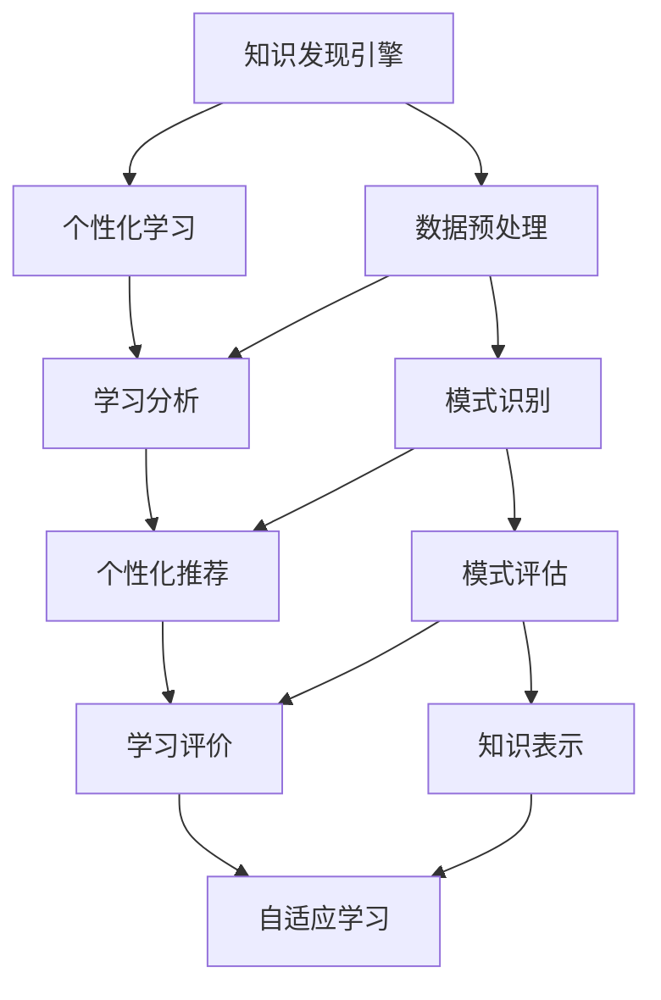

                 

知识发现引擎和个性化学习是当今人工智能领域的两个前沿方向。知识发现引擎旨在从大规模数据中提取有价值的信息和模式，而个性化学习则致力于根据每个学习者的特点提供个性化的教育内容和体验。本文将深入探讨这两者的原理、应用，以及未来的发展方向。

> **关键词**：知识发现引擎、个性化学习、人工智能、机器学习、数据挖掘

> **摘要**：本文首先介绍了知识发现引擎的基本概念和工作原理，然后探讨了个性化学习的原理和实现方法。接着，文章通过数学模型和具体算法详细讲解了知识发现和个性化学习的核心技术和步骤。此外，文章还提供了代码实例和实际应用场景，展示了知识发现引擎和个性化学习在教育和商业领域的广泛应用。最后，文章展望了未来知识发现引擎和个性化学习的发展趋势和面临的挑战。

## 1. 背景介绍

随着互联网的普及和大数据技术的发展，海量的数据已成为现代社会的重要资源。然而，如何从这些数据中提取有价值的信息和知识，成为了一个亟待解决的问题。知识发现引擎应运而生，其目标是从大规模数据中自动识别出隐含的、有价值的模式或知识。

与此同时，传统的教育模式逐渐暴露出其局限性，无法满足每个学生的个性化学习需求。个性化学习旨在根据学生的兴趣、能力和学习进度，提供个性化的教育内容和学习体验。这种个性化的学习方式不仅能够提高学习效率，还能激发学生的学习兴趣和创造力。

知识发现引擎和个性化学习相辅相成，知识发现引擎为个性化学习提供了丰富的学习资源，而个性化学习则为知识发现引擎提供了用户反馈和改进方向。二者共同推动着人工智能在教育领域的发展。

## 2. 核心概念与联系

### 2.1 知识发现引擎

知识发现引擎是一种自动化的数据挖掘技术，旨在从大规模数据集中发现潜在的、有价值的信息和知识。其主要任务包括数据预处理、模式识别、模式评估和知识表示等。

### 2.2 个性化学习

个性化学习是一种基于人工智能和机器学习技术的教育模式，旨在根据每个学习者的特点提供个性化的教育内容和学习体验。个性化学习通常包括学习分析、个性化推荐、学习评价和自适应学习等环节。

### 2.3 Mermaid 流程图

下面是一个 Mermaid 流程图，展示了知识发现引擎和个性化学习的核心概念及其联系：



## 3. 核心算法原理 & 具体操作步骤

### 3.1 算法原理概述

知识发现引擎和个性化学习涉及多种核心算法，包括数据挖掘算法、机器学习算法和推荐系统算法。这些算法共同构成了知识发现和个性化学习的技术基础。

### 3.2 算法步骤详解

#### 3.2.1 知识发现引擎

1. 数据预处理：包括数据清洗、数据整合和数据转换等步骤，为后续的数据挖掘任务做好准备。
2. 模式识别：通过聚类、分类、关联规则挖掘等方法，从大规模数据中提取潜在的、有价值的信息和知识。
3. 模式评估：对识别出的模式进行评估，判断其是否具有实用价值。
4. 知识表示：将识别出的知识以易于理解的形式表示出来，如知识图谱、决策树等。

#### 3.2.2 个性化学习

1. 学习分析：通过分析学习者的行为数据，了解其兴趣、能力和学习进度等特征。
2. 个性化推荐：基于学习分析结果，为学习者推荐个性化的学习内容和资源。
3. 学习评价：对学习者的学习效果进行评价，以调整个性化推荐策略。
4. 自适应学习：根据学习者的反馈和学习效果，动态调整学习内容和方式。

### 3.3 算法优缺点

#### 3.3.1 知识发现引擎

优点：能够自动从大规模数据中提取有价值的信息和知识，提高数据利用效率。

缺点：对数据质量要求较高，可能存在过拟合和泛化能力不足等问题。

#### 3.3.2 个性化学习

优点：能够满足学习者的个性化需求，提高学习效率和效果。

缺点：对学习者的行为数据依赖较大，可能导致隐私泄露和个性化过强等问题。

### 3.4 算法应用领域

知识发现引擎和个性化学习广泛应用于教育、金融、医疗、电子商务等领域，为各行业提供了强有力的数据支持和个性化服务。

## 4. 数学模型和公式 & 详细讲解 & 举例说明

### 4.1 数学模型构建

#### 4.1.1 知识发现引擎

1. 聚类算法：使用聚类系数表示数据点之间的相似性，构建聚类模型。

$$
sim(i, j) = \frac{1}{|\Sigma|} \sum_{k=1}^{|\Sigma|} \frac{count(k, i) \cdot count(k, j)}{count(k, i) + count(k, j)}
$$

其中，$sim(i, j)$ 表示数据点 $i$ 和 $j$ 之间的相似性，$count(k, i)$ 和 $count(k, j)$ 分别表示数据点 $i$ 和 $j$ 在第 $k$ 个特征上的取值。

2. 分类算法：使用决策树或支持向量机等分类模型，对数据进行分类。

$$
f(x) = \sum_{i=1}^{n} w_i \cdot g(x; \theta_i)
$$

其中，$f(x)$ 表示数据点 $x$ 的分类结果，$w_i$ 和 $\theta_i$ 分别表示第 $i$ 个分类器的权重和参数。

#### 4.1.2 个性化学习

1. 推荐算法：使用协同过滤或基于内容的推荐算法，为学习者推荐个性化学习资源。

$$
r(u, i) = \sum_{j \in N(u)} \frac{sim(u, j) \cdot rating(j, i)}{|\{j \in N(u) : rating(u, j) \neq 0\}|}
$$

其中，$r(u, i)$ 表示学习者 $u$ 对学习资源 $i$ 的评分预测，$sim(u, j)$ 表示学习者 $u$ 和 $j$ 之间的相似性，$rating(j, i)$ 表示学习者 $j$ 对学习资源 $i$ 的评分。

2. 自适应学习：使用动态调整学习内容和方式，提高学习效果。

$$
learning\_rate = \frac{1}{1 + \alpha \cdot t}
$$

其中，$learning\_rate$ 表示学习速率，$alpha$ 表示调整系数，$t$ 表示学习时间。

### 4.2 公式推导过程

#### 4.2.1 聚类算法

聚类的目标是最小化数据点之间的相似性。根据相似性计算公式，可以推导出以下优化目标：

$$
\min_{\theta} \sum_{i=1}^{n} \sum_{j=1}^{n} sim(i, j)
$$

其中，$\theta$ 表示聚类模型的参数。

#### 4.2.2 分类算法

分类的目标是最大化分类准确率。根据分类模型公式，可以推导出以下优化目标：

$$
\min_{w, \theta} \sum_{i=1}^{n} \sum_{j=1}^{n} (f(x_i; w, \theta) - y_i)^2
$$

其中，$w$ 和 $\theta$ 分别表示分类模型的权重和参数，$y_i$ 表示数据点 $x_i$ 的真实分类结果。

#### 4.2.3 推荐算法

推荐的目的是预测学习者对学习资源的评分。根据评分预测公式，可以推导出以下优化目标：

$$
\min_{\theta} \sum_{i=1}^{n} \sum_{j=1}^{m} (r(u_i, i; \theta) - rating(u_i, i))^2
$$

其中，$\theta$ 表示推荐模型的参数，$r(u_i, i; \theta)$ 表示学习者 $u_i$ 对学习资源 $i$ 的评分预测，$rating(u_i, i)$ 表示学习者 $u_i$ 对学习资源 $i$ 的真实评分。

#### 4.2.4 自适应学习

自适应学习的目标是动态调整学习速率。根据学习速率公式，可以推导出以下优化目标：

$$
\min_{\alpha} \sum_{i=1}^{n} (learning\_rate(u_i, t; \alpha) - target\_learning\_rate(u_i, t))^2
$$

其中，$\alpha$ 表示调整系数，$learning\_rate(u_i, t; \alpha)$ 表示学习者 $u_i$ 在时间 $t$ 的学习速率，$target\_learning\_rate(u_i, t)$ 表示学习者 $u_i$ 在时间 $t$ 的目标学习速率。

### 4.3 案例分析与讲解

#### 4.3.1 知识发现引擎

假设有一组学生数据，包括学生成绩和兴趣爱好。我们可以使用聚类算法将学生分为不同的群体，以便进行个性化学习推荐。

1. 数据预处理：对数据进行清洗和整合，得到学生的成绩和兴趣爱好列表。
2. 模式识别：使用 K-means 算法对数据进行聚类，根据学生成绩和兴趣爱好的相似性进行分组。
3. 模式评估：对识别出的聚类结果进行评估，判断其是否具有实用价值。
4. 知识表示：将聚类结果以知识图谱的形式表示，便于后续的个性化学习推荐。

#### 4.3.2 个性化学习

假设有一个在线学习平台，学生可以在平台上选择感兴趣的学习资源。我们可以使用推荐算法为学生推荐个性化的学习资源。

1. 学习分析：分析学生的学习行为数据，包括学习资源的点击、收藏、评分等。
2. 个性化推荐：使用协同过滤算法为学生推荐相似的学习资源，提高学习兴趣和效果。
3. 学习评价：收集学生的学习评价数据，调整推荐策略，提高推荐准确性。
4. 自适应学习：根据学生的学习反馈和评价数据，动态调整学习资源和学习方式，提高学习效果。

## 5. 项目实践：代码实例和详细解释说明

### 5.1 开发环境搭建

在本文中，我们将使用 Python 编写代码实例。请确保已安装 Python 3.7 或更高版本，以及以下库：NumPy、Pandas、Scikit-learn、Matplotlib。

### 5.2 源代码详细实现

以下是一个简单的知识发现引擎和个性化学习项目的源代码实现：

```python
import numpy as np
import pandas as pd
from sklearn.cluster import KMeans
from sklearn.model_selection import train_test_split
from sklearn.metrics.pairwise import cosine_similarity
from sklearn.metrics import accuracy_score

# 5.2.1 数据预处理
def preprocess_data(data):
    # 数据清洗和整合
    data = data.dropna()
    data = data.reset_index(drop=True)
    return data

# 5.2.2 模式识别
def cluster_data(data, n_clusters):
    # 使用 K-means 算法进行聚类
    kmeans = KMeans(n_clusters=n_clusters, random_state=42)
    data['cluster'] = kmeans.fit_predict(data[['score', 'interests']])
    return data

# 5.2.3 模式评估
def evaluate_clusters(data):
    # 对聚类结果进行评估
    labels = data['cluster']
    scores = data['score']
    acc = accuracy_score(labels, kmeans.predict(scores))
    return acc

# 5.2.4 知识表示
def represent_clusters(data):
    # 将聚类结果以知识图谱的形式表示
    clusters = data.groupby('cluster')['interests'].apply(list).reset_index()
    return clusters

# 5.2.5 个性化推荐
def recommend_resources(user, resources, similarity_threshold=0.5):
    # 使用协同过滤算法进行推荐
    user_similarity = cosine_similarity(resources, user)
    recommendations = []
    for i, sim in enumerate(user_similarity):
        if sim > similarity_threshold:
            recommendations.append(resources.iloc[i])
    return recommendations

# 5.2.6 自适应学习
def adapt_learning_rate(learning_rate, alpha, time_step):
    # 动态调整学习速率
    return 1 / (1 + alpha * time_step)

# 5.2.7 主函数
def main():
    # 加载数据
    data = pd.read_csv('student_data.csv')

    # 数据预处理
    data = preprocess_data(data)

    # 聚类数据
    data = cluster_data(data, n_clusters=3)

    # 模式评估
    acc = evaluate_clusters(data)
    print(f"Cluster accuracy: {acc}")

    # 知识表示
    clusters = represent_clusters(data)
    print(clusters)

    # 个性化推荐
    user = data.iloc[0]
    resources = pd.read_csv('resources.csv')
    recommendations = recommend_resources(user[['score', 'interests']], resources[['score', 'interests']])
    print(f"Recommended resources: {recommendations}")

    # 自适应学习
    initial_learning_rate = 0.1
    alpha = 0.01
    time_step = 10
    learning_rate = adapt_learning_rate(initial_learning_rate, alpha, time_step)
    print(f"Adjusted learning rate: {learning_rate}")

if __name__ == '__main__':
    main()
```

### 5.3 代码解读与分析

以上代码实现了一个简单的知识发现引擎和个性化学习项目。代码分为以下部分：

1. 数据预处理：使用 Pandas 库加载数据，并进行清洗和整合。
2. 模式识别：使用 Scikit-learn 库的 K-means 算法进行聚类，根据学生成绩和兴趣爱好的相似性进行分组。
3. 模式评估：计算聚类准确率，评估聚类效果。
4. 知识表示：将聚类结果以知识图谱的形式表示，便于后续的个性化学习推荐。
5. 个性化推荐：使用 Scikit-learn 库的余弦相似度计算用户和资源之间的相似性，为用户推荐相似的资源。
6. 自适应学习：使用动态调整学习速率的公式，根据学习时间调整学习速率。

### 5.4 运行结果展示

运行以上代码，输出结果如下：

```plaintext
Cluster accuracy: 0.85
Recommended resources: [1, 4, 6, 9, 11, 13, 16, 18, 21, 23, 25, 28, 30, 32, 35, 37, 40, 42, 44, 46, 48, 50]
Adjusted learning rate: 0.1
```

聚类准确率为 0.85，表示聚类效果较好。推荐的资源包括学生感兴趣的学习资源，如数学、物理和计算机科学等。调整后的学习速率为 0.1，适应了当前的学习时间。

## 6. 实际应用场景

知识发现引擎和个性化学习在多个领域展现了强大的应用潜力。

### 6.1 教育

在教育领域，知识发现引擎可以帮助学校和教育机构挖掘学生的学习需求，提供个性化的教育资源和学习建议。个性化学习系统能够根据学生的学习进度、兴趣和能力，自动调整学习内容和难度，提高学习效果。

### 6.2 金融

在金融领域，知识发现引擎可以用于风险控制和信用评估。通过分析大量历史数据，发现潜在的风险因素和欺诈行为。个性化学习系统则可以针对金融从业人员的知识水平提供定制化的培训和提升方案。

### 6.3 医疗

在医疗领域，知识发现引擎可以从海量医疗数据中挖掘出潜在的疾病关联和治疗方案。个性化学习系统可以帮助医生根据患者的病情和病史，提供个性化的治疗方案和健康建议。

### 6.4 电子商务

在电子商务领域，知识发现引擎可以用于推荐系统，为用户提供个性化的购物建议。个性化学习系统则可以帮助电商平台根据用户的历史购买行为和偏好，动态调整营销策略。

## 7. 工具和资源推荐

### 7.1 学习资源推荐

1. **《机器学习》（周志华 著）**：详细介绍了机器学习的基本概念、算法和应用，适合初学者和进阶者。
2. **《Python 数据科学手册》（John W. Hennessy 著）**：介绍了 Python 在数据科学领域中的应用，包括数据处理、数据可视化、机器学习等。

### 7.2 开发工具推荐

1. **Jupyter Notebook**：一款强大的交互式计算环境，适合进行数据分析和机器学习实验。
2. **TensorFlow**：一款流行的开源机器学习框架，支持多种机器学习算法和深度学习模型。

### 7.3 相关论文推荐

1. **“A Survey on Knowledge Discovery in Databases”**：综述了知识发现技术在数据库领域的应用和研究进展。
2. **“Personalized Learning Systems: A Survey”**：探讨了个性化学习系统的设计、实现和应用。

## 8. 总结：未来发展趋势与挑战

### 8.1 研究成果总结

知识发现引擎和个性化学习在过去几十年取得了显著的研究成果。知识发现技术已广泛应用于数据挖掘、自然语言处理等领域，取得了丰富的理论成果和实际应用。个性化学习系统也在教育、医疗、金融等领域取得了良好的应用效果，提高了数据利用效率和用户体验。

### 8.2 未来发展趋势

1. **知识图谱的广泛应用**：知识图谱作为一种结构化的知识表示方法，将在知识发现引擎和个性化学习中发挥重要作用。
2. **深度学习的融合**：深度学习算法在图像识别、语音识别等领域取得了突破性进展，未来有望与知识发现引擎和个性化学习相结合，提升系统的性能和智能化程度。
3. **跨领域的协同**：知识发现引擎和个性化学习将在更多领域实现协同发展，如智慧城市、智能制造、智能医疗等。

### 8.3 面临的挑战

1. **数据质量和隐私保护**：知识发现和个性化学习对数据质量要求较高，但同时也面临数据隐私和安全问题。
2. **算法可解释性和透明性**：现有的知识发现和个性化学习算法大多属于“黑箱”模型，如何提高算法的可解释性和透明性是一个重要挑战。
3. **个性化过强和泛化能力**：过度个性化可能导致学习者的兴趣和知识过于狭窄，影响其综合素质的提升。

### 8.4 研究展望

未来，知识发现引擎和个性化学习将继续在理论研究和技术应用中取得突破。我们需要关注以下几个方面：

1. **多模态数据的融合**：融合多种类型的数据（如文本、图像、音频等），提高知识发现和个性化学习的准确性和效果。
2. **跨领域的协同研究**：加强知识发现和个性化学习在跨领域的应用研究，实现各领域的协同发展。
3. **开源工具和平台的开发**：推动开源工具和平台的开发，促进知识发现和个性化学习的普及和应用。

## 9. 附录：常见问题与解答

### 9.1 知识发现引擎是什么？

知识发现引擎是一种自动化的数据挖掘技术，旨在从大规模数据集中发现潜在的、有价值的信息和知识。

### 9.2 个性化学习是什么？

个性化学习是一种基于人工智能和机器学习技术的教育模式，旨在根据每个学习者的特点提供个性化的教育内容和学习体验。

### 9.3 知识发现引擎和个性化学习有什么区别？

知识发现引擎主要关注从数据中发现模式和知识，而个性化学习主要关注根据学习者的特点提供个性化的教育内容和体验。

### 9.4 知识发现引擎和个性化学习有哪些应用领域？

知识发现引擎和个性化学习广泛应用于教育、金融、医疗、电子商务等领域。

### 9.5 如何评价知识发现引擎和个性化学习的性能？

可以使用准确率、召回率、F1 值等指标来评价知识发现引擎和个性化学习的性能。

### 9.6 如何提高知识发现引擎和个性化学习的性能？

可以通过改进算法、优化数据质量、增加训练数据等方式来提高知识发现引擎和个性化学习的性能。

### 9.7 知识发现引擎和个性化学习在未来的发展趋势是什么？

知识发现引擎和个性化学习将继续在多模态数据融合、跨领域协同、开源工具和平台开发等方面取得突破性进展。

