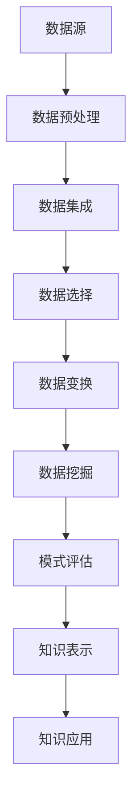

                 

关键词：知识发现、创新生态系统、人工智能、数据挖掘、算法、数学模型、实践应用

> 摘要：本文旨在探讨知识发现引擎在创新生态系统构建中的应用。我们将深入分析知识发现的核心概念、算法原理、数学模型以及其实际应用，并通过代码实例展示如何实现一个完整的知识发现引擎。此外，本文还将展望知识发现引擎在未来创新生态系统中的发展趋势和面临的挑战。

## 1. 背景介绍

在当今信息爆炸的时代，数据已经成为了企业和社会的核心资产。然而，如何有效地从海量数据中提取有价值的信息，并将其转化为实际的应用，成为了一个重要而具有挑战性的问题。知识发现（Knowledge Discovery in Databases，简称KDD）正是为了解决这一难题而诞生的一种数据分析方法。

知识发现引擎作为KDD过程中的核心组件，负责自动地从大量数据中识别出潜在的模式和知识。这些知识可以是分类、聚类、关联规则、预测等多种形式，它们不仅为决策者提供了数据驱动的洞察力，也为企业和组织带来了创新的可能性。

与此同时，创新生态系统作为一种能够促进知识创造和扩散的系统，正日益受到关注。它通过集成内部创新资源和外部合作伙伴，形成一个有利于创新和创业的生态圈。知识发现引擎的引入，可以进一步强化创新生态系统的能力，加速知识的生成和应用。

本文将围绕知识发现引擎的核心概念、算法原理、数学模型、实践应用以及未来展望等方面进行深入探讨，旨在为读者提供一个全面而深入的理解。

## 2. 核心概念与联系

### 2.1. 知识发现（KDD）

知识发现（KDD）是一个从大量数据中提取出有用知识的过程，它涵盖了数据预处理、数据集成、数据选择、数据变换、数据挖掘、模式评估和知识表示等多个步骤。其目标是从原始数据中发现具有实际意义和价值的知识，这些知识可以是隐含的、未知的，甚至是不易察觉的。

### 2.2. 数据挖掘（Data Mining）

数据挖掘（DM）是知识发现过程中的关键环节，它通过使用各种算法和技术，从大量数据中自动识别出模式、关联、聚类和其他潜在的规律。数据挖掘的方法包括分类、聚类、关联规则挖掘、异常检测、预测分析等。

### 2.3. 创新生态系统（Innovation Ecosystem）

创新生态系统是一个复杂的社会网络，它包含了政府、企业、高校、科研机构、投资者、创业者等不同角色，通过协同合作，共同促进创新和创业活动的发生。创新生态系统的目标是提供一个有利于创新的环境，使得知识和资源能够高效流动，从而加速创新成果的转化和应用。

### 2.4. 知识发现引擎（Knowledge Discovery Engine）

知识发现引擎是一种自动化系统，它集成了多种数据挖掘算法和工具，能够高效地从大量数据中提取出有价值的知识。知识发现引擎的核心是算法模块，它决定了引擎的处理能力、效率和准确性。

### 2.5. Mermaid 流程图

以下是知识发现引擎的核心概念和架构的 Mermaid 流程图：



## 3. 核心算法原理 & 具体操作步骤

### 3.1. 算法原理概述

知识发现引擎的核心在于其算法模块，这些算法可以分为以下几类：

- **分类算法**：如决策树、支持向量机、神经网络等，用于预测新数据属于哪个类别。
- **聚类算法**：如K-means、层次聚类、DBSCAN等，用于将数据分成不同的组。
- **关联规则挖掘**：如Apriori、FP-Growth等，用于发现数据之间的关联关系。
- **预测算法**：如时间序列分析、回归分析等，用于预测未来的趋势。

### 3.2. 算法步骤详解

以下是知识发现引擎的算法步骤详解：

1. **数据预处理**：这一步骤包括数据清洗、数据变换和数据规范化等，目的是将原始数据转换为适合挖掘的形式。
2. **数据集成**：将来自多个数据源的数据整合在一起，形成一个统一的数据视图。
3. **数据选择**：根据挖掘任务的需求，选择最相关的数据。
4. **数据变换**：将数据转换为适合挖掘算法的形式，例如将连续数据转换为分类数据。
5. **数据挖掘**：选择并应用合适的挖掘算法，对数据进行挖掘。
6. **模式评估**：评估挖掘出的模式的质量和意义。
7. **知识表示**：将挖掘出的知识以人类可理解的形式表示出来。
8. **知识应用**：将挖掘出的知识应用于实际场景，例如预测、推荐等。

### 3.3. 算法优缺点

每种算法都有其优缺点，以下是几种常见算法的优缺点：

- **决策树**：优点是易于理解，缺点是容易过拟合。
- **支持向量机**：优点是准确性高，缺点是计算复杂度高。
- **神经网络**：优点是能够处理复杂的关系，缺点是参数调整困难。
- **K-means**：优点是简单有效，缺点是可能陷入局部最优。
- **Apriori**：优点是简单易懂，缺点是处理大规模数据效率低。

### 3.4. 算法应用领域

知识发现引擎的应用领域非常广泛，包括但不限于以下领域：

- **金融**：用于风险评估、市场预测、信用评分等。
- **医疗**：用于疾病诊断、患者管理、药物研发等。
- **零售**：用于需求预测、库存管理、价格优化等。
- **交通**：用于交通流量预测、路线优化、安全管理等。
- **教育**：用于学生评估、课程推荐、教育资源优化等。

## 4. 数学模型和公式 & 详细讲解 & 举例说明

### 4.1. 数学模型构建

知识发现引擎中的数学模型主要包括以下几个方面：

- **概率模型**：用于描述数据中的不确定性和概率分布。
- **线性模型**：用于回归分析和预测。
- **非线性模型**：用于描述复杂的关系和非线性趋势。
- **统计模型**：用于数据分析和模式识别。

### 4.2. 公式推导过程

以下是几种常见算法的数学模型和公式的推导过程：

- **线性回归**：

  $$ Y = \beta_0 + \beta_1X + \epsilon $$

  其中，$Y$是因变量，$X$是自变量，$\beta_0$是截距，$\beta_1$是斜率，$\epsilon$是误差项。

- **支持向量机**：

  $$ w \cdot x + b = y $$

  其中，$w$是权重向量，$x$是特征向量，$b$是偏置，$y$是标签。

- **K-means聚类**：

  $$ \min_{C} \sum_{i=1}^{n} \| x_i - \mu_c \|_2 $$

  其中，$x_i$是数据点，$\mu_c$是聚类中心。

### 4.3. 案例分析与讲解

以下是一个基于线性回归的案例：

### 案例背景

假设我们有一个简单的数据集，其中包含学生的考试分数（因变量$Y$）和他们的学习时间（自变量$X$），我们希望通过线性回归模型预测一个学生如果学习10小时后的考试分数。

### 数据预处理

首先，我们需要对数据进行预处理，包括去除异常值、缺失值填充和数据标准化。

### 模型构建

使用线性回归模型：

$$ Y = \beta_0 + \beta_1X + \epsilon $$

### 模型训练

通过最小二乘法（Least Squares）来训练模型：

$$ \beta_1 = \frac{\sum_{i=1}^{n}(X_i - \bar{X})(Y_i - \bar{Y})}{\sum_{i=1}^{n}(X_i - \bar{X})^2} $$

$$ \beta_0 = \bar{Y} - \beta_1\bar{X} $$

### 模型评估

通过计算决定系数（R-squared）来评估模型：

$$ R^2 = 1 - \frac{\sum_{i=1}^{n}(Y_i - \hat{Y}_i)^2}{\sum_{i=1}^{n}(Y_i - \bar{Y})^2} $$

### 模型应用

使用训练好的模型预测学习10小时后的考试分数：

$$ \hat{Y} = \beta_0 + \beta_1X $$

## 5. 项目实践：代码实例和详细解释说明

### 5.1. 开发环境搭建

为了实现知识发现引擎，我们需要搭建一个适合数据分析和机器学习的开发环境。这里我们选择Python作为主要编程语言，并结合几个常用的库，如Pandas、NumPy、Scikit-learn和Matplotlib。

首先，确保Python环境已经安装。然后，使用pip命令安装所需的库：

```bash
pip install pandas numpy scikit-learn matplotlib
```

### 5.2. 源代码详细实现

以下是一个简单的线性回归模型的实现：

```python
import pandas as pd
import numpy as np
from sklearn.linear_model import LinearRegression
from sklearn.model_selection import train_test_split
from sklearn.metrics import r2_score
import matplotlib.pyplot as plt

# 加载数据集
data = pd.read_csv('exam_scores.csv')
X = data['learning_time'].values
Y = data['exam_score'].values

# 数据预处理
X = X.reshape(-1, 1)
Y = Y.reshape(-1, 1)

# 划分训练集和测试集
X_train, X_test, Y_train, Y_test = train_test_split(X, Y, test_size=0.2, random_state=42)

# 构建线性回归模型
model = LinearRegression()
model.fit(X_train, Y_train)

# 训练模型
Y_pred = model.predict(X_test)

# 评估模型
r2 = r2_score(Y_test, Y_pred)
print(f'R-squared: {r2}')

# 可视化结果
plt.scatter(X_test, Y_test, color='blue', label='Actual')
plt.plot(X_test, Y_pred, color='red', label='Predicted')
plt.xlabel('Learning Time')
plt.ylabel('Exam Score')
plt.legend()
plt.show()
```

### 5.3. 代码解读与分析

这个例子中，我们首先导入了必要的库，然后加载了一个包含学习时间和考试分数的CSV文件。接着，我们进行了数据预处理，将数据转换成适合线性回归模型的形式。

使用Scikit-learn库中的`LinearRegression`类构建模型，并通过`fit`方法进行训练。训练完成后，我们使用`predict`方法对测试集进行预测，并使用R-squared评估模型的性能。

最后，我们使用Matplotlib库将实际考试分数和预测分数可视化，以便直观地评估模型的准确性。

### 5.4. 运行结果展示

运行上述代码后，我们会在控制台看到R-squared的值，这表示模型的预测能力。同时，我们会看到一个散点图，其中蓝色点代表实际考试分数，红色线代表预测的考试分数。

## 6. 实际应用场景

知识发现引擎在各个实际应用场景中展现出了巨大的潜力。以下是一些典型的应用案例：

### 6.1. 金融领域

在金融领域，知识发现引擎可以帮助银行和金融机构进行客户风险评估、信用评分和市场预测。例如，通过分析客户的交易数据、信用记录和社交媒体活动，金融机构可以更准确地评估客户的信用风险，从而降低不良贷款率。

### 6.2. 医疗领域

在医疗领域，知识发现引擎可以用于疾病诊断、患者管理和药物研发。通过分析医疗记录、基因数据和患者行为，医生可以更准确地诊断疾病，制定个性化的治疗方案，并发现潜在的药物靶点。

### 6.3. 零售领域

在零售领域，知识发现引擎可以用于需求预测、库存管理和价格优化。通过分析历史销售数据、客户行为和市场趋势，零售商可以更准确地预测未来的需求，优化库存水平，并制定有效的价格策略，从而提高销售额和利润。

### 6.4. 交通领域

在交通领域，知识发现引擎可以用于交通流量预测、路线优化和安全管理。通过分析交通数据、历史数据和实时数据，交通管理部门可以更准确地预测交通流量，优化路线规划，减少交通拥堵，提高道路安全。

### 6.5. 教育领域

在教育领域，知识发现引擎可以用于学生评估、课程推荐和资源优化。通过分析学生的考试成绩、学习行为和学习资源，教育机构可以更准确地评估学生的学习情况，推荐适合的课程和资源，提高教学效果。

## 7. 工具和资源推荐

### 7.1. 学习资源推荐

- 《数据挖掘：实用机器学习技术》（"Data Mining: Practical Machine Learning Techniques"）
- 《Python数据分析》（"Python for Data Analysis"）
- 《机器学习》（"Machine Learning"）

### 7.2. 开发工具推荐

- Jupyter Notebook：用于数据分析和交互式编程。
- Visual Studio Code：用于Python编程和调试。
- PyCharm：适用于专业Python开发。

### 7.3. 相关论文推荐

- "KDD: The Process of Discovery from Data"
- "A Comprehensive Survey on Knowledge Discovery in Databases"
- "The Data Science Handbook"

## 8. 总结：未来发展趋势与挑战

### 8.1. 研究成果总结

知识发现引擎作为一种自动化数据分析工具，已经在各个领域展现出了巨大的应用价值。通过深入挖掘数据中的潜在模式，知识发现引擎不仅提高了决策的准确性和效率，也为创新和创业提供了新的动力。

### 8.2. 未来发展趋势

随着人工智能、大数据和云计算等技术的发展，知识发现引擎将继续朝着智能化、自动化和高效化的方向发展。未来，知识发现引擎将更加关注实时数据分析、个性化推荐和复杂网络的挖掘。

### 8.3. 面临的挑战

尽管知识发现引擎在理论和实践中取得了显著的进展，但仍然面临一些挑战：

- **数据隐私**：如何确保数据挖掘过程中的数据隐私和安全是一个重要问题。
- **算法透明性**：如何提高算法的透明性和可解释性，使其更容易被非专业人士理解和接受。
- **计算效率**：如何优化算法，提高大规模数据的处理效率。

### 8.4. 研究展望

未来的研究应重点关注以下几个方面：

- **跨领域融合**：将知识发现引擎与其他领域的创新技术相结合，提高其应用范围和效果。
- **算法创新**：开发新的算法和技术，提高知识发现引擎的效率和准确性。
- **人才培养**：培养更多具有数据科学和人工智能背景的专业人才，推动知识发现引擎的应用和发展。

## 9. 附录：常见问题与解答

### Q1. 知识发现引擎的主要功能是什么？

A1. 知识发现引擎的主要功能是从大量数据中自动识别出潜在的模式和知识，这些模式可以是分类、聚类、关联规则、预测等多种形式。

### Q2. 知识发现引擎在哪些领域有应用？

A2. 知识发现引擎在金融、医疗、零售、交通、教育等多个领域有广泛应用，如客户风险评估、疾病诊断、需求预测、交通流量预测等。

### Q3. 如何确保知识发现引擎的数据隐私和安全？

A3. 可以采用数据加密、匿名化处理、隐私保护算法等技术来确保知识发现引擎的数据隐私和安全。

### Q4. 知识发现引擎与数据挖掘有什么区别？

A4. 数据挖掘是知识发现过程中的一个环节，而知识发现引擎是一种集成多种数据挖掘算法和工具的自动化系统，它负责从大量数据中高效地提取有价值的信息。

### Q5. 如何选择合适的知识发现引擎算法？

A5. 选择合适的知识发现引擎算法需要考虑数据的类型、问题的性质、算法的效率等多个因素。常见的算法包括分类算法、聚类算法、关联规则挖掘等，可以根据具体应用场景选择合适的算法。

