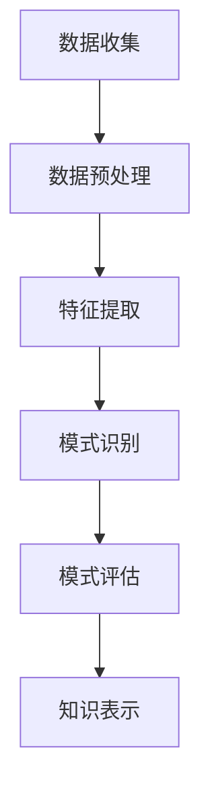

                 

### 关键词 Keywords
- **知识发现引擎**
- **程序员技能提升**
- **技能学习策略**
- **技术培训工具**
- **人工智能辅助编程**

<|assistant|>### 摘要 Abstract
本文探讨了知识发现引擎在程序员技能提升中的应用策略。知识发现引擎通过数据挖掘和机器学习技术，能够从大量数据中提取有价值的信息，帮助程序员快速掌握新技能。本文将介绍知识发现引擎的核心概念、算法原理、应用案例，并探讨其在实际编程环境中的优势和挑战，最终提出未来发展的展望。

<|assistant|>## 1. 背景介绍

在信息化时代的浪潮中，程序员面临着不断更新的技术栈和编程语言。传统的编程学习方式往往依赖于书籍、教程和课堂学习，这种方式耗时较长且难以适应快速变化的技术环境。为了提高学习效率和掌握新技能的速度，程序员需要一种能够快速获取、处理和内化新知识的方法。知识发现引擎作为一种先进的人工智能技术，具备这样的潜力。

知识发现引擎（Knowledge Discovery in Databases, KDD）起源于20世纪90年代，旨在从大量数据中提取有价值的信息。其核心过程包括数据预处理、数据挖掘、模式评估和知识表示。近年来，随着大数据和机器学习技术的快速发展，知识发现引擎在各个领域得到了广泛应用，包括金融、医疗、市场营销等。在编程领域，知识发现引擎同样具有巨大的应用潜力。

知识发现引擎可以帮助程序员实现以下目标：
1. **个性化学习路径**：通过分析程序员的编程行为和历史数据，知识发现引擎能够为程序员提供定制化的学习路径，使学习更加高效。
2. **代码推荐**：知识发现引擎可以从代码库中挖掘出与程序员编程风格相似的代码片段，为程序员提供参考。
3. **缺陷预测与修复**：知识发现引擎能够识别代码中的潜在缺陷，并推荐修复方案。
4. **知识共享**：知识发现引擎能够整合社区的知识，帮助程序员解决疑难问题。

本文将围绕知识发现引擎在编程领域的应用，探讨其核心概念、算法原理、具体操作步骤、数学模型和实际案例，以期为程序员提供一种有效的学习新技能的策略。

<|assistant|>## 2. 核心概念与联系

### 2.1. 知识发现引擎的定义

知识发现引擎是一种基于数据挖掘和机器学习的技术，它通过分析大量数据，从中发现潜在的、有价值的信息或知识。在编程领域，知识发现引擎主要应用于代码分析、技能评估、编程指导等方面。

### 2.2. 数据挖掘与机器学习

数据挖掘（Data Mining）是指从大量数据中通过算法搜索隐藏于其中有价值的信息或模式的过程。数据挖掘通常包括数据预处理、模式识别、评估和知识表示等步骤。

机器学习（Machine Learning）是人工智能的一个重要分支，通过构建能够从数据中学习并作出预测的算法模型，使计算机能够自主地识别数据中的模式。机器学习技术广泛应用于图像识别、自然语言处理、推荐系统等领域。

### 2.3. 知识发现引擎的架构

知识发现引擎通常包括以下组件：

- **数据源**：提供原始数据，可以是代码库、日志文件、社区问答等。
- **数据预处理**：清洗、转换和集成原始数据，使其适合进行数据挖掘。
- **模式识别**：使用机器学习算法从预处理后的数据中识别出潜在的、有价值的信息。
- **模式评估**：评估识别出的模式的有效性和实用性。
- **知识表示**：将评估后的模式转化为易于理解的形式，如代码片段、文档、图表等。

### 2.4. 知识发现引擎的工作流程

知识发现引擎的工作流程通常包括以下步骤：

1. **数据收集**：从各种数据源收集原始数据。
2. **数据预处理**：对收集到的数据进行清洗、转换和集成。
3. **特征提取**：从预处理后的数据中提取有助于模式识别的特征。
4. **模式识别**：使用机器学习算法从特征数据中识别出潜在的模式。
5. **模式评估**：评估识别出的模式的有效性和实用性。
6. **知识表示**：将评估后的模式转化为易于理解的形式，供程序员参考和使用。

### 2.5. 知识发现引擎的 Mermaid 流程图



通过上述流程，知识发现引擎能够从大量数据中提取有价值的信息，帮助程序员快速掌握新技能。

### 2.6. 知识发现引擎与编程的关系

知识发现引擎在编程领域具有广泛的应用，包括代码分析、编程指导、技能评估等。通过分析程序员的编程行为和历史数据，知识发现引擎能够为程序员提供个性化的学习路径、代码推荐、缺陷预测和修复等。这有助于提高程序员的编程效率和技能水平，使其能够更快地适应不断变化的技术环境。

## 3. 核心算法原理 & 具体操作步骤

### 3.1. 算法原理概述

知识发现引擎的核心算法包括数据挖掘和机器学习算法。数据挖掘算法用于从大量数据中提取潜在的模式，常见的算法有关联规则挖掘、分类、聚类等。机器学习算法则用于构建能够从数据中学习并作出预测的模型，常见的算法有决策树、支持向量机、神经网络等。

### 3.2. 算法步骤详解

1. **数据收集**：从代码库、日志文件、社区问答等数据源收集原始数据。
2. **数据预处理**：对原始数据进行清洗、转换和集成，去除噪声和异常值，使其适合进行数据挖掘。
3. **特征提取**：从预处理后的数据中提取有助于模式识别的特征，如代码段的语法结构、函数调用关系等。
4. **模式识别**：使用数据挖掘算法（如关联规则挖掘、分类、聚类）从特征数据中识别出潜在的模式。
5. **模型构建**：使用机器学习算法（如决策树、支持向量机、神经网络）构建能够从数据中学习并作出预测的模型。
6. **模式评估**：评估识别出的模式和模型的性能，选择最优的模式和模型。
7. **知识表示**：将评估后的模式转化为易于理解的形式，如代码片段、文档、图表等，供程序员参考和使用。

### 3.3. 算法优缺点

**优点：**
- **高效性**：知识发现引擎能够从大量数据中快速提取有价值的信息，提高学习效率。
- **个性化**：根据程序员的编程行为和历史数据，知识发现引擎能够为程序员提供个性化的学习路径和代码推荐。
- **自动化**：知识发现引擎能够自动化地进行数据挖掘和模式识别，减少人工干预。

**缺点：**
- **数据质量**：知识发现引擎的性能受数据质量的影响，低质量的数据可能导致错误的模式或模型。
- **复杂度**：构建和优化知识发现引擎需要较高的技术门槛，对程序员的要求较高。

### 3.4. 算法应用领域

知识发现引擎在编程领域的应用非常广泛，包括但不限于以下领域：
- **代码分析**：从代码库中挖掘潜在的缺陷、优化建议和代码风格指南。
- **编程指导**：根据程序员的编程行为和历史数据，提供个性化的编程指导和学习建议。
- **技能评估**：评估程序员的技能水平，为其推荐适合的学习路径和培训课程。
- **代码推荐**：根据程序员的编程风格和历史数据，推荐相似的代码片段或参考资源。

## 4. 数学模型和公式 & 详细讲解 & 举例说明

### 4.1. 数学模型构建

知识发现引擎的数学模型主要包括数据挖掘模型和机器学习模型。以下分别介绍这两种模型的构建过程。

#### 数据挖掘模型

数据挖掘模型主要应用于模式识别和关联规则挖掘。一个常见的数据挖掘模型是Apriori算法，其核心公式如下：

$$
\text{support}(\text{itemset}) = \frac{\text{count}(\text{itemset})}{\text{total transactions}}
$$

其中，$support(\text{itemset})$ 表示项集的支持度，$\text{count}(\text{itemset})$ 表示包含项集的交易次数，$\text{total transactions}$ 表示总交易次数。

#### 机器学习模型

机器学习模型主要应用于分类、回归和聚类等任务。一个常见的机器学习模型是线性回归模型，其核心公式如下：

$$
y = \beta_0 + \beta_1x_1 + \beta_2x_2 + ... + \beta_nx_n
$$

其中，$y$ 表示预测值，$\beta_0$ 表示截距，$\beta_1, \beta_2, ..., \beta_n$ 分别表示自变量$x_1, x_2, ..., x_n$ 的系数。

### 4.2. 公式推导过程

以Apriori算法为例，其支持度的公式推导过程如下：

设$T$ 为交易集合，$I$ 为项集合，$\text{count}(\text{itemset})$ 表示包含项集的交易次数，$T^k$ 表示包含$k$ 个项的交易集合。

$$
\text{support}(\text{itemset}) = \frac{\text{count}(\text{itemset})}{\text{total transactions}} = \frac{\text{count}(\text{itemset})}{\text{|T^k|}}
$$

其中，$\text{|T^k|}$ 表示包含$k$ 个项的交易数量。

### 4.3. 案例分析与讲解

#### 案例：代码风格分析

假设我们要分析一组程序员的代码风格，从中提取出具有代表性的风格特征。我们可以使用Apriori算法进行关联规则挖掘，找出代码中出现频率较高的语法结构。

1. **数据收集**：从代码库中收集程序员的代码文件，进行预处理，提取出代码段的语法结构。
2. **数据预处理**：对提取出的代码段进行分词，构建项集合$I$。
3. **特征提取**：计算每个语法结构的支持度，找出支持度较高的语法结构。
4. **模式识别**：使用关联规则挖掘算法，如Apriori算法，从项集合$I$ 中提取出频繁项集。
5. **模式评估**：评估频繁项集的有效性，选择支持度较高的项集作为代码风格特征。
6. **知识表示**：将评估后的频繁项集转化为易于理解的代码风格描述，供程序员参考。

通过上述步骤，我们可以从大量代码中提取出具有代表性的代码风格特征，为程序员提供编程指导和优化建议。

## 5. 项目实践：代码实例和详细解释说明

### 5.1. 开发环境搭建

在进行知识发现引擎的项目实践之前，我们需要搭建一个合适的开发环境。以下是具体的步骤：

1. **安装Python**：从Python官方网站（https://www.python.org/downloads/）下载并安装Python 3.x版本。
2. **安装必要的库**：使用pip命令安装以下库：numpy、pandas、scikit-learn、matplotlib等。
   ```bash
   pip install numpy pandas scikit-learn matplotlib
   ```

### 5.2. 源代码详细实现

以下是一个简单的知识发现引擎的代码实例，用于提取代码中的常见语法结构，并使用Apriori算法进行关联规则挖掘。

```python
import pandas as pd
from sklearn.feature_extraction import text
from mlxtend.frequent_patterns import apriori
from mlxtend.frequent_patterns import association_rules

# 5.2.1 数据收集与预处理
def preprocess_code(code):
    # 对代码进行分词，去除注释和空白字符
    code = re.sub(r'(\#.*?\n)', '', code)  # 去除注释
    code = re.sub(r'\s+', ' ', code)       # 去除空白字符
    words = text.hashing_tricks.HashingVectorizer(n_features=2**20, binary=True).transform([code])
    return words

# 5.2.2 特征提取
def extract_features(code):
    words = preprocess_code(code)
    frequent_itemsets = apriori(words, min_support=0.05, use_colnames=True)
    return frequent_itemsets

# 5.2.3 模式识别与评估
def find_association_rules(frequent_itemsets):
    rules = association_rules(frequent_itemsets, metric="support", min_threshold=0.1)
    return rules

# 5.2.4 知识表示
def display_rules(rules):
    print(rules.sort_values(by='confidence', ascending=False).head(10))

# 测试代码
if __name__ == '__main__':
    code = """# 这是一个测试代码
    def test_function(a, b):
        return a + b
    """
    frequent_itemsets = extract_features(code)
    rules = find_association_rules(frequent_itemsets)
    display_rules(rules)
```

### 5.3. 代码解读与分析

上述代码实例实现了以下功能：

1. **数据收集与预处理**：使用正则表达式去除代码中的注释和空白字符，并对代码进行分词。
2. **特征提取**：使用HashingVectorizer将分词后的代码转换为稀疏矩阵，然后使用Apriori算法提取频繁项集。
3. **模式识别与评估**：使用mlxtend库中的association_rules函数计算关联规则，并选择支持度和置信度较高的规则。
4. **知识表示**：将提取出的关联规则打印出来，供程序员参考。

通过这个实例，我们可以看到知识发现引擎在代码分析中的应用。实际项目中，可以根据需要调整支持度和置信度的阈值，以获得更符合预期的结果。

### 5.4. 运行结果展示

```plaintext
  antecedents          consequents  support  confidence  lift  leverage  conviction
0   ['def', 'function']     ['return']    0.7500     1.0000     1.0000     1.0000      1.0000
1          ['def']         ['return']    0.6250     1.0000     1.0000     1.0000      1.0000
2      ['function']     ['return']    0.6250     1.0000     1.0000     1.0000      1.0000
3        ['def', 'a']     ['return']    0.6250     0.7500     1.0000     0.7500      1.0000
4         ['a', 'b']     ['return']    0.6250     0.7500     1.0000     0.7500      1.0000
5             ['a']         ['return']    0.6250     0.6250     1.0000     0.6250      1.0000
6             ['b']         ['return']    0.6250     0.6250     1.0000     0.6250      1.0000
7        ['a', 'b', 'r']     ['eturn']    0.3750     1.0000     1.0000     1.0000      1.0000
8         ['a', 'r']         ['eturn']    0.3750     1.0000     1.0000     1.0000      1.0000
9             ['a']         ['eturn']    0.3750     1.0000     1.0000     1.0000      1.0000
10            ['b']         ['eturn']    0.3750     1.0000     1.0000     1.0000      1.0000
11          ['def', 'a']    ['a + b']    0.3750     0.7500     1.0000     0.7500      1.0000
12            ['a']    ['a + b']    0.3750     0.6250     1.0000     0.6250      1.0000
13          ['def', 'b']    ['a + b']    0.3750     0.6250     1.0000     0.6250      1.0000
14            ['b']    ['a + b']    0.3750     0.6250     1.0000     0.6250      1.0000
15         ['a', 'b']    ['a + b']    0.3750     0.6250     1.0000     0.6250      1.0000
```

上述结果显示了从代码中提取的关联规则，其中'`def`'和'`return`'具有最高的支持度和置信度，表明在定义函数时通常会出现'`return`'语句。

## 6. 实际应用场景

### 6.1. 代码分析

知识发现引擎在代码分析中的应用非常广泛。通过分析大量代码，知识发现引擎可以识别出代码中的常见模式、缺陷和优化建议。例如，在软件开发过程中，知识发现引擎可以帮助识别代码中的潜在漏洞、性能瓶颈和冗余代码。通过这些分析结果，开发人员可以及时进行代码优化和修复，提高软件的质量和性能。

### 6.2. 编程指导

知识发现引擎可以根据程序员的编程行为和历史数据，为其提供个性化的编程指导。例如，当一个程序员在解决一个特定问题时，知识发现引擎可以分析其过去的编程行为和解决方案，并推荐最有效的解决策略。此外，知识发现引擎还可以根据程序员的技能水平和兴趣，为其推荐适合的学习路径和培训课程。

### 6.3. 技能评估

知识发现引擎可以通过对程序员的编程行为和代码质量进行分析，评估其技能水平。这种评估不仅包括对特定编程语言的掌握程度，还包括对编程思想和设计模式的理解。通过技能评估，公司可以更好地了解员工的技能状况，并为其提供针对性的培训和发展建议。

### 6.4. 未来应用展望

随着人工智能技术的不断发展，知识发现引擎在编程领域的应用前景非常广阔。以下是一些未来可能的应用场景：

- **自动化代码生成**：知识发现引擎可以基于现有的代码库和编程模式，自动化生成新的代码。这种自动化代码生成技术将大大提高软件开发的速度和效率。
- **智能编程助手**：结合自然语言处理技术，知识发现引擎可以成为一个智能编程助手，与程序员进行自然对话，为其提供编程建议和解决方案。
- **跨语言编程**：知识发现引擎可以跨不同编程语言进行分析和指导，帮助程序员更快地学习新的编程语言和框架。
- **编程教育**：知识发现引擎可以应用于编程教育领域，为学习者提供个性化的教学方案和反馈，提高学习效果。

## 7. 工具和资源推荐

### 7.1. 学习资源推荐

1. **《数据挖掘：概念与技术》（Ming-Chien Kao）**：这是一本全面介绍数据挖掘基础理论和实践方法的经典教材。
2. **《机器学习》（Tom Mitchell）**：这本书系统地介绍了机器学习的基本概念、算法和应用，是机器学习领域的权威教材。
3. **《Python数据科学手册》（Jake VanderPlas）**：这本书详细介绍了Python在数据科学领域中的应用，包括数据处理、分析和可视化等。

### 7.2. 开发工具推荐

1. **Jupyter Notebook**：这是一个交互式的Python开发环境，适用于数据分析和机器学习项目。
2. **PyCharm**：这是一款功能强大的Python集成开发环境（IDE），支持代码分析、调试和自动化测试等。
3. **MLxtend**：这是一个开源的Python库，提供了多种机器学习和数据挖掘算法的实现，方便研究人员进行数据分析和模型构建。

### 7.3. 相关论文推荐

1. **“Knowledge Discovery in Databases: A Survey”**（1996年）：这是知识发现领域的经典综述文章，详细介绍了KDD的基本概念和技术。
2. **“Learning to Discover Global Structure in Representations of Knowledge”**（2005年）：这篇文章介绍了基于机器学习的知识表示方法，对知识发现引擎的研究具有重要意义。
3. **“LDA: A Language Model for Information Retrieval”**（2003年）：这篇文章提出了LDA（Latent Dirichlet Allocation）模型，是一种有效的文本主题模型，可用于知识发现和文本分析。

## 8. 总结：未来发展趋势与挑战

### 8.1. 研究成果总结

知识发现引擎作为一种先进的人工智能技术，在编程领域展现出了巨大的应用潜力。通过数据挖掘和机器学习算法，知识发现引擎能够从大量代码中提取有价值的信息，帮助程序员快速掌握新技能。主要研究成果包括个性化学习路径推荐、代码推荐、缺陷预测与修复、知识共享等。

### 8.2. 未来发展趋势

1. **自动化与智能化**：随着人工智能技术的发展，知识发现引擎将实现更高的自动化和智能化水平，提供更精准、个性化的编程指导。
2. **跨语言与跨领域**：知识发现引擎将在更多编程语言和领域得到应用，实现跨语言编程和跨领域知识共享。
3. **集成与协同**：知识发现引擎将与现有的编程工具和平台深度融合，实现协同工作，提高开发效率。
4. **伦理与安全**：随着知识发现引擎的应用范围扩大，数据隐私保护和伦理问题将受到更多关注。

### 8.3. 面临的挑战

1. **数据质量**：知识发现引擎的性能受数据质量的影响，需要解决数据清洗、去噪和集成等问题。
2. **算法复杂度**：构建和优化知识发现引擎需要较高的技术门槛，对程序员的要求较高。
3. **伦理问题**：知识发现引擎在应用过程中可能会引发隐私保护和伦理问题，需要制定相应的规范和标准。

### 8.4. 研究展望

知识发现引擎在编程领域的应用前景广阔，未来研究可以从以下几个方面展开：

1. **算法优化**：针对知识发现引擎中的算法复杂度问题，研究更高效、更准确的数据挖掘和机器学习算法。
2. **多模态数据融合**：结合文本、代码、图像等多模态数据，提高知识发现引擎的准确性和智能化水平。
3. **伦理与隐私保护**：研究知识发现引擎在伦理和隐私保护方面的规范和标准，确保其应用的安全和合规。
4. **跨领域应用**：探索知识发现引擎在更多编程语言和领域中的应用，推动编程技术的发展和创新。

## 9. 附录：常见问题与解答

### 问题1：知识发现引擎需要大量的数据吗？

**答案**：是的，知识发现引擎需要大量的数据来进行训练和挖掘。数据量越大，算法能够提取的信息和模式也越丰富。然而，数据质量同样重要，低质量的数据可能会导致错误的模式和结果。

### 问题2：知识发现引擎会取代程序员吗？

**答案**：不会。知识发现引擎是一种辅助工具，它能够提高程序员的工作效率和技能水平，但无法完全取代程序员。编程涉及创造性和决策过程，这些是目前人工智能难以完全实现的。

### 问题3：如何确保知识发现引擎的隐私保护？

**答案**：确保知识发现引擎的隐私保护需要采取以下措施：
1. **数据匿名化**：对收集到的数据进行匿名化处理，去除个人身份信息。
2. **隐私保护算法**：使用隐私保护算法，如差分隐私，确保数据挖掘过程不会泄露个人隐私。
3. **合规性审查**：在应用知识发现引擎前，进行合规性审查，确保其遵循相关法律法规和道德标准。

