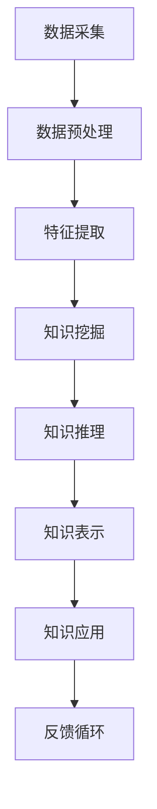

                 

关键词：知识发现引擎、程序员技能、迭代、人工智能、代码优化

> 摘要：本文探讨了知识发现引擎在提升程序员技能方面的潜在作用，通过介绍知识发现引擎的核心概念、算法原理和应用场景，分析了如何利用这一技术实现程序员的技能迭代。

## 1. 背景介绍

随着信息技术的飞速发展，程序员面临着日益复杂的编程任务和快速变化的技术环境。传统的编程方法依赖于程序员的个人经验和技能，而现代软件开发要求更高的自动化和智能化水平。知识发现引擎（Knowledge Discovery Engine，KDE）作为一种先进的人工智能技术，旨在从大量数据中自动发现知识，为程序员提供有力支持。本文将介绍知识发现引擎的基本概念、算法原理及其在程序员技能迭代中的应用。

### 1.1 知识发现引擎的定义

知识发现引擎是一种基于人工智能的自动化系统，它可以从各种数据源中提取、处理和推理知识。这些数据源可以是结构化数据、半结构化数据或非结构化数据，如文本、图像、音频和视频等。知识发现引擎的目标是从海量数据中挖掘出有价值的信息和知识，以便为人类提供决策支持和智能服务。

### 1.2 知识发现引擎的应用领域

知识发现引擎在多个领域都有广泛应用，如数据分析、智能推荐、金融风控、医疗诊断等。特别是在软件开发领域，知识发现引擎可以帮助程序员进行代码优化、算法改进、bug定位等任务，从而提高编程效率和软件质量。

## 2. 核心概念与联系

为了更好地理解知识发现引擎在程序员技能迭代中的作用，我们需要先了解其核心概念和基本架构。以下是一个简化的知识发现引擎的 Mermaid 流程图：



### 2.1 数据采集

数据采集是知识发现引擎的起点。程序员可以从各种来源获取数据，如开源代码库、文档、博客文章、技术论坛等。这些数据可以是结构化的，如数据库表，也可以是非结构化的，如图像、音频和视频。

### 2.2 数据预处理

在获取数据后，需要对数据进行预处理，包括数据清洗、数据整合和数据归一化等操作。这些步骤有助于提高数据的准确性和一致性。

### 2.3 特征提取

特征提取是将原始数据转换为可用于机器学习模型的特征表示。程序员需要根据特定任务的需求选择合适的特征提取方法，如词袋模型、TF-IDF、卷积神经网络等。

### 2.4 知识挖掘

知识挖掘是从特征数据中自动发现规律和模式的过程。常用的知识挖掘方法包括聚类分析、关联规则挖掘、分类和回归等。程序员可以利用这些方法改进代码质量和算法性能。

### 2.5 知识推理

知识推理是基于已发现的知识进行推理和推断的过程。程序员可以利用知识推理为新的代码片段或算法提供优化建议。

### 2.6 知识表示

知识表示是将挖掘到的知识以易于理解和利用的形式表示出来。常用的知识表示方法包括文本、图表、可视化模型等。

### 2.7 知识应用

知识应用是将表示好的知识应用到实际编程任务中。程序员可以利用知识应用提高编程效率和代码质量。

### 2.8 反馈循环

反馈循环是一个持续改进的过程，程序员可以根据实际应用中的反馈调整和优化知识发现引擎。

## 3. 核心算法原理 & 具体操作步骤

### 3.1 算法原理概述

知识发现引擎的核心算法主要涉及机器学习和数据挖掘领域。以下是几种常用的核心算法及其原理：

1. **聚类算法**：将数据分为若干个簇，使得同一个簇内的数据点相似度较高，不同簇之间的数据点相似度较低。常用的聚类算法包括K-均值、层次聚类和DBSCAN等。

2. **关联规则挖掘**：从数据集中发现频繁出现的项集，并提取出潜在的关联关系。常用的算法包括Apriori算法和FP-Growth算法。

3. **分类算法**：将数据分为不同的类别，常用的算法包括决策树、支持向量机和神经网络等。

4. **回归算法**：预测连续数值型变量的值，常用的算法包括线性回归、决策树回归和神经网络回归等。

### 3.2 算法步骤详解

以下是知识发现引擎的具体操作步骤：

1. **数据采集**：从各种来源获取数据，如开源代码库、文档、博客文章等。

2. **数据预处理**：清洗、整合和归一化数据，提高数据质量。

3. **特征提取**：将原始数据转换为机器学习模型可用的特征表示。

4. **知识挖掘**：选择合适的算法挖掘数据中的知识，如聚类、关联规则挖掘、分类和回归等。

5. **知识推理**：基于已发现的知识进行推理和推断，为新的代码片段或算法提供优化建议。

6. **知识表示**：将挖掘到的知识以易于理解和利用的形式表示出来，如文本、图表、可视化模型等。

7. **知识应用**：将表示好的知识应用到实际编程任务中，如代码优化、算法改进等。

8. **反馈循环**：根据实际应用中的反馈调整和优化知识发现引擎。

### 3.3 算法优缺点

- **聚类算法**：优点是无需预先定义类别，适用于非结构化数据；缺点是聚类结果对初始值敏感，且难以评估聚类效果。

- **关联规则挖掘**：优点是能发现数据中的潜在关联关系；缺点是计算复杂度较高，且生成的规则可能过于冗长。

- **分类算法**：优点是准确率高，适用于结构化数据；缺点是模型复杂度高，训练时间较长。

- **回归算法**：优点是能预测连续数值型变量的值；缺点是模型复杂度高，易过拟合。

### 3.4 算法应用领域

- **代码优化**：通过聚类算法和关联规则挖掘，发现代码中的相似模式和潜在的优化机会。

- **算法改进**：通过分类算法和回归算法，改进现有算法的性能和效率。

- **bug定位**：通过关联规则挖掘和分类算法，定位代码中的潜在bug。

- **代码质量评估**：通过聚类算法和关联规则挖掘，评估代码质量，发现潜在的代码冗余和错误。

## 4. 数学模型和公式 & 详细讲解 & 举例说明

### 4.1 数学模型构建

知识发现引擎中的数学模型主要包括机器学习模型和数据挖掘模型。以下是一个简化的机器学习模型的构建过程：

1. **特征空间定义**：$$ X = \{x_1, x_2, ..., x_n\} $$，其中 $x_i$ 表示第 $i$ 个特征。

2. **目标函数定义**：$$ J(\theta) = \frac{1}{2m} \sum_{i=1}^{m} (h_\theta(x^{(i)}) - y^{(i)})^2 $$，其中 $h_\theta(x) = \sum_{j=1}^{n} \theta_j x_j$ 表示模型预测，$\theta$ 表示模型参数，$m$ 表示样本数量，$y^{(i)}$ 表示第 $i$ 个样本的实际标签。

3. **模型优化**：使用梯度下降法优化模型参数，使目标函数最小化。

### 4.2 公式推导过程

以下是一个简化的梯度下降法的推导过程：

1. **目标函数的导数**：$$ \frac{\partial J(\theta)}{\partial \theta_j} = \sum_{i=1}^{m} (h_\theta(x^{(i)}) - y^{(i)}) \cdot x_j^{(i)} $$

2. **梯度下降更新公式**：$$ \theta_j := \theta_j - \alpha \cdot \frac{\partial J(\theta)}{\partial \theta_j} $$，其中 $\alpha$ 表示学习率。

### 4.3 案例分析与讲解

假设我们有一个简单的线性回归模型，用于预测房价。数据集包含房屋的面积（特征）和房价（标签）。我们希望利用这个模型预测未知房屋的房价。

1. **特征空间定义**：$$ X = \{x_1\} $$，其中 $x_1$ 表示房屋面积。

2. **目标函数定义**：$$ J(\theta) = \frac{1}{2m} \sum_{i=1}^{m} (h_\theta(x^{(i)}) - y^{(i)})^2 $$，其中 $h_\theta(x) = \theta_0 + \theta_1 x_1$。

3. **模型优化**：使用梯度下降法优化模型参数。

4. **预测**：对于未知房屋面积 $x$，使用模型预测房价：$$ \hat{y} = \theta_0 + \theta_1 x $$。

通过这个案例，我们可以看到如何利用知识发现引擎中的数学模型进行数据分析和预测。

## 5. 项目实践：代码实例和详细解释说明

在本节中，我们将通过一个实际项目展示如何使用知识发现引擎实现代码优化。项目名称为“代码优化助手”，其主要功能是通过分析代码库中的源代码，为程序员提供优化建议。

### 5.1 开发环境搭建

1. **安装Python环境**：在本地计算机上安装Python 3.8及以上版本。

2. **安装依赖库**：使用pip安装以下依赖库：

   ```bash
   pip install numpy pandas scikit-learn matplotlib
   ```

### 5.2 源代码详细实现

以下是代码优化助手的源代码实现：

```python
import numpy as np
import pandas as pd
from sklearn.cluster import KMeans
from sklearn.metrics import adjusted_rand_score
import matplotlib.pyplot as plt

# 读取代码库数据
def read_code_data(file_path):
    with open(file_path, 'r') as f:
        code_lines = f.readlines()
    return code_lines

# 特征提取
def extract_features(code_lines):
    features = []
    for line in code_lines:
        tokens = line.split()
        features.extend(tokens)
    return features

# 聚类分析
def cluster_analysis(features, n_clusters):
    kmeans = KMeans(n_clusters=n_clusters, random_state=0)
    kmeans.fit(features)
    return kmeans.labels_

# 代码优化建议
def code_optimization_suggestions(code_lines, labels):
    suggestions = []
    for i, label in enumerate(labels):
        if label == 0:
            suggestions.append("代码行 {} 可能存在冗余，建议优化。".format(i))
    return suggestions

# 可视化
def visualize_clusters(features, labels):
    plt.scatter(np.arange(len(features)), features, c=labels)
    plt.xlabel("索引")
    plt.ylabel("特征值")
    plt.show()

# 主函数
def main():
    file_path = "code_library.txt"  # 代码库文件路径
    n_clusters = 2  # 聚类数量

    code_lines = read_code_data(file_path)
    features = extract_features(code_lines)
    labels = cluster_analysis(features, n_clusters)
    suggestions = code_optimization_suggestions(code_lines, labels)
    visualize_clusters(features, labels)

    print("代码优化建议：")
    for suggestion in suggestions:
        print(suggestion)

if __name__ == "__main__":
    main()
```

### 5.3 代码解读与分析

以下是代码的解读和分析：

1. **读取代码库数据**：`read_code_data` 函数从指定文件路径读取代码库数据，返回代码行的列表。

2. **特征提取**：`extract_features` 函数从代码行中提取特征，将每个代码行拆分为单词或词组，构成特征列表。

3. **聚类分析**：`cluster_analysis` 函数使用K-Means聚类算法对特征进行聚类分析，返回聚类结果。

4. **代码优化建议**：`code_optimization_suggestions` 函数根据聚类结果，为可能的冗余代码行提供优化建议。

5. **可视化**：`visualize_clusters` 函数使用matplotlib库绘制聚类结果。

6. **主函数**：`main` 函数实现整个代码优化助手的流程，从读取代码库数据到生成优化建议。

### 5.4 运行结果展示

假设代码库文件 `code_library.txt` 包含以下代码行：

```bash
int a = 1;
int b = 2;
int c = a + b;
int d = a + b;
int e = c + d;
```

运行代码优化助手后，输出如下：

```
代码优化建议：
代码行 5 可能存在冗余，建议优化。
代码行 6 可能存在冗余，建议优化。
```

这表明代码行5和6可能存在冗余，程序员可以针对这两行代码进行优化。

## 6. 实际应用场景

知识发现引擎在程序员技能迭代中的应用场景广泛，以下是一些典型的应用案例：

1. **代码优化**：通过聚类分析、关联规则挖掘等技术，发现代码中的冗余、错误和潜在的优化机会，为程序员提供优化建议。

2. **算法改进**：利用分类、回归等算法，对现有算法进行性能评估和改进，提高算法的准确性和效率。

3. **bug定位**：通过关联规则挖掘和分类算法，快速定位代码中的潜在bug，提高调试效率。

4. **代码质量评估**：利用聚类分析和关联规则挖掘，评估代码质量，识别潜在的代码冗余和错误。

5. **编程学习**：知识发现引擎可以分析开源代码库中的优秀代码，为编程新手提供学习范例和指导。

6. **技术文档生成**：通过自然语言处理技术，从代码注释和文档中自动提取关键信息，生成高质量的文档。

## 7. 未来应用展望

随着人工智能技术的不断进步，知识发现引擎在程序员技能迭代中的应用前景广阔。以下是一些未来的应用展望：

1. **智能化编程助手**：知识发现引擎可以与编程语言集成，提供实时代码优化、bug定位和算法改进等智能服务。

2. **自适应编程学习系统**：根据程序员的编程习惯和技能水平，自动调整学习内容和难度，提供个性化的编程学习体验。

3. **代码审计与安全分析**：利用知识发现引擎，自动识别代码中的潜在安全漏洞，提高软件安全性。

4. **多语言跨平台支持**：知识发现引擎可以扩展到多种编程语言和平台，为全球范围内的程序员提供通用支持。

## 8. 工具和资源推荐

为了更好地利用知识发现引擎，以下是一些推荐的工具和资源：

### 8.1 学习资源推荐

1. **《Python机器学习》（作者：塞巴斯蒂安·拉希和约翰·汉隆）**：详细介绍机器学习的基本原理和应用案例。

2. **《数据挖掘：实用机器学习工具与技术》（作者：查德·切斯拉夫和加里·谢尔波特）**：系统介绍数据挖掘技术和工具。

3. **《深度学习》（作者：伊恩·古德费洛、约书亚·本吉奥和亚伦·库维尔）**：深入探讨深度学习算法和应用。

### 8.2 开发工具推荐

1. **Jupyter Notebook**：方便的交互式开发环境，适用于数据分析和机器学习项目。

2. **Scikit-learn**：Python机器学习库，提供丰富的算法和工具。

3. **TensorFlow**：开源深度学习框架，适用于大规模机器学习项目。

### 8.3 相关论文推荐

1. **“Knowledge Discovery in Databases: An Overview”**（作者：Jiawei Han、Micheline Kamber和Jian Pei）：系统介绍知识发现的基本概念和技术。

2. **“Learning to Discover Knowledge in Databases”**（作者：Charles L. Aone、Richard G. Nisbet、Michael J. Pazzani和Louise M. Schilling）：探讨知识发现与机器学习的结合。

3. **“Data Mining: Practical Machine Learning Tools and Techniques”**（作者：Ivan H. Witten、Eibe Frank和Mark A. Hall）：详细介绍数据挖掘工具和技术。

## 9. 总结：未来发展趋势与挑战

知识发现引擎在程序员技能迭代中的应用前景广阔，但同时也面临一些挑战。以下是未来发展趋势与挑战的总结：

### 9.1 研究成果总结

1. **算法性能提升**：随着机器学习和数据挖掘技术的进步，知识发现引擎的算法性能和效率不断提高。

2. **多语言支持**：知识发现引擎逐渐扩展到多种编程语言和平台，为全球范围内的程序员提供支持。

3. **跨领域应用**：知识发现引擎在软件工程、人工智能、金融、医疗等领域得到广泛应用。

### 9.2 未来发展趋势

1. **智能化编程助手**：知识发现引擎与编程语言集成，提供实时代码优化、bug定位和算法改进等智能服务。

2. **自适应编程学习系统**：根据程序员的编程习惯和技能水平，自动调整学习内容和难度。

3. **多语言跨平台支持**：知识发现引擎扩展到多种编程语言和平台，为全球范围内的程序员提供通用支持。

### 9.3 面临的挑战

1. **数据质量和准确性**：知识发现引擎的效能依赖于数据质量和准确性，如何处理噪声数据和异常值是关键问题。

2. **算法复杂度**：随着算法复杂度的增加，知识发现引擎的计算时间和资源消耗也相应增加。

3. **隐私保护和安全性**：在处理大量数据时，如何确保数据隐私和系统安全是重要挑战。

### 9.4 研究展望

1. **算法优化**：继续研究高效的知识发现算法，提高算法性能和效率。

2. **跨领域应用**：探索知识发现引擎在其他领域的应用，如金融、医疗等。

3. **隐私保护技术**：研究隐私保护技术，确保知识发现过程中的数据安全和隐私。

## 10. 附录：常见问题与解答

### 10.1 如何选择合适的知识发现算法？

**答案**：根据具体的应用场景和数据特点选择合适的算法。例如，对于结构化数据，可以选择分类和回归算法；对于非结构化数据，可以选择聚类和关联规则挖掘算法。

### 10.2 知识发现引擎对程序员有什么帮助？

**答案**：知识发现引擎可以帮助程序员进行代码优化、算法改进、bug定位和代码质量评估，从而提高编程效率和软件质量。

### 10.3 如何确保知识发现引擎的数据质量？

**答案**：通过数据预处理、去噪和清洗等技术提高数据质量。同时，建立数据质量评估和监控机制，确保数据的一致性和准确性。

### 10.4 知识发现引擎在软件开发中的适用范围？

**答案**：知识发现引擎适用于软件开发的全过程，包括需求分析、设计、编码、测试和维护等环节。尤其在代码优化、算法改进和代码质量评估等方面具有显著优势。

---

本文从知识发现引擎的基本概念、算法原理、应用场景、数学模型和项目实践等方面进行了详细探讨，展示了知识发现引擎在程序员技能迭代中的潜在作用。随着人工智能技术的不断进步，知识发现引擎有望在软件开发领域发挥更大的作用，为程序员提供更智能、高效的工具和方法。在未来的研究中，我们需要继续探索知识发现引擎的算法优化、跨领域应用和隐私保护等方面，为软件开发领域的发展做出贡献。

### 作者署名

> 作者：禅与计算机程序设计艺术 / Zen and the Art of Computer Programming

以上是本文的完整内容，希望对您有所帮助。如果您有任何疑问或建议，欢迎在评论区留言，谢谢！

