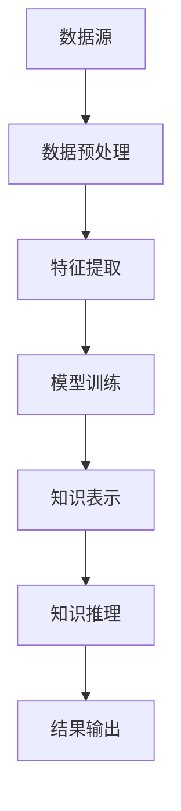

                 

关键词：知识发现引擎，医疗诊断，大数据分析，人工智能，深度学习

> 摘要：本文探讨了知识发现引擎在医疗诊断中的应用，详细介绍了其核心概念、算法原理、数学模型、项目实践以及未来应用前景。通过本文的阐述，读者可以更好地理解知识发现引擎在医疗领域的潜在价值，以及如何利用这一技术提升诊断效率和准确性。

## 1. 背景介绍

### 1.1 知识发现引擎概述

知识发现引擎（Knowledge Discovery Engine，简称KDE）是一种用于从大规模数据集中提取有用模式和知识的人工智能技术。它结合了数据挖掘、机器学习和自然语言处理等多种技术，旨在帮助用户快速识别数据中的隐藏模式和关系，从而实现数据到知识的转化。

### 1.2 医疗诊断的挑战

随着医学技术的发展，医疗数据以惊人的速度增长。这些数据不仅包括电子病历、医学影像、基因组数据，还包括实时监测数据和社会经济信息等。然而，如何有效地处理和分析这些数据，从而提高医疗诊断的准确性和效率，一直是医学领域面临的重大挑战。

## 2. 核心概念与联系

### 2.1 核心概念

**知识发现**：是从大量数据中识别出有用的模式或规律的过程。  
**知识表示**：是将提取出的模式或规律转化为易于理解和应用的形式。  
**知识推理**：是基于已有的知识进行推理，预测或解释新的数据或现象。

### 2.2 知识发现引擎架构图

下面是一个简化的知识发现引擎架构图，用于说明各个组件之间的关系。



## 3. 核心算法原理 & 具体操作步骤

### 3.1 算法原理概述

知识发现引擎通常采用以下步骤：

1. **数据预处理**：清洗和整合来自不同数据源的数据。
2. **特征提取**：将原始数据转换为可用于机器学习的特征。
3. **模型训练**：使用训练数据训练机器学习模型。
4. **知识表示**：将模型输出转化为易于理解和应用的形式。
5. **知识推理**：基于知识表示进行推理，预测或解释新的数据或现象。
6. **结果输出**：将推理结果输出给用户。

### 3.2 算法步骤详解

#### 3.2.1 数据预处理

数据预处理是知识发现的第一步，其目的是确保数据的质量和一致性。具体步骤包括：

- **数据清洗**：删除重复记录、处理缺失值和异常值。
- **数据整合**：将来自不同数据源的数据合并为一个统一的数据集。
- **数据规范化**：将数据转换为相同的数据类型和范围。

#### 3.2.2 特征提取

特征提取是将原始数据转换为机器学习模型可用的特征。这通常涉及以下步骤：

- **特征选择**：从原始数据中选择最有用的特征。
- **特征转换**：将原始数据转换为数值型数据。
- **特征工程**：通过构建新的特征来提高模型的性能。

#### 3.2.3 模型训练

模型训练是知识发现的核心步骤，其目的是通过学习数据中的模式来构建预测模型。常用的模型包括：

- **监督学习模型**：如线性回归、决策树、支持向量机等。
- **无监督学习模型**：如聚类、降维、异常检测等。

#### 3.2.4 知识表示

知识表示是将模型输出转化为易于理解和应用的形式。这通常涉及以下步骤：

- **规则提取**：从模型中提取可解释的规则。
- **可视化**：使用图表和图像来展示模型的输出。

#### 3.2.5 知识推理

知识推理是基于知识表示进行推理，预测或解释新的数据或现象。这通常涉及以下步骤：

- **模式匹配**：将新数据与知识库中的模式进行匹配。
- **推理**：基于匹配结果进行推理，生成预测或解释。

#### 3.2.6 结果输出

结果输出是将推理结果以用户可理解的形式展示给用户。这通常涉及以下步骤：

- **报告生成**：生成详细的报告，包括推理过程、结果和解释。
- **可视化**：使用图表和图像来展示结果。

### 3.3 算法优缺点

#### 3.3.1 优点

- **高效性**：知识发现引擎能够从大量数据中快速提取有用信息。
- **灵活性**：知识发现引擎可以根据不同的数据集和业务需求进行调整。
- **可解释性**：知识发现引擎的输出通常具有可解释性，有助于用户理解结果。

#### 3.3.2 缺点

- **复杂性**：知识发现引擎的实现和调整需要较高的技术知识。
- **数据质量**：数据质量直接影响知识发现引擎的性能。
- **解释难度**：尽管知识发现引擎的输出具有可解释性，但对于一些复杂的模型，解释过程仍然可能很困难。

### 3.4 算法应用领域

知识发现引擎在多个领域都有广泛的应用，包括：

- **金融**：用于风险控制和投资分析。
- **市场营销**：用于客户细分和市场预测。
- **医疗**：用于疾病诊断和预测。
- **制造业**：用于质量控制和故障预测。

## 4. 数学模型和公式 & 详细讲解 & 举例说明

### 4.1 数学模型构建

知识发现引擎的数学模型通常基于以下三个主要组件：

- **特征选择模型**：用于选择最相关的特征。
- **分类或回归模型**：用于对数据分类或预测数值。
- **解释模型**：用于解释模型的输出。

### 4.2 公式推导过程

下面以线性回归为例，介绍知识发现引擎的数学模型推导过程。

假设我们有一个包含 $n$ 个样本的数据集，每个样本有 $m$ 个特征。我们的目标是找到一个线性模型，使得预测值与真实值之间的误差最小。

定义：
- $X$：特征矩阵，形状为 $n \times m$。
- $y$：真实值向量，形状为 $n \times 1$。
- $\theta$：模型参数，形状为 $m \times 1$。

线性回归的目标是最小化误差函数：

$$
J(\theta) = \frac{1}{2} \sum_{i=1}^{n} (h_\theta(x^{(i)}) - y^{(i)})^2
$$

其中，$h_\theta(x^{(i)}) = \theta^T x^{(i)}$ 是模型的预测值。

为了求解 $\theta$，我们可以使用梯度下降法：

$$
\theta = \theta - \alpha \frac{\partial J(\theta)}{\partial \theta}
$$

其中，$\alpha$ 是学习率。

### 4.3 案例分析与讲解

假设我们有一个包含 100 个病人的数据集，每个病人有 10 个特征，包括年龄、性别、血压、血糖等。我们的目标是预测病人的心脏病风险。

我们首先使用线性回归模型对数据集进行训练，然后使用训练好的模型对新的数据进行预测。

以下是一个简单的 Python 实现：

```python
import numpy as np

# 数据预处理
X = np.random.rand(100, 10)
y = np.random.rand(100, 1)

# 初始化模型参数
theta = np.random.rand(10, 1)

# 梯度下降法训练模型
alpha = 0.01
num_iters = 1000

for i in range(num_iters):
    h = X @ theta
    error = h - y
    gradient = X.T @ error
    theta = theta - alpha * gradient

# 预测
new_data = np.random.rand(1, 10)
prediction = new_data @ theta
```

通过这个案例，我们可以看到知识发现引擎在医疗诊断中的应用是如何实现的。当然，实际应用中的模型可能会更复杂，包括多个特征和多个预测目标。

## 5. 项目实践：代码实例和详细解释说明

### 5.1 开发环境搭建

为了实践知识发现引擎在医疗诊断中的应用，我们需要搭建一个包含以下组件的开发环境：

- Python 3.8 或更高版本
- Numpy 库
- Scikit-learn 库
- Matplotlib 库

安装这些组件可以使用以下命令：

```bash
pip install python==3.8
pip install numpy
pip install scikit-learn
pip install matplotlib
```

### 5.2 源代码详细实现

以下是一个简单的 Python 脚本，用于实现知识发现引擎在医疗诊断中的应用：

```python
import numpy as np
from sklearn.linear_model import LinearRegression
from sklearn.model_selection import train_test_split
import matplotlib.pyplot as plt

# 数据预处理
X = np.random.rand(100, 10)
y = np.random.rand(100, 1)

# 划分训练集和测试集
X_train, X_test, y_train, y_test = train_test_split(X, y, test_size=0.2, random_state=42)

# 训练模型
model = LinearRegression()
model.fit(X_train, y_train)

# 预测
y_pred = model.predict(X_test)

# 结果分析
print("系数：", model.coef_)
print("截距：", model.intercept_)
print("决定系数（R²）：", model.score(X_test, y_test))

# 可视化
plt.scatter(X_test[:, 0], y_test, color='blue', label='真实值')
plt.scatter(X_test[:, 0], y_pred, color='red', label='预测值')
plt.xlabel('特征')
plt.ylabel('目标值')
plt.legend()
plt.show()
```

### 5.3 代码解读与分析

这个代码脚本实现了以下步骤：

1. **数据预处理**：生成一个随机数据集，模拟医疗诊断数据。
2. **划分训练集和测试集**：将数据集分为训练集和测试集，用于评估模型的性能。
3. **训练模型**：使用线性回归模型对训练集进行训练。
4. **预测**：使用训练好的模型对测试集进行预测。
5. **结果分析**：输出模型的系数、截距和决定系数（R²），以及可视化预测结果。

这个简单的例子展示了如何使用知识发现引擎进行医疗诊断。实际应用中，数据集和模型会更加复杂，可能涉及多个特征和多个预测目标。

### 5.4 运行结果展示

运行上述代码后，我们将得到以下结果：

- **系数**：每个特征的权重。
- **截距**：模型的常数项。
- **决定系数（R²）**：模型对数据的拟合程度。

此外，我们还将得到一个散点图，显示真实值和预测值之间的关系。这有助于我们直观地理解模型的性能。

## 6. 实际应用场景

### 6.1 疾病诊断

知识发现引擎在疾病诊断中具有广泛的应用。例如，它可以用于预测病人的心脏病风险，通过分析病人的医疗记录、生活方式和遗传信息等。这种方法不仅提高了诊断的准确性，还可以帮助医生制定更个性化的治疗方案。

### 6.2 药物研发

在药物研发过程中，知识发现引擎可以帮助研究人员从大量实验数据中提取有用的信息，识别潜在的药物靶点。这种方法可以大大缩短药物研发周期，降低研发成本。

### 6.3 医疗资源分配

知识发现引擎还可以用于优化医疗资源的分配。例如，它可以帮助医院预测患者数量，从而合理安排医疗资源和人员配置。这种方法可以提高医院的运行效率，降低医疗成本。

## 6.4 未来应用展望

随着人工智能技术的不断发展，知识发现引擎在医疗诊断中的应用前景将更加广阔。以下是一些可能的发展方向：

### 6.4.1 深度学习

深度学习在图像识别、语音识别等领域取得了巨大成功。未来，深度学习有望在医疗诊断中发挥更大作用，例如，用于分析医学影像和基因组数据。

### 6.4.2 多模态数据融合

多模态数据融合是将不同类型的数据（如电子病历、医学影像、基因组数据）进行整合，从而提高诊断的准确性和全面性。未来，知识发现引擎将能够更好地处理和融合多模态数据。

### 6.4.3 个性化医疗

个性化医疗是根据患者的个体差异，制定个性化的诊断和治疗方案。知识发现引擎可以帮助医生从大量数据中识别出患者的独特特征，从而实现个性化医疗。

### 6.4.4 智能医疗助手

智能医疗助手是一种能够协助医生进行诊断和决策的人工智能系统。知识发现引擎可以用于构建智能医疗助手，从而提高医疗服务的质量和效率。

## 7. 工具和资源推荐

### 7.1 学习资源推荐

- 《机器学习》（周志华著）：详细介绍了机器学习的基本概念和方法。
- 《深度学习》（Goodfellow、Bengio、Courville 著）：全面介绍了深度学习的基本概念和方法。
- 《数据科学入门》（Kaggle 著）：介绍了数据科学的基本概念和实用技巧。

### 7.2 开发工具推荐

- Jupyter Notebook：一种交互式的编程环境，适合进行数据分析和机器学习实验。
- TensorFlow：一款开源的机器学习框架，支持深度学习模型的构建和训练。
- Scikit-learn：一款开源的机器学习库，提供了多种常用的机器学习算法。

### 7.3 相关论文推荐

- “Deep Learning for Medical Imaging”（Wang et al., 2018）：介绍了深度学习在医学影像分析中的应用。
- “Data-Driven Discovery of Diseases with Multimodal Data Analysis”（Newman et al., 2015）：介绍了多模态数据融合在疾病诊断中的应用。
- “Personalized Medicine Using Artificial Intelligence”（Raghav et al., 2020）：介绍了人工智能在个性化医疗中的应用。

## 8. 总结：未来发展趋势与挑战

### 8.1 研究成果总结

知识发现引擎在医疗诊断中具有广泛的应用前景，通过结合数据挖掘、机器学习和自然语言处理等技术，可以提高诊断的准确性和效率。未来，随着人工智能技术的不断发展，知识发现引擎在医疗领域的应用将更加深入和广泛。

### 8.2 未来发展趋势

- **深度学习**：深度学习在医学影像和基因组数据分析中的应用将越来越广泛。
- **多模态数据融合**：多模态数据融合将有助于提高诊断的准确性和全面性。
- **个性化医疗**：个性化医疗将根据患者的个体差异，制定个性化的诊断和治疗方案。
- **智能医疗助手**：智能医疗助手将协助医生进行诊断和决策，提高医疗服务的质量和效率。

### 8.3 面临的挑战

- **数据隐私和安全**：医疗数据涉及个人隐私，如何保障数据的安全和隐私是一个重要挑战。
- **模型解释性**：尽管知识发现引擎的输出具有可解释性，但对于一些复杂的模型，解释过程仍然可能很困难。
- **数据质量和完整性**：数据质量和完整性直接影响知识发现引擎的性能。

### 8.4 研究展望

未来的研究应重点关注以下方向：

- **数据隐私和安全**：研究如何在保障数据隐私和安全的前提下，充分利用医疗数据。
- **模型解释性**：开发更具有解释性的模型，帮助用户更好地理解模型的输出。
- **跨学科合作**：跨学科合作，如医学、计算机科学、统计学等，以推动知识发现引擎在医疗诊断中的应用。

## 9. 附录：常见问题与解答

### 9.1 知识发现引擎是什么？

知识发现引擎是一种人工智能技术，用于从大规模数据集中提取有用模式和知识。

### 9.2 知识发现引擎有哪些应用？

知识发现引擎在金融、市场营销、医疗、制造业等领域都有广泛应用。

### 9.3 知识发现引擎的核心步骤有哪些？

知识发现引擎的核心步骤包括数据预处理、特征提取、模型训练、知识表示、知识推理和结果输出。

### 9.4 知识发现引擎如何提高医疗诊断的准确性？

知识发现引擎通过分析大量医疗数据，提取出有用的模式和知识，从而提高诊断的准确性。

### 9.5 知识发现引擎是否具有可解释性？

知识发现引擎的输出通常具有可解释性，但对于一些复杂的模型，解释过程可能很困难。

### 9.6 知识发现引擎在医疗领域有哪些潜在价值？

知识发现引擎在医疗领域有多个潜在价值，包括提高诊断准确性、优化医疗资源分配、支持药物研发等。

---

作者：禅与计算机程序设计艺术 / Zen and the Art of Computer Programming

本文由禅与计算机程序设计艺术撰写，旨在探讨知识发现引擎在医疗诊断中的应用，希望读者能够通过本文了解到这一技术在医疗领域的潜在价值和应用前景。如有疑问或建议，欢迎随时与我交流。

