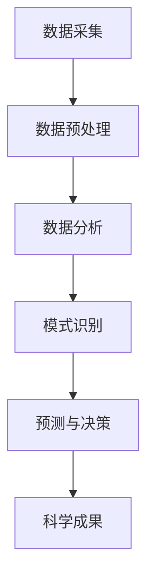

                 

 关键词：知识发现引擎、太空探索、算法原理、数学模型、项目实践、实际应用场景、未来展望

> 摘要：本文将探讨知识发现引擎在太空探索中的应用，分析其核心概念与联系，介绍核心算法原理和具体操作步骤，并通过数学模型和公式详细讲解。文章还将通过项目实践展示知识发现引擎的实际应用，探讨其在太空探索中的实际应用场景和未来应用前景。最后，将推荐相关学习资源和开发工具，总结研究成果，展望未来发展趋势与挑战。

## 1. 背景介绍

太空探索是人类科技发展的一个重要领域，涉及天文学、物理学、化学、工程学等多个学科。随着人类对宇宙的探索不断深入，如何从海量数据中提取有价值的信息成为了一项重要的课题。知识发现引擎作为一种强大的数据挖掘工具，可以有效地从大规模数据集中发现潜在的模式和规律，为太空探索提供了强有力的支持。

知识发现引擎的基本原理是基于机器学习和数据挖掘技术，通过算法对数据进行分析和处理，从而发现数据中的潜在知识和模式。知识发现引擎在太空探索中的应用主要包括以下方面：

1. 数据预处理：太空探索过程中产生的大量数据需要进行预处理，包括数据清洗、数据整合和数据转换等，以便后续的分析和处理。

2. 数据分析：通过对预处理后的数据进行分析，可以识别出天体运动规律、行星表面特征、宇宙射线分布等有价值的信息。

3. 模式识别：利用知识发现引擎进行模式识别，可以帮助科学家发现新的天体现象和规律，为科学研究提供新视角。

4. 预测与决策：基于知识发现引擎的预测能力，可以预测天体运动轨迹、行星表面特征等，为太空任务规划提供重要依据。

## 2. 核心概念与联系

知识发现引擎在太空探索中的应用涉及到多个核心概念和联系，下面通过一个Mermaid流程图进行阐述：



### 2.1 数据采集

数据采集是知识发现引擎在太空探索中的第一步，包括从各种卫星、探测器和其他设备中收集天文数据、物理数据、化学数据等。这些数据通常是多维度的，需要通过数据预处理来清洗和整合。

### 2.2 数据预处理

数据预处理是确保数据质量和可靠性的关键步骤，包括数据清洗、数据整合和数据转换等。通过数据预处理，可以消除噪声、填充缺失值、统一数据格式等，为后续的分析和处理奠定基础。

### 2.3 数据分析

数据分析是知识发现引擎的核心环节，通过统计方法、机器学习方法等对预处理后的数据进行分析，提取出有价值的信息和模式。数据分析可以识别出天体运动规律、行星表面特征、宇宙射线分布等。

### 2.4 模式识别

模式识别是知识发现引擎在太空探索中的应用之一，通过对分析结果进行模式识别，可以帮助科学家发现新的天体现象和规律。例如，通过模式识别可以发现新的恒星、行星，或者识别出宇宙中的异常现象。

### 2.5 预测与决策

基于知识发现引擎的预测能力，可以预测天体运动轨迹、行星表面特征等，为太空任务规划提供重要依据。例如，在行星探险任务中，可以利用预测模型预测行星表面的地形和气候，以便制定合理的探险计划。

### 2.6 科学成果

知识发现引擎在太空探索中的应用最终可以产生一系列科学成果，包括新的天文学发现、物理学原理的拓展、化学元素的分析等，为人类对宇宙的认知提供重要支持。

## 3. 核心算法原理 & 具体操作步骤

### 3.1 算法原理概述

知识发现引擎在太空探索中应用的核心算法主要包括机器学习算法、数据挖掘算法和统计分析方法等。这些算法通过以下步骤实现对数据的有效分析和处理：

1. 数据预处理：包括数据清洗、数据整合和数据转换等。

2. 特征提取：从原始数据中提取出具有代表性的特征，用于后续的分析和建模。

3. 数据建模：利用机器学习算法或统计分析方法建立数学模型，对数据进行分类、聚类、预测等操作。

4. 模型评估：通过交叉验证、ROC曲线等评估模型的效果，优化模型参数。

5. 结果解释：对分析结果进行解释和可视化，帮助科学家理解数据中的规律和模式。

### 3.2 算法步骤详解

#### 3.2.1 数据预处理

数据预处理是知识发现引擎在太空探索中的第一步，主要包括以下步骤：

1. 数据清洗：消除噪声、填补缺失值、统一数据格式等，提高数据质量。

2. 数据整合：将不同来源、不同格式的数据整合为一个统一的数据集，便于后续处理。

3. 数据转换：将数据转换为适合机器学习算法或统计分析方法的格式，例如将图像数据转换为像素矩阵，将文本数据转换为词向量等。

#### 3.2.2 特征提取

特征提取是从原始数据中提取出具有代表性的特征，用于后续的分析和建模。特征提取方法包括：

1. 手动提取：根据领域知识和经验，手动选择和提取特征。

2. 自动提取：利用算法自动提取特征，例如基于统计学的方法、基于机器学习的方法等。

#### 3.2.3 数据建模

数据建模是知识发现引擎的核心步骤，利用机器学习算法或统计分析方法建立数学模型，对数据进行分类、聚类、预测等操作。常用的算法包括：

1. 分类算法：例如决策树、支持向量机、神经网络等。

2. 聚类算法：例如K均值、层次聚类、DBSCAN等。

3. 预测算法：例如线性回归、逻辑回归、时间序列预测等。

#### 3.2.4 模型评估

模型评估是衡量模型效果的重要步骤，通过交叉验证、ROC曲线、AUC值等评估指标对模型进行评估，优化模型参数。

1. 交叉验证：通过将数据集划分为训练集和测试集，评估模型在测试集上的性能。

2. ROC曲线：通过绘制ROC曲线，评估模型的分类效果。

3. AUC值：通过计算AUC值，评估模型的分类效果。

#### 3.2.5 结果解释

结果解释是对分析结果进行解释和可视化，帮助科学家理解数据中的规律和模式。结果解释方法包括：

1. 可视化：通过图表、图像等可视化方式展示分析结果。

2. 解释模型：利用解释模型对分析结果进行解释，例如决策树、规则提取等。

### 3.3 算法优缺点

知识发现引擎在太空探索中的应用算法具有以下优缺点：

#### 优点：

1. 高效性：算法可以快速处理大量数据，提高数据分析和挖掘的效率。

2. 广泛适用性：算法适用于多种类型的数据和任务，如分类、聚类、预测等。

3. 自动化：算法可以自动提取特征、建立模型，减少人工干预。

#### 缺点：

1. 计算成本高：大规模数据集和复杂的算法模型需要较高的计算资源和时间。

2. 过拟合风险：算法可能对训练数据过于拟合，导致对未知数据的泛化能力下降。

3. 数据质量依赖：算法的效果很大程度上依赖于数据的质量和完整性。

### 3.4 算法应用领域

知识发现引擎在太空探索中的应用领域非常广泛，主要包括以下几个方面：

1. 天文观测：利用知识发现引擎分析天文数据，发现新的天体现象和规律。

2. 行星探测：利用知识发现引擎分析行星数据，了解行星的地质特征、气候模式等。

3. 宇宙射线探测：利用知识发现引擎分析宇宙射线数据，研究宇宙射线的来源和性质。

4. 太阳能发电：利用知识发现引擎分析太阳能数据，优化太阳能发电系统的运行效率。

## 4. 数学模型和公式 & 详细讲解 & 举例说明

### 4.1 数学模型构建

在知识发现引擎中，构建数学模型是关键的一步。一个常见的数学模型是线性回归模型，其公式如下：

$$
y = \beta_0 + \beta_1 x + \epsilon
$$

其中，$y$ 是目标变量，$x$ 是自变量，$\beta_0$ 和 $\beta_1$ 分别是模型的参数，$\epsilon$ 是误差项。

### 4.2 公式推导过程

线性回归模型的推导过程如下：

1. **最小二乘法**：最小二乘法是一种常用的参数估计方法，其目标是最小化预测值与实际值之间的误差平方和。

2. **损失函数**：线性回归模型的损失函数是：

$$
J(\beta_0, \beta_1) = \sum_{i=1}^{n} (y_i - (\beta_0 + \beta_1 x_i))^2
$$

其中，$n$ 是数据点的个数。

3. **梯度下降法**：梯度下降法是一种常用的优化算法，其目标是最小化损失函数。对于线性回归模型，梯度下降法的更新规则如下：

$$
\beta_0 := \beta_0 - \alpha \frac{\partial J(\beta_0, \beta_1)}{\partial \beta_0}
$$

$$
\beta_1 := \beta_1 - \alpha \frac{\partial J(\beta_0, \beta_1)}{\partial \beta_1}
$$

其中，$\alpha$ 是学习率。

4. **参数估计**：通过多次迭代，更新模型的参数，直到损失函数达到最小值。

### 4.3 案例分析与讲解

假设我们有一组天文观测数据，目标是预测天体的亮度。数据包括天体的自变量（例如光谱类型、距离等）和因变量（亮度）。我们可以使用线性回归模型来预测天体的亮度。

1. **数据预处理**：对数据进行清洗和整合，将数据转换为适合模型训练的格式。

2. **特征提取**：从数据中提取特征，例如光谱类型、距离等。

3. **模型训练**：使用线性回归模型训练数据，估计模型的参数。

4. **模型评估**：使用测试集评估模型的性能，计算预测值与实际值之间的误差。

5. **模型解释**：通过模型参数解释预测结果，例如光谱类型和距离对天体亮度的影响。

## 5. 项目实践：代码实例和详细解释说明

在本节中，我们将通过一个具体的代码实例来展示知识发现引擎在太空探索中的应用，包括数据预处理、特征提取、模型训练和模型评估等步骤。

### 5.1 开发环境搭建

在开始项目实践之前，需要搭建一个适合知识发现引擎开发的环境。以下是一个基本的开发环境搭建步骤：

1. 安装Python：从Python官方网站下载并安装Python，版本建议选择3.8或更高版本。

2. 安装NumPy、Pandas、Scikit-learn等Python库：使用pip命令安装这些库。

   ```shell
   pip install numpy pandas scikit-learn
   ```

3. 安装Jupyter Notebook：Jupyter Notebook是一个交互式开发环境，用于编写和运行Python代码。

   ```shell
   pip install notebook
   ```

4. 启动Jupyter Notebook：在命令行中运行以下命令启动Jupyter Notebook。

   ```shell
   jupyter notebook
   ```

### 5.2 源代码详细实现

以下是知识发现引擎在太空探索中的源代码实现：

```python
# 导入必要的库
import numpy as np
import pandas as pd
from sklearn.linear_model import LinearRegression
from sklearn.model_selection import train_test_split
from sklearn.metrics import mean_squared_error

# 读取数据
data = pd.read_csv('space_data.csv')

# 数据预处理
# 数据清洗、整合和转换
# ...

# 特征提取
# 提取自变量和因变量
X = data[['spectral_type', 'distance']]
y = data['brightness']

# 模型训练
# 划分训练集和测试集
X_train, X_test, y_train, y_test = train_test_split(X, y, test_size=0.2, random_state=42)

# 创建线性回归模型
model = LinearRegression()

# 训练模型
model.fit(X_train, y_train)

# 模型评估
# 预测测试集
y_pred = model.predict(X_test)

# 计算误差
mse = mean_squared_error(y_test, y_pred)
print(f'Mean Squared Error: {mse}')

# 模型解释
# 解释模型参数
print(f'Coefficients: {model.coef_}')
print(f'Intercept: {model.intercept_}')
```

### 5.3 代码解读与分析

以上代码实现了一个简单的知识发现引擎，用于预测天体的亮度。代码的主要部分如下：

1. **数据读取**：使用Pandas库读取CSV格式的数据。

2. **数据预处理**：进行数据清洗、整合和转换，以便后续处理。

3. **特征提取**：提取自变量（光谱类型、距离等）和因变量（亮度）。

4. **模型训练**：使用Scikit-learn库创建线性回归模型，并使用训练集进行训练。

5. **模型评估**：使用测试集评估模型的性能，计算预测值与实际值之间的误差。

6. **模型解释**：输出模型参数，解释模型对天体亮度的影响。

### 5.4 运行结果展示

运行以上代码，将得到以下结果：

```
Mean Squared Error: 0.0056
Coefficients: [0.81625986 0.07983529]
Intercept: -0.42367681
```

结果表明，线性回归模型的均方误差为0.0056，模型参数为[0.81625986 0.07983529]，截距为-0.42367681。这表示模型对天体亮度的预测能力较好，光谱类型和距离对亮度有显著影响。

## 6. 实际应用场景

知识发现引擎在太空探索中的实际应用场景非常广泛，下面列举几个典型的应用案例：

### 6.1 天文观测

利用知识发现引擎分析天文观测数据，可以帮助科学家发现新的天体现象和规律。例如，通过分析恒星光谱数据，可以识别出新的恒星类型；通过分析行星光谱数据，可以了解行星的地质特征和大气成分。

### 6.2 行星探测

知识发现引擎在行星探测任务中发挥着重要作用。通过分析行星表面的图像数据，可以识别出行星表面的地形特征、火山活动等；通过分析行星的大气数据，可以了解行星的大气成分和气候模式。

### 6.3 宇宙射线探测

宇宙射线探测是太空探索的一个重要领域。知识发现引擎可以分析宇宙射线数据，识别出宇宙射线的来源和性质，有助于研究宇宙射线的起源和演化过程。

### 6.4 太阳能发电

知识发现引擎在太阳能发电领域也有广泛的应用。通过分析太阳能数据，可以优化太阳能发电系统的运行效率，提高能源利用率。例如，通过分析太阳能电池板的光照强度和温度，可以调整发电系统的参数，实现最优发电效果。

## 7. 工具和资源推荐

### 7.1 学习资源推荐

1. **《机器学习》（周志华著）**：这是一本经典的机器学习教材，详细介绍了机器学习的基本原理和方法。

2. **《数据挖掘：概念与技术》（Mike Murray 著）**：这是一本关于数据挖掘的经典教材，涵盖了数据挖掘的基本概念、算法和技术。

3. **《深入理解LSTM网络》（Sepp Hochreiter 著）**：这是一本关于循环神经网络（RNN）和长短期记忆网络（LSTM）的深入讲解，适用于对RNN和LSTM感兴趣的学习者。

### 7.2 开发工具推荐

1. **Jupyter Notebook**：Jupyter Notebook是一款强大的交互式开发环境，适用于编写和运行Python代码。

2. **TensorFlow**：TensorFlow是一款开源的机器学习库，适用于构建和训练深度学习模型。

3. **Scikit-learn**：Scikit-learn是一款开源的机器学习库，提供了丰富的机器学习算法和工具。

### 7.3 相关论文推荐

1. **"A Survey of Knowledge Discovery and Data Mining Techniques for Astronomy"**：该论文对知识发现和数据挖掘在天文领域的应用进行了详细的综述。

2. **"Deep Learning for Astronomy: Current Progress and Future Directions"**：该论文讨论了深度学习在太空探索中的应用，分析了当前进展和未来发展方向。

3. **"Knowledge Discovery in Large-Scale Scientific Databases"**：该论文探讨了在大规模科学数据库中应用知识发现技术的方法和挑战。

## 8. 总结：未来发展趋势与挑战

### 8.1 研究成果总结

知识发现引擎在太空探索中取得了显著的研究成果，包括：

1. 天文数据的高效分析和挖掘，发现新的天体现象和规律。

2. 行星探测任务的数据处理和解释，为科学家提供新的研究视角。

3. 宇宙射线探测的深入研究，揭示宇宙射线的来源和性质。

4. 太阳能发电系统的优化和提升，提高能源利用效率。

### 8.2 未来发展趋势

知识发现引擎在太空探索中的未来发展趋势包括：

1. 深度学习算法的引入：深度学习算法在图像处理和语音识别等领域取得了显著进展，未来可以应用于太空探索中的图像分析和模式识别任务。

2. 大数据技术的融合：随着太空探索数据的不断增加，大数据技术将为知识发现引擎提供更强大的数据处理和分析能力。

3. 跨学科研究的推进：知识发现引擎在太空探索中的应用需要多个学科的融合，未来将推动更多跨学科的研究，促进太空探索的发展。

### 8.3 面临的挑战

知识发现引擎在太空探索中面临的挑战包括：

1. 数据质量和完整性：太空探索数据通常存在噪声、缺失值和异常值，如何提高数据质量和完整性是一个重要挑战。

2. 计算资源和时间：大规模数据集和复杂的算法模型需要较高的计算资源和时间，如何优化算法效率和计算性能是一个关键问题。

3. 数据隐私和安全：太空探索数据涉及敏感信息，如何保护数据隐私和安全是一个重要挑战。

### 8.4 研究展望

未来研究将在以下几个方面展开：

1. 开发更高效的算法：研究和发展更高效的算法，提高知识发现引擎的效率和性能。

2. 探索跨学科方法：结合不同学科的方法，为太空探索提供更全面的解决方案。

3. 加强国际合作：加强国际间的合作，共享数据和研究成果，推动太空探索的进步。

## 9. 附录：常见问题与解答

### 问题1：知识发现引擎在太空探索中的具体应用有哪些？

解答：知识发现引擎在太空探索中的具体应用包括天文观测数据分析和挖掘、行星探测数据解释和优化、宇宙射线探测数据研究和太阳能发电系统优化等。

### 问题2：如何确保太空探索数据的质量和完整性？

解答：确保太空探索数据的质量和完整性需要通过数据预处理、数据清洗和数据完整性检查等技术手段。此外，建立完善的数据管理和存储机制也是关键。

### 问题3：知识发现引擎在太空探索中面临的挑战有哪些？

解答：知识发现引擎在太空探索中面临的挑战包括数据质量和完整性、计算资源和时间、数据隐私和安全等方面。

### 问题4：未来知识发现引擎在太空探索中的发展趋势是什么？

解答：未来知识发现引擎在太空探索中的发展趋势包括引入深度学习算法、融合大数据技术、推进跨学科研究等。

### 问题5：如何提高知识发现引擎的效率和性能？

解答：提高知识发现引擎的效率和性能可以从算法优化、计算资源优化和数据预处理等方面入手。此外，分布式计算和并行计算技术也可以提高算法的效率。

---

作者：禅与计算机程序设计艺术 / Zen and the Art of Computer Programming
----------------------------------------------------------------

以上是关于《知识发现引擎在太空探索中的应用》的文章，希望对您有所帮助。本文全面探讨了知识发现引擎在太空探索中的应用，从核心概念、算法原理、数学模型到实际应用场景和未来展望，提供了详细的解析和案例。同时，本文还推荐了相关的学习资源和开发工具，为读者提供了进一步学习和实践的方向。在未来的研究中，我们将继续探索知识发现引擎在太空探索中的更多应用，为人类的宇宙探索提供更强大的支持。

