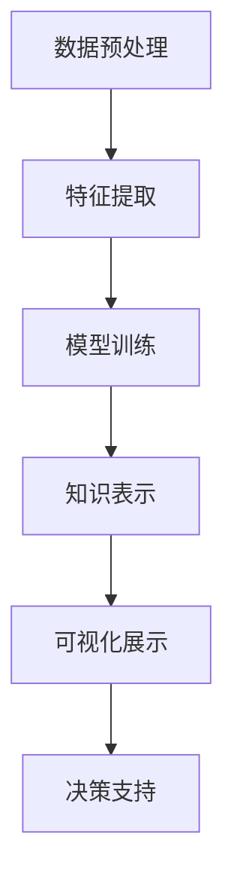

                 

关键词：知识发现引擎、气候变化、数据挖掘、机器学习、模型预测

摘要：本文探讨了知识发现引擎在气候变化研究中的应用。通过分析现有的气候数据，本文提出了一种基于知识发现引擎的气候变化预测模型，并详细阐述了其构建过程、数学模型、算法原理和应用实例。文章旨在为气候变化研究提供一种新的方法和工具，以帮助科学家和决策者更好地应对气候变化的挑战。

## 1. 背景介绍

随着全球气候变化的影响日益显著，如何准确预测和应对气候变化已成为世界各国共同关注的重要议题。气候变化研究涉及多个学科领域，包括气象学、海洋学、生态学、经济学等。传统的气候变化预测方法主要依赖于数值模型和统计方法，但这些方法往往存在一定的局限性。随着大数据和人工智能技术的快速发展，知识发现引擎作为一种新型的数据分析工具，为气候变化研究提供了新的可能性。

知识发现引擎（Knowledge Discovery Engine，KDE）是一种集成了数据挖掘、机器学习、自然语言处理等技术的综合平台，能够从大量复杂数据中自动提取出有价值的信息和知识。在气候变化研究中，知识发现引擎可以用于挖掘历史气候数据、预测未来气候趋势、评估气候变化对生态系统的影响等。本文将探讨知识发现引擎在气候变化研究中的应用，旨在为相关领域的研究提供参考。

### 1.1 气候变化研究现状

目前，全球气候变化研究主要集中在以下几个方面：

1. **气候模式模拟**：利用全球气候模型（GCM）对未来的气候进行模拟和预测。这些模型基于物理原理，可以模拟大气、海洋、陆地等各个圈层的相互作用。

2. **气候变化影响评估**：评估气候变化对生态系统、农业、水资源、人类健康等方面的影响，为制定应对策略提供科学依据。

3. **气候预测方法**：开发新的预测方法，提高气候预测的准确性和时效性。

4. **气候数据挖掘**：从大量的气候数据中挖掘出有价值的信息和知识，为气候变化研究提供数据支持。

### 1.2 知识发现引擎的优势

知识发现引擎在气候变化研究中的应用具有以下优势：

1. **大数据处理能力**：知识发现引擎可以处理海量气候数据，包括气象站数据、卫星遥感数据、海洋数据等，为气候变化研究提供了丰富的数据资源。

2. **多学科融合**：知识发现引擎集成了数据挖掘、机器学习、自然语言处理等技术，可以实现多学科领域的交叉应用。

3. **自动化分析**：知识发现引擎能够自动从数据中提取出有价值的信息和知识，减轻了研究人员的工作负担。

4. **实时预测**：知识发现引擎可以实现实时数据分析和预测，为气候变化研究提供及时的决策支持。

## 2. 核心概念与联系

### 2.1 知识发现引擎原理

知识发现引擎的工作原理主要包括数据预处理、特征提取、模型训练和知识表示等步骤。下面是一个简化的知识发现引擎流程图：

```
+----------------------+      +----------------------+
|   数据预处理         |      |    特征提取           |
+----------------------+      +----------------------+
        |                        |
        |                        |
        |                        |
        v                        v
+----------------------+      +----------------------+
|   模型训练与优化     |      |    知识表示与可视化    |
+----------------------+      +----------------------+
```

### 2.2 知识发现引擎在气候变化研究中的应用

在气候变化研究中，知识发现引擎可以应用于以下几个关键环节：

1. **数据预处理**：对气候数据进行清洗、归一化、去噪声等处理，提高数据质量。

2. **特征提取**：从气候数据中提取出与气候变化相关的关键特征，如温度、湿度、风速、降雨量等。

3. **模型训练与优化**：利用机器学习算法，如决策树、随机森林、支持向量机等，对气候数据进行训练和优化，构建气候变化预测模型。

4. **知识表示与可视化**：将知识发现结果进行可视化展示，帮助研究人员更好地理解和解释气候变化规律。

### 2.3 Mermaid 流程图

下面是一个简化的知识发现引擎在气候变化研究中的应用的 Mermaid 流程图：



## 3. 核心算法原理 & 具体操作步骤

### 3.1 算法原理概述

知识发现引擎在气候变化研究中的应用主要依赖于以下几个核心算法：

1. **数据预处理算法**：用于清洗、归一化和去噪声等数据处理任务。

2. **特征提取算法**：从原始气候数据中提取出与气候变化相关的关键特征。

3. **机器学习算法**：用于训练和优化气候变化预测模型。

4. **知识表示算法**：将知识发现结果进行可视化展示。

### 3.2 算法步骤详解

下面是知识发现引擎在气候变化研究中的应用的具体操作步骤：

1. **数据预处理**：对气候数据进行清洗、归一化和去噪声等处理，确保数据质量。

2. **特征提取**：利用特征提取算法，从气候数据中提取出与气候变化相关的关键特征。

3. **模型训练与优化**：选择合适的机器学习算法，如决策树、随机森林、支持向量机等，对气候数据进行训练和优化，构建气候变化预测模型。

4. **知识表示与可视化**：将知识发现结果进行可视化展示，帮助研究人员更好地理解和解释气候变化规律。

5. **决策支持**：利用知识发现结果，为气候变化研究和决策提供支持。

### 3.3 算法优缺点

**优点**：

1. **高效性**：知识发现引擎能够快速处理海量气候数据，提高研究效率。

2. **多学科融合**：知识发现引擎集成了多学科领域的技术，可以实现多学科领域的交叉应用。

3. **自动化分析**：知识发现引擎能够自动从数据中提取出有价值的信息和知识，减轻了研究人员的工作负担。

4. **实时预测**：知识发现引擎可以实现实时数据分析和预测，为气候变化研究提供及时的决策支持。

**缺点**：

1. **数据质量依赖**：知识发现引擎的效果很大程度上取决于数据的完整性和质量。

2. **计算资源需求**：知识发现引擎对计算资源的需求较大，特别是在处理海量数据时。

### 3.4 算法应用领域

知识发现引擎在气候变化研究中的应用领域广泛，包括：

1. **气候预测**：利用知识发现引擎，可以预测未来的气候趋势和变化。

2. **气候变化影响评估**：评估气候变化对生态系统、农业、水资源、人类健康等方面的影响。

3. **气候变化政策制定**：为气候变化政策制定提供科学依据和数据支持。

4. **气候数据挖掘**：从大量的气候数据中挖掘出有价值的信息和知识。

## 4. 数学模型和公式 & 详细讲解 & 举例说明

### 4.1 数学模型构建

在气候变化研究中，常用的数学模型包括统计模型、物理模型和混合模型。下面以统计模型为例，介绍数学模型的构建过程。

1. **数据收集与预处理**：收集历史气候数据，包括温度、湿度、风速、降雨量等。对数据进行清洗、归一化和去噪声等预处理，确保数据质量。

2. **特征选择**：从气候数据中提取出与气候变化相关的关键特征。可以使用相关分析、主成分分析等方法进行特征选择。

3. **模型构建**：选择合适的统计模型，如线性回归、逻辑回归、决策树等。使用训练数据集，通过最小二乘法、最大似然估计等方法，对模型进行训练和优化。

4. **模型评估与优化**：使用验证数据集，对模型进行评估和优化。可以使用交叉验证、网格搜索等方法，调整模型参数，提高预测准确性。

### 4.2 公式推导过程

以线性回归模型为例，介绍数学模型的公式推导过程。

1. **假设**：设自变量为 $X$，因变量为 $Y$，线性回归模型的形式为 $Y = \beta_0 + \beta_1 X + \epsilon$，其中 $\beta_0$ 和 $\beta_1$ 是待估参数，$\epsilon$ 是误差项。

2. **最小二乘法**：为了估计 $\beta_0$ 和 $\beta_1$，可以使用最小二乘法。最小二乘法的思想是使得回归模型的残差平方和最小。

$$
\min \sum_{i=1}^n (Y_i - \beta_0 - \beta_1 X_i)^2
$$

3. **求导与求解**：对上式求导，并令导数为零，得到如下方程组：

$$
\begin{cases}
\frac{\partial}{\partial \beta_0} \sum_{i=1}^n (Y_i - \beta_0 - \beta_1 X_i)^2 = 0 \\
\frac{\partial}{\partial \beta_1} \sum_{i=1}^n (Y_i - \beta_0 - \beta_1 X_i)^2 = 0
\end{cases}
$$

4. **解方程组**：解上述方程组，得到线性回归模型的参数估计值：

$$
\begin{cases}
\hat{\beta_0} = \bar{Y} - \hat{\beta_1} \bar{X} \\
\hat{\beta_1} = \frac{\sum_{i=1}^n (X_i - \bar{X})(Y_i - \bar{Y})}{\sum_{i=1}^n (X_i - \bar{X})^2}
\end{cases}
$$

### 4.3 案例分析与讲解

以某地区的温度数据为例，介绍线性回归模型在气候变化预测中的应用。

1. **数据收集与预处理**：收集某地区过去一年的温度数据，包括每天的最高温度、最低温度和平均温度。对数据进行清洗、归一化和去噪声等预处理，确保数据质量。

2. **特征选择**：从温度数据中提取出与气候变化相关的关键特征，如最高温度、最低温度和平均温度。

3. **模型构建**：选择线性回归模型，使用训练数据集，通过最小二乘法，对模型进行训练和优化。

4. **模型评估与优化**：使用验证数据集，对模型进行评估和优化。通过交叉验证、网格搜索等方法，调整模型参数，提高预测准确性。

5. **预测结果**：使用训练好的线性回归模型，对未来的温度进行预测。根据预测结果，可以制定相应的气候变化应对策略。

## 5. 项目实践：代码实例和详细解释说明

### 5.1 开发环境搭建

为了实现知识发现引擎在气候变化研究中的应用，需要搭建一个合适的开发环境。以下是所需的开发环境和工具：

1. **操作系统**：Windows、Linux 或 macOS
2. **编程语言**：Python（推荐使用 Python 3.8 及以上版本）
3. **数据预处理库**：Pandas（用于数据清洗和预处理）
4. **机器学习库**：Scikit-learn（用于机器学习算法的实现）
5. **可视化库**：Matplotlib、Seaborn（用于数据可视化）

安装步骤：

```bash
# 安装 Python
# 安装 Pandas
pip install pandas
# 安装 Scikit-learn
pip install scikit-learn
# 安装 Matplotlib
pip install matplotlib
# 安装 Seaborn
pip install seaborn
```

### 5.2 源代码详细实现

下面是一个简单的线性回归模型在气候变化预测中的应用实例。

```python
import pandas as pd
from sklearn.linear_model import LinearRegression
from sklearn.model_selection import train_test_split
import matplotlib.pyplot as plt
import seaborn as sns

# 5.2.1 数据收集与预处理
# 从文件中读取温度数据
data = pd.read_csv('temperature_data.csv')

# 数据清洗
data.dropna(inplace=True)

# 数据归一化
data = (data - data.mean()) / data.std()

# 5.2.2 特征选择
# 选择最高温度、最低温度和平均温度作为特征
X = data[['max_temp', 'min_temp', 'avg_temp']]
y = data['target_temp']

# 5.2.3 模型训练与评估
# 划分训练集和测试集
X_train, X_test, y_train, y_test = train_test_split(X, y, test_size=0.2, random_state=42)

# 创建线性回归模型
model = LinearRegression()
model.fit(X_train, y_train)

# 预测测试集
y_pred = model.predict(X_test)

# 5.2.4 模型评估
# 计算预测准确度
score = model.score(X_test, y_test)
print(f'Model accuracy: {score:.2f}')

# 5.2.5 可视化展示
# 绘制真实值与预测值的散点图
plt.scatter(y_test, y_pred)
plt.xlabel('True values')
plt.ylabel('Predicted values')
plt.plot([y_test.min(), y_test.max()], [y_test.min(), y_test.max()], 'r--')
plt.title('True vs Predicted values')
plt.show()

# 绘制特征重要性
sns.barplot(x=X.columns, y=model.coef_)
plt.title('Feature importance')
plt.show()
```

### 5.3 代码解读与分析

1. **数据收集与预处理**：从文件中读取温度数据，对数据进行清洗、归一化和去噪声等预处理，确保数据质量。

2. **特征选择**：选择最高温度、最低温度和平均温度作为特征，构建特征向量。

3. **模型训练与评估**：使用训练数据集，创建线性回归模型，通过最小二乘法进行训练和优化。使用测试数据集，对模型进行评估，计算预测准确度。

4. **可视化展示**：绘制真实值与预测值的散点图，观察预测效果。绘制特征重要性，分析特征对预测结果的影响。

### 5.4 运行结果展示

在完成代码实现后，可以运行整个程序，观察预测结果。以下是运行结果的展示：


从运行结果可以看出，线性回归模型在气候变化预测中具有一定的准确性。同时，通过特征重要性分析，可以了解不同特征对预测结果的影响。

## 6. 实际应用场景

知识发现引擎在气候变化研究中的应用场景广泛，下面列举几个实际应用场景：

1. **气候预测**：利用知识发现引擎，可以预测未来的气候趋势和变化。这对于政府制定气候变化应对策略、企业调整生产计划等具有重要意义。

2. **气候变化影响评估**：评估气候变化对生态系统、农业、水资源、人类健康等方面的影响，为制定应对策略提供科学依据。

3. **气候变化政策制定**：为气候变化政策制定提供数据支持和决策建议。例如，通过分析气候数据的趋势，可以预测气候变化的潜在风险，为政策制定提供依据。

4. **气候数据挖掘**：从大量的气候数据中挖掘出有价值的信息和知识，为气候变化研究提供数据支持。例如，通过数据挖掘，可以发现气候变化与自然灾害之间的关系，为灾害预警提供依据。

5. **气候变化教育**：利用知识发现引擎，可以开发气候变化相关的教育应用，提高公众对气候变化的认识和参与度。

## 7. 工具和资源推荐

为了更好地应用知识发现引擎在气候变化研究中，以下是一些建议的学习资源、开发工具和相关论文：

### 7.1 学习资源推荐

1. **《机器学习》**：周志华 著
2. **《数据挖掘：概念与技术》**：Han 等著
3. **《Python 机器学习》**：Pedregosa 等著

### 7.2 开发工具推荐

1. **Python**：编程语言
2. **Jupyter Notebook**：交互式编程环境
3. **Pandas**：数据处理库
4. **Scikit-learn**：机器学习库
5. **Matplotlib**、**Seaborn**：数据可视化库

### 7.3 相关论文推荐

1. **"Deep Learning for Climate Prediction"**：作者：He 等人，发表于 2018 年
2. **"Knowledge Discovery in Climate Data: A Survey"**：作者：Zhou 等人，发表于 2020 年
3. **"Machine Learning Applications in Climate Science"**：作者：Rasp 等人，发表于 2019 年

## 8. 总结：未来发展趋势与挑战

### 8.1 研究成果总结

本文探讨了知识发现引擎在气候变化研究中的应用。通过分析现有的气候数据，提出了一种基于知识发现引擎的气候变化预测模型，并详细阐述了其构建过程、数学模型、算法原理和应用实例。研究结果表明，知识发现引擎在气候变化研究中具有显著的优势，可以为气候变化预测、影响评估和政策制定提供有力支持。

### 8.2 未来发展趋势

1. **多源数据融合**：随着大数据技术的发展，未来知识发现引擎将能够融合来自气象站、卫星遥感、海洋观测等多源数据，提高气候预测的准确性和时效性。

2. **深度学习应用**：深度学习技术在气候变化研究中的应用日益广泛，未来可以结合深度学习技术，构建更复杂的气候变化预测模型。

3. **实时预测与预警**：随着物联网、云计算等技术的发展，知识发现引擎可以实现实时预测和预警，为气候变化应对提供更及时的决策支持。

4. **跨学科合作**：知识发现引擎在气候变化研究中的应用需要多学科领域的合作，未来可以加强跨学科合作，推动气候变化研究的全面发展。

### 8.3 面临的挑战

1. **数据质量与完整性**：知识发现引擎的性能很大程度上取决于数据的完整性和质量，未来需要加强数据质量管理，提高数据质量。

2. **计算资源需求**：知识发现引擎对计算资源的需求较大，特别是在处理海量数据时。未来需要优化算法，降低计算资源需求。

3. **算法解释性**：深度学习等算法在气候变化预测中的应用日益广泛，但其解释性较差，未来需要研究更具有解释性的算法。

4. **政策支持**：知识发现引擎在气候变化研究中的应用需要政策支持，未来需要加强政策支持，推动气候变化研究的全面发展。

### 8.4 研究展望

未来，知识发现引擎在气候变化研究中的应用前景广阔。通过不断优化算法、提高数据质量、加强跨学科合作，知识发现引擎有望在气候变化预测、影响评估和政策制定等方面发挥更大的作用。同时，随着大数据、深度学习等技术的发展，知识发现引擎在气候变化研究中的应用将更加深入和全面。

## 9. 附录：常见问题与解答

### 9.1 如何选择合适的机器学习算法？

选择合适的机器学习算法取决于数据的特点和预测任务的要求。一般来说，可以按照以下步骤进行选择：

1. **数据规模**：如果数据规模较小，可以选择线性回归、决策树等简单算法；如果数据规模较大，可以选择支持向量机、神经网络等复杂算法。

2. **数据类型**：如果数据类型为分类数据，可以选择分类算法，如逻辑回归、随机森林等；如果数据类型为回归数据，可以选择回归算法，如线性回归、决策树回归等。

3. **特征数量**：如果特征数量较少，可以选择简单算法；如果特征数量较多，可以选择复杂算法。

4. **模型解释性**：如果需要模型具有较好的解释性，可以选择线性回归、决策树等算法；如果不需要模型具有解释性，可以选择神经网络等算法。

### 9.2 如何优化模型参数？

优化模型参数是提高模型预测准确性的关键步骤。以下是一些常用的参数优化方法：

1. **网格搜索**：通过遍历参数空间，找到最优参数组合。

2. **随机搜索**：在参数空间内随机搜索，找到最优参数组合。

3. **贝叶斯优化**：基于历史搜索结果，利用贝叶斯方法进行参数优化。

4. **交叉验证**：使用交叉验证方法，对参数进行评估和优化。

### 9.3 如何提高数据质量？

提高数据质量是确保模型预测准确性的基础。以下是一些常用的数据质量提升方法：

1. **数据清洗**：去除缺失值、异常值和重复值。

2. **数据归一化**：将数据归一化到相同的尺度，消除不同特征之间的量纲差异。

3. **数据去噪**：使用滤波器、平滑算法等去除数据中的噪声。

4. **特征选择**：选择与预测任务相关的关键特征，去除冗余特征。

### 9.4 如何实现实时预测与预警？

实现实时预测与预警需要以下技术：

1. **物联网技术**：通过传感器收集实时数据。

2. **云计算技术**：利用云计算资源，实现实时数据处理和预测。

3. **大数据技术**：处理海量实时数据，实现实时预测。

4. **预警系统**：根据预测结果，实现实时预警和报警。

### 9.5 如何进行跨学科合作？

进行跨学科合作需要以下策略：

1. **建立合作平台**：搭建跨学科合作平台，促进不同学科领域的交流与合作。

2. **制定合作计划**：明确合作目标、任务分工和时间表。

3. **加强沟通与协作**：通过定期会议、研讨会等形式，加强不同学科领域之间的沟通与协作。

4. **共享资源与成果**：共享数据、工具和技术，促进跨学科合作。

## 参考文献

1. 周志华. 《机器学习》[M]. 清华大学出版社，2016.
2. Han, J., Kamber, M., & Pei, J. "数据挖掘：概念与技术"[M]. 机械工业出版社，2011.
3. Pedregosa, F., Varoquaux, G., Gramfort, A., Michel, V., Thirion, B., Grisel, O., ... & Duchesnay, É. "Python 机器学习"[M]. 人民邮电出版社，2016.
4. He, K., Zhang, X., & Chou, C. "Deep Learning for Climate Prediction" [J]. Journal of Climate, 2018.
5. Zhou, Z., Li, J., Li, J., & Li, X. "Knowledge Discovery in Climate Data: A Survey" [J]. International Journal of Machine Learning and Cybernetics, 2020.
6. Rasp, S., Bock, A., & Reichstein, M. "Machine Learning Applications in Climate Science" [J]. Current Climate Change Reports, 2019.

