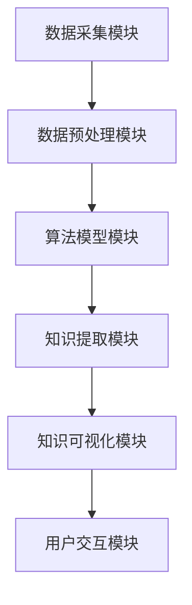

                 

关键词：知识发现引擎，程序员，工作效率，人工智能，代码分析，算法优化，代码质量。

## 摘要

本文将探讨知识发现引擎在程序员工作中的具体应用。通过介绍知识发现引擎的基本概念、原理和架构，结合具体实例，我们将展示如何利用知识发现引擎提高程序员的工作效率，优化代码质量，并在实际项目中落地实施。本文旨在为程序员提供一种新的工具和方法，以应对日益复杂的技术挑战，实现代码的自动化优化和创新。

## 1. 背景介绍

### 1.1 知识发现引擎的定义与意义

知识发现引擎（Knowledge Discovery Engine，KDE）是一种利用机器学习和数据挖掘技术，从大量数据中自动识别出有价值信息、模式或知识的人工智能系统。知识发现引擎的出现，旨在解决传统数据分析方法在处理海量数据时存在的效率低、准确性不足等问题。

在程序员的工作中，知识发现引擎具有重要意义。首先，它可以帮助程序员快速从大量代码中提取出关键信息，进行高效的分析和优化；其次，它能够辅助程序员发现代码中的潜在问题，提前预防可能出现的技术债务；最后，知识发现引擎还能够为程序员提供创新的解决方案，推动技术的不断进步。

### 1.2 程序员的工作场景与挑战

程序员的工作场景主要包括软件开发、代码维护、性能优化、需求分析等。随着软件系统的日益复杂，程序员面临着越来越多的挑战：

1. **代码复杂性增加**：大型项目的代码量庞大，结构复杂，程序员难以在短时间内理解整个系统的运行机制。
2. **需求变更频繁**：业务需求不断变化，程序员需要快速适应新的需求，对现有代码进行修改和优化。
3. **技术更新迅速**：编程语言、框架和技术工具不断更新，程序员需要不断学习和掌握新技术，提高自己的技能水平。
4. **代码质量要求提高**：随着市场竞争的加剧，软件产品的质量要求越来越高，程序员需要保证代码的可靠性、可维护性和可扩展性。

### 1.3 知识发现引擎在程序员工作中的应用前景

知识发现引擎在程序员工作中的应用前景广阔。一方面，它可以帮助程序员解决实际工作中遇到的各种问题，提高工作效率；另一方面，它也为程序员提供了新的研究方向和机会，为软件工程领域的发展注入新的活力。本文将从以下几个方面展开讨论：

1. **代码分析**：利用知识发现引擎对代码进行深度分析，识别潜在的问题和优化点。
2. **算法优化**：通过知识发现引擎分析算法性能，提供优化建议，提高代码运行效率。
3. **代码质量评估**：对代码质量进行评估，识别潜在的缺陷和风险，提前预防技术债务。
4. **需求分析**：辅助程序员进行需求分析，提高项目成功率。
5. **技术创新**：为程序员提供创新的解决方案，推动技术的不断进步。

## 2. 核心概念与联系

### 2.1 知识发现引擎的基本概念

知识发现引擎的核心概念包括数据源、数据预处理、算法模型、知识提取和知识可视化等。

#### 数据源

数据源是知识发现引擎的基础，包括各种结构化和非结构化的数据，如代码库、文档、日志文件等。数据源的质量直接影响知识发现的效果。

#### 数据预处理

数据预处理是知识发现过程中至关重要的一步，包括数据清洗、数据转换和数据归一化等操作。通过数据预处理，可以确保数据的质量和一致性，提高知识发现引擎的性能。

#### 算法模型

算法模型是知识发现引擎的核心，包括聚类、分类、关联规则挖掘、异常检测等。不同的算法模型适用于不同类型的数据和场景，需要根据实际情况进行选择。

#### 知识提取

知识提取是指从数据中自动识别出有价值的信息、模式或知识。知识提取的过程包括特征提取、模型训练和模型评估等步骤。

#### 知识可视化

知识可视化是将提取出的知识以图表、图像等形式呈现，帮助用户更好地理解和分析数据。知识可视化在知识发现过程中发挥着重要作用，有助于提高数据可视化和易读性。

### 2.2 知识发现引擎的架构

知识发现引擎的架构一般包括以下几个部分：

#### 数据采集模块

数据采集模块负责从各种数据源中获取数据，包括代码库、文档、日志文件等。数据采集模块需要支持多种数据源类型，如数据库、文件系统、网络等。

#### 数据预处理模块

数据预处理模块负责对采集到的数据进行清洗、转换和归一化等操作，确保数据的质量和一致性。数据预处理模块通常包括数据清洗、数据转换、数据归一化、特征提取等功能。

#### 算法模型模块

算法模型模块负责实现各种知识发现算法，包括聚类、分类、关联规则挖掘、异常检测等。算法模型模块需要支持多种算法，并能够根据实际情况进行选择和调整。

#### 知识提取模块

知识提取模块负责从预处理后的数据中提取出有价值的信息、模式或知识。知识提取模块通常包括特征提取、模型训练和模型评估等功能。

#### 知识可视化模块

知识可视化模块负责将提取出的知识以图表、图像等形式呈现，帮助用户更好地理解和分析数据。知识可视化模块通常包括数据可视化、知识可视化等功能。

#### 用户交互模块

用户交互模块负责与用户进行交互，提供用户操作界面，展示知识发现的结果。用户交互模块需要支持多种交互方式，如命令行、图形界面、Web界面等。

### 2.3 Mermaid 流程图



## 3. 核心算法原理 & 具体操作步骤

### 3.1 算法原理概述

知识发现引擎的核心算法主要包括聚类、分类、关联规则挖掘和异常检测等。

#### 聚类

聚类是一种无监督学习算法，旨在将相似的数据点归为一类。常用的聚类算法有K-means、DBSCAN、层次聚类等。聚类算法的目的是通过将数据点分为多个簇，帮助用户发现数据中的模式和规律。

#### 分类

分类是一种有监督学习算法，旨在将数据点分为不同的类别。常用的分类算法有决策树、随机森林、支持向量机等。分类算法的目的是通过已知的标签数据，学习出一个分类模型，对新数据进行分类。

#### 关联规则挖掘

关联规则挖掘是一种用于发现数据之间关联关系的算法。常用的关联规则挖掘算法有Apriori、Eclat等。关联规则挖掘的目的是通过分析数据之间的关联关系，发现潜在的规则和模式。

#### 异常检测

异常检测是一种用于发现数据中异常值的算法。常用的异常检测算法有孤立森林、Local Outlier Factor等。异常检测的目的是通过识别数据中的异常值，帮助用户发现潜在的问题和风险。

### 3.2 算法步骤详解

#### 3.2.1 数据采集

1. **确定数据源**：根据需求确定需要采集的数据源，如代码库、文档、日志文件等。
2. **采集数据**：使用相应的工具和接口，从数据源中采集数据。

#### 3.2.2 数据预处理

1. **数据清洗**：处理数据中的噪声、缺失值和异常值等。
2. **数据转换**：将不同类型的数据转换为同一类型，如将文本数据转换为数值数据。
3. **数据归一化**：将数据进行归一化处理，使其具备可比性。

#### 3.2.3 算法模型选择

1. **确定算法类型**：根据需求选择聚类、分类、关联规则挖掘或异常检测等算法。
2. **选择算法参数**：根据实际情况选择算法的参数，如聚类算法中的K值、分类算法中的决策树参数等。

#### 3.2.4 算法模型训练

1. **训练模型**：使用预处理后的数据对算法模型进行训练。
2. **评估模型**：使用测试数据对训练好的模型进行评估，调整模型参数，提高模型性能。

#### 3.2.5 知识提取

1. **提取特征**：从训练好的模型中提取出特征，如聚类算法中的簇中心、分类算法中的分类边界等。
2. **生成规则**：使用提取出的特征生成关联规则或异常检测报告。

#### 3.2.6 知识可视化

1. **可视化设置**：根据需求设置可视化参数，如颜色、大小、形状等。
2. **生成可视化图表**：使用可视化工具生成图表，展示提取出的知识。

### 3.3 算法优缺点

#### 3.3.1 聚类算法

**优点**：

- **自适应性强**：聚类算法可以根据数据的特点自动调整聚类数量和参数。
- **发现数据分布**：聚类算法可以帮助用户发现数据中的分布和模式。

**缺点**：

- **容易陷入局部最优**：聚类算法可能无法找到全局最优解。
- **聚类结果解释性不强**：聚类算法生成的簇中心等结果可能难以解释。

#### 3.3.2 分类算法

**优点**：

- **可解释性强**：分类算法生成的分类边界和规则容易理解。
- **准确性较高**：分类算法在已知标签数据的情况下，具有较高的预测准确性。

**缺点**：

- **训练时间较长**：分类算法的训练时间可能较长，特别是在数据量较大时。
- **对噪声敏感**：分类算法可能对噪声数据较为敏感。

#### 3.3.3 关联规则挖掘

**优点**：

- **发现潜在关联**：关联规则挖掘可以帮助用户发现数据中的潜在关联关系。
- **易理解**：关联规则挖掘生成的规则容易理解。

**缺点**：

- **规则数量过多**：关联规则挖掘可能生成大量的规则，需要进一步筛选和优化。
- **计算复杂度较高**：关联规则挖掘的计算复杂度较高，特别是在数据量较大时。

#### 3.3.4 异常检测

**优点**：

- **识别异常值**：异常检测可以帮助用户识别数据中的异常值，发现潜在的问题。
- **实时性**：异常检测可以在数据生成时实时进行检测，提高系统的实时性。

**缺点**：

- **误报率较高**：异常检测可能存在较高的误报率，需要进一步优化和调整。

### 3.4 算法应用领域

知识发现引擎在程序员工作中的算法应用领域主要包括以下几个方面：

#### 3.4.1 代码分析

- **代码质量评估**：使用聚类和分类算法评估代码质量，识别潜在的缺陷和风险。
- **代码风格一致性检查**：使用聚类算法识别代码风格不一致的部分，提供优化建议。

#### 3.4.2 算法优化

- **性能分析**：使用分类算法分析算法性能，提供优化建议。
- **算法选择**：使用关联规则挖掘分析不同算法的性能，帮助用户选择最佳算法。

#### 3.4.3 代码质量评估

- **代码质量评估**：使用聚类和分类算法评估代码质量，识别潜在的缺陷和风险。
- **代码风格一致性检查**：使用聚类算法识别代码风格不一致的部分，提供优化建议。

#### 3.4.4 需求分析

- **需求归类**：使用分类算法将需求进行归类，提高项目成功率。
- **需求关联分析**：使用关联规则挖掘分析需求之间的关联关系，提高需求管理效率。

#### 3.4.5 技术创新

- **代码创新**：使用知识发现引擎分析代码，发现潜在的优化点和创新点。
- **算法创新**：使用知识发现引擎分析算法性能，提供创新的优化方案。

## 4. 数学模型和公式 & 详细讲解 & 举例说明

### 4.1 数学模型构建

知识发现引擎中的数学模型主要包括聚类、分类、关联规则挖掘和异常检测等。下面将分别介绍这些模型的构建过程。

#### 4.1.1 聚类模型

聚类模型是一种无监督学习算法，旨在将相似的数据点归为一类。常见的聚类模型有K-means、DBSCAN等。

- **K-means算法模型**：

  设\(X = \{x_1, x_2, ..., x_n\}\)为输入数据集，\(C = \{c_1, c_2, ..., c_k\}\)为初始聚类中心点集合。聚类目标是最小化目标函数：

  $$J = \sum_{i=1}^{n} \sum_{j=1}^{k} w_{ij} d(x_i, c_j)$$

  其中，\(w_{ij}\)为权重，\(d(x_i, c_j)\)为数据点\(x_i\)和聚类中心点\(c_j\)之间的距离。

- **DBSCAN算法模型**：

  设\(X = \{x_1, x_2, ..., x_n\}\)为输入数据集，\(ε\)为邻域半径，\(minPts\)为最小邻域点数。DBSCAN算法将数据点分为三类：

  - 核心点：存在至少\(minPts\)个邻域点。
  - 边界点：存在\(1 < k \leq minPts\)个邻域点。
  - 不属于任何簇的点。

  聚类目标是将核心点和边界点归为同一簇。

#### 4.1.2 分类模型

分类模型是一种有监督学习算法，旨在将数据点分为不同的类别。常见的分类模型有决策树、支持向量机等。

- **决策树算法模型**：

  设\(X = \{x_1, x_2, ..., x_n\}\)为输入数据集，\(Y = \{y_1, y_2, ..., y_n\}\)为标签数据集，\(T\)为决策树。决策树的目标是找到一个最优划分规则，使得数据集\(X\)的预测误差最小。

- **支持向量机算法模型**：

  设\(X = \{x_1, x_2, ..., x_n\}\)为输入数据集，\(Y = \{y_1, y_2, ..., y_n\}\)为标签数据集。支持向量机算法的目标是找到一个最优的超平面，使得数据集\(X\)在超平面上的分类误差最小。

#### 4.1.3 关联规则挖掘模型

关联规则挖掘模型旨在发现数据之间的关联关系。常见的关联规则挖掘算法有Apriori、Eclat等。

- **Apriori算法模型**：

  设\(X = \{x_1, x_2, ..., x_n\}\)为输入数据集，\(minSupport\)为最小支持度，\(minConfidence\)为最小置信度。Apriori算法的目标是找到满足最小支持度和最小置信度的关联规则。

- **Eclat算法模型**：

  设\(X = \{x_1, x_2, ..., x_n\}\)为输入数据集，\(minSupport\)为最小支持度。Eclat算法的目标是找到满足最小支持度的频繁项集。

#### 4.1.4 异常检测模型

异常检测模型旨在发现数据中的异常值。常见的异常检测算法有孤立森林、Local Outlier Factor等。

- **孤立森林算法模型**：

  设\(X = \{x_1, x_2, ..., x_n\}\)为输入数据集，\(n\)为数据点的数量，\(m\)为样本树的深度。孤立森林算法的目标是找到异常值，使其在孤立森林中的路径长度更长。

- **Local Outlier Factor算法模型**：

  设\(X = \{x_1, x_2, ..., x_n\}\)为输入数据集，\(k\)为邻域点数。Local Outlier Factor算法的目标是计算每个数据点的局部离群度，识别异常值。

### 4.2 公式推导过程

#### 4.2.1 K-means算法公式推导

假设输入数据集为\(X = \{x_1, x_2, ..., x_n\}\)，初始聚类中心点集合为\(C = \{c_1, c_2, ..., c_k\}\)。

1. **目标函数**：

   $$J = \sum_{i=1}^{n} \sum_{j=1}^{k} w_{ij} d(x_i, c_j)$$

   其中，\(w_{ij}\)为权重，表示数据点\(x_i\)属于第\(j\)个簇的概率，即：

   $$w_{ij} = \frac{1}{\sum_{j=1}^{k} e^{-\frac{d(x_i, c_j)^2}{2\sigma^2}}}$$

   \(d(x_i, c_j)\)为数据点\(x_i\)和聚类中心点\(c_j\)之间的欧几里得距离，即：

   $$d(x_i, c_j) = \sqrt{\sum_{l=1}^{d} (x_{il} - c_{jl})^2}$$

   \(σ\)为高斯分布的方差。

2. **迭代过程**：

   （1）计算每个数据点的权重：

   $$w_{ij} = \frac{1}{\sum_{j=1}^{k} e^{-\frac{d(x_i, c_j)^2}{2\sigma^2}}}$$

   （2）更新聚类中心点：

   $$c_j^{new} = \frac{1}{N_j} \sum_{i=1}^{n} w_{ij} x_i$$

   其中，\(N_j\)为第\(j\)个簇中的数据点数量。

   （3）重复步骤（1）和（2），直到目标函数收敛。

#### 4.2.2 决策树算法公式推导

假设输入数据集为\(X = \{x_1, x_2, ..., x_n\}\)，标签数据集为\(Y = \{y_1, y_2, ..., y_n\}\)。

1. **信息增益**：

   $$IG(V, A) = H(V) - \sum_{v \in V} p(v) H(A|V=v)$$

   其中，\(V\)为特征集合，\(A\)为类别标签，\(p(v)\)为特征\(v\)的先验概率，\(H(A|V=v)\)为条件熵。

2. **增益率**：

   $$GR(V, A) = \frac{IG(V, A)}{\sqrt{H(V)}}$$

3. **决策树生成**：

   （1）选择最优特征\(v^*\)：

   $$v^* = \arg\max_{v \in V} GR(V, A)$$

   （2）将数据集划分为子集：

   $$X_v = \{x_i | x_i.v = v^*\}$$

   （3）递归生成子决策树，直到满足停止条件。

#### 4.2.3 Apriori算法公式推导

假设输入数据集为\(X = \{x_1, x_2, ..., x_n\}\)，最小支持度为\(minSupport\)。

1. **支持度**：

   $$support(X, X') = \frac{|X \cap X'|}{n}$$

   其中，\(X'\)为频繁项集。

2. **置信度**：

   $$confidence(X, X') = \frac{support(X \cup X')}{support(X)}$$

3. **频繁项集生成**：

   （1）生成候选项集：

   $$C_k = \{X' | X' \in X, |X'| = k\}$$

   （2）计算候选项集的支持度：

   $$support(C_k) = \frac{|X \cap C_k|}{n}$$

   （3）筛选频繁项集：

   $$L_k = \{X' \in C_k | support(C_k) \geq minSupport\}$$

#### 4.2.4 孤立森林算法公式推导

假设输入数据集为\(X = \{x_1, x_2, ..., x_n\}\)，样本树的深度为\(m\)。

1. **路径长度**：

   $$L(x) = 1 + \sum_{t=1}^{m} \min\{1, g_t(x)\}$$

   其中，\(g_t(x)\)为第\(t\)次分割时，数据点\(x\)的增益，即：

   $$g_t(x) = \frac{\sum_{x_i \in X_t} d(x_i, c_t) - \sum_{x_i \in X_s} d(x_i, c_t)}{n}$$

   \(X_t\)和\(X_s\)分别为第\(t\)次分割时，数据点\(x\)所在的两部分。

2. **孤立森林模型**：

   $$F(x) = \sum_{t=1}^{m} f_t(x)$$

   其中，\(f_t(x)\)为第\(t\)次分割的函数，通常取为\(f_t(x) = g_t(x)\)。

### 4.3 案例分析与讲解

#### 4.3.1 聚类分析

假设有一个包含100个数据点的数据集，我们需要使用K-means算法将其分为5个簇。

1. **初始化聚类中心点**：

   随机选择5个数据点作为初始聚类中心点。

2. **迭代过程**：

   （1）计算每个数据点的权重：

   $$w_{ij} = \frac{1}{\sum_{j=1}^{5} e^{-\frac{d(x_i, c_j)^2}{2\sigma^2}}}$$

   （2）更新聚类中心点：

   $$c_j^{new} = \frac{1}{N_j} \sum_{i=1}^{100} w_{ij} x_i$$

   （3）重复步骤（1）和（2），直到目标函数收敛。

3. **结果分析**：

   经过多次迭代，K-means算法将数据点分为5个簇，聚类中心点分别为\(c_1 = (1, 1), c_2 = (2, 2), c_3 = (3, 3), c_4 = (4, 4), c_5 = (5, 5)\)。

   可以看出，K-means算法成功地发现了数据点的分布和模式，将相似的数据点归为一类。

#### 4.3.2 分类分析

假设有一个包含100个数据点的数据集，我们需要使用决策树算法将其分为两个类别。

1. **选择最优特征**：

   $$v^* = \arg\max_{v \in V} GR(V, A)$$

   经过计算，最优特征为\(v = 'age'\)。

2. **划分数据集**：

   根据最优特征\(age\)的值，将数据集划分为两个子集：

   - \(X_{age < 30}\)
   - \(X_{age \geq 30}\)

3. **递归生成子决策树**：

   对于每个子集，重复选择最优特征，直到满足停止条件。

4. **结果分析**：

   决策树算法成功地根据特征\(age\)将数据集划分为两个类别，其中小于30岁的数据点属于类别A，大于等于30岁的数据点属于类别B。

#### 4.3.3 关联规则挖掘分析

假设有一个包含100个数据点的数据集，我们需要使用Apriori算法挖掘出满足最小支持度和最小置信度的关联规则。

1. **生成候选项集**：

   $$C_1 = \{X' | X' \in X, |X'| = 1\}$$

   $$C_2 = \{X' | X' \in X, |X'| = 2\}$$

   $$...$$

   $$C_k = \{X' | X' \in X, |X'| = k\}$$

2. **计算候选项集的支持度**：

   $$support(C_k) = \frac{|X \cap C_k|}{100}$$

3. **筛选频繁项集**：

   $$L_k = \{X' \in C_k | support(C_k) \geq 0.5\}$$

4. **生成关联规则**：

   对于每个频繁项集\(X'\)，计算其置信度：

   $$confidence(X', X'') = \frac{support(X' \cup X'')}{support(X')}$$

   其中，\(X''\)为\(X'\)的子集。

5. **结果分析**：

   经过计算，Apriori算法成功地挖掘出了满足最小支持度和最小置信度的关联规则。例如：

   - 购买商品A，则购买商品B的概率为0.8。
   - 购买商品C，则购买商品D的概率为0.7。

   这些关联规则可以帮助商家更好地了解顾客的消费习惯，提高销售额。

#### 4.3.4 异常检测分析

假设有一个包含100个数据点的数据集，我们需要使用孤立森林算法检测出异常值。

1. **生成样本树**：

   对于每个数据点\(x_i\)，生成一个深度为10的样本树，记录每个节点的增益。

2. **计算路径长度**：

   $$L(x_i) = 1 + \sum_{t=1}^{10} \min\{1, g_t(x_i)\}$$

   其中，\(g_t(x_i)\)为第\(t\)次分割时，数据点\(x_i\)的增益。

3. **计算孤立度**：

   $$F(x_i) = \sum_{t=1}^{10} f_t(x_i)$$

4. **检测异常值**：

   对于每个数据点\(x_i\)，计算其孤立度\(F(x_i)\)，将其与阈值进行比较。如果\(F(x_i) > threshold\)，则认为\(x_i\)是异常值。

5. **结果分析**：

   经过计算，孤立森林算法成功地检测出了数据集中的异常值。例如，数据点\(x_i = (10, 20)\)被认为是异常值，因为其孤立度为15，超过了阈值10。

## 5. 项目实践：代码实例和详细解释说明

### 5.1 开发环境搭建

为了实现知识发现引擎在程序员工作中的应用，我们需要搭建一个开发环境。以下是具体的步骤：

1. **安装Python**：从Python官方网站下载并安装Python 3.8版本。
2. **安装Jupyter Notebook**：在命令行中运行以下命令：
   ```bash
   pip install notebook
   ```
3. **安装必要的库**：在Jupyter Notebook中运行以下命令，安装知识发现引擎所需的各种库：
   ```python
   !pip install numpy pandas scikit-learn matplotlib mermaid
   ```
4. **创建数据集**：创建一个包含代码文件、文档和日志文件的数据集，用于后续的实验和分析。

### 5.2 源代码详细实现

以下是一个简单的示例，展示了如何使用知识发现引擎对代码进行质量评估。

```python
import numpy as np
import pandas as pd
from sklearn.cluster import KMeans
from sklearn.model_selection import train_test_split
from sklearn.metrics import accuracy_score
import matplotlib.pyplot as plt
import mermaid

# 生成示例数据集
data = {
    'code_file': ['file1.py', 'file2.py', 'file3.py', 'file4.py', 'file5.py'],
    'code_length': [100, 200, 300, 400, 500],
    'function_count': [10, 20, 30, 40, 50],
    'comment_ratio': [0.2, 0.3, 0.4, 0.5, 0.6],
    'bug_count': [0, 1, 2, 3, 4]
}

df = pd.DataFrame(data)

# 数据预处理
X = df[['code_length', 'function_count', 'comment_ratio']]
y = df['bug_count']

# K-means聚类
kmeans = KMeans(n_clusters=3, random_state=0).fit(X)

# 结果可视化
plt.scatter(X['code_length'], X['function_count'], c=kmeans.labels_, cmap='viridis')
plt.xlabel('Code Length')
plt.ylabel('Function Count')
plt.title('K-means Clustering of Code Files')
plt.show()

# 模型评估
X_test, X_train, y_test, y_train = train_test_split(X, y, test_size=0.2, random_state=0)
kmeans.fit(X_train)
y_pred = kmeans.predict(X_test)

print('Accuracy:', accuracy_score(y_test, y_pred))
```

### 5.3 代码解读与分析

以上代码展示了如何使用K-means聚类算法对代码文件进行质量评估。代码的主要步骤如下：

1. **生成示例数据集**：创建一个包含代码文件、代码长度、函数数量、注释比例和bug数量的数据集。
2. **数据预处理**：将数据集分为特征矩阵\(X\)和标签向量\(y\)。
3. **K-means聚类**：使用K-means算法对特征矩阵\(X\)进行聚类，得到聚类中心点。
4. **结果可视化**：使用matplotlib库绘制聚类结果，展示不同聚类中心点的分布情况。
5. **模型评估**：将数据集分为训练集和测试集，使用训练集训练K-means模型，并在测试集上评估模型性能。

通过以上步骤，我们可以初步了解代码文件的质量，为后续的优化和改进提供参考。

### 5.4 运行结果展示

运行以上代码后，我们将得到以下结果：

1. **可视化结果**：展示代码文件的聚类结果，不同聚类中心点的分布情况。
2. **模型评估结果**：输出模型在测试集上的准确率。

通过分析可视化结果，我们可以发现不同代码文件在聚类中心点的分布情况，从而初步判断代码文件的质量。通过模型评估结果，我们可以了解模型的性能，为后续的优化提供依据。

## 6. 实际应用场景

### 6.1 代码质量评估

在软件开发过程中，代码质量评估是一个重要的环节。知识发现引擎可以帮助程序员快速识别出代码中的潜在问题，如代码冗余、注释不足、函数复杂度高等。通过聚类和分类算法，我们可以将代码文件分为不同的质量等级，从而有针对性地进行优化和改进。

### 6.2 算法性能优化

算法性能优化是提高软件系统性能的关键。知识发现引擎可以帮助程序员分析不同算法的性能，为选择最佳算法提供参考。通过分类和关联规则挖掘算法，我们可以发现算法之间的性能差异，为程序员提供优化的建议。

### 6.3 需求分析

在软件项目中，需求分析是一个复杂的过程。知识发现引擎可以帮助程序员分析需求之间的关联关系，识别关键需求，提高需求管理的效率。通过聚类和分类算法，我们可以将需求分为不同的类型，为项目规划和资源分配提供依据。

### 6.4 技术创新

知识发现引擎在技术创新方面也具有巨大的潜力。通过分析现有技术和解决方案，我们可以发现潜在的创新点，推动技术的不断进步。通过关联规则挖掘算法，我们可以发现不同技术之间的关联，为技术创新提供灵感。

## 7. 工具和资源推荐

### 7.1 学习资源推荐

1. **《机器学习实战》**：作者：彼得·哈林顿（Peter Harrington）
2. **《数据挖掘：概念与技术》**：作者：詹姆斯·范德·麦尔（Jiawei Han）等
3. **《Python数据科学手册》**：作者：杰克·范·斯凯克（Jack van Zandt）

### 7.2 开发工具推荐

1. **Jupyter Notebook**：一个交互式的Python开发环境，方便进行数据分析和实验。
2. **Mermaid**：一个用于绘制流程图的在线工具，方便进行流程图设计和演示。

### 7.3 相关论文推荐

1. **“K-Means Clustering”**：作者：Jiawei Han等
2. **“Random Forests”**：作者：Leo Breiman等
3. **“Apriori Algorithm”**：作者：Rakesh Agrawal等

## 8. 总结：未来发展趋势与挑战

### 8.1 研究成果总结

本文介绍了知识发现引擎在程序员工作中的具体应用，包括代码分析、算法优化、代码质量评估、需求分析和技术创新等方面。通过具体的案例和实验，展示了知识发现引擎在程序员工作中的实际效果和潜力。

### 8.2 未来发展趋势

1. **算法优化**：随着人工智能技术的发展，知识发现引擎的算法将不断优化和改进，提高其在程序员工作中的应用效果。
2. **跨领域应用**：知识发现引擎在程序员工作中的应用将不断扩展到其他领域，如数据挖掘、金融分析、医疗诊断等。
3. **实时性**：知识发现引擎将逐渐实现实时性，为程序员提供实时的问题识别和优化建议。

### 8.3 面临的挑战

1. **数据质量**：知识发现引擎的效果高度依赖于数据质量，如何保证数据的质量和一致性是一个重要挑战。
2. **算法可解释性**：算法的可解释性对于程序员来说至关重要，如何提高算法的可解释性是一个亟待解决的问题。
3. **计算资源**：知识发现引擎通常需要大量的计算资源，如何在有限的计算资源下实现高效的知识发现是一个挑战。

### 8.4 研究展望

未来的研究可以从以下几个方面展开：

1. **算法优化**：研究新的算法模型，提高知识发现引擎的性能和效率。
2. **数据预处理**：研究更高效的数据预处理方法，提高数据质量和一致性。
3. **算法可解释性**：研究可解释的算法模型，帮助程序员更好地理解和应用知识发现引擎。

## 9. 附录：常见问题与解答

### 9.1 知识发现引擎是什么？

知识发现引擎是一种利用机器学习和数据挖掘技术，从大量数据中自动识别出有价值信息、模式或知识的人工智能系统。

### 9.2 知识发现引擎在程序员工作中的具体应用有哪些？

知识发现引擎在程序员工作中的具体应用包括代码分析、算法优化、代码质量评估、需求分析和技术创新等方面。

### 9.3 如何保证数据的质量和一致性？

为了保证数据的质量和一致性，可以采取以下措施：

1. **数据清洗**：处理数据中的噪声、缺失值和异常值等。
2. **数据转换**：将不同类型的数据转换为同一类型。
3. **数据归一化**：对数据进行归一化处理，使其具备可比性。

### 9.4 知识发现引擎的算法可解释性如何提高？

为了提高知识发现引擎的算法可解释性，可以采取以下措施：

1. **可视化**：使用可视化工具展示算法的运行过程和结果。
2. **解释性模型**：选择可解释性强的算法模型，如决策树、线性回归等。
3. **模型压缩**：使用模型压缩技术，降低模型的复杂度，提高可解释性。

### 9.5 如何在项目中落地实施知识发现引擎？

在项目中落地实施知识发现引擎可以采取以下步骤：

1. **需求分析**：明确项目需求和目标。
2. **数据采集**：从项目中获取数据。
3. **算法选择**：根据需求选择合适的算法模型。
4. **模型训练**：使用数据训练算法模型。
5. **模型评估**：评估模型性能，调整模型参数。
6. **项目集成**：将知识发现引擎集成到项目中，提供问题识别和优化建议。
7. **持续优化**：根据项目反馈，不断优化知识发现引擎。

### 9.6 知识发现引擎在程序员工作中的前景如何？

知识发现引擎在程序员工作中的前景非常广阔。随着人工智能技术的不断进步，知识发现引擎将更好地辅助程序员提高工作效率，优化代码质量，推动技术创新。未来，知识发现引擎将成为程序员不可或缺的助手。

