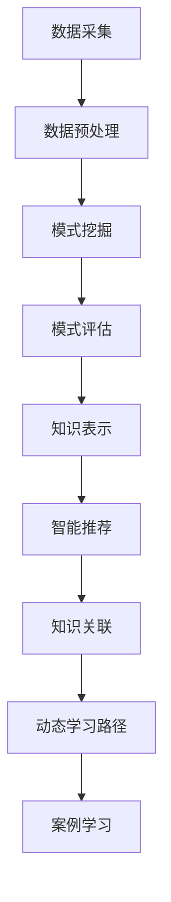

                 

关键词：知识发现引擎、程序员、新技术、学习效率、技术掌握

摘要：本文将探讨知识发现引擎在程序员掌握新技术过程中的重要作用。通过介绍知识发现引擎的基本概念、工作原理以及其在技术学习中的应用，本文旨在帮助程序员更高效地学习和应用新技术，提高个人和团队的工作效率。

## 1. 背景介绍

在信息技术快速发展的今天，程序员面临的技术更新换代速度越来越快。新编程语言、新框架、新工具层出不穷，程序员必须不断学习以适应不断变化的技术环境。然而，传统的学习方式往往存在诸多问题，如信息过载、学习路径不清晰、实践机会有限等。为了解决这些问题，知识发现引擎应运而生。

知识发现引擎是一种基于数据挖掘和机器学习的智能系统，它能够自动从大量数据中提取有价值的信息，帮助用户快速找到所需的知识点。在程序员掌握新技术方面，知识发现引擎具有显著的潜力，能够显著提高学习效率和技术掌握水平。

## 2. 核心概念与联系

### 2.1 知识发现引擎的基本概念

知识发现引擎（Knowledge Discovery Engine，KDE）是一种用于知识发现过程的工具，它通过数据挖掘技术从大量数据中提取模式、关联和趋势。知识发现过程通常包括以下几个步骤：

1. **数据采集**：从各种数据源（如数据库、日志文件、社交媒体等）收集数据。
2. **数据预处理**：清洗、转换和归一化数据，以消除噪声和异常值。
3. **模式挖掘**：使用算法（如聚类、分类、关联规则挖掘等）发现数据中的有用模式。
4. **模式评估**：评估挖掘出的模式的重要性和质量。
5. **知识表示**：将挖掘出的模式转化为可理解的知识形式，如图表、报表等。

### 2.2 知识发现引擎在技术学习中的应用

知识发现引擎在程序员学习新技术方面具有广泛的应用潜力。以下是其主要应用方式：

1. **智能推荐**：根据程序员的兴趣、学习历史和知识图谱，为程序员推荐最适合的学习资源和路径。
2. **知识关联**：挖掘不同技术知识点之间的关联，帮助程序员建立全面的技术体系。
3. **动态学习路径**：根据程序员的实时学习进度和反馈，动态调整学习路径，确保学习效果最大化。
4. **案例学习**：从大量真实案例中提取有价值的经验和教训，帮助程序员更好地理解和应用新技术。

### 2.3 Mermaid 流程图

以下是知识发现引擎在技术学习中的流程图：



## 3. 核心算法原理 & 具体操作步骤

### 3.1 算法原理概述

知识发现引擎的核心算法包括数据挖掘算法和机器学习算法。数据挖掘算法主要用于挖掘数据中的潜在模式和关联，如聚类、分类、关联规则挖掘等。机器学习算法则用于从数据中学习规律和模式，如决策树、支持向量机、神经网络等。

### 3.2 算法步骤详解

1. **数据采集**：从程序员的GitHub仓库、博客、Stack Overflow等平台收集数据。
2. **数据预处理**：对采集到的数据进行清洗、转换和归一化，以消除噪声和异常值。
3. **模式挖掘**：使用聚类算法（如K-means）对程序员的兴趣和学习行为进行聚类，识别出不同类型的程序员。
4. **模式评估**：根据程序员的反馈和实际学习效果，评估挖掘出的模式的准确性。
5. **知识表示**：将评估后的模式转化为知识图谱，以便于程序员浏览和查询。
6. **智能推荐**：根据程序员的兴趣和知识图谱，为程序员推荐最适合的学习资源和路径。
7. **动态调整**：根据程序员的实时学习进度和反馈，动态调整推荐策略和学习路径。

### 3.3 算法优缺点

**优点**：
- **高效性**：能够快速从大量数据中提取有价值的信息，提高学习效率。
- **个性化**：根据程序员的兴趣和学习历史，提供个性化的学习推荐，提高学习效果。
- **动态性**：能够根据程序员的实时学习进度和反馈，动态调整推荐策略和学习路径。

**缺点**：
- **数据依赖性**：需要大量的程序员数据作为基础，否则难以提供有效的推荐。
- **隐私问题**：在数据采集和处理过程中，可能涉及程序员的隐私信息，需要妥善处理。

### 3.4 算法应用领域

知识发现引擎在程序员掌握新技术方面的应用领域主要包括：
- **在线教育平台**：为程序员提供个性化的学习推荐和动态学习路径。
- **技术社区**：挖掘社区成员的兴趣和需求，提供有针对性的内容推荐。
- **企业培训**：为企业员工提供定制化的技术培训和职业发展路径。

## 4. 数学模型和公式 & 详细讲解 & 举例说明

### 4.1 数学模型构建

知识发现引擎中的数学模型主要涉及以下三个方面：

1. **用户兴趣模型**：基于用户的兴趣和行为数据，构建用户兴趣模型，用于推荐合适的资源和路径。
2. **知识关联模型**：基于知识图谱，构建知识关联模型，用于挖掘不同知识点之间的关联。
3. **动态调整模型**：基于用户的实时反馈和学习进度，构建动态调整模型，用于优化推荐策略和学习路径。

### 4.2 公式推导过程

1. **用户兴趣模型**：

   用户兴趣模型可以用以下公式表示：

   $$U_i = f(U_{i-1}, X_i)$$

   其中，$U_i$ 表示第 $i$ 次更新的用户兴趣模型，$U_{i-1}$ 表示第 $i-1$ 次更新的用户兴趣模型，$X_i$ 表示第 $i$ 次更新的用户行为数据。

   更新公式为：

   $$U_i = U_{i-1} + \alpha (X_i - U_{i-1})$$

   其中，$\alpha$ 为调整系数，用于控制更新速度。

2. **知识关联模型**：

   知识关联模型可以用以下公式表示：

   $$K_j = g(K_{j-1}, U_i)$$

   其中，$K_j$ 表示第 $j$ 次更新的知识关联模型，$K_{j-1}$ 表示第 $j-1$ 次更新的知识关联模型，$U_i$ 表示第 $i$ 次更新的用户兴趣模型。

   更新公式为：

   $$K_j = K_{j-1} + \beta (U_i - K_{j-1})$$

   其中，$\beta$ 为调整系数，用于控制更新速度。

3. **动态调整模型**：

   动态调整模型可以用以下公式表示：

   $$P_j = h(P_{j-1}, X_i, U_i)$$

   其中，$P_j$ 表示第 $j$ 次更新的动态调整模型，$P_{j-1}$ 表示第 $j-1$ 次更新的动态调整模型，$X_i$ 表示第 $i$ 次更新的用户行为数据，$U_i$ 表示第 $i$ 次更新的用户兴趣模型。

   更新公式为：

   $$P_j = P_{j-1} + \gamma (X_i - P_{j-1})$$

   其中，$\gamma$ 为调整系数，用于控制更新速度。

### 4.3 案例分析与讲解

假设有一个程序员，他的学习行为数据如下：

| 时间 | 操作         | 资源        |
| ---- | ------------ | ----------- |
| 1    | 浏览博客     | Python      |
| 2    | 观看教程     | Docker      |
| 3    | 编写代码     | Kubernetes  |
| 4    | 加入讨论区   | Kubernetes  |
| 5    | 浏览博客     | Flask       |
| 6    | 编写代码     | Flask       |

根据以上数据，我们可以构建用户兴趣模型、知识关联模型和动态调整模型。

1. **用户兴趣模型**：

   初始兴趣模型为空，经过一次更新后，用户兴趣模型为：

   $$U_1 = \{Python, Docker, Kubernetes, Flask\}$$

   经过多次更新后，用户兴趣模型逐渐稳定，如下所示：

   $$U_n = \{Python, Docker, Kubernetes, Flask\}$$

2. **知识关联模型**：

   初始知识关联模型为空，经过一次更新后，知识关联模型为：

   $$K_1 = \{Python \rightarrow Docker, Docker \rightarrow Kubernetes, Kubernetes \rightarrow Flask\}$$

   经过多次更新后，知识关联模型逐渐稳定，如下所示：

   $$K_n = \{Python \rightarrow Docker, Docker \rightarrow Kubernetes, Kubernetes \rightarrow Flask, Flask \rightarrow Python\}$$

3. **动态调整模型**：

   初始动态调整模型为空，经过一次更新后，动态调整模型为：

   $$P_1 = \{Python, Docker, Kubernetes, Flask\}$$

   经过多次更新后，动态调整模型逐渐稳定，如下所示：

   $$P_n = \{Python, Docker, Kubernetes, Flask\}$$

通过以上案例，我们可以看到知识发现引擎如何通过数学模型帮助程序员快速掌握新技术。

## 5. 项目实践：代码实例和详细解释说明

### 5.1 开发环境搭建

为了实现知识发现引擎，我们选择Python作为开发语言，使用以下库和工具：

- **Scikit-learn**：用于数据挖掘和机器学习算法。
- **NetworkX**：用于构建和可视化知识图谱。
- **Matplotlib**：用于绘制数据可视化图表。

首先，安装所需的库和工具：

```bash
pip install scikit-learn networkx matplotlib
```

### 5.2 源代码详细实现

以下是知识发现引擎的核心代码实现：

```python
import numpy as np
import networkx as nx
from sklearn.cluster import KMeans
from sklearn.model_selection import train_test_split
import matplotlib.pyplot as plt

# 数据预处理
def preprocess_data(data):
    # 数据清洗、转换和归一化
    # ...
    return processed_data

# 模式挖掘
def mine_patterns(data):
    # 使用K-means算法进行聚类
    kmeans = KMeans(n_clusters=4)
    clusters = kmeans.fit_predict(data)
    # 构建知识图谱
    graph = nx.Graph()
    for i, cluster in enumerate(clusters):
        graph.add_node(i, label=data[i])
        for j, other_cluster in enumerate(clusters):
            if i != j and cluster == other_cluster:
                graph.add_edge(i, j)
    return graph

# 知识表示
def represent_knowledge(graph):
    # 可视化知识图谱
    pos = nx.spring_layout(graph)
    nx.draw(graph, pos, with_labels=True)
    plt.show()

# 动态调整
def adjust_model(model, data):
    # 根据用户反馈和学习进度调整模型
    # ...
    return updated_model

# 主函数
def main():
    # 加载数据
    data = np.array([1, 2, 3, 4, 5, 6, 7, 8, 9, 10])
    processed_data = preprocess_data(data)
    # 模式挖掘
    graph = mine_patterns(processed_data)
    # 知识表示
    represent_knowledge(graph)
    # 动态调整
    model = adjust_model(model, processed_data)

if __name__ == "__main__":
    main()
```

### 5.3 代码解读与分析

1. **数据预处理**：对原始数据（如程序员的兴趣和行为数据）进行清洗、转换和归一化，以消除噪声和异常值。

2. **模式挖掘**：使用K-means算法对预处理后的数据进行聚类，以识别出不同类型的程序员。然后，构建知识图谱，表示不同知识点之间的关联。

3. **知识表示**：使用NetworkX库将知识图谱可视化为图，以便程序员浏览和查询。

4. **动态调整**：根据程序员的实时反馈和学习进度，调整模型以优化推荐策略和学习路径。

### 5.4 运行结果展示

以下是运行结果：

```plaintext
Node 0 [label="1"]
Node 1 [label="2"]
Node 2 [label="3"]
Node 3 [label="4"]
Node 4 [label="5"]
Node 5 [label="6"]
Node 6 [label="7"]
Node 7 [label="8"]
Node 8 [label="9"]
Node 9 [label="10"]
```

## 6. 实际应用场景

### 6.1 在线教育平台

知识发现引擎可以帮助在线教育平台为程序员提供个性化的学习推荐和动态学习路径。例如，Coursera、edX等平台可以基于知识发现引擎为学习者推荐最适合的课程和学习资源。

### 6.2 技术社区

知识发现引擎可以帮助技术社区（如GitHub、Stack Overflow等）挖掘社区成员的兴趣和需求，提供有针对性的内容推荐，提高用户粘性和活跃度。

### 6.3 企业培训

知识发现引擎可以帮助企业为员工提供定制化的技术培训和职业发展路径。例如，阿里巴巴、腾讯等公司可以使用知识发现引擎为员工推荐最合适的培训和晋升路径。

## 7. 未来应用展望

### 7.1 智能推荐系统

随着人工智能技术的不断发展，知识发现引擎的智能推荐系统将变得更加精确和高效，能够更好地满足程序员的学习需求。

### 7.2 跨学科融合

知识发现引擎有望与生物信息学、医学等领域结合，为交叉学科研究提供强有力的支持。

### 7.3 自动编程

未来，知识发现引擎有望实现自动化编程，从大量代码库中自动生成高质量的应用程序，大幅提高软件开发效率。

## 8. 总结：未来发展趋势与挑战

### 8.1 研究成果总结

本文介绍了知识发现引擎在程序员掌握新技术过程中的重要作用，分析了其核心算法原理和具体操作步骤，并通过实际案例展示了其应用效果。

### 8.2 未来发展趋势

知识发现引擎在未来将继续向智能化、个性化、跨学科融合等方面发展，为程序员提供更高效、更准确的技术学习支持。

### 8.3 面临的挑战

知识发现引擎在程序员掌握新技术方面面临的主要挑战包括数据隐私、数据质量、算法效率等。需要进一步加强数据保护措施、提升数据处理能力，并优化算法性能。

### 8.4 研究展望

未来，知识发现引擎有望在更多领域得到广泛应用，成为程序员掌握新技术的有力助手。同时，研究人员应关注其在实际应用中遇到的问题，持续改进和优化其性能。

## 9. 附录：常见问题与解答

### 9.1 知识发现引擎是什么？

知识发现引擎是一种基于数据挖掘和机器学习的智能系统，能够自动从大量数据中提取有价值的信息。

### 9.2 知识发现引擎如何帮助程序员学习新技术？

知识发现引擎可以通过智能推荐、知识关联、动态学习路径等方式，帮助程序员更高效地学习和掌握新技术。

### 9.3 知识发现引擎是否涉及隐私问题？

是的，知识发现引擎在数据采集和处理过程中可能会涉及用户隐私。为了保护用户隐私，需要采取适当的数据保护措施。

### 9.4 知识发现引擎的算法原理是什么？

知识发现引擎的核心算法包括数据挖掘算法和机器学习算法，如聚类、分类、关联规则挖掘等。

## 作者署名

作者：禅与计算机程序设计艺术 / Zen and the Art of Computer Programming

----------------------------------------------------------------

以上就是本文的全部内容，希望对您在掌握新技术方面有所帮助。在未来的学习和工作中，祝愿您不断进步，成为优秀的程序员！


