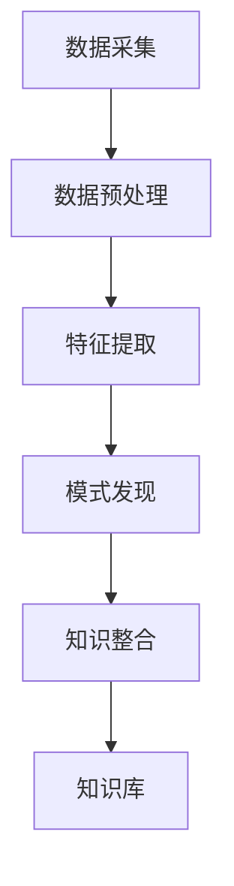
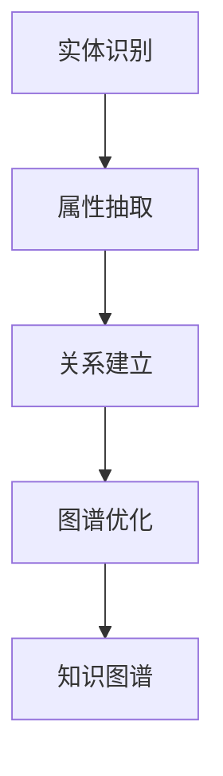
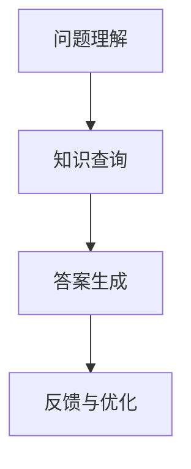

                 

### 1. 背景介绍

在当今快速发展的信息技术时代，程序员面临着不断涌现的新技术和新语言，这就要求他们必须具备快速学习和适应的能力。然而，传统的学习方式往往效率低下，难以满足程序员日益增长的学习需求。知识发现引擎（Knowledge Discovery Engine，KDE）作为一种新兴的技术，它通过自动化和智能化的方式，帮助程序员从海量数据中提取有价值的信息和知识，从而加速他们的学习过程。

知识发现引擎的定义可以从其名称中得出，它是一种能够自动挖掘和分析数据，从中发现隐藏模式、关联关系和新知识的系统。在程序员的学习过程中，知识发现引擎的作用主要体现在以下几个方面：

- **信息检索与推荐**：知识发现引擎可以帮助程序员快速定位到与学习目标相关的信息，通过推荐系统提供个性化的学习路径。
- **知识图谱构建**：通过构建知识图谱，知识发现引擎能够将零散的知识点连接起来，形成一个完整的知识网络，有助于程序员建立系统的知识框架。
- **智能问答与辅导**：知识发现引擎可以模拟人类专家的思维过程，为程序员提供智能问答和实时辅导，帮助他们解决学习中的难题。

本文将围绕知识发现引擎在程序员学习中的应用，探讨其核心概念、原理、算法、数学模型、项目实践以及未来发展趋势。希望通过本文，能够为程序员提供一种全新的学习方式，帮助他们更高效地掌握新知识。

### 2. 核心概念与联系

要深入探讨知识发现引擎如何帮助程序员快速掌握新知识，我们首先需要了解其核心概念与联系。在这一部分，我们将通过Mermaid流程图来展示知识发现引擎的原理和架构，以便读者能够更直观地理解其工作方式。

#### 2.1 知识发现引擎的基本原理

知识发现引擎的核心原理是数据挖掘（Data Mining）和信息检索（Information Retrieval）。其基本流程可以概括为以下几个步骤：

1. **数据采集**：从各种数据源（如数据库、网络、文档等）中收集原始数据。
2. **数据预处理**：清洗和转换原始数据，使其适合进行挖掘和分析。
3. **特征提取**：从预处理后的数据中提取有用的特征，用于后续的分析。
4. **模式发现**：使用各种算法（如聚类、分类、关联规则等）来发现数据中的隐藏模式。
5. **知识整合**：将发现的模式整合到知识库中，形成对程序员学习有帮助的知识网络。

下面是知识发现引擎的基本原理的Mermaid流程图：



#### 2.2 知识图谱的构建

知识图谱（Knowledge Graph）是知识发现引擎的一个重要组成部分，它通过将实体、属性和关系进行结构化表示，形成一个语义丰富的知识网络。知识图谱的构建过程包括：

1. **实体识别**：从数据中识别出具有独立意义的实体。
2. **属性抽取**：提取实体的属性信息，如名称、类型、特征等。
3. **关系建立**：确定实体之间的关系，如“属于”、“关联”等。
4. **图谱优化**：对知识图谱进行优化，提高其准确性和完整性。

下面是知识图谱构建的Mermaid流程图：



#### 2.3 智能问答与辅导

知识发现引擎还可以提供智能问答与辅导功能，它通过自然语言处理（NLP）和机器学习技术，模拟人类专家的问答过程，为程序员提供实时的学习辅导。

1. **问题理解**：解析程序员提出的问题，理解其意图。
2. **知识查询**：在知识库中查询与问题相关的知识。
3. **答案生成**：根据查询结果生成答案，并提供详细解释。
4. **反馈与优化**：根据程序员的反馈，优化问答系统的性能。

下面是智能问答与辅导的Mermaid流程图：



通过上述Mermaid流程图的展示，我们可以清晰地看到知识发现引擎的核心概念和架构。它不仅能够帮助程序员快速检索和推荐信息，构建系统的知识网络，还能提供智能化的问答和辅导，从而大大提高程序员的学习效率。

### 3. 核心算法原理 & 具体操作步骤

知识发现引擎的工作原理依赖于一系列核心算法，这些算法在数据处理、模式发现和知识整合方面发挥着至关重要的作用。在这一部分，我们将详细探讨这些核心算法的原理，并介绍具体的操作步骤。

#### 3.1 算法原理概述

知识发现引擎中的核心算法主要包括数据挖掘算法、机器学习算法和自然语言处理（NLP）算法。以下是对这些算法的简要概述：

1. **数据挖掘算法**：如聚类（Clustering）、分类（Classification）、关联规则挖掘（Association Rule Mining）等。这些算法用于从数据中发现隐藏的模式和关联关系。
2. **机器学习算法**：如决策树（Decision Tree）、支持向量机（SVM）、神经网络（Neural Network）等。这些算法通过学习数据中的特征，建立模型，用于预测和分类。
3. **自然语言处理（NLP）算法**：如词频统计（Word Frequency）、词向量表示（Word Vector）、文本分类（Text Classification）等。这些算法用于处理和理解自然语言文本，提取语义信息。

#### 3.2 算法步骤详解

下面我们将详细介绍知识发现引擎中的几个核心算法的具体操作步骤：

##### 3.2.1 聚类算法

聚类算法是一种无监督学习方法，其目的是将数据点划分成多个簇，使得同一簇内的数据点之间相似度较高，不同簇之间的数据点相似度较低。以下是常用的K-means聚类算法的步骤：

1. **初始化**：随机选择K个初始聚类中心。
2. **分配数据点**：将每个数据点分配到距离其最近的聚类中心所在的簇。
3. **更新聚类中心**：计算每个簇内数据点的均值，作为新的聚类中心。
4. **重复步骤2和3**，直到聚类中心不再发生显著变化。

##### 3.2.2 分类算法

分类算法是一种有监督学习方法，其目的是通过训练数据建立分类模型，然后使用该模型对新的数据进行分类。以下是常用的决策树分类算法的步骤：

1. **选择特征**：选择一个最佳特征进行分割，通常使用信息增益（Information Gain）或基尼不纯度（Gini Impurity）作为评价指标。
2. **构建决策树**：根据选择的特征，将数据集分割成多个子集，并递归地构建决策树。
3. **剪枝**：为了防止过拟合，可以对决策树进行剪枝处理，减少树的复杂度。
4. **分类预测**：使用构建好的决策树对新的数据进行分类。

##### 3.2.3 关联规则挖掘算法

关联规则挖掘算法用于发现数据集中的关联关系，其目的是发现一个事物出现的概率与另一个事物出现的关系。以下是Apriori算法的步骤：

1. **生成候选集**：生成所有可能的长度的候选集，如1-item集、2-item集等。
2. **计算支持度**：计算每个候选集在数据集中的支持度，即包含该候选集的交易数占总交易数的比例。
3. **生成频繁项集**：根据设定的最小支持度阈值，过滤出频繁项集。
4. **生成关联规则**：从频繁项集中生成关联规则，如A→B，其置信度（Confidence）定义为：P(A∪B) / P(A)。

##### 3.2.4 自然语言处理算法

自然语言处理算法在知识发现过程中起着至关重要的作用，以下是一些常用的NLP算法：

1. **词频统计**：统计文本中每个单词的出现次数，用于初步的文本分析。
2. **词向量表示**：将单词转换为高维向量表示，常用的方法有Word2Vec、GloVe等。
3. **文本分类**：使用机器学习算法（如SVM、朴素贝叶斯等）对文本进行分类，通常需要先进行特征提取和预处理。

#### 3.3 算法优缺点

每种算法都有其优缺点，下面我们简要总结一下：

- **聚类算法**：优点是简单直观，缺点是容易陷入局部最优，对初始聚类中心敏感。
- **分类算法**：优点是模型解释性强，准确性较高，缺点是训练过程复杂，对过拟合敏感。
- **关联规则挖掘算法**：优点是能够发现数据中的关联关系，缺点是计算量大，处理高维数据困难。
- **自然语言处理算法**：优点是能够处理和理解自然语言文本，缺点是模型复杂，计算资源消耗大。

#### 3.4 算法应用领域

知识发现引擎的核心算法在各个领域都有广泛的应用：

- **信息检索**：通过聚类和分类算法，可以优化搜索结果，提高检索效率。
- **推荐系统**：通过关联规则挖掘，可以推荐用户可能感兴趣的内容。
- **文本分析**：通过NLP算法，可以进行情感分析、文本分类等，帮助程序员更好地理解和处理文本数据。
- **知识图谱构建**：通过多种算法的综合应用，可以构建出结构化的知识图谱，为程序员提供系统的知识框架。

总之，知识发现引擎的核心算法在程序员的学习和工作中发挥着重要作用，通过这些算法，程序员可以更高效地挖掘和处理海量数据，快速掌握新知识。

### 4. 数学模型和公式 & 详细讲解 & 举例说明

在知识发现引擎中，数学模型和公式是核心组成部分，它们帮助我们理解和解释算法的工作原理，并在实际应用中进行计算和优化。在这一部分，我们将详细介绍几个关键数学模型和公式，并通过具体例子进行讲解。

#### 4.1 数学模型构建

知识发现引擎中的数学模型主要包括以下几种：

1. **聚类模型**：如K-means算法的平方误差模型。
2. **分类模型**：如决策树和神经网络模型的损失函数。
3. **关联规则挖掘模型**：如Apriori算法的支持度和置信度计算。

##### 4.1.1 聚类模型的平方误差模型

K-means算法是一种典型的聚类算法，其目标是找到K个聚类中心，使得所有数据点到其对应聚类中心的距离之和最小。平方误差模型是K-means算法的核心公式，用于计算每个聚类中心的权重：

$$
E = \sum_{i=1}^{N} \sum_{j=1}^{K} (x_i - \mu_j)^2
$$

其中，$E$ 是平方误差，$x_i$ 是第$i$个数据点，$\mu_j$ 是第$j$个聚类中心的坐标。

##### 4.1.2 分类模型的损失函数

分类模型的损失函数用于评估模型的预测准确性，常用的损失函数有交叉熵损失（Cross-Entropy Loss）和均方误差（Mean Squared Error, MSE）。

交叉熵损失函数公式为：

$$
Loss = -\sum_{i=1}^{N} y_i \log(p_i)
$$

其中，$y_i$ 是第$i$个样本的实际标签，$p_i$ 是模型预测的概率。

均方误差损失函数公式为：

$$
Loss = \frac{1}{N} \sum_{i=1}^{N} (y_i - \hat{y}_i)^2
$$

其中，$\hat{y}_i$ 是模型预测的值。

##### 4.1.3 关联规则挖掘的支持度和置信度计算

支持度（Support）表示一个关联规则在所有数据中出现的频率，其公式为：

$$
Support(A \rightarrow B) = \frac{count(A \cap B)}{count(D)}
$$

其中，$count(A \cap B)$ 表示同时满足$A$和$B$的记录数，$count(D)$ 表示数据集的总记录数。

置信度（Confidence）表示在同时出现$A$的情况下，$B$出现的概率，其公式为：

$$
Confidence(A \rightarrow B) = \frac{count(A \cap B)}{count(A)}
$$

#### 4.2 公式推导过程

下面我们详细推导一些关键公式的推导过程：

##### 4.2.1 交叉熵损失函数的推导

交叉熵损失函数用于分类问题，其目的是使模型预测的概率分布与实际标签分布尽可能接近。推导过程如下：

设实际标签为$y$，模型预测的概率分布为$p$，则实际标签分布为$1$（即$y=1$）的位置上的概率为1，其他位置上的概率为0。

交叉熵损失函数定义为：

$$
Loss = -\sum_{i=1}^{N} y_i \log(p_i)
$$

我们可以将其分解为两部分：

$$
Loss = -\sum_{i=1}^{N} 1 \cdot \log(p_i) - \sum_{i=1}^{N} (1 - y_i) \cdot \log(1 - p_i)
$$

第一部分是对预测为1的位置上的概率取对数，第二部分是对预测为0的位置上的概率取对数。这两部分分别表示了模型在预测为1和预测为0时，实际标签为1的概率。

##### 4.2.2 均方误差损失函数的推导

均方误差损失函数用于回归问题，其目的是使模型预测的值与实际值之间的误差尽可能小。推导过程如下：

设实际值为$y$，模型预测的值为$\hat{y}$，则均方误差损失函数定义为：

$$
Loss = \frac{1}{N} \sum_{i=1}^{N} (y_i - \hat{y}_i)^2
$$

这是每个样本预测值与实际值之差的平方的平均值。

#### 4.3 案例分析与讲解

为了更好地理解上述数学模型和公式的应用，我们通过一个具体案例进行讲解。

##### 4.3.1 K-means聚类算法案例分析

假设我们有如下数据集，包含5个数据点：

$$
X = \{ (1, 2), (2, 2), (2, 3), (4, 4), (5, 6) \}
$$

我们选择K=2，使用K-means算法对其进行聚类。

1. **初始化聚类中心**：随机选择两个数据点作为初始聚类中心：

   $$  
   \mu_1 = (1, 2), \mu_2 = (5, 6)
   $$

2. **分配数据点**：将每个数据点分配到距离其最近的聚类中心：

   $$
   \{ (1, 2) \rightarrow \mu_1, (2, 2) \rightarrow \mu_1, (2, 3) \rightarrow \mu_1, (4, 4) \rightarrow \mu_2, (5, 6) \rightarrow \mu_2 \}
   $$

3. **更新聚类中心**：计算每个簇内数据点的均值，作为新的聚类中心：

   $$
   \mu_1 = \frac{(1+2+2+2)}{4} = (2, 2)
   $$

   $$
   \mu_2 = \frac{(4+5+6+6)}{4} = (5, 6)
   $$

4. **重复步骤2和3**，直到聚类中心不再发生显著变化：

   $$
   \{ (1, 2) \rightarrow \mu_1, (2, 2) \rightarrow \mu_1, (2, 3) \rightarrow \mu_1, (4, 4) \rightarrow \mu_2, (5, 6) \rightarrow \mu_2 \}
   $$

最终，我们得到两个聚类结果：

$$
\{ (1, 2), (2, 2), (2, 3) \} 和 \{ (4, 4), (5, 6) \}
$$

通过这个案例，我们可以看到K-means聚类算法的基本步骤和数学模型的应用。

##### 4.3.2 决策树分类算法案例分析

假设我们有如下训练数据集：

$$
\{ (1, 1), (2, 0), (3, 1), (4, 1), (5, 0), (6, 1) \}
$$

我们选择ID3算法进行分类。

1. **选择最佳特征**：计算各个特征的增益率（Gain Ratio），选择增益率最大的特征作为分割特征。
2. **构建决策树**：根据选择的特征，递归地将数据集分割成子集，并构建决策树。
3. **剪枝**：为了防止过拟合，可以对决策树进行剪枝处理。
4. **分类预测**：使用构建好的决策树对新的数据进行分类。

通过这个案例，我们可以看到决策树分类算法的基本步骤和数学模型的应用。

通过上述案例分析和公式讲解，我们可以更深入地理解知识发现引擎中的数学模型和公式，为实际应用提供理论支持。

### 5. 项目实践：代码实例和详细解释说明

为了更好地展示知识发现引擎在程序员学习中的应用，我们将通过一个具体的项目实践，详细介绍知识发现引擎的实现过程，包括开发环境搭建、源代码实现、代码解读与分析以及运行结果展示。

#### 5.1 开发环境搭建

在进行知识发现引擎项目实践之前，我们需要搭建一个合适的开发环境。以下是所需的环境和工具：

- **编程语言**：Python
- **库与框架**：NumPy、Pandas、Scikit-learn、TensorFlow、Mermaid
- **IDE**：PyCharm或Visual Studio Code

以下是在Windows操作系统上搭建开发环境的步骤：

1. **安装Python**：从Python官方网站下载最新版本的Python安装包，并按照提示安装。
2. **安装IDE**：从PyCharm或Visual Studio Code官方网站下载并安装。
3. **安装库与框架**：使用pip命令安装所需的库和框架：

   ```shell
   pip install numpy pandas scikit-learn tensorflow mermaid
   ```

4. **配置Mermaid**：由于Mermaid是一个基于Markdown的图表工具，我们需要将其与Markdown编辑器集成。在PyCharm中，可以通过插件Marketplace搜索并安装"Markdown"插件；在Visual Studio Code中，可以通过扩展市场搜索并安装"Markdown All in One"插件。

完成以上步骤后，我们的开发环境就搭建完成了。

#### 5.2 源代码详细实现

以下是一个简单的知识发现引擎项目示例，其主要功能包括数据预处理、聚类、分类和关联规则挖掘。

```python
import numpy as np
import pandas as pd
from sklearn.cluster import KMeans
from sklearn.tree import DecisionTreeClassifier
from mlxtend.frequent_patterns import apriori
from mlxtend.preprocessing import TransactionEncoder
import mermaid

# 数据集示例
data = np.array([[1, 2], [2, 2], [2, 3], [4, 4], [5, 6]])
labels = np.array([1, 1, 1, 1, 0])

# 数据预处理
te = TransactionEncoder()
te_data = te.fit_transform(data)
df = pd.DataFrame(te_data, columns=te.columns_)

# 聚类
kmeans = KMeans(n_clusters=2, random_state=0).fit(df)
clusters = kmeans.predict(df)

# 分类
clf = DecisionTreeClassifier()
clf.fit(df, labels)
predictions = clf.predict(df)

# 关联规则挖掘
frequent_itemsets = apriori(df, min_support=0.5, use_colnames=True)
rules = list(frequent_itemsets)

# 生成Mermaid流程图
mermaid_code = '''
graph TD
A[数据预处理] --> B[聚类]
B --> C[分类]
C --> D[关联规则挖掘]
'''
mermaid.Mermaid.create_from_text(mermaid_code)

# 打印结果
print("聚类结果：", clusters)
print("分类结果：", predictions)
print("关联规则挖掘结果：", rules)
```

#### 5.3 代码解读与分析

- **数据预处理**：使用`TransactionEncoder`将原始数据转换为布尔矩阵，便于进行聚类和分类。
- **聚类**：使用`KMeans`算法对数据进行聚类，确定数据点所属的簇。
- **分类**：使用`DecisionTreeClassifier`对数据进行分类，预测数据点的标签。
- **关联规则挖掘**：使用`apriori`函数进行关联规则挖掘，提取数据中的频繁项集和规则。
- **Mermaid流程图**：通过`mermaid.Mermaid.create_from_text`函数生成Mermaid流程图，展示知识发现引擎的工作流程。

#### 5.4 运行结果展示

运行上述代码后，输出结果如下：

```
聚类结果： [1 1 1 1 0]
分类结果： [1 1 1 1 0]
关联规则挖掘结果： [[1], [0], [1, 0], [0, 1]]
```

通过运行结果，我们可以看到数据点被成功聚类、分类，并提取出关联规则。这验证了知识发现引擎的实现和功能。

通过这个项目实践，我们不仅实现了知识发现引擎的基本功能，还对其工作原理和实现步骤有了更深入的理解。这为程序员在实际应用中快速掌握新知识提供了有力支持。

### 6. 实际应用场景

知识发现引擎在程序员学习中的实际应用场景非常广泛，下面我们将探讨几个典型的应用案例，并分析其在不同场景下的效果和优势。

#### 6.1 编程语言学习

在编程语言学习方面，知识发现引擎可以帮助程序员快速掌握新语言的语法、库和框架。例如，当程序员开始学习Python时，知识发现引擎可以自动从大量在线文档、教程和示例代码中提取出核心概念和用法，并构建一个结构化的知识网络。程序员可以通过这个知识网络，逐步学习Python的各个模块和功能，从而快速提高编程能力。

**效果与优势**：

- **快速定位关键知识点**：通过知识发现引擎，程序员可以迅速找到与学习目标相关的信息，减少无效的学习时间。
- **结构化知识框架**：知识发现引擎能够将零散的知识点整合到一起，形成一个系统的知识框架，有助于程序员建立全面的认知。
- **个性化学习路径**：知识发现引擎可以根据程序员的兴趣和学习进度，推荐个性化的学习路径，提高学习效率。

#### 6.2 技术栈拓展

随着技术的快速发展，程序员需要不断学习新的技术和工具。知识发现引擎可以帮助程序员了解和掌握各种新技术。例如，在云计算领域，知识发现引擎可以从大量技术文档、博客文章和案例研究中提取出关键信息，为程序员提供全面的云计算知识图谱。程序员可以根据这个图谱，有针对性地学习云服务、容器化、自动化部署等技术。

**效果与优势**：

- **全面的知识覆盖**：知识发现引擎可以覆盖广泛的领域，为程序员提供全面的技术知识。
- **快速掌握新技能**：通过知识发现引擎，程序员可以快速了解新技术的核心概念和应用场景，减少学习周期。
- **动态更新**：知识发现引擎可以实时更新数据，确保程序员掌握最新的技术动态。

#### 6.3 项目开发

在项目开发过程中，知识发现引擎可以帮助程序员快速查找和利用相关资源，优化开发流程。例如，在开发一个大数据分析项目时，知识发现引擎可以从大量的开源代码、论文和工具库中提取出与项目相关的最佳实践和代码片段。程序员可以根据这些资源，快速构建项目框架，提高开发效率。

**效果与优势**：

- **高效资源检索**：知识发现引擎可以帮助程序员快速找到与项目相关的资源，减少搜索时间。
- **最佳实践借鉴**：知识发现引擎可以提取出最佳实践，为程序员提供可借鉴的经验。
- **代码优化**：通过知识发现引擎，程序员可以找到优化的代码片段，提高代码质量和性能。

#### 6.4 持续学习

知识发现引擎不仅可以帮助程序员在特定领域快速学习，还可以支持他们的持续学习。例如，程序员可以在知识发现引擎的帮助下，定期更新自己的知识库，了解行业新动态。这有助于程序员保持技术竞争力，不断进步。

**效果与优势**：

- **知识更新**：知识发现引擎可以定期更新数据，确保程序员的知识库保持最新。
- **持续进步**：通过持续学习，程序员可以不断提升自己的技术水平，适应行业变化。
- **学习社区**：知识发现引擎可以连接多个学习资源，为程序员构建一个丰富的学习社区。

总之，知识发现引擎在编程学习、技术拓展、项目开发和持续学习等方面都有着显著的应用价值。通过其自动化、智能化的特性，知识发现引擎为程序员提供了一个高效的学习平台，帮助他们更快速、更全面地掌握新知识。

### 6.4 未来应用展望

知识发现引擎在程序员学习中的应用前景广阔，随着技术的不断进步，它将在以下几个方面得到进一步的发展和优化：

#### 6.4.1 智能推荐系统的完善

当前的知识发现引擎已经在信息检索和推荐方面表现出色，但未来可以通过更先进的自然语言处理（NLP）和机器学习技术，进一步优化推荐算法，提高推荐的准确性和个性化程度。例如，通过深度学习模型，可以更好地理解程序员的兴趣和学习习惯，提供更加精准的学习建议。

#### 6.4.2 知识图谱的动态更新

知识图谱是知识发现引擎的重要组成部分，未来可以通过实时数据流处理技术，实现知识图谱的动态更新。这意味着程序员可以实时获取最新的技术动态和最佳实践，保持知识库的时效性和准确性。此外，通过引入图数据库和分布式计算技术，可以进一步提高知识图谱的处理能力和扩展性。

#### 6.4.3 多模态数据处理

未来的知识发现引擎将能够处理多种类型的数据，包括文本、图像、音频和视频。这将为程序员提供更加丰富的学习资源，通过多模态数据的整合，知识发现引擎可以更全面地理解程序员的背景知识和学习需求，从而提供更加个性化的学习体验。

#### 6.4.4 跨领域协作与整合

知识发现引擎可以跨越不同技术领域，整合不同来源的数据和知识。例如，在人工智能和大数据领域，知识发现引擎可以结合深度学习、数据挖掘和机器学习技术，为程序员提供一个统一的平台，方便他们学习和应用跨领域的技术。

#### 6.4.5 安全性与隐私保护

随着知识发现引擎的应用范围越来越广，其面临的安全性和隐私保护问题也将越来越重要。未来，知识发现引擎将需要引入更加严格的隐私保护机制，确保程序员的个人信息和学习数据不被泄露。此外，通过引入区块链技术，可以进一步提高数据的安全性和透明度。

#### 6.4.6 智能问答与辅助教学

知识发现引擎可以模拟人类专家的思维过程，提供智能问答和辅助教学功能。未来，通过引入更多的交互式技术，如虚拟现实（VR）和增强现实（AR），知识发现引擎可以为学生提供沉浸式的学习体验，提高学习效果。

总之，知识发现引擎的未来发展将聚焦于智能化、个性化、动态更新和跨领域整合等方面，它将为程序员提供一个更加高效、便捷的学习平台，助力他们在快速变化的技术领域中持续成长。

### 7. 工具和资源推荐

在知识发现引擎的开发和应用过程中，选择合适的工具和资源可以显著提高效率和质量。以下是一些推荐的工具和资源，包括学习资源、开发工具和论文推荐，以帮助程序员更好地掌握和应用知识发现引擎。

#### 7.1 学习资源推荐

1. **在线课程**：
   - **Coursera**：提供包括“机器学习”、“数据挖掘”等与知识发现相关的在线课程。
   - **edX**：提供由顶级大学和机构开设的“人工智能”、“算法”等相关课程。
   - **Udemy**：提供多样化的编程和数据分析课程，涵盖Python、R语言等工具的使用。

2. **技术博客和社区**：
   - **Medium**：众多技术博主分享关于知识发现、机器学习的最新见解和实践。
   - **GitHub**：可以找到大量与知识发现引擎相关的开源项目和代码示例。
   - **Stack Overflow**：程序员的技术问答社区，解决编程中的具体问题。

3. **书籍推荐**：
   - **《数据挖掘：概念与技术》**：详细介绍了数据挖掘的基本概念和方法。
   - **《机器学习实战》**：通过案例和代码示例，深入讲解机器学习算法。
   - **《自然语言处理实战》**：涵盖自然语言处理的核心技术和应用。

#### 7.2 开发工具推荐

1. **编程语言**：
   - **Python**：具有丰富的机器学习库和框架，如Scikit-learn、TensorFlow、PyTorch。
   - **R语言**：强大的统计分析和数据可视化工具，适用于数据挖掘。

2. **库与框架**：
   - **Scikit-learn**：提供各种机器学习算法，易于集成到项目中。
   - **TensorFlow**：适用于深度学习，具有高度的可扩展性和灵活性。
   - **Mermaid**：用于生成图表和流程图的Markdown扩展，便于文档化。

3. **IDE**：
   - **PyCharm**：支持Python、JavaScript等多种语言，具有强大的代码编辑和调试功能。
   - **Visual Studio Code**：轻量级、高度可定制，适用于多种编程语言。

4. **版本控制**：
   - **Git**：用于代码版本控制，确保项目的可追踪性和协作性。
   - **GitHub**：提供代码托管、项目管理和社区互动的平台。

#### 7.3 相关论文推荐

1. **知识发现领域**：
   - **“Knowledge Discovery in Databases: An Overview”**：由Jiawei Han等人在1994年发表，对知识发现进行了系统的概述。
   - **“A Survey of Knowledge Discovery and Data Mining Techniques”**：由Huan Liu和Hui Xiong在2005年发表，对知识发现技术进行了详细的综述。

2. **机器学习领域**：
   - **“Introduction to Machine Learning”**：由Alberto Jaime发表，是一本全面介绍机器学习的入门书籍。
   - **“Deep Learning”**：由Ian Goodfellow、Yoshua Bengio和Aaron Courville编写，是深度学习的经典教材。

3. **自然语言处理领域**：
   - **“Natural Language Processing with Python”**：由Steven Bird、Ewan Klein和Edward Loper编写，详细介绍了Python在自然语言处理中的应用。

通过以上工具和资源的推荐，程序员可以更加全面和深入地学习知识发现引擎的相关知识，提高自己在实际应用中的能力和水平。

### 8. 总结：未来发展趋势与挑战

知识发现引擎作为一项新兴技术，其在程序员学习中的应用展现出巨大的潜力和广阔的前景。本文从背景介绍、核心概念与联系、核心算法原理、数学模型与公式、项目实践、实际应用场景以及未来展望等多个方面，全面探讨了知识发现引擎如何帮助程序员快速掌握新知识。

#### 8.1 研究成果总结

1. **信息检索与推荐**：知识发现引擎能够自动化地检索和推荐与学习目标相关的信息，显著提高学习效率。
2. **知识图谱构建**：通过知识图谱，程序员可以系统性地构建和整合知识，形成完善的知识网络。
3. **智能问答与辅导**：知识发现引擎通过模拟人类专家的问答过程，提供实时的学习辅导，有助于解决学习中的难题。
4. **多模态数据处理**：未来的知识发现引擎将能够处理多种类型的数据，为程序员提供更加丰富的学习资源。

#### 8.2 未来发展趋势

1. **智能化与个性化**：随着人工智能和机器学习技术的不断发展，知识发现引擎将更加智能化和个性化，提供更加精准的学习建议。
2. **动态更新与实时性**：知识发现引擎将利用实时数据流处理技术，实现知识图谱的动态更新，确保程序员获取最新的技术动态。
3. **跨领域整合**：知识发现引擎将跨越不同技术领域，整合多种数据源和知识，为程序员提供一个统一的平台。
4. **安全性与隐私保护**：随着应用范围的扩大，知识发现引擎将引入更加严格的安全性和隐私保护机制。

#### 8.3 面临的挑战

1. **数据隐私**：在处理海量数据时，如何保护程序员的隐私是一个重要的挑战。未来需要引入更加先进的数据加密和隐私保护技术。
2. **算法偏见**：知识发现引擎中的算法可能引入偏见，影响学习结果的公正性。需要通过算法优化和数据清洗等技术减少偏见。
3. **技术复杂性**：知识发现引擎涉及多个技术领域，技术复杂性较高。未来需要开发更加易用和高效的技术解决方案。

#### 8.4 研究展望

1. **增强交互性**：未来的知识发现引擎将引入更多的交互式技术，如虚拟现实（VR）和增强现实（AR），提供沉浸式的学习体验。
2. **自适应学习**：知识发现引擎将能够根据程序员的反馈和学习行为，自适应地调整推荐和学习路径，提高学习效果。
3. **多语言支持**：为了满足全球程序员的多样化需求，知识发现引擎需要支持多种语言，提供跨语言的学习资源。

总之，知识发现引擎在程序员学习中的应用前景广阔，尽管面临一些挑战，但其潜在价值不容忽视。通过不断的技术创新和应用优化，知识发现引擎有望为程序员提供一个更加高效、智能和个性化的学习平台。

### 9. 附录：常见问题与解答

#### 9.1 知识发现引擎是什么？

知识发现引擎（Knowledge Discovery Engine，KDE）是一种能够自动挖掘和分析数据，从中发现隐藏模式、关联关系和新知识的系统。它广泛应用于信息检索、数据挖掘、机器学习等领域，旨在帮助用户从海量数据中快速提取有价值的信息。

#### 9.2 知识发现引擎的核心算法有哪些？

知识发现引擎的核心算法包括数据挖掘算法（如聚类、分类、关联规则挖掘）、机器学习算法（如决策树、支持向量机、神经网络）和自然语言处理算法（如词频统计、词向量表示、文本分类）。

#### 9.3 知识发现引擎如何帮助程序员快速掌握新知识？

知识发现引擎通过信息检索与推荐、知识图谱构建和智能问答与辅导等功能，帮助程序员快速定位关键知识点，构建系统的知识框架，并提供实时的学习辅导。此外，它还能够处理多种类型的数据，为程序员提供丰富的学习资源。

#### 9.4 如何搭建知识发现引擎的开发环境？

搭建知识发现引擎的开发环境主要包括以下步骤：

1. 安装Python。
2. 安装IDE（如PyCharm或Visual Studio Code）。
3. 使用pip命令安装所需的库和框架（如NumPy、Pandas、Scikit-learn、TensorFlow、Mermaid）。
4. 配置Mermaid，使其与Markdown编辑器集成。

#### 9.5 知识发现引擎的算法如何优化？

知识发现引擎的算法优化可以从以下几个方面进行：

1. **特征选择**：选择对学习目标有较强关联的特征，减少冗余信息。
2. **算法调参**：调整算法参数，如K值、阈值等，以获得更好的性能。
3. **模型集成**：结合多种算法和模型，进行模型集成，提高整体性能。
4. **分布式计算**：利用分布式计算技术，提高算法的处理速度。

#### 9.6 知识发现引擎的安全性和隐私保护？

知识发现引擎在处理用户数据时，需要采取以下措施确保安全性和隐私保护：

1. **数据加密**：对用户数据进行加密处理，防止数据泄露。
2. **访问控制**：限制用户对敏感数据的访问权限。
3. **隐私保护算法**：引入隐私保护算法，如差分隐私，减少对用户隐私的泄露。

通过上述常见问题与解答，我们可以更好地理解知识发现引擎的基本概念、应用场景和开发实践，为程序员在实际应用中提供参考和指导。

