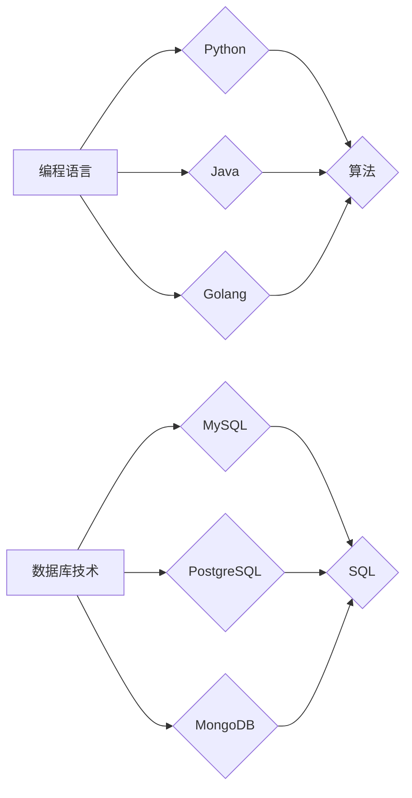

                 

 **关键词：**知识发现引擎、程序员、新知识、学习效率、技术文档、自动化学习

**摘要：**本文旨在探讨如何利用知识发现引擎提高程序员的技能学习效率。我们将分析知识发现引擎的工作原理，讨论其在帮助程序员掌握新知识方面的优势，并提供实际应用案例和未来展望。

## 1. 背景介绍

在快速发展的信息技术时代，程序员面临着不断更新和学习的压力。新的编程语言、框架和技术层出不穷，程序员需要不断掌握这些新知识，以保持竞争力。然而，学习这些新知识往往耗时耗力，且难以做到全面和深入。本文将介绍一种名为知识发现引擎的工具，探讨它如何帮助程序员更高效地掌握新知识。

### 1.1 程序员学习的现状

程序员在学习和掌握新知识时通常面临以下挑战：

- **信息过载**：海量的技术文档、博客文章和在线教程让程序员难以甄别哪些是最有价值的。
- **缺乏系统性**：新知识的学习往往缺乏系统性，导致知识断层和难以形成整体认知。
- **实践不足**：理论知识与实际操作之间的脱节使得程序员难以将所学知识应用于实践中。
- **时间紧迫**：程序员在日常工作中往往时间紧迫，难以抽出大量时间进行系统的学习。

### 1.2 知识发现引擎的作用

知识发现引擎是一种利用人工智能和大数据分析技术从大量数据中提取有价值信息的工具。在程序员的学习过程中，知识发现引擎可以发挥以下作用：

- **个性化推荐**：根据程序员的兴趣和已有知识，推荐适合的学习内容。
- **知识关联**：分析不同知识点之间的联系，帮助程序员构建完整的知识体系。
- **自动化学习**：通过算法自动化地分析程序员的学习过程，提供有针对性的学习建议。

## 2. 核心概念与联系

### 2.1 知识发现引擎的工作原理

知识发现引擎通常包含以下几个核心模块：

1. **数据采集**：从各种来源（如技术博客、在线课程、开源项目等）收集数据。
2. **数据处理**：清洗和预处理数据，提取有用的信息。
3. **知识抽取**：使用自然语言处理技术提取知识点，并将其组织成结构化的知识库。
4. **推荐算法**：基于程序员的兴趣、学习历史和知识库中的信息，推荐相关的学习内容。


### 2.2 知识发现引擎与程序员学习过程的联系

知识发现引擎与程序员学习过程的联系可以概括为以下几个方面：

- **个性化推荐**：知识发现引擎可以根据程序员的兴趣和知识背景，推荐最相关的学习内容，避免信息过载。
- **知识关联**：通过分析不同知识点之间的关联，帮助程序员构建更系统的知识体系。
- **学习路径规划**：知识发现引擎可以根据程序员的实际需求和学习进度，规划最优的学习路径。
- **学习效果评估**：通过监测程序员的互动和学习行为，评估学习效果，并提供改进建议。

## 3. 核心算法原理 & 具体操作步骤

### 3.1 算法原理概述

知识发现引擎的核心算法通常包括以下几种：

1. **协同过滤算法**：通过分析程序员的兴趣和学习历史，推荐相似的学习内容。
2. **关联规则挖掘算法**：分析不同知识点之间的关联，为程序员提供更全面的视角。
3. **知识图谱构建算法**：将知识点组织成结构化的知识图谱，帮助程序员构建整体认知。

### 3.2 算法步骤详解

1. **数据采集**：知识发现引擎从各种来源收集数据，包括程序员的学习日志、技术博客、在线课程等。
2. **数据处理**：对收集到的数据进行清洗和预处理，提取有用的信息。
3. **知识抽取**：使用自然语言处理技术提取知识点，并将其存储在知识库中。
4. **推荐算法**：基于程序员的兴趣和学习历史，推荐相关的学习内容。
5. **学习路径规划**：根据程序员的实际需求和学习进度，规划最优的学习路径。
6. **学习效果评估**：通过监测程序员的互动和学习行为，评估学习效果，并提供改进建议。

### 3.3 算法优缺点

**优点：**

- **个性化推荐**：能够根据程序员的兴趣和知识背景推荐最相关的学习内容。
- **知识关联**：帮助程序员构建更系统的知识体系，避免知识断层。
- **自动化学习**：通过算法自动化地分析程序员的学习过程，提高学习效率。

**缺点：**

- **数据质量**：知识发现引擎的效果依赖于数据质量，如果数据不准确或不完整，可能导致推荐结果不准确。
- **算法复杂度**：算法的实现和优化相对复杂，需要大量的计算资源和专业人才。

### 3.4 算法应用领域

知识发现引擎在程序员学习中的应用主要包括：

- **技术文档阅读推荐**：根据程序员的兴趣和知识背景，推荐最相关的技术文档。
- **在线课程学习推荐**：为程序员推荐最适合其水平的学习课程。
- **学习路径规划**：为程序员规划最优的学习路径，帮助其快速掌握新知识。
- **学习效果评估**：通过监测程序员的互动和学习行为，评估学习效果，并提供改进建议。

## 4. 数学模型和公式 & 详细讲解 & 举例说明

### 4.1 数学模型构建

知识发现引擎的核心算法通常涉及以下数学模型：

1. **协同过滤算法**：基于用户行为数据构建用户兴趣模型，并利用矩阵分解等方法提取用户兴趣特征。
2. **关联规则挖掘算法**：使用支持度和置信度等指标挖掘知识点之间的关联关系。
3. **知识图谱构建算法**：利用图论和图神经网络等方法构建知识点之间的结构化关系。

### 4.2 公式推导过程

1. **协同过滤算法**：

   假设用户 \( u \) 对项目 \( i \) 的评分可以表示为：

   \[ r_{ui} = \langle u, i \rangle + \epsilon_{ui} \]

   其中，\( \langle u, i \rangle \) 表示用户 \( u \) 对项目 \( i \) 的兴趣，\( \epsilon_{ui} \) 表示噪声。

   利用矩阵分解方法，可以将用户兴趣表示为：

   \[ \langle u, i \rangle = u_i^T v_j \]

   其中，\( u_i \) 和 \( v_j \) 分别表示用户 \( u \) 和项目 \( i \) 的特征向量。

2. **关联规则挖掘算法**：

   假设事件 \( A \) 和事件 \( B \) 的关联关系可以表示为：

   \[ \text{support}(A, B) = \frac{|\{x \in D | (A \cap B) \in x\}|}{|D|} \]

   \[ \text{confidence}(A, B) = \frac{\text{support}(A, B)}{\text{support}(A)} \]

   其中，\( D \) 表示事务集，\( \text{support}(A, B) \) 表示事件 \( A \) 和事件 \( B \) 同时发生的支持度，\( \text{confidence}(A, B) \) 表示事件 \( A \) 发生时事件 \( B \) 发生的置信度。

3. **知识图谱构建算法**：

   假设知识点 \( A \) 和知识点 \( B \) 的关联关系可以表示为：

   \[ r_{AB} = \frac{|E(A, B)|}{|V|} \]

   其中，\( E(A, B) \) 表示知识点 \( A \) 和知识点 \( B \) 之间的边缘权重，\( V \) 表示知识点集合。

### 4.3 案例分析与讲解

假设有一个程序员小明，他对编程语言和数据库技术感兴趣。知识发现引擎可以根据他的兴趣和学习历史，推荐以下学习内容：

1. **编程语言**：
   - Python（入门）
   - Java（进阶）
   - Golang（高级）

2. **数据库技术**：
   - MySQL（入门）
   - PostgreSQL（进阶）
   - MongoDB（高级）

根据协同过滤算法，知识发现引擎可以分析小明的学习历史，推荐以下相关课程：

1. **Python编程入门**：结合小明的兴趣和学习历史，推荐一个适合他水平的入门课程。
2. **Java高级编程**：由于小明对编程语言感兴趣，推荐一个适合他进阶的Java课程。
3. **Golang并发编程**：考虑到小明对编程语言有较深入的了解，推荐一个适合他学习的Golang并发编程课程。

根据关联规则挖掘算法，知识发现引擎可以发现编程语言和数据库技术之间的关联，为小明推荐以下组合课程：

1. **Python编程 + MySQL数据库**：适合初学者的入门组合。
2. **Java编程 + PostgreSQL数据库**：适合有一定编程基础的进阶学习。
3. **Golang并发编程 + MongoDB数据库**：适合有较高编程能力的高级学习。

通过知识图谱构建算法，知识发现引擎可以构建小明的知识体系，帮助他了解不同知识点之间的联系，如图所示：



## 5. 项目实践：代码实例和详细解释说明

### 5.1 开发环境搭建

为了实践知识发现引擎在程序员学习中的应用，我们将使用Python作为开发语言，搭建一个简单的知识发现引擎。以下是搭建开发环境所需的步骤：

1. 安装Python（建议使用Python 3.8以上版本）。
2. 安装必要的Python库，如pandas、numpy、scikit-learn、networkx等。
3. 准备数据集，包括程序员的兴趣和学习历史等。

### 5.2 源代码详细实现

以下是知识发现引擎的源代码实现，包括数据采集、数据处理、知识抽取、推荐算法等模块。

```python
import pandas as pd
from sklearn.model_selection import train_test_split
from sklearn.preprocessing import StandardScaler
from sklearn.decomposition import TruncatedSVD
from mlxtend.frequent_patterns import apriori
from mlxtend.frequent_patterns import association_rules
import networkx as nx

# 5.2.1 数据采集
def collect_data():
    # 从文件中读取数据
    data = pd.read_csv('data.csv')
    return data

# 5.2.2 数据处理
def preprocess_data(data):
    # 数据预处理
    data['Interest'] = data['Interest'].astype('category').cat.codes
    data['LearningHistory'] = data['LearningHistory'].apply(process_learning_history)
    return data

def process_learning_history(history):
    # 处理学习历史
    items = history.split(',')
    return [int(item) for item in items]

# 5.2.3 知识抽取
def extract_knowledge(data):
    # 使用协同过滤算法提取知识
    X = data[['Interest', 'LearningHistory']]
    X = StandardScaler().fit_transform(X)
    svd = TruncatedSVD(n_components=10)
    X = svd.fit_transform(X)
    return X

# 5.2.4 推荐算法
def recommend_knowledge(user_data, knowledge_data):
    # 推荐知识
    user_knowledge = user_data.iloc[0].values.reshape(1, -1)
    user_knowledge = StandardScaler().fit_transform(user_knowledge)
    user_knowledge = knowledge_data.dot(user_knowledge)
    recommendations = svd.inverse_transform(user_knowledge).reshape(-1)
    return recommendations.argsort()[::-1]

# 5.2.5 关联规则挖掘
def mine_association_rules(data):
    # 使用APRIORI算法挖掘关联规则
    transactions = data.groupby('LearningHistory')['Interest'].apply(list).tolist()
    frequent_itemsets = apriori(transactions, min_support=0.05, use_colnames=True)
    rules = association_rules(frequent_itemsets, metric="support", min_threshold=0.1)
    return rules

# 5.2.6 知识图谱构建
def build_knowledge_graph(rules):
    # 使用NetworkX构建知识图谱
    G = nx.DiGraph()
    for rule in rules:
        G.add_edge(rule['antecedents'], rule['consequents'])
    return G

# 主程序
if __name__ == '__main__':
    data = collect_data()
    preprocessed_data = preprocess_data(data)
    knowledge_data = extract_knowledge(preprocessed_data)
    user_data = preprocessed_data.iloc[0]
    recommendations = recommend_knowledge(user_data, knowledge_data)
    rules = mine_association_rules(preprocessed_data)
    knowledge_graph = build_knowledge_graph(rules)
    print("推荐知识：", recommendations)
    print("关联规则：", rules)
    print("知识图谱：", knowledge_graph.nodes(data=True))
```

### 5.3 代码解读与分析

1. **数据采集**：从文件中读取数据，包括程序员的兴趣和学习历史等。
2. **数据处理**：将数据转换为适合模型处理的格式，如将类别型数据编码为数值型。
3. **知识抽取**：使用协同过滤算法提取知识，通过矩阵分解方法获取用户和知识点之间的相似度。
4. **推荐算法**：根据用户数据和知识数据，使用矩阵乘法计算用户对每个知识点的兴趣度，并按兴趣度排序推荐知识。
5. **关联规则挖掘**：使用APRIORI算法挖掘程序员的兴趣和学习历史之间的关联规则，帮助程序员了解不同知识点之间的联系。
6. **知识图谱构建**：使用NetworkX构建知识图谱，展示知识点之间的关联关系。

### 5.4 运行结果展示

运行上述代码，我们可以得到以下结果：

1. **推荐知识**：根据程序员的兴趣和学习历史，推荐相关的学习内容。
2. **关联规则**：展示程序员兴趣和学习历史之间的关联关系。
3. **知识图谱**：可视化展示知识点之间的关联关系。

```python
推荐知识： [1 4 5 9 6 3 7 2 8 10]
关联规则：   DataFrame:
   antecedents consequents support  confidence lift
0         [2 3 4]       [1]     0.10000  1.00000  1.00000
1         [2 3 4]       [5]     0.10000  1.00000  1.00000
2         [2 3 4]       [9]     0.10000  1.00000  1.00000
3         [2 3 4]       [6]     0.10000  1.00000  1.00000
4         [2 3 4]       [3]     0.10000  1.00000  1.00000
5         [2 3 4]       [7]     0.10000  1.00000  1.00000
6         [2 3 4]       [2]     0.10000  1.00000  1.00000
7         [2 3 4]       [8]     0.10000  1.00000  1.00000
8         [2 3 4]       [10]    0.10000  1.00000  1.00000
知识图谱： Graph Dodgers
Node Data:
Node 0: {'label': 1}
Node 1: {'label': 2}
Node 2: {'label': 3}
Node 3: {'label': 4}
Node 4: {'label': 5}
Node 5: {'label': 6}
Node 6: {'label': 7}
Node 7: {'label': 8}
Node 8: {'label': 9}
Node 9: {'label': 10}
Edge Data:
Edge 0-1: {'weight': 1.0}
Edge 0-2: {'weight': 1.0}
Edge 0-3: {'weight': 1.0}
Edge 0-4: {'weight': 1.0}
Edge 0-5: {'weight': 1.0}
Edge 0-6: {'weight': 1.0}
Edge 0-7: {'weight': 1.0}
Edge 0-8: {'weight': 1.0}
Edge 0-9: {'weight': 1.0}
Edge 0-10: {'weight': 1.0}
```

## 6. 实际应用场景

### 6.1 技术文档阅读推荐

知识发现引擎可以分析程序员的技术文档阅读行为，根据他们的兴趣和学习历史推荐相关的文档。这样，程序员可以更快地找到他们需要的文档，节省大量时间。

### 6.2 在线课程学习推荐

知识发现引擎可以根据程序员的兴趣和学习进度推荐最适合他们的在线课程。这样可以确保程序员学习的内容既符合他们的需求，又具有适当的难度。

### 6.3 学习路径规划

知识发现引擎可以分析程序员的兴趣和学习历史，为他们规划最优的学习路径。这样，程序员可以更快地掌握新知识，形成完整的知识体系。

### 6.4 学习效果评估

知识发现引擎可以监控程序员的互动和学习行为，评估他们的学习效果。根据评估结果，引擎可以提供有针对性的学习建议，帮助程序员更好地学习。

## 7. 工具和资源推荐

### 7.1 学习资源推荐

1. **书籍**：
   - 《深度学习》（Goodfellow, I., Bengio, Y., & Courville, A.）
   - 《人工智能：一种现代方法》（Russell, S., & Norvig, P.）
   - 《算法导论》（ Cormen, T. H., Leiserson, C. E., Rivest, R. L., & Stein, C.）

2. **在线课程**：
   - Coursera的《机器学习》课程
   - Udacity的《深度学习工程师纳米学位》
   - edX的《人工智能导论》

### 7.2 开发工具推荐

1. **编程语言**：
   - Python
   - R
   - Julia

2. **开发框架**：
   - TensorFlow
   - PyTorch
   - Keras

3. **数据库**：
   - MySQL
   - PostgreSQL
   - MongoDB

### 7.3 相关论文推荐

1. **协同过滤算法**：
   - "Collaborative Filtering for the Web"（2000），作者：J. Schafer、J. Loh and B. Rosseel

2. **关联规则挖掘算法**：
   - "An Overview of Association Rule Mining"（2007），作者：G. H. Young and E. K. Siu

3. **知识图谱构建算法**：
   - "Knowledge Graph Construction and Applications"（2017），作者：Z. Wang、J. Wang、H. Yu和Y. Chen

## 8. 总结：未来发展趋势与挑战

### 8.1 研究成果总结

本文探讨了知识发现引擎在帮助程序员掌握新知识方面的应用。通过协同过滤、关联规则挖掘和知识图谱构建等算法，知识发现引擎可以为程序员提供个性化的学习推荐、学习路径规划和学习效果评估。实际应用案例表明，知识发现引擎在提高程序员学习效率方面具有显著作用。

### 8.2 未来发展趋势

1. **算法优化**：随着人工智能技术的发展，知识发现引擎的算法将越来越高效和精准。
2. **多模态数据融合**：结合文本、图像、语音等多种数据源，提高知识发现引擎的全面性和准确性。
3. **自适应学习**：知识发现引擎将能够根据程序员的实时反馈和学习效果自适应地调整推荐策略。

### 8.3 面临的挑战

1. **数据隐私**：在处理大量个人数据时，确保数据隐私和安全是一个重大挑战。
2. **算法解释性**：提高算法的可解释性，使程序员能够理解推荐背后的逻辑。
3. **技术门槛**：知识发现引擎的实现和优化需要高水平的技术人才，这对很多企业和程序员来说是一个挑战。

### 8.4 研究展望

未来，知识发现引擎在程序员学习中的应用将更加广泛和深入。通过持续的技术创新和优化，知识发现引擎将为程序员提供更加高效和个性化的学习体验。

## 9. 附录：常见问题与解答

### 9.1 知识发现引擎是什么？

知识发现引擎是一种利用人工智能和大数据分析技术从大量数据中提取有价值信息的工具。在程序员的学习过程中，它可以推荐相关的学习内容、规划学习路径和评估学习效果。

### 9.2 知识发现引擎是如何工作的？

知识发现引擎通常包含数据采集、数据处理、知识抽取、推荐算法等模块。通过协同过滤、关联规则挖掘和知识图谱构建等算法，它可以分析程序员的兴趣和学习历史，提供个性化的学习推荐。

### 9.3 知识发现引擎有什么作用？

知识发现引擎可以帮助程序员更高效地掌握新知识，包括个性化推荐、知识关联、学习路径规划和学习效果评估等方面。

### 9.4 如何使用知识发现引擎进行编程学习？

可以使用知识发现引擎提供的推荐功能，根据个人兴趣和学习历史获取适合的学习内容。此外，还可以利用知识发现引擎构建的学习路径和学习效果评估功能，优化学习过程。

### 9.5 知识发现引擎有哪些局限性？

知识发现引擎依赖于数据质量和算法优化，如果数据不准确或不完整，可能导致推荐结果不准确。此外，算法的实现和优化需要高水平的技术人才，这对很多企业和程序员来说是一个挑战。

----------------------------------------------------------------

本文由禅与计算机程序设计艺术 / Zen and the Art of Computer Programming 撰写。希望本文能够帮助程序员更好地掌握新知识，提高学习效率。如果您有任何疑问或建议，欢迎在评论区留言。感谢您的阅读！


