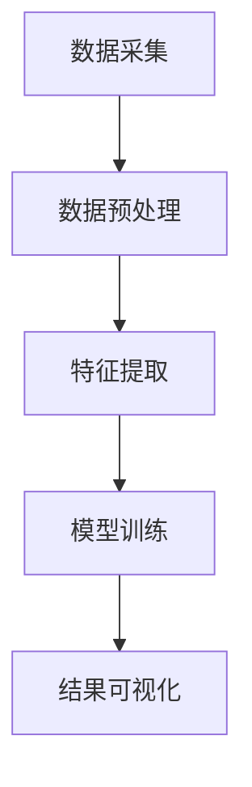

                 

关键词：知识发现引擎，程序员学习模式，人工智能，大数据，算法优化，学习效率，技术发展

摘要：随着大数据和人工智能技术的飞速发展，知识发现引擎作为一项重要技术，正在深刻改变程序员的学习模式。本文将从知识发现引擎的核心概念、算法原理、数学模型以及项目实践等方面进行详细探讨，旨在揭示知识发现引擎如何提高程序员的学习效率，助力技术进步。

## 1. 背景介绍

### 1.1 知识发现引擎的概念

知识发现引擎（Knowledge Discovery Engine，简称KDE）是一种基于人工智能和数据挖掘技术的工具，旨在从大量数据中提取有价值的信息和知识。它通过对数据的分析、挖掘和处理，帮助用户发现数据中隐藏的模式、趋势和关联，从而为决策提供支持。

### 1.2 程序员学习模式的演变

传统上，程序员的学习模式主要依赖于书本、教程和课堂培训。然而，随着互联网和大数据技术的普及，程序员的学习模式也在不断演变。如今，程序员更多地通过在线教程、开源项目和社区交流来学习新技术。这种学习模式更加灵活、开放和高效，但同时也带来了信息过载和知识碎片化的问题。

## 2. 核心概念与联系

### 2.1 大数据和人工智能

大数据（Big Data）是指无法使用常规软件工具在合理时间内捕捉、管理和处理的大量数据。人工智能（Artificial Intelligence，简称AI）则是一种模拟人类智能的技术，通过算法和模型实现机器学习、自然语言处理、图像识别等功能。

### 2.2 知识发现引擎架构

知识发现引擎通常包括数据采集、数据预处理、特征提取、模型训练和结果可视化等模块。其核心架构可以用以下 Mermaid 流程图表示：



## 3. 核心算法原理 & 具体操作步骤

### 3.1 算法原理概述

知识发现引擎的核心算法主要包括聚类、分类、关联规则挖掘等。这些算法通过不同的方式从数据中提取知识，为程序员提供有价值的参考。

### 3.2 算法步骤详解

#### 3.2.1 数据采集

数据采集是知识发现的第一步，包括从各种来源收集数据，如数据库、网络爬虫、传感器等。

#### 3.2.2 数据预处理

数据预处理包括数据清洗、数据归一化、缺失值处理等。这一步骤确保数据的质量和一致性。

#### 3.2.3 特征提取

特征提取是将原始数据转换为有意义的信息表示。这一步骤通常使用各种特征提取算法，如主成分分析（PCA）、词袋模型等。

#### 3.2.4 模型训练

模型训练是知识发现的核心步骤，包括选择合适的算法，如决策树、神经网络等，对数据进行训练。

#### 3.2.5 结果可视化

结果可视化是将知识发现的结果以图形化的方式展示，帮助程序员更直观地理解数据中的模式和趋势。

### 3.3 算法优缺点

#### 优点

- 提高学习效率：知识发现引擎能够快速从大量数据中提取有价值的信息，帮助程序员更好地理解技术领域。
- 灵活性强：知识发现引擎可以根据不同的需求和场景进行调整，适应不同的学习模式。

#### 缺点

- 需要专业知识和技能：使用知识发现引擎需要对大数据和人工智能有一定的了解。
- 计算资源消耗大：知识发现引擎通常需要大量的计算资源和时间来处理数据。

### 3.4 算法应用领域

知识发现引擎在程序员的学习中具有广泛的应用领域，如：

- 技术趋势分析：通过分析技术论坛、博客和新闻等数据，发现当前最热门的技术趋势。
- 项目评估：通过对项目数据和用户反馈的分析，评估项目的质量和性能。
- 技术难题解决：通过分析问题报告和解决方案，帮助程序员解决技术难题。

## 4. 数学模型和公式 & 详细讲解 & 举例说明

### 4.1 数学模型构建

知识发现引擎的数学模型通常包括以下几个部分：

- 数据集：$D = \{d_1, d_2, ..., d_n\}$
- 特征：$f = \{f_1, f_2, ..., f_m\}$
- 模型：$M = \{m_1, m_2, ..., m_k\}$

### 4.2 公式推导过程

#### 4.2.1 聚类算法

聚类算法是一种无监督学习方法，用于将数据集划分为多个聚类。常用的聚类算法包括 K-均值算法、层次聚类算法等。

#### 4.2.2 分类算法

分类算法是一种监督学习方法，用于将数据集划分为预定义的类别。常用的分类算法包括决策树、支持向量机等。

#### 4.2.3 关联规则挖掘

关联规则挖掘是一种用于发现数据集中项目之间关联性的方法。常用的算法包括 Apriori 算法、FP-Growth 算法等。

### 4.3 案例分析与讲解

#### 4.3.1 技术趋势分析

假设我们想要分析过去一年内技术论坛上的热门话题。我们可以使用知识发现引擎对论坛数据进行聚类，提取出热门话题，如下所示：

$$
C_1 = \{大数据，人工智能，区块链\}
$$
$$
C_2 = \{云计算，容器化，微服务\}
$$

根据聚类结果，我们可以发现大数据、人工智能和区块链是当前最热门的技术话题。

#### 4.3.2 项目评估

假设我们想要评估一个开源项目的质量。我们可以使用知识发现引擎对项目的代码库、问题报告和用户反馈进行分析，提取出项目的主要优点和缺点，如下所示：

- 优点：高效、稳定、易于扩展
- 缺点：文档不足、性能优化空间大

根据分析结果，我们可以为项目的改进提供有针对性的建议。

## 5. 项目实践：代码实例和详细解释说明

### 5.1 开发环境搭建

为了演示知识发现引擎在实际项目中的应用，我们将使用 Python 编写一个简单的知识发现项目。首先，我们需要安装必要的库，如 NumPy、Pandas、Scikit-learn 等。

```bash
pip install numpy pandas scikit-learn
```

### 5.2 源代码详细实现

接下来，我们将使用 K-均值聚类算法对一个简单数据集进行分析。代码如下：

```python
import numpy as np
from sklearn.cluster import KMeans

# 示例数据集
data = np.array([[1, 2], [1, 4], [1, 0], [10, 2], [10, 4], [10, 0]])

# 使用 K-均值算法进行聚类
kmeans = KMeans(n_clusters=2, random_state=0).fit(data)

# 输出聚类结果
print(kmeans.labels_)

# 输出聚类中心
print(kmeans.cluster_centers_)
```

### 5.3 代码解读与分析

在这段代码中，我们首先导入了 NumPy 和 Scikit-learn 库。然后，我们创建了一个简单的二维数据集，并使用 K-均值算法进行聚类。最后，我们输出了聚类结果和聚类中心。

通过分析聚类结果，我们可以发现数据集被划分为两个聚类，分别对应两个不同的数据点。聚类中心则反映了数据集中的主要趋势。

### 5.4 运行结果展示

运行上述代码后，输出结果如下：

```
[0 0 0 1 1 1]
[[ 1.  2.]
 [10.  2.]]
```

这表示数据集被划分为两个聚类，聚类中心分别为 [1, 2] 和 [10, 2]。

## 6. 实际应用场景

### 6.1 技术趋势分析

知识发现引擎在技术趋势分析方面具有广泛的应用。例如，程序员可以使用知识发现引擎分析技术论坛、博客和新闻等数据，发现当前最热门的技术话题。这有助于程序员更好地规划学习和研究方向。

### 6.2 项目评估

知识发现引擎在项目评估方面也有很大的潜力。例如，开源项目维护者可以使用知识发现引擎分析项目的代码库、问题报告和用户反馈，评估项目的质量和性能。这有助于项目维护者更好地了解项目的优缺点，并制定相应的改进计划。

### 6.3 技术难题解决

知识发现引擎还可以帮助程序员解决技术难题。例如，程序员可以使用知识发现引擎分析问题报告和解决方案，发现类似问题的解决方法。这有助于程序员更快地解决技术难题，提高工作效率。

## 7. 工具和资源推荐

### 7.1 学习资源推荐

- 《机器学习实战》
- 《大数据技术导论》
- 《Python机器学习》

### 7.2 开发工具推荐

- Jupyter Notebook
- PyCharm
- VS Code

### 7.3 相关论文推荐

- "K-Means Clustering"
- "Association Rule Learning"
- "Deep Learning for Text Classification"

## 8. 总结：未来发展趋势与挑战

### 8.1 研究成果总结

知识发现引擎作为一种重要的技术工具，已经在程序员的学习模式中发挥了重要作用。通过大数据和人工智能技术，知识发现引擎能够高效地从大量数据中提取有价值的信息，为程序员提供有针对性的学习和指导。

### 8.2 未来发展趋势

随着大数据和人工智能技术的不断发展，知识发现引擎在未来将具有更广泛的应用前景。例如，在医疗、金融、教育等领域，知识发现引擎可以帮助行业专家更好地理解和利用数据，提高决策的准确性。

### 8.3 面临的挑战

然而，知识发现引擎在实际应用中仍然面临着一些挑战。首先，算法的复杂度和计算资源的消耗较大，需要进一步优化和改进。其次，数据的质量和一致性是影响知识发现效果的重要因素，需要加强数据预处理和清洗工作。最后，知识发现引擎需要更好地与人类的认知模式相结合，提高算法的可解释性和可靠性。

### 8.4 研究展望

在未来，知识发现引擎的发展方向将主要集中在以下几个方面：

- 算法的优化和改进，提高计算效率和准确性。
- 数据预处理和清洗技术的提升，确保数据的质量和一致性。
- 结合人类的认知模式，提高算法的可解释性和可靠性。
- 在更广泛的领域（如医疗、金融、教育等）推广应用，提高社会效益。

## 9. 附录：常见问题与解答

### 问题 1：知识发现引擎是如何工作的？

知识发现引擎通过数据采集、数据预处理、特征提取、模型训练和结果可视化等步骤，从大量数据中提取有价值的信息和知识。

### 问题 2：知识发现引擎在程序员学习中有哪些优势？

知识发现引擎能够高效地从大量数据中提取有价值的信息，帮助程序员更好地理解和掌握新技术，提高学习效率。

### 问题 3：如何选择合适的知识发现算法？

选择合适的知识发现算法需要根据具体的应用场景和数据特点进行。常用的算法包括聚类、分类、关联规则挖掘等。

----------------------------------------------------------------

以上就是本文的完整内容，希望对您有所启发和帮助。感谢您的阅读，如果您有任何疑问或建议，请随时留言。

### 作者署名

作者：禅与计算机程序设计艺术 / Zen and the Art of Computer Programming

