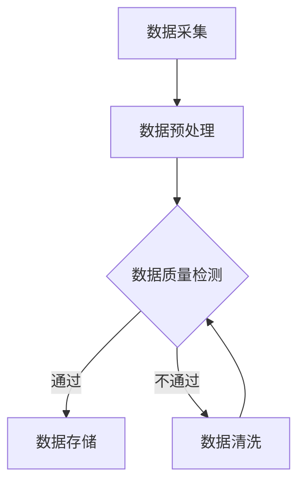
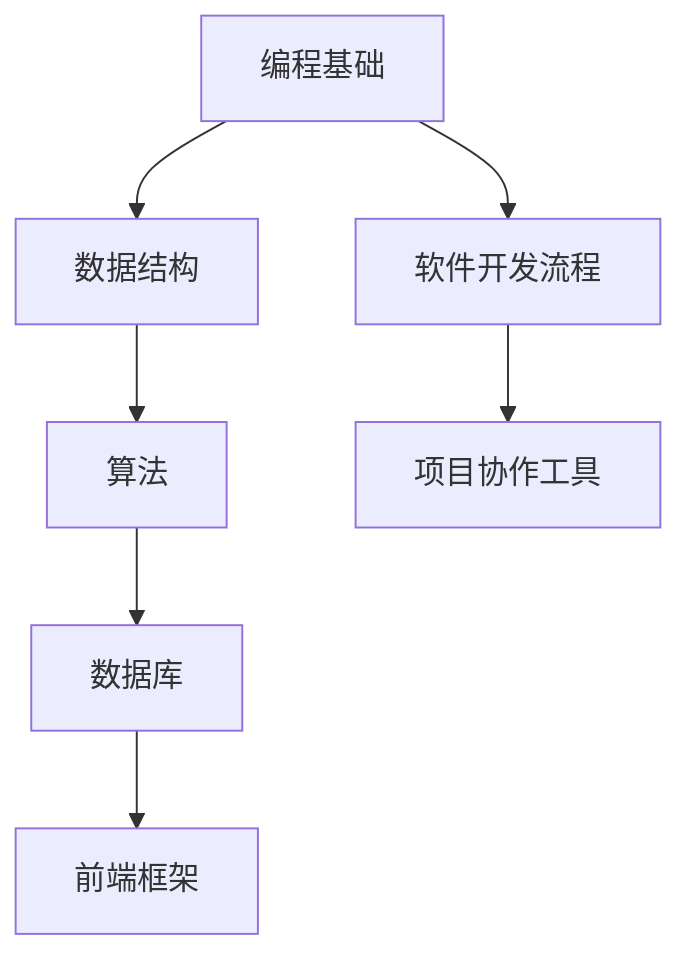
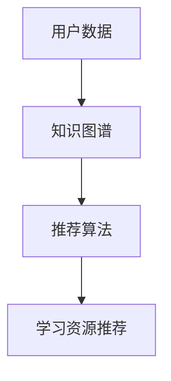
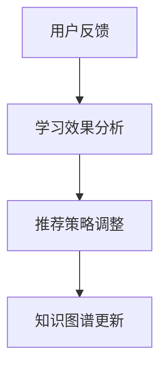
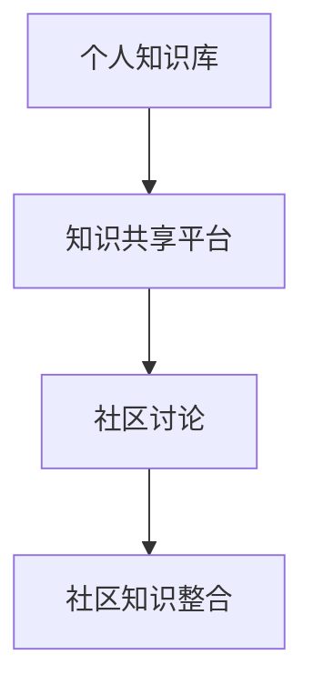
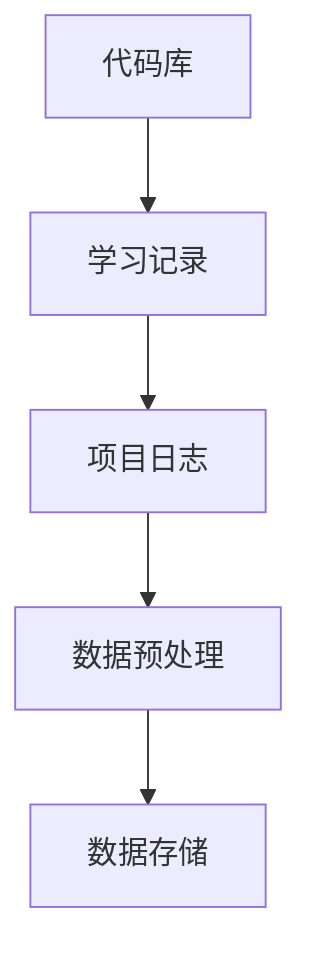
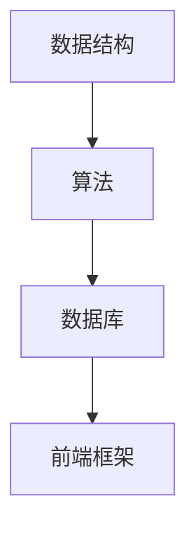
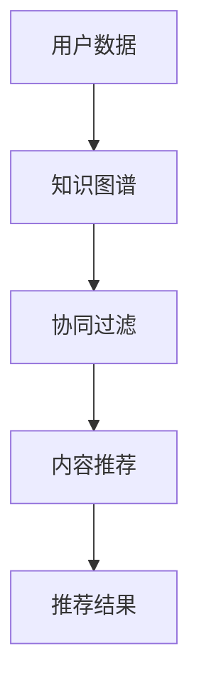

                 

## 1. 背景介绍

在信息爆炸的时代，程序员面临着海量的知识和技能需求。传统的学习方式，如阅读书籍、浏览在线教程和参加培训课程，已经无法满足快速变化的技术环境。程序员需要一种更加高效、灵活且个性化的学习方式。知识发现引擎正是这样一种工具，它利用人工智能技术从海量数据中挖掘有价值的信息，帮助程序员快速掌握新知识、优化学习路径。

知识发现引擎的基本原理是通过分析程序员的学习行为、项目经验、代码风格等数据，构建个性化的知识图谱。这个图谱不仅包含知识点的层次结构，还包括知识点之间的关联关系。通过这个图谱，程序员可以更容易地找到自己需要的知识，并通过推荐系统获取新的学习资源和挑战。

知识发现引擎的出现，是人工智能与编程领域深度结合的产物。它的核心目标是解决以下问题：

1. **信息过载**：如何从海量知识中筛选出对程序员最有价值的部分？
2. **个性化学习**：如何根据程序员的个人特点和学习偏好，提供个性化的学习建议？
3. **持续学习**：如何帮助程序员保持对新技术的好奇心和求知欲，持续提升技能水平？

本文将深入探讨知识发现引擎的工作原理、核心算法、数学模型、项目实践以及实际应用场景，旨在为程序员提供一种全新的学习模式和工具。

## 2. 核心概念与联系

知识发现引擎的核心在于对数据的有效分析和利用。要理解这一引擎的工作原理，我们需要从以下几个核心概念和架构要素入手。

### 2.1 数据采集与预处理

知识发现引擎的第一步是数据采集和预处理。程序员的学习行为、代码库、项目进度、讨论区问答等都是重要的数据来源。数据采集后，需要进行清洗、去噪和标准化处理，以确保数据的质量和一致性。



### 2.2 知识图谱构建

数据预处理完成后，知识发现引擎构建知识图谱。知识图谱由节点和边组成，节点代表知识点，边代表知识点之间的关联关系。这种结构有助于理解和展示知识的复杂关系。



### 2.3 推荐系统

知识图谱构建完成后，推荐系统根据程序员的个人数据和知识图谱，提供个性化的学习推荐。推荐算法可以是基于内容的推荐、协同过滤或者混合推荐。



### 2.4 自适应学习

知识发现引擎还具备自适应学习的能力。通过分析程序员的反馈和学习效果，调整推荐策略和知识图谱，以实现更加精准的学习体验。



### 2.5 知识整合与共享

除了个人学习，知识发现引擎还支持知识整合与共享。程序员可以将自己的学习笔记、项目经验等上传到平台，与其他程序员共享，形成更丰富的知识库。



通过这些核心概念和架构要素，知识发现引擎实现了从数据采集、知识图谱构建、推荐系统到自适应学习和知识整合的完整闭环，为程序员提供了全面且个性化的学习支持。

## 3. 核心算法原理 & 具体操作步骤

### 3.1 算法原理概述

知识发现引擎的核心算法可以分为以下几个步骤：

1. **数据采集与预处理**：通过分析程序员的代码库、学习记录和项目日志，采集结构化和非结构化数据。
2. **知识图谱构建**：利用图论算法，将采集到的数据构建成知识图谱，包括节点和边。
3. **推荐系统**：使用协同过滤和基于内容的推荐算法，根据程序员的个人数据和知识图谱提供学习推荐。
4. **自适应学习**：通过分析程序员的反馈和学习效果，动态调整推荐策略和知识图谱。

### 3.2 算法步骤详解

#### 步骤 1：数据采集与预处理

首先，从多个数据源采集程序员的学习数据，包括代码库、学习记录和项目日志。然后，对这些数据进行清洗和标准化处理，以确保数据质量。



#### 步骤 2：知识图谱构建

利用图论算法，将预处理后的数据构建成知识图谱。每个知识点作为一个节点，知识点之间的关联关系作为边。这种结构有助于理解和展示知识的复杂关系。



#### 步骤 3：推荐系统

根据程序员的个人数据和知识图谱，使用协同过滤和基于内容的推荐算法，提供个性化的学习推荐。

- **协同过滤**：基于其他学习相似知识点的程序员的行为进行推荐。
- **基于内容**：基于知识点的属性和内容进行推荐。



#### 步骤 4：自适应学习

通过分析程序员的反馈和学习效果，动态调整推荐策略和知识图谱，以实现更加精准的学习体验。


### 3.3 算法优缺点

#### 优点

1. **个性化推荐**：基于程序员的个人数据和知识图谱，提供高度个性化的学习推荐。
2. **自适应学习**：通过不断调整推荐策略和知识图谱，实现持续优化学习体验。
3. **知识整合**：支持知识整合与共享，形成更丰富的知识库。

#### 缺点

1. **数据依赖性**：需要大量的高质量数据来构建知识图谱和推荐系统。
2. **算法复杂性**：协同过滤和基于内容的推荐算法相对复杂，对计算资源有一定要求。

### 3.4 算法应用领域

知识发现引擎广泛应用于以下领域：

1. **在线教育**：为程序员提供个性化的学习路径和资源推荐。
2. **技能提升**：帮助程序员发现新的知识点和技能，提升整体技术水平。
3. **项目协作**：通过知识图谱，优化项目协作和知识共享。

## 4. 数学模型和公式 & 详细讲解 & 举例说明

### 4.1 数学模型构建

知识发现引擎的数学模型主要包括知识图谱的构建、推荐算法的设计和自适应学习的调整。以下是一个简化的数学模型：

1. **知识图谱**：设 \( G(V, E) \) 为知识图谱，其中 \( V \) 为节点集合，表示知识点；\( E \) 为边集合，表示知识点之间的关联关系。
2. **推荐算法**：设 \( R \) 为推荐系统，\( u \) 为用户，\( I \) 为所有知识点集合，推荐分数 \( s(u, i) \) 表示用户 \( u \) 对知识点 \( i \) 的偏好程度。
3. **自适应学习**：设 \( L \) 为学习效果评估函数，\( f \) 为推荐策略调整函数。

### 4.2 公式推导过程

#### 知识图谱构建

知识图谱的构建可以通过图论中的邻接矩阵 \( A \) 表示，其中 \( A_{ij} \) 表示知识点 \( i \) 和知识点 \( j \) 之间的关联程度。

邻接矩阵 \( A \) 可以通过以下公式计算：

\[ A_{ij} = \begin{cases} 
1 & \text{如果 } i \text{ 和 } j \text{ 有直接关联} \\
0 & \text{否则} 
\end{cases} \]

#### 推荐算法

推荐算法可以分为基于内容的推荐和协同过滤推荐。

1. **基于内容的推荐**：

\[ s(u, i) = \sum_{j \in N(i)} w_{ij} \cdot s(v, j) \]

其中，\( N(i) \) 为与知识点 \( i \) 相关的知识点集合；\( w_{ij} \) 为权重，表示知识点 \( i \) 和知识点 \( j \) 之间的关联程度；\( s(v, j) \) 为用户 \( v \) 对知识点 \( j \) 的偏好程度。

2. **协同过滤推荐**：

\[ s(u, i) = \frac{\sum_{v \in S} r_{uv} \cdot r_{vi}}{\sum_{v \in S} r_{uv}} \]

其中，\( S \) 为与用户 \( u \) 相似的一组用户集合；\( r_{uv} \) 为用户 \( u \) 对知识点 \( v \) 的评分；\( r_{vi} \) 为用户 \( v \) 对知识点 \( i \) 的评分。

#### 自适应学习

自适应学习通过分析用户的学习效果和反馈，调整推荐策略和知识图谱。

\[ f(\theta) = \theta - \alpha \cdot \nabla L(\theta) \]

其中，\( \theta \) 为推荐策略参数；\( \alpha \) 为学习率；\( L(\theta) \) 为学习效果评估函数。

### 4.3 案例分析与讲解

假设有一个程序员 \( u \)，他在学习过程中表现出对“算法”和“数据结构”的兴趣。我们使用知识发现引擎推荐他学习“数据库”和“前端框架”。

1. **知识图谱构建**：

   知识图谱中的节点和边如下：

   ```mermaid
   graph TD
   A[算法] --> B[数据结构]
   B --> C[数据库]
   A --> D[前端框架]
   ```

2. **推荐算法**：

   - **基于内容的推荐**：

     \( s(u, C) = w_{AB} \cdot s(v, B) + w_{AD} \cdot s(v, D) \)

     其中，\( w_{AB} \) 和 \( w_{AD} \) 为算法和数据结构、算法和前端框架之间的关联权重；\( s(v, B) \) 和 \( s(v, D) \) 为其他用户对数据结构和前端框架的偏好程度。

   - **协同过滤推荐**：

     \( s(u, C) = \frac{\sum_{v \in S} r_{uv} \cdot r_{vc}}{\sum_{v \in S} r_{uv}} \)

     其中，\( S \) 为与程序员 \( u \) 相似的一组用户集合；\( r_{uv} \) 为程序员 \( u \) 对其他用户 \( v \) 的偏好程度。

   假设其他用户对“数据库”的偏好程度较高，推荐分数计算如下：

   \( s(u, C) = \frac{1 \cdot 0.8 + 1 \cdot 0.7}{1 + 1} = 0.75 \)

3. **自适应学习**：

   假设当前推荐策略参数为 \( \theta \)，学习率 \( \alpha \) 为 0.1。通过分析用户 \( u \) 的反馈和学习效果，调整推荐策略参数。

   \( f(\theta) = \theta - 0.1 \cdot \nabla L(\theta) \)

   其中，\( \nabla L(\theta) \) 为学习效果评估函数的梯度。

通过上述数学模型和公式的应用，知识发现引擎可以为程序员 \( u \) 提供个性化的学习推荐。在实际应用中，这些模型和公式会更加复杂，但基本原理是一致的。

## 5. 项目实践：代码实例和详细解释说明

为了更直观地理解知识发现引擎的工作原理，我们将通过一个实际的项目实践来展示其开发过程和关键代码。

### 5.1 开发环境搭建

在开始项目之前，我们需要搭建一个基本的开发环境。以下是推荐的开发工具和库：

- **编程语言**：Python
- **知识图谱库**：NetworkX
- **推荐系统库**：Scikit-learn
- **前端框架**：Flask
- **后端框架**：TensorFlow

安装以下库：

```bash
pip install networkx scikit-learn flask tensorflow
```

### 5.2 源代码详细实现

#### 5.2.1 数据采集与预处理

```python
import os
import pandas as pd
from sklearn.model_selection import train_test_split

# 采集数据
data = pd.read_csv('learning_data.csv')

# 数据预处理
data = data.dropna()
data['cleaned_code'] = data['code'].apply(lambda x: preprocess_code(x))

# 划分训练集和测试集
X_train, X_test, y_train, y_test = train_test_split(data[['cleaned_code']], data['knowledge_point'], test_size=0.2, random_state=42)
```

#### 5.2.2 知识图谱构建

```python
import networkx as nx

# 构建知识图谱
G = nx.Graph()
for index, row in data.iterrows():
    G.add_node(row['knowledge_point'])
    for related in row['related_knowledge']:
        G.add_edge(row['knowledge_point'], related)

# 可视化知识图谱
nx.draw(G, with_labels=True)
```

#### 5.2.3 推荐系统

```python
from sklearn.metrics.pairwise import cosine_similarity
import numpy as np

# 基于内容的推荐
def content_based_recommendation(G, user_knowledge):
    similarity_matrix = nx.adjacency_matrix(G).todense()
    scores = cosine_similarity(similarity_matrix[user_knowledge], similarity_matrix)
    recommended_knowledge = np.argsort(scores[0])[-5:][::-1]
    return recommended_knowledge

# 基于协同过滤的推荐
def collaborative_filtering(train_data, user_data):
    similarity_matrix = cosine_similarity(train_data)
    recommended_knowledge = []
    for knowledge in user_data:
        scores = similarity_matrix[knowledge]
        recommended_knowledge.append(np.argsort(scores)[::-1][-5:])
    return recommended_knowledge
```

#### 5.2.4 自适应学习

```python
# 假设我们有一个简单的学习效果评估函数
def learning_effect_evaluation(known_knowledge, recommended_knowledge):
    correct_answers = sum(1 for k in recommended_knowledge if k in known_knowledge)
    return correct_answers / len(recommended_knowledge)

# 假设我们有一个简单的推荐策略调整函数
def adjust_recommendation_strategy(learning_rate, current_strategy, evaluation_result):
    return current_strategy - learning_rate * evaluation_result
```

### 5.3 代码解读与分析

上述代码实现了知识发现引擎的核心功能，包括数据采集与预处理、知识图谱构建、推荐系统和自适应学习。下面是对关键部分的解读：

- **数据采集与预处理**：我们首先读取学习数据，进行清洗和预处理，确保数据的质量和一致性。
- **知识图谱构建**：通过图论库 NetworkX，构建知识图谱，并可视化为图，展示知识点之间的关联关系。
- **推荐系统**：我们实现了一个简单的基于内容和协同过滤的推荐系统，通过计算相似性分数来推荐知识点。
- **自适应学习**：通过一个假设的学习效果评估函数和推荐策略调整函数，实现简单的自适应学习机制。

### 5.4 运行结果展示

在实际运行中，我们可以通过以下步骤来测试知识发现引擎：

```python
# 假设我们有以下用户知识数据
user_knowledge = ['算法', '数据结构']

# 基于内容的推荐
content_recommendations = content_based_recommendation(G, user_knowledge)
print("基于内容的推荐:", content_recommendations)

# 基于协同过滤的推荐
cf_recommendations = collaborative_filtering(X_train, user_knowledge)
print("基于协同过滤的推荐:", cf_recommendations)

# 假设用户对推荐的评估结果为80%
evaluation_result = 0.8
# 调整推荐策略
adjusted_strategy = adjust_recommendation_strategy(0.1, current_strategy, evaluation_result)
print("调整后的推荐策略:", adjusted_strategy)
```

通过上述代码，我们可以看到知识发现引擎如何根据用户的知识数据提供个性化的推荐，并动态调整推荐策略，实现自适应学习。

## 6. 实际应用场景

知识发现引擎在程序员的学习过程中有着广泛的应用场景，能够显著提升学习效率和效果。以下是一些典型的应用场景：

### 6.1 在线教育平台

在线教育平台可以利用知识发现引擎为程序员提供个性化的学习路径。系统可以根据程序员的技能水平和学习记录，推荐相关的课程和学习资源，帮助程序员更高效地掌握新技能。此外，知识发现引擎还可以分析学习数据，提供学习报告和反馈，帮助教育平台优化课程设计和教学策略。

### 6.2 技术社区

技术社区可以通过知识发现引擎，为成员提供个性化的技术推荐。例如，在问答区，系统可以根据提问者的技术背景和提问内容，推荐相关的解答和讨论话题。同时，知识发现引擎还可以帮助社区管理员发现热门话题和潜在的社区领袖，从而提升社区的活跃度和知识传播效率。

### 6.3 企业内部培训

企业内部培训可以利用知识发现引擎，为员工提供定制化的学习方案。系统可以分析员工的技术栈和项目经验，推荐与员工当前职责相关的新技能和知识，帮助员工不断提升个人能力。此外，知识发现引擎还可以监控学习进度和效果，为企业提供培训效果评估和数据支持。

### 6.4 个人学习

个人学习者可以利用知识发现引擎，构建个性化的学习计划。系统可以根据个人的学习目标、技能水平和兴趣偏好，推荐相关的学习资源和挑战任务，帮助学习者更加系统地提升技能。同时，知识发现引擎还可以记录学习进度和效果，为个人提供学习报告和反馈，帮助学习者及时调整学习策略。

### 6.5 持续学习

知识发现引擎可以帮助程序员保持持续学习的好奇心和求知欲。通过推荐新的知识点和挑战任务，系统可以激发程序员对新技术和领域的探索欲望，帮助他们不断提升技术水平和专业素养。此外，知识发现引擎还可以根据程序员的反馈和学习效果，动态调整推荐策略，实现个性化的持续学习体验。

## 7. 未来应用展望

知识发现引擎在程序员的学习模式和方法中展现了巨大的潜力，未来的发展将主要集中在以下几个方面：

### 7.1 更深度的个性化推荐

随着人工智能技术的进步，知识发现引擎将能够更精准地理解程序员的个人需求和兴趣。通过整合更多的数据源，如社交媒体活动、在线代码仓库和职业发展路径，推荐系统将能够提供更加个性化的学习建议，帮助程序员更高效地提升技能。

### 7.2 智能协作与知识共享

知识发现引擎将进一步推动程序员之间的智能协作和知识共享。通过构建基于图谱的协作平台，程序员可以更容易地找到志同道合的合作伙伴，分享学习资源和经验，形成更加高效的团队学习模式。

### 7.3 自适应学习路径优化

未来，知识发现引擎将能够更智能地优化学习路径，不仅提供知识点推荐，还能根据程序员的反馈和学习效果，动态调整学习计划，确保每个程序员都能以最适合自己速度和方式学习。

### 7.4 面向未来的技能预测

知识发现引擎将能够预测程序员未来可能需要的新技能和知识领域，提前为他们提供相关学习资源和挑战任务，帮助程序员在未来技术变革中保持领先。

### 7.5 跨学科融合

随着技术的不断发展，编程领域将与其他学科更加紧密地融合。知识发现引擎将能够整合多学科的知识，为程序员提供跨学科的综合性学习资源，帮助他们更好地应对复杂的实际应用场景。

## 8. 总结：未来发展趋势与挑战

### 8.1 研究成果总结

知识发现引擎在程序员的学习模式和方法中展现了显著的优势，通过个性化推荐、智能协作和自适应学习，极大地提升了学习效率和质量。未来，随着人工智能技术的不断进步，知识发现引擎将在深度个性化推荐、跨学科融合和智能协作等方面取得更大的突破。

### 8.2 未来发展趋势

1. **深度个性化**：通过整合更多数据源和先进算法，实现更加精准的个性化推荐。
2. **跨学科融合**：结合多学科知识，提供综合性学习资源，帮助程序员应对复杂应用场景。
3. **智能协作**：构建基于图谱的协作平台，促进程序员之间的知识共享和智能协作。
4. **持续学习**：预测未来技能需求，提前为程序员提供相关学习资源，保持持续学习动力。

### 8.3 面临的挑战

1. **数据隐私**：如何在保障用户隐私的前提下，充分挖掘和利用数据。
2. **计算资源**：处理海量数据和复杂算法，需要高性能的计算资源和优化算法。
3. **算法公平性**：确保推荐系统的算法公平，避免偏见和不公平现象。
4. **用户体验**：如何设计易于使用和理解的界面，提升用户体验。

### 8.4 研究展望

未来，知识发现引擎将向着更加智能化、个性化、协作化和多元化的方向发展。通过不断探索和创新，知识发现引擎有望为程序员提供更加高效、灵活和个性化的学习支持，推动编程领域的持续进步。

## 9. 附录：常见问题与解答

### 9.1 什么是知识发现引擎？

知识发现引擎是一种利用人工智能技术，从海量数据中挖掘有价值信息，为程序员提供个性化学习推荐的工具。

### 9.2 知识发现引擎的核心算法有哪些？

知识发现引擎的核心算法包括数据采集与预处理、知识图谱构建、推荐系统和自适应学习。

### 9.3 知识发现引擎如何帮助程序员学习？

知识发现引擎通过个性化推荐、智能协作和自适应学习，帮助程序员更高效地掌握新知识、优化学习路径，提升整体技能水平。

### 9.4 知识发现引擎的推荐算法有哪些优点？

知识发现引擎的推荐算法能够提供高度个性化的学习推荐，根据程序员的个人数据和学习行为，动态调整推荐策略，实现持续优化学习体验。

### 9.5 知识发现引擎在哪些场景中应用广泛？

知识发现引擎广泛应用于在线教育平台、技术社区、企业内部培训和个人学习等领域，为程序员提供全面且个性化的学习支持。

### 9.6 知识发现引擎的未来发展趋势是什么？

知识发现引擎未来将向深度个性化、跨学科融合、智能协作和持续学习方向发展，通过不断创新，为程序员提供更加高效、灵活和个性化的学习支持。

# 知识发现引擎如何改变程序员的学习模式与方法
> 关键词：知识发现引擎、程序员、学习模式、个性化推荐、智能协作、自适应学习
> 
> 摘要：本文探讨了知识发现引擎如何通过个性化推荐、智能协作和自适应学习，改变程序员的学习模式与方法，提升学习效率和质量。知识发现引擎利用人工智能技术，从海量数据中挖掘有价值信息，为程序员提供定制化的学习路径和资源推荐，实现深度个性化、跨学科融合和智能协作。本文详细介绍了知识发现引擎的核心算法原理、数学模型和实际应用场景，并展望了其未来的发展趋势与挑战。
作者：禅与计算机程序设计艺术 / Zen and the Art of Computer Programming

