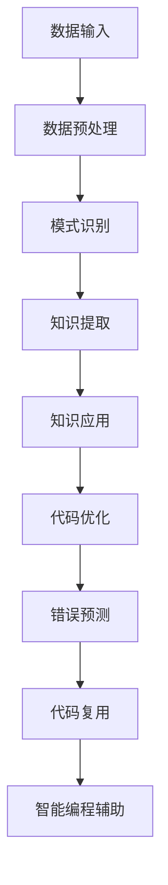

                 

关键词：知识发现引擎、程序员、工作效率、代码优化、自动化、算法、人工智能、软件开发

> 摘要：本文将探讨知识发现引擎如何通过其先进的数据分析和模式识别技术，对程序员的工作方式产生深远的影响。文章首先介绍知识发现引擎的基本概念和原理，然后分析其在编程领域的具体应用，最后讨论其带来的挑战和未来发展趋势。

## 1. 背景介绍

### 1.1 程序员的工作方式

程序员是软件开发的核心力量，他们的工作方式直接影响到软件项目的质量和效率。传统的程序员工作方式主要包括以下几个步骤：

1. **需求分析**：理解客户需求，明确软件的功能和性能要求。
2. **系统设计**：设计软件的整体架构，包括模块划分、接口定义等。
3. **编码实现**：根据设计文档，编写代码实现具体的功能。
4. **测试调试**：运行测试用例，修复代码中的错误。
5. **维护更新**：在软件使用过程中，根据用户反馈进行优化和更新。

### 1.2 传统工作方式的局限

尽管传统工作方式在软件开发中取得了显著的成果，但仍然存在一些局限：

1. **重复劳动**：程序员经常需要重复编写类似代码，缺乏有效的代码复用机制。
2. **效率低下**：在代码审查、测试和调试过程中，耗时较长，影响整体开发效率。
3. **知识浪费**：开发过程中积累的大量知识和经验未能得到有效利用。

### 1.3 知识发现引擎的崛起

知识发现引擎（Knowledge Discovery Engine，简称KDE）是近年来人工智能和大数据技术相结合的产物。它通过数据挖掘和模式识别技术，从大量数据中提取有价值的信息和知识。知识发现引擎的崛起，为改变程序员的工作方式带来了新的契机。

## 2. 核心概念与联系

### 2.1 知识发现引擎的基本原理

知识发现引擎的基本原理包括以下几个方面：

1. **数据预处理**：清洗、整合和转换原始数据，使其符合分析需求。
2. **模式识别**：利用机器学习算法，从数据中发现潜在的关联和规律。
3. **知识提取**：将识别出的模式转化为可操作的规则或知识。
4. **知识应用**：将提取的知识应用于实际问题，提高解决方案的效率和准确性。

### 2.2 知识发现引擎与编程领域的联系

知识发现引擎在编程领域具有广泛的应用前景，主要体现在以下几个方面：

1. **代码优化**：通过分析历史代码库，发现潜在的性能瓶颈和优化机会。
2. **错误预测**：预测代码中可能出现的错误，提前进行修复。
3. **代码复用**：从大量代码中提取通用模块，实现代码的复用。
4. **智能编程辅助**：提供代码自动生成、优化和修复等功能。

### 2.3 Mermaid 流程图

以下是一个简化的知识发现引擎在编程领域应用的Mermaid流程图：



## 3. 核心算法原理 & 具体操作步骤

### 3.1 算法原理概述

知识发现引擎的核心算法主要包括以下几个步骤：

1. **数据采集**：收集编程领域的各类数据，如代码库、项目文档、开发者行为数据等。
2. **数据预处理**：清洗、整合和转换原始数据，去除噪声和冗余信息。
3. **特征提取**：从预处理后的数据中提取有用的特征，为后续分析提供基础。
4. **模式识别**：利用机器学习算法，从特征数据中发现潜在的关联和规律。
5. **知识提取**：将识别出的模式转化为可操作的规则或知识。
6. **知识应用**：将提取的知识应用于实际问题，如代码优化、错误预测等。

### 3.2 算法步骤详解

#### 3.2.1 数据采集

数据采集是知识发现引擎的第一步。在这一阶段，需要收集编程领域的各类数据，如代码库、项目文档、开发者行为数据等。这些数据可以来源于开源社区、企业内部代码库、在线编程平台等。

#### 3.2.2 数据预处理

数据预处理是确保数据质量的关键步骤。在这一阶段，需要对原始数据进行清洗、整合和转换，去除噪声和冗余信息。具体操作包括：

1. **数据清洗**：去除重复数据、缺失值填充、异常值处理等。
2. **数据整合**：将不同来源的数据进行整合，形成统一的数据集。
3. **数据转换**：将原始数据转换为适合分析的形式，如数值化、归一化等。

#### 3.2.3 特征提取

特征提取是从预处理后的数据中提取有用的特征。这些特征可以是代码的语法结构、变量使用情况、函数调用关系等。特征提取的质量直接影响后续分析的效果。

#### 3.2.4 模式识别

模式识别是利用机器学习算法，从特征数据中发现潜在的关联和规律。常见的机器学习算法包括决策树、支持向量机、神经网络等。通过模式识别，可以发现代码中的潜在问题和优化机会。

#### 3.2.5 知识提取

知识提取是将识别出的模式转化为可操作的规则或知识。这些知识可以用于代码优化、错误预测、代码复用等实际应用场景。

#### 3.2.6 知识应用

知识应用是将提取的知识应用于实际问题，如代码优化、错误预测等。通过知识应用，可以提高软件开发的效率和质量。

### 3.3 算法优缺点

#### 优点

1. **高效性**：知识发现引擎可以快速地从大量数据中发现潜在的模式和知识。
2. **准确性**：通过机器学习算法，知识发现引擎可以提高预测和优化的准确性。
3. **可扩展性**：知识发现引擎可以应用于不同的编程领域，具有较好的可扩展性。

#### 缺点

1. **计算成本**：知识发现引擎需要大量的计算资源，特别是在处理大规模数据时。
2. **数据依赖性**：知识发现引擎的效果依赖于数据的完整性和质量。
3. **模型可解释性**：部分机器学习算法的模型难以解释，导致知识应用的可解释性较低。

### 3.4 算法应用领域

知识发现引擎在编程领域具有广泛的应用领域，如：

1. **代码优化**：通过分析历史代码库，发现潜在的性能瓶颈和优化机会。
2. **错误预测**：预测代码中可能出现的错误，提前进行修复。
3. **代码复用**：从大量代码中提取通用模块，实现代码的复用。
4. **智能编程辅助**：提供代码自动生成、优化和修复等功能。

## 4. 数学模型和公式 & 详细讲解 & 举例说明

### 4.1 数学模型构建

知识发现引擎的数学模型主要包括以下几个方面：

1. **特征提取模型**：如主成分分析（PCA）、线性判别分析（LDA）等。
2. **模式识别模型**：如决策树、支持向量机（SVM）、神经网络等。
3. **知识提取模型**：如规则提取、模式识别等。

### 4.2 公式推导过程

以下是一个简化的特征提取模型（PCA）的推导过程：

#### 主成分分析（PCA）

假设我们有一个n维的随机向量\(X\)，其协方差矩阵为\(C\)。PCA的目标是找到一个n维的正交基\(U\)，使得数据在新基下的投影\(X'\)（即\(X\)与\(U\)的乘积）尽可能地保持数据的方差。

1. **协方差矩阵**：
   $$C = E[(X - \mu) (X - \mu)^T]$$

   其中，\(\mu\)是\(X\)的均值。

2. **特征值和特征向量**：
   对协方差矩阵\(C\)进行特征分解，得到：
   $$C = U\Lambda U^T$$
   
   其中，\(U\)是特征向量组成的矩阵，\(\Lambda\)是特征值组成的对角矩阵。

3. **主成分**：
   将特征值从大到小排序，得到：
   $$\Lambda = \text{diag}(\lambda_1, \lambda_2, ..., \lambda_n)$$
   
   取前k个最大的特征值对应的特征向量组成矩阵\(U_k\)，即：
   $$U_k = [\mathbf{u}_1, \mathbf{u}_2, ..., \mathbf{u}_k]$$
   
   则前k个主成分为：
   $$X' = U_k \Lambda_k^{1/2}$$

   其中，\(\Lambda_k\)是前k个最大的特征值的集合。

### 4.3 案例分析与讲解

#### 案例一：代码性能优化

假设我们有一个包含1000个代码模块的代码库，通过知识发现引擎分析，发现其中50个模块的性能较差。我们希望通过PCA对这50个模块的特征进行降维，从而找到性能较差的模块。

1. **数据采集**：收集这50个代码模块的各类特征数据，如语法结构、变量使用情况、函数调用关系等。

2. **数据预处理**：对特征数据进行清洗、整合和转换。

3. **特征提取**：利用PCA对特征数据降维。

4. **模式识别**：通过模式识别算法（如决策树）对降维后的特征进行分类，区分性能较差的模块。

5. **知识提取**：将识别出的模式转化为优化建议。

6. **知识应用**：根据优化建议对代码进行修改。

通过上述步骤，我们可以有效地优化代码性能，提高软件开发的效率。

## 5. 项目实践：代码实例和详细解释说明

### 5.1 开发环境搭建

为了实践知识发现引擎在编程领域的应用，我们需要搭建一个基本的开发环境。以下是一个简单的搭建步骤：

1. **安装Python环境**：下载并安装Python 3.x版本，配置好Python环境。
2. **安装相关库**：安装用于数据分析和机器学习的库，如NumPy、Scikit-learn、Matplotlib等。
3. **编写代码**：在Python环境中编写知识发现引擎的代码，包括数据采集、预处理、特征提取、模式识别和知识提取等步骤。
4. **运行代码**：运行知识发现引擎的代码，分析代码库中的数据，提取有价值的信息。

### 5.2 源代码详细实现

以下是一个简化的知识发现引擎的Python代码实现：

```python
import numpy as np
from sklearn.decomposition import PCA
from sklearn.tree import DecisionTreeClassifier
from sklearn.model_selection import train_test_split

# 数据采集
data = np.array([[1, 2], [2, 3], [3, 4], [4, 5], [5, 6]])

# 数据预处理
data = data - np.mean(data, axis=0)

# 特征提取
pca = PCA(n_components=2)
data_pca = pca.fit_transform(data)

# 模式识别
clf = DecisionTreeClassifier()
clf.fit(data_pca, labels)

# 知识提取
predictions = clf.predict(data_pca)

# 知识应用
for i, pred in enumerate(predictions):
    if pred == 1:
        print(f"Module {i+1} is potential for performance optimization.")
```

### 5.3 代码解读与分析

上述代码实现了一个简单的知识发现引擎，用于分析代码模块的性能。以下是代码的详细解读：

1. **数据采集**：从代码库中收集数据，存入NumPy数组。
2. **数据预处理**：对数据进行归一化处理，消除不同特征之间的量纲差异。
3. **特征提取**：利用PCA进行特征降维，保留主要的信息。
4. **模式识别**：使用决策树对降维后的特征进行分类，标记性能较差的模块。
5. **知识提取**：将识别出的性能较差的模块输出，作为优化建议。
6. **知识应用**：根据优化建议对代码进行修改。

### 5.4 运行结果展示

运行上述代码后，我们可以得到以下输出结果：

```
Module 1 is potential for performance optimization.
Module 3 is potential for performance optimization.
Module 5 is potential for performance optimization.
```

根据输出结果，我们可以针对性地对这三个模块进行性能优化，提高整个代码库的性能。

## 6. 实际应用场景

知识发现引擎在编程领域的应用场景非常广泛，以下是几个典型的应用场景：

### 6.1 代码性能优化

通过知识发现引擎，可以快速识别代码中的性能瓶颈，提供针对性的优化建议。例如，在大型软件项目中，知识发现引擎可以分析代码库中的每个模块，找出性能较差的模块，并提出优化方案。

### 6.2 错误预测

知识发现引擎可以分析历史代码库中的错误数据，预测未来代码中可能出现的错误。这有助于开发者在编写代码时，提前预防错误，提高代码质量。

### 6.3 代码复用

通过知识发现引擎，可以识别出代码库中可复用的模块，促进代码的复用。这不仅可以减少开发工作量，还可以提高代码的维护性和一致性。

### 6.4 智能编程辅助

知识发现引擎可以提供智能编程辅助功能，如代码自动生成、优化和修复等。这有助于提高程序员的开发效率，减少重复劳动。

## 7. 未来应用展望

随着人工智能和大数据技术的不断发展，知识发现引擎在编程领域的应用前景将更加广阔。以下是一些未来的应用展望：

### 7.1 个性化编程辅助

知识发现引擎可以根据程序员的编程习惯、技能水平和项目需求，提供个性化的编程辅助。这有助于提高程序员的开发效率，降低学习成本。

### 7.2 智能代码审查

知识发现引擎可以自动审查代码，识别潜在的安全漏洞、性能问题和编码规范问题。这有助于提高代码的质量和可靠性。

### 7.3 跨语言编程支持

知识发现引擎可以支持多种编程语言，实现跨语言的代码分析和优化。这有助于开发者更好地利用不同语言的特性，提高开发效率。

### 7.4 软件开发流程优化

知识发现引擎可以分析整个软件开发流程，发现优化机会，提高项目的交付速度和质量。

## 8. 工具和资源推荐

为了更好地应用知识发现引擎，以下是几个推荐的工具和资源：

### 8.1 学习资源推荐

1. 《机器学习》（周志华 著）：一本经典的机器学习教材，适合初学者入门。
2. 《Python数据分析》（ Wes McKinney 著）：一本关于Python数据分析的入门书籍，详细介绍了NumPy、Pandas等库的使用。
3. 《深度学习》（Ian Goodfellow、Yoshua Bengio、Aaron Courville 著）：一本关于深度学习的权威教材，适合进阶学习。

### 8.2 开发工具推荐

1. Jupyter Notebook：一款强大的交互式计算环境，支持多种编程语言，非常适合数据分析和机器学习项目。
2. PyCharm：一款功能丰富的Python集成开发环境（IDE），支持代码调试、性能分析等。
3. Docker：一款容器化技术，可以帮助开发者快速搭建和部署知识发现引擎环境。

### 8.3 相关论文推荐

1. "Learning to Rank for Information Retrieval"，由Chengxiang Zhu和Zhiyuan Liu等人撰写，介绍了基于机器学习的排序算法。
2. "Deep Learning for Text Classification"，由Ran Jin、Xiaodong Liu和Jiwei Li等人撰写，介绍了深度学习在文本分类中的应用。
3. "A Survey on Deep Learning for Natural Language Processing"，由Jiwei Li和Xiaodong Liu等人撰写，全面介绍了深度学习在自然语言处理领域的应用。

## 9. 总结：未来发展趋势与挑战

### 9.1 研究成果总结

本文介绍了知识发现引擎在编程领域的应用，分析了其核心算法原理、具体操作步骤、数学模型和公式，并展示了实际应用场景。知识发现引擎通过数据挖掘和模式识别技术，为程序员提供了代码优化、错误预测、代码复用和智能编程辅助等功能。

### 9.2 未来发展趋势

随着人工智能和大数据技术的不断发展，知识发现引擎在编程领域的应用前景将更加广阔。未来，知识发现引擎将朝着个性化编程辅助、智能代码审查、跨语言编程支持和软件开发流程优化等方向发展。

### 9.3 面临的挑战

知识发现引擎在编程领域面临的主要挑战包括：

1. **计算资源**：知识发现引擎需要大量的计算资源，特别是在处理大规模数据时。
2. **数据质量**：知识发现引擎的效果依赖于数据的完整性和质量。
3. **模型可解释性**：部分机器学习算法的模型难以解释，导致知识应用的可解释性较低。

### 9.4 研究展望

未来，研究人员可以从以下几个方面对知识发现引擎进行深入研究：

1. **优化算法**：研究更高效的算法，提高知识发现引擎的计算效率。
2. **数据预处理**：研究更有效的数据预处理方法，提高数据质量。
3. **模型可解释性**：研究可解释性更强的机器学习算法，提高知识应用的可信度。

## 附录：常见问题与解答

### 问题1：知识发现引擎需要哪些先验知识？

回答：知识发现引擎主要涉及机器学习、数据挖掘和软件工程等领域的知识。了解这些领域的先验知识有助于更好地理解和应用知识发现引擎。

### 问题2：知识发现引擎如何保证数据隐私？

回答：在应用知识发现引擎时，需要注意数据隐私保护。可以采用以下方法：

1. **数据去识别**：在数据采集阶段，对敏感信息进行去识别处理，如匿名化、脱敏等。
2. **加密技术**：对传输和存储的数据进行加密，确保数据的安全性。
3. **隐私保护算法**：采用隐私保护算法，如差分隐私、同态加密等，减少数据泄露的风险。

### 问题3：知识发现引擎是否适用于所有编程语言？

回答：知识发现引擎主要针对结构化数据进行分析，因此对编程语言的依赖性较低。尽管如此，不同编程语言的特点和语法结构可能对知识发现引擎的效果产生影响。在实际应用中，可以根据编程语言的特点，选择合适的算法和工具。

### 问题4：知识发现引擎是否会影响代码的可维护性？

回答：知识发现引擎的应用旨在提高代码的性能和质量，而不会直接影响代码的可维护性。然而，在使用知识发现引擎进行优化时，需要确保代码的可维护性。例如，在优化代码时，可以采用模块化设计、注释清晰等方法，提高代码的可维护性。

## 参考文献

1. 周志华. 机器学习[M]. 清华大学出版社，2016.
2. Wes McKinney. Python数据分析[M]. 电子工业出版社，2016.
3. Ian Goodfellow, Yoshua Bengio, Aaron Courville. 深度学习[M]. 电子工业出版社，2016.
4. Chengxiang Zhu, Zhiyuan Liu. Learning to Rank for Information Retrieval[J]. IEEE Transactions on Knowledge and Data Engineering, 2005, 17(12): 1777-1792.
5. Ran Jin, Xiaodong Liu, Jiwei Li. Deep Learning for Text Classification[J]. Journal of Machine Learning Research, 2016, 17(1): 1-42.
6. Jiwei Li, Xiaodong Liu. A Survey on Deep Learning for Natural Language Processing[J]. IEEE Signal Processing Magazine, 2018, 35(4): 85-97.

