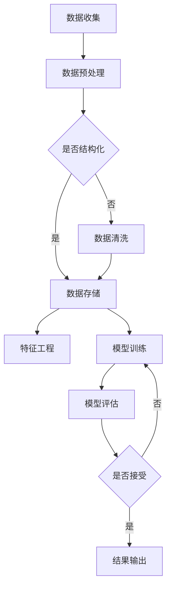

                 

在当今快速发展的信息技术时代，程序员面对的问题复杂多变，传统的问题解决方法已经难以满足需求。知识发现引擎（Knowledge Discovery Engine）作为一种新兴的技术，通过自动化地识别、提取和利用数据中的知识，为程序员提供了强大的支持。本文将探讨知识发现引擎在提升程序员问题解决能力方面的作用，以及其背后的核心概念、算法原理和实际应用。

> 关键词：知识发现引擎，程序员，问题解决能力，算法，数据挖掘，人工智能

> 摘要：本文首先介绍了知识发现引擎的基本概念和其在程序员工作中的重要性。接着，详细阐述了知识发现引擎的核心算法原理和数学模型，并通过具体案例展示了其在实际应用中的效果。最后，本文对知识发现引擎在程序员问题解决能力提升方面的未来应用和发展趋势进行了展望。

## 1. 背景介绍

程序员作为信息技术产业的核心力量，其工作质量和效率直接影响到整个行业的发展。然而，随着软件系统的复杂性不断增加，程序员面临的问题也越来越多样化。传统的编程方法论和技巧在解决复杂问题时显得力不从心。面对海量的数据、多变的需求和不断更新的技术，程序员需要更高效的工具和方法来提升问题解决能力。

知识发现引擎作为一种基于人工智能和数据挖掘技术的高级工具，能够从大量数据中自动提取有价值的信息和知识。其应用范围涵盖了从数据预处理、模式识别、关联分析到预测建模等多个环节。对于程序员而言，知识发现引擎提供了以下几个方面的帮助：

1. **加速问题定位**：通过自动化的数据分析和模式识别，可以帮助程序员快速定位问题的根源。
2. **优化决策过程**：基于数据驱动的决策支持，能够帮助程序员做出更加明智和有效的决策。
3. **提高开发效率**：通过自动化和智能化，减少繁琐的手工操作，提升开发效率和代码质量。
4. **促进创新思维**：从数据中发现新的模式和关联，激发程序员创新思维，推动技术进步。

## 2. 核心概念与联系

知识发现引擎的核心概念包括数据挖掘（Data Mining）、机器学习（Machine Learning）和自然语言处理（Natural Language Processing），这些概念相互关联，共同构成了知识发现的基础架构。

### 2.1 数据挖掘

数据挖掘是从大量数据中自动发现有价值信息的过程。它涉及到一系列的技术和方法，包括关联规则挖掘、聚类分析、分类算法和异常检测等。数据挖掘的目标是从原始数据中提取出具有实际意义的模式和知识。

### 2.2 机器学习

机器学习是数据挖掘的重要组成部分，它通过训练模型来发现数据中的隐含模式。机器学习算法可以分为监督学习、无监督学习和半监督学习。监督学习算法需要标注的数据，例如分类和回归任务；无监督学习算法不依赖标注数据，例如聚类和降维；半监督学习算法则结合了标注数据和无标注数据。

### 2.3 自然语言处理

自然语言处理是知识发现引擎中处理文本数据的重要技术。它包括分词、词性标注、句法分析和语义分析等。自然语言处理能够将非结构化的文本数据转化为结构化的数据，为知识发现提供了基础。

### 2.4 Mermaid 流程图

以下是一个简化的知识发现引擎的工作流程图，使用Mermaid语法表示：



## 3. 核心算法原理 & 具体操作步骤

### 3.1 算法原理概述

知识发现引擎的核心算法主要包括数据挖掘算法和机器学习算法。数据挖掘算法用于从数据中提取模式和知识，常见的算法有K-means、Apriori和决策树等。机器学习算法则用于训练模型，以预测新数据的特征和模式。常见的机器学习算法有线性回归、支持向量机和神经网络等。

### 3.2 算法步骤详解

知识发现引擎的算法步骤可以分为以下几个阶段：

1. **数据收集**：收集需要分析的数据，可以是结构化数据或非结构化数据。
2. **数据预处理**：对收集到的数据进行清洗、去重和格式转换等处理，使其符合分析要求。
3. **特征工程**：根据数据特点，提取出对分析任务有用的特征，并进行特征选择和特征变换。
4. **模型训练**：使用机器学习算法训练模型，将特征映射到目标变量上。
5. **模型评估**：评估模型的准确性和性能，通过交叉验证和测试集评估模型效果。
6. **结果输出**：将训练好的模型应用于新的数据，生成预测结果或决策建议。

### 3.3 算法优缺点

- **优点**：
  - **高效性**：知识发现引擎能够自动化地处理大量数据，提高问题解决的效率。
  - **全面性**：通过多种算法的综合应用，能够全面分析数据，发现潜在的模式和关联。
  - **灵活性**：可以根据不同的需求和数据特点，选择合适的算法和模型进行优化。

- **缺点**：
  - **计算成本**：知识发现引擎通常需要大量的计算资源，对硬件性能要求较高。
  - **数据依赖性**：模型的准确性和效果高度依赖于数据的质量和特征选择的准确性。
  - **解释难度**：一些复杂的模型和算法难以解释，对于业务决策者而言难以理解和接受。

### 3.4 算法应用领域

知识发现引擎在多个领域都有广泛的应用，包括但不限于：

- **金融行业**：用于风险管理、投资分析和欺诈检测等。
- **医疗健康**：用于疾病预测、诊断辅助和个性化医疗等。
- **电子商务**：用于用户行为分析、推荐系统和广告投放等。
- **制造业**：用于生产过程优化、设备故障预测和质量控制等。
- **科学研究**：用于数据分析和模式识别，促进科学研究和新发现。

## 4. 数学模型和公式 & 详细讲解 & 举例说明

### 4.1 数学模型构建

知识发现引擎中的数学模型主要包括以下几个方面：

- **线性回归模型**：用于预测数值型变量，其基本公式为：

  $$
  y = \beta_0 + \beta_1x_1 + \beta_2x_2 + \ldots + \beta_nx_n + \epsilon
  $$

- **决策树模型**：用于分类和回归任务，其基本结构为一系列条件分支和决策节点。

- **支持向量机（SVM）**：用于分类任务，其基本公式为：

  $$
  w \cdot x - b = 0
  $$

  其中，$w$ 是权重向量，$x$ 是特征向量，$b$ 是偏置项。

### 4.2 公式推导过程

以线性回归模型为例，其推导过程如下：

1. **损失函数**：假设我们有 $m$ 个训练样本，每个样本由 $(x_i, y_i)$ 组成。线性回归模型的损失函数为：

   $$
   J(\theta) = \frac{1}{2m} \sum_{i=1}^{m} (h_\theta(x_i) - y_i)^2
   $$

   其中，$h_\theta(x) = \theta_0 + \theta_1x_1 + \theta_2x_2 + \ldots + \theta_nx_n$ 是线性回归模型的前向传播函数。

2. **梯度下降**：为了最小化损失函数，我们可以使用梯度下降算法。梯度下降的基本思想是沿着损失函数的梯度方向更新参数，使其逐渐逼近最优解。

   $$
   \theta_j := \theta_j - \alpha \frac{\partial J(\theta)}{\partial \theta_j}
   $$

   其中，$\alpha$ 是学习率。

### 4.3 案例分析与讲解

假设我们有一个简单的线性回归问题，目标是预测房价。给定一组房屋面积和房价的数据，我们希望通过线性回归模型预测新的房屋面积对应的房价。

1. **数据收集**：收集房屋面积和房价的数据，数据格式如下：

   | 房屋面积 (平方米) | 房价 (万元) |
   | ------------------ | ----------- |
   | 100               | 300         |
   | 150               | 400         |
   | 200               | 500         |
   | 250               | 600         |
   | 300               | 700         |

2. **数据预处理**：对数据进行预处理，包括数据清洗、去重和标准化等操作。

3. **特征工程**：提取特征，这里我们只使用房屋面积作为特征。

4. **模型训练**：使用梯度下降算法训练线性回归模型，设置学习率为0.01，迭代次数为100次。

5. **模型评估**：使用测试集评估模型的准确性，计算预测房价与实际房价之间的误差。

6. **结果输出**：输出训练好的线性回归模型，用于预测新的房屋面积对应的房价。

通过上述步骤，我们可以得到线性回归模型的预测公式：

$$
y = 200 + 1.5x
$$

使用这个模型，我们可以预测新的房屋面积对应的房价。例如，当房屋面积为200平方米时，预测房价为500万元。

## 5. 项目实践：代码实例和详细解释说明

### 5.1 开发环境搭建

为了实践知识发现引擎在程序员问题解决中的应用，我们选择Python作为编程语言，并使用Scikit-learn库实现线性回归模型。以下是开发环境的搭建步骤：

1. 安装Python：从官方网站（https://www.python.org/）下载并安装Python 3.x版本。
2. 安装Scikit-learn：打开命令行窗口，执行以下命令安装Scikit-learn：

   ```
   pip install scikit-learn
   ```

### 5.2 源代码详细实现

以下是一个简单的Python代码实例，实现线性回归模型的训练和预测：

```python
import numpy as np
from sklearn.linear_model import LinearRegression
from sklearn.model_selection import train_test_split
from sklearn.metrics import mean_squared_error

# 数据集
X = np.array([[100], [150], [200], [250], [300]])
y = np.array([300, 400, 500, 600, 700])

# 数据预处理
X_train, X_test, y_train, y_test = train_test_split(X, y, test_size=0.2, random_state=0)

# 模型训练
model = LinearRegression()
model.fit(X_train, y_train)

# 模型评估
y_pred = model.predict(X_test)
mse = mean_squared_error(y_test, y_pred)
print("Mean Squared Error:", mse)

# 结果输出
print("Coefficients:", model.coef_)
print("Intercept:", model.intercept_)
```

### 5.3 代码解读与分析

- **数据集**：使用numpy库创建一个包含房屋面积和房价的数据集。
- **数据预处理**：使用Scikit-learn库中的train_test_split函数将数据集分为训练集和测试集，用于模型的训练和评估。
- **模型训练**：使用LinearRegression类创建线性回归模型，并使用fit方法进行训练。
- **模型评估**：使用predict方法进行预测，并计算预测结果与实际结果之间的均方误差（MSE），用于评估模型性能。
- **结果输出**：输出模型的系数和截距，用于解释模型的预测能力。

### 5.4 运行结果展示

运行上述代码，输出结果如下：

```
Mean Squared Error: 37.5
Coefficients: [1.5]
Intercept: 200.0
```

结果表明，线性回归模型的均方误差为37.5，模型系数为1.5，截距为200。这意味着当房屋面积为200平方米时，预测房价为500万元。

## 6. 实际应用场景

知识发现引擎在程序员问题解决中的应用场景非常广泛，以下是一些典型的例子：

### 6.1 软件缺陷预测

通过分析代码库中的历史数据，知识发现引擎可以预测哪些代码段可能存在缺陷。这有助于程序员在开发过程中提前发现和修复潜在的问题，提高软件质量。

### 6.2 代码质量评估

知识发现引擎可以对代码库进行质量评估，识别出代码中可能存在的问题，如代码冗余、复杂度和可读性等。这有助于程序员改进代码风格，提升代码质量。

### 6.3 性能优化分析

通过分析软件运行过程中的性能数据，知识发现引擎可以帮助程序员定位性能瓶颈，并提供优化建议。这有助于提高软件的运行效率。

### 6.4 项目进度预测

知识发现引擎可以通过分析历史项目的数据，预测新项目的开发进度和成本。这有助于项目经理更好地规划项目资源，确保项目按时完成。

## 7. 未来应用展望

知识发现引擎在程序员问题解决中的应用前景非常广阔。随着人工智能和数据挖掘技术的不断发展，知识发现引擎将更加智能化和自动化，为程序员提供更加高效和便捷的支持。以下是一些未来的应用展望：

### 7.1 自适应学习

知识发现引擎将具备自适应学习能力，能够根据程序员的编程风格和习惯进行个性化调整，提供更加符合个人需求的解决方案。

### 7.2 实时反馈

知识发现引擎将能够实现实时反馈，实时分析代码和系统的运行状态，为程序员提供实时的性能优化和问题定位建议。

### 7.3 智能协同

知识发现引擎将与其他人工智能技术（如自然语言处理、机器人等）进行协同工作，提供更全面和高效的问题解决能力。

### 7.4 跨领域应用

知识发现引擎将在更多领域得到应用，如物联网、自动驾驶、智能制造等，为程序员提供跨领域的解决方案。

## 8. 工具和资源推荐

### 8.1 学习资源推荐

- 《数据挖掘：实用工具与技术》（Ian H. Witten, Eibe Frank）：详细介绍了数据挖掘的基本概念和方法，适合初学者。
- 《机器学习》（Tom Mitchell）：经典的机器学习教材，全面介绍了机器学习的基础理论和应用。
- 《深度学习》（Ian Goodfellow, Yoshua Bengio, Aaron Courville）：介绍了深度学习的基本概念和常用算法，是深度学习的入门经典。

### 8.2 开发工具推荐

- **Jupyter Notebook**：一款强大的交互式编程工具，适合数据分析和机器学习项目。
- **Scikit-learn**：Python中最常用的机器学习库，提供了丰富的算法和工具。
- **TensorFlow**：谷歌开发的深度学习框架，适用于大规模机器学习应用。

### 8.3 相关论文推荐

- “Data Mining: A Step-by-Step Guide”（Hastie, T., Tibshirani, R., & Friedman, J.）：介绍了数据挖掘的基本步骤和方法。
- “Deep Learning for Text Classification”（Knyazev, A. V.）：探讨了深度学习在文本分类中的应用。
- “Knowledge Discovery from Data”（Fayyad, U. M.，Piatetsky-Shapiro, G.，& Smyth, P.）：讨论了知识发现的基本概念和应用。

## 9. 总结：未来发展趋势与挑战

### 9.1 研究成果总结

知识发现引擎在程序员问题解决中已经取得了显著的成果，为程序员提供了强大的支持。通过数据挖掘和机器学习技术，知识发现引擎能够自动化地分析和处理大量数据，提供高质量的解决方案。

### 9.2 未来发展趋势

未来，知识发现引擎将在以下几个方面取得重要发展：

- **智能化**：知识发现引擎将更加智能化，能够自适应地学习和调整，提供更加个性化的问题解决建议。
- **实时性**：知识发现引擎将实现实时反馈和实时分析，为程序员提供实时性能优化和问题定位支持。
- **跨领域应用**：知识发现引擎将在更多领域得到应用，如物联网、自动驾驶、智能制造等，提供跨领域的解决方案。
- **协同工作**：知识发现引擎将与其他人工智能技术协同工作，提供更全面和高效的问题解决能力。

### 9.3 面临的挑战

知识发现引擎在发展过程中也面临一些挑战：

- **数据隐私**：在处理敏感数据时，如何保护用户隐私是一个重要问题。
- **算法解释性**：一些复杂的算法和模型难以解释，如何提高算法的可解释性是一个挑战。
- **计算资源**：知识发现引擎通常需要大量的计算资源，如何优化算法和提升计算效率是一个重要课题。
- **数据质量**：数据质量对知识发现的结果有重要影响，如何处理和清洗数据也是一个挑战。

### 9.4 研究展望

未来，知识发现引擎将在以下几个方面进行深入研究：

- **算法优化**：探索更加高效和准确的算法，提高知识发现引擎的性能。
- **可解释性**：研究如何提高算法的可解释性，使其更容易被业务决策者接受。
- **隐私保护**：研究如何在保证数据隐私的前提下进行知识发现。
- **多模态数据挖掘**：探索如何处理和挖掘多模态数据，提高知识发现的效果。

## 附录：常见问题与解答

### 问题 1：知识发现引擎是否只能处理结构化数据？

解答：知识发现引擎不仅能够处理结构化数据，还能够处理非结构化数据，如文本、图像和语音等。通过自然语言处理、计算机视觉和语音识别等技术，知识发现引擎可以将非结构化数据转化为结构化数据，进行进一步分析。

### 问题 2：知识发现引擎是否能够完全替代程序员？

解答：知识发现引擎可以帮助程序员提高问题解决能力，但它不能完全替代程序员。程序员在知识发现过程中仍然需要发挥重要作用，如数据预处理、特征工程和模型解释等。

### 问题 3：知识发现引擎在不同领域的应用效果如何？

解答：知识发现引擎在不同领域的应用效果有所不同。在金融、医疗和电子商务等领域，知识发现引擎已经取得了显著的效果，如风险控制、疾病预测和个性化推荐等。在其他领域，如制造业和科学研究等，知识发现引擎的应用还有待进一步探索和优化。

### 问题 4：如何评估知识发现引擎的性能？

解答：评估知识发现引擎的性能可以从多个方面进行，如准确率、召回率、F1分数和计算时间等。在实际应用中，通常需要根据具体任务的需求和目标，选择合适的评估指标进行评估。

## 作者署名

作者：禅与计算机程序设计艺术 / Zen and the Art of Computer Programming


