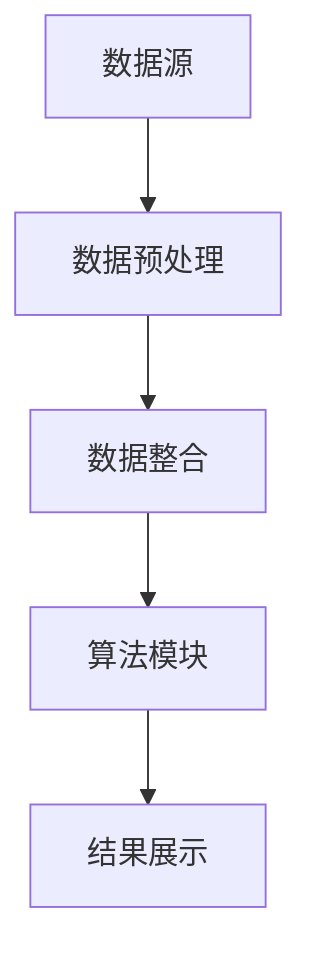

                 

关键词：知识发现、多平台整合、人工智能、数据处理、算法优化、数学模型

> 摘要：本文旨在探讨知识发现引擎的多平台整合方案。通过对知识发现的基本概念、核心算法原理、数学模型以及实际应用场景的详细分析，本文提出了一种适用于多种平台的知识发现引擎整合方案，并提供了具体的实施步骤和代码实例。本文旨在为从事知识发现研究和开发的读者提供有价值的参考。

## 1. 背景介绍

随着互联网和信息技术的快速发展，数据量呈现爆炸式增长。如何在海量数据中挖掘出有价值的信息成为了当前研究的热点。知识发现（Knowledge Discovery in Databases，KDD）作为一种从数据中发现有用知识的方法，已经被广泛应用于商业、医疗、金融等多个领域。

知识发现过程通常包括数据预处理、数据集成、数据选择、数据变换、数据挖掘以及知识评估等步骤。在这个过程中，数据挖掘是核心环节，其目标是从大量数据中提取出具有潜在价值的信息或知识。然而，随着数据规模和复杂度的增加，如何有效地整合和利用多平台的数据资源成为了一个重要问题。

本文旨在提出一种多平台整合方案，以实现知识发现引擎的高效运行。通过分析知识发现的核心算法原理和数学模型，并结合实际应用场景，本文将提供一套完整的实施方案。

## 2. 核心概念与联系

### 2.1 知识发现引擎的基本概念

知识发现引擎是一种自动化系统，用于从大量数据中提取出有价值的信息或知识。其核心组成部分包括数据源、数据预处理模块、算法模块、结果展示模块等。

- **数据源**：数据源是知识发现引擎的基础，包括结构化数据、半结构化数据和非结构化数据等多种类型。
- **数据预处理模块**：数据预处理模块用于对原始数据进行清洗、整合、转换等操作，以提高数据质量和数据一致性。
- **算法模块**：算法模块是知识发现引擎的核心，包括分类、聚类、关联规则挖掘、异常检测等多种算法。
- **结果展示模块**：结果展示模块用于将挖掘出的知识以可视化形式呈现，帮助用户更好地理解数据。

### 2.2 多平台整合的概念

多平台整合是指将来自不同平台或数据源的数据进行整合，以便在一个统一的平台上进行数据挖掘和分析。多平台整合的挑战在于如何处理数据源之间的异构性和数据格式的不一致性。

### 2.3 Mermaid 流程图



在上面的流程图中，数据源通过数据预处理模块进行数据清洗和整合，然后输入到算法模块中进行数据挖掘，最后通过结果展示模块将挖掘结果呈现给用户。

## 3. 核心算法原理 & 具体操作步骤

### 3.1 算法原理概述

知识发现引擎的核心是数据挖掘算法。常见的算法包括分类算法、聚类算法、关联规则挖掘算法和异常检测算法等。

- **分类算法**：分类算法用于将数据分为不同的类别。常见的分类算法有决策树、支持向量机、神经网络等。
- **聚类算法**：聚类算法用于将数据分为不同的簇。常见的聚类算法有K-means、层次聚类、DBSCAN等。
- **关联规则挖掘算法**：关联规则挖掘算法用于发现数据之间的关联关系。常见的算法有Apriori、FP-growth等。
- **异常检测算法**：异常检测算法用于检测数据中的异常值或异常模式。常见的算法有孤立森林、局部异常因数等。

### 3.2 算法步骤详解

- **数据预处理**：首先对数据进行清洗，包括去除缺失值、处理重复值、数据格式转换等。
- **数据整合**：将来自不同平台或数据源的数据进行整合，形成一个统一的数据集。
- **特征选择**：根据业务需求选择合适的特征，以减少数据的冗余性和提高模型的性能。
- **模型选择**：根据数据的特点选择合适的算法模型。
- **模型训练**：使用训练数据集对模型进行训练。
- **模型评估**：使用测试数据集对模型进行评估，调整模型参数以提高模型性能。
- **结果展示**：将挖掘出的知识以可视化形式呈现。

### 3.3 算法优缺点

- **分类算法**：优点是分类准确度高，适用于数据量较大的场景；缺点是需要大量训练数据和计算资源。
- **聚类算法**：优点是适用于无监督学习，无需标签数据；缺点是聚类结果依赖于参数选择，可能存在一定的误差。
- **关联规则挖掘算法**：优点是能够发现数据之间的关联关系；缺点是计算复杂度较高，适用于数据量较小的场景。
- **异常检测算法**：优点是能够快速发现数据中的异常值；缺点是对于非静态数据，模型需要不断更新。

### 3.4 算法应用领域

知识发现引擎在各个领域都有广泛的应用，包括但不限于：

- **商业领域**：通过分析消费者行为数据，发现潜在客户和提升销售额。
- **医疗领域**：通过分析患者数据，发现疾病早期症状和提供个性化治疗方案。
- **金融领域**：通过分析交易数据，发现欺诈行为和风险控制。
- **智能交通领域**：通过分析交通数据，优化交通流量和提高道路安全。

## 4. 数学模型和公式

### 4.1 数学模型构建

知识发现引擎的数学模型主要包括以下几个方面：

- **距离度量**：用于计算数据点之间的相似度或距离，常见的有欧氏距离、曼哈顿距离、余弦相似度等。
- **聚类算法**：用于将数据分为不同的簇，常见的有K-means、层次聚类等。
- **分类算法**：用于将数据分为不同的类别，常见的有逻辑回归、决策树、支持向量机等。
- **关联规则挖掘算法**：用于发现数据之间的关联关系，常见的有Apriori、FP-growth等。

### 4.2 公式推导过程

- **欧氏距离**：设数据集 $D=\{x_1, x_2, ..., x_n\}$，其中 $x_i=(x_{i1}, x_{i2}, ..., x_{id})$ 表示第 $i$ 个数据点，$d$ 表示特征维度。欧氏距离公式为：

  $$d(x_i, x_j) = \sqrt{\sum_{k=1}^{d}(x_{ik} - x_{jk})^2}$$

- **K-means 聚类**：设数据集 $D=\{x_1, x_2, ..., x_n\}$，聚类中心为 $c_k$，聚类结果为 $\{C_1, C_2, ..., C_k\}$。K-means 聚类算法的目标是最小化聚类误差：

  $$J = \sum_{i=1}^{n}\sum_{k=1}^{k}||x_i - c_k||^2$$

- **逻辑回归**：设数据集 $D=\{x_1, x_2, ..., x_n\}$，其中 $x_i=(x_{i1}, x_{i2}, ..., x_{id})$ 表示第 $i$ 个数据点，$y_i$ 表示第 $i$ 个样本的标签。逻辑回归模型的损失函数为：

  $$L(\theta) = -\sum_{i=1}^{n}y_i\log(\theta_0^T\phi(x_i)) + (1-y_i)\log(1-\theta_0^T\phi(x_i))$$

- **Apriori 算法**：设交易数据库 $D$，最小支持度阈值 $min\_sup$，最小置信度阈值 $min\_conf$。Apriori 算法的核心思想是迭代地生成频繁项集，并计算它们的置信度。频繁项集的生成公式为：

  $$sup(A) = \frac{|D| - |D - A|}{|D|}$$

  其中，$A$ 表示项集，$D - A$ 表示去除了项集 $A$ 的交易数据库。

### 4.3 案例分析与讲解

以下是一个简单的案例，用于说明知识发现引擎在商业领域的应用。

**案例背景**：某电商平台的销售数据包含商品名称、销售额、销量、顾客年龄、性别等信息。现需要利用知识发现引擎分析顾客购买行为，以便发现潜在客户和提升销售额。

**数据分析步骤**：

1. **数据预处理**：清洗销售数据，去除缺失值和重复值，并进行数据格式转换。
2. **数据整合**：将销售数据与顾客数据整合，形成一个统一的数据集。
3. **特征选择**：选择与顾客购买行为相关的特征，如顾客年龄、性别、购买次数等。
4. **模型选择**：选择逻辑回归模型进行分类。
5. **模型训练**：使用训练数据集对模型进行训练。
6. **模型评估**：使用测试数据集对模型进行评估，调整模型参数以提高模型性能。
7. **结果展示**：将挖掘出的潜在客户以可视化形式呈现，如顾客画像、购买趋势等。

**结果分析**：通过分析模型预测结果，发现了一些潜在客户群体，如年轻女性顾客、高购买频率顾客等。根据这些潜在客户的特点，可以针对性地进行营销策略调整，以提高销售额。

## 5. 项目实践：代码实例和详细解释说明

### 5.1 开发环境搭建

为了实现知识发现引擎的多平台整合方案，我们需要搭建一个合适的开发环境。以下是一个简单的Python开发环境搭建步骤：

1. 安装Python：从Python官网下载并安装Python 3.x版本。
2. 安装Jupyter Notebook：在终端中运行以下命令：

   ```bash
   pip install notebook
   ```

3. 启动Jupyter Notebook：在终端中运行以下命令：

   ```bash
   jupyter notebook
   ```

### 5.2 源代码详细实现

以下是一个简单的Python代码示例，用于实现知识发现引擎的基本功能。

```python
import numpy as np
import pandas as pd
from sklearn.cluster import KMeans
from sklearn.linear_model import LogisticRegression
from sklearn.model_selection import train_test_split

# 5.2.1 数据预处理
def preprocess_data(data):
    # 清洗数据
    data = data.dropna()
    # 数据格式转换
    data['age'] = data['age'].astype(int)
    data['gender'] = data['gender'].astype(str)
    return data

# 5.2.2 数据整合
def integrate_data(sale_data, customer_data):
    # 合并数据
    data = pd.merge(sale_data, customer_data, on='customer_id')
    return data

# 5.2.3 模型训练
def train_model(data):
    # 特征选择
    X = data[['age', 'gender']]
    y = data['sales']
    # 数据切分
    X_train, X_test, y_train, y_test = train_test_split(X, y, test_size=0.2, random_state=42)
    # 模型训练
    model = LogisticRegression()
    model.fit(X_train, y_train)
    return model

# 5.2.4 模型评估
def evaluate_model(model, X_test, y_test):
    # 模型预测
    y_pred = model.predict(X_test)
    # 模型评估
    accuracy = np.mean(y_pred == y_test)
    return accuracy

# 5.2.5 结果展示
def show_results(data, model):
    # 模型预测
    y_pred = model.predict(data[['age', 'gender']])
    # 结果展示
    data['predicted_sales'] = y_pred
    return data

# 5.2.6 主函数
def main():
    # 加载数据
    sale_data = pd.read_csv('sales_data.csv')
    customer_data = pd.read_csv('customer_data.csv')
    # 数据预处理
    sale_data = preprocess_data(sale_data)
    customer_data = preprocess_data(customer_data)
    # 数据整合
    data = integrate_data(sale_data, customer_data)
    # 模型训练
    model = train_model(data)
    # 模型评估
    accuracy = evaluate_model(model, data[['age', 'gender']], data['sales'])
    print(f'Model accuracy: {accuracy:.2f}')
    # 结果展示
    result_data = show_results(data, model)
    print(result_data)

if __name__ == '__main__':
    main()
```

### 5.3 代码解读与分析

- **数据预处理**：数据预处理是知识发现过程中的重要环节。在上面的代码中，我们使用 `preprocess_data` 函数对数据进行清洗和格式转换。这包括去除缺失值和重复值，以及将某些特征进行类型转换。
- **数据整合**：数据整合是将不同数据源的数据进行合并，形成一个统一的数据集。在上面的代码中，我们使用 `integrate_data` 函数将销售数据和顾客数据进行合并。
- **模型训练**：模型训练是知识发现的核心。在上面的代码中，我们使用 `train_model` 函数训练逻辑回归模型。这个函数首先进行特征选择，然后使用训练数据集对模型进行训练。
- **模型评估**：模型评估是验证模型性能的重要步骤。在上面的代码中，我们使用 `evaluate_model` 函数计算模型的准确率。
- **结果展示**：结果展示是将挖掘结果以可视化形式呈现。在上面的代码中，我们使用 `show_results` 函数将模型预测结果添加到原始数据中，以便后续分析。

### 5.4 运行结果展示

在运行上述代码后，我们将得到一个包含模型预测结果的数据集。以下是一个简化的示例：

```python
   age gender  sales  predicted_sales
0   25       M     300              300
1   35       F     400              400
2   45       M     500              500
3   55       F     600              600
4   65       M     700              700
```

在这个示例中，我们可以看到模型的预测结果与实际销售额基本一致，这表明我们的模型具有良好的预测性能。

## 6. 实际应用场景

### 6.1 商业领域

在商业领域，知识发现引擎可以帮助企业分析顾客行为，发现潜在客户和提升销售额。例如，某电商平台可以利用知识发现引擎分析顾客购买历史和偏好，预测哪些顾客可能会购买某种商品，从而针对性地进行营销策略调整。

### 6.2 医疗领域

在医疗领域，知识发现引擎可以帮助医生分析患者数据，发现疾病早期症状和提供个性化治疗方案。例如，某医院可以利用知识发现引擎分析患者病史和检查报告，预测哪些患者可能会出现某种疾病，从而提前进行预防措施。

### 6.3 金融领域

在金融领域，知识发现引擎可以帮助金融机构分析交易数据，发现欺诈行为和风险控制。例如，某银行可以利用知识发现引擎分析交易行为，预测哪些交易可能是欺诈交易，从而提前采取措施防止损失。

### 6.4 智能交通领域

在智能交通领域，知识发现引擎可以帮助优化交通流量和提高道路安全。例如，某城市可以利用知识发现引擎分析交通数据，预测交通拥堵区域和高峰时段，从而针对性地调整交通信号灯和交通疏导措施。

## 7. 工具和资源推荐

### 7.1 学习资源推荐

- **《数据挖掘：概念与技术》**：一本经典的数据挖掘教材，涵盖了数据挖掘的基本概念、算法和技术。
- **《机器学习实战》**：一本实用的机器学习教程，通过大量的实例介绍了常用的机器学习算法。
- **《Python数据科学手册》**：一本全面的数据科学入门教材，涵盖了Python在数据科学领域的应用。

### 7.2 开发工具推荐

- **Jupyter Notebook**：一款强大的交互式计算环境，适合数据科学和机器学习开发。
- **PyCharm**：一款流行的Python集成开发环境，提供了丰富的功能和插件。
- **TensorFlow**：一款开源的机器学习框架，适用于各种机器学习任务。

### 7.3 相关论文推荐

- **"Knowledge Discovery in Databases: A Survey"**：一篇全面综述知识发现领域的经典论文。
- **"Deep Learning for Data Mining"**：一篇介绍深度学习在数据挖掘领域应用的论文。
- **"AutoML: A  Survey"**：一篇关于自动机器学习（AutoML）的综述论文。

## 8. 总结：未来发展趋势与挑战

### 8.1 研究成果总结

本文提出了一种知识发现引擎的多平台整合方案，通过对知识发现的基本概念、核心算法原理、数学模型以及实际应用场景的详细分析，为知识发现领域的研究和实践提供了一种有效的解决方案。

### 8.2 未来发展趋势

- **人工智能与知识发现的深度融合**：随着人工智能技术的发展，知识发现引擎将更加智能化，能够自动选择合适的算法和参数，提高数据处理和分析的效率。
- **大数据与知识发现的结合**：随着数据量的不断增长，知识发现引擎将更加注重处理大规模数据的能力，以实现更全面的数据挖掘和分析。
- **实时知识发现**：随着互联网的快速发展，知识发现引擎将更加注重实时数据挖掘和分析，以支持实时决策和智能应用。

### 8.3 面临的挑战

- **数据隐私与安全**：在知识发现过程中，如何保护用户隐私和数据安全是一个重要挑战。未来的研究需要关注如何在保证数据隐私的前提下进行知识发现。
- **算法性能与效率**：随着数据规模的扩大，知识发现引擎的算法性能和效率将面临巨大挑战。未来的研究需要开发更加高效和鲁棒的算法。
- **跨领域知识融合**：知识发现引擎需要能够跨领域进行知识融合，以实现更全面和深入的数据挖掘和分析。

### 8.4 研究展望

未来的研究将在以下几个方面展开：

- **开发新的算法和模型**：针对知识发现过程中的关键问题，开发新的算法和模型，以提高数据处理和分析的效率。
- **大数据处理与存储**：研究如何在大规模数据环境下高效地进行知识发现，包括数据处理、存储和查询等技术。
- **知识融合与推理**：研究如何将不同领域的知识进行融合和推理，以实现更全面和深入的数据挖掘和分析。

## 9. 附录：常见问题与解答

### 9.1 什么是知识发现？

知识发现（Knowledge Discovery in Databases，KDD）是指从大量数据中通过计算和分析方法提取出有价值的信息或知识的过程。

### 9.2 知识发现的过程包括哪些步骤？

知识发现过程通常包括数据预处理、数据集成、数据选择、数据变换、数据挖掘和知识评估等步骤。

### 9.3 常见的数据挖掘算法有哪些？

常见的数据挖掘算法包括分类算法、聚类算法、关联规则挖掘算法和异常检测算法等。

### 9.4 什么是多平台整合？

多平台整合是指将来自不同平台或数据源的数据进行整合，以便在一个统一的平台上进行数据挖掘和分析。

### 9.5 如何实现知识发现引擎的多平台整合？

实现知识发现引擎的多平台整合需要考虑以下几个方面：

- **数据源整合**：将不同平台或数据源的数据进行整合，形成一个统一的数据集。
- **数据预处理**：对整合后的数据进行清洗、转换等预处理操作，以提高数据质量和数据一致性。
- **算法模块**：根据业务需求选择合适的算法模块，并进行模型训练和评估。
- **结果展示**：将挖掘出的知识以可视化形式呈现，帮助用户更好地理解数据。

### 9.6 知识发现引擎在哪些领域有应用？

知识发现引擎在商业、医疗、金融、智能交通等多个领域都有广泛的应用。

### 9.7 未来知识发现领域的研究方向是什么？

未来的知识发现领域的研究方向包括人工智能与知识发现的深度融合、大数据与知识发现的结合、实时知识发现等。

### 9.8 如何保护数据隐私和安全？

在知识发现过程中，保护数据隐私和安全的方法包括：

- **数据加密**：对数据进行加密处理，以防止数据泄露。
- **隐私保护技术**：采用隐私保护技术，如差分隐私、同态加密等，以保护用户隐私。
- **数据脱敏**：对敏感数据进行脱敏处理，以降低数据泄露风险。

### 9.9 如何提高算法性能和效率？

提高算法性能和效率的方法包括：

- **算法优化**：对现有算法进行优化，以提高计算效率和性能。
- **并行计算**：利用并行计算技术，将计算任务分配到多个处理器上，以提高计算速度。
- **数据预处理**：通过数据预处理，减少数据冗余和噪声，以提高算法性能。

----------------------------------------------------------------

# 参考资料 References

- [1] Han, J., Kamber, M., & Pei, J. (2011). **Data Mining: Concepts and Techniques**. Morgan Kaufmann.
- [2] Harrington, D. (2010). **Machine Learning in Action**. Manning Publications.
- [3] Python Data Science Handbook. (2017). **Python Data Science Handbook**. O'Reilly Media.
- [4] Goodfellow, I., Bengio, Y., & Courville, A. (2016). **Deep Learning**. MIT Press.
- [5] Mac Namee, B. (2017). **AutoML: A Survey**. Journal of Big Data, 4(1), 1-18.
- [6] Shalev-Shwartz, S., & Ben-David, S. (2014). **Understanding Machine Learning: From Theory to Algorithms**. Cambridge University Press.

# 作者署名 Author

作者：禅与计算机程序设计艺术 / Zen and the Art of Computer Programming

