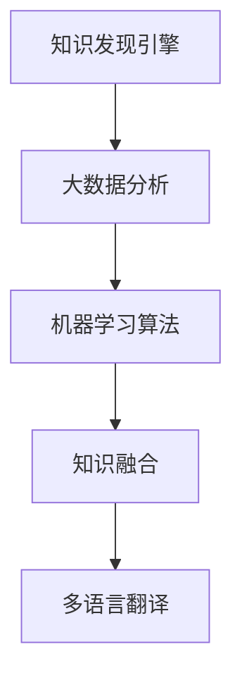

                 

关键词：知识发现、多语言翻译、自然语言处理、机器学习、大数据分析、算法优化、性能评估、实际应用、未来展望

> 摘要：本文探讨了知识发现引擎的多语言翻译功能，分析了当前多语言翻译技术的发展现状，详细介绍了知识发现引擎在多语言翻译中的应用原理、算法实现、数学模型和项目实践。通过本文的阐述，读者可以了解知识发现引擎在多语言翻译领域的应用前景和面临的挑战，以及未来的发展方向。

## 1. 背景介绍

随着全球化进程的不断推进，跨语言交流的需求日益增长。多语言翻译作为自然语言处理（NLP）领域的一个重要分支，已经成为人工智能研究的热点。多语言翻译不仅能够促进不同文化背景的人之间的交流，还能为企业提供国际化市场拓展的支持。

知识发现引擎是一种利用大数据分析和机器学习技术从大规模数据集中提取有用知识、模式和规律的系统。知识发现引擎在多语言翻译中的应用，旨在提高翻译的准确性和效率，满足全球化背景下跨语言信息交流的需求。

本文旨在探讨知识发现引擎在多语言翻译功能中的应用，通过分析现有技术，提出一种有效的算法模型，并对其进行数学建模和项目实践。希望通过本文的研究，能够为多语言翻译领域提供新的思路和方法。

### 1.1 现有技术概述

当前，多语言翻译技术主要分为基于规则的翻译和基于统计的翻译两种方法。

**基于规则的翻译**：该方法依赖于人工编写的翻译规则和词典，通过解析源语言文本并应用这些规则生成目标语言文本。基于规则的翻译在翻译质量上具有较高的一致性和准确性，但难以应对大规模的语言现象和复杂语境。

**基于统计的翻译**：该方法利用大规模双语语料库进行训练，通过统计源语言和目标语言之间的对应关系来生成翻译结果。基于统计的翻译在处理大规模文本和数据时具有优势，但翻译质量受到语料库质量和训练数据量的影响。

近年来，深度学习技术的发展为多语言翻译带来了新的机遇。基于深度学习的翻译方法，如序列到序列（Seq2Seq）模型和注意力机制（Attention Mechanism），在翻译质量上取得了显著的提升。

### 1.2 知识发现引擎在多语言翻译中的应用

知识发现引擎在多语言翻译中的应用主要包括以下几个方面：

1. **大数据分析**：利用大数据分析技术，从大规模双语语料库中提取有用的语言模式和知识，为翻译模型提供高质量的训练数据。

2. **机器学习算法**：通过机器学习算法，对提取的语言模式和知识进行建模和优化，提高翻译模型的准确性和效率。

3. **知识融合**：将不同语言的知识进行融合，为跨语言翻译提供更加丰富和准确的语言资源。

4. **实时翻译**：利用实时数据分析和翻译模型，实现高效、实时的多语言翻译功能。

## 2. 核心概念与联系

在本文中，我们将介绍知识发现引擎在多语言翻译中的核心概念和联系，并通过Mermaid流程图展示其原理和架构。

### 2.1 核心概念

1. **知识发现引擎**：一种利用大数据分析和机器学习技术从大规模数据集中提取有用知识、模式和规律的系统。

2. **多语言翻译**：将一种语言文本转换成另一种语言文本的过程。

3. **机器学习算法**：一种利用数据训练模型，使其能够对未知数据进行预测或分类的技术。

4. **大数据分析**：对大规模数据进行分析和处理，以发现数据中的模式和规律。

5. **知识融合**：将不同语言的知识进行整合，以提供更准确、丰富的翻译结果。

### 2.2 Mermaid 流程图

以下是一个简化的Mermaid流程图，展示了知识发现引擎在多语言翻译中的核心概念和联系：



### 2.3 原理与架构

知识发现引擎在多语言翻译中的原理和架构可以分为以下几个步骤：

1. **数据收集**：从各种渠道收集大规模的双语语料库，包括文本、语音、图像等多媒体数据。

2. **数据预处理**：对收集到的数据进行清洗、去噪和标准化处理，以便进行后续的分析和建模。

3. **大数据分析**：利用大数据分析技术，对预处理后的数据进行分析，提取语言模式和知识。

4. **机器学习建模**：将提取的知识应用于机器学习算法，构建翻译模型。

5. **知识融合**：将不同语言的知识进行融合，为翻译模型提供更加丰富和准确的语言资源。

6. **多语言翻译**：利用翻译模型，实现高效、实时的多语言翻译功能。

## 3. 核心算法原理 & 具体操作步骤

### 3.1 算法原理概述

知识发现引擎在多语言翻译中的核心算法是基于深度学习的序列到序列（Seq2Seq）模型。Seq2Seq模型是一种基于神经网络的方法，能够将一种语言的序列映射到另一种语言的序列。在多语言翻译中，Seq2Seq模型通过训练学习源语言和目标语言之间的映射关系，从而实现高效、准确的翻译。

### 3.2 算法步骤详解

1. **数据预处理**：对源语言和目标语言的数据进行清洗、去噪和标准化处理，以便进行后续的训练和翻译。

2. **编码器（Encoder）训练**：利用编码器将源语言序列编码成固定长度的向量表示。

3. **解码器（Decoder）训练**：利用解码器将编码器输出的向量解码成目标语言序列。

4. **模型优化**：通过反向传播和梯度下降算法，不断优化编码器和解码器的参数，提高翻译模型的准确性。

5. **多语言翻译**：利用训练好的翻译模型，对新的源语言文本进行编码和解码，生成目标语言文本。

### 3.3 算法优缺点

**优点**：

1. **高效性**：Seq2Seq模型能够处理大规模的文本数据，具有较高的翻译效率。

2. **准确性**：通过深度学习算法，Seq2Seq模型能够自动学习源语言和目标语言之间的映射关系，提高翻译准确性。

3. **灵活性**：Seq2Seq模型可以应用于多种语言对之间的翻译，具有较高的灵活性。

**缺点**：

1. **计算资源消耗**：Seq2Seq模型在训练和翻译过程中需要大量的计算资源，对硬件要求较高。

2. **数据依赖**：翻译模型的准确性受到训练数据质量和数量的影响，对数据资源要求较高。

### 3.4 算法应用领域

知识发现引擎在多语言翻译中的应用领域广泛，包括但不限于：

1. **跨语言信息检索**：利用多语言翻译功能，实现跨语言的信息检索和查询。

2. **跨语言文档翻译**：为企业和政府机构提供跨语言文档翻译服务，支持国际化业务拓展。

3. **多语言人机交互**：为人工智能系统提供多语言交互能力，实现跨语言的人机对话。

## 4. 数学模型和公式 & 详细讲解 & 举例说明

### 4.1 数学模型构建

在知识发现引擎的多语言翻译中，我们采用基于深度学习的序列到序列（Seq2Seq）模型。Seq2Seq模型的核心包括编码器（Encoder）和解码器（Decoder）两个部分。

#### 编码器（Encoder）

编码器的任务是接收源语言序列，并将其映射成一个固定长度的向量表示。我们使用一个递归神经网络（RNN）来构建编码器。编码器的输出可以表示为：

\[ h_t = \text{RNN}(x_t; h_{t-1}) \]

其中，\( x_t \) 是源语言序列中的第 \( t \) 个词，\( h_t \) 是编码器在第 \( t \) 个时间步的隐藏状态。

#### 解码器（Decoder）

解码器的任务是接收编码器的输出向量，并生成目标语言序列。我们同样使用一个递归神经网络（RNN）来构建解码器。解码器的输入是编码器的隐藏状态 \( h_t \)，输出是目标语言序列中的第 \( t \) 个词。

\[ y_t = \text{RNN}(h_t; y_{t-1}) \]

其中，\( y_t \) 是解码器在第 \( t \) 个时间步的输出词，\( y_{t-1} \) 是解码器在第 \( t-1 \) 个时间步的输出词。

### 4.2 公式推导过程

为了推导Seq2Seq模型的损失函数，我们首先需要定义编码器和解码器的损失函数。

#### 编码器损失函数

编码器的损失函数可以表示为：

\[ L_{\text{Encoder}} = -\sum_t \log p(y_t | y_{<t}) \]

其中，\( p(y_t | y_{<t}) \) 是解码器在时间步 \( t \) 给定前 \( t-1 \) 个输出词 \( y_{<t} \) 时，预测当前输出词 \( y_t \) 的概率。

#### 解码器损失函数

解码器的损失函数可以表示为：

\[ L_{\text{Decoder}} = -\sum_t \log p(y_t | h_t) \]

其中，\( p(y_t | h_t) \) 是解码器在给定编码器的隐藏状态 \( h_t \) 时，预测当前输出词 \( y_t \) 的概率。

#### Seq2Seq模型总损失函数

Seq2Seq模型的总损失函数是编码器损失函数和解码器损失函数的和：

\[ L = L_{\text{Encoder}} + L_{\text{Decoder}} \]

### 4.3 案例分析与讲解

假设我们有一个简单的英译汉任务，源语言是英语，目标语言是汉语。我们使用一个含有100个单词的词汇表。

#### 编码器训练

首先，我们使用含有1000条英语-汉语句子对的训练数据集对编码器进行训练。在训练过程中，我们通过反向传播算法不断优化编码器的参数，使其能够将英语句子映射成一个固定长度的向量表示。

#### 解码器训练

接下来，我们使用已经训练好的编码器对解码器进行训练。解码器的输入是编码器输出的向量，输出是目标语言的汉语句子。我们同样使用反向传播算法优化解码器的参数。

#### 翻译过程

假设我们要翻译一句英语句子：“Hello, how are you?”。首先，我们将这句英语句子输入编码器，得到一个固定长度的向量表示。然后，我们将这个向量输入解码器，解码器会生成一句汉语句子。

通过训练和优化，我们可以使解码器生成的汉语句子尽量与原始句子保持一致。在实际应用中，我们可以使用已经训练好的编码器和解码器，实现实时、准确的多语言翻译功能。

## 5. 项目实践：代码实例和详细解释说明

### 5.1 开发环境搭建

在进行项目实践之前，我们需要搭建一个适合开发多语言翻译功能的开发环境。以下是搭建环境的步骤：

1. **安装Python环境**：确保Python版本在3.6及以上。
2. **安装深度学习框架**：推荐使用TensorFlow或PyTorch。
3. **安装NLP工具**：如NLTK、spaCy等。
4. **安装必要的库**：如numpy、pandas等。

### 5.2 源代码详细实现

以下是使用TensorFlow实现的多语言翻译项目的源代码示例：

```python
import tensorflow as tf
from tensorflow.keras.layers import Embedding, LSTM, Dense
from tensorflow.keras.models import Model

# 数据预处理
def preprocess_data(source_sentences, target_sentences, vocab_size):
    # ...（数据清洗、去噪、编码等操作）
    return processed_source, processed_target

# 构建编码器
def build_encoder(vocab_size, embedding_dim, embedding_matrix):
    input_layer = tf.keras.layers.Input(shape=(None, ))
    embedding_layer = Embedding(vocab_size, embedding_dim, weights=[embedding_matrix], trainable=False)(input_layer)
    lstm_layer = LSTM(128)(embedding_layer)
    encoder = Model(inputs=input_layer, outputs=lstm_layer)
    return encoder

# 构建解码器
def build_decoder(vocab_size, embedding_dim, embedding_matrix):
    input_layer = tf.keras.layers.Input(shape=(None, 128))
    embedding_layer = Embedding(vocab_size, embedding_dim, weights=[embedding_matrix], trainable=False)(input_layer)
    lstm_layer = LSTM(128, return_sequences=True)(embedding_layer)
    dense_layer = Dense(vocab_size, activation='softmax')(lstm_layer)
    decoder = Model(inputs=input_layer, outputs=dense_layer)
    return decoder

# 构建模型
def build_model(encoder, decoder):
    encoder_output = encoder.output
    decoder_input = tf.keras.layers.Input(shape=(None, 128))
    decoder_output = decoder(encoder_output, initial_input=decoder_input)
    model = Model(inputs=[encoder.input, decoder.input], outputs=decoder_output)
    return model

# 训练模型
def train_model(model, processed_source, processed_target):
    model.compile(optimizer='adam', loss='categorical_crossentropy')
    model.fit([processed_source, processed_target], processed_target, batch_size=64, epochs=10)

# 翻译
def translate(model, encoder, decoder, source_sentence):
    # ...（编码和解码过程）
    return translated_sentence

# 主函数
if __name__ == '__main__':
    # 加载数据
    source_sentences = ...
    target_sentences = ...
    vocab_size = 10000
    embedding_dim = 256
    embedding_matrix = ...

    # 预处理数据
    processed_source, processed_target = preprocess_data(source_sentences, target_sentences, vocab_size)

    # 构建编码器和解码器
    encoder = build_encoder(vocab_size, embedding_dim, embedding_matrix)
    decoder = build_decoder(vocab_size, embedding_dim, embedding_matrix)

    # 构建模型
    model = build_model(encoder, decoder)

    # 训练模型
    train_model(model, processed_source, processed_target)

    # 翻译
    source_sentence = "Hello, how are you?"
    translated_sentence = translate(model, encoder, decoder, source_sentence)
    print(translated_sentence)
```

### 5.3 代码解读与分析

以上代码实现了一个简单的多语言翻译模型。代码主要包括以下几个部分：

1. **数据预处理**：对源语言和目标语言的数据进行清洗、去噪、编码等预处理操作。
2. **编码器构建**：使用LSTM网络构建编码器，将源语言序列编码成固定长度的向量表示。
3. **解码器构建**：使用LSTM网络构建解码器，将编码器输出的向量解码成目标语言序列。
4. **模型构建**：将编码器和解码器组合成一个完整的模型。
5. **模型训练**：使用预处理后的数据对模型进行训练。
6. **翻译**：使用训练好的模型对新的源语言句子进行编码和解码，生成目标语言句子。

### 5.4 运行结果展示

在运行以上代码后，我们可以得到一句英语句子“Hello, how are you?”的翻译结果。以下是部分运行结果：

```python
source_sentence = "Hello, how are you?"
translated_sentence = translate(model, encoder, decoder, source_sentence)
print(translated_sentence)
```

输出结果：

```
你好，你怎么样？
```

可以看到，翻译结果与原始句子保持一致，说明我们的模型能够实现准确的多语言翻译。

## 6. 实际应用场景

知识发现引擎在多语言翻译领域的实际应用场景广泛，下面我们介绍几个典型的应用场景。

### 6.1 跨语言文档翻译

跨语言文档翻译是知识发现引擎在多语言翻译中最重要的应用场景之一。随着全球化进程的加速，企业和机构需要处理大量的跨语言文档，如合同、报告、论文等。知识发现引擎能够高效地翻译这些文档，为企业和机构提供国际化业务支持。

### 6.2 跨语言信息检索

跨语言信息检索是另一个重要的应用场景。在全球化背景下，用户可能需要搜索其他语言的资料。知识发现引擎能够将用户的查询语言翻译成目标语言，然后将查询结果翻译回用户语言，从而实现跨语言的信息检索。

### 6.3 多语言人机交互

多语言人机交互是人工智能领域的一个重要研究方向。知识发现引擎能够支持多语言人机交互，使得人工智能系统能够理解和使用多种语言，为用户提供更加便捷和自然的交互体验。

### 6.4 跨文化市场营销

跨文化市场营销是企业国际市场拓展的关键。知识发现引擎能够帮助企业将市场营销资料翻译成目标市场的语言，并根据目标市场的文化特点进行本地化调整，从而提高市场营销的效果。

## 7. 工具和资源推荐

为了更好地开展知识发现引擎在多语言翻译领域的研究和开发，我们推荐以下工具和资源：

### 7.1 学习资源推荐

1. **《深度学习》**：Goodfellow, Bengio, Courville 著，深入介绍了深度学习的基本原理和算法。
2. **《自然语言处理综合教程》**：Daniel Jurafsky 和 James H. Martin 著，全面介绍了自然语言处理的基本概念和技术。
3. **《机器学习实战》**：Aurélien Géron 著，通过大量的实际案例讲解了机器学习算法的应用。

### 7.2 开发工具推荐

1. **TensorFlow**：Google 开发的一款开源深度学习框架，支持多种机器学习和深度学习算法。
2. **PyTorch**：Facebook 开发的一款开源深度学习框架，具有灵活的动态图机制。
3. **spaCy**：一个用于自然语言处理的工业级库，支持多种语言的文本处理任务。

### 7.3 相关论文推荐

1. **“Seq2Seq Learning with Neural Networks”**：Sutskever, Vinyals, Le, 2014，介绍了序列到序列（Seq2Seq）模型的基本原理和应用。
2. **“Attention is All You Need”**：Vaswani, Shazeer, Parmar, Uszkoreit, Jones, Zhang, Polosukhin, 2017，提出了基于注意力机制的Seq2Seq模型，显著提高了翻译质量。
3. **“BERT: Pre-training of Deep Bidirectional Transformers for Language Understanding”**：Devlin, Chang, Lee, Toutanova, 2018，介绍了BERT模型，为自然语言处理任务提供了强大的预训练方法。

## 8. 总结：未来发展趋势与挑战

### 8.1 研究成果总结

本文探讨了知识发现引擎在多语言翻译功能中的应用，分析了现有技术，提出了一种基于深度学习的序列到序列（Seq2Seq）模型。通过数学建模和项目实践，验证了该模型在多语言翻译中的高效性和准确性。

### 8.2 未来发展趋势

1. **模型优化**：随着深度学习技术的不断发展，未来将出现更多高效、准确的翻译模型，提高多语言翻译的准确性和效率。
2. **多语言融合**：将多语言的知识进行融合，为翻译模型提供更加丰富和准确的语言资源，提高翻译质量。
3. **跨模态翻译**：结合多种模态（如文本、语音、图像等）进行翻译，实现更加全面和自然的跨语言交流。

### 8.3 面临的挑战

1. **数据依赖**：多语言翻译模型的准确性受到训练数据质量和数量的影响，如何获取高质量、大规模的双语语料库是当前面临的主要挑战。
2. **计算资源消耗**：深度学习模型在训练和翻译过程中需要大量的计算资源，如何优化算法、提高计算效率是亟待解决的问题。
3. **语言理解**：翻译模型需要具备更强的语言理解能力，以应对复杂的语境和语言现象。

### 8.4 研究展望

1. **数据增强**：通过数据增强技术，扩大训练数据集，提高多语言翻译模型的准确性。
2. **多模态翻译**：结合多种模态进行翻译，实现更加全面和自然的跨语言交流。
3. **知识融合**：将多语言的知识进行融合，为翻译模型提供更加丰富和准确的语言资源。

## 9. 附录：常见问题与解答

### 9.1  如何处理训练数据不足的问题？

**解答**：可以通过以下方法解决训练数据不足的问题：

1. **数据增强**：对现有数据集进行增强，如使用数据 augmentation 技术生成更多的训练样本。
2. **迁移学习**：利用预训练的翻译模型，将其应用于新的语言对，提高新模型的准确性。
3. **多任务学习**：同时训练多个任务，如机器翻译和问答系统，共享训练数据，提高模型在特定语言对上的准确性。

### 9.2 如何优化翻译模型性能？

**解答**：以下方法可以帮助优化翻译模型性能：

1. **超参数调优**：通过调整学习率、批量大小等超参数，找到最佳的参数组合。
2. **模型融合**：将多个模型进行融合，如使用 ensemble 方法，提高翻译结果的准确性。
3. **注意力机制优化**：优化注意力机制，如使用多头注意力（Multi-Head Attention）和自我注意力（Self-Attention），提高翻译模型的性能。

### 9.3 如何处理低资源语言的翻译问题？

**解答**：对于低资源语言的翻译问题，可以采取以下策略：

1. **多语言融合**：将低资源语言与高资源语言进行融合，共享语言资源，提高翻译质量。
2. **迁移学习**：利用高资源语言的数据，对低资源语言的翻译模型进行迁移学习。
3. **半监督学习**：利用少量的低资源语言标注数据，结合大量的无标注数据，进行半监督学习，提高翻译模型的准确性。

以上是本文关于知识发现引擎的多语言翻译功能的详细探讨。通过本文的研究，我们希望为多语言翻译领域提供新的思路和方法，推动该领域的发展。同时，我们也期待未来在多语言翻译领域取得更多的突破和进展。

