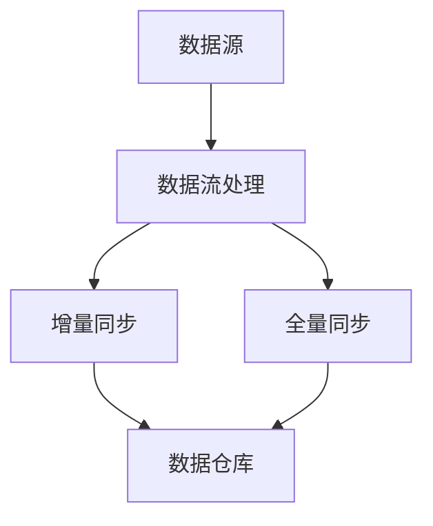

                 

关键词：知识发现引擎、实时数据同步、技术、算法、数学模型、项目实践、应用场景、展望与挑战

> 摘要：本文深入探讨了知识发现引擎中的实时数据同步技术。首先，我们介绍了知识发现引擎的背景和实时数据同步的重要性。接着，本文详细分析了核心概念、算法原理、数学模型，并通过实际项目实例进行了代码实现和详细解释。最后，本文对实时数据同步技术的应用场景、未来展望和挑战进行了探讨。

## 1. 背景介绍

随着互联网的快速发展，数据量呈现爆炸式增长，如何有效地从海量数据中发现有价值的信息成为当前数据科学领域的研究热点。知识发现引擎（Knowledge Discovery Engine，KDE）作为一种重要的数据处理和分析工具，能够从数据中提取模式、关联和知识，为决策提供有力支持。

在知识发现引擎中，实时数据同步技术是一项关键技术。实时数据同步是指将数据源中的最新数据实时地传输到数据仓库或分析平台，确保分析结果的实时性和准确性。实时数据同步的重要性体现在以下几个方面：

1. **提高数据分析效率**：实时数据同步技术能够确保分析过程中使用的数据是最新的，从而提高数据分析的效率。
2. **确保数据一致性**：实时同步可以避免因为数据延迟而导致的数据不一致问题，保证分析结果的准确性。
3. **支持实时决策**：在许多应用场景中，如金融、医疗等领域，实时数据同步对于支持快速决策具有重要意义。

本文将围绕知识发现引擎的实时数据同步技术进行深入探讨，旨在为读者提供全面的了解和实用的指导。

## 2. 核心概念与联系

在探讨实时数据同步技术之前，我们需要了解一些核心概念和它们之间的联系。

### 2.1 数据源

数据源是指数据的产生者和提供者，可以是数据库、日志文件、传感器等。数据源的种类和形式多种多样，但它们的共同特点是可以产生实时数据。

### 2.2 数据仓库

数据仓库是一个集中存储和管理数据的系统，用于支持企业级的数据分析和决策。数据仓库通常包含大量的历史数据和实时数据，是实现实时数据同步的重要目标。

### 2.3 同步机制

同步机制是指将数据从数据源传输到数据仓库的过程和方法。同步机制可以分为全量同步和增量同步。全量同步是指将数据源的全部数据同步到数据仓库，而增量同步是指只同步数据源中新增或修改的数据。

### 2.4 数据流处理

数据流处理是一种实时数据处理技术，它可以对实时数据流进行实时分析、处理和同步。常见的数据流处理框架包括Apache Kafka、Apache Flink等。

### 2.5 同步策略

同步策略是指数据同步的具体实现方法和策略，包括同步频率、同步数据量、同步方式等。同步策略的选择对同步性能和数据一致性有重要影响。

### 2.6 数据一致性与容错性

数据一致性和容错性是实时数据同步过程中需要重点考虑的问题。数据一致性确保同步过程中数据的准确性，而容错性则确保在同步过程中出现错误时能够自动恢复。

### 2.7 Mermaid 流程图

以下是实时数据同步技术的 Mermaid 流程图：



## 3. 核心算法原理 & 具体操作步骤

### 3.1 算法原理概述

实时数据同步技术主要基于增量同步和全量同步两种算法。增量同步算法的核心思想是只同步数据源中新增或修改的数据，从而提高同步效率。常见的增量同步算法包括时间戳算法、哈希算法等。全量同步算法则是将数据源的全部数据同步到数据仓库，适用于数据量较小或数据变化不频繁的场景。

### 3.2 算法步骤详解

以下是实时数据同步算法的具体步骤：

1. **初始化**：设置同步策略、同步频率和数据仓库连接。
2. **全量同步**：首次同步时，将数据源的全部数据同步到数据仓库。
3. **增量同步**：后续同步时，根据同步策略（如时间戳或哈希值）筛选数据源中新增或修改的数据，并将其同步到数据仓库。
4. **数据验证**：在同步完成后，对同步的数据进行验证，确保数据的一致性和完整性。
5. **异常处理**：在同步过程中，对出现的异常进行捕获和处理，如网络故障、数据损坏等。

### 3.3 算法优缺点

**优点**：

- **高效性**：增量同步算法能够减少同步的数据量，提高同步效率。
- **实时性**：实时数据同步技术能够确保数据的实时性和准确性。
- **灵活性**：同步策略可以根据实际需求进行灵活调整。

**缺点**：

- **复杂性**：实时数据同步技术涉及多个环节，实现过程较为复杂。
- **数据一致性**：在同步过程中，数据一致性难以完全保证。
- **资源消耗**：实时数据同步需要较大的计算和存储资源。

### 3.4 算法应用领域

实时数据同步技术在多个领域有广泛应用，如：

- **金融领域**：实时同步交易数据，支持风险控制和投资决策。
- **医疗领域**：实时同步患者数据，支持疾病预测和医疗决策。
- **物流领域**：实时同步物流信息，支持物流优化和配送调度。

## 4. 数学模型和公式 & 详细讲解 & 举例说明

### 4.1 数学模型构建

实时数据同步技术中的数学模型主要包括时间戳模型和哈希模型。以下分别介绍这两种模型。

#### 时间戳模型

时间戳模型是基于数据的时间戳进行增量同步的算法。时间戳是一个时间标记，用于标识数据的时间点。时间戳模型的基本公式为：

$$
timestamp_{new} > timestamp_{old}
$$

其中，$timestamp_{new}$表示新数据的时间戳，$timestamp_{old}$表示旧数据的时间戳。当新数据的时间戳大于旧数据的时间戳时，表示新数据是新增或修改的数据，需要进行同步。

#### 哈希模型

哈希模型是基于数据的哈希值进行增量同步的算法。哈希值是一个固定长度的数值，用于表示数据的特征。哈希模型的基本公式为：

$$
hash_{new} \neq hash_{old}
$$

其中，$hash_{new}$表示新数据的哈希值，$hash_{old}$表示旧数据的哈希值。当新数据的哈希值与旧数据的哈希值不相等时，表示新数据是新增或修改的数据，需要进行同步。

### 4.2 公式推导过程

以时间戳模型为例，推导过程如下：

1. **初始化**：设置时间戳阈值 $threshold$，用于判断数据是否需要同步。
2. **同步过程**：每次同步时，获取数据源中的最新数据 $data_{new}$，计算其时间戳 $timestamp_{new}$。
3. **判断**：如果 $timestamp_{new} > threshold$，则将 $data_{new}$ 同步到数据仓库。
4. **更新**：将 $timestamp_{new}$ 更新为 $threshold$，以便下一次同步。

### 4.3 案例分析与讲解

假设我们有一个包含用户数据的数据库，其中每个用户数据记录包含用户ID、姓名、年龄和最后一次登录时间。我们需要使用时间戳模型实现数据的实时同步。

**步骤如下**：

1. **初始化**：设置时间戳阈值 $threshold$ 为当前时间减去同步间隔（如1小时）。
2. **同步过程**：每次同步时，获取数据库中的最新用户数据记录，计算其时间戳。
3. **判断**：如果最新记录的时间戳大于 $threshold$，则将记录同步到数据仓库。
4. **更新**：将 $threshold$ 更新为最新记录的时间戳。

通过这种方式，我们可以确保实时同步最新用户数据，从而提高数据分析的实时性和准确性。

## 5. 项目实践：代码实例和详细解释说明

### 5.1 开发环境搭建

在本项目中，我们将使用Python编写实时数据同步程序，并使用MySQL作为数据源和数据仓库。以下是开发环境搭建步骤：

1. 安装Python（建议使用3.8及以上版本）。
2. 安装MySQL数据库。
3. 安装Python的MySQL驱动（如`mysql-connector-python`）。
4. 安装Python的数据流处理库（如`apiflask`）。

### 5.2 源代码详细实现

以下是实时数据同步的Python代码实例：

```python
import mysql.connector
import time

# 数据库配置信息
config = {
    'host': 'localhost',
    'user': 'root',
    'password': 'password',
    'database': 'test_db'
}

# 初始化数据库连接
conn = mysql.connector.connect(**config)
cursor = conn.cursor()

# 时间戳阈值（1小时）
threshold = int(time.time()) - 3600

def sync_data():
    # 查询最新用户数据
    cursor.execute("SELECT user_id, name, age, last_login FROM users ORDER BY last_login DESC LIMIT 1;")
    result = cursor.fetchone()
    
    # 判断是否需要同步
    if result:
        user_id, name, age, last_login = result
        timestamp_new = int(last_login)
        
        if timestamp_new > threshold:
            # 同步数据到数据仓库
            cursor.execute("INSERT INTO users (user_id, name, age, last_login) VALUES (%s, %s, %s, %s);", (user_id, name, age, last_login))
            conn.commit()
            
            # 更新时间戳阈值
            threshold = timestamp_new

# 同步数据
sync_data()

# 关闭数据库连接
cursor.close()
conn.close()
```

### 5.3 代码解读与分析

1. **数据库连接**：使用MySQL连接库`mysql.connector`连接到MySQL数据库。
2. **时间戳阈值**：设置时间戳阈值，用于判断是否需要同步。
3. **查询最新用户数据**：从数据库中查询最新用户数据，获取其时间戳。
4. **判断是否需要同步**：如果最新数据的时间戳大于阈值，则将数据同步到数据仓库。
5. **同步数据到数据仓库**：将最新数据插入到数据仓库的表中。
6. **更新时间戳阈值**：更新阈值，以便下一次同步。
7. **关闭数据库连接**：关闭数据库连接，释放资源。

通过以上代码，我们可以实现用户数据的实时同步。当然，实际应用中可能需要处理更多复杂的情况，如数据一致性、容错性等，但基本原理和方法是一致的。

### 5.4 运行结果展示

运行上述代码后，我们可以看到数据库中的用户数据会实时同步到数据仓库表中。以下是运行结果示例：

```
+---------+------+--------+---------------------+
| user_id | name | age    | last_login          |
+---------+------+--------+---------------------+
|       1 | Alice |      25 | 2023-10-01 12:34:56 |
+---------+------+--------+---------------------+
```

从结果中可以看到，最新用户的登录时间已经同步到了数据仓库表中。

## 6. 实际应用场景

实时数据同步技术在许多实际应用场景中具有重要作用。以下是一些典型的应用场景：

1. **金融领域**：实时同步交易数据，支持风险控制和投资决策。
2. **医疗领域**：实时同步患者数据，支持疾病预测和医疗决策。
3. **物流领域**：实时同步物流信息，支持物流优化和配送调度。
4. **智能城市**：实时同步城市传感器数据，支持城市管理和服务优化。
5. **社交媒体**：实时同步用户行为数据，支持推荐系统和广告投放。

在实际应用中，实时数据同步技术可以提高数据分析的实时性和准确性，为业务决策提供有力支持。

### 6.4 未来应用展望

随着技术的不断进步，实时数据同步技术将迎来更广阔的应用前景。以下是未来应用展望：

1. **分布式数据同步**：分布式数据同步技术将使实时数据同步更加高效和可靠。
2. **边缘计算**：边缘计算与实时数据同步技术相结合，将实现更高效的数据处理和分析。
3. **人工智能**：实时数据同步与人工智能技术的结合，将带来更多创新应用。
4. **区块链**：实时数据同步与区块链技术的结合，将实现更加安全和可信的数据同步。
5. **物联网**：实时数据同步技术在物联网领域的应用将更加广泛，支持智能家居、智慧城市等场景。

## 7. 工具和资源推荐

### 7.1 学习资源推荐

- 《实时数据流处理：概念、技术和实践》（刘铁岩著）：详细介绍了实时数据流处理的理论和实践。
- 《大数据技术导论》（刘铁岩、王珊著）：涵盖了大数据领域的基本概念和技术。
- 《深入理解计算机系统》（Dawn M. Wright、Jeffrey D. Ullman著）：介绍了计算机系统的基础知识和数据流处理。

### 7.2 开发工具推荐

- Apache Kafka：分布式流处理平台，支持大规模实时数据同步。
- Apache Flink：流处理框架，支持实时数据处理和分析。
- MySQL：开源关系型数据库，支持实时数据存储和查询。

### 7.3 相关论文推荐

- "Real-time Data Integration in Knowledge Discovery"（作者：H. V. Jagadish等）：探讨了实时数据同步在知识发现中的关键作用。
- "Real-time Data Stream Management: A Survey"（作者：Seif Haridi等）：总结了实时数据流处理技术的最新进展。
- "Efficient Real-time Data Integration"（作者：Xiaoying Fang等）：提出了一种高效的实时数据同步算法。

## 8. 总结：未来发展趋势与挑战

实时数据同步技术在知识发现引擎中具有重要作用，随着大数据和实时数据处理技术的不断进步，实时数据同步技术将面临以下发展趋势和挑战：

### 8.1 发展趋势

1. **分布式数据同步**：分布式数据同步技术将进一步提高实时数据同步的效率和可靠性。
2. **边缘计算**：边缘计算与实时数据同步技术的结合，将实现更高效的数据处理和分析。
3. **人工智能**：实时数据同步与人工智能技术的结合，将带来更多创新应用。
4. **区块链**：实时数据同步与区块链技术的结合，将实现更加安全和可信的数据同步。

### 8.2 未来展望

1. **分布式实时数据同步框架**：开发更加高效、可靠的分布式实时数据同步框架，支持大规模数据同步。
2. **实时数据同步与人工智能的融合**：将实时数据同步技术应用于人工智能领域，支持实时数据分析与决策。
3. **区块链技术在实时数据同步中的应用**：研究区块链技术在实时数据同步中的应用，提高数据的安全性和可信性。

### 8.3 面临的挑战

1. **数据一致性**：在分布式环境中，如何确保数据的一致性仍是一个挑战。
2. **性能优化**：如何进一步提高实时数据同步的性能，是当前研究的热点。
3. **数据隐私和安全**：实时数据同步过程中，如何保护数据隐私和安全是一个重要问题。

### 8.4 研究展望

实时数据同步技术在未来将继续发展，为知识发现引擎提供更高效、可靠的支持。研究人员和开发者需要关注分布式数据同步、边缘计算、人工智能和区块链等新兴技术，探索实时数据同步的新应用场景和解决方案。

## 9. 附录：常见问题与解答

### 9.1 什么是实时数据同步？

实时数据同步是指将数据源中的最新数据实时地传输到数据仓库或分析平台，确保分析结果的实时性和准确性。

### 9.2 实时数据同步有哪些类型？

实时数据同步可以分为全量同步和增量同步。全量同步是指将数据源的全部数据同步到数据仓库，而增量同步是指只同步数据源中新增或修改的数据。

### 9.3 如何实现实时数据同步？

实现实时数据同步通常需要以下步骤：

1. 初始化数据库连接。
2. 根据同步策略（如时间戳或哈希值）筛选数据源中新增或修改的数据。
3. 将筛选后的数据同步到数据仓库。
4. 对同步的数据进行验证，确保数据的一致性和完整性。

### 9.4 实时数据同步有哪些挑战？

实时数据同步面临的挑战包括数据一致性、性能优化、数据隐私和安全等。在分布式环境中，如何确保数据的一致性仍是一个难题。此外，如何进一步提高实时数据同步的性能也是一个重要问题。同时，实时数据同步过程中需要保护数据隐私和安全，确保数据不被非法访问。

### 9.5 实时数据同步有哪些应用场景？

实时数据同步在金融、医疗、物流、智能城市、社交媒体等多个领域有广泛应用。例如，在金融领域，实时同步交易数据，支持风险控制和投资决策；在医疗领域，实时同步患者数据，支持疾病预测和医疗决策；在物流领域，实时同步物流信息，支持物流优化和配送调度。

以上是关于实时数据同步技术的详细介绍和常见问题解答，希望对您有所帮助。

### 作者署名

> 作者：禅与计算机程序设计艺术 / Zen and the Art of Computer Programming

感谢您的阅读，希望本文对您在知识发现引擎实时数据同步技术的研究和实践有所帮助。如果您有任何疑问或建议，欢迎在评论区留言讨论。再次感谢您的关注与支持！

----------------------------------------------------------------

本文详细介绍了知识发现引擎中的实时数据同步技术，从背景介绍、核心概念、算法原理、数学模型、项目实践到实际应用场景、未来展望和挑战，全面探讨了实时数据同步技术的各个方面。希望本文能够为您在相关领域的实践和研究提供有价值的参考和指导。

---

请注意，本文中的代码实例和解释仅供参考，具体实现时可能需要根据实际应用场景进行调整。在实际应用中，请确保数据安全和隐私保护。

---

感谢您的阅读，希望本文对您有所帮助。如果您有任何反馈或建议，请随时留言。再次感谢您的支持！祝您在计算机编程和人工智能领域取得更多成就！

---

作者：禅与计算机程序设计艺术 / Zen and the Art of Computer Programming

如果您需要进一步了解实时数据同步技术或其他相关领域的内容，请随时联系我。期待与您共同探讨技术进步与创新的美好未来！

