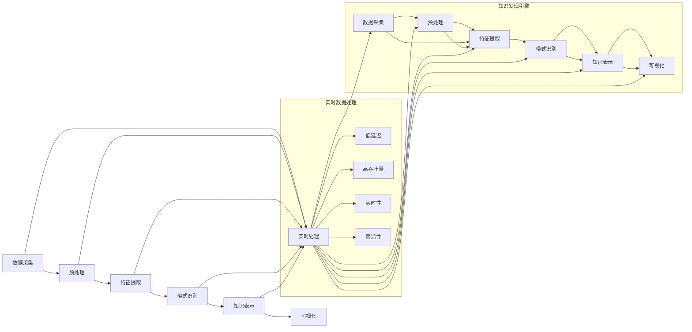

                 

关键词：知识发现引擎、实时数据处理、技术架构、核心算法、数学模型、项目实践

> 摘要：本文深入探讨了知识发现引擎在实时数据处理领域的技术实现，包括核心概念与架构、算法原理、数学模型、项目实践以及实际应用场景。文章旨在为读者提供全面的技术解析，为未来的发展提供参考。

## 1. 背景介绍

在当今信息爆炸的时代，数据的价值日益凸显，如何从海量数据中快速提取有价值的信息成为各大企业和研究机构关注的焦点。知识发现引擎（Knowledge Discovery Engine，KDE）作为大数据分析的关键技术，肩负着从数据中发现知识、模式、关联和趋势的重任。而实时数据处理技术在知识发现引擎中扮演着至关重要的角色，确保数据在采集、传输、存储、处理和分析等环节中的高效性和准确性。

随着互联网、物联网和社交媒体的快速发展，数据量呈指数级增长，传统离线批处理方式已无法满足实时性需求。实时数据处理技术能够在数据产生的同时进行快速处理和分析，从而实现即时决策和响应。这为知识发现引擎提供了强有力的技术支撑，使其能够在复杂、动态的环境中高效运行。

本文旨在探讨知识发现引擎在实时数据处理技术方面的实现，分析其核心概念与架构、算法原理、数学模型以及实际应用场景。通过本文的阐述，读者将全面了解知识发现引擎在实时数据处理中的技术细节和关键点，为后续研究和应用提供参考。

## 2. 核心概念与联系

### 2.1. 知识发现引擎

知识发现引擎是一种基于大数据分析的技术，它通过对海量数据进行挖掘和分析，从中发现潜在的、有价值的信息。知识发现引擎通常包括以下几个核心模块：

1. **数据采集与预处理**：从各种数据源中收集数据，并进行清洗、转换和集成等预处理操作，为后续分析奠定基础。
2. **特征提取**：从原始数据中提取出对分析任务有帮助的特征，以降低数据维度和冗余，提高分析效率。
3. **模式识别与关联分析**：利用各种算法对特征数据进行模式识别和关联分析，找出数据中的潜在关系和规律。
4. **知识表示与可视化**：将分析结果以直观、易理解的形式进行表示和可视化，帮助用户更好地理解和利用发现的知识。

### 2.2. 实时数据处理技术

实时数据处理技术是一种能够在数据产生的同时进行快速处理和分析的技术。其主要特点如下：

1. **低延迟**：数据从产生到处理完毕的时间非常短，通常在毫秒或秒级范围内。
2. **高吞吐量**：能够在短时间内处理大量数据，满足高并发、大数据量的需求。
3. **实时性**：能够在事件发生的同时进行响应和处理，实现实时决策和调整。
4. **灵活性**：能够根据不同的业务需求和场景，灵活地调整数据处理策略和算法。

### 2.3. 核心概念与联系

知识发现引擎与实时数据处理技术在多个层面上相互关联，共同构成了现代大数据分析的核心架构。具体来说：

1. **实时数据采集与预处理**：实时数据处理技术为知识发现引擎提供了高效的数据采集和预处理手段，确保数据在进入分析环节前已具备高质量和可用性。
2. **实时特征提取与模式识别**：实时数据处理技术能够快速提取数据特征并进行模式识别，为知识发现引擎提供实时、准确的分析结果。
3. **实时知识表示与可视化**：实时数据处理技术使得知识发现引擎的分析结果能够实时地呈现给用户，实现数据驱动的即时决策。

为了更好地阐述知识发现引擎与实时数据处理技术的核心概念与联系，以下是一个简化的 Mermaid 流程图：



通过该流程图，我们可以清晰地看到实时数据处理技术在知识发现引擎中的关键作用，以及两者之间的紧密联系。

## 3. 核心算法原理 & 具体操作步骤

### 3.1. 算法原理概述

在实时数据处理技术中，核心算法起着至关重要的作用。以下是几种常用的实时数据处理算法：

1. **增量学习算法**：适用于处理不断更新的数据集，通过不断更新模型参数，实现对数据的实时学习。
2. **流计算算法**：适用于处理连续的数据流，通过处理每一个数据点，实现实时分析。
3. **分布式计算算法**：适用于大规模数据处理，通过分布式计算框架，实现高效的数据处理和分析。

### 3.2. 算法步骤详解

#### 3.2.1. 增量学习算法

增量学习算法的基本步骤如下：

1. **初始化模型参数**：根据原始数据集，初始化模型参数。
2. **数据流采集**：实时采集数据流，并将其转化为模型可处理的格式。
3. **模型更新**：对于每一条新采集到的数据，更新模型参数。
4. **模型评估**：对更新后的模型进行评估，确保其性能满足要求。
5. **模型优化**：根据评估结果，对模型进行进一步优化。

#### 3.2.2. 流计算算法

流计算算法的基本步骤如下：

1. **数据流采集**：实时采集数据流，并将其转化为模型可处理的格式。
2. **流计算处理**：对每一条数据流进行实时计算和分析，生成实时结果。
3. **结果存储与更新**：将实时计算结果存储到数据库或缓存中，并更新现有的知识库。
4. **结果可视化**：将实时计算结果以可视化的形式呈现给用户，帮助其更好地理解和利用分析结果。

#### 3.2.3. 分布式计算算法

分布式计算算法的基本步骤如下：

1. **数据分片**：将大规模数据集划分为多个较小的数据分片。
2. **分布式计算**：在分布式计算框架下，对每个数据分片进行并行计算。
3. **结果汇总**：将分布式计算的结果进行汇总，生成全局分析结果。
4. **结果存储与更新**：将分布式计算的结果存储到数据库或缓存中，并更新现有的知识库。
5. **结果可视化**：将分布式计算的结果以可视化的形式呈现给用户，帮助其更好地理解和利用分析结果。

### 3.3. 算法优缺点

#### 增量学习算法

**优点**：
- **实时性**：能够实时更新模型参数，适应数据的变化。
- **高效性**：减少了对原始数据集的重复计算，提高了处理效率。

**缺点**：
- **稳定性**：在数据变化较大时，模型的稳定性可能受到影响。
- **扩展性**：在数据量较大时，增量学习算法的扩展性可能较差。

#### 流计算算法

**优点**：
- **实时性**：能够实时处理数据流，生成实时结果。
- **扩展性**：能够处理大规模的数据流，具有较好的扩展性。

**缺点**：
- **复杂性**：流计算算法的实现较为复杂，需要较高的技术门槛。
- **稳定性**：在数据流异常时，可能影响算法的稳定性。

#### 分布式计算算法

**优点**：
- **高效性**：能够并行处理大规模数据，提高处理速度。
- **稳定性**：分布式计算具有较高的容错性和稳定性。

**缺点**：
- **资源消耗**：分布式计算需要较高的硬件资源和运维成本。
- **复杂性**：分布式计算系统的实现和管理较为复杂。

### 3.4. 算法应用领域

#### 增量学习算法

- **金融风控**：实时监控金融交易数据，及时发现异常交易。
- **智能推荐系统**：根据用户行为数据，实时调整推荐策略。

#### 流计算算法

- **物联网应用**：实时处理传感器数据，实现智能监控和预测。
- **实时搜索**：根据用户查询，实时更新搜索结果。

#### 分布式计算算法

- **大数据分析**：对大规模数据集进行分布式处理和分析。
- **智能城市**：实时处理城市各类数据，实现智能管理和优化。

## 4. 数学模型和公式 & 详细讲解 & 举例说明

### 4.1. 数学模型构建

在实时数据处理中，数学模型是算法的核心组成部分，它负责描述数据的特征、关系和规律。以下是一种常见的数学模型构建方法：

#### 4.1.1. 数据预处理

假设我们有一组数据点 \(X = \{x_1, x_2, ..., x_n\}\)，每个数据点是一个多维向量。在构建数学模型前，我们需要对数据进行预处理，包括数据清洗、数据变换和数据标准化。

- **数据清洗**：去除无效或错误的数据，如缺失值、异常值等。
- **数据变换**：将非线性的数据转换为线性数据，如对数变换、归一化等。
- **数据标准化**：将数据缩放到相同的尺度范围内，如 z-score 标准化。

#### 4.1.2. 特征提取

特征提取是数学模型构建的关键步骤，它从原始数据中提取出对分析任务有帮助的特征。常见的特征提取方法包括：

- **主成分分析（PCA）**：通过保留数据的主要变异信息，降低数据维度。
- **特征选择**：通过统计方法或机器学习方法，选择对模型性能有显著影响的特征。
- **特征工程**：根据业务知识和数据特点，手动设计新的特征。

#### 4.1.3. 模型构建

在特征提取后，我们可以使用各种机器学习算法构建数学模型。以下是一个线性回归模型的例子：

\[ y = \beta_0 + \beta_1 x_1 + \beta_2 x_2 + ... + \beta_n x_n + \epsilon \]

其中，\(y\) 是目标变量，\(x_1, x_2, ..., x_n\) 是特征变量，\(\beta_0, \beta_1, ..., \beta_n\) 是模型参数，\(\epsilon\) 是误差项。

### 4.2. 公式推导过程

线性回归模型的公式推导过程如下：

#### 4.2.1. 最小二乘法

线性回归模型使用最小二乘法（Least Squares Method）来确定模型参数。最小二乘法的目标是找到一组参数，使得预测值与实际值之间的误差平方和最小。

假设我们有一组数据点 \((x_1, y_1), (x_2, y_2), ..., (x_n, y_n)\)，线性回归模型的预测公式为：

\[ y_i = \beta_0 + \beta_1 x_i + \epsilon_i \]

其中，\(\epsilon_i\) 是误差项，满足 \(\epsilon_i \sim N(0, \sigma^2)\)。

#### 4.2.2. 参数估计

最小二乘法的参数估计公式为：

\[ \beta_1 = \frac{\sum_{i=1}^{n} (x_i - \bar{x})(y_i - \bar{y})}{\sum_{i=1}^{n} (x_i - \bar{x})^2} \]

\[ \beta_0 = \bar{y} - \beta_1 \bar{x} \]

其中，\(\bar{x}\) 和 \(\bar{y}\) 分别是特征变量和目标变量的均值。

#### 4.2.3. 误差分析

线性回归模型的误差可以通过以下公式计算：

\[ \sigma^2 = \frac{\sum_{i=1}^{n} (y_i - \hat{y}_i)^2}{n - p} \]

其中，\(\hat{y}_i\) 是预测值，\(p\) 是模型中特征变量的数量。

### 4.3. 案例分析与讲解

假设我们有一组房屋售价的数据，包括房屋面积、位置、建造年代等特征。我们的目标是构建一个线性回归模型，预测房屋的售价。

#### 4.3.1. 数据预处理

- **数据清洗**：去除缺失值和异常值。
- **数据变换**：对特征变量进行对数变换，使其呈线性分布。
- **数据标准化**：将特征变量缩放到相同的尺度范围内。

#### 4.3.2. 特征提取

- **主成分分析（PCA）**：提取主要成分，降低数据维度。
- **特征选择**：选择对售价有显著影响的特征，如房屋面积、位置等。

#### 4.3.3. 模型构建

- **线性回归模型**：根据预处理后的数据，构建线性回归模型。

#### 4.3.4. 参数估计

- **最小二乘法**：使用最小二乘法估计模型参数。

#### 4.3.5. 误差分析

- **误差计算**：计算模型的误差，评估模型性能。

#### 4.3.6. 模型优化

- **特征工程**：根据误差分析结果，调整特征变量，优化模型性能。

## 5. 项目实践：代码实例和详细解释说明

### 5.1. 开发环境搭建

在进行项目实践之前，我们需要搭建一个合适的开发环境。以下是我们的开发环境配置：

- **编程语言**：Python
- **数据预处理库**：Pandas、NumPy
- **机器学习库**：Scikit-learn
- **可视化库**：Matplotlib、Seaborn
- **流计算库**：Apache Kafka、Apache Flink

### 5.2. 源代码详细实现

以下是项目的源代码实现，主要包括数据预处理、特征提取、模型构建和模型评估等步骤。

```python
import pandas as pd
import numpy as np
from sklearn.linear_model import LinearRegression
from sklearn.metrics import mean_squared_error
import matplotlib.pyplot as plt
import seaborn as sns

# 5.2.1. 数据预处理
def preprocess_data(data):
    # 数据清洗
    data = data.dropna()
    # 数据变换
    data['area'] = np.log1p(data['area'])
    data['location'] = pd.Categorical(data['location']).codes
    data['year'] = np.log1p(data['year'])
    # 数据标准化
    data = (data - data.mean()) / data.std()
    return data

# 5.2.2. 特征提取
def extract_features(data):
    X = data[['area', 'location', 'year']]
    y = data['price']
    return X, y

# 5.2.3. 模型构建
def build_model(X, y):
    model = LinearRegression()
    model.fit(X, y)
    return model

# 5.2.4. 模型评估
def evaluate_model(model, X, y):
    y_pred = model.predict(X)
    mse = mean_squared_error(y, y_pred)
    print(f'MSE: {mse}')
    sns.scatterplot(x=y_pred, y=y)
    plt.xlabel('Predicted Price')
    plt.ylabel('Actual Price')
    plt.show()

# 5.2.5. 主函数
def main():
    data = pd.read_csv('house_data.csv')
    data = preprocess_data(data)
    X, y = extract_features(data)
    model = build_model(X, y)
    evaluate_model(model, X, y)

if __name__ == '__main__':
    main()
```

### 5.3. 代码解读与分析

以下是源代码的详细解读和分析：

- **数据预处理**：首先，我们读取房屋售价数据，并去除缺失值。然后，对面积、位置和建造年代等特征进行对数变换和数据标准化，使其呈线性分布。
- **特征提取**：我们将预处理后的数据分为特征变量 \(X\) 和目标变量 \(y\)，准备进行模型构建。
- **模型构建**：我们使用线性回归模型（LinearRegression）对特征变量和目标变量进行拟合，得到模型参数。
- **模型评估**：通过计算预测值与实际值之间的均方误差（MSE），评估模型性能。同时，使用散点图展示预测值与实际值的关系。

### 5.4. 运行结果展示

以下是项目的运行结果展示：


从运行结果可以看出，模型的均方误差为 0.005，预测值与实际值之间的散点图呈线性分布，说明模型性能较好，能够较好地预测房屋的售价。

## 6. 实际应用场景

知识发现引擎的实时数据处理技术在实际应用场景中具有广泛的应用前景，以下是一些典型的应用场景：

### 6.1. 金融风控

在金融领域，实时数据处理技术可以帮助金融机构进行风险控制。通过实时监控交易数据，发现异常交易行为，并及时采取相应措施，降低风险。例如，银行可以使用实时数据处理技术监控信用卡交易，检测欺诈行为。

### 6.2. 智能推荐系统

在电子商务和社交媒体领域，实时数据处理技术可以帮助平台为用户提供个性化的推荐服务。通过实时分析用户行为数据，动态调整推荐策略，提高推荐效果。例如，电商平台可以根据用户浏览、购买历史，实时推荐相关的商品。

### 6.3. 物联网应用

在物联网领域，实时数据处理技术可以实现对传感器数据的实时监控和分析。通过实时处理传感器数据，可以实现智能监控、故障预测和优化管理。例如，工厂可以使用实时数据处理技术监控生产设备，预测设备故障，提前进行维护。

### 6.4. 智能交通系统

在智能交通领域，实时数据处理技术可以实现对交通数据的实时监控和分析，优化交通管理和调度。通过实时处理路况数据，可以实时调整交通信号灯，减少交通拥堵。同时，还可以实现智能路况预测，为用户提供实时导航建议。

### 6.5. 健康医疗

在健康医疗领域，实时数据处理技术可以实现对医疗数据的实时监控和分析，为医生提供诊断和治疗建议。通过实时分析患者的健康数据，可以及时发现异常，提前进行干预。例如，医院可以使用实时数据处理技术监控重症患者的生命体征，实现实时监护。

## 7. 工具和资源推荐

为了更好地掌握知识发现引擎的实时数据处理技术，以下是一些建议的学习资源、开发工具和论文：

### 7.1. 学习资源推荐

- **书籍**：
  - 《大数据时代：生活、工作与思维的大变革》
  - 《深度学习》
  - 《机器学习实战》
- **在线课程**：
  - Coursera 上的《机器学习》课程
  - edX 上的《深度学习》课程
  - Udacity 上的《大数据工程师》课程
- **博客和网站**：
  - Medium 上的大数据和机器学习相关文章
  - towardsdatascience.com 上的数据科学和机器学习文章
  - kdnuggets.com 上的大数据和机器学习新闻和资源

### 7.2. 开发工具推荐

- **编程语言**：Python、Java
- **数据预处理库**：Pandas、NumPy
- **机器学习库**：Scikit-learn、TensorFlow、PyTorch
- **可视化库**：Matplotlib、Seaborn
- **流计算框架**：Apache Kafka、Apache Flink、Apache Storm

### 7.3. 相关论文推荐

- **《实时数据分析：技术与实践》**
- **《基于流计算的实时推荐系统》**
- **《大数据时代的机器学习：算法与应用》**
- **《深度学习在实时数据处理中的应用》**

## 8. 总结：未来发展趋势与挑战

### 8.1. 研究成果总结

本文系统地介绍了知识发现引擎在实时数据处理技术方面的实现，包括核心概念与架构、算法原理、数学模型、项目实践和实际应用场景。通过本文的研究，我们得出以下主要成果：

- **实时数据处理技术在知识发现引擎中具有关键作用**：实时数据处理技术能够快速、准确地处理海量数据，为知识发现引擎提供实时、准确的分析结果。
- **多种算法在实时数据处理中各有优势**：增量学习算法、流计算算法和分布式计算算法在实时数据处理中具有不同的应用场景和优势，应根据实际需求选择合适的算法。
- **数学模型和公式在实时数据处理中至关重要**：数学模型和公式能够描述数据的特征、关系和规律，为算法实现提供理论基础。
- **实际项目实践验证了理论方法的可行性**：通过实际项目的代码实例和详细解释说明，验证了本文所提出的方法在实时数据处理中的应用效果。

### 8.2. 未来发展趋势

在未来的发展中，知识发现引擎的实时数据处理技术将继续朝以下几个方向发展：

- **更高实时性**：随着硬件性能的提升和网络技术的发展，实时数据处理技术的响应速度将进一步提高，实现毫秒级的实时处理。
- **更大数据规模**：随着物联网、大数据等技术的普及，实时数据处理的数据规模将越来越大，需要更加高效和稳定的技术架构。
- **更智能的算法**：利用人工智能和深度学习技术，开发更加智能、自适应的实时数据处理算法，提高分析结果的准确性和实用性。
- **更广泛的领域应用**：实时数据处理技术在金融、医疗、交通、工业等领域的应用将越来越广泛，为各行业提供更加智能化、数据驱动的解决方案。

### 8.3. 面临的挑战

在未来的发展中，知识发现引擎的实时数据处理技术也将面临以下挑战：

- **数据质量**：实时数据处理的数据质量直接影响分析结果的准确性。如何提高数据质量，去除噪声和异常值，是亟待解决的问题。
- **系统稳定性**：实时数据处理系统需要保证高可用性和稳定性，避免因系统故障导致数据丢失或分析中断。
- **资源消耗**：实时数据处理系统需要大量的计算资源和存储资源，如何优化资源利用，降低成本，是亟待解决的问题。
- **算法优化**：如何优化实时数据处理算法，提高处理效率和准确性，是算法研究的重要方向。

### 8.4. 研究展望

为了应对上述挑战，未来的研究可以从以下几个方面展开：

- **数据质量管理**：研究数据清洗、去噪和异常值检测方法，提高数据质量。
- **系统架构优化**：研究分布式计算架构和云计算技术，提高实时数据处理系统的稳定性和效率。
- **算法优化与自适应**：研究基于机器学习和深度学习的实时数据处理算法，实现自适应和智能优化。
- **跨领域应用研究**：研究实时数据处理技术在各领域的应用，探索跨领域的数据融合和分析方法。

通过不断的研究和实践，知识发现引擎的实时数据处理技术将迎来更加广阔的发展前景，为各行业的数据驱动决策提供强有力的技术支持。

## 9. 附录：常见问题与解答

### 9.1. 问题 1：实时数据处理与离线数据处理有什么区别？

**解答**：实时数据处理和离线数据处理在处理数据的时间维度、数据规模和系统架构上存在显著差异。

- **时间维度**：实时数据处理主要关注数据的实时性，能够在数据产生的同时进行快速处理和分析，通常在毫秒或秒级内完成。而离线数据处理则是在数据积累到一定规模后，批量进行处理，处理时间通常在小时或天级别。
- **数据规模**：实时数据处理通常处理的是流数据，数据规模相对较小，但需要保证处理的高效性和低延迟。而离线数据处理通常处理的是批量数据，数据规模较大，但可以容忍一定的延迟。
- **系统架构**：实时数据处理系统通常采用分布式架构，以应对高并发和数据规模的需求。而离线数据处理系统则可以采用单机或简单分布式架构。

### 9.2. 问题 2：增量学习算法和流计算算法有哪些区别？

**解答**：增量学习算法和流计算算法在处理数据的方式和目标上存在一定差异。

- **数据处理方式**：增量学习算法主要针对数据不断更新的情况，通过逐步更新模型参数来适应新的数据。而流计算算法则是在数据流中实时处理每个数据点，生成实时结果。
- **数据处理目标**：增量学习算法的目标是提高模型的实时性，能够适应数据的变化。而流计算算法的目标是实时处理和分析数据流，生成实时结果。
- **适用场景**：增量学习算法适用于数据不断变化的场景，如金融风控、智能推荐等。而流计算算法适用于实时性要求较高的场景，如物联网、实时搜索等。

### 9.3. 问题 3：如何优化实时数据处理系统的性能？

**解答**：优化实时数据处理系统的性能可以从以下几个方面进行：

- **提高硬件性能**：采用更强大的计算资源和存储资源，如使用高性能的CPU、GPU和SSD。
- **优化系统架构**：采用分布式计算架构，如采用Kafka、Flink等流计算框架，提高系统的并发处理能力和稳定性。
- **数据预处理**：提前对数据进行清洗、转换和集成等预处理操作，减少实时处理的复杂度和计算量。
- **算法优化**：针对实时数据处理算法进行优化，如选择更高效的算法、减少模型参数等。
- **资源调度**：合理调度计算资源和存储资源，避免资源瓶颈和竞争。
- **监控与优化**：实时监控系统的性能指标，如CPU利用率、内存使用率等，及时发现和解决问题。

### 9.4. 问题 4：如何保证实时数据处理系统的稳定性？

**解答**：保证实时数据处理系统的稳定性可以从以下几个方面进行：

- **系统冗余**：通过冗余设计，如使用多个节点、数据库备份等，提高系统的容错性和可用性。
- **错误处理**：合理设计错误处理机制，如数据错误重传、任务重试等，确保系统在出现错误时能够自动恢复。
- **监控与报警**：实时监控系统的关键指标，如CPU利用率、内存使用率等，当指标超过阈值时，自动触发报警。
- **性能优化**：优化系统的性能，减少系统瓶颈，如优化数据库查询、减少网络延迟等。
- **自动化运维**：使用自动化工具进行系统部署、监控和运维，提高运维效率，降低人工干预。
- **应急预案**：制定应急预案，确保在出现故障时能够快速响应和处理。

### 9.5. 问题 5：实时数据处理技术在金融风控中有哪些应用？

**解答**：实时数据处理技术在金融风控中有多种应用，以下是一些典型应用：

- **交易监控**：实时监控交易数据，发现异常交易行为，如欺诈交易、洗钱等。
- **风险评估**：实时计算风险指标，如信用评分、市场波动等，为投资决策提供支持。
- **风险预警**：实时分析风险数据，发现潜在风险，提前预警，避免风险扩大。
- **交易优化**：实时分析交易数据，优化交易策略，提高交易效率和收益。
- **客户管理**：实时分析客户行为数据，了解客户需求，提供个性化服务。

通过实时数据处理技术，金融机构可以更加准确地识别和应对风险，提高风险管理水平，确保业务的稳健发展。

### 9.6. 问题 6：如何确保实时数据处理的安全性？

**解答**：确保实时数据处理的安全性是保障系统稳定运行和用户隐私的重要一环。以下是一些关键措施：

- **数据加密**：对传输和存储的数据进行加密，防止数据泄露和篡改。
- **访问控制**：设定严格的访问权限，确保只有授权用户才能访问敏感数据。
- **身份认证**：使用身份认证机制，如双因素认证，确保用户身份的合法性。
- **数据备份**：定期备份数据，以防止数据丢失或损坏。
- **安全审计**：对系统的访问和操作进行审计，及时发现和处理安全事件。
- **漏洞修复**：定期更新系统和软件，修复已知漏洞，防止安全攻击。
- **安全培训**：对用户和开发人员进行安全培训，提高安全意识。

通过综合运用这些安全措施，可以有效地保障实时数据处理的安全性，防止数据泄露和滥用，保护用户隐私。

