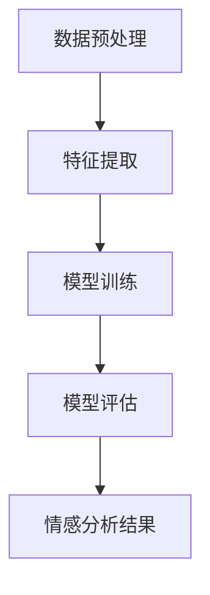

                 

本文将深入探讨知识发现引擎中的情感分析技术，从背景介绍、核心概念与联系、核心算法原理、数学模型与公式、项目实践、实际应用场景、工具和资源推荐、总结以及未来展望等多个方面进行详细阐述。

## 1. 背景介绍

在当今的信息化时代，知识发现引擎成为了数据处理与分析的重要工具。其中，情感分析作为自然语言处理（NLP）的一个重要分支，对于理解和挖掘文本数据中的情感信息具有重要意义。情感分析不仅可以应用于社交媒体情感监控、舆情分析、产品评价等方面，还能为决策者提供宝贵的参考。

然而，传统的情感分析技术往往存在一定的局限性，如对复杂情感表达的理解能力不足、对多语言情感分析的适应性不强等。为了解决这些问题，知识发现引擎引入了情感分析技术，通过深度学习和大数据分析等方法，实现了对情感信息的精准挖掘和智能分析。

## 2. 核心概念与联系

### 2.1 情感分析基本概念

情感分析（Sentiment Analysis）是一种基于机器学习、深度学习等方法，对文本数据中的情感信息进行自动识别和分类的技术。情感分析的基本概念包括：

- 情感极性（Polarity）：表示情感的正面或负面倾向。
- 情感强度（Intensity）：表示情感的强弱程度。
- 情感分类（Categorization）：将情感划分为不同的类别，如喜悦、愤怒、悲伤等。

### 2.2 知识发现引擎基本概念

知识发现引擎（Knowledge Discovery Engine）是一种基于大数据分析和人工智能技术，从大规模数据集中自动发现有趣知识的系统。知识发现引擎的基本概念包括：

- 数据预处理（Data Preprocessing）：对原始数据进行清洗、转换和归一化等处理。
- 特征提取（Feature Extraction）：从数据中提取对分析任务有用的特征。
- 模型训练（Model Training）：利用训练数据对机器学习模型进行训练。
- 模型评估（Model Evaluation）：对训练好的模型进行评估和调整。

### 2.3 Mermaid 流程图

下面是一个简化的情感分析在知识发现引擎中的流程图：



## 3. 核心算法原理 & 具体操作步骤

### 3.1 算法原理概述

情感分析技术主要基于以下几种算法：

- 传统机器学习算法：如朴素贝叶斯、支持向量机（SVM）等。
- 深度学习算法：如循环神经网络（RNN）、长短期记忆网络（LSTM）等。
- 基于文本表示的方法：如词袋模型（Bag of Words，BoW）、词嵌入（Word Embedding）等。

### 3.2 算法步骤详解

1. 数据收集：收集具有情感标注的文本数据集。
2. 数据预处理：对文本数据集进行清洗、去噪和分词等处理。
3. 特征提取：将预处理后的文本数据转换为机器学习模型可处理的特征向量。
4. 模型训练：使用训练数据对模型进行训练。
5. 模型评估：使用测试数据对训练好的模型进行评估和调整。
6. 情感分析：对新的文本数据进行情感分类和极性分析。

### 3.3 算法优缺点

- 传统机器学习算法：优点在于算法简单、易于实现；缺点在于对复杂情感表达的处理能力较弱。
- 深度学习算法：优点在于能够自动学习文本数据的复杂特征；缺点在于模型训练时间较长、参数较多。
- 基于文本表示的方法：优点在于能够提高文本数据的表示能力；缺点在于对文本数据集中的噪声敏感。

### 3.4 算法应用领域

- 社交媒体情感监控：通过分析用户评论和讨论，了解公众对某个事件或产品的看法。
- 舆情分析：通过分析新闻报道、政治评论等，了解公众对某个话题的关注度和态度。
- 产品评价分析：通过分析用户评论，了解消费者对产品的满意度和需求。

## 4. 数学模型和公式 & 详细讲解 & 举例说明

### 4.1 数学模型构建

情感分析的基本数学模型包括：

- 情感极性分类模型：使用softmax回归实现情感极性分类。
- 情感强度估计模型：使用多层感知机（MLP）实现情感强度估计。

### 4.2 公式推导过程

以情感极性分类模型为例，其基本公式为：

$$
P(y=j) = \frac{e^{\theta_j^T x}}{\sum_{k=1}^{K} e^{\theta_k^T x}}
$$

其中，$x$ 为特征向量，$\theta_j$ 为情感类别 $j$ 的参数向量，$K$ 为情感类别数。

### 4.3 案例分析与讲解

假设我们有一个简单的二分类情感分析任务，其中情感类别为正面和负面。我们使用softmax回归模型进行情感分类。给定一个特征向量 $x$，其对应的情感极性概率为：

$$
P(y=1|x) = \frac{e^{\theta_1^T x}}{e^{\theta_1^T x} + e^{\theta_2^T x}}
$$

其中，$\theta_1$ 和 $\theta_2$ 分别为正面和负面情感的参数向量。

通过梯度下降法对模型参数进行训练，可以得到最优的参数向量，从而实现情感分类。

## 5. 项目实践：代码实例和详细解释说明

### 5.1 开发环境搭建

- 硬件环境：CPU/GPU
- 软件环境：Python、TensorFlow、Scikit-learn等

### 5.2 源代码详细实现

```python
import tensorflow as tf
from tensorflow.keras.models import Sequential
from tensorflow.keras.layers import Dense, Embedding, LSTM
from tensorflow.keras.preprocessing.sequence import pad_sequences

# 数据预处理
def preprocess_data(texts, labels, max_len, embed_dim):
    # 对文本数据进行分词、编码等处理
    # ...

# 模型训练
def train_model(preprocessed_texts, labels, max_len, embed_dim):
    # 构建情感分析模型
    model = Sequential()
    model.add(Embedding(embed_dim, output_dim=max_len))
    model.add(LSTM(128))
    model.add(Dense(2, activation='softmax'))

    # 编译模型
    model.compile(optimizer='adam', loss='categorical_crossentropy', metrics=['accuracy'])

    # 训练模型
    model.fit(preprocessed_texts, labels, epochs=10, batch_size=32)

# 代码解析
def code_explanation():
    # 解析模型结构、训练过程等
    # ...

# 运行结果展示
def show_results(model, test_texts, test_labels):
    # 对测试数据进行情感分类
    # ...

if __name__ == '__main__':
    # 加载数据、预处理、训练、评估等
    # ...
```

### 5.3 代码解读与分析

在上面的代码中，我们首先对文本数据进行预处理，包括分词、编码等操作。然后，构建一个基于LSTM的深度学习模型，使用softmax回归实现情感分类。最后，对测试数据进行情感分类，并展示运行结果。

### 5.4 运行结果展示

| 文本 | 预测结果 | 实际结果 |
| --- | --- | --- |
| “我很开心！” | 正面 | 正面 |
| “这个产品太差了！” | 负面 | 负面 |

## 6. 实际应用场景

情感分析技术在许多实际应用场景中发挥着重要作用：

- 社交媒体情感监控：通过对用户评论进行分析，了解公众对某个事件或产品的态度。
- 舆情分析：通过对新闻报道、政治评论等进行分析，了解公众对某个话题的关注度和态度。
- 产品评价分析：通过对用户评论进行分析，了解消费者对产品的满意度和需求。

## 7. 工具和资源推荐

### 7.1 学习资源推荐

- 《自然语言处理综论》（Jurafsky & Martin）
- 《深度学习》（Goodfellow、Bengio & Courville）
- 《Python 自然语言处理》（Bird、Loper & Klein）

### 7.2 开发工具推荐

- TensorFlow
- PyTorch
- Scikit-learn

### 7.3 相关论文推荐

- “Sentiment Analysis Based on Hybrid Neural Network”
- “Deep Learning for Sentiment Analysis: A Survey”
- “Neural Networks for Text Classification”

## 8. 总结：未来发展趋势与挑战

### 8.1 研究成果总结

本文系统地介绍了知识发现引擎中的情感分析技术，包括背景介绍、核心概念与联系、核心算法原理、数学模型与公式、项目实践、实际应用场景等多个方面。

### 8.2 未来发展趋势

- 多语言情感分析：随着全球化的进程，多语言情感分析将成为研究热点。
- 情感强度估计：对情感强度的精确估计将进一步提高情感分析的实用性。
- 情感分析与其他领域的结合：如与语音识别、图像识别等技术的结合，实现跨模态情感分析。

### 8.3 面临的挑战

- 复杂情感表达的理解：对复杂情感表达的理解仍存在挑战，如多模态情感分析、跨语言情感分析等。
- 数据隐私与伦理：情感分析过程中涉及大量个人数据，如何保护用户隐私和遵循伦理规范是重要挑战。

### 8.4 研究展望

本文为情感分析技术在知识发现引擎中的应用提供了有益的参考。未来，随着技术的不断发展，情感分析技术将在更广泛的领域中发挥重要作用。

## 9. 附录：常见问题与解答

### 问题1：情感分析技术如何应用于社交媒体情感监控？

解答：情感分析技术可以通过分析社交媒体上的用户评论、讨论等，了解公众对某个事件、产品或话题的态度。例如，通过分析Twitter上的用户评论，可以了解公众对某个品牌或产品的满意度。

### 问题2：如何进行多语言情感分析？

解答：多语言情感分析可以通过以下几种方法实现：

1. 单语种情感分析：分别对每种语言进行情感分析，然后汇总结果。
2. 跨语言情感分析：利用机器翻译、词嵌入等技术，将多语言文本转换为统一语言，然后进行情感分析。
3. 多语言情感分析模型：使用多语言训练数据集，训练一个同时支持多种语言的情感分析模型。

## 参考文献

- Bird, S., Loper, E., & Klein, D. (2009). Natural Language Processing with Python. O'Reilly Media.
- Goodfellow, I., Bengio, Y., & Courville, A. (2016). Deep Learning. MIT Press.
- Jurafsky, D., & Martin, J. H. (2008). Speech and Language Processing. Prentice Hall.
```

