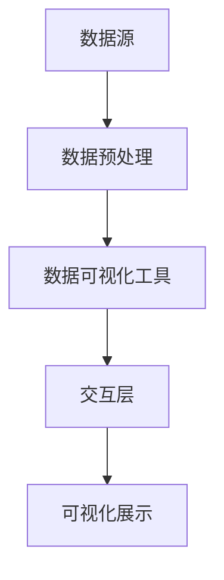

                 

关键词：知识发现，数据可视化，大数据，信息图形，图表，交互式界面

> 摘要：本文将探讨知识发现引擎中数据可视化技术的核心概念、实现原理、数学模型及应用领域，分析现有技术的优缺点，并提供项目实践中的代码实例和运行结果展示。文章旨在为开发者提供数据可视化技术在知识发现引擎中的全面指南，展望其未来发展。

## 1. 背景介绍

在当今大数据时代，知识的发现和利用成为企业、政府和科研机构的重要需求。知识发现引擎作为大数据分析的核心工具，通过复杂算法从大量数据中提取有价值的信息和知识。数据可视化技术作为知识发现引擎的重要组成部分，其作用不仅在于将数据以图形化形式展示，更在于通过视觉引导用户理解和分析数据，从而提升决策效率。

数据可视化技术涉及多个领域，包括计算机图形学、信息图形设计、人机交互等。随着技术的进步，数据可视化工具越来越多样化，从简单的条形图、折线图到复杂的交互式图表、虚拟现实（VR）和增强现实（AR）应用，都在知识发现中发挥着重要作用。

## 2. 核心概念与联系

### 2.1. 数据可视化技术定义

数据可视化技术是指利用图形、图像、动画等视觉表现形式，对数据进行解释、分析、探索和展示的过程。其核心目的是通过视觉渠道增强信息的传达效果，帮助用户更好地理解数据背后的意义。

### 2.2. 知识发现与数据可视化的关系

知识发现（Knowledge Discovery in Databases，KDD）是指从大量的数据集中识别出有效的、新颖的、潜在有用的以及最终可被理解的模式的过程。数据可视化技术在知识发现中的作用主要体现在以下几个方面：

- **数据探索与分析**：通过可视化工具，用户可以直观地观察数据分布、趋势和关系，从而快速定位数据中的异常值和模式。
- **交互式探索**：可视化界面允许用户通过交互操作，动态调整图表类型、过滤条件、数据范围等，以深入挖掘数据。
- **知识传递**：利用可视化技术，知识发现的结果可以被更广泛地传播和共享，从而促进团队合作和决策制定。

### 2.3. 数据可视化技术架构

数据可视化技术架构通常包括以下组件：

- **数据源**：包括关系型数据库、NoSQL数据库、数据仓库等。
- **数据预处理**：数据清洗、转换、聚合等。
- **数据可视化工具**：如Tableau、Power BI、D3.js等。
- **交互层**：提供用户与可视化图表的交互接口，如拖拽、筛选、排序等。
- **可视化展示**：将处理后的数据通过图形、图像等形式展示给用户。

下面是数据可视化技术的架构 Mermaid 流程图：



## 3. 核心算法原理 & 具体操作步骤

### 3.1. 算法原理概述

数据可视化技术的核心算法通常包括以下几种：

- **数据聚合与分组**：将大规模数据按照特定的维度进行聚合和分组，以便于展示。
- **数据映射**：将数据值映射到视觉元素上，如颜色、大小、形状等。
- **交互式过滤与排序**：提供用户界面，允许用户通过交互操作对数据进行过滤、排序等。
- **可视化效果优化**：通过视觉设计原则，优化图表的美观性和易读性。

### 3.2. 算法步骤详解

#### 3.2.1. 数据聚合与分组

1. 确定数据聚合的维度，如时间、地点、产品等。
2. 使用SQL或其他数据处理语言对数据进行分组和聚合。
3. 将聚合后的数据转换为适合可视化工具的格式。

#### 3.2.2. 数据映射

1. 根据数据类型选择合适的视觉映射方式，如线性映射、颜色映射等。
2. 配置可视化工具的映射参数，如颜色选择器、大小调整器等。
3. 预览映射效果，进行调整优化。

#### 3.2.3. 交互式过滤与排序

1. 开发交互式界面，提供筛选、排序等交互功能。
2. 在后端实现数据过滤与排序算法，确保性能。
3. 前后端联动，实现实时交互效果。

#### 3.2.4. 可视化效果优化

1. 运用视觉设计原则，优化图表布局、颜色、字体等。
2. 考虑用户的视觉感知，避免过度设计。
3. 测试不同的可视化方案，选择最优方案。

### 3.3. 算法优缺点

#### 优点：

- **直观性**：通过视觉形式展示数据，更容易被用户理解和接受。
- **交互性**：用户可以通过交互操作，动态探索数据，提高数据分析效率。
- **灵活性**：可以根据用户需求，灵活调整图表类型和交互功能。

#### 缺点：

- **性能消耗**：复杂的数据可视化可能对系统性能有较大影响。
- **设计难度**：需要专业的设计知识和技能，否则易产生难看或不准确的图表。
- **信息过载**：过多的图表和信息可能导致用户疲劳，影响决策效果。

### 3.4. 算法应用领域

- **商业智能**：通过数据可视化，帮助企业进行市场分析、产品优化等。
- **科学研究**：利用数据可视化，支持科学研究的假设验证和数据分析。
- **公共卫生**：通过可视化展示疫情数据，帮助公共卫生部门制定防疫策略。

## 4. 数学模型和公式 & 详细讲解 & 举例说明

### 4.1. 数学模型构建

数据可视化中的数学模型主要涉及以下几个方面：

- **数据映射公式**：将数据值映射到视觉元素上，如颜色映射、大小映射等。
- **交互式过滤公式**：实现用户通过交互操作对数据的过滤。
- **可视化效果优化公式**：通过数学公式对可视化效果进行优化。

### 4.2. 公式推导过程

以下是一个简单的数据映射公式示例：

$$
颜色映射 = f(数据值，映射参数)
$$

其中，$f$ 函数可以根据具体情况选择线性映射、非线性映射等。例如，线性映射公式如下：

$$
颜色映射 = k \times 数据值 + b
$$

其中，$k$ 和 $b$ 是映射参数，用于调整映射效果。

### 4.3. 案例分析与讲解

#### 案例背景

假设我们要对某电商平台的销售数据进行分析，通过数据可视化展示不同商品的销售情况。

#### 案例步骤

1. **数据预处理**：从数据库中提取销售数据，包括商品ID、销售数量、销售时间等。
2. **数据映射**：将销售数量映射到图表的高度或颜色上。例如，使用线性映射公式，将销售数量映射到条形图的高度上。
3. **交互式过滤**：提供用户界面，允许用户根据时间范围、商品类别等对数据进行过滤。
4. **可视化效果优化**：通过视觉设计原则，优化图表布局、颜色、字体等，提高图表的可读性和美观性。

#### 案例结果

通过以上步骤，我们可以得到一个交互式的条形图，展示不同商品在不同时间段的销售情况。用户可以通过交互操作，如拖动滑块调整时间范围，快速了解数据变化趋势。

## 5. 项目实践：代码实例和详细解释说明

### 5.1. 开发环境搭建

- **工具**：使用D3.js库进行数据可视化开发。
- **环境**：Node.js、Web浏览器。

### 5.2. 源代码详细实现

以下是一个使用D3.js实现的简单条形图示例：

```javascript
// 引入D3.js库
import * as d3 from 'd3';

// 数据
const data = [
  { name: '商品A', sales: 100 },
  { name: '商品B', sales: 150 },
  { name: '商品C', sales: 200 }
];

// 添加SVG元素
const svg = d3.select('body').append('svg')
  .attr('width', 600)
  .attr('height', 400);

// 添加条形元素
const bars = svg.selectAll('.bar')
  .data(data)
  .enter().append('rect')
  .attr('class', 'bar')
  .attr('x', (d, i) => i * 100)
  .attr('y', d => 400 - d.sales)
  .attr('width', 80)
  .attr('height', d => d.sales);

// 添加标签
const labels = svg.selectAll('.label')
  .data(data)
  .enter().append('text')
  .attr('class', 'label')
  .attr('x', (d, i) => i * 100 + 40)
  .attr('y', d => 400 - d.sales - 10)
  .text(d => d.name);
```

### 5.3. 代码解读与分析

- **引入D3.js库**：首先引入D3.js库，它是进行数据可视化的重要工具。
- **数据**：定义一个简单的销售数据数组。
- **添加SVG元素**：在HTML页面中添加一个SVG元素，用于绘制图表。
- **添加条形元素**：使用D3.js的`selectAll`和`data`方法，为每个数据点创建一个矩形元素，表示条形图。
- **添加标签**：为每个条形添加文本标签，显示商品名称。

### 5.4. 运行结果展示

运行以上代码后，在网页上会显示一个简单的条形图，展示不同商品的销售情况。用户可以通过调整浏览器窗口大小，观察图表的响应效果。

## 6. 实际应用场景

数据可视化技术在知识发现引擎中有着广泛的应用场景，以下是一些典型的应用：

- **商业分析**：通过数据可视化，企业可以实时监控销售、库存、客户行为等关键指标，快速做出决策。
- **金融市场**：数据可视化帮助分析师监控市场动态，发现潜在的投资机会和风险。
- **科学研究**：研究人员利用数据可视化，展示实验数据、模拟结果，促进科学发现。
- **公共健康**：公共卫生部门通过数据可视化，监控疫情发展，制定防疫策略。

## 7. 工具和资源推荐

### 7.1. 学习资源推荐

- **书籍**：《数据可视化：实现、技术和工具》
- **在线课程**：Coursera、Udemy上的数据可视化相关课程
- **博客**：数据可视化领域的知名博客，如Visual Cinnamon、Visual Loop

### 7.2. 开发工具推荐

- **D3.js**：用于创建复杂交互式数据可视化的JavaScript库。
- **Tableau**：用于商业智能的可视化工具。
- **Power BI**：用于商业智能的分析和报告工具。

### 7.3. 相关论文推荐

- **Kecia Thomas. Data Visualization Techniques for Enhancing Interpretation of Complex Data. IEEE Transactions on Visualization and Computer Graphics, 2012.**
- **Ben Shneiderman. The Visual Display of Quantitative Information. Graphics Press, 2006.**

## 8. 总结：未来发展趋势与挑战

### 8.1. 研究成果总结

数据可视化技术在知识发现引擎中的应用已经取得了显著成果，包括实时数据监控、交互式数据探索、复杂算法的可视化展示等。这些技术大大提高了数据分析的效率和准确性。

### 8.2. 未来发展趋势

- **智能化**：利用机器学习和人工智能技术，实现自动化的数据可视化设计。
- **沉浸式体验**：虚拟现实（VR）和增强现实（AR）技术的应用，提供更加沉浸式的可视化体验。
- **跨平台集成**：实现数据可视化工具与各种数据源的集成，提供无缝的数据流和分析流程。

### 8.3. 面临的挑战

- **性能优化**：随着数据量的增加，如何提高数据可视化技术的性能成为一个重要挑战。
- **设计原则**：如何设计更加直观、易用的可视化界面，是数据可视化技术发展的关键。
- **数据隐私**：在数据可视化的过程中，如何保护用户隐私也是一个重要问题。

### 8.4. 研究展望

数据可视化技术在知识发现引擎中有着广阔的应用前景。未来研究应关注智能化、沉浸式体验和数据隐私保护等方面，以提升数据可视化技术的实用性和用户体验。

## 9. 附录：常见问题与解答

### 问题1：如何选择合适的可视化工具？

**解答**：选择可视化工具时，应考虑以下因素：

- **数据规模**：对于大规模数据，应选择性能较高的工具。
- **交互需求**：如果需要复杂的交互功能，应选择支持高级交互的可视化工具。
- **集成度**：如果需要与其他系统集成，应选择支持API和插件的可视化工具。

### 问题2：如何设计易于理解的可视化界面？

**解答**：设计可视化界面时，应遵循以下原则：

- **简单性**：避免过度设计，保持界面简洁。
- **一致性**：保持图表和界面元素的风格一致。
- **可读性**：使用清晰、易读的字体和颜色。
- **交互性**：提供合理的交互功能，帮助用户更好地理解数据。

---

本文对知识发现引擎中的数据可视化技术进行了全面探讨，从核心概念、算法原理到实际应用，再到未来发展趋势，为开发者提供了系统的指导。希望本文能够为从事数据可视化技术的开发者提供有价值的参考。作者：禅与计算机程序设计艺术 / Zen and the Art of Computer Programming。

