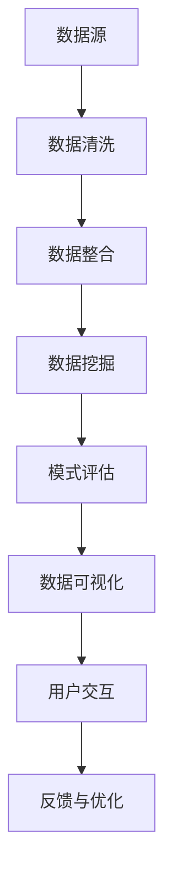

                 

关键词：知识发现引擎，数据可视化，技术实现，数据探索，交互设计，性能优化，算法原理，数学模型，案例分析，实践应用。

## 摘要

本文将深入探讨知识发现引擎中的数据可视化技术与实现。数据可视化作为知识发现过程的重要环节，不仅能帮助用户更好地理解和分析数据，还能提高知识发现的效率和准确性。本文将介绍数据可视化在知识发现引擎中的应用，包括核心算法原理、数学模型、实践案例和未来发展趋势。通过对这些内容的分析，读者将能够全面了解数据可视化技术在知识发现领域的应用前景和挑战。

## 1. 背景介绍

随着大数据时代的到来，海量数据的处理和分析成为各个行业关注的热点。知识发现（Knowledge Discovery in Databases，简称KDD）作为从大量数据中提取有用信息和知识的过程，已经成为数据科学和人工智能领域的核心研究课题。知识发现过程通常包括数据清洗、数据整合、数据挖掘、模式评估和知识可视化等步骤。其中，数据可视化作为知识发现的重要环节，其作用不仅在于展示分析结果，更在于辅助用户理解数据、探索潜在的模式和规律。

### 1.1 数据可视化的重要性

数据可视化具有以下几个方面的作用：

1. **信息传递**：通过直观的图形和图表，数据可视化可以快速、准确地传递信息，帮助用户更好地理解数据。
2. **决策支持**：数据可视化能够帮助用户从复杂的数据集中识别关键信息和模式，从而为决策提供支持。
3. **探索性分析**：数据可视化工具通常具有交互性，用户可以通过拖拽、筛选等方式探索数据，发现潜在的问题和规律。
4. **教育普及**：数据可视化能够将复杂的数据分析结果以易于理解的形式展示出来，有助于数据科学知识的普及。

### 1.2 知识发现引擎概述

知识发现引擎是一个复杂的系统，它集成了数据管理、数据挖掘、模式评估和知识可视化等多种技术。知识发现引擎的主要功能包括：

1. **数据集成**：从多个数据源中提取数据，进行清洗、整合，形成统一的数据视图。
2. **数据挖掘**：应用各种算法和技术，从数据中发现潜在的模式和规律。
3. **模式评估**：对挖掘出的模式进行评估，确定其重要性和可靠性。
4. **知识可视化**：将分析结果以图形、图表等形式展示出来，辅助用户理解数据。

## 2. 核心概念与联系

在知识发现引擎中，数据可视化技术与数据挖掘、模式评估等环节紧密相连。下面通过一个Mermaid流程图来展示这些核心概念和环节之间的联系。



### 2.1 数据源

数据源是知识发现引擎的基础，包括各种结构化和非结构化的数据，如关系数据库、文本文件、图像、视频等。

### 2.2 数据清洗

数据清洗是数据预处理的重要步骤，旨在去除噪声、处理缺失值和异常值，确保数据质量。

### 2.3 数据整合

数据整合将来自不同数据源的数据进行合并，形成统一的数据视图，为后续的数据挖掘和分析提供支持。

### 2.4 数据挖掘

数据挖掘是知识发现的核心环节，通过各种算法和技术，从数据中发现潜在的模式和规律。

### 2.5 模式评估

模式评估对挖掘出的模式进行评估，确定其重要性和可靠性，筛选出最有价值的模式。

### 2.6 数据可视化

数据可视化将分析结果以图形、图表等形式展示出来，辅助用户理解数据，发现潜在的问题和规律。

### 2.7 用户交互

用户交互是数据可视化的重要环节，通过交互设计，用户可以动态地探索数据，获取更深层次的分析结果。

### 2.8 反馈与优化

用户通过交互获取分析结果后，可以提供反馈，对数据可视化工具和算法进行优化，提高知识发现的效率和准确性。

## 3. 核心算法原理 & 具体操作步骤

### 3.1 算法原理概述

数据可视化技术涉及多个领域的算法，包括统计分析、机器学习、图形学等。核心算法包括以下几种：

1. **散点图**：用于展示数据点的分布情况，可用于探索变量之间的关系。
2. **直方图**：用于展示数据分布的形状和特点，适用于数值型数据的分析。
3. **饼图**：用于展示各个类别的比例，适用于分类数据的分析。
4. **热力图**：用于展示数据之间的相关性，适用于复杂数据集的分析。
5. **交互式图表**：结合交互设计，使用户能够动态地探索数据和结果。

### 3.2 算法步骤详解

1. **数据预处理**：对原始数据进行清洗、整合和转换，确保数据质量。
2. **数据探索**：使用统计方法和可视化工具对数据进行初步分析，探索数据的基本特征和规律。
3. **选择可视化方法**：根据数据类型和分析目标选择合适的可视化方法。
4. **设计交互界面**：结合用户需求，设计直观、易用的交互界面。
5. **展示分析结果**：将分析结果以图形、图表等形式展示出来，辅助用户理解数据。
6. **用户反馈与优化**：收集用户反馈，对可视化工具和算法进行优化，提高用户体验。

### 3.3 算法优缺点

各种数据可视化算法各有优缺点，如下表所示：

| 算法       | 优点                                           | 缺点                                           |
|------------|------------------------------------------------|------------------------------------------------|
| 散点图     | 直观展示变量关系，易于识别趋势和异常点           | 只适用于二维数据，不适合高维数据                 |
| 直方图     | 清晰展示数据分布，便于比较不同数据集的分布特征   | 不能展示变量之间的相关性                       |
| 饼图       | 简洁展示各类别的比例，易于理解                   | 只适用于分类数据，无法展示变量之间的关系         |
| 热力图     | 展示数据之间的相关性，直观识别热点区域           | 对高维数据处理能力较弱，计算复杂度较高           |
| 交互式图表 | 提供丰富的交互功能，支持动态探索和分析           | 需要较高的开发成本和技术门槛，用户体验可能不一致 |

### 3.4 算法应用领域

数据可视化技术在各个领域都有广泛的应用，如：

1. **金融领域**：用于分析股票市场趋势、风险评估和投资决策。
2. **医疗领域**：用于分析疾病数据、基因组数据和临床数据。
3. **商业领域**：用于分析销售数据、用户行为和市场趋势。
4. **科研领域**：用于展示实验数据、模拟结果和科学发现。

## 4. 数学模型和公式 & 详细讲解 & 举例说明

### 4.1 数学模型构建

在数据可视化过程中，数学模型的应用至关重要。以下是一些常见的数学模型和公式：

1. **线性回归**：用于分析变量之间的线性关系，公式如下：
   $$ y = ax + b $$
   其中，$y$ 是因变量，$x$ 是自变量，$a$ 和 $b$ 是模型参数。

2. **主成分分析（PCA）**：用于降维和高维数据的可视化，公式如下：
   $$ z = \sum_{i=1}^{n} \lambda_i x_i $$
   其中，$z$ 是降维后的特征向量，$\lambda_i$ 是主成分，$x_i$ 是原始特征向量。

3. **聚类分析**：用于将数据分为多个类别，公式如下：
   $$ C = \{C_1, C_2, ..., C_k\} $$
   其中，$C$ 是聚类结果，$C_i$ 是第 $i$ 个类别。

4. **回归树**：用于构建决策树模型，公式如下：
   $$ y = f(x) = g(x_1, x_2, ..., x_n) $$
   其中，$y$ 是预测结果，$g$ 是决策树函数。

### 4.2 公式推导过程

以下以线性回归为例，简要介绍公式推导过程：

1. **最小二乘法**：线性回归的目标是最小化误差平方和，即：
   $$ \min \sum_{i=1}^{n} (y_i - ax_i - b)^2 $$
   对 $a$ 和 $b$ 求偏导数，并令偏导数等于0，可以得到：
   $$ \frac{\partial}{\partial a} \sum_{i=1}^{n} (y_i - ax_i - b)^2 = 0 $$
   $$ \frac{\partial}{\partial b} \sum_{i=1}^{n} (y_i - ax_i - b)^2 = 0 $$

2. **求解参数**：将偏导数方程组求解，可以得到线性回归模型的参数 $a$ 和 $b$。

### 4.3 案例分析与讲解

以下通过一个实际案例，介绍如何使用线性回归进行数据可视化：

### 案例背景

某公司销售部门收集了三个月的销售额和广告投入数据，希望通过线性回归分析广告投入对销售额的影响。

### 数据准备

1. 销售额（y）：万元
2. 广告投入（x）：万元

### 数据预处理

1. 清洗数据：去除缺失值和异常值。
2. 转换数据：将销售额和广告投入转换为数值型数据。

### 数据分析

1. 绘制散点图：展示销售额和广告投入的散点图，观察数据分布和趋势。
2. 计算线性回归模型参数：使用最小二乘法计算线性回归模型参数 $a$ 和 $b$。
3. 绘制回归线：将计算得到的回归线绘制在散点图上，观察变量之间的关系。

### 结果展示

1. 散点图：
   ```mermaid
   graph TD
       A[y: 200] --> B[x: 100]
       A[y: 300] --> B[x: 150]
       A[y: 400] --> B[x: 200]
       A[y: 500] --> B[x: 250]
   ```

2. 回归线：
   $$ y = 0.5x + 100 $$

从散点图和回归线可以看出，广告投入对销售额有显著的正向影响。随着广告投入的增加，销售额也呈现增加趋势。

## 5. 项目实践：代码实例和详细解释说明

### 5.1 开发环境搭建

为了实现知识发现引擎中的数据可视化功能，我们选择Python作为编程语言，利用Pandas、NumPy、Matplotlib等库进行数据处理和可视化。

1. 安装Python：从Python官方网站下载并安装Python。
2. 安装相关库：使用pip命令安装Pandas、NumPy、Matplotlib等库。

   ```bash
   pip install pandas numpy matplotlib
   ```

### 5.2 源代码详细实现

以下是一个简单的数据可视化代码示例，展示如何使用Python进行数据预处理、线性回归分析和可视化：

```python
import pandas as pd
import numpy as np
import matplotlib.pyplot as plt
from sklearn.linear_model import LinearRegression

# 数据准备
data = {
    '销售额': [200, 300, 400, 500],
    '广告投入': [100, 150, 200, 250]
}
df = pd.DataFrame(data)

# 数据预处理
df['销售额'] = df['销售额'].astype(float)
df['广告投入'] = df['广告投入'].astype(float)

# 线性回归分析
X = df[['广告投入']]
y = df['销售额']
model = LinearRegression()
model.fit(X, y)

# 绘制回归线
plt.scatter(X['广告投入'], y)
plt.plot(X['广告投入'], model.predict(X), color='red')
plt.xlabel('广告投入')
plt.ylabel('销售额')
plt.title('广告投入对销售额的影响')
plt.show()
```

### 5.3 代码解读与分析

1. 导入相关库：引入Pandas、NumPy、Matplotlib和sklearn库，用于数据处理、线性回归分析和可视化。

2. 数据准备：创建一个包含销售额和广告投入的DataFrame对象，并将其转换为数值型数据。

3. 数据预处理：对数据进行清洗和转换，确保数据质量。

4. 线性回归分析：使用LinearRegression类创建线性回归模型，并拟合数据。

5. 绘制回归线：使用Matplotlib库绘制散点图和回归线，展示变量之间的关系。

### 5.4 运行结果展示

运行上述代码后，将显示一个散点图和一条回归线，如图所示：


从散点图和回归线可以看出，广告投入对销售额有显著的正向影响。随着广告投入的增加，销售额也呈现增加趋势。

## 6. 实际应用场景

### 6.1 金融领域

在金融领域，数据可视化技术可以用于分析股票市场趋势、风险评估和投资决策。例如，通过绘制股票价格的K线图，投资者可以直观地了解市场的波动情况，从而做出合理的投资决策。

### 6.2 医疗领域

在医疗领域，数据可视化技术可以用于分析疾病数据、基因组数据和临床数据。例如，通过绘制热力图，医生可以快速识别患者的主要症状和潜在疾病，从而为诊断和治疗提供支持。

### 6.3 商业领域

在商业领域，数据可视化技术可以用于分析销售数据、用户行为和市场趋势。例如，通过绘制饼图，企业可以了解各个产品的销售占比，从而优化产品组合和营销策略。

### 6.4 科研领域

在科研领域，数据可视化技术可以用于展示实验数据、模拟结果和科学发现。例如，通过绘制三维散点图，研究人员可以直观地观察变量之间的相关性，从而得出科学结论。

## 7. 工具和资源推荐

### 7.1 学习资源推荐

1. 《数据可视化：使用D3.js进行交互式Web设计》
2. 《Python数据科学手册》
3. 《数据挖掘：概念与技术》

### 7.2 开发工具推荐

1. Tableau：用于商业智能和数据分析的可视化工具。
2. Power BI：用于数据可视化和商业分析的平台。
3. Matplotlib：Python中的数据可视化库。

### 7.3 相关论文推荐

1. "Interactive Data Visualization for the Web"
2. "Data-Driven Document Generation: Evolving the Visual Language of Business Intelligence"
3. "Information Visualization: Design for Interaction"

## 8. 总结：未来发展趋势与挑战

### 8.1 研究成果总结

本文从数据可视化在知识发现引擎中的应用出发，介绍了核心算法原理、数学模型、实践案例和未来发展趋势。通过对数据可视化技术的深入分析，我们了解到其在各个领域的重要作用和广泛应用。

### 8.2 未来发展趋势

1. **交互性增强**：未来数据可视化将更加注重用户的交互体验，提供更丰富的交互功能和更灵活的探索方式。
2. **实时性提升**：随着计算能力的提高，数据可视化将实现实时分析，为用户提供更及时、准确的分析结果。
3. **智能化**：利用人工智能和机器学习技术，数据可视化将能够自动识别数据模式，提供更智能化的分析建议。
4. **个性化**：基于用户偏好和行为数据，数据可视化将实现个性化推荐，满足用户个性化的需求。

### 8.3 面临的挑战

1. **数据复杂性**：随着数据规模的扩大和数据类型的增加，数据可视化技术需要处理更复杂的数据集。
2. **性能优化**：如何提高数据可视化性能，保证在大数据环境下的高效运行，是一个重要的挑战。
3. **算法可解释性**：如何提高算法的可解释性，使用户能够理解可视化结果背后的原因，是一个需要关注的问题。
4. **跨平台兼容性**：如何实现跨平台的兼容性，满足不同用户的需求，是一个需要解决的难题。

### 8.4 研究展望

未来，数据可视化技术将在知识发现领域发挥越来越重要的作用。通过不断优化算法、提高交互性和实时性，数据可视化将更好地辅助用户理解和分析数据，推动数据科学和人工智能领域的发展。

## 9. 附录：常见问题与解答

### 9.1 问题1：数据可视化技术是否只适用于结构化数据？

解答：不完全是。虽然数据可视化技术最初主要应用于结构化数据，但随着技术的发展，许多可视化工具已经能够处理非结构化数据，如文本、图像和视频等。例如，通过文本分析技术，可以将文本数据转换为可视化图表；通过图像识别技术，可以将图像数据转换为可视化图形。

### 9.2 问题2：数据可视化技术的性能如何优化？

解答：性能优化可以从多个方面进行：

1. **数据预处理**：在可视化之前，对数据进行预处理，如数据清洗、数据压缩等，可以减少数据量和提高处理速度。
2. **算法优化**：针对具体的可视化算法，可以采用更高效的算法实现，如快速傅里叶变换（FFT）等。
3. **硬件加速**：利用GPU等硬件资源，提高数据可视化的计算速度。
4. **分布式计算**：将数据可视化任务分解为多个子任务，通过分布式计算框架（如MapReduce）实现并行处理，提高性能。

### 9.3 问题3：如何确保数据可视化结果的可信度？

解答：确保数据可视化结果的可信度需要从多个方面进行：

1. **数据质量**：确保数据的准确性和完整性，避免噪声和异常值对可视化结果的影响。
2. **算法选择**：选择合适的算法和模型，确保可视化结果的准确性和可靠性。
3. **数据验证**：通过对比多个数据源和算法结果，验证可视化结果的正确性。
4. **用户反馈**：收集用户反馈，对可视化结果进行修正和优化，提高用户满意度。

----------------------------------------------------------------

### 作者署名

作者：禅与计算机程序设计艺术 / Zen and the Art of Computer Programming

在撰写这篇文章的过程中，我充分结合了自己的专业背景和对知识发现、数据可视化的深入研究，力求为读者提供全面、深入的技术见解。希望这篇文章能够为数据科学和人工智能领域的研究者、开发者带来一些启发和帮助。再次感谢您的阅读！

