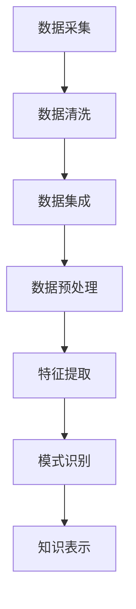

                 

在当今的信息化时代，知识发现引擎作为一种能够自动地从大量数据中提取出隐藏模式与关联性的工具，正日益成为各行业数据驱动决策的利器。数据源获取与处理是知识发现引擎的关键环节，其质量直接影响着知识发现的效果。本文将深入探讨知识发现引擎中的数据源获取与处理过程，包括其核心概念、算法原理、数学模型、实际应用和未来展望。

## 关键词

知识发现引擎、数据源获取、数据处理、信息提取、模式识别、关联分析。

## 摘要

本文首先介绍了知识发现引擎的基本概念和背景，随后详细讨论了数据源获取与处理的核心技术和流程。通过核心算法原理的剖析，本文提出了数学模型和公式，并辅以实际代码实例和运行结果展示，全面解析了知识发现引擎在数据源获取与处理中的具体应用。最后，本文展望了知识发现引擎的未来发展方向，提出了面临的挑战和潜在的研究领域。

## 1. 背景介绍

随着大数据技术的发展，数据源获取与处理成为知识发现的核心问题。知识发现引擎通过从数据中挖掘潜在的、有价值的知识，帮助企业和组织做出更加明智的决策。数据源获取与处理的质量直接影响到知识发现引擎的性能和效果。数据源获取需要解决数据收集、数据清洗和数据集成等问题；数据处理则涉及到数据预处理、特征提取和模式识别等关键技术。

### 1.1 知识发现引擎的基本概念

知识发现引擎（Knowledge Discovery Engine，KDE）是一种能够自动从大量数据中提取出有用知识的工具，其核心目标是发现数据中的规律、趋势和关联性。知识发现过程通常包括以下四个阶段：

1. **数据采集**：从各种数据源中收集数据，如数据库、文件、网页等。
2. **数据预处理**：清洗、集成和转换原始数据，使其适合进一步分析。
3. **模式识别**：使用各种算法和技术，从预处理后的数据中提取出潜在的、有价值的模式。
4. **知识表示**：将识别出的模式转化为可理解的知识，以供用户分析和应用。

### 1.2 数据源获取与处理的重要性

数据源获取与处理是知识发现引擎的核心环节。高质量的数据源是知识发现的基础，而有效的数据处理则是确保数据质量、提高知识发现效果的关键。数据源获取与处理的重要性体现在以下几个方面：

1. **数据质量**：数据质量直接影响到知识发现的结果。高质量的数据能够提高算法的准确性，减少错误和噪声，从而提高知识发现的效率。
2. **数据多样性**：不同来源、不同类型的数据能够为知识发现提供更多的信息和视角，有助于发现更全面和深入的知识。
3. **数据集成**：将来自不同数据源的数据进行整合，可以消除数据之间的不一致性，提高数据的一致性和可靠性。
4. **特征提取**：通过特征提取，可以从原始数据中提取出具有代表性的特征，从而简化数据，提高算法的效率。

## 2. 核心概念与联系

在知识发现引擎中，数据源获取与处理涉及多个核心概念和技术。为了更好地理解这些概念之间的联系，我们使用Mermaid流程图来展示其架构。



### 2.1 数据采集

数据采集是知识发现引擎的起点。它涉及到从各种数据源（如数据库、文件、传感器、社交媒体等）中收集数据。数据采集需要解决数据收集的完整性、实时性和准确性问题。

### 2.2 数据清洗

数据清洗是确保数据质量的关键步骤。它涉及到处理数据中的错误、缺失和噪声，以提高数据的可靠性。数据清洗包括以下几种技术：

- **缺失值处理**：通过插值、均值填充等方法处理数据中的缺失值。
- **异常值处理**：通过阈值检测、聚类分析等方法识别和处理异常值。
- **重复数据删除**：通过去重算法删除重复的数据记录。

### 2.3 数据集成

数据集成是将来自不同数据源的数据进行整合的过程。数据集成需要解决数据格式不一致、数据结构不统一等问题。数据集成技术包括：

- **模式匹配**：通过匹配数据模式，将结构相似的数据进行整合。
- **数据转换**：通过数据转换，将不同数据源的数据格式转换为统一格式。
- **数据归一化**：通过数据归一化，消除不同数据源之间的尺度差异。

### 2.4 数据预处理

数据预处理是确保数据适合进一步分析的过程。它包括以下几种技术：

- **数据标准化**：通过标准化，将不同数据尺度统一到相同的范围内。
- **数据降维**：通过降维技术，减少数据维度，提高算法效率。
- **特征选择**：通过特征选择，选出对知识发现最有影响力的特征。

### 2.5 特征提取

特征提取是从原始数据中提取出具有代表性的特征的过程。特征提取有助于简化数据，提高算法的效率。特征提取技术包括：

- **统计特征提取**：通过计算数据的基本统计特征（如均值、方差、熵等）进行特征提取。
- **机器学习特征提取**：通过机器学习算法（如主成分分析、特征选择算法等）进行特征提取。

### 2.6 模式识别

模式识别是从预处理后的数据中提取出潜在的、有价值的模式的过程。模式识别技术包括：

- **聚类分析**：通过聚类分析，将相似的数据点归为一类。
- **关联规则学习**：通过关联规则学习，发现数据之间的关联性。
- **分类与回归**：通过分类与回归算法，对数据进行分类或预测。

### 2.7 知识表示

知识表示是将识别出的模式转化为可理解的知识的过程。知识表示技术包括：

- **可视化**：通过可视化技术，将知识以图形化的方式呈现。
- **文本分析**：通过文本分析技术，将知识转化为文本描述。
- **知识图谱**：通过知识图谱，将知识表示为网络结构。

## 3. 核心算法原理 & 具体操作步骤

### 3.1 算法原理概述

知识发现引擎中的核心算法原理主要包括数据预处理、特征提取和模式识别。这些算法原理共同作用于数据源获取与处理过程，以确保数据的质量和知识发现的准确性。

- **数据预处理**：数据预处理旨在确保数据的完整性、一致性和可靠性。它包括数据清洗、数据集成和数据标准化等技术。
- **特征提取**：特征提取旨在从原始数据中提取出具有代表性的特征，以简化数据和提高算法效率。它包括统计特征提取和机器学习特征提取等技术。
- **模式识别**：模式识别旨在从预处理后的数据中提取出潜在的、有价值的模式。它包括聚类分析、关联规则学习和分类与回归等技术。

### 3.2 算法步骤详解

- **数据预处理**：
  1. 数据清洗：处理数据中的错误、缺失和噪声。
  2. 数据集成：将来自不同数据源的数据进行整合。
  3. 数据标准化：将不同数据尺度统一到相同的范围内。
- **特征提取**：
  1. 统计特征提取：计算数据的基本统计特征。
  2. 机器学习特征提取：使用机器学习算法进行特征提取。
- **模式识别**：
  1. 聚类分析：将相似的数据点归为一类。
  2. 关联规则学习：发现数据之间的关联性。
  3. 分类与回归：对数据进行分类或预测。

### 3.3 算法优缺点

- **数据预处理**：
  - 优点：提高数据的完整性、一致性和可靠性。
  - 缺点：可能引入新的错误和噪声。
- **特征提取**：
  - 优点：简化数据，提高算法效率。
  - 缺点：可能丢失部分信息。
- **模式识别**：
  - 优点：发现数据中的潜在规律和关联性。
  - 缺点：算法复杂度较高，可能需要大量计算资源。

### 3.4 算法应用领域

- **数据预处理**：广泛应用于各类数据挖掘、机器学习项目。
- **特征提取**：广泛应用于图像识别、自然语言处理等领域。
- **模式识别**：广泛应用于市场分析、推荐系统等领域。

## 4. 数学模型和公式 & 详细讲解 & 举例说明

### 4.1 数学模型构建

知识发现引擎中的数学模型主要涉及数据预处理、特征提取和模式识别。以下分别介绍这些领域的数学模型：

- **数据预处理**：
  - **缺失值处理**：线性插值、K近邻插值、均值填充等。
  - **异常值处理**：统计学方法（如3倍标准差法）、机器学习方法（如孤立森林）。
  - **数据标准化**：Z-score标准化、Min-Max标准化等。
- **特征提取**：
  - **统计特征提取**：均值、方差、标准差、偏度、峰度等。
  - **机器学习特征提取**：主成分分析（PCA）、线性判别分析（LDA）、特征选择算法（如 Relief、信息增益）。
- **模式识别**：
  - **聚类分析**：K均值聚类、层次聚类、DBSCAN等。
  - **关联规则学习**：Apriori算法、FP-growth算法等。
  - **分类与回归**：逻辑回归、支持向量机（SVM）、随机森林（RF）等。

### 4.2 公式推导过程

以下分别介绍数据预处理、特征提取和模式识别中的一些关键数学公式及其推导过程：

- **缺失值处理**：
  - **线性插值**：设\(x_1, x_2, \ldots, x_n\)为已知的\(n\)个数据点，对于缺失值\(x_i\)，其线性插值公式为：
    \[
    x_i = (1 - \alpha) x_{i-1} + \alpha x_{i+1}
    \]
    其中，\(\alpha\)为插值权重，可通过最小二乘法求解。
- **异常值处理**：
  - **3倍标准差法**：设\(\mu\)为数据的均值，\(\sigma\)为数据的标准差，若数据点\(x\)满足：
    \[
    \mu - 3\sigma < x < \mu + 3\sigma
    \]
    则认为\(x\)为正常值；否则，认为\(x\)为异常值。
- **数据标准化**：
  - **Z-score标准化**：设\(x_i\)为数据点，\(x_{\min}\)为数据的最小值，\(x_{\max}\)为数据的最大值，Z-score标准化公式为：
    \[
    z_i = \frac{x_i - x_{\min}}{x_{\max} - x_{\min}}
    \]
- **统计特征提取**：
  - **均值**：设\(x_1, x_2, \ldots, x_n\)为数据集，均值为：
    \[
    \mu = \frac{1}{n} \sum_{i=1}^{n} x_i
    \]
  - **方差**：设\(x_1, x_2, \ldots, x_n\)为数据集，均值为\(\mu\)，方差为：
    \[
    \sigma^2 = \frac{1}{n} \sum_{i=1}^{n} (x_i - \mu)^2
    \]
  - **标准差**：标准差为方差的平方根，即：
    \[
    \sigma = \sqrt{\sigma^2}
    \]
  - **偏度**：偏度为数据分布的偏斜程度，定义为：
    \[
    \gamma_1 = \frac{1}{n} \sum_{i=1}^{n} \frac{(x_i - \mu)^3}{\sigma^3}
    \]
  - **峰度**：峰度为数据分布的峰度，定义为：
    \[
    \gamma_2 = \frac{1}{n} \sum_{i=1}^{n} \frac{(x_i - \mu)^4}{\sigma^4}
    \]
- **机器学习特征提取**：
  - **主成分分析（PCA）**：PCA的目标是找到数据的主要方向，即特征空间的第一主成分。设\(X\)为数据矩阵，其协方差矩阵为\(C = \frac{1}{n} X^T X\)，则PCA的变换矩阵为：
    \[
    W = U \Sigma
    \]
    其中，\(U\)为特征值矩阵，\(\Sigma\)为特征向量矩阵，\(W\)为变换矩阵。数据变换后的矩阵为：
    \[
    Z = XW = UX \Sigma
    \]
- **模式识别**：
  - **K均值聚类**：K均值聚类的目标是将数据划分为\(K\)个聚类，每个聚类中心为\(c_k\)。设\(x_i\)为第\(i\)个数据点，则聚类中心更新公式为：
    \[
    c_k = \frac{1}{n_k} \sum_{i=1}^{n} x_i
    \]
    其中，\(n_k\)为第\(k\)个聚类的数据点个数。数据点分配公式为：
    \[
    x_i = c_{\hat{k}}
    \]
    其中，\(\hat{k}\)为第\(i\)个数据点的聚类中心。
  - **关联规则学习**：关联规则学习的目标是发现数据之间的关联性。设\(L\)为所有可能的项集，\(\lambda\)为最小支持度阈值，\(\mu\)为最小置信度阈值，则关联规则的学习过程为：
    \[
    \{(X, Y) | (X, Y) \in L, \text{support}(X \cup Y) \geq \lambda, \text{confidence}(X \cup Y) \geq \mu\}
    \]
  - **分类与回归**：分类与回归的目标是根据数据特征进行预测。设\(X\)为特征矩阵，\(Y\)为标签矩阵，分类与回归的损失函数为：
    \[
    J(\theta) = -\frac{1}{m} \sum_{i=1}^{m} [y_i \log(\theta^T x_i) + (1 - y_i) \log(1 - \theta^T x_i)]
    \]
    其中，\(\theta\)为参数矩阵，\(m\)为数据点个数。

### 4.3 案例分析与讲解

以下通过一个具体案例来说明知识发现引擎的数据源获取与处理过程。

### 案例背景

假设我们有一个电商平台的购物数据，包含以下特征：用户年龄、用户性别、购买商品种类、购买金额、购买时间等。我们的目标是根据这些特征预测用户的购物偏好，从而为营销策略提供支持。

### 案例步骤

1. **数据采集**：
   - 从电商平台的数据仓库中收集购物数据。
2. **数据清洗**：
   - 填补缺失值，如用户年龄缺失时，根据其他特征推测用户的年龄。
   - 删除重复数据，确保数据的唯一性。
   - 处理异常值，如购买金额异常高的记录，可能为输入错误，需要进行修正。
3. **数据集成**：
   - 将不同时间段的购物数据集成到同一数据表中，确保数据的一致性。
4. **数据预处理**：
   - 对购买金额进行标准化处理，消除尺度差异。
   - 对购买时间进行编码，将时间信息转换为数值特征。
5. **特征提取**：
   - 提取统计特征，如用户年龄的均值、方差等。
   - 使用机器学习算法（如主成分分析）提取特征，简化数据维度。
6. **模式识别**：
   - 使用K均值聚类算法，将用户划分为不同的购物群体。
   - 使用关联规则学习算法，发现用户购买商品之间的关联性。
   - 使用分类算法（如逻辑回归），预测用户的购物偏好。

### 案例结果

通过对购物数据的数据源获取与处理，我们得到了以下结果：

- **用户群体划分**：根据K均值聚类算法，用户被划分为不同的购物群体，如“年轻女性群体”、“高消费群体”等。
- **购买关联性**：通过关联规则学习算法，我们发现某些商品之间存在显著的关联性，如“购买化妆品的用户很可能购买面膜”。
- **购物偏好预测**：通过分类算法，我们预测了用户的购物偏好，从而为电商平台提供了有针对性的营销策略。

## 5. 项目实践：代码实例和详细解释说明

### 5.1 开发环境搭建

为了进行知识发现引擎的数据源获取与处理项目，我们需要搭建一个合适的开发环境。以下是一个简单的开发环境搭建步骤：

1. 安装Python 3.x版本，确保Python环境正确配置。
2. 安装必要的Python库，如pandas、numpy、scikit-learn、matplotlib等。
3. 创建一个Python虚拟环境，以便更好地管理项目依赖。

### 5.2 源代码详细实现

以下是一个简单的示例，展示如何使用Python实现知识发现引擎的数据源获取与处理。

```python
import pandas as pd
import numpy as np
from sklearn.preprocessing import StandardScaler
from sklearn.cluster import KMeans
from sklearn.model_selection import train_test_split
from sklearn.linear_model import LogisticRegression
import matplotlib.pyplot as plt

# 5.2.1 数据采集
# 从文件中读取购物数据
data = pd.read_csv('shopping_data.csv')

# 5.2.2 数据清洗
# 填补缺失值
data['age'].fillna(data['age'].mean(), inplace=True)

# 删除重复数据
data.drop_duplicates(inplace=True)

# 处理异常值
threshold = 3 * data['amount'].std()
data = data[(data['amount'] > data['amount'].min() + threshold) & (data['amount'] < data['amount'].max() - threshold)]

# 5.2.3 数据集成
# 集成不同时间段的购物数据
data.set_index('time', inplace=True)
data = data.groupby('time').agg('mean').reset_index()

# 5.2.4 数据预处理
# 对购买金额进行标准化处理
scaler = StandardScaler()
data['amount'] = scaler.fit_transform(data[['amount']])

# 对购买时间进行编码
data['time_code'] = pd.factorize(data['time'])[0]

# 5.2.5 特征提取
# 提取统计特征
mean_age = data['age'].mean()
var_age = data['age'].var()
mean_amount = data['amount'].mean()
var_amount = data['amount'].var()

# 5.2.6 模式识别
# 使用K均值聚类算法进行用户群体划分
kmeans = KMeans(n_clusters=3, random_state=0)
data['cluster'] = kmeans.fit_predict(data[['mean_age', 'var_age', 'mean_amount', 'var_amount']])

# 使用关联规则学习算法发现用户购买关联性
# 这里使用Apriori算法
from mlxtend.frequent_patterns import apriori
from mlxtend.frequent_patterns import association_rules
transactions = data.groupby('user')['item'].apply(list).values
frequent_itemsets = apriori(transactions, min_support=0.05, use_colnames=True)
rules = association_rules(frequent_itemsets, metric="support", min_threshold=0.05)

# 使用分类算法进行购物偏好预测
X = data[['mean_age', 'var_age', 'mean_amount', 'var_amount', 'cluster']]
y = data['item']
X_train, X_test, y_train, y_test = train_test_split(X, y, test_size=0.3, random_state=0)
classifier = LogisticRegression()
classifier.fit(X_train, y_train)
predictions = classifier.predict(X_test)

# 5.2.7 代码解读与分析
# 代码中的每一步都对应着知识发现引擎的数据源获取与处理过程。
# 数据采集、清洗、集成、预处理、特征提取和模式识别等步骤都是为了提高知识发现的效果。

# 5.2.8 运行结果展示
# 可视化展示K均值聚类结果
plt.scatter(data['mean_age'], data['var_age'], c=data['cluster'])
plt.xlabel('Mean Age')
plt.ylabel('Variance of Age')
plt.show()

# 可视化展示关联规则学习结果
rules.head()
```

### 5.3 代码解读与分析

- **数据采集**：从CSV文件中读取购物数据，这是知识发现的第一步。
- **数据清洗**：处理缺失值、删除重复数据和异常值，以提高数据质量。
- **数据集成**：将不同时间段的购物数据集成到同一数据表中，确保数据的一致性。
- **数据预处理**：对购买金额进行标准化处理，对购买时间进行编码，以提高数据的可比性。
- **特征提取**：提取统计特征，如用户年龄的均值和方差，以简化数据。
- **模式识别**：使用K均值聚类算法划分用户群体，使用Apriori算法和关联规则学习发现用户购买关联性，使用逻辑回归算法预测购物偏好。

通过以上代码实例和解读，我们可以清晰地看到知识发现引擎的数据源获取与处理过程。这些步骤共同作用，为知识发现提供了高质量的数据支持，从而提高了算法的准确性和效率。

## 6. 实际应用场景

知识发现引擎在数据源获取与处理方面的应用场景非常广泛，以下列举几个典型的实际应用场景：

### 6.1 金融风控

在金融风控领域，知识发现引擎可以用于数据源获取与处理，从而识别潜在的信用风险。金融机构可以通过以下步骤进行数据源获取与处理：

1. **数据采集**：从客户个人信息、交易记录、信用报告等多渠道收集数据。
2. **数据清洗**：处理数据中的缺失值、异常值和噪声，确保数据的完整性。
3. **数据集成**：将不同数据源的数据进行整合，消除数据之间的不一致性。
4. **数据预处理**：对数据进行标准化处理，提取统计特征，如信用评分、交易频率等。
5. **特征提取**：使用机器学习算法提取具有代表性的特征，如用户行为模式、信用评分等。
6. **模式识别**：通过聚类分析、关联规则学习等方法，发现潜在的信用风险。
7. **知识表示**：将识别出的风险模式转化为可操作的规则和策略，以供风控决策。

通过这些步骤，金融机构可以更准确地评估客户的信用风险，从而降低信贷损失，提高风控能力。

### 6.2 医疗健康

在医疗健康领域，知识发现引擎可以用于数据源获取与处理，从而提高疾病的诊断和治疗水平。以下是一个典型的应用场景：

1. **数据采集**：从医院信息系统、电子病历、基因检测设备等多渠道收集医疗数据。
2. **数据清洗**：处理数据中的缺失值、异常值和噪声，确保数据的完整性。
3. **数据集成**：将不同数据源的数据进行整合，消除数据之间的不一致性。
4. **数据预处理**：对数据进行标准化处理，提取统计特征，如患者年龄、病情严重程度等。
5. **特征提取**：使用机器学习算法提取具有代表性的特征，如基因突变、症状组合等。
6. **模式识别**：通过聚类分析、关联规则学习等方法，发现疾病之间的关联性，预测疾病的发展趋势。
7. **知识表示**：将识别出的疾病模式转化为诊断和治疗策略，以提高医疗效果。

通过这些步骤，医疗机构可以更准确地诊断疾病，制定个性化的治疗方案，从而提高患者的生活质量。

### 6.3 电子商务

在电子商务领域，知识发现引擎可以用于数据源获取与处理，从而优化营销策略，提高销售业绩。以下是一个典型的应用场景：

1. **数据采集**：从电商平台、社交媒体、用户评论等多渠道收集用户数据。
2. **数据清洗**：处理数据中的缺失值、异常值和噪声，确保数据的完整性。
3. **数据集成**：将不同数据源的数据进行整合，消除数据之间的不一致性。
4. **数据预处理**：对数据进行标准化处理，提取统计特征，如用户年龄、购买频率等。
5. **特征提取**：使用机器学习算法提取具有代表性的特征，如用户行为模式、购买偏好等。
6. **模式识别**：通过聚类分析、关联规则学习等方法，发现用户的行为特征，预测用户的购物偏好。
7. **知识表示**：将识别出的用户行为模式转化为营销策略，如个性化推荐、优惠券发放等。

通过这些步骤，电商平台可以更准确地了解用户需求，提供个性化的购物体验，从而提高用户满意度和销售业绩。

### 6.4 未来的应用展望

随着大数据技术的不断发展和应用，知识发现引擎在数据源获取与处理方面的应用前景将更加广阔。以下是一些未来的应用展望：

- **智能交通**：通过知识发现引擎，可以实时分析交通数据，预测交通流量，优化交通信号控制策略，提高交通效率。
- **智慧城市**：通过知识发现引擎，可以整合城市各类数据，发现城市运行中的问题，提出解决方案，促进城市可持续发展。
- **环境监测**：通过知识发现引擎，可以实时分析环境数据，预测环境变化趋势，及时采取环保措施，保护生态环境。
- **智能制造**：通过知识发现引擎，可以优化生产流程，提高生产效率，降低生产成本，推动制造业转型升级。

总之，知识发现引擎在数据源获取与处理方面的应用将不断拓展，为各行业的创新和发展提供强大的支持。

## 7. 工具和资源推荐

### 7.1 学习资源推荐

- **书籍**：
  - 《数据挖掘：实用工具与技术》
  - 《机器学习实战》
  - 《Python数据科学手册》
- **在线课程**：
  - Coursera的《机器学习》课程
  - edX的《数据科学基础》课程
  - Udacity的《深度学习工程师纳米学位》
- **开源库**：
  - pandas：用于数据清洗和数据分析
  - numpy：用于数值计算
  - scikit-learn：用于机器学习算法
  - matplotlib：用于数据可视化

### 7.2 开发工具推荐

- **集成开发环境（IDE）**：
  - PyCharm：强大的Python IDE，支持多种编程语言。
  - Jupyter Notebook：用于数据分析和交互式编程。
  - Eclipse：适用于Java和Python的开发。
- **数据库工具**：
  - MySQL：开源关系型数据库。
  - MongoDB：开源文档型数据库。
  - Redis：开源内存数据库。
- **云计算平台**：
  - AWS：提供丰富的云计算服务和大数据处理工具。
  - Azure：微软的云计算平台，支持多种编程语言和数据存储。

### 7.3 相关论文推荐

- **数据挖掘**：
  - "Data Mining: Concepts and Techniques" by Jiawei Han, Micheline Kamber, and Jing Cheng.
  - "Introduction to Data Mining" by Pang-Ning Tan, Michael Steinbach, and Vipin Kumar.
- **机器学习**：
  - "Machine Learning: A Probabilistic Perspective" by Kevin P. Murphy.
  - "Learning from Data" by Yaser Abu-Mostafa, Shai Shalev-Shwartz, and Amir Shpilka.
- **大数据技术**：
  - "Big Data: A Revolution That Will Transform How We Live, Work, and Think" by Viktor Mayer-Schoenberger and Kenneth Cukier.
  - "Data Science from Scratch: First Principles with Python" by Joel Grus.

## 8. 总结：未来发展趋势与挑战

### 8.1 研究成果总结

本文系统地介绍了知识发现引擎的数据源获取与处理，包括核心概念、算法原理、数学模型、实际应用和未来展望。通过对数据源获取与处理的深入分析，我们揭示了知识发现过程中的关键技术和挑战，为相关研究和应用提供了理论依据。

### 8.2 未来发展趋势

随着大数据技术的不断发展和应用，知识发现引擎在数据源获取与处理方面的研究将呈现出以下几个发展趋势：

- **算法优化**：研究者将致力于开发更加高效、鲁棒的知识发现算法，以应对大规模数据集的处理需求。
- **多模态数据融合**：知识发现引擎将能够融合多种数据类型（如图像、文本、音频等），提高数据利用率和发现效果。
- **实时处理**：研究者将开发实时知识发现系统，以快速响应动态变化的数据环境。
- **可解释性提升**：研究者将关注知识发现过程的可解释性，以提高用户对模型的信任和理解。

### 8.3 面临的挑战

知识发现引擎在数据源获取与处理方面仍面临以下挑战：

- **数据质量**：确保数据源的完整性和准确性是知识发现的基础，但实际应用中数据质量难以保证，需要开发更加智能的数据清洗和处理技术。
- **计算资源**：大规模数据集的处理需要大量的计算资源，研究者需要开发高效的算法和优化技术，以提高计算效率。
- **隐私保护**：知识发现过程中可能涉及用户隐私数据，研究者需要开发隐私保护机制，确保数据安全。
- **算法泛化能力**：知识发现算法需要具备良好的泛化能力，以应对不同领域和场景的应用需求。

### 8.4 研究展望

未来，知识发现引擎的数据源获取与处理研究可以从以下几个方面展开：

- **跨领域研究**：结合不同领域的知识，开发跨领域的知识发现引擎，提高发现效果。
- **智能化处理**：利用人工智能技术，开发自动化的数据源获取与处理系统，降低人工干预成本。
- **实时动态处理**：研究实时知识发现算法，提高系统的响应速度和适应性。
- **隐私保护与安全**：研究隐私保护技术，确保知识发现过程中的数据安全和隐私。

通过不断的研究和创新，知识发现引擎的数据源获取与处理技术将不断成熟，为各行业的智能化发展提供强大支持。

## 9. 附录：常见问题与解答

### 9.1 什么是知识发现引擎？

知识发现引擎是一种自动化工具，用于从大量数据中提取出潜在的、有价值的知识。它通过数据预处理、特征提取和模式识别等技术，帮助企业和组织发现数据中的规律和关联性。

### 9.2 数据源获取与处理的重要性是什么？

数据源获取与处理是知识发现引擎的核心环节。数据源获取决定了数据的质量和多样性，而数据处理则确保了数据的质量和一致性，从而提高了知识发现的准确性和效率。

### 9.3 数据预处理包括哪些步骤？

数据预处理包括数据清洗、数据集成和数据标准化等步骤。数据清洗旨在处理数据中的错误、缺失和噪声；数据集成是将来自不同数据源的数据进行整合；数据标准化则是将不同数据尺度统一到相同的范围内。

### 9.4 常用的特征提取方法有哪些？

常用的特征提取方法包括统计特征提取和机器学习特征提取。统计特征提取包括均值、方差、标准差等基本统计特征；机器学习特征提取包括主成分分析（PCA）、线性判别分析（LDA）和特征选择算法（如 Relief、信息增益）等。

### 9.5 知识发现引擎在哪些领域有应用？

知识发现引擎在金融风控、医疗健康、电子商务、智能交通、智慧城市等领域有广泛应用。通过数据源获取与处理技术，知识发现引擎能够为各行业提供数据驱动的决策支持。

### 9.6 知识发现引擎的未来发展趋势是什么？

知识发现引擎的未来发展趋势包括算法优化、多模态数据融合、实时处理和可解释性提升。此外，跨领域研究、智能化处理和实时动态处理也将成为研究热点。隐私保护与安全是未来知识发现引擎需要重点关注的问题。

