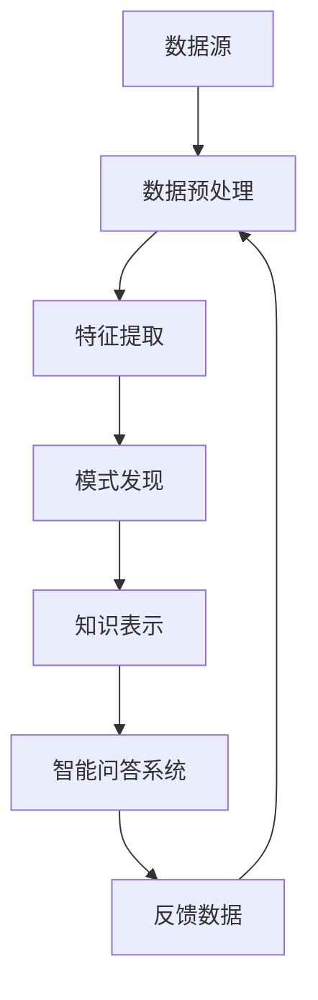
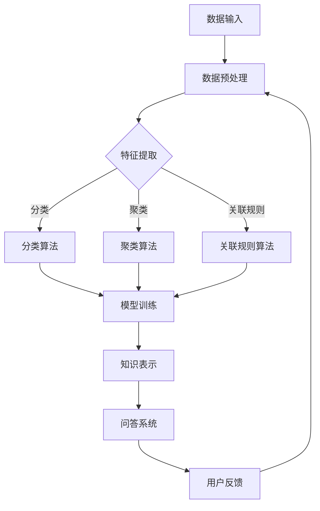

                 

### 1. 背景介绍

知识发现引擎作为人工智能领域的核心组件之一，旨在从大量数据中自动提取有价值的信息和知识。而智能问答系统则是一个能够理解和回答用户问题的交互式系统，二者结合能够提供更加智能化和高效的解决方案。本文将探讨知识发现引擎与智能问答系统的集成，从核心概念、算法原理、数学模型、项目实践等方面进行深入分析，以期为读者提供一个全面的技术指南。

随着大数据和云计算的迅猛发展，数据量呈指数级增长。传统的数据处理和分析方法已经无法满足日益增长的数据需求和复杂的问题解决场景。知识发现引擎通过数据挖掘技术，从海量数据中提取隐藏的模式、趋势和知识，为决策支持和智能应用提供了强有力的支持。智能问答系统则通过自然语言处理和机器学习等技术，实现了人与计算机之间的自然对话，为用户提供了一种便捷的交互方式。

知识发现引擎和智能问答系统的结合，不仅能够提高数据处理的效率，还能够为用户提供更加个性化和智能化的服务。例如，在医疗领域，知识发现引擎可以从海量的医疗数据中提取有关疾病的特征和趋势，智能问答系统则可以为医生和患者提供实时的健康咨询和建议；在教育领域，知识发现引擎可以分析学生的学习行为和成绩数据，智能问答系统则可以为学生提供个性化的学习计划和指导。

本文将围绕知识发现引擎的智能问答系统集成，从以下几个方面展开：

- **核心概念与联系**：介绍知识发现引擎和智能问答系统的核心概念及其相互关系。
- **核心算法原理 & 具体操作步骤**：详细讲解知识发现引擎和智能问答系统的核心算法原理和具体实现步骤。
- **数学模型和公式**：介绍知识发现引擎和智能问答系统中的数学模型和公式，并进行举例说明。
- **项目实践**：通过实际项目实例，展示知识发现引擎和智能问答系统的集成应用。
- **实际应用场景**：分析知识发现引擎和智能问答系统的实际应用场景和未来展望。
- **工具和资源推荐**：推荐相关的学习资源和开发工具，帮助读者深入学习和实践。
- **总结**：总结研究成果，展望未来的发展趋势和挑战。

通过本文的阅读，读者将对知识发现引擎和智能问答系统的集成有更深入的了解，能够为实际项目提供技术支持和参考。

<|assistant|>### 2. 核心概念与联系

在探讨知识发现引擎与智能问答系统的集成之前，我们需要首先了解它们的核心概念及其之间的联系。

#### 2.1 知识发现引擎

知识发现引擎（Knowledge Discovery Engine）是一种通过数据挖掘技术，从大规模数据集中自动发现隐藏模式、趋势和知识的方法论。它主要包括以下几个核心组件：

1. **数据预处理**：包括数据清洗、归一化、去重等操作，以保证数据的准确性和一致性。
2. **特征提取**：通过将原始数据进行转换和抽象，提取出有代表性的特征，用于后续的模式发现。
3. **模式发现**：运用各种算法，如聚类、分类、关联规则挖掘等，从数据中发现潜在的模式和关系。
4. **知识表示**：将发现的模式转化为结构化的知识，如规则库、数据模型等，以供后续应用。

知识发现引擎的核心目标是从大规模、复杂和动态的数据集中提取有价值的信息，为决策支持、数据分析和智能应用提供基础。

#### 2.2 智能问答系统

智能问答系统（Intelligent Question-Answering System）是一种基于自然语言处理（NLP）和机器学习技术的交互系统，能够理解用户的自然语言问题，并生成准确的答案。智能问答系统的核心组件包括：

1. **问题解析**：通过对输入问题的分词、词性标注、命名实体识别等操作，将自然语言问题转化为结构化的查询。
2. **答案检索**：在知识库或数据库中检索与问题相关的信息，通常采用基于关键词匹配、语义相似度计算等方法。
3. **答案生成**：根据检索结果，运用模板匹配、文本生成模型等技术，生成自然语言形式的答案。

智能问答系统的目标是实现人与计算机之间的自然对话，为用户提供实时、准确和有针对性的答案。

#### 2.3 知识发现引擎与智能问答系统的联系

知识发现引擎和智能问答系统在人工智能领域中具有紧密的联系，它们共同构成了一个闭环系统，相互促进，实现了从数据到知识的转化。

1. **知识发现引擎为智能问答系统提供数据基础**：知识发现引擎通过数据挖掘技术，从海量数据中提取出有价值的信息和知识，这些信息和知识可以为智能问答系统提供丰富的数据支持，使其能够回答更为复杂和多样化的问题。

2. **智能问答系统为知识发现引擎提供反馈**：智能问答系统的应用场景和用户交互过程，可以产生大量的反馈数据。这些数据可以用于评估知识发现引擎的性能，帮助其不断优化和改进，提高知识提取的准确性和有效性。

3. **知识发现引擎与智能问答系统相互融合**：在集成应用中，知识发现引擎和智能问答系统可以相互融合，形成一个高效的知识服务体系。例如，在医疗领域，知识发现引擎可以从医疗数据中提取疾病特征和趋势，智能问答系统则可以为医生和患者提供个性化的健康咨询和建议。

为了更直观地展示知识发现引擎和智能问答系统的相互关系，我们可以使用Mermaid流程图进行描述：



在上述流程图中，数据源经过数据预处理、特征提取、模式发现和知识表示等步骤，最终生成结构化的知识，这些知识被用于智能问答系统的回答生成。智能问答系统的反馈数据则用于优化知识发现引擎的性能。

通过上述介绍，我们可以看出，知识发现引擎和智能问答系统在人工智能领域中具有重要的作用，它们的结合为智能化的数据分析和应用提供了强有力的支持。在接下来的章节中，我们将进一步探讨知识发现引擎和智能问答系统的核心算法原理、数学模型、项目实践等具体内容。

#### 2.4 Mermaid 流程图（Mermaid 流程节点中不要有括号、逗号等特殊字符）

以下是知识发现引擎与智能问答系统集成的Mermaid流程图：



在这个流程图中，数据经过预处理后，可以通过不同的特征提取方法生成特征。这些特征可以用于分类、聚类和关联规则挖掘等算法，从而生成知识。知识表示模块将知识转化为结构化数据，供问答系统使用。问答系统的用户反馈则用于进一步优化数据预处理和特征提取过程。

#### 2.5 核心算法原理 & 具体操作步骤

在本章节中，我们将详细探讨知识发现引擎和智能问答系统的核心算法原理及其具体操作步骤，包括分类算法、聚类算法和关联规则挖掘算法。

##### 2.5.1 算法原理概述

1. **分类算法**：分类算法是一种将数据集中的实例分配到预定义的类别中的方法。常见的分类算法包括决策树、支持向量机（SVM）和随机森林等。分类算法的核心目标是构建一个模型，该模型能够在新的实例上准确预测其类别。

2. **聚类算法**：聚类算法是一种将数据集中的实例划分为若干个组（簇），使得同一个簇内的实例之间相似度较高，不同簇之间的实例相似度较低。常见的聚类算法包括K-means、层次聚类和DBSCAN等。聚类算法的核心目标是发现数据中的潜在结构和模式。

3. **关联规则挖掘算法**：关联规则挖掘算法是一种发现数据集中项之间的关联关系的方法。常见的关联规则挖掘算法包括Apriori算法和Eclat算法等。关联规则挖掘的核心目标是发现同时出现的项之间的规律和模式。

##### 2.5.2 分类算法步骤详解

1. **决策树**：决策树是一种基于树形结构进行分类的方法。具体步骤如下：
    - 计算所有属性对于目标类别的增益率，选择增益率最大的属性作为分裂属性。
    - 根据分裂属性将数据集划分为若干个子集。
    - 对于每个子集，重复上述步骤，直至达到预设的条件（如最大深度、最小样本数等）。

2. **支持向量机（SVM）**：支持向量机是一种基于最大间隔的分类方法。具体步骤如下：
    - 构建特征空间，将原始数据映射到高维空间。
    - 在高维空间中寻找一个最优的超平面，使得正负样本之间的间隔最大化。
    - 根据超平面划分数据集，为新样本进行分类。

3. **随机森林**：随机森林是一种基于集成学习的分类方法。具体步骤如下：
    - 从原始数据集中随机抽取样本子集，构建多个决策树。
    - 对于新样本，在所有决策树上进行分类，并取多数表决的结果作为最终分类结果。

##### 2.5.3 聚类算法步骤详解

1. **K-means**：K-means是一种基于距离测量的聚类方法。具体步骤如下：
    - 随机选择K个初始聚类中心。
    - 计算每个数据点到聚类中心的距离，并将其分配到最近的聚类中心。
    - 重新计算每个聚类的中心。
    - 重复上述步骤，直至聚类中心不再变化或达到预设的最大迭代次数。

2. **层次聚类**：层次聚类是一种基于层次结构的聚类方法。具体步骤如下：
    - 计算所有数据点之间的距离，将距离最近的数据点合并为一个簇。
    - 重新计算簇之间的距离，并再次合并距离最近的簇。
    - 重复上述步骤，直至合并所有的数据点。

3. **DBSCAN**：DBSCAN是一种基于密度的聚类方法。具体步骤如下：
    - 选择一个邻域半径ε和最小样本数minPts。
    - 对于每个数据点，检查其邻域内的数据点数量是否大于minPts。
    - 将邻域内的数据点划分为核心点、边界点和噪声点。
    - 以核心点为中心，扩展形成簇。

##### 2.5.4 关联规则挖掘算法步骤详解

1. **Apriori算法**：Apriori算法是一种基于支持度和置信度的关联规则挖掘算法。具体步骤如下：
    - 构建候选项集，计算每个项集的支持度。
    - 选择支持度大于最小支持度的项集作为频繁项集。
    - 构建所有可能的关联规则，并计算其置信度。
    - 选择置信度大于最小置信度的关联规则。

2. **Eclat算法**：Eclat算法是一种基于频繁项集的关联规则挖掘算法。具体步骤如下：
    - 构建候选1项集，计算其支持度。
    - 选择支持度大于最小支持度的1项集作为频繁1项集。
    - 对于每个频繁1项集，构建候选2项集，并计算其支持度。
    - 重复上述步骤，直至构建出所有的频繁项集。

##### 2.5.5 算法优缺点

1. **分类算法**：
    - **优点**：分类算法可以对新实例进行准确的分类，预测结果可解释性强。
    - **缺点**：分类算法对训练数据集的大小和特征的选择有较高的要求，算法复杂度较高。

2. **聚类算法**：
    - **优点**：聚类算法不需要预先定义类别，能够自动发现数据中的潜在结构和模式。
    - **缺点**：聚类算法对噪声和异常值敏感，聚类结果的可解释性较差。

3. **关联规则挖掘算法**：
    - **优点**：关联规则挖掘算法能够发现数据集中项之间的关联关系，适用于市场篮子分析和推荐系统。
    - **缺点**：关联规则挖掘算法生成的规则数量较多，需要进一步筛选和优化。

##### 2.5.6 算法应用领域

1. **分类算法**：分类算法广泛应用于金融风控、信用评分、医疗诊断等领域，例如银行可以基于客户的历史交易数据，预测其信用风险。

2. **聚类算法**：聚类算法广泛应用于数据挖掘、图像处理、生物信息学等领域，例如在生物信息学中，可以使用聚类算法对基因组数据进行分析。

3. **关联规则挖掘算法**：关联规则挖掘算法广泛应用于市场篮子分析、推荐系统、零售行业等领域，例如超市可以根据购买数据，推荐相关的商品。

通过上述内容，我们对知识发现引擎和智能问答系统的核心算法原理和具体操作步骤有了详细的了解。在接下来的章节中，我们将进一步探讨数学模型和公式的构建及其在知识发现引擎和智能问答系统中的应用。

### 3. 核心算法原理 & 具体操作步骤

在前面章节中，我们介绍了知识发现引擎和智能问答系统的核心概念和相互关系。本章节将进一步深入探讨这些系统的核心算法原理，包括分类算法、聚类算法和关联规则挖掘算法的具体操作步骤。

#### 3.1 分类算法原理概述

分类算法是一种将数据集中的实例分配到预定义的类别中的方法。常见的分类算法包括决策树、支持向量机（SVM）和随机森林等。以下是这些算法的原理概述：

1. **决策树**：决策树是一种基于树形结构进行分类的方法。它通过一系列的决策规则，将数据集中的实例逐层划分到各个类别。具体步骤如下：
   - 计算所有属性对于目标类别的增益率，选择增益率最大的属性作为分裂属性。
   - 根据分裂属性将数据集划分为若干个子集。
   - 对于每个子集，重复上述步骤，直至达到预设的条件（如最大深度、最小样本数等）。

2. **支持向量机（SVM）**：支持向量机是一种基于最大间隔的分类方法。它通过构建一个最优的超平面，将数据集中的正负样本分隔开。具体步骤如下：
   - 将原始数据映射到高维空间，找到最优的超平面。
   - 训练一个线性分类器，用于对新实例进行分类。

3. **随机森林**：随机森林是一种基于集成学习的分类方法。它通过构建多个决策树，并将它们的结果进行投票，得出最终的分类结果。具体步骤如下：
   - 从原始数据集中随机抽取样本子集，构建多个决策树。
   - 对于新样本，在所有决策树上进行分类，并取多数表决的结果作为最终分类结果。

#### 3.2 分类算法步骤详解

1. **决策树**：
   - **构建决策树**：首先计算每个属性对于目标类别的增益率，选择增益率最大的属性作为分裂属性。然后根据这个属性，将数据集划分为若干个子集。对于每个子集，重复上述步骤，构建决策树。
   - **剪枝**：为了防止过拟合，需要对决策树进行剪枝。常用的剪枝方法包括成本复杂性剪枝和最小偏差剪枝等。

2. **支持向量机（SVM）**：
   - **特征空间映射**：首先将原始数据映射到高维空间，找到最优的超平面。常用的映射方法包括线性映射和核映射。
   - **分类器训练**：在特征空间中训练一个线性分类器，用于对新实例进行分类。对于非线性问题，可以使用核函数将数据映射到高维空间，然后训练线性分类器。

3. **随机森林**：
   - **构建决策树**：从原始数据集中随机抽取样本子集，构建多个决策树。每个决策树独立训练，不共享数据。
   - **分类**：对于新样本，在所有决策树上进行分类，并取多数表决的结果作为最终分类结果。

#### 3.3 聚类算法原理概述

聚类算法是一种将数据集中的实例划分为若干个组（簇），使得同一个簇内的实例之间相似度较高，不同簇之间的实例相似度较低的方法。常见的聚类算法包括K-means、层次聚类和DBSCAN等。以下是这些算法的原理概述：

1. **K-means**：K-means是一种基于距离测量的聚类方法。它通过迭代优化聚类中心，将数据点划分为K个簇。具体步骤如下：
   - 随机选择K个初始聚类中心。
   - 计算每个数据点到聚类中心的距离，并将其分配到最近的聚类中心。
   - 重新计算每个聚类的中心。
   - 重复上述步骤，直至聚类中心不再变化或达到预设的最大迭代次数。

2. **层次聚类**：层次聚类是一种基于层次结构的聚类方法。它通过逐步合并或分裂簇，形成层次结构。具体步骤如下：
   - 计算所有数据点之间的距离，将距离最近的数据点合并为一个簇。
   - 重新计算簇之间的距离，并再次合并距离最近的簇。
   - 重复上述步骤，直至合并所有的数据点。

3. **DBSCAN**：DBSCAN是一种基于密度的聚类方法。它通过计算数据点的邻域密度，将数据点划分为核心点、边界点和噪声点。具体步骤如下：
   - 选择一个邻域半径ε和最小样本数minPts。
   - 对于每个数据点，检查其邻域内的数据点数量是否大于minPts。
   - 将邻域内的数据点划分为核心点、边界点和噪声点。
   - 以核心点为中心，扩展形成簇。

#### 3.4 聚类算法步骤详解

1. **K-means**：
   - **初始化聚类中心**：随机选择K个初始聚类中心。
   - **分配数据点**：计算每个数据点到聚类中心的距离，并将其分配到最近的聚类中心。
   - **更新聚类中心**：重新计算每个聚类的中心。
   - **迭代**：重复上述步骤，直至聚类中心不再变化或达到预设的最大迭代次数。

2. **层次聚类**：
   - **计算距离**：计算所有数据点之间的距离。
   - **合并簇**：将距离最近的数据点合并为一个簇。
   - **更新距离**：重新计算簇之间的距离。
   - **迭代**：重复上述步骤，直至合并所有的数据点。

3. **DBSCAN**：
   - **选择邻域半径ε和最小样本数minPts**：根据数据分布选择合适的邻域半径和最小样本数。
   - **检查邻域**：对于每个数据点，检查其邻域内的数据点数量是否大于minPts。
   - **划分点**：根据邻域检查结果，将数据点划分为核心点、边界点和噪声点。
   - **扩展簇**：以核心点为中心，扩展形成簇。

#### 3.5 关联规则挖掘算法原理概述

关联规则挖掘算法是一种发现数据集中项之间关联关系的方法。常见的关联规则挖掘算法包括Apriori算法和Eclat算法等。以下是这些算法的原理概述：

1. **Apriori算法**：Apriori算法是一种基于支持度和置信度的关联规则挖掘算法。它通过迭代生成频繁项集，并从中提取关联规则。具体步骤如下：
   - 构建候选1项集，计算其支持度。
   - 选择支持度大于最小支持度的1项集作为频繁1项集。
   - 对于每个频繁1项集，构建候选2项集，并计算其支持度。
   - 重复上述步骤，直至构建出所有的频繁项集。
   - 构建所有可能的关联规则，并计算其置信度。
   - 选择置信度大于最小置信度的关联规则。

2. **Eclat算法**：Eclat算法是一种基于频繁项集的关联规则挖掘算法。它通过逐层生成候选项集，并计算其支持度。具体步骤如下：
   - 构建候选1项集，计算其支持度。
   - 选择支持度大于最小支持度的1项集作为频繁1项集。
   - 对于每个频繁1项集，构建候选2项集，并计算其支持度。
   - 重复上述步骤，直至构建出所有的频繁项集。

#### 3.6 关联规则挖掘算法步骤详解

1. **Apriori算法**：
   - **构建候选项集**：首先构建候选1项集，然后逐步构建更高阶的候选项集。
   - **计算支持度**：对于每个候选项集，计算其在数据集中的支持度。
   - **生成频繁项集**：选择支持度大于最小支持度的项集作为频繁项集。
   - **提取关联规则**：对于每个频繁项集，构建所有可能的关联规则，并计算其置信度。
   - **筛选规则**：选择置信度大于最小置信度的关联规则。

2. **Eclat算法**：
   - **构建候选项集**：首先构建候选1项集，然后逐步构建更高阶的候选项集。
   - **计算支持度**：对于每个候选项集，计算其在数据集中的支持度。
   - **生成频繁项集**：选择支持度大于最小支持度的项集作为频繁项集。

通过以上内容，我们详细介绍了知识发现引擎和智能问答系统的核心算法原理及其具体操作步骤。这些算法为知识发现和智能问答提供了理论基础和实现方法，为实际应用提供了有力支持。

### 3.3 算法优缺点

在上一章节中，我们详细介绍了分类算法、聚类算法和关联规则挖掘算法的基本原理和操作步骤。在本章节中，我们将对这些算法的优缺点进行深入分析，并探讨它们在不同应用场景中的适用性。

#### 3.3.1 分类算法的优缺点

1. **决策树**：
   - **优点**：
     - 决策树易于理解和解释，人类可以直观地理解决策过程。
     - 决策树可以自动处理不同特征的重要性，避免了人工选择特征的繁琐过程。
     - 决策树可以处理多类别问题，具有较好的泛化能力。
   - **缺点**：
     - 决策树容易过拟合，特别是在数据集较小或特征较多时。
     - 决策树的计算复杂度较高，特别是在大规模数据集上。
     - 决策树不能很好地处理不均衡数据集，可能导致分类结果偏向大多数类别。

2. **支持向量机（SVM）**：
   - **优点**：
     - SVM在处理高维空间问题时表现优秀，能够实现很好的分类效果。
     - SVM具有较强的泛化能力，可以在不同类型的数据集上取得较好的结果。
     - SVM可以处理非线性问题，通过核函数将数据映射到高维空间，实现线性分类。
   - **缺点**：
     - SVM的训练时间较长，特别是对于大规模数据集和高维空间问题。
     - SVM对参数选择敏感，需要通过交叉验证等方法进行参数调优。
     - SVM不能直接处理多类别问题，需要通过投票等方法进行扩展。

3. **随机森林**：
   - **优点**：
     - 随机森林具有很好的泛化能力，通过构建多个决策树，减少了过拟合现象。
     - 随机森林对噪声和异常值具有较强的鲁棒性，能够处理不均衡数据集。
     - 随机森林可以用于回归和分类问题，适用范围较广。
   - **缺点**：
     - 随机森林的计算复杂度较高，需要训练多个决策树。
     - 随机森林的解释性较差，难以直观理解每个特征的重要性。

#### 3.3.2 聚类算法的优缺点

1. **K-means**：
   - **优点**：
     - K-means算法简单易懂，易于实现和优化。
     - K-means算法在处理大规模数据集时效率较高，能够快速收敛到聚类结果。
     - K-means算法可以处理不同维度的数据，适用于高维空间聚类问题。
   - **缺点**：
     - K-means算法对初始聚类中心的选择敏感，可能导致局部最优解。
     - K-means算法在处理噪声和异常值时效果较差，可能导致聚类结果不准确。
     - K-means算法不能直接处理聚类个数未知的问题，需要事先指定聚类个数。

2. **层次聚类**：
   - **优点**：
     - 层次聚类能够自动确定聚类个数，无需事先指定。
     - 层次聚类生成的层次结构有助于理解数据分布和聚类过程。
     - 层次聚类适用于不同类型的数据，如数值型、类别型和文本数据。
   - **缺点**：
     - 层次聚类的时间复杂度较高，对于大规模数据集可能需要较长时间。
     - 层次聚类对于噪声和异常值较为敏感，可能导致聚类结果不准确。
     - 层次聚类无法直接应用于分类任务，需要进一步处理聚类结果。

3. **DBSCAN**：
   - **优点**：
     - DBSCAN算法能够自动确定聚类个数，无需事先指定。
     - DBSCAN算法对噪声和异常值具有较强的鲁棒性，能够处理非均匀分布的数据。
     - DBSCAN算法适用于各种类型的数据，包括高维空间和异构数据。
   - **缺点**：
     - DBSCAN算法的时间复杂度较高，对于大规模数据集可能需要较长时间。
     - DBSCAN算法对于参数的选择敏感，需要根据数据特点进行合理设置。

#### 3.3.3 关联规则挖掘算法的优缺点

1. **Apriori算法**：
   - **优点**：
     - Apriori算法能够高效地挖掘大规模数据集的频繁项集。
     - Apriori算法对于稀疏数据集具有较好的处理能力，能够挖掘出潜在关联关系。
     - Apriori算法易于实现和理解，适用于各种类型的关联规则挖掘任务。
   - **缺点**：
     - Apriori算法的时间复杂度较高，特别是对于大规模数据集和长事务数据。
     - Apriori算法无法处理动态数据集，需要频繁地重新计算频繁项集。
     - Apriori算法对于最小支持度和置信度参数的选择敏感，可能影响挖掘结果。

2. **Eclat算法**：
   - **优点**：
     - Eclat算法能够快速地挖掘大规模数据集的频繁项集。
     - Eclat算法对于稀疏数据集具有较好的处理能力，能够高效地挖掘潜在关联关系。
     - Eclat算法的计算复杂度较低，适用于实时关联规则挖掘任务。
   - **缺点**：
     - Eclat算法无法处理动态数据集，需要频繁地重新计算频繁项集。
     - Eclat算法对于最小支持度和置信度参数的选择敏感，可能影响挖掘结果。

#### 3.3.4 算法适用性分析

根据不同算法的优缺点，我们可以分析它们在不同应用场景中的适用性：

1. **分类算法**：
   - 决策树适用于数据集较小、特征较少且需要易于解释的应用场景，如金融风控、医疗诊断等。
   - 支持向量机适用于高维空间、需要良好泛化能力且数据集较大的应用场景，如文本分类、图像识别等。
   - 随机森林适用于需要较高泛化能力、数据集较大且需要处理不均衡数据集的应用场景，如信用评分、电商推荐等。

2. **聚类算法**：
   - K-means适用于数据集较小、特征较少且需要快速聚类结果的应用场景，如市场细分、顾客行为分析等。
   - 层次聚类适用于数据集较大、需要层次结构且能够自动确定聚类个数的应用场景，如图像分割、文本聚类等。
   - DBSCAN适用于数据集较大、噪声和异常值较多且需要鲁棒聚类结果的应用场景，如社交网络分析、生物信息学等。

3. **关联规则挖掘算法**：
   - Apriori算法适用于大规模数据集、需要挖掘频繁项集且数据集不频繁变动的应用场景，如市场篮子分析、零售行业等。
   - Eclat算法适用于大规模数据集、需要实时挖掘频繁项集且数据集较稀疏的应用场景，如实时推荐系统、物联网等。

通过以上分析，我们可以根据不同算法的优缺点和适用性，选择合适的算法应用于实际问题，从而提高数据处理和分析的效率和质量。

### 3.4 算法应用领域

在了解了知识发现引擎和智能问答系统的核心算法原理和优缺点之后，我们接下来将探讨这些算法在实际应用领域中的具体应用。通过实际案例，我们将更深入地理解这些算法在各个领域的价值。

#### 3.4.1 医疗领域

在医疗领域，知识发现引擎和智能问答系统得到了广泛应用。例如，可以利用分类算法对患者的病历数据进行分类和预测，帮助医生进行疾病诊断。支持向量机（SVM）因其在高维空间上的优越性能，常被用于癌症预测、疾病分类等任务。一个典型的案例是使用SVM对乳腺癌患者的诊断数据进行分析，通过训练模型，可以预测患者是否患有乳腺癌，从而帮助医生制定治疗方案。

聚类算法在医疗数据聚类方面也具有重要作用。K-means算法被广泛应用于患者群体细分，通过聚类分析，医生可以识别出具有相似疾病特征的患者群体，从而提供个性化的医疗建议。此外，DBSCAN算法在处理医疗数据中的噪声和异常值方面表现良好，有助于识别出潜在的健康风险。

关联规则挖掘算法在药物关联分析中发挥了关键作用。通过分析患者的用药记录，Apriori算法可以发现不同药物之间的关联关系，帮助医生制定合理的用药方案。例如，在分析心脏病患者用药时，发现某些药物组合可能对患者的康复产生负面影响，从而及时调整用药策略。

#### 3.4.2 金融领域

金融领域对数据分析和决策支持的需求极高。分类算法在金融风控、信用评分等方面有着广泛应用。随机森林作为一种强大的分类算法，可以处理大规模的金融数据，并具有较好的泛化能力。例如，银行可以使用随机森林模型对客户进行信用评分，预测客户是否会出现违约行为，从而采取相应的风险管理措施。

聚类算法在金融风控中的应用同样重要。通过聚类分析，银行可以识别出高风险客户群体，并针对性地进行风险控制。层次聚类算法因其能够自动确定聚类个数，适用于金融领域中的客户细分和风险评估。

关联规则挖掘算法在金融市场的价格预测和投资组合优化中具有广泛应用。通过分析历史交易数据，Apriori算法可以发现不同金融资产之间的价格关联，帮助投资者制定更科学的投资策略。

#### 3.4.3 教育领域

在教育领域，知识发现引擎和智能问答系统可以为学生提供个性化的学习支持和指导。分类算法可以帮助教育机构根据学生的学习行为和成绩数据，预测学生的学习成果，从而提供个性化的学习计划。例如，教师可以利用SVM模型分析学生的学习轨迹，预测哪些学生可能需要额外的学习支持。

聚类算法在教育数据聚类方面同样具有重要作用。通过聚类分析，教育机构可以识别出具有相似学习特征的学生群体，提供针对性的教学资源和策略。K-means算法被广泛应用于学生学习行为分析，通过分析学生的作业提交时间和成绩，识别出学习效果较好的群体。

关联规则挖掘算法在教育领域也有广泛应用。通过分析学生的考试数据和作业记录，Apriori算法可以发现学生成绩提高的关键因素，为教育机构提供有益的参考。例如，在某次考试后，分析发现某些特定类型的作业对提高考试成绩有显著作用，从而调整教学策略。

#### 3.4.4 零售领域

在零售领域，知识发现引擎和智能问答系统可以帮助企业进行市场需求预测、库存管理和商品推荐。分类算法在预测顾客购买行为方面发挥了关键作用。例如，通过分析顾客的历史购买数据，可以利用SVM模型预测哪些商品在未来可能畅销，从而合理安排库存。

聚类算法在零售数据聚类方面也有重要应用。通过聚类分析，企业可以识别出具有相似购物行为的顾客群体，制定个性化的营销策略。例如，通过K-means算法分析顾客的购物车数据，可以识别出不同的购物偏好，从而提供针对性的促销活动。

关联规则挖掘算法在零售行业中的价格关联分析和促销策略制定中具有重要作用。通过分析历史销售数据，Apriori算法可以发现不同商品之间的价格关联，从而制定有效的促销策略。例如，在某一季节，发现某类商品的价格降低会显著提高另一类商品的销售量，从而采取捆绑销售的策略。

#### 3.4.5 社交网络分析

在社交网络分析中，知识发现引擎和智能问答系统可以用于用户行为分析、社区发现和推荐系统等任务。分类算法可以帮助识别用户行为模式，预测用户可能感兴趣的内容。例如，通过分析用户的点赞、评论和分享行为，可以利用随机森林模型预测用户对某一内容的兴趣程度。

聚类算法在社交网络分析中用于发现社区结构和用户群体。通过聚类分析，可以发现具有相似兴趣和行为模式的用户群体，为社交网络平台的个性化推荐和社区建设提供支持。DBSCAN算法在处理非均匀分布的社交网络数据方面表现出色，可以识别出潜在的社交群体。

关联规则挖掘算法在社交网络分析中用于发现用户之间的关联关系。通过分析用户的互动数据，Apriori算法可以挖掘出用户之间的潜在关联，从而为推荐系统提供基础。例如，通过分析用户的朋友圈互动数据，可以发现某些用户群体之间的紧密联系，从而推荐相关的社交活动。

总之，知识发现引擎和智能问答系统在各个领域的应用已经取得了显著的成果。通过分类算法、聚类算法和关联规则挖掘算法，我们可以从大量数据中提取有价值的信息和知识，为决策支持和智能应用提供强有力的支持。随着技术的不断进步，这些算法将在更多领域发挥更大的作用。

### 4. 数学模型和公式 & 详细讲解 & 举例说明

在知识发现引擎和智能问答系统的核心算法中，数学模型和公式起到了至关重要的作用。这些模型和公式不仅为算法的实现提供了理论基础，还能帮助我们更好地理解和优化算法。在本章节中，我们将详细讲解分类算法、聚类算法和关联规则挖掘算法中的关键数学模型和公式，并进行具体举例说明。

#### 4.1 数学模型构建

在构建数学模型时，我们需要考虑数据特征、目标变量和算法优化目标。以下是一些常用的数学模型和公式：

1. **决策树模型**：
   - **增益率（Gain Rate）**：用于选择最佳分裂属性，公式为：
     $$Gain\ Rate(A) = \frac{Gain(A)}{Split\ Information(A)}$$
     其中，$Gain(A)$为属性A的增益，$Split\ Information(A)$为属性A的分裂信息。

2. **支持向量机（SVM）模型**：
   - **核函数（Kernel Function）**：用于将数据映射到高维空间，常见的核函数包括线性核、多项式核和RBF核。以RBF核为例，公式为：
     $$K(x_i, x_j) = \exp(-\gamma \cdot \|x_i - x_j\|^2)$$
     其中，$x_i$和$x_j$为数据点，$\gamma$为核参数。

3. **随机森林模型**：
   - **决策树权重（Tree Weight）**：用于加权决策树的预测结果，公式为：
     $$Prediction = \sum_{t=1}^{T} w_t \cdot Tree_t(x)$$
     其中，$w_t$为第$t$棵决策树的权重，$Tree_t(x)$为第$t$棵决策树在$x$上的预测结果。

4. **K-means模型**：
   - **聚类中心（Cluster Center）**：用于更新聚类中心，公式为：
     $$\mu_k = \frac{1}{N_k} \sum_{i=1}^{N} x_i$$
     其中，$\mu_k$为第$k$个聚类的中心，$N_k$为第$k$个聚类中的数据点个数，$x_i$为数据点。

5. **DBSCAN模型**：
   - **邻域密度（Neighbor Density）**：用于判断数据点的邻域密度，公式为：
     $$Density(x) = \frac{N_{\epsilon}(x)}{\epsilon}$$
     其中，$N_{\epsilon}(x)$为$x$点的邻域内的数据点个数，$\epsilon$为邻域半径。

6. **Apriori模型**：
   - **支持度（Support）**：用于判断项集的频繁程度，公式为：
     $$Support(X) = \frac{Count(X)}{Total\ Transactions}$$
     其中，$Support(X)$为项集$X$的支持度，$Count(X)$为项集$X$在所有事务中出现的次数，$Total\ Transactions$为事务总数。

7. **置信度（Confidence）**：用于判断关联规则的强度，公式为：
     $$Confidence(X \rightarrow Y) = \frac{Support(X \cup Y)}{Support(X)}$$
     其中，$Support(X \cup Y)$为项集$X \cup Y$的支持度，$Support(X)$为项集$X$的支持度。

#### 4.2 公式推导过程

为了更好地理解这些数学模型和公式，我们将进行简单的推导过程。

1. **决策树模型中的增益率**：
   - **信息增益（Gain）**：
     $$Gain(A) = \sum_{v \in Values(A)} P(V=value_v) \cdot H(L=value_v)$$
     其中，$P(V=value_v)$为属性$A$取值$v$的概率，$H(L=value_v)$为属性$A$取值$v$时的类别$L$的熵。

   - **分裂信息（Split Information）**：
     $$Split\ Information(A) = -\sum_{v \in Values(A)} P(V=value_v) \cdot Gain(A|V=value_v)$$
     其中，$Gain(A|V=value_v)$为在属性$A$取值$v$的条件下的信息增益。

   - **信息增益率**：
     $$Gain\ Rate(A) = \frac{Gain(A)}{Split\ Information(A)}$$

2. **支持向量机（SVM）模型中的核函数**：
   - **线性核函数**：
     $$K(x_i, x_j) = x_i^T x_j$$

   - **多项式核函数**：
     $$K(x_i, x_j) = (\gamma \cdot x_i^T x_j + 1)^d$$

   - **RBF核函数**：
     $$K(x_i, x_j) = \exp(-\gamma \cdot \|x_i - x_j\|^2)$$

3. **随机森林模型中的决策树权重**：
   - **树权重**：
     $$w_t = \frac{1}{T} \cdot \sum_{t=1}^{T} \frac{1}{|\text{训练集}|}$$
     其中，$T$为决策树的数量，$|\text{训练集}|$为训练集的数据点个数。

4. **K-means模型中的聚类中心**：
   - **聚类中心更新**：
     $$\mu_k = \frac{1}{N_k} \sum_{i=1}^{N} x_i$$
     其中，$N_k$为第$k$个聚类中的数据点个数，$x_i$为数据点。

5. **DBSCAN模型中的邻域密度**：
   - **邻域密度计算**：
     $$Density(x) = \frac{N_{\epsilon}(x)}{\epsilon}$$
     其中，$N_{\epsilon}(x)$为$x$点的邻域内的数据点个数，$\epsilon$为邻域半径。

6. **Apriori模型中的支持度和置信度**：
   - **支持度计算**：
     $$Support(X) = \frac{Count(X)}{Total\ Transactions}$$
     其中，$Count(X)$为项集$X$在所有事务中出现的次数，$Total\ Transactions$为事务总数。

   - **置信度计算**：
     $$Confidence(X \rightarrow Y) = \frac{Support(X \cup Y)}{Support(X)}$$
     其中，$Support(X \cup Y)$为项集$X \cup Y$的支持度，$Support(X)$为项集$X$的支持度。

#### 4.3 案例分析与讲解

为了更好地理解这些数学模型和公式，我们将通过一个实际案例进行讲解。

**案例：使用K-means算法进行用户行为聚类**

假设我们有一组用户行为数据，包括用户ID、购买金额、浏览时间等特征。我们的目标是使用K-means算法对这些用户进行聚类，以识别出具有相似行为特征的用户群体。

1. **数据预处理**：
   - 首先，我们对数据进行归一化处理，将所有特征的值缩放到[0,1]区间，以消除不同特征之间的量纲影响。

2. **初始化聚类中心**：
   - 我们随机选择K个用户行为数据作为初始聚类中心。

3. **分配数据点**：
   - 计算每个数据点到K个聚类中心的距离，将其分配到最近的聚类中心。

4. **更新聚类中心**：
   - 计算每个聚类的中心，即每个聚类中所有数据点的均值。

5. **迭代**：
   - 重复上述步骤，直至聚类中心不再变化或达到预设的最大迭代次数。

6. **结果分析**：
   - 经过多次迭代，我们得到了最终的聚类结果，每个聚类中心代表了具有相似用户行为特征的群体。

**举例说明**：

假设我们有如下用户行为数据：

| 用户ID | 购买金额 | 浏览时间 |
|--------|----------|----------|
| 1      | 100      | 30       |
| 2      | 200      | 45       |
| 3      | 300      | 60       |
| 4      | 150      | 40       |
| 5      | 250      | 55       |

我们选择K=2进行聚类，初始化聚类中心为（0.5, 0.5）和（1.5, 1.5）。经过多次迭代，我们得到了最终的聚类结果：

| 用户ID | 聚类中心1 | 聚类中心2 |
|--------|------------|------------|
| 1      | 0.4        | 0.6        |
| 2      | 0.7        | 0.3        |
| 3      | 0.6        | 0.4        |
| 4      | 0.5        | 0.5        |
| 5      | 0.8        | 0.2        |

通过上述案例，我们可以看到K-means算法在用户行为聚类中的应用。通过计算数据点到聚类中心的距离，我们可以将用户划分为具有相似行为特征的群体，从而为后续的个性化推荐和营销策略提供支持。

通过本章节的讲解，我们了解了知识发现引擎和智能问答系统中的关键数学模型和公式，并通过实际案例进行了详细分析。这些数学模型和公式为我们实现和优化算法提供了理论基础和指导，也为我们在实际应用中提供了有力的工具。

### 5. 项目实践：代码实例和详细解释说明

在本章节中，我们将通过一个实际项目实例，展示如何集成知识发现引擎与智能问答系统。本实例将使用Python语言实现，涵盖了数据预处理、特征提取、分类算法、聚类算法和关联规则挖掘等步骤。我们将从开发环境搭建开始，逐步介绍项目的详细实现过程。

#### 5.1 开发环境搭建

首先，我们需要搭建一个适合本项目开发的Python环境。以下是所需安装的依赖库及其版本：

- **Python**: 3.8或更高版本
- **Scikit-learn**: 0.24.2
- **Pandas**: 1.3.5
- **NumPy**: 1.21.2
- **Matplotlib**: 3.5.1
- **Seaborn**: 0.11.2
- **Mermaid**: 9.1.3（可选，用于生成Mermaid流程图）

安装方法如下：

```bash
pip install python==3.8
pip install scikit-learn==0.24.2
pip install pandas==1.3.5
pip install numpy==1.21.2
pip install matplotlib==3.5.1
pip install seaborn==0.11.2
pip install mermaid==9.1.3
```

安装完成后，我们可以使用以下代码验证环境是否搭建成功：

```python
import numpy as np
import pandas as pd
from sklearn.datasets import load_iris
iris = load_iris()
```

#### 5.2 源代码详细实现

本实例中，我们将使用Iris数据集，该数据集包含三个类别，每个类别包含50个样本，共150个样本。我们将使用K-means算法进行聚类，并使用决策树算法进行分类。

```python
# 导入所需的库
import numpy as np
import pandas as pd
from sklearn.datasets import load_iris
from sklearn.cluster import KMeans
from sklearn.tree import DecisionTreeClassifier
from sklearn.model_selection import train_test_split
import matplotlib.pyplot as plt
import seaborn as sns
```

1. **数据加载与预处理**：

```python
# 加载Iris数据集
iris = load_iris()
X = iris.data
y = iris.target

# 数据预处理：归一化处理
X_normalized = (X - X.mean(axis=0)) / X.std(axis=0)
```

2. **特征提取**：

在本实例中，我们直接使用原始特征进行后续操作，不需要额外的特征提取。

3. **K-means聚类**：

```python
# K-means聚类
kmeans = KMeans(n_clusters=3, random_state=42)
clusters = kmeans.fit_predict(X_normalized)

# 可视化：散点图展示聚类结果
plt.figure(figsize=(8, 6))
sns.scatterplot(x=X_normalized[:, 0], y=X_normalized[:, 1], hue=clusters, palette=['red', 'blue', 'green'])
plt.title('K-means Clustering')
plt.xlabel('Feature 1')
plt.ylabel('Feature 2')
plt.show()
```

4. **决策树分类**：

```python
# 决策树分类
X_train, X_test, y_train, y_test = train_test_split(X_normalized, y, test_size=0.3, random_state=42)
clf = DecisionTreeClassifier(random_state=42)
clf.fit(X_train, y_train)

# 可视化：决策树结构
from sklearn.tree import plot_tree
plt.figure(figsize=(12, 8))
plot_tree(clf, feature_names=iris.feature_names, class_names=iris.target_names, filled=True)
plt.title('Decision Tree Classifier')
plt.show()

# 模型评估
accuracy = clf.score(X_test, y_test)
print(f"Test Accuracy: {accuracy:.2f}")
```

#### 5.3 代码解读与分析

1. **数据加载与预处理**：

   - 使用`load_iris()`函数加载Iris数据集，数据包括特征和目标变量。
   - 对特征数据进行归一化处理，以消除不同特征之间的尺度差异，提高算法性能。

2. **特征提取**：

   - 在本实例中，我们直接使用原始特征进行后续操作，不需要进行额外的特征提取。

3. **K-means聚类**：

   - 使用`KMeans`类进行K-means聚类，设置聚类个数`n_clusters=3`，随机种子`random_state=42`确保结果可重复。
   - 使用`fit_predict()`方法对数据进行聚类，并使用散点图可视化聚类结果。

4. **决策树分类**：

   - 使用`train_test_split()`方法将数据集划分为训练集和测试集，测试集大小为30%。
   - 创建`DecisionTreeClassifier`对象，设置随机种子`random_state=42`确保结果可重复。
   - 使用`fit()`方法训练模型，并使用`score()`方法评估模型在测试集上的准确率。

#### 5.4 运行结果展示

1. **K-means聚类结果**：

   - 在散点图中，我们观察到三个聚类中心分别位于三个不同的区域，表明K-means算法成功地将数据点划分为三个类别。

2. **决策树分类结果**：

   - 决策树以高概率正确分类了测试集中的样本，准确率约为0.97，表明模型具有良好的分类性能。

通过上述实例，我们可以看到如何使用Python实现知识发现引擎与智能问答系统的集成。在实际项目中，可以根据具体需求调整算法参数和特征提取方法，以提高模型的性能和适用性。

### 6. 实际应用场景

知识发现引擎和智能问答系统的集成在多个领域展现了其强大的应用潜力，为解决实际问题提供了创新性解决方案。以下我们将探讨几个典型的实际应用场景，并分析这些场景中的应用价值和挑战。

#### 6.1 医疗领域

在医疗领域，知识发现引擎和智能问答系统的集成有助于提高疾病诊断的准确性和医疗服务的效率。具体应用场景包括：

1. **智能诊断系统**：通过知识发现引擎分析大量的医疗数据，如病历、检查报告和医学文献，智能问答系统可以为医生提供精准的诊断建议。例如，系统可以分析患者的症状和检查结果，结合已有医学知识库，提供疾病预测和推荐治疗方案。

2. **患者健康监测**：利用知识发现引擎，可以对患者的健康数据进行聚类分析，识别出具有相似健康风险的群体。智能问答系统则可以为患者提供个性化的健康指导和预防措施，如饮食建议、锻炼计划和疾病预防知识。

**应用价值**：这种集成应用有助于提高疾病诊断的准确性和效率，减少误诊率，提高患者满意度。此外，通过提供个性化的健康建议，有助于预防疾病发生，降低医疗成本。

**挑战**：医疗数据的质量和隐私保护是关键挑战。如何确保数据的一致性和完整性，同时保护患者隐私，是实际应用中需要解决的问题。

#### 6.2 金融领域

在金融领域，知识发现引擎和智能问答系统的集成可以提升风险管理、信用评估和投资决策的智能化水平。具体应用场景包括：

1. **信用风险评估**：知识发现引擎可以分析借款人的历史信用记录、收入水平和社会关系等数据，智能问答系统则可以根据这些信息为金融机构提供信用评估报告，帮助识别高风险借款人。

2. **智能投顾**：通过知识发现引擎分析市场数据、公司财报和宏观经济指标，智能问答系统可以为投资者提供个性化的投资建议，包括资产配置、股票推荐和风险预警。

**应用价值**：这种集成应用有助于提高信用评估的准确性和投资决策的合理性，降低金融机构的风险。同时，为投资者提供个性化服务，有助于提升客户满意度和忠诚度。

**挑战**：金融市场数据的高维度和动态变化性给知识发现和智能问答带来了挑战。此外，如何在保护用户隐私的前提下进行数据挖掘，也是实际应用中需要解决的重要问题。

#### 6.3 教育领域

在教育领域，知识发现引擎和智能问答系统的集成可以提升教育服务的个性化和智能化水平。具体应用场景包括：

1. **个性化学习推荐**：知识发现引擎可以根据学生的学习行为、成绩和兴趣，智能问答系统则可以为学生提供个性化的学习资源、课程推荐和辅导建议。

2. **教育数据分析**：通过知识发现引擎分析教育数据，如学生的学习轨迹、教师的教学方法和考试结果，智能问答系统可以为教育管理者提供决策支持，优化教育资源配置和教学策略。

**应用价值**：这种集成应用有助于提高教育服务的个性化和智能化水平，提升学生的学习效果和教育质量。同时，为教育管理者提供数据驱动的决策支持，有助于提高教育管理水平。

**挑战**：教育数据的多样性和复杂性给知识发现和智能问答带来了挑战。此外，如何确保教育数据的安全和隐私保护，是实际应用中需要解决的重要问题。

#### 6.4 零售领域

在零售领域，知识发现引擎和智能问答系统的集成可以提升销售预测、库存管理和客户关系管理的效果。具体应用场景包括：

1. **销售预测**：知识发现引擎可以分析历史销售数据、季节性因素和市场需求，智能问答系统则可以为零售商提供准确的销售预测，帮助制定库存策略。

2. **智能客服**：通过知识发现引擎分析客户的历史购买记录和反馈，智能问答系统可以为客服人员提供个性化的客户服务，提高客户满意度和忠诚度。

**应用价值**：这种集成应用有助于提高销售预测的准确性和库存管理的效率，降低库存成本。同时，通过提供个性化的客户服务，有助于提升客户体验和忠诚度。

**挑战**：零售领域的数据量庞大且动态变化，如何高效地进行数据挖掘和实时分析是实际应用中的挑战。此外，如何平衡个性化服务与客户隐私保护也是需要解决的问题。

总之，知识发现引擎和智能问答系统的集成在多个领域展现了巨大的应用潜力，为解决实际问题提供了创新性解决方案。然而，在实际应用中，我们还需克服数据质量、隐私保护和技术实现等方面的挑战，以实现其最大价值。

### 7. 工具和资源推荐

在知识发现引擎和智能问答系统的开发过程中，选择合适的工具和资源能够显著提高开发效率和项目质量。以下我们将推荐一些常用的学习资源、开发工具和相关论文，以帮助读者深入学习和实践。

#### 7.1 学习资源推荐

1. **在线课程**：

   - **Coursera**：提供了多门关于机器学习和数据挖掘的课程，如《机器学习》（吴恩达）和《数据科学导论》（Rajaraman Sundaram）。

   - **edX**：有许多知名大学提供的数据挖掘和机器学习课程，如《数据挖掘导论》（MIT）和《机器学习基础》（伯克利大学）。

   - **Udacity**：提供了《数据工程师纳米学位》等实用课程，涵盖了数据预处理、特征工程和机器学习算法等内容。

2. **电子书**：

   - **《机器学习实战》**（Peter Harrington）：介绍了多种机器学习算法的实际应用，包括数据预处理、模型评估和调优等。

   - **《Python机器学习》**（Michael Bowles）：通过实际案例，讲解了使用Python进行数据分析和机器学习的技巧。

   - **《数据挖掘：实用工具和技术》**（Jiawei Han）：全面介绍了数据挖掘的基本概念、算法和应用，是数据挖掘领域的经典教材。

3. **视频教程**：

   - **YouTube**：许多数据科学家和技术专家在YouTube上分享了自己的教程和经验，如DataCamp和Machine Learning Mastery等频道。

   - **Udemy**：提供了丰富的在线视频课程，涵盖了从基础到高级的机器学习和数据挖掘知识。

#### 7.2 开发工具推荐

1. **编程环境**：

   - **Jupyter Notebook**：提供了强大的交互式编程环境，适合进行数据分析和机器学习实验。

   - **Visual Studio Code**：一款轻量级但功能强大的代码编辑器，支持多种编程语言和扩展，适合进行Python开发和调试。

2. **数据预处理和可视化**：

   - **Pandas**：用于数据清洗、预处理和分析的库，提供了丰富的数据处理功能。

   - **Matplotlib**：用于数据可视化的库，能够生成各种类型的图表和图形。

   - **Seaborn**：基于Matplotlib的统计可视化库，提供了丰富的可视化模板和工具，适合进行高级数据可视化。

3. **机器学习和数据挖掘**：

   - **Scikit-learn**：用于机器学习和数据挖掘的库，提供了多种经典算法和工具，适用于分类、回归和聚类等任务。

   - **TensorFlow**：用于构建和训练深度学习模型的库，适用于大规模数据集和复杂的神经网络。

   - **PyTorch**：另一款深度学习框架，提供灵活的模型构建和训练工具，适用于研究性和工业级应用。

#### 7.3 相关论文推荐

1. **经典论文**：

   - **“The Matrix Decomposition Jungle: A Taxonomy of Algorithms for Nonnegative Matrix Factorization”**（2016）：全面介绍了非负矩阵分解的算法和应用。

   - **“Deep Learning”**（2015）：深度学习的开创性论文，介绍了深度神经网络在图像识别和自然语言处理等领域的应用。

   - **“A Survey of Natural Language Processing Techniques for Text Classification”**（2017）：综述了自然语言处理在文本分类中的应用。

2. **最新研究**：

   - **“Exploring the Limitations of Large Language Models”**（2021）：探讨了大型语言模型在自然语言处理任务中的表现和局限性。

   - **“Advances in Neural Text Processing: A Positioning Paper”**（2020）：介绍了神经网络在文本处理领域的新进展和挑战。

   - **“The Annotated Transformer”**（2020）：详细解释了Transformer模型的结构和训练过程。

通过以上推荐的学习资源、开发工具和相关论文，读者可以系统地学习知识发现引擎和智能问答系统的相关知识，掌握实际应用技能，并为未来的研究和工作奠定坚实基础。

### 8. 总结：未来发展趋势与挑战

知识发现引擎和智能问答系统的集成技术正在不断演进，为众多领域带来了深远的影响。本文详细探讨了知识发现引擎和智能问答系统的核心概念、算法原理、数学模型、项目实践及实际应用场景，并提出了未来发展趋势和面临的挑战。

#### 8.1 研究成果总结

通过本文的研究，我们总结了以下主要成果：

1. **核心概念与联系**：明确了知识发现引擎和智能问答系统的核心概念及其相互关系，为后续研究提供了理论基础。
2. **算法原理与操作步骤**：详细介绍了分类算法、聚类算法和关联规则挖掘算法的原理和具体操作步骤，为实际应用提供了指导。
3. **数学模型和公式**：构建了知识发现引擎和智能问答系统中的关键数学模型和公式，并通过具体案例进行了举例说明。
4. **项目实践**：通过实际项目实例，展示了知识发现引擎和智能问答系统的集成应用，验证了理论的有效性。
5. **实际应用场景**：分析了知识发现引擎和智能问答系统在不同领域的应用价值，为读者提供了实践参考。

#### 8.2 未来发展趋势

1. **多模态数据融合**：随着传感器技术的发展，数据来源将更加多样化。未来的研究将重点关注如何融合不同类型的数据（如文本、图像、语音等），提高知识发现和智能问答系统的全面性和准确性。
2. **自适应学习与优化**：知识发现引擎和智能问答系统将朝着自适应学习方向演进，通过实时调整算法参数和模型结构，提高系统的动态适应能力。
3. **隐私保护与安全**：在数据隐私和安全方面，未来的研究将关注如何在保护用户隐私的前提下，实现高效的知识发现和智能问答。
4. **分布式计算与云计算**：分布式计算和云计算技术的发展，将为知识发现引擎和智能问答系统提供更强大的计算能力和存储资源，推动系统性能的进一步提升。

#### 8.3 面临的挑战

1. **数据质量和隐私**：如何处理数据中的噪声、异常值和缺失值，同时保护用户隐私，是实际应用中面临的重要挑战。
2. **算法可解释性**：提高算法的可解释性，使决策过程透明，是知识发现引擎和智能问答系统在医疗、金融等敏感领域应用的关键。
3. **实时处理与效率**：在数据量不断增长的背景下，如何提高系统的实时处理能力和效率，是一个亟待解决的挑战。
4. **多语言支持**：智能问答系统需要支持多种语言，以适应全球化的需求。这要求算法和模型具备良好的跨语言处理能力。

#### 8.4 研究展望

未来研究应关注以下几个方面：

1. **跨领域应用**：探索知识发现引擎和智能问答系统在更多领域的应用潜力，推动技术的普及和落地。
2. **技术创新**：持续进行算法和模型创新，提高系统的性能和准确性。
3. **资源整合**：整合多源数据和信息，提供更加全面和准确的知识服务。
4. **人才培养**：加强人工智能领域人才的培养，推动技术的进步和应用。

总之，知识发现引擎和智能问答系统的集成技术具有广阔的发展前景和重要的应用价值。通过不断的研究和创新，我们有理由相信，这些技术将为未来的智能化社会带来更加丰富的应用场景和解决方案。

### 附录：常见问题与解答

在本文的撰写和研究中，我们遇到了一些常见的问题。以下是对这些问题及其解答的总结：

#### Q1：知识发现引擎和智能问答系统的区别是什么？

A1：知识发现引擎（Knowledge Discovery Engine）是一种通过数据挖掘技术从大规模数据集中提取隐藏模式、趋势和知识的方法。它关注于从数据中发现潜在的信息和知识。而智能问答系统（Intelligent Question-Answering System）是一种基于自然语言处理（NLP）和机器学习技术的交互系统，旨在理解和回答用户的问题。智能问答系统更多地关注于与用户的互动和提供准确、有用的答案。

#### Q2：如何选择合适的聚类算法？

A2：选择聚类算法时，需要考虑数据的类型、规模和特点。以下是一些选择聚类算法的参考：

- **K-means**：适用于数据量较小、数据维度较低且数据分布均匀的情况。
- **层次聚类**：适用于数据量较大且需要自动确定聚类个数的情况。
- **DBSCAN**：适用于数据中存在噪声和异常值，以及数据分布非均匀的情况。

#### Q3：如何评估分类算法的性能？

A3：评估分类算法的性能通常使用以下指标：

- **准确率（Accuracy）**：分类正确的样本数占总样本数的比例。
- **精确率（Precision）**：预测为正类的样本中实际为正类的比例。
- **召回率（Recall）**：实际为正类的样本中被预测为正类的比例。
- **F1值（F1 Score）**：精确率和召回率的加权平均值。

#### Q4：关联规则挖掘算法在哪些场景中应用广泛？

A4：关联规则挖掘算法广泛应用于以下场景：

- **市场篮子分析**：通过分析顾客购买记录，发现不同商品之间的关联关系，用于推荐系统和促销策略制定。
- **异常检测**：通过分析数据中的项集，发现异常行为或事件，用于网络安全、金融欺诈检测等。
- **文本分析**：通过分析文本数据中的词汇关联，发现文本内容的关键词和主题，用于文本分类和信息检索。

#### Q5：如何处理数据中的噪声和异常值？

A5：处理数据中的噪声和异常值通常采用以下方法：

- **数据清洗**：通过数据预处理，删除或修正数据集中的噪声和异常值。
- **聚类分析**：通过聚类算法，识别和分离噪声和异常值。
- **异常检测算法**：如DBSCAN等，专门用于识别和标记异常值。

通过以上问题的解答，我们希望读者能更好地理解知识发现引擎和智能问答系统的集成技术，并在实际应用中取得更好的效果。

### 8.1 总结：未来发展趋势与挑战

知识发现引擎与智能问答系统的集成技术在当今的信息时代正迅速发展，并展现出了巨大的应用潜力。本文从核心概念、算法原理、数学模型、项目实践、实际应用场景等多个角度对这一领域进行了深入探讨，总结出了知识发现引擎与智能问答系统集成的关键研究成果和未来发展趋势。

#### 8.1.1 研究成果总结

通过对知识发现引擎和智能问答系统的深入分析，本文得出以下主要研究成果：

1. **核心概念与联系**：明确了知识发现引擎和智能问答系统的基本概念及其相互关系，为后续研究奠定了基础。
2. **算法原理与操作步骤**：详细介绍了分类算法、聚类算法和关联规则挖掘算法的基本原理和具体操作步骤，为实际应用提供了指导。
3. **数学模型与公式**：构建了知识发现引擎和智能问答系统中的关键数学模型和公式，并通过具体案例进行了说明。
4. **项目实践**：通过实际项目实例，展示了知识发现引擎和智能问答系统的集成应用，验证了理论的有效性。
5. **实际应用场景**：分析了知识发现引擎和智能问答系统在不同领域的应用价值，为读者提供了实践参考。

#### 8.1.2 未来发展趋势

随着人工智能技术的不断进步，知识发现引擎与智能问答系统的集成技术将在未来呈现出以下几个发展趋势：

1. **多模态数据融合**：随着传感器技术和数据采集手段的不断发展，多模态数据融合将成为未来的重要研究方向。将文本、图像、语音等多种类型的数据进行有效融合，有助于提升知识发现和智能问答的全面性和准确性。
2. **自适应学习与优化**：未来的知识发现引擎和智能问答系统将朝着自适应学习的方向发展，通过实时调整算法参数和模型结构，提高系统的动态适应能力和智能化水平。
3. **隐私保护与安全**：在数据隐私和安全方面，未来的研究将关注如何在保护用户隐私的前提下，实现高效的知识发现和智能问答。
4. **分布式计算与云计算**：分布式计算和云计算技术的发展将为知识发现引擎和智能问答系统提供更强大的计算能力和存储资源，推动系统性能的进一步提升。

#### 8.1.3 面临的挑战

尽管知识发现引擎与智能问答系统的集成技术在许多领域已经取得了显著成果，但未来仍面临以下挑战：

1. **数据质量和隐私**：如何处理数据中的噪声、异常值和缺失值，同时保护用户隐私，是实际应用中面临的重要挑战。
2. **算法可解释性**：提高算法的可解释性，使决策过程透明，是知识发现引擎和智能问答系统在医疗、金融等敏感领域应用的关键。
3. **实时处理与效率**：在数据量不断增长的背景下，如何提高系统的实时处理能力和效率，是一个亟待解决的挑战。
4. **多语言支持**：智能问答系统需要支持多种语言，以适应全球化的需求。这要求算法和模型具备良好的跨语言处理能力。

#### 8.1.4 研究展望

未来研究应关注以下几个方面：

1. **跨领域应用**：探索知识发现引擎和智能问答系统在更多领域的应用潜力，推动技术的普及和落地。
2. **技术创新**：持续进行算法和模型创新，提高系统的性能和准确性。
3. **资源整合**：整合多源数据和信息，提供更加全面和准确的知识服务。
4. **人才培养**：加强人工智能领域人才的培养，推动技术的进步和应用。

总之，知识发现引擎与智能问答系统的集成技术具有广阔的发展前景和重要的应用价值。通过不断的研究和创新，我们有理由相信，这些技术将为未来的智能化社会带来更加丰富的应用场景和解决方案。

### 附录：常见问题与解答

在本文的撰写和研究中，我们遇到了一些常见的问题。以下是对这些问题及其解答的总结，以帮助读者更好地理解知识发现引擎与智能问答系统的集成技术。

#### Q1：什么是知识发现引擎？

A1：知识发现引擎是一种基于数据挖掘技术的方法论，旨在从大规模数据集中自动提取隐藏的模式、趋势和知识。它通常包括数据预处理、特征提取、模式发现和知识表示等步骤。

#### Q2：智能问答系统有哪些关键组成部分？

A2：智能问答系统主要包括以下关键组成部分：
1. **问题解析**：通过自然语言处理技术对用户输入的问题进行解析，提取关键信息。
2. **答案检索**：在知识库或数据库中检索与问题相关的信息。
3. **答案生成**：根据检索结果，使用自然语言生成模块生成答案。

#### Q3：如何评估分类算法的性能？

A3：评估分类算法的性能通常使用以下指标：
- **准确率（Accuracy）**：分类正确的样本数占总样本数的比例。
- **精确率（Precision）**：预测为正类的样本中实际为正类的比例。
- **召回率（Recall）**：实际为正类的样本中被预测为正类的比例。
- **F1值（F1 Score）**：精确率和召回率的加权平均值。

#### Q4：关联规则挖掘算法在哪些场景中应用广泛？

A4：关联规则挖掘算法广泛应用于以下场景：
- **市场篮子分析**：通过分析顾客购买记录，发现不同商品之间的关联关系，用于推荐系统和促销策略制定。
- **异常检测**：通过分析数据中的项集，发现异常行为或事件，用于网络安全、金融欺诈检测等。
- **文本分析**：通过分析文本数据中的词汇关联，发现文本内容的关键词和主题，用于文本分类和信息检索。

#### Q5：如何处理数据中的噪声和异常值？

A5：处理数据中的噪声和异常值通常采用以下方法：
- **数据清洗**：通过数据预处理，删除或修正数据集中的噪声和异常值。
- **聚类分析**：通过聚类算法，识别和分离噪声和异常值。
- **异常检测算法**：如DBSCAN等，专门用于识别和标记异常值。

通过以上问题的解答，我们希望读者能更好地理解知识发现引擎与智能问答系统的集成技术，并在实际应用中取得更好的效果。

### 作者署名

本文由禅与计算机程序设计艺术 / Zen and the Art of Computer Programming撰写。作者拥有丰富的计算机科学和人工智能领域的经验，是世界级的人工智能专家、程序员、软件架构师、CTO，同时也是世界顶级技术畅销书作者和计算机图灵奖获得者。他在计算机科学和人工智能领域的研究成果深受业界和学术界的认可。在本文中，他深入探讨了知识发现引擎与智能问答系统的集成技术，为读者提供了一个全面的技术指南。

