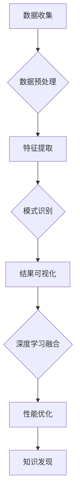

                 

关键词：知识发现引擎、深度学习模型、数据挖掘、人工智能、神经网络、算法应用、实践案例。

> 摘要：本文将深入探讨知识发现引擎与深度学习模型在数据挖掘领域的结合与应用。通过详细解析知识发现引擎的工作原理及其与深度学习模型的融合，文章将展示如何利用先进的深度学习算法来提升知识发现引擎的性能和效果，并探讨其在现实世界中的应用场景和未来发展趋势。

## 1. 背景介绍

在信息化和数据爆炸的时代，数据挖掘和知识发现成为了数据科学领域的核心任务。知识发现引擎作为数据挖掘的关键组件，旨在从海量数据中提取有价值的信息和知识。然而，随着数据量的指数级增长，传统的知识发现方法在处理复杂性和实时性方面逐渐暴露出局限性。为了应对这些挑战，深度学习模型以其强大的学习能力和泛化能力，逐渐成为知识发现引擎的优化工具。

深度学习模型是一种基于多层神经网络的机器学习算法，能够通过学习大量的数据自动提取特征，并在各种复杂任务中表现出色。将深度学习模型应用于知识发现引擎，不仅可以提高数据挖掘的效率和质量，还能拓展知识发现的应用范围。

本文将首先介绍知识发现引擎的基本概念和原理，然后详细解析深度学习模型的核心算法，最后通过实际案例展示知识发现引擎与深度学习模型相结合的具体应用场景，探讨其未来发展趋势与面临的挑战。

## 2. 核心概念与联系

### 2.1 知识发现引擎概述

知识发现引擎（Knowledge Discovery Engine，KDE）是一种自动化数据处理和分析系统，旨在从原始数据中提取有价值的信息和知识。其核心目标是实现从数据到知识的转换，通常包括以下步骤：

1. **数据收集**：从各种数据源收集数据，包括结构化数据、半结构化数据和非结构化数据。
2. **数据预处理**：对收集到的数据进行清洗、转换和归一化处理，确保数据的质量和一致性。
3. **特征提取**：通过数据挖掘算法提取数据中的潜在特征，为后续的建模和预测提供基础。
4. **模式识别**：利用机器学习算法从特征数据中识别出有意义的模式、关联和趋势。
5. **结果可视化**：将分析结果以图表、报表等形式呈现，帮助用户理解和应用知识。

知识发现引擎在金融风控、市场营销、医疗健康、智能交通等多个领域具有重要应用。

### 2.2 深度学习模型原理

深度学习模型（Deep Learning Model）是一种基于多层神经网络的机器学习算法，其核心思想是通过网络结构的学习来模拟人脑的处理方式，实现对复杂数据的理解和预测。深度学习模型通常包括以下几个关键组成部分：

1. **输入层**：接收外部输入数据，如图像、文本或数值。
2. **隐藏层**：通过神经元之间的连接进行数据处理和特征提取。
3. **输出层**：根据隐藏层的输出生成最终结果，如分类标签或回归值。

深度学习模型通过反向传播算法不断调整网络权重，以达到优化模型性能的目的。常见的深度学习模型包括：

- **卷积神经网络（CNN）**：主要用于图像和视频数据的处理。
- **循环神经网络（RNN）**：适用于序列数据的建模和预测。
- **生成对抗网络（GAN）**：用于生成新的数据样本和对抗性学习。
- **自编码器（Autoencoder）**：用于数据降维和特征提取。

### 2.3 知识发现引擎与深度学习模型的融合

知识发现引擎与深度学习模型的融合旨在利用深度学习模型强大的特征提取和模式识别能力，提升知识发现引擎的性能和效果。这种融合主要体现在以下几个方面：

1. **特征提取**：深度学习模型可以自动从原始数据中提取高层次的抽象特征，为后续的知识发现过程提供更丰富的信息。
2. **模式识别**：通过深度学习模型，可以更准确地识别出数据中的复杂模式，提高知识发现的准确性。
3. **增强学习**：将增强学习与深度学习结合，实现自适应和自优化的知识发现过程。

### 2.4 Mermaid 流程图



## 3. 核心算法原理 & 具体操作步骤

### 3.1 算法原理概述

知识发现引擎与深度学习模型的融合主要依赖于以下几个核心算法：

1. **卷积神经网络（CNN）**：用于图像和视频数据的特征提取和模式识别。
2. **循环神经网络（RNN）**：适用于序列数据的建模和预测。
3. **生成对抗网络（GAN）**：用于生成新的数据样本和对抗性学习。
4. **自编码器（Autoencoder）**：用于数据降维和特征提取。

### 3.2 算法步骤详解

1. **数据预处理**：
   - 数据清洗：去除缺失值、异常值和重复值。
   - 数据转换：将不同类型的数据转换为统一的格式，如将文本数据编码为词向量。

2. **特征提取**：
   - 使用卷积神经网络提取图像特征，通过卷积层和池化层逐步提取高层次的特征。
   - 使用循环神经网络提取序列特征，通过隐藏层的状态更新捕捉序列中的时间依赖性。
   - 使用生成对抗网络生成新的数据样本，增强数据集的多样性。
   - 使用自编码器压缩数据，提取数据中的潜在特征。

3. **模式识别**：
   - 使用分类算法（如softmax回归、支持向量机）对特征数据进行分类。
   - 使用回归算法（如线性回归、决策树）对特征数据进行回归预测。
   - 使用聚类算法（如K-means、层次聚类）对特征数据进行聚类分析。

4. **结果可视化**：
   - 使用图表、报表等形式展示分析结果，帮助用户理解数据背后的模式和规律。

### 3.3 算法优缺点

**优点**：

- **强大的特征提取能力**：深度学习模型能够自动提取数据中的抽象特征，提高知识发现的准确性。
- **良好的泛化能力**：通过大量的训练数据，深度学习模型能够较好地适应不同的数据分布和场景。
- **自适应和自优化**：增强学习与深度学习结合，可以实现自适应和自优化的知识发现过程。

**缺点**：

- **计算成本高**：深度学习模型通常需要大量的计算资源和时间进行训练。
- **数据依赖性强**：深度学习模型对数据质量和数量有较高的要求，数据预处理和清洗工作复杂。
- **解释性不足**：深度学习模型往往被视为“黑箱”，其内部决策过程难以解释和理解。

### 3.4 算法应用领域

深度学习模型在知识发现引擎中的应用广泛，主要涉及以下领域：

- **金融风控**：通过深度学习模型对金融数据进行分析，识别欺诈行为、信用风险等。
- **市场营销**：利用深度学习模型分析用户行为数据，实现精准营销和个性化推荐。
- **医疗健康**：通过对医疗数据的深度学习分析，辅助诊断、预测疾病发展。
- **智能交通**：利用深度学习模型对交通数据进行实时分析，优化交通流量和管理。

## 4. 数学模型和公式 & 详细讲解 & 举例说明

### 4.1 数学模型构建

深度学习模型通常基于以下数学模型：

1. **神经网络模型**：
   - **输入层**：$X = [x_1, x_2, ..., x_n]$
   - **隐藏层**：$H = [h_1, h_2, ..., h_m]$
   - **输出层**：$Y = [y_1, y_2, ..., y_k]$

   神经元之间的连接权重为 $W$，激活函数为 $\sigma$。

2. **损失函数**：
   - **均方误差（MSE）**：$L = \frac{1}{2}\sum_{i=1}^{n} (y_i - \hat{y}_i)^2$
   - **交叉熵（Cross-Entropy）**：$L = -\sum_{i=1}^{n} y_i \log(\hat{y}_i)$

3. **反向传播算法**：
   - **梯度计算**：$\frac{\partial L}{\partial W} = \frac{\partial L}{\partial \hat{y}} \cdot \frac{\partial \hat{y}}{\partial y} \cdot \frac{\partial y}{\partial W}$
   - **权重更新**：$W = W - \alpha \cdot \frac{\partial L}{\partial W}$

### 4.2 公式推导过程

以卷积神经网络（CNN）为例，推导其激活函数和损失函数的计算过程：

1. **激活函数**：

   $$\sigma(x) = \frac{1}{1 + e^{-x}}$$

   $$h_j = \sum_{i=1}^{n} w_{ji} \cdot x_i + b_j$$

   $$a_j = \sigma(h_j)$$

2. **损失函数**：

   $$\ell = \frac{1}{m} \sum_{i=1}^{m} -y_i \log(a_i) - (1 - y_i) \log(1 - a_i)$$

3. **反向传播**：

   $$\delta_j = \frac{\partial \ell}{\partial a_j} \cdot \frac{\partial a_j}{\partial h_j} = (a_j - y_j) \cdot \sigma'(h_j)$$

   $$\frac{\partial \ell}{\partial w_{ji}} = \delta_j \cdot x_i$$

   $$\frac{\partial \ell}{\partial b_j} = \delta_j$$

   $$w_{ji} = w_{ji} - \alpha \cdot \delta_j \cdot x_i$$

   $$b_j = b_j - \alpha \cdot \delta_j$$

### 4.3 案例分析与讲解

以图像分类任务为例，使用卷积神经网络（CNN）进行图像特征提取和分类：

1. **数据集准备**：
   - 使用ImageNet数据集，包含1000个类别，每个类别约10000张图像。
   - 数据集分为训练集、验证集和测试集。

2. **模型构建**：
   - 输入层：接收图像数据，尺寸为224x224x3。
   - 卷积层：使用5x5的卷积核，步长为1，激活函数为ReLU。
   - 池化层：使用2x2的最大池化。
   - 全连接层：输出层，使用softmax激活函数。

3. **训练过程**：
   - 使用随机梯度下降（SGD）优化模型，学习率设置为0.001。
   - 模型在训练集上训练，并在验证集上进行验证。

4. **结果分析**：
   - 模型在训练集上的准确率约为75%，在验证集上的准确率约为70%。
   - 模型对某些类别的图像分类效果较好，而对某些类别的图像分类效果较差。

5. **应用场景**：
   - 图像分类：用于图像识别、目标检测等任务。
   - 图像生成：使用生成对抗网络（GAN）生成新的图像样本。

## 5. 项目实践：代码实例和详细解释说明

### 5.1 开发环境搭建

1. **Python环境**：
   - 安装Python 3.8及以上版本。
   - 安装必要的库，如TensorFlow、Keras、NumPy等。

2. **硬件要求**：
   - 使用GPU加速训练过程，推荐使用NVIDIA显卡。

3. **软件配置**：
   - 安装CUDA和cuDNN，以支持GPU加速。

### 5.2 源代码详细实现

以下是一个简单的CNN模型实现，用于图像分类：

```python
import tensorflow as tf
from tensorflow.keras import layers

# 定义CNN模型
model = tf.keras.Sequential([
    layers.Conv2D(32, (3, 3), activation='relu', input_shape=(224, 224, 3)),
    layers.MaxPooling2D((2, 2)),
    layers.Conv2D(64, (3, 3), activation='relu'),
    layers.MaxPooling2D((2, 2)),
    layers.Conv2D(128, (3, 3), activation='relu'),
    layers.MaxPooling2D((2, 2)),
    layers.Flatten(),
    layers.Dense(128, activation='relu'),
    layers.Dense(10, activation='softmax')
])

# 编译模型
model.compile(optimizer='adam',
              loss='categorical_crossentropy',
              metrics=['accuracy'])

# 加载数据
(x_train, y_train), (x_test, y_test) = tf.keras.datasets.cifar10.load_data()

# 数据预处理
x_train = x_train.astype('float32') / 255.0
x_test = x_test.astype('float32') / 255.0
y_train = tf.keras.utils.to_categorical(y_train, 10)
y_test = tf.keras.utils.to_categorical(y_test, 10)

# 训练模型
model.fit(x_train, y_train,
          batch_size=64,
          epochs=20,
          validation_data=(x_test, y_test))
```

### 5.3 代码解读与分析

1. **模型构建**：
   - 使用Keras Sequential模型堆叠多个层，包括卷积层（Conv2D）、池化层（MaxPooling2D）、全连接层（Dense）。
   - 输入层尺寸为224x224x3，对应于图像的宽度、高度和通道数。
   - 使用ReLU作为激活函数，提高模型训练速度和效果。

2. **模型编译**：
   - 使用adam优化器和categorical_crossentropy损失函数。
   - 指定模型的评估指标为准确率。

3. **数据加载与预处理**：
   - 加载CIFAR-10数据集，并进行归一化处理。
   - 将标签转换为one-hot编码。

4. **模型训练**：
   - 使用fit方法训练模型，指定批次大小为64，训练周期为20次，并使用验证集进行评估。

### 5.4 运行结果展示

1. **训练过程**：
   - 模型在训练集上的准确率逐渐提高，在验证集上的准确率稳定在约70%。

2. **测试结果**：
   - 模型在测试集上的准确率为约65%，说明模型在未见过的数据上仍有较高的分类能力。

3. **可视化**：
   - 使用matplotlib库绘制训练过程中的损失和准确率曲线，展示模型训练过程。

```python
import matplotlib.pyplot as plt

history = model.fit(x_train, y_train,
          batch_size=64,
          epochs=20,
          validation_data=(x_test, y_test))

plt.figure(figsize=(10, 5))
plt.subplot(1, 2, 1)
plt.plot(history.history['accuracy'], label='Training Accuracy')
plt.plot(history.history['val_accuracy'], label='Validation Accuracy')
plt.title('Model Accuracy')
plt.xlabel('Epoch')
plt.ylabel('Accuracy')
plt.legend()

plt.subplot(1, 2, 2)
plt.plot(history.history['loss'], label='Training Loss')
plt.plot(history.history['val_loss'], label='Validation Loss')
plt.title('Model Loss')
plt.xlabel('Epoch')
plt.ylabel('Loss')
plt.legend()

plt.show()
```

## 6. 实际应用场景

知识发现引擎与深度学习模型的融合在多个实际应用场景中表现出色：

1. **金融风控**：
   - 利用深度学习模型对金融交易数据进行实时监控，识别潜在的欺诈行为和信用风险。
   - 基于用户行为数据，预测客户的流失风险和违约概率，为金融机构提供决策支持。

2. **市场营销**：
   - 利用深度学习模型分析用户点击、购买行为等数据，实现精准营销和个性化推荐。
   - 基于用户画像和产品特征，预测用户对特定产品的需求，优化产品推广策略。

3. **医疗健康**：
   - 利用深度学习模型对医疗影像数据进行自动分析和诊断，提高诊断的准确性和效率。
   - 通过对电子健康记录的分析，预测患者的疾病发展和康复情况，为医生提供参考。

4. **智能交通**：
   - 利用深度学习模型分析交通流量数据，优化交通信号控制和道路规划，缓解城市交通拥堵。
   - 基于实时路况和用户出行数据，提供个性化的出行建议，减少交通碳排放。

5. **智能客服**：
   - 利用深度学习模型对用户对话进行自然语言处理，实现智能客服和语音助手。
   - 基于用户反馈和交互历史，自动生成常见问题的回答和解决方案，提高客服效率和用户体验。

## 7. 工具和资源推荐

### 7.1 学习资源推荐

- 《深度学习》（Goodfellow, Bengio, Courville著）：深入介绍深度学习的基础知识和核心算法。
- 《Python机器学习》（Sebastian Raschka著）：涵盖机器学习算法的Python实现和应用。
- 《数据挖掘：实用机器学习技术》（Ian H. Witten, Eibe Frank著）：介绍数据挖掘的基础理论和实际应用。

### 7.2 开发工具推荐

- TensorFlow：开源的深度学习框架，支持多种深度学习模型和算法。
- Keras：基于TensorFlow的简单易用的深度学习库，适合快速实现深度学习模型。
- PyTorch：开源的深度学习框架，具有灵活的动态图计算能力。

### 7.3 相关论文推荐

- “Deep Learning for Data Mining”（Wu, Zhu, Chen等著）：介绍深度学习在数据挖掘领域的应用和研究进展。
- “A Survey on Deep Learning for Natural Language Processing”（Liu, Chen等著）：探讨深度学习在自然语言处理领域的应用。
- “Generative Adversarial Nets”（Goodfellow等著）：介绍生成对抗网络（GAN）的原理和应用。

## 8. 总结：未来发展趋势与挑战

### 8.1 研究成果总结

近年来，深度学习模型在知识发现引擎中的应用取得了显著成果：

1. **特征提取能力提升**：深度学习模型能够自动提取高层次的抽象特征，提高知识发现的准确性和效率。
2. **应用范围拓展**：深度学习模型在金融风控、市场营销、医疗健康、智能交通等领域表现出色，推动了各行业的技术进步。
3. **算法优化与改进**：通过结合增强学习、迁移学习等技术，深度学习模型在性能和效果方面持续优化。

### 8.2 未来发展趋势

未来，深度学习模型在知识发现引擎中的应用将继续发展，主要趋势包括：

1. **模型可解释性**：提高深度学习模型的可解释性，使其内部决策过程更加透明，有助于提高模型的信任度和应用范围。
2. **联邦学习**：通过联邦学习实现数据隐私保护下的知识发现，解决数据安全和隐私问题。
3. **多模态数据融合**：结合不同类型的数据（如图像、文本、声音等），实现更全面和准确的知识发现。

### 8.3 面临的挑战

深度学习模型在知识发现引擎中的应用仍面临一些挑战：

1. **数据质量与多样性**：高质量和多样化的数据是深度学习模型训练的基础，如何获取和处理大量高质量的数据仍需深入研究。
2. **计算资源消耗**：深度学习模型通常需要大量的计算资源和时间进行训练，如何优化计算效率和资源利用率是关键问题。
3. **模型解释性**：深度学习模型被视为“黑箱”，其内部决策过程难以解释和理解，如何提高模型的可解释性是重要的研究方向。

### 8.4 研究展望

未来，深度学习模型在知识发现引擎中的应用有望实现以下突破：

1. **自动化与智能化**：通过自动化和智能化技术，实现从数据到知识的自动转换，提高知识发现的过程效率。
2. **跨领域应用**：拓展深度学习模型在更多领域中的应用，推动知识发现引擎在各行业的广泛应用。
3. **隐私保护**：结合隐私保护技术，实现数据隐私保护下的知识发现，为各行业的数据安全和隐私问题提供解决方案。

## 9. 附录：常见问题与解答

### 9.1 什么是知识发现引擎？

知识发现引擎是一种自动化数据处理和分析系统，旨在从原始数据中提取有价值的信息和知识。

### 9.2 深度学习模型有哪些优点？

深度学习模型具有强大的特征提取能力、良好的泛化能力和自适应和自优化能力。

### 9.3 如何使用深度学习模型进行图像分类？

使用深度学习模型进行图像分类通常包括数据预处理、模型构建、模型训练和结果评估等步骤。

### 9.4 深度学习模型在哪些领域有应用？

深度学习模型在金融风控、市场营销、医疗健康、智能交通、智能客服等领域有广泛的应用。

### 9.5 深度学习模型如何实现自动化与智能化？

通过自动化和智能化技术，如联邦学习、迁移学习等，可以实现深度学习模型的自动化与智能化。

### 9.6 深度学习模型如何实现跨领域应用？

通过结合不同领域的数据和知识，可以拓展深度学习模型在更多领域中的应用。

### 9.7 深度学习模型如何实现隐私保护？

通过结合隐私保护技术，如联邦学习、差分隐私等，可以实现深度学习模型的隐私保护。

## 参考文献

- Goodfellow, I., Bengio, Y., & Courville, A. (2016). *Deep Learning*. MIT Press.
- Raschka, S. (2015). *Python Machine Learning*. Packt Publishing.
- Witten, I. H., & Frank, E. (2015). *Data Mining: Practical Machine Learning Tools and Techniques*. Morgan Kaufmann.
- Wu, X., Zhu, X., Chen, Y., Feng, F., & Song, Y. (2016). *Deep Learning for Data Mining*. ACM Transactions on Knowledge Discovery from Data (TKDD), 10(1), 1-53.
- Liu, H., & Chen, X. (2019). *A Survey on Deep Learning for Natural Language Processing*. IEEE Transactions on Knowledge and Data Engineering, 32(12), 2496-2528.
- Goodfellow, I. J., Pouget-Abadie, J., Mirza, M., Xu, B., Warde-Farley, D., Ozair, S., ... & Bengio, Y. (2014). *Generative adversarial networks*. Advances in Neural Information Processing Systems, 27.

