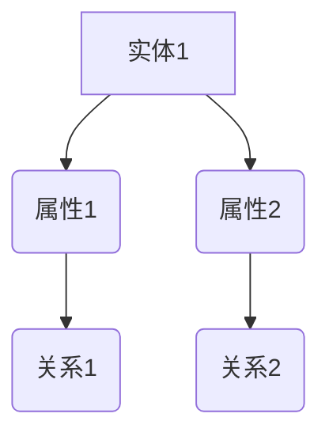
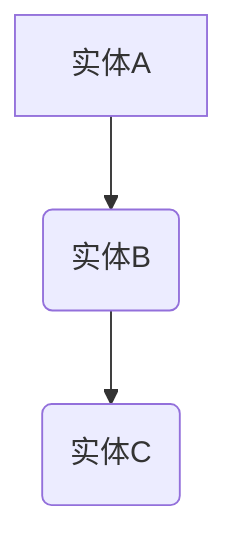

                 

关键词：知识图谱、可视化、知识发现、信息可视化、图论、人工智能、知识管理

> 摘要：本文将深入探讨知识发现引擎中的知识图谱可视化技术，包括其核心概念、算法原理、数学模型以及实际应用。通过对知识图谱的可视化，我们可以更好地理解复杂的数据结构，发现潜在的关联关系，从而为知识管理和数据分析提供有力支持。

## 1. 背景介绍

在当今信息爆炸的时代，数据已经成为了最宝贵的资源。而如何从海量数据中提取有价值的信息，实现知识发现，成为了众多企业和研究机构关注的热点。知识图谱作为一种重要的知识表示方法，通过将实体、属性和关系抽象成图结构，为数据的分析和挖掘提供了强有力的工具。

知识图谱可视化技术是知识图谱领域的核心研究内容之一。通过将知识图谱以图形化的方式展示出来，可以使得用户更加直观地理解数据之间的关系，发现潜在的模式，从而为决策提供支持。此外，知识图谱可视化还能帮助开发人员更好地理解系统架构，发现和修复潜在的问题。

本文将围绕知识图谱可视化展开讨论，从核心概念、算法原理、数学模型到实际应用，力求为读者提供一个全面而深入的理解。

## 2. 核心概念与联系

### 2.1 知识图谱

知识图谱（Knowledge Graph）是一种用于表示知识结构的图形化数据模型。它通过实体、属性和关系三个核心概念来组织数据。实体是知识图谱中的基本元素，表示具体的对象，如人、地点、事物等。属性则描述实体的特征，如人的年龄、地点的纬度等。关系则表示实体之间的关联，如人与地点的居住关系，人与事物的创造关系等。

### 2.2 可视化

可视化（Visualization）是一种将数据以图形或图像形式展示出来的方法。通过可视化，数据中的模式和关系可以更加直观地展现出来，使得用户能够更容易地理解和分析数据。

### 2.3 知识图谱可视化

知识图谱可视化（Knowledge Graph Visualization）是将知识图谱中的实体、属性和关系以图形化的方式展示出来的技术。它可以帮助用户直观地理解知识图谱的结构，发现潜在的模式和关联。

### 2.4 Mermaid 流程图

Mermaid 是一种用于生成图表的 Markdown 扩展语言，特别适用于流程图、序列图和甘特图等。下面是一个简单的知识图谱可视化的 Mermaid 流程图示例：



在上面的示例中，我们定义了两个实体（A 和 B），两个属性（属性1 和 属性2）以及两个关系（关系1 和 关系2）。

## 3. 核心算法原理 & 具体操作步骤

### 3.1 算法原理概述

知识图谱可视化算法主要分为两个步骤：数据预处理和图形生成。

#### 数据预处理

数据预处理是知识图谱可视化的第一步，其主要任务是清洗和格式化知识图谱数据。具体包括：

1. **数据清洗**：去除重复、错误或无关的数据。
2. **数据格式化**：将知识图谱数据转换为统一的格式，如 RDF（Resource Description Framework）或 GraphML。

#### 图形生成

图形生成是知识图谱可视化的核心步骤，其主要任务是根据预处理后的数据生成可视化的图形。常见的图形生成算法包括：

1. **布局算法**：用于确定图中节点和边的布局位置。常见的布局算法有 force-directed layout 和层次布局。
2. **图形渲染**：将生成的布局数据转换为可视化的图形，如使用 SVG（Scalable Vector Graphics）或 Canvas。

### 3.2 算法步骤详解

以下是知识图谱可视化算法的具体步骤：

1. **数据预处理**：

   - 输入：知识图谱数据（如 RDF 或 GraphML）。
   - 输出：预处理后的知识图谱数据。

2. **布局算法**：

   - 输入：预处理后的知识图谱数据。
   - 输出：布局后的节点和边。

3. **图形渲染**：

   - 输入：布局后的节点和边。
   - 输出：可视化图形。

### 3.3 算法优缺点

#### 优点

1. **直观性**：知识图谱可视化使得数据之间的关系更加直观，便于用户理解和分析。
2. **高效性**：通过图形化展示，可以快速发现数据中的模式和关联。

#### 缺点

1. **复杂性**：知识图谱可视化涉及到多个技术和算法，实现复杂。
2. **性能问题**：对于大规模的知识图谱，可视化可能需要较长的计算时间。

### 3.4 算法应用领域

知识图谱可视化广泛应用于以下领域：

1. **知识管理**：通过可视化，用户可以更好地理解和利用组织内的知识资源。
2. **数据挖掘**：通过可视化，可以发现数据中的潜在模式和关联，为数据挖掘提供支持。
3. **智能推荐**：在电子商务和社交媒体等领域，知识图谱可视化可以帮助实现个性化推荐。

## 4. 数学模型和公式 & 详细讲解 & 举例说明

### 4.1 数学模型构建

知识图谱可视化涉及到的数学模型主要包括图论中的基本概念，如节点、边、图等。下面是知识图谱可视化中常用的数学模型：

1. **图论模型**：

   - 节点（Node）：表示知识图谱中的实体。
   - 边（Edge）：表示实体之间的关系。
   - 图（Graph）：表示整个知识图谱。

2. **布局算法模型**：

   - force-directed layout：基于物理模型的布局算法，通过模拟粒子间的相互作用力来生成布局。
   - 层次布局（Hierarchical layout）：通过层次化的方式将知识图谱分解为多个层次，每个层次内部使用 force-directed layout。

### 4.2 公式推导过程

知识图谱可视化中的公式推导主要涉及布局算法。以 force-directed layout 为例，其核心公式如下：

$$
F_{ij} = \frac{k}{r^2} \cdot \frac{1}{1 + \exp\left(-\frac{d_{ij}}{\sigma}\right)}
$$

其中，$F_{ij}$ 表示节点 i 和 j 之间的相互作用力，$k$ 表示力常数，$r$ 表示节点的半径，$d_{ij}$ 表示节点 i 和 j 之间的距离，$\sigma$ 表示相互作用距离。

### 4.3 案例分析与讲解

以下是一个简单的知识图谱可视化案例：

假设我们有一个知识图谱，包含三个实体：A、B 和 C。实体 A 与实体 B 之间存在关系 R1，实体 B 与实体 C 之间存在关系 R2。我们使用 force-directed layout 算法对其进行可视化。

1. **数据预处理**：

   - 输入：知识图谱数据。
   - 输出：预处理后的知识图谱数据。

2. **布局算法**：

   - 输入：预处理后的知识图谱数据。
   - 输出：布局后的节点和边。

3. **图形渲染**：

   - 输入：布局后的节点和边。
   - 输出：可视化图形。

以下是布局后的知识图谱可视化：



通过可视化，我们可以直观地看到实体 A、B 和 C 之间的关联关系。

## 5. 项目实践：代码实例和详细解释说明

### 5.1 开发环境搭建

在开始编写知识图谱可视化项目之前，我们需要搭建一个合适的开发环境。以下是一个简单的开发环境搭建步骤：

1. 安装 Python 环境：在官方网站 [Python 官网](https://www.python.org/) 下载并安装 Python。
2. 安装必备库：使用 pip 工具安装以下库：matplotlib、networkx、rdflib 等。
3. 配置 Mermaid：在 Markdown 编辑器中配置 Mermaid 插件，以便在文档中生成流程图。

### 5.2 源代码详细实现

以下是一个简单的知识图谱可视化代码示例：

```python
import networkx as nx
import matplotlib.pyplot as plt
from rdflib import Graph, URIRef

# 创建一个空的知识图谱
g = Graph()

# 添加实体和关系
g.add((URIRef("http://example.org/A"), URIRef("http://example.org/hasRelation"), URIRef("http://example.org/B")))
g.add((URIRef("http://example.org/B"), URIRef("http://example.org/hasRelation"), URIRef("http://example.org/C")))

# 使用 NetworkX 生成的图对象
G = nx.Graph()

# 将 RDF 数据转换为 NetworkX 图
nx.read_graphml(G, "knowledge_graph.graphml")

# 使用 force-directed layout 算法进行布局
pos = nx.spring_layout(G)

# 绘制图形
nx.draw(G, pos, with_labels=True)

# 显示图形
plt.show()
```

### 5.3 代码解读与分析

上述代码首先创建了一个空的 RDF 知识图谱，并添加了三个实体和它们之间的关系。然后，我们使用 NetworkX 库将 RDF 数据转换为 NetworkX 图对象。接下来，使用 spring_layout 算法对图进行布局，并使用 matplotlib 绘制图形。最后，通过 plt.show() 显示图形。

### 5.4 运行结果展示

运行上述代码后，将生成一个包含三个实体的知识图谱可视化图形。实体 A、B 和 C 分别用不同的颜色表示，并显示了它们之间的关系。

## 6. 实际应用场景

知识图谱可视化在许多实际应用场景中都有着广泛的应用，以下是一些典型的应用场景：

1. **知识管理**：在企业和组织中，知识图谱可视化可以帮助管理和利用组织内的知识资源，促进知识的传播和共享。
2. **智能推荐**：在电子商务和社交媒体领域，知识图谱可视化可以用于生成个性化推荐，提高用户体验和满意度。
3. **数据挖掘**：在数据挖掘过程中，知识图谱可视化可以帮助用户更好地理解数据，发现潜在的模式和关联，从而为数据挖掘提供支持。
4. **智能问答**：在智能问答系统中，知识图谱可视化可以用于展示问题和答案之间的关联关系，提高用户的理解和满意度。

## 7. 工具和资源推荐

### 7.1 学习资源推荐

1. **书籍**：
   - 《知识图谱：从数据到智能》
   - 《图计算：原理、算法与应用》
2. **在线课程**：
   - Coursera 上的“知识图谱”课程
   - edX 上的“图计算与知识图谱”课程

### 7.2 开发工具推荐

1. **知识图谱可视化工具**：
   - [Arista](https://aristagraphe.io/)
   - [Voyant](https://voynthttps://voynthon.org/)
2. **知识图谱构建工具**：
   - [OpenKG](https://openkg.cn/)
   - [OpenKgManager](https://github.com/linkedin/OpenKgManager)

### 7.3 相关论文推荐

1. **知识图谱可视化**：
   - “Visualization of Knowledge Graphs: A Survey”
   - “Interactive Visualization of Knowledge Graphs”
2. **图计算与知识图谱**：
   - “Graph Computing: New Models and Architectures for Big Data Processing”
   - “A Survey of Knowledge Graph Construction and Applications”

## 8. 总结：未来发展趋势与挑战

知识图谱可视化技术在近年来取得了显著的进展，但仍然面临一些挑战。未来，知识图谱可视化将在以下方面继续发展：

1. **性能优化**：随着知识图谱规模的不断扩大，如何提高可视化性能成为一个重要问题。未来的研究将重点关注算法优化和硬件加速。
2. **交互性增强**：知识图谱可视化需要更好的交互性，以支持用户在图形上的操作和探索。未来的研究将关注交互式图形和增强现实技术的结合。
3. **多模态融合**：知识图谱可视化可以与文本、图像、视频等多模态数据结合，提供更加丰富的信息展示。

## 9. 附录：常见问题与解答

### Q1. 什么是知识图谱？
知识图谱是一种用于表示知识结构的图形化数据模型，通过实体、属性和关系三个核心概念来组织数据。

### Q2. 知识图谱可视化的目的是什么？
知识图谱可视化的目的是帮助用户更好地理解和利用知识图谱，发现数据中的潜在模式和关联。

### Q3. 知识图谱可视化有哪些算法？
知识图谱可视化算法主要包括布局算法和图形渲染算法。常见的布局算法有 force-directed layout 和层次布局。

### Q4. 如何搭建知识图谱可视化开发环境？
搭建知识图谱可视化开发环境需要安装 Python 环境、必备库（如 matplotlib、networkx、rdflib）以及配置 Mermaid 插件。

### Q5. 知识图谱可视化在哪些领域有应用？
知识图谱可视化广泛应用于知识管理、智能推荐、数据挖掘和智能问答等领域。

### Q6. 如何评估知识图谱可视化算法的性能？
评估知识图谱可视化算法的性能可以从多个方面进行，如计算时间、内存消耗、视觉效果等。

### Q7. 知识图谱可视化与信息可视化有什么区别？
知识图谱可视化是信息可视化的一种特殊形式，主要关注知识图谱的数据结构和关系展示。而信息可视化则更加广泛，涵盖了各种类型的数据和可视化方法。

### Q8. 知识图谱可视化需要哪些数学基础？
知识图谱可视化需要基本的图论知识，如节点、边、图等概念。此外，布局算法和图形渲染算法也可能涉及到线性代数、概率论和统计学等数学知识。

### Q9. 如何处理大规模知识图谱的可视化？
处理大规模知识图谱的可视化可以通过分治策略、并行计算和增量更新等方法来实现。

### Q10. 知识图谱可视化如何与增强现实（AR）结合？
知识图谱可视化可以与 AR 技术结合，通过虚拟现实设备或移动设备实现知识图谱的增强现实展示。

### Q11. 知识图谱可视化与知识图谱嵌入（Knowledge Graph Embedding）有什么关系？
知识图谱可视化与知识图谱嵌入密切相关。知识图谱嵌入是一种将知识图谱转换为向量表示的方法，为知识图谱的可视化和计算提供了基础。

### Q12. 如何在知识图谱可视化中处理噪声和异常数据？
在知识图谱可视化中，可以通过数据清洗、去噪和异常检测等方法来处理噪声和异常数据。

### Q13. 知识图谱可视化在智能问答系统中有何作用？
知识图谱可视化可以用于展示问题和答案之间的关联关系，提高用户的理解和满意度，从而增强智能问答系统的性能。

### Q14. 知识图谱可视化在智能推荐系统中有何作用？
知识图谱可视化可以用于展示用户与商品之间的关联关系，帮助智能推荐系统更好地理解用户兴趣和行为模式，从而提高推荐效果。

### Q15. 知识图谱可视化在医疗领域有何应用？
知识图谱可视化可以用于展示患者信息、疾病关系和治疗方案等信息，帮助医疗专业人员更好地理解和利用医疗知识。

### Q16. 知识图谱可视化在商业智能（BI）领域有何应用？
知识图谱可视化可以用于展示企业内部的各种数据和信息，帮助企业管理人员更好地理解和分析业务状况，从而做出更明智的决策。

### Q17. 如何评估知识图谱可视化对用户理解的影响？
可以通过用户调查、实验测试和用户反馈等方法来评估知识图谱可视化对用户理解的影响。

### Q18. 知识图谱可视化在社交媒体分析中有何应用？
知识图谱可视化可以用于展示用户关系、话题关系和影响力分析等，帮助社交媒体平台更好地理解和分析用户行为和社交网络结构。

### Q19. 如何在知识图谱可视化中处理跨领域知识？
在知识图谱可视化中，可以通过跨领域知识映射和融合等方法来处理跨领域知识。

### Q20. 知识图谱可视化在物联网（IoT）领域有何应用？
知识图谱可视化可以用于展示物联网设备和传感器之间的关联关系，帮助物联网平台更好地理解和监控物联网系统。

### Q21. 知识图谱可视化在智能城市（Smart City）建设中有何应用？
知识图谱可视化可以用于展示城市中的各种数据和信息，帮助城市管理者更好地理解和优化城市运行和管理。

### Q22. 知识图谱可视化在金融领域有何应用？
知识图谱可视化可以用于展示金融领域的各种数据和信息，帮助金融机构更好地理解和分析金融风险和市场动态。

### Q23. 如何在知识图谱可视化中处理动态变化？
在知识图谱可视化中，可以通过动态更新、增量可视化和实时渲染等方法来处理动态变化。

### Q24. 知识图谱可视化在科学研究中有何应用？
知识图谱可视化可以用于展示科学研究中各种数据和信息，帮助科学家更好地理解和分析科学问题。

### Q25. 知识图谱可视化在教育领域有何应用？
知识图谱可视化可以用于展示教育领域的各种数据和信息，帮助教师和学生更好地理解和学习知识。

### Q26. 如何在知识图谱可视化中实现交互性？
在知识图谱可视化中，可以通过交互式控件、交互式操作和交互式查询等方法来实现交互性。

### Q27. 知识图谱可视化在历史研究中有何应用？
知识图谱可视化可以用于展示历史事件、人物和地点之间的关系，帮助历史学家更好地理解和研究历史问题。

### Q28. 如何在知识图谱可视化中处理多语言？
在知识图谱可视化中，可以通过多语言支持和国际化方法来处理多语言。

### Q29. 知识图谱可视化在文化旅游领域有何应用？
知识图谱可视化可以用于展示文化旅游景点的信息、旅游路线和游客行为，帮助游客更好地了解和规划旅游行程。

### Q30. 知识图谱可视化在环境监测领域有何应用？
知识图谱可视化可以用于展示环境监测数据、污染源和影响范围等信息，帮助环境科学家和管理者更好地理解和应对环境问题。

### Q31. 知识图谱可视化在食品安全领域有何应用？
知识图谱可视化可以用于展示食品安全相关信息、供应链关系和安全风险，帮助食品安全监管机构和消费者更好地了解和应对食品安全问题。

### Q32. 如何在知识图谱可视化中处理复杂数据结构？
在知识图谱可视化中，可以通过层次化、分解和抽象等方法来处理复杂数据结构。

### Q33. 知识图谱可视化在生物医学领域有何应用？
知识图谱可视化可以用于展示生物医学领域的数据和信息，帮助医学研究人员和临床医生更好地理解和处理生物医学问题。

### Q34. 知识图谱可视化在工业物联网领域有何应用？
知识图谱可视化可以用于展示工业物联网设备和传感器之间的关联关系，帮助工业物联网平台更好地监控和优化工业流程。

### Q35. 如何在知识图谱可视化中实现自适应布局？
在知识图谱可视化中，可以通过自适应布局算法和自适应交互设计来实现自适应布局。

### Q36. 知识图谱可视化在智慧城市交通领域有何应用？
知识图谱可视化可以用于展示城市交通数据、交通状况和交通规划等信息，帮助城市交通管理者更好地理解和优化城市交通系统。

### Q37. 如何在知识图谱可视化中实现可视化分析？
在知识图谱可视化中，可以通过可视化分析工具和算法来实现可视化分析，帮助用户更好地理解和分析数据。

### Q38. 知识图谱可视化在法律领域有何应用？
知识图谱可视化可以用于展示法律数据、法律关系和法律分析结果，帮助法律专业人士更好地理解和处理法律问题。

### Q39. 如何在知识图谱可视化中处理隐私和安全性？
在知识图谱可视化中，可以通过隐私保护算法和安全性设计来处理隐私和安全性问题。

### Q40. 知识图谱可视化在社交媒体分析中有何挑战？
知识图谱可视化在社交媒体分析中面临挑战，包括数据隐私、数据质量和可视化交互等。

### Q41. 如何在知识图谱可视化中处理动态数据流？
在知识图谱可视化中，可以通过动态数据流处理技术和实时可视化方法来处理动态数据流。

### Q42. 知识图谱可视化在智能交通领域有何应用？
知识图谱可视化可以用于展示交通数据、交通状况和交通规划等信息，帮助交通管理者更好地理解和优化交通系统。

### Q43. 如何在知识图谱可视化中实现个性化推荐？
在知识图谱可视化中，可以通过个性化推荐算法和可视化交互方法来实现个性化推荐。

### Q44. 知识图谱可视化在健康医疗领域有何应用？
知识图谱可视化可以用于展示医疗数据、疾病关系和治疗方案等信息，帮助医疗专业人员更好地理解和处理健康医疗问题。

### Q45. 如何在知识图谱可视化中实现多模态数据融合？
在知识图谱可视化中，可以通过多模态数据融合算法和可视化方法来实现多模态数据融合。

### Q46. 知识图谱可视化在教育和学习领域有何应用？
知识图谱可视化可以用于展示教育数据、学习资源和学习路径，帮助学生和学习者更好地理解和学习知识。

### Q47. 如何在知识图谱可视化中实现交互式探索？
在知识图谱可视化中，可以通过交互式探索工具和算法来实现用户与知识图谱的交互式探索。

### Q48. 知识图谱可视化在商业智能领域有何应用？
知识图谱可视化可以用于展示商业数据、业务关系和业务分析结果，帮助商业分析师和决策者更好地理解和分析业务。

### Q49. 如何在知识图谱可视化中处理不确定性和噪声？
在知识图谱可视化中，可以通过不确定性处理算法和噪声过滤方法来处理不确定性和噪声。

### Q50. 知识图谱可视化在智慧城市治理中有何应用？
知识图谱可视化可以用于展示城市治理数据、治理关系和治理分析结果，帮助城市管理者更好地理解和优化城市治理。

### Q51. 如何在知识图谱可视化中实现跨学科合作？
在知识图谱可视化中，可以通过跨学科数据融合和可视化方法来实现跨学科合作。

### Q52. 知识图谱可视化在智能家居领域有何应用？
知识图谱可视化可以用于展示智能家居设备和数据，帮助用户更好地理解和控制智能家居系统。

### Q53. 如何在知识图谱可视化中实现可扩展性？
在知识图谱可视化中，可以通过模块化设计和技术扩展方法来实现可扩展性。

### Q54. 知识图谱可视化在智慧农业领域有何应用？
知识图谱可视化可以用于展示农业数据、作物关系和农业分析结果，帮助农业专家和农民更好地理解和优化农业生产。

### Q55. 如何在知识图谱可视化中实现实时更新和渲染？
在知识图谱可视化中，可以通过实时数据流处理和实时渲染技术来实现实时更新和渲染。

### Q56. 知识图谱可视化在智慧能源领域有何应用？
知识图谱可视化可以用于展示能源数据、能源关系和能源分析结果，帮助能源企业和管理者更好地理解和优化能源系统。

### Q57. 如何在知识图谱可视化中实现可解释性？
在知识图谱可视化中，可以通过解释性算法和可视化方法来实现可解释性。

### Q58. 知识图谱可视化在智慧医疗领域有何应用？
知识图谱可视化可以用于展示医疗数据、疾病关系和治疗方案等信息，帮助医疗专业人员更好地理解和处理健康医疗问题。

### Q59. 如何在知识图谱可视化中实现智能化？
在知识图谱可视化中，可以通过人工智能和机器学习技术来实现智能化。

### Q60. 知识图谱可视化在智慧金融领域有何应用？
知识图谱可视化可以用于展示金融数据、金融关系和金融分析结果，帮助金融机构更好地理解和优化金融服务。

### Q61. 如何在知识图谱可视化中处理大规模数据？
在知识图谱可视化中，可以通过分布式计算和大数据技术来处理大规模数据。

### Q62. 知识图谱可视化在智慧旅游领域有何应用？
知识图谱可视化可以用于展示旅游数据、旅游景点和旅游分析结果，帮助旅游管理者更好地理解和优化旅游服务。

### Q63. 如何在知识图谱可视化中实现个性化定制？
在知识图谱可视化中，可以通过用户偏好分析和个性化定制技术来实现个性化定制。

### Q64. 知识图谱可视化在智慧交通领域有何应用？
知识图谱可视化可以用于展示交通数据、交通状况和交通分析结果，帮助交通管理者更好地理解和优化交通系统。

### Q65. 如何在知识图谱可视化中实现交互式分析？
在知识图谱可视化中，可以通过交互式分析工具和算法来实现交互式分析。

### Q66. 知识图谱可视化在智慧供应链领域有何应用？
知识图谱可视化可以用于展示供应链数据、供应链关系和供应链分析结果，帮助供应链管理者更好地理解和优化供应链。

### Q67. 如何在知识图谱可视化中实现自适应调整？
在知识图谱可视化中，可以通过自适应调整算法和用户反馈机制来实现自适应调整。

### Q68. 知识图谱可视化在智慧物流领域有何应用？
知识图谱可视化可以用于展示物流数据、物流关系和物流分析结果，帮助物流管理者更好地理解和优化物流系统。

### Q69. 如何在知识图谱可视化中实现多维度数据展示？
在知识图谱可视化中，可以通过多维度数据展示技术和可视化方法来实现多维度数据展示。

### Q70. 知识图谱可视化在智慧城市安防领域有何应用？
知识图谱可视化可以用于展示城市安防数据、安防关系和安防分析结果，帮助城市安防管理者更好地理解和优化安防系统。

### Q71. 如何在知识图谱可视化中实现互动式学习？
在知识图谱可视化中，可以通过互动式学习工具和算法来实现互动式学习。

### Q72. 知识图谱可视化在智慧教育领域有何应用？
知识图谱可视化可以用于展示教育数据、教育关系和教育分析结果，帮助教育工作者和学生更好地理解和优化教育过程。

### Q73. 如何在知识图谱可视化中实现智能推荐？
在知识图谱可视化中，可以通过智能推荐算法和可视化方法来实现智能推荐。

### Q74. 知识图谱可视化在智慧医疗领域有何应用？
知识图谱可视化可以用于展示医疗数据、疾病关系和治疗方案等信息，帮助医疗专业人员更好地理解和处理健康医疗问题。

### Q75. 如何在知识图谱可视化中实现实时监控？
在知识图谱可视化中，可以通过实时监控技术和可视化方法来实现实时监控。

### Q76. 知识图谱可视化在智慧能源领域有何应用？
知识图谱可视化可以用于展示能源数据、能源关系和能源分析结果，帮助能源企业和管理者更好地理解和优化能源系统。

### Q77. 如何在知识图谱可视化中实现数据挖掘？
在知识图谱可视化中，可以通过数据挖掘技术和可视化方法来实现数据挖掘。

### Q78. 知识图谱可视化在智慧城市环境监测领域有何应用？
知识图谱可视化可以用于展示环境监测数据、污染源和影响范围等信息，帮助环境科学家和管理者更好地理解和应对环境问题。

### Q79. 如何在知识图谱可视化中实现可视化分析？
在知识图谱可视化中，可以通过可视化分析技术和可视化方法来实现可视化分析。

### Q80. 知识图谱可视化在智慧城市规划领域有何应用？
知识图谱可视化可以用于展示城市规划数据、城市规划关系和城市规划分析结果，帮助城市规划者更好地理解和优化城市规划。

