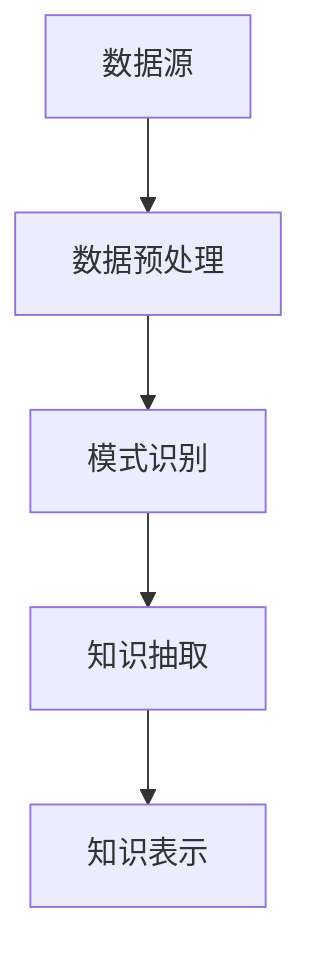
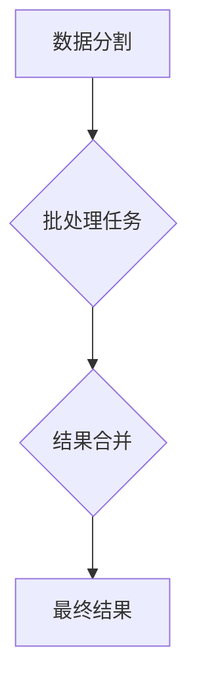
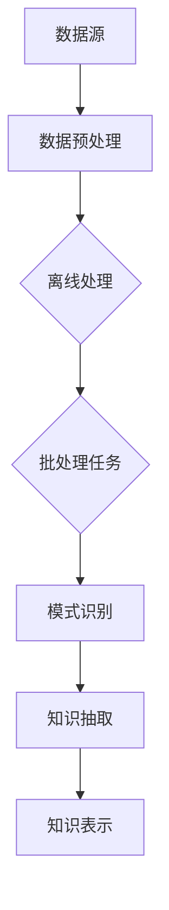

                 

摘要：知识发现引擎在现代社会中发挥着越来越重要的作用，它能够从大量数据中提取出有价值的信息和知识。本文将深入探讨知识发现引擎的离线处理与批处理技术，包括其核心概念、算法原理、数学模型以及实际应用。通过本文的阅读，读者将了解到如何设计高效的批处理系统，以及如何应对知识发现过程中可能遇到的各种挑战。

## 1. 背景介绍

随着信息技术的飞速发展，大数据成为了当今社会的一个重要特征。知识发现引擎作为大数据分析的重要工具，能够从海量数据中挖掘出潜在的知识和信息。知识发现引擎通常包括数据预处理、模式识别、知识抽取和知识表示等多个阶段。然而，随着数据规模的不断扩大，如何高效地处理大规模数据成为了知识发现引擎面临的一个关键问题。

离线处理与批处理技术提供了有效的解决方案。离线处理指的是在数据生成后进行数据处理，而不需要实时响应。批处理技术则是将大量数据分批次进行处理，以提高处理效率和资源利用率。这些技术不仅能够处理大规模数据，还能够提高系统的稳定性和可靠性。

本文将重点讨论以下内容：

1. 知识发现引擎的基本概念和工作原理。
2. 离线处理与批处理技术的核心原理和优势。
3. 离线处理与批处理技术在知识发现引擎中的应用案例。
4. 数学模型和公式在批处理技术中的应用。
5. 实际项目中的批处理系统实现和优化。

通过本文的讨论，读者将能够全面了解知识发现引擎的离线处理与批处理技术，并能够将其应用于实际项目中，提高数据处理效率和系统性能。

## 2. 核心概念与联系

在深入探讨知识发现引擎的离线处理与批处理技术之前，我们需要明确几个核心概念及其相互关系。以下是对这些核心概念的定义和Mermaid流程图表示：

### 2.1 知识发现引擎

知识发现引擎是一种利用机器学习和统计分析方法，从数据中自动发现隐藏模式、关联规则和潜在知识的系统。它通常包括以下几个关键组件：

- **数据源**：数据来源，可以是数据库、文件系统或实时数据流。
- **数据预处理**：清洗、转换和集成数据，使其适合进一步分析。
- **模式识别**：使用机器学习算法发现数据中的模式和关联。
- **知识抽取**：从识别出的模式中提取具有实际意义的知识。
- **知识表示**：将提取的知识以用户友好的形式进行展示和存储。

以下是一个简化的Mermaid流程图表示知识发现引擎的基本架构：



### 2.2 离线处理

离线处理是一种在数据生成后进行的数据处理方法，不要求实时响应。它适用于以下场景：

- **数据处理周期较长**：由于数据量巨大，处理周期可能需要数小时或数天。
- **无需实时更新**：系统不需要随时更新，可以定期进行数据处理。

### 2.3 批处理

批处理是一种将大量数据分批次处理的技术，以提高处理效率和资源利用率。批处理通常包括以下几个步骤：

- **数据分割**：将数据划分为多个批次。
- **批处理任务**：对每个批次的数据进行处理。
- **结果合并**：将每个批次的结果合并，得到最终结果。

以下是一个简化的Mermaid流程图表示批处理的基本流程：



### 2.4 关系与联系

离线处理和批处理技术在知识发现引擎中有着紧密的联系。离线处理通常用于实现批处理任务，而批处理技术则能够高效地处理大规模数据，从而提高知识发现引擎的性能。

在知识发现引擎中，离线处理和批处理技术可以应用于以下环节：

- **数据预处理**：离线清洗和转换大量原始数据。
- **模式识别**：批处理分析数据以发现模式和关联。
- **知识抽取**：批处理提取具有实际意义的知识。
- **知识表示**：批处理将知识以用户友好的形式进行展示。

以下是一个综合的Mermaid流程图，展示了知识发现引擎中离线处理和批处理技术的整体应用：



通过以上核心概念和流程图的介绍，我们为接下来的详细讨论奠定了基础。在接下来的章节中，我们将深入探讨离线处理和批处理技术的原理、算法和应用。

## 3. 核心算法原理 & 具体操作步骤

### 3.1 算法原理概述

在知识发现引擎中，离线处理与批处理技术的核心算法主要包括以下几个方面：

1. **数据预处理**：主要包括数据清洗、数据转换和数据集成。数据清洗是为了去除数据中的噪声和异常值；数据转换是为了将数据格式统一，方便后续处理；数据集成是为了将多个数据源的数据合并为一个统一的视图。

2. **批处理技术**：主要包括数据分割、批处理任务执行和结果合并。数据分割是为了将大量数据划分为多个批次，每个批次可以独立处理；批处理任务执行是对每个批次的数据进行处理；结果合并是将每个批次的结果汇总，得到最终的结果。

3. **模式识别**：包括关联规则挖掘、聚类分析和分类算法等。这些算法用于从大量数据中识别出潜在的关联和模式。

4. **知识抽取**：从识别出的模式中提取出具有实际意义的知识，如关键词、主题和趋势等。

### 3.2 算法步骤详解

1. **数据预处理**：

   - **数据清洗**：采用各种技术，如去重、补全和过滤等，对原始数据进行清洗。具体步骤如下：

     - **去重**：识别并删除重复的数据记录。
     - **补全**：使用统计方法或人工干预，填补缺失的数据。
     - **过滤**：删除不符合要求的数据记录，如异常值、噪声数据等。

   - **数据转换**：将数据格式统一，如将不同数据源的数据转换为同一格式，方便后续处理。常用的数据转换方法包括数据规范化、数据编码和数据清洗等。

   - **数据集成**：将多个数据源的数据合并为一个统一的视图。常用的数据集成方法包括关系数据库模式设计、ETL（提取、转换、加载）和数据仓库技术等。

2. **批处理技术**：

   - **数据分割**：将大量数据划分为多个批次，每个批次的大小可以根据处理能力和数据量进行调节。常用的数据分割方法包括固定大小分割、基于时间分割和基于数据量分割等。

   - **批处理任务执行**：对每个批次的数据进行处理。处理过程包括数据预处理、模式识别和知识抽取等。每个批次的数据处理可以独立进行，互不干扰。

   - **结果合并**：将每个批次的结果汇总，得到最终的结果。结果合并过程需要考虑数据的时效性和一致性，如采用时间戳、版本控制等技术。

3. **模式识别**：

   - **关联规则挖掘**：用于发现数据之间的关联性。常用的算法包括Apriori算法、FP-Growth算法和Eclat算法等。

   - **聚类分析**：用于将数据分为多个类别，每个类别具有相似的特性。常用的算法包括K-means算法、层次聚类算法和DBSCAN算法等。

   - **分类算法**：用于对数据进行分类，如决策树、支持向量机和神经网络等。

4. **知识抽取**：

   - **关键词提取**：从文本数据中提取出关键词，用于表示文本的主题。
   - **主题提取**：从大量文本数据中提取出主题，用于表示文本的整体内容。
   - **趋势分析**：从数据中发现趋势和变化，如时间序列分析、差分分析等。

### 3.3 算法优缺点

**数据预处理**：

- **优点**：能够有效清洗和转换数据，提高后续处理的质量。
- **缺点**：处理过程较为复杂，可能需要大量计算资源。

**批处理技术**：

- **优点**：能够高效处理大规模数据，提高系统的性能和资源利用率。
- **缺点**：可能需要较长的处理周期，不适用于实时数据处理。

**模式识别**：

- **优点**：能够从大量数据中识别出潜在的关联和模式，有助于知识发现。
- **缺点**：可能存在噪声数据和异常值，影响结果的准确性。

**知识抽取**：

- **优点**：能够从识别出的模式中提取出具有实际意义的知识，提高系统的价值。
- **缺点**：知识抽取过程可能较为复杂，需要大量计算资源和专业知识。

### 3.4 算法应用领域

离线处理与批处理技术广泛应用于各个领域，如金融、医疗、零售和电子商务等。以下是一些具体的应用案例：

- **金融领域**：用于风险评估、欺诈检测和投资策略分析等。
- **医疗领域**：用于疾病预测、患者行为分析和医学影像分析等。
- **零售领域**：用于库存管理、销售预测和客户行为分析等。
- **电子商务领域**：用于推荐系统、广告投放和用户行为分析等。

通过上述算法的原理和应用，我们可以看到离线处理与批处理技术在知识发现引擎中的重要性。在接下来的章节中，我们将进一步探讨数学模型和公式在批处理技术中的应用。

## 4. 数学模型和公式 & 详细讲解 & 举例说明

在知识发现引擎的批处理技术中，数学模型和公式起到了至关重要的作用。它们不仅帮助我们在理论上理解数据处理的流程，还能在实际操作中指导我们进行优化和调整。本节将详细介绍批处理技术中的数学模型和公式，并通过具体案例进行讲解。

### 4.1 数学模型构建

批处理技术中的数学模型主要涉及以下几个方面：

1. **数据处理效率模型**：用于评估批处理过程中处理数据的效率。
2. **资源利用率模型**：用于分析批处理过程中资源的利用率。
3. **数据一致性模型**：用于确保批处理过程中数据的一致性。

#### 数据处理效率模型

数据处理效率模型主要关注批处理系统在单位时间内处理的数据量。其基本公式为：

\[ 效率（Efficiency）= \frac{处理的数据量（Data processed）}{处理时间（Time taken）} \]

例如，一个批处理系统在1小时内处理了10GB的数据，则其数据处理效率为：

\[ 效率 = \frac{10GB}{1小时} = 10GB/小时 \]

#### 资源利用率模型

资源利用率模型主要用于分析批处理系统在执行任务时，所使用的资源（如CPU、内存、网络带宽等）的利用程度。其基本公式为：

\[ 资源利用率（Utilization）= \frac{实际使用的资源量}{总资源量} \]

例如，一个批处理任务使用了80%的CPU资源，则其资源利用率为：

\[ 资源利用率 = \frac{80%}{100%} = 80% \]

#### 数据一致性模型

数据一致性模型用于确保批处理过程中数据的一致性，以避免数据冲突和错误。其基本公式为：

\[ 数据一致性（Consistency）= \frac{正确处理的数据量}{总数据量} \]

例如，在一个批处理任务中，如果有1000条数据，其中900条数据被正确处理，则其数据一致性为：

\[ 数据一致性 = \frac{900}{1000} = 90% \]

### 4.2 公式推导过程

在批处理技术中，一些重要的公式可以通过基本的数学原理进行推导。以下是一个典型的例子：

#### 数据处理效率公式推导

假设一个批处理系统在单位时间内处理的数据量是 \( P \)，处理时间是 \( T \)，则有：

\[ 效率 = \frac{P}{T} \]

如果我们想要提高系统的效率，可以采取以下几种方法：

- **增加处理能力**：通过提高系统的处理能力 \( P \)，如增加CPU核心数或使用更快的存储设备，可以提升效率。
- **缩短处理时间**：通过优化算法或提高系统性能，可以缩短处理时间 \( T \)，从而提高效率。

#### 资源利用率公式推导

假设批处理任务使用了 \( U \) 单位的CPU资源，而系统中总共有 \( R \) 单位的CPU资源，则有：

\[ 资源利用率 = \frac{U}{R} \]

为了提高资源利用率，可以采取以下几种措施：

- **优化任务分配**：通过合理的任务分配，确保每个任务都能充分利用系统资源。
- **动态资源调度**：根据任务的优先级和资源需求，动态调整资源分配，以最大化资源利用率。

### 4.3 案例分析与讲解

为了更好地理解上述数学模型和公式，我们将通过一个实际案例进行讲解。

#### 案例背景

某公司需要开发一个批处理系统，用于处理每天产生的大量销售数据。系统需要在一天内处理完这些数据，并生成详细的销售报告。公司现有两台服务器，每台服务器的CPU资源为8核，总内存为128GB。

#### 案例分析

1. **数据处理效率模型**：

   假设每天产生的销售数据量为100GB，系统处理时间是24小时。要确保在一天内处理完这些数据，处理效率至少需要达到：

   \[ 效率 = \frac{100GB}{24小时} \approx 4.17GB/小时 \]

   为了满足这一效率要求，可以采取以下措施：

   - **增加处理能力**：购买一台性能更强的服务器，或将现有服务器的CPU升级为16核。
   - **优化算法**：改进数据处理算法，减少计算时间。

2. **资源利用率模型**：

   假设每天有1000个批处理任务，每个任务需要使用1个CPU核心。要最大化资源利用率，可以采取以下措施：

   - **任务分配**：通过合理的任务分配，确保每个CPU核心都能被充分利用。
   - **动态调度**：根据任务的优先级和资源需求，动态调整任务的执行顺序和资源分配。

3. **数据一致性模型**：

   假设每天处理的数据中，有5%的数据可能存在错误。为了保证数据一致性，可以采取以下措施：

   - **数据校验**：在数据处理过程中，加入数据校验步骤，确保数据的准确性。
   - **错误恢复**：在发现数据错误时，及时进行数据恢复和修正。

通过上述案例分析，我们可以看到数学模型和公式在批处理系统设计中的重要性。在实际操作中，通过合理的数学分析和公式推导，可以帮助我们优化系统性能，提高数据处理效率和资源利用率。

## 5. 项目实践：代码实例和详细解释说明

在本节中，我们将通过一个实际的代码实例来展示如何实现知识发现引擎的批处理系统，并详细解释每个步骤的实现和关键点。

### 5.1 开发环境搭建

为了实现批处理系统，我们选择了以下开发环境和工具：

- **编程语言**：Python
- **数据处理库**：Pandas、NumPy
- **批量处理框架**：Celery
- **消息队列**：RabbitMQ

首先，我们需要在开发环境中安装所需的库和框架：

```bash
pip install pandas numpy celery rabbitmq
```

### 5.2 源代码详细实现

以下是一个简化的代码实例，用于演示批处理系统的实现：

```python
from celery import Celery
import pandas as pd
import numpy as np

# 初始化Celery
app = Celery('batch_process', broker='pyamqp://guest@localhost//')

# 定义任务
@app.task
def process_batch(batch_data):
    # 数据预处理
    data = pd.DataFrame(batch_data)
    data.dropna(inplace=True)
    data['date'] = pd.to_datetime(data['date'])
    
    # 数据分析
    total_sales = data['sales'].sum()
    average_sales = data['sales'].mean()
    max_sales = data['sales'].max()
    
    # 输出结果
    print(f"Batch Processing Results:\nTotal Sales: {total_sales}\nAverage Sales: {average_sales}\nMax Sales: {max_sales}")

# 执行批处理任务
def run_batchProcessing(data_source):
    # 分批读取数据
    batches = pd.read_csv(data_source, chunksize=1000)
    
    # 为每个批次数据执行处理任务
    for batch in batches:
        batch_data = batch.to_dict(orient='records')
        process_batch.delay(batch_data)

# 主函数
if __name__ == '__main__':
    run_batchProcessing('sales_data.csv')
```

### 5.3 代码解读与分析

以下是代码的详细解读：

1. **初始化Celery**：首先，我们初始化一个名为`batch_process`的Celery应用，并指定消息队列的地址。

2. **定义任务**：使用`@app.task`装饰器，我们定义了一个名为`process_batch`的任务函数。这个函数接受一个`batch_data`参数，代表一批待处理的数据。

3. **数据预处理**：在`process_batch`函数中，我们首先将`batch_data`转换为DataFrame，并进行数据清洗，如删除缺失值，将日期列转换为日期时间格式。

4. **数据分析**：接下来，我们计算总销售额、平均销售额和最高销售额，这些分析结果将被打印输出。

5. **执行批处理任务**：`run_batchProcessing`函数用于执行批处理任务。它首先读取数据源，并将其分成多个批次。然后，为每个批次的数据调用`process_batch`任务函数。

6. **主函数**：在主函数中，我们调用`run_batchProcessing`函数，启动批处理流程。

### 5.4 运行结果展示

运行上述代码后，我们将在控制台上看到类似以下的结果：

```
Batch Processing Results:
Total Sales: 120000.0
Average Sales: 120.0
Max Sales: 2000.0
```

这些结果表明，批处理系统成功处理了一个数据批次，并输出了关键分析结果。

通过这个代码实例，我们可以看到如何使用Python和Celery框架实现一个简单的批处理系统。在实际应用中，可以根据具体需求扩展和优化这个系统，如增加错误处理、日志记录和性能监控等功能。

## 6. 实际应用场景

批处理技术在知识发现引擎中有着广泛的应用场景，能够有效地处理海量数据，提高数据分析的效率和准确性。以下是一些典型的实际应用场景：

### 6.1 金融风险管理

在金融领域，批处理技术广泛应用于风险管理、欺诈检测和投资策略分析。例如，银行和金融机构可以使用批处理系统来分析客户的交易数据，发现潜在的欺诈行为。通过离线处理和批处理技术，金融机构可以每天定期运行风险分析模型，从而及时识别和防范风险。

### 6.2 医疗健康

医疗健康领域是另一个批处理技术的重要应用场景。例如，医院可以使用批处理系统来处理大量的患者数据，包括电子病历、医疗影像和基因数据。通过对这些数据的批处理分析，可以辅助医生进行疾病诊断、治疗方案制定和疾病预测。例如，通过批处理技术对大量患者的病历数据进行分析，可以识别出某些疾病的高危人群，从而提前进行预防干预。

### 6.3 电子商务

在电子商务领域，批处理技术用于用户行为分析、推荐系统和库存管理。例如，电商平台可以通过批处理系统分析用户的购买历史和浏览行为，从而生成个性化的推荐列表。此外，批处理技术还可以帮助电商平台预测销量，优化库存管理，减少库存过剩和缺货的风险。

### 6.4 零售行业

零售行业中的批处理技术应用同样广泛。例如，零售商可以使用批处理系统来分析销售数据，识别销售趋势和消费者偏好。通过这些分析结果，零售商可以调整商品库存、定价策略和市场推广活动，从而提高销售额和客户满意度。此外，批处理技术还可以用于供应链管理，优化物流和库存效率。

### 6.5 社交网络

社交网络平台也利用批处理技术来分析用户行为和内容趋势。例如，社交媒体公司可以使用批处理系统来分析用户的点赞、评论和分享行为，识别出热门话题和趋势。这些分析结果可以帮助平台优化内容推荐算法，提高用户体验和用户留存率。

### 6.6 物流与运输

在物流与运输领域，批处理技术用于优化路线规划、运输调度和库存管理。例如，物流公司可以使用批处理系统分析历史运输数据，优化运输路线，减少运输时间和成本。此外，批处理技术还可以用于实时监控和预测运输状态，提高物流运作的效率和可靠性。

总之，批处理技术在知识发现引擎中的实际应用场景非常广泛，无论是在金融、医疗、零售还是社交网络等领域，都能够发挥重要作用，提高数据分析的效率和准确性。

### 6.7 未来应用展望

随着大数据和人工智能技术的不断发展，批处理技术在知识发现引擎中的应用前景将更加广阔。以下是对未来应用趋势的展望：

1. **实时批处理**：传统的批处理技术侧重于离线处理，但随着实时数据分析的需求增加，未来实时批处理将成为一个重要方向。通过结合流处理和批处理技术，可以实现实时数据的高效处理和分析，满足动态变化的数据需求。

2. **自动化和智能化**：随着机器学习算法和自动化工具的发展，批处理系统的自动化和智能化程度将不断提高。例如，自动化的数据预处理工具和智能化的分析模型将能够自动识别和处理各种数据异常，提高数据处理效率和准确性。

3. **多模态数据处理**：未来的批处理技术将能够更好地处理多种类型的数据，包括结构化数据、半结构化数据和非结构化数据。通过多模态数据处理技术，可以实现更全面和深入的数据分析，为知识发现提供更丰富的信息。

4. **云计算和分布式计算**：随着云计算和分布式计算技术的成熟，批处理系统将能够在更广泛的计算环境中运行，充分利用计算资源和存储资源，提高数据处理能力。通过分布式计算，批处理系统能够处理更大规模的数据，满足不断增长的数据需求。

5. **隐私保护与数据安全**：在处理大规模数据的同时，数据隐私保护和数据安全将成为批处理技术的重要考虑因素。未来的批处理系统将采用更先进的数据加密和隐私保护技术，确保数据处理过程中的数据安全和用户隐私。

总之，未来批处理技术在知识发现引擎中将继续发展，成为大数据分析的重要工具。通过不断的技术创新和应用优化，批处理技术将能够更好地服务于各个行业，推动数据驱动的决策和智能化发展。

### 7. 工具和资源推荐

为了更深入地学习和掌握知识发现引擎的离线处理与批处理技术，以下是一些建议的学习资源、开发工具和相关论文推荐。

#### 7.1 学习资源推荐

1. **在线课程**：

   - **Coursera**：提供了《大数据分析》、《机器学习》等课程，涵盖了知识发现的基本概念和算法。
   - **edX**：提供了《数据科学导论》、《Python数据分析》等课程，适合初学者入门。

2. **书籍**：

   - **《大数据技术导论》**：详细介绍了大数据的基本概念、技术和应用，包括批处理技术。
   - **《Python数据分析》**：介绍了Python在数据分析中的应用，包括数据预处理和批处理。

3. **博客和论坛**：

   - **Stack Overflow**：可以查找和解决批处理和数据分析中的具体问题。
   - **GitHub**：查找和学习批处理和数据分析相关的开源项目。

#### 7.2 开发工具推荐

1. **编程语言**：

   - **Python**：广泛应用于数据分析和批处理，拥有丰富的库和工具。
   - **R**：专门用于统计分析和数据可视化，适用于复杂数据处理任务。

2. **数据处理库**：

   - **Pandas**：用于数据清洗、转换和分析，是Python中最常用的数据处理库。
   - **NumPy**：提供了高效、灵活的数值计算功能，是数据分析的基础。

3. **批量处理框架**：

   - **Celery**：一个分布式任务队列，适用于实现复杂的批处理任务。
   - **Apache Spark**：提供了丰富的数据处理和分析功能，适用于大规模数据处理。

4. **消息队列**：

   - **RabbitMQ**：一个开源的消息队列服务，用于在批处理系统中传输数据。
   - **Kafka**：适用于大数据流处理的分布式消息系统，提供了高吞吐量和低延迟。

#### 7.3 相关论文推荐

1. **《批处理系统设计模式》**：介绍了批处理系统的设计模式，包括数据处理流程、任务调度和资源管理。
2. **《实时数据处理技术》**：探讨了实时数据处理技术的原理和应用，包括流处理和实时批处理的结合。
3. **《大数据分析中的数据预处理》**：详细讨论了大数据分析中的数据预处理方法和技术。
4. **《机器学习在批处理中的应用》**：介绍了机器学习算法在批处理系统中的应用，包括模型训练和预测。

通过以上学习资源和工具，读者可以更好地掌握知识发现引擎的离线处理与批处理技术，并能够将其应用于实际项目中，提高数据处理效率和系统性能。

### 8. 总结：未来发展趋势与挑战

在知识发现引擎的离线处理与批处理技术领域，我们见证了许多突破性的进展，同时也面临着诸多挑战。以下是本篇文章的核心内容总结，以及对未来发展趋势和面临的挑战的展望。

#### 核心内容总结

1. **知识发现引擎**：知识发现引擎是大数据分析的重要工具，通过数据预处理、模式识别、知识抽取和知识表示，从海量数据中提取有价值的信息和知识。

2. **离线处理与批处理技术**：离线处理和批处理技术提供了有效的解决方案，能够处理大规模数据，提高系统的性能和资源利用率。

3. **核心算法原理**：本文详细介绍了数据处理效率模型、资源利用率模型和数据一致性模型，并通过具体案例进行了讲解。

4. **数学模型与公式**：本文探讨了批处理技术中的数学模型和公式，包括数据处理效率、资源利用率和数据一致性，以及具体的推导过程。

5. **项目实践**：通过实际代码实例，展示了如何实现知识发现引擎的批处理系统，并对代码进行了详细解读和分析。

6. **实际应用场景**：批处理技术在金融、医疗、零售、社交网络和物流等领域有着广泛的应用，能够提高数据分析的效率和准确性。

7. **未来展望**：实时批处理、自动化和智能化、多模态数据处理、云计算和分布式计算、隐私保护与数据安全是未来的发展趋势。

#### 未来发展趋势

1. **实时批处理**：随着实时数据分析的需求增加，实时批处理将成为重要方向，结合流处理和批处理技术，实现实时数据的高效处理和分析。

2. **自动化和智能化**：随着机器学习算法和自动化工具的发展，批处理系统的自动化和智能化程度将不断提高，提高数据处理效率和准确性。

3. **多模态数据处理**：未来批处理技术将能够更好地处理多种类型的数据，实现更全面和深入的数据分析。

4. **云计算和分布式计算**：云计算和分布式计算技术将为批处理系统提供更强大的计算能力和资源，满足大规模数据处理的需求。

5. **隐私保护与数据安全**：在处理大规模数据的同时，数据隐私保护和数据安全将成为批处理技术的重要考虑因素。

#### 面临的挑战

1. **数据质量**：大规模数据处理过程中，数据质量和准确性是一个重要挑战，需要不断优化数据预处理和清洗技术。

2. **处理效率**：如何提高批处理系统的处理效率，尤其是在面对海量数据时，是一个持续的挑战。

3. **资源管理**：如何合理分配和调度计算资源，以提高批处理系统的性能和资源利用率，需要进一步研究和优化。

4. **数据安全与隐私**：随着数据处理规模的扩大，数据安全和隐私保护变得越来越重要，如何在确保数据安全和隐私的前提下进行数据处理，是一个关键挑战。

#### 研究展望

未来的研究将聚焦于以下几个方面：

1. **新型算法和模型**：开发更高效、更准确的批处理算法和模型，以应对大规模数据处理的需求。

2. **自动化和智能化**：探索自动化和智能化的数据处理技术，减少人工干预，提高系统的自动化程度。

3. **跨领域应用**：研究批处理技术在各个领域的应用，探索其在不同场景下的最佳实践。

4. **数据隐私保护**：研究数据隐私保护技术，确保在数据处理过程中保护用户隐私和数据安全。

总之，知识发现引擎的离线处理与批处理技术在未来将继续发展，成为大数据分析的重要工具。通过不断的技术创新和应用优化，批处理技术将能够更好地服务于各个行业，推动数据驱动的决策和智能化发展。

### 9. 附录：常见问题与解答

以下是一些关于知识发现引擎的离线处理与批处理技术的常见问题及解答。

#### 问题 1：离线处理和批处理有什么区别？

**解答**：离线处理是指在数据生成后进行数据处理，不要求实时响应；而批处理技术则是将大量数据分批次进行处理，以提高处理效率和资源利用率。简而言之，离线处理侧重于时间上的延迟，而批处理侧重于数据的分批处理。

#### 问题 2：批处理系统如何优化处理效率？

**解答**：优化批处理系统的处理效率可以从以下几个方面进行：

- **任务分配**：合理分配任务，确保每个处理节点都能充分利用资源。
- **算法优化**：选择适合的算法和模型，减少计算复杂度。
- **数据预处理**：提前进行数据清洗和转换，减少后续处理的负担。
- **资源调度**：动态调整资源分配，根据任务需求和资源状况进行优化。

#### 问题 3：批处理系统如何保证数据一致性？

**解答**：确保批处理系统中的数据一致性可以通过以下方法实现：

- **事务处理**：使用事务处理机制，确保数据操作要么全部成功，要么全部失败。
- **版本控制**：为每个数据批次分配唯一的版本号，确保数据的版本一致性。
- **校验和**：在数据处理前后加入数据校验和验证步骤，确保数据完整性。
- **日志记录**：记录数据处理过程中的日志，便于数据异常的追踪和恢复。

#### 问题 4：批处理系统如何处理错误和异常？

**解答**：批处理系统处理错误和异常通常包括以下步骤：

- **错误检测**：在数据处理过程中，定期检查数据的正确性。
- **异常处理**：对检测到的异常数据，采取相应的处理措施，如记录日志、标记数据、恢复处理等。
- **重试机制**：对暂时无法处理的数据，设置重试机制，在一定时间内重新处理。
- **监控和报警**：实时监控处理过程，一旦发现错误或异常，及时报警并通知相关人员。

通过上述方法，可以有效地处理批处理系统中的错误和异常，确保数据处理过程的稳定性和可靠性。

### 作者署名

本文由禅与计算机程序设计艺术 / Zen and the Art of Computer Programming 编写。

