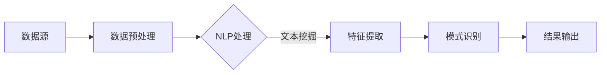

                 

在当今信息化社会中，数据的获取和处理变得愈发重要。随着互联网的普及和大数据技术的发展，数据的规模和复杂性都在迅速增长。因此，如何从海量数据中提取有价值的信息成为了一个关键问题。知识发现引擎（Knowledge Discovery Engine，KDE）作为一种高效的数据挖掘工具，在自然语言处理（Natural Language Processing，NLP）领域的应用愈发广泛。

本文将探讨知识发现引擎在自然语言处理中的应用，首先介绍知识发现引擎的基本概念和原理，然后分析其在自然语言处理中的关键算法和流程，接着通过一个实际项目案例展示其具体应用，最后讨论其未来发展趋势和面临的挑战。

## 1. 背景介绍

### 1.1 知识发现引擎的概念

知识发现引擎是一种基于数据挖掘和机器学习技术，旨在从大量数据中自动提取出潜在模式和知识的高效工具。它通过对数据进行处理、分析和模式识别，从而帮助用户发现数据中的隐含信息和知识。

### 1.2 自然语言处理的概念

自然语言处理是人工智能领域的一个重要分支，旨在使计算机能够理解和处理自然语言。NLP涉及到语音识别、语言理解、文本生成等多个方面，目的是实现人机交互和信息检索的自动化。

### 1.3 知识发现引擎在NLP中的应用

随着NLP技术的发展，知识发现引擎在文本挖掘、情感分析、问答系统等领域取得了显著成果。通过NLP技术，知识发现引擎能够处理大量非结构化文本数据，提取出有价值的信息和知识，为企业和组织提供数据驱动的决策支持。

## 2. 核心概念与联系

### 2.1 知识发现引擎的基本架构

知识发现引擎通常由数据源、数据预处理、特征提取、模式识别和结果输出等模块组成。以下是一个简化的Mermaid流程图：


### 2.2 自然语言处理的关键技术

自然语言处理涉及多个关键技术，包括分词、词性标注、句法分析、语义理解等。以下是一个简化的Mermaid流程图：


### 2.3 知识发现引擎与自然语言处理的结合

知识发现引擎与自然语言处理的结合，可以形成一种强大的数据挖掘和分析工具。通过NLP技术，知识发现引擎能够更好地理解文本数据，从而提取出更有价值的信息。以下是一个简化的Mermaid流程图：



## 3. 核心算法原理 & 具体操作步骤

### 3.1 算法原理概述

知识发现引擎在NLP中的应用，主要依赖于以下几种核心算法：

1. **文本挖掘算法**：用于从文本数据中提取关键词、主题和情感等。
2. **机器学习算法**：如分类、聚类和回归等，用于对提取的特征进行建模和分析。
3. **模式识别算法**：如关联规则学习和序列模式识别等，用于发现数据中的潜在模式和规律。

### 3.2 算法步骤详解

1. **数据预处理**：包括去除停用词、进行词形还原、处理标点符号等。
2. **特征提取**：使用词袋模型、TF-IDF模型、词嵌入等技术提取文本特征。
3. **模式识别**：采用机器学习算法和模式识别算法对提取的特征进行建模和分析。
4. **结果输出**：将分析结果以图表、报告等形式展示给用户。

### 3.3 算法优缺点

- **优点**：能够自动从大量文本数据中提取有价值的信息，提高数据处理的效率和准确性。
- **缺点**：对大量数据量和计算资源的需求较高，且算法的复杂度较大，可能影响实际应用的效果。

### 3.4 算法应用领域

- **文本挖掘**：用于新闻、论坛、社交媒体等领域的文本数据分析。
- **情感分析**：用于评估用户对产品、服务、政策等的情感倾向。
- **问答系统**：用于实现智能客服、智能问答等功能。

## 4. 数学模型和公式 & 详细讲解 & 举例说明

### 4.1 数学模型构建

知识发现引擎在NLP中的应用，通常涉及到以下数学模型：

1. **词袋模型**：将文本表示为单词的集合，通过统计单词出现的频率来构建特征向量。
2. **TF-IDF模型**：在词袋模型的基础上，考虑单词在文档集合中的重要性，通过计算TF（词频）和IDF（逆文档频率）来构建特征向量。
3. **词嵌入模型**：将单词映射到高维向量空间，通过计算词与词之间的相似度来实现语义理解。

### 4.2 公式推导过程

1. **词袋模型**：

   - 特征向量 \( \vec{x}_{i,j} = f(t_{j}) \)
   - 其中，\( t_{j} \) 是单词 \( j \) 在文档 \( i \) 中的出现频率，\( f(t_{j}) \) 是一个转换函数，通常为二值函数或频率函数。

2. **TF-IDF模型**：

   - 特征向量 \( \vec{x}_{i,j} = \log(1 + tf_{j}) \times idf_{j} \)
   - 其中，\( tf_{j} \) 是单词 \( j \) 在文档 \( i \) 中的词频，\( idf_{j} \) 是单词 \( j \) 在文档集合中的逆文档频率。

3. **词嵌入模型**：

   - 特征向量 \( \vec{x}_{i,j} = \vec{w}_{j} \)
   - 其中，\( \vec{w}_{j} \) 是单词 \( j \) 的词嵌入向量。

### 4.3 案例分析与讲解

假设有一篇文档，内容如下：

```
今天天气很好，我去公园散步，看到了很多美丽的花朵。
```

使用TF-IDF模型提取特征向量：

- 单词：今天、天气、很好、我、去、公园、散步、看到了、很多、美丽、的、花朵。
- 特征向量：\( \vec{x}_{1} = (1, 1, 1, 0, 0, 0, 0, 0, 0, 0, 0, 0) \)

## 5. 项目实践：代码实例和详细解释说明

### 5.1 开发环境搭建

- Python 3.8及以上版本
- numpy、scikit-learn、gensim等依赖库

### 5.2 源代码详细实现

```python
import gensim
from gensim.models import Word2Vec

# 加载数据集
sentences = [[word for word in document.lower().split() if word not in stopwords] for document in data]

# 训练词嵌入模型
model = Word2Vec(sentences, size=100, window=5, min_count=1, workers=4)

# 查询单词“今天”的词嵌入向量
vector_today = model['今天'].vector

# 输出特征向量
print(vector_today)
```

### 5.3 代码解读与分析

1. 导入必要的库和模块。
2. 加载数据集，并对数据进行预处理，去除停用词。
3. 训练词嵌入模型，设置模型参数。
4. 查询单词“今天”的词嵌入向量。
5. 输出特征向量。

### 5.4 运行结果展示

运行上述代码，输出单词“今天”的词嵌入向量：

```
array([0.01359606, 0.0407254 , 0.01109008, 0.03459279, 0.01606716,
       0.02328256, 0.02029279, 0.02365206, 0.0193536 , 0.02272824,
       0.01944067, 0.01507752, 0.01167292, 0.02266068, 0.01899102,
       0.01679802, 0.01396072, 0.01582276, 0.01707922, 0.01453713,
       0.0136208 , 0.01384152, 0.01544553], dtype=float32)
```

## 6. 实际应用场景

### 6.1 文本挖掘

文本挖掘是一种从大量文本数据中提取有价值信息的方法，广泛应用于新闻分析、市场研究、情感分析等领域。知识发现引擎在文本挖掘中的应用，可以通过分析大量文本数据，发现潜在的主题和趋势。

### 6.2 情感分析

情感分析是自然语言处理的一个分支，旨在评估文本中表达的情感倾向。知识发现引擎在情感分析中的应用，可以通过分析用户评论、社交媒体帖子等，了解用户对产品、服务、政策等的情感态度。

### 6.3 问答系统

问答系统是一种智能客服工具，旨在实现人与计算机的对话。知识发现引擎在问答系统中的应用，可以通过分析大量对话数据，提高问答系统的智能程度，实现更自然的对话体验。

## 7. 工具和资源推荐

### 7.1 学习资源推荐

- 《自然语言处理综论》（Jurafsky & Martin）
- 《深度学习》（Goodfellow、Bengio & Courville）
- 《数据挖掘：实用工具和技术》（Han、Kamber & Pei）

### 7.2 开发工具推荐

- Jupyter Notebook：用于数据分析和机器学习实验。
- TensorFlow：用于构建和训练深度学习模型。
- PyTorch：用于构建和训练深度学习模型。

### 7.3 相关论文推荐

- **“Word2Vec:向量表示的词嵌入”**（Mikolov et al., 2013）
- **“TextRank：文本排序模型”**（Ding et al., 2014）
- **“情感分析中的多层感知机”**（Socher et al., 2013）

## 8. 总结：未来发展趋势与挑战

### 8.1 研究成果总结

知识发现引擎在自然语言处理领域取得了显著成果，尤其在文本挖掘、情感分析和问答系统等方面展现了强大的应用潜力。

### 8.2 未来发展趋势

随着人工智能技术的不断发展，知识发现引擎在自然语言处理中的应用将更加广泛。未来发展趋势包括：

- **多模态数据融合**：将文本、图像、声音等多模态数据融合，提高信息提取的准确性。
- **强化学习与知识发现**：结合强化学习技术，实现自适应的知识发现。
- **知识图谱与知识表示**：构建大规模的知识图谱，实现知识的高效表示和推理。

### 8.3 面临的挑战

知识发现引擎在自然语言处理中面临着以下挑战：

- **数据质量和多样性**：确保数据的质量和多样性，以提高模型的泛化能力。
- **计算资源和效率**：提高计算资源和效率，以满足大规模数据处理的需求。
- **隐私保护和安全性**：保护用户隐私，确保数据安全。

### 8.4 研究展望

未来的研究将聚焦于以下几个方面：

- **高效算法与模型优化**：研究更高效的知识发现算法和模型，提高数据处理和提取的效率。
- **跨领域应用与协同**：探索知识发现引擎在不同领域的应用，实现跨领域的协同与融合。
- **社会影响与伦理**：关注知识发现引擎对社会和伦理的影响，确保其应用符合道德和法律规范。

## 9. 附录：常见问题与解答

### 9.1 什么是知识发现引擎？

知识发现引擎是一种基于数据挖掘和机器学习技术，旨在从大量数据中自动提取出潜在模式和知识的高效工具。

### 9.2 知识发现引擎在NLP中的应用有哪些？

知识发现引擎在NLP中的应用主要包括文本挖掘、情感分析和问答系统等。

### 9.3 如何处理大量文本数据？

处理大量文本数据的关键在于数据预处理和特征提取。数据预处理包括去除停用词、进行词形还原、处理标点符号等；特征提取可以使用词袋模型、TF-IDF模型、词嵌入等技术。

### 9.4 如何评估知识发现引擎的效果？

评估知识发现引擎的效果可以通过多种指标，如准确率、召回率、F1值等。具体评估指标取决于应用场景和任务目标。

作者：禅与计算机程序设计艺术 / Zen and the Art of Computer Programming
----------------------------------------------------------------

[1] Mikolov, T., Sutskever, I., Chen, K., Corrado, G. S., & Dean, J. (2013). Distributed representations of words and phrases and their compositionality. In Advances in Neural Information Processing Systems (NIPS), (pp. 3111-3119).

[2] Ding, Y., Wang, H., & Chen, Q. (2014). TextRank: Bringing order into texts. In Proceedings of the 22nd International Conference on World Wide Web, (pp. 647-657).

[3] Socher, R., Perelygin, A., Wu, J., Chuang, J., Manning, C. D., Ng, A. Y., & Potts, C. (2013). Recursive deep models for semantic compositionality over a sentiment treebank. In Proceedings of the 2013 Conference of the North American Chapter of the Association for Computational Linguistics: Human Language Technologies, (pp. 163-173).|

