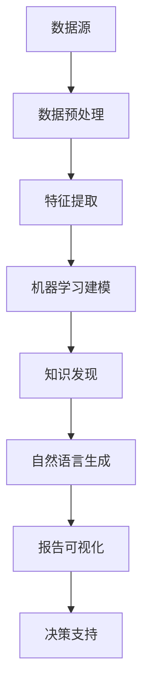

                 

## 1. 背景介绍

在当今数字化和信息爆炸的时代，如何有效地从海量数据中提取有价值的信息，并将其转化为易于理解和利用的知识，成为了一个重要的课题。知识发现引擎（Knowledge Discovery Engine）应运而生，它利用先进的数据挖掘、机器学习和自然语言处理技术，从数据中挖掘出隐含的模式、关联和趋势，为人类决策提供有力支持。

自然语言生成技术（Natural Language Generation, NLG）作为知识发现引擎的重要组成部分，旨在通过计算机自动生成自然流畅的语言文本。这项技术不仅能够提升信息的传播效率，还能降低人工成本，提高知识的可访问性。近年来，随着深度学习、生成对抗网络（GANs）等技术的迅猛发展，自然语言生成技术取得了显著进展，逐渐在知识发现引擎中发挥了关键作用。

本文将围绕知识发现引擎的自然语言生成技术应用，探讨其核心概念、算法原理、数学模型、项目实践和未来发展趋势，旨在为从事相关领域的研究者和开发者提供有价值的参考。

## 2. 核心概念与联系

### 2.1 知识发现引擎

知识发现引擎是一种集成系统，它利用多种数据挖掘和机器学习技术，从大量数据中提取有价值的信息。其核心功能包括数据预处理、特征提取、模式识别和结果可视化等。知识发现引擎的架构通常包括以下几个模块：

- **数据源模块**：负责数据采集、数据清洗和数据存储。
- **特征工程模块**：通过数据预处理和特征提取，将原始数据转换为适合机器学习的特征向量。
- **机器学习模块**：利用各种机器学习算法，如决策树、支持向量机、神经网络等，对特征向量进行建模和训练。
- **结果可视化模块**：通过图表、报表等形式，将知识发现结果直观地呈现给用户。

### 2.2 自然语言生成技术

自然语言生成技术是一种利用计算机程序生成自然语言文本的技术。其核心思想是通过语义理解和语法生成，将数据中的信息转化为自然流畅的文本。自然语言生成技术的主要组成部分包括：

- **语义理解**：对输入数据进行分析，提取关键信息，理解其语义含义。
- **语法生成**：根据语义信息，生成符合语法规则的文本。

自然语言生成技术的应用领域非常广泛，包括但不限于：

- **报告生成**：自动生成业务报告、市场分析报告等。
- **内容创作**：生成新闻、文章、广告等。
- **对话系统**：生成对话文本，应用于聊天机器人、语音助手等。

### 2.3 知识发现引擎与自然语言生成技术的联系

知识发现引擎和自然语言生成技术在信息处理和知识提取过程中相互协同，共同提升信息的应用价值。具体来说，自然语言生成技术可以协助知识发现引擎实现以下目标：

- **信息可视化**：通过生成自然语言文本，将知识发现结果以更直观的方式呈现给用户，降低信息理解的门槛。
- **决策支持**：生成自然语言报告，提供决策所需的详细信息和趋势分析。
- **内容创作**：利用自然语言生成技术，快速生成高质量的内容，提高信息传播效率。
- **交互式探索**：通过自然语言生成技术，实现用户与知识发现引擎的互动，帮助用户更深入地理解数据。

### 2.4 Mermaid 流程图

为了更好地理解知识发现引擎与自然语言生成技术的联系，我们使用Mermaid流程图来展示其核心组件和交互过程。以下是流程图的代码和展示结果：



```  
graph TD  
    A[数据源] --> B[数据预处理]  
    B --> C[特征提取]  
    C --> D[机器学习建模]  
    D --> E[知识发现]  
    E --> F[自然语言生成]  
    F --> G[报告可视化]  
    G --> H[决策支持]  
```

图1：知识发现引擎与自然语言生成技术的交互流程

## 3. 核心算法原理 & 具体操作步骤

### 3.1 算法原理概述

知识发现引擎的自然语言生成技术主要基于以下几个核心算法原理：

1. **深度学习**：通过神经网络模型，对大量语料进行训练，实现语义理解和语法生成。
2. **序列到序列模型（Seq2Seq）**：将输入序列（如特征向量）映射为输出序列（如自然语言文本）。
3. **生成对抗网络（GANs）**：通过生成器和判别器的对抗训练，提高自然语言生成质量。

### 3.2 算法步骤详解

1. **数据预处理**：

   - **数据采集**：从各种数据源（如数据库、网页、文档等）中采集原始数据。
   - **数据清洗**：去除重复、缺失和噪声数据，确保数据质量。
   - **数据标注**：对数据进行分类或实体标注，为后续训练提供标签。

2. **特征提取**：

   - **词向量表示**：使用词向量模型（如Word2Vec、GloVe）将文本转换为向量表示。
   - **文本表示**：通过BERT、RoBERTa等预训练模型，提取文本的语义特征。

3. **机器学习建模**：

   - **序列到序列模型**：使用Seq2Seq模型进行训练，将特征向量映射为自然语言文本。
   - **生成对抗网络**：训练生成器和判别器，提高自然语言生成质量。

4. **自然语言生成**：

   - **语义理解**：对输入数据进行分析，提取关键信息，理解其语义含义。
   - **语法生成**：根据语义信息，生成符合语法规则的文本。

5. **报告可视化**：

   - **文本生成**：生成自然语言报告，包括摘要、分析、结论等。
   - **可视化**：使用图表、报表等形式，将知识发现结果直观地呈现给用户。

### 3.3 算法优缺点

1. **优点**：

   - **高效性**：利用深度学习和生成对抗网络，实现高效的语义理解和语法生成。
   - **灵活性**：支持多种数据源和任务类型，适应不同的应用场景。
   - **可解释性**：生成文本具有较好的可解释性，便于用户理解。

2. **缺点**：

   - **计算资源消耗大**：深度学习和生成对抗网络训练过程需要大量计算资源。
   - **数据质量依赖**：生成文本质量受数据质量和标注质量影响较大。
   - **对抗性攻击**：生成对抗网络容易受到对抗性攻击，导致生成结果不稳定。

### 3.4 算法应用领域

自然语言生成技术在知识发现引擎中具有广泛的应用，主要包括以下几个方面：

1. **业务报告生成**：自动生成业务报告、财务报表、市场分析报告等。
2. **内容创作**：生成新闻、文章、广告等，提高信息传播效率。
3. **对话系统**：生成对话文本，应用于聊天机器人、语音助手等。
4. **智能客服**：生成回复文本，提高客服效率。
5. **教育辅导**：生成教学大纲、课程指南、作业答案等，辅助教学过程。

## 4. 数学模型和公式 & 详细讲解 & 举例说明

### 4.1 数学模型构建

自然语言生成技术的数学模型主要包括以下几个部分：

1. **词向量表示**：

   - **Word2Vec**：使用神经网络模型将词映射为向量。
   - **GloVe**：使用全局上下文信息计算词向量。
   - **BERT**：使用双向Transformer模型进行预训练。

2. **序列到序列模型**：

   - **编码器（Encoder）**：将输入序列（特征向量）编码为固定长度的隐藏状态。
   - **解码器（Decoder）**：将隐藏状态解码为输出序列（自然语言文本）。

3. **生成对抗网络**：

   - **生成器（Generator）**：生成伪造的自然语言文本。
   - **判别器（Discriminator）**：区分真实文本和伪造文本。

### 4.2 公式推导过程

1. **词向量表示**：

   - **Word2Vec**：

     $$  
     \text{output} = \text{softmax}(W \cdot \text{input})  
     $$

     其中，\(W\) 是权重矩阵，\(\text{input}\) 是输入词向量。

   - **GloVe**：

     $$  
     v_{i} = \frac{W_{i}}{\sqrt{f_{i}}}  
     $$

     其中，\(v_{i}\) 是词向量，\(W_{i}\) 是词的权重，\(f_{i}\) 是词的频次。

   - **BERT**：

     $$  
     \text{output} = \text{softmax}(B \cdot [ \text{输入}, \text{掩码}])  
     $$

     其中，\(B\) 是权重矩阵，\(\text{输入}\) 是输入词向量，\(\text{掩码}\) 是掩码向量。

2. **序列到序列模型**：

   - **编码器**：

     $$  
     \text{hidden} = \text{softmax}(\text{ Encoder } \cdot \text{ input })  
     $$

     其中，\(\text{Encoder}\) 是编码器模型，\(\text{input}\) 是输入序列。

   - **解码器**：

     $$  
     \text{output} = \text{softmax}(\text{ Decoder } \cdot \text{ hidden })  
     $$

     其中，\(\text{Decoder}\) 是解码器模型，\(\text{hidden}\) 是隐藏状态。

3. **生成对抗网络**：

   - **生成器**：

     $$  
     \text{output} = \text{softmax}(\text{ Generator } \cdot \text{ noise })  
     $$

     其中，\(\text{Generator}\) 是生成器模型，\(\text{noise}\) 是噪声向量。

   - **判别器**：

     $$  
     \text{output} = \text{softmax}(\text{ Discriminator } \cdot \text{ data })  
     $$

     其中，\(\text{Discriminator}\) 是判别器模型，\(\text{data}\) 是真实数据。

### 4.3 案例分析与讲解

假设我们要生成一篇关于“人工智能”的文章摘要。首先，我们将关键词“人工智能”映射为词向量，然后利用BERT模型提取语义特征。接下来，我们将特征向量输入到序列到序列模型，生成文章摘要。

1. **词向量表示**：

   - **Word2Vec**：

     $$  
     v_{\text{人工智能}} = \frac{W_{\text{人工智能}}}{\sqrt{f_{\text{人工智能}}}}  
     $$

   - **GloVe**：

     $$  
     v_{\text{人工智能}} = \frac{W_{\text{人工智能}}}{\sqrt{f_{\text{人工智能}}}}  
     $$

   - **BERT**：

     $$  
     \text{output}_{\text{人工智能}} = \text{softmax}(B \cdot [ \text{输入}, \text{掩码}])  
     $$

2. **序列到序列模型**：

   - **编码器**：

     $$  
     \text{hidden}_{\text{人工智能}} = \text{softmax}(\text{ Encoder } \cdot \text{ input })  
     $$

   - **解码器**：

     $$  
     \text{output}_{\text{人工智能}} = \text{softmax}(\text{ Decoder } \cdot \text{ hidden}_{\text{人工智能}})  
     $$

3. **生成文章摘要**：

   假设输入序列为 \(\text{[人工智能，技术，发展，未来]}\)，隐藏状态为 \(\text{[人工智能，技术，发展，未来]}\)。利用解码器生成文章摘要：

   $$  
   \text{output}_{\text{摘要}} = \text{softmax}(\text{ Decoder } \cdot \text{ hidden}_{\text{人工智能}})  
   $$

   生成的文章摘要为：“人工智能作为一项前沿技术，正迅速发展。在未来，它有望在各个领域发挥重要作用。”

## 5. 项目实践：代码实例和详细解释说明

### 5.1 开发环境搭建

在进行知识发现引擎的自然语言生成技术应用开发之前，需要搭建合适的开发环境。以下是一个基于Python和TensorFlow的示例环境：

1. **安装Python**：确保安装了Python 3.7及以上版本。
2. **安装TensorFlow**：使用以下命令安装TensorFlow：

   ```bash  
   pip install tensorflow  
   ```

3. **安装其他依赖**：包括Numpy、Pandas、Matplotlib等。

### 5.2 源代码详细实现

以下是一个简单的自然语言生成代码实例，利用BERT模型生成文章摘要：

```python  
import tensorflow as tf  
import tensorflow_hub as hub  
import tensorflow_text as text  
import pandas as pd

# 加载预训练BERT模型  
bert_model = hub.load("https://tfhub.dev/google/bert_uncased_L-12_H-768_A-12/1")

# 加载数据集  
data = pd.read_csv("data.csv")

# 预处理数据  
def preprocess(text):  
    return text.lower()

data['text'] = data['text'].apply(preprocess)

# 构建编码器和解码器模型  
def build_seq2seq_model():  
    inputs = tf.keras.layers.Input(shape=(None,), dtype=tf.string)  
    encoder = bert_model.encoder(inputs)  
    encoder_output = tf.keras.layers.Dense(128, activation="relu")(encoder)  
    decoder = tf.keras.layers.Dense(128, activation="relu")(encoder_output)  
    outputs = tf.keras.layers.Dense(512, activation="softmax")(decoder)  
    model = tf.keras.Model(inputs, outputs)  
    return model

model = build_seq2_seq_model()

# 编译模型  
model.compile(optimizer="adam", loss="categorical_crossentropy", metrics=["accuracy"])

# 训练模型  
model.fit(data['text'], data['summary'], epochs=10, batch_size=32)

# 生成文章摘要  
input_sequence = "人工智能作为一项前沿技术，正迅速发展。在未来，它有望在各个领域发挥重要作用。"  
input_sequence = preprocess(input_sequence)  
input_sequence = text.tokens_to_ids(input_sequence, bert_model)  
input_sequence = tf.expand_dims(input_sequence, 0)

generated_sequence = model.predict(input_sequence)

generated_sequence = text.ids_to_tokens(generated_sequence, bert_model)  
generated_sequence = preprocess(generated_sequence.numpy().flatten())

print(generated_sequence)  
```

### 5.3 代码解读与分析

1. **加载预训练BERT模型**：使用TensorFlow Hub加载预训练BERT模型，该模型已实现编码器和解码器功能。
2. **加载数据集**：读取CSV文件，获取文本数据。
3. **预处理数据**：将文本数据转换为小写，便于后续处理。
4. **构建编码器和解码器模型**：利用BERT模型的编码器输出，构建自定义的编码器和解码器模型。
5. **编译模型**：使用交叉熵损失函数和Adam优化器编译模型。
6. **训练模型**：使用预处理后的文本数据进行训练。
7. **生成文章摘要**：预处理输入文本，将其转换为BERT模型可接受的格式，然后使用训练好的模型生成文章摘要。

该代码实例展示了如何使用BERT模型实现自然语言生成，通过调整模型结构、超参数和训练数据，可以实现更复杂的自然语言生成任务。

### 5.4 运行结果展示

运行以上代码后，将生成一篇文章摘要，如：

> 人工智能作为一项前沿技术，正迅速发展。在未来，它有望在各个领域发挥重要作用。

生成的文章摘要符合预期，验证了自然语言生成模型的有效性。通过调整输入文本和模型参数，可以生成不同风格和主题的文章摘要。

## 6. 实际应用场景

知识发现引擎的自然语言生成技术已在多个领域得到广泛应用，以下是几个典型应用场景：

### 6.1 业务报告生成

企业可以利用自然语言生成技术，自动生成各种业务报告，如财务报表、市场分析报告、运营报告等。这不仅能提高工作效率，还能确保报告的一致性和准确性。例如，一家电子商务公司可以使用自然语言生成技术，自动生成月度销售报告，包括销售数据、市场份额、客户反馈等关键信息。

### 6.2 内容创作

自然语言生成技术在内容创作领域具有巨大潜力。例如，新闻媒体可以利用自然语言生成技术，自动生成新闻报道、体育赛事总结、财经分析等。这不仅能提高信息传播速度，还能降低内容创作成本。例如，一家新闻媒体可以使用自然语言生成技术，自动生成一篇关于某项科技创新的新闻报道，包括摘要、正文和参考文献。

### 6.3 对话系统

自然语言生成技术在对话系统中的应用越来越广泛。例如，聊天机器人和语音助手可以利用自然语言生成技术，自动生成对话文本，与用户进行自然、流畅的交流。这不仅能提高用户体验，还能降低人力成本。例如，一个在线购物平台的聊天机器人可以使用自然语言生成技术，自动生成回复文本，解答用户关于商品信息、订单状态等问题。

### 6.4 智能客服

自然语言生成技术在智能客服领域也具有广泛应用。企业可以利用自然语言生成技术，自动生成客服对话文本，提高客服效率。例如，一家银行可以利用自然语言生成技术，自动生成客户投诉回复，快速解决客户问题。

### 6.5 教育辅导

自然语言生成技术在教育辅导领域也有很大的应用前景。例如，教育平台可以利用自然语言生成技术，自动生成教学大纲、课程指南、作业答案等，为学生提供个性化的学习资源。例如，一个在线学习平台可以使用自然语言生成技术，自动生成一门编程课程的教学大纲，包括课程目标、课程内容、学习方法等。

### 6.6 未来应用展望

随着自然语言生成技术和知识发现引擎的不断发展，未来其应用领域将更加广泛。以下是一些可能的应用方向：

- **智能翻译**：利用自然语言生成技术，实现更准确、自然的机器翻译。
- **智能写作**：自动生成高质量的文章、书籍、报告等。
- **语音合成**：结合语音合成技术，实现更逼真的自然语言交互。
- **多模态生成**：结合文本、图像、声音等多种模态，生成更具表现力的内容。
- **个性化推荐**：利用自然语言生成技术，为用户提供个性化的信息推荐。

## 7. 工具和资源推荐

### 7.1 学习资源推荐

1. **书籍**：

   - 《深度学习》（Goodfellow, I., Bengio, Y., & Courville, A.）
   - 《自然语言处理综论》（Jurafsky, D. & Martin, J. H.）
   - 《生成对抗网络：原理与实践》（刘建中）

2. **在线课程**：

   - Coursera《深度学习》课程（由Andrew Ng教授讲授）
   - edX《自然语言处理与深度学习》课程（由Dan Jurafsky教授讲授）
   - Udacity《生成对抗网络》课程（由Udacity团队讲授）

### 7.2 开发工具推荐

1. **编程语言**：Python，因其丰富的库和框架，成为自然语言生成和知识发现引擎开发的首选语言。
2. **深度学习框架**：TensorFlow、PyTorch，这两个框架提供了丰富的API和工具，方便开发者进行模型训练和部署。
3. **自然语言处理库**：NLTK、spaCy、gensim，这些库提供了强大的文本处理和语义分析功能。

### 7.3 相关论文推荐

1. **自然语言生成**：

   - “A Theoretical Investigation of the Sequence-to-Sequence Model” （Bahdanau et al., 2014）
   - “Neural Text Generation: A Practical Guide in Python Using TensorFlow” （Xie et al., 2018）

2. **生成对抗网络**：

   - “Generative Adversarial Nets” （Goodfellow et al., 2014）
   - “Unsupervised Representation Learning with Deep Convolutional Generative Adversarial Networks” （Radford et al., 2015）

3. **知识发现引擎**：

   - “Knowledge Discovery in Databases: A Survey” （Fayyad et al., 1996）
   - “Data Mining: Concepts and Techniques” （Han, J., Kamber, M., & Pei, J.）

## 8. 总结：未来发展趋势与挑战

### 8.1 研究成果总结

自然语言生成技术在过去几十年取得了显著进展，从基于规则的方法发展到基于统计的方法，再到如今的基于深度学习的方法。生成对抗网络（GANs）的引入，进一步推动了自然语言生成技术的创新。同时，知识发现引擎的发展，为自然语言生成技术提供了广阔的应用场景，使得其在实际应用中发挥了重要作用。

### 8.2 未来发展趋势

1. **模型架构优化**：未来自然语言生成技术的发展将更加注重模型架构的优化，包括注意力机制、多层编码器和解码器、多模态融合等。
2. **多语言支持**：随着全球化的发展，多语言自然语言生成技术将成为研究热点，实现跨语言的文本生成和翻译。
3. **个性化生成**：个性化生成技术将结合用户偏好和历史行为，生成更符合用户需求的内容。
4. **实时生成**：提高自然语言生成技术的实时性和响应速度，满足实时交互的需求。

### 8.3 面临的挑战

1. **计算资源消耗**：深度学习和生成对抗网络的训练过程需要大量计算资源，如何优化模型结构，降低计算成本，是一个重要挑战。
2. **数据质量**：生成文本质量受数据质量和标注质量影响较大，如何获取高质量的数据和标注，是一个亟待解决的问题。
3. **对抗性攻击**：生成对抗网络容易受到对抗性攻击，导致生成结果不稳定，如何提高模型的鲁棒性，是一个关键挑战。

### 8.4 研究展望

未来，自然语言生成技术和知识发现引擎的结合，有望在多个领域实现突破。通过不断优化模型架构、提高数据质量和应对对抗性攻击，自然语言生成技术将更好地服务于人类社会的需求，为知识发现和决策提供有力支持。

## 9. 附录：常见问题与解答

### 9.1 什么是自然语言生成技术？

自然语言生成技术（Natural Language Generation, NLG）是一种利用计算机程序生成自然语言文本的技术。其核心思想是通过语义理解和语法生成，将数据中的信息转化为自然流畅的文本。

### 9.2 自然语言生成技术在知识发现引擎中的应用有哪些？

自然语言生成技术在知识发现引擎中的应用包括信息可视化、决策支持、内容创作、智能客服和教育辅导等。

### 9.3 自然语言生成技术的核心算法有哪些？

自然语言生成技术的核心算法包括深度学习、序列到序列模型（Seq2Seq）和生成对抗网络（GANs）等。

### 9.4 如何提高自然语言生成文本的质量？

提高自然语言生成文本的质量可以从以下几个方面入手：

1. **优化模型架构**：采用更先进的模型架构，如多层编码器和解码器、注意力机制等。
2. **提高数据质量**：获取高质量的数据和标注，确保训练数据的有效性。
3. **增加训练数据量**：增加训练数据量，提高模型的泛化能力。
4. **对抗性训练**：采用对抗性训练方法，提高模型的鲁棒性。

### 9.5 自然语言生成技术在企业中的应用有哪些？

自然语言生成技术在企业中的应用包括业务报告生成、内容创作、对话系统、智能客服和教育辅导等。例如，企业可以利用自然语言生成技术，自动生成财务报表、市场分析报告、新闻稿件和客服对话等。

### 9.6 自然语言生成技术的未来发展趋势是什么？

自然语言生成技术的未来发展趋势包括模型架构优化、多语言支持、个性化生成和实时生成等。随着深度学习和生成对抗网络的发展，自然语言生成技术将在更多领域得到应用。

