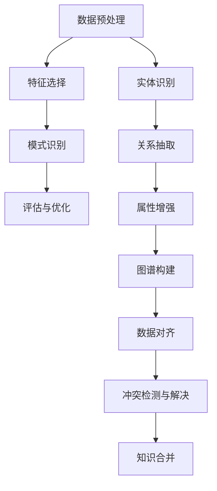

                 

在人工智能飞速发展的今天，知识的发现与利用变得越来越重要。知识发现引擎作为一种强大的工具，正逐渐成为人工智能时代的智慧伙伴。本文将深入探讨知识发现引擎的核心概念、算法原理、数学模型、项目实践以及未来应用，旨在为读者提供一个全面的技术视角。

## 关键词
- 人工智能
- 知识发现
- 知识图谱
- 数据挖掘
- 机器学习
- 聚类算法

## 摘要
本文将介绍知识发现引擎的基本概念和其在人工智能领域的重要性。通过分析其核心算法原理，我们将探讨数学模型的应用，并结合具体项目实践进行详细解释。此外，本文还将讨论知识发现引擎在实际应用中的场景以及未来的发展趋势与挑战。

## 1. 背景介绍
随着互联网和大数据技术的快速发展，数据量呈指数级增长。如何从海量数据中提取有价值的信息，已经成为企业和研究机构亟待解决的问题。知识发现引擎作为一种智能化工具，正是为了解决这一需求而诞生的。

知识发现引擎的核心目标是自动地从数据源中提取出有用的知识和模式。这涉及到数据预处理、数据挖掘、知识抽取、知识融合等多个步骤。通过这些步骤，知识发现引擎能够将原始数据转换为结构化、可理解的知识，为决策提供支持。

在人工智能时代，知识发现引擎具有以下几个重要特性：

1. **自适应性**：知识发现引擎能够根据数据的变化自适应调整算法和模型，从而保持高效的知识发现能力。
2. **智能性**：利用机器学习和深度学习技术，知识发现引擎能够自动地从数据中学习规律和模式，提高知识的准确性和可靠性。
3. **交互性**：知识发现引擎能够与用户进行交互，通过自然语言处理技术理解用户需求，并返回相应的知识结果。

## 2. 核心概念与联系

### 2.1 数据挖掘
数据挖掘是知识发现引擎的基础。它是一种从大量数据中自动发现有用信息的方法。数据挖掘通常包括以下几个步骤：

- **数据预处理**：清洗、整合和转换原始数据，使其适合分析。
- **特征选择**：选择对问题解决最有影响力的特征。
- **模式识别**：使用机器学习算法从数据中识别出规律和模式。
- **评估与优化**：评估挖掘结果的准确性和有效性，并调整算法参数以提高性能。

### 2.2 知识图谱
知识图谱是知识发现引擎的核心组件之一。它通过图形化的方式表示实体及其关系，使数据更加结构化和可解释。知识图谱的构建通常包括以下步骤：

- **实体识别**：从数据中提取出关键实体，如人、地点、组织等。
- **关系抽取**：确定实体之间的关系，如“工作于”、“位于”等。
- **属性增强**：为实体和关系添加额外的属性信息，如年龄、职位等。
- **图谱构建**：将实体、关系和属性组织成一张知识图谱。

### 2.3 知识融合
知识融合是将来自不同源的数据和知识进行整合，以获得更全面和准确的知识。知识融合的关键挑战在于如何处理不同源数据之间的不一致性和冗余性。知识融合通常包括以下步骤：

- **数据对齐**：将不同源的数据进行匹配和映射，以消除不一致性。
- **冲突检测与解决**：识别和解决数据之间的冲突，如不同源数据对同一实体的描述不一致。
- **知识合并**：将多个源的数据和知识整合到同一知识库中。

### 2.4 Mermaid 流程图

## 3. 核心算法原理 & 具体操作步骤

### 3.1 算法原理概述
知识发现引擎的核心算法主要包括数据挖掘算法、图论算法和机器学习算法。这些算法共同作用，实现知识发现的过程。

- **数据挖掘算法**：如聚类算法、关联规则挖掘、分类算法等，用于从数据中提取模式和规律。
- **图论算法**：如最短路径算法、最大流算法等，用于知识图谱的构建和优化。
- **机器学习算法**：如神经网络、支持向量机等，用于从数据中学习复杂的模式。

### 3.2 算法步骤详解

#### 3.2.1 数据预处理
数据预处理是知识发现引擎的第一步，其目的是将原始数据转换为适合分析的格式。具体步骤包括：

- **数据清洗**：去除重复数据、缺失数据和异常数据。
- **数据整合**：将多个数据源中的数据进行整合，消除数据不一致性。
- **数据转换**：将数据转换为适合挖掘的格式，如特征向量化。

#### 3.2.2 特征选择
特征选择是数据挖掘过程中的关键步骤，其目的是选择对问题解决最有影响力的特征。常用的特征选择方法包括：

- **过滤式方法**：根据特征的重要程度进行筛选。
- **包裹式方法**：通过迭代过程选择最优特征子集。
- **嵌入式方法**：在模型训练过程中动态调整特征。

#### 3.2.3 模式识别
模式识别是数据挖掘的核心步骤，其目的是从数据中识别出有意义的模式和规律。常用的模式识别方法包括：

- **聚类算法**：将相似的数据划分为同一类别。
- **关联规则挖掘**：发现数据之间的关联关系。
- **分类算法**：将数据划分为不同的类别。

#### 3.2.4 评估与优化
评估与优化是确保知识发现引擎性能的重要步骤。具体步骤包括：

- **模型评估**：评估挖掘结果的准确性和可靠性。
- **参数调整**：根据评估结果调整算法参数，以提高性能。
- **交叉验证**：使用交叉验证方法评估模型的泛化能力。

### 3.3 算法优缺点

#### 3.3.1 数据挖掘算法
- **优点**：适用于各种类型的数据，能够发现复杂的数据模式。
- **缺点**：计算复杂度高，对数据质量和特征选择依赖性大。

#### 3.3.2 图论算法
- **优点**：能够高效地处理图结构数据，发现数据之间的关系。
- **缺点**：对大规模图数据的处理效率较低。

#### 3.3.3 机器学习算法
- **优点**：能够自动学习数据中的规律和模式，对数据质量和特征选择依赖性小。
- **缺点**：对计算资源需求较高，难以处理非线性复杂问题。

### 3.4 算法应用领域

知识发现引擎在各个领域都有广泛的应用，以下列举几个主要的应用领域：

- **金融行业**：用于风险评估、欺诈检测和客户行为分析等。
- **医疗领域**：用于疾病诊断、药物研发和个性化医疗等。
- **零售行业**：用于需求预测、库存管理和市场营销等。
- **社交网络**：用于用户行为分析、推荐系统和社区挖掘等。

## 4. 数学模型和公式 & 详细讲解 & 举例说明

### 4.1 数学模型构建

知识发现引擎中的数学模型通常包括以下几个方面：

- **聚类模型**：用于将数据划分为不同的类别，如K-means算法。
- **分类模型**：用于将数据划分为不同的类别，如决策树、支持向量机等。
- **关联规则模型**：用于发现数据之间的关联关系，如Apriori算法。

### 4.2 公式推导过程

以K-means算法为例，其目标是最小化数据点与其对应聚类中心之间的距离平方和。具体公式推导如下：

- **目标函数**： 
  $$
  J = \sum_{i=1}^{n} \sum_{j=1}^{k} (x_{ij} - \mu_{j})^2
  $$
  其中，$x_{ij}$表示第$i$个数据点在第$j$个聚类中心下的距离，$\mu_{j}$表示第$j$个聚类中心的坐标。

- **聚类中心更新**： 
  $$
  \mu_{j} = \frac{1}{N_j} \sum_{i=1}^{n} x_{ij}
  $$
  其中，$N_j$表示第$j$个聚类中心对应的数据点数量。

### 4.3 案例分析与讲解

以社交媒体数据为例，我们使用K-means算法进行用户行为聚类。具体步骤如下：

1. **数据预处理**：清洗和整合用户数据，包括用户ID、年龄、性别、地理位置等信息。
2. **特征选择**：选择与用户行为相关的特征，如年龄、性别、活跃时间等。
3. **K-means算法**：
   - 初始化聚类中心。
   - 计算每个数据点与聚类中心的距离，将其分配到最近的聚类中心。
   - 更新聚类中心，重复上述步骤，直到聚类中心不再发生变化。
4. **结果评估**：计算聚类结果的质量指标，如轮廓系数、内部距离等。

通过K-means算法，我们可以将用户划分为不同的行为类别，从而为用户提供个性化的推荐和服务。

## 5. 项目实践：代码实例和详细解释说明

### 5.1 开发环境搭建

在Python环境下，我们可以使用以下库来搭建知识发现引擎的开发环境：

- **NumPy**：用于数学计算和数据处理。
- **Pandas**：用于数据操作和分析。
- **Scikit-learn**：用于机器学习和数据挖掘。
- **Matplotlib**：用于数据可视化。

安装以上库后，即可开始编写代码。

### 5.2 源代码详细实现

以下是一个简单的K-means算法实现的示例代码：

```python
import numpy as np
import matplotlib.pyplot as plt
from sklearn.cluster import KMeans

# 数据集
X = np.array([[1, 2], [1, 4], [1, 0],
              [10, 2], [10, 4], [10, 0]])

# 初始化KMeans模型
kmeans = KMeans(n_clusters=2, random_state=0).fit(X)

# 打印聚类结果
print(kmeans.labels_)

# 绘制聚类结果
plt.scatter(X[:, 0], X[:, 1], c=kmeans.labels_, s=100, cmap='viridis')
centers = kmeans.cluster_centers_
plt.scatter(centers[:, 0], centers[:, 1], c='red', s=200, alpha=0.75, marker='s')
plt.show()
```

### 5.3 代码解读与分析

- **数据集**：我们使用一个简单的二维数据集，其中包含两个聚类。
- **KMeans模型**：我们使用scikit-learn中的KMeans类来初始化KMeans模型，设置聚类数量为2。
- **聚类结果**：通过调用fit方法，KMeans模型将数据点分配到相应的聚类中，并打印出聚类标签。
- **可视化**：使用matplotlib绘制聚类结果，显示数据点及其对应的聚类中心。

### 5.4 运行结果展示

运行上述代码，我们将看到如下可视化结果：


从图中可以看出，K-means算法成功地将数据点划分为两个聚类，每个聚类中心用红色正方形标记。

## 6. 实际应用场景

知识发现引擎在各个领域都有广泛的应用，以下列举几个典型的实际应用场景：

### 6.1 金融行业

- **风险评估**：通过分析用户交易数据，知识发现引擎可以帮助银行和金融机构识别高风险客户，降低信贷风险。
- **欺诈检测**：利用关联规则挖掘算法，知识发现引擎可以识别异常交易行为，从而发现潜在的欺诈行为。
- **投资分析**：通过分析市场数据和公司财务报告，知识发现引擎可以为投资者提供有价值的投资建议。

### 6.2 医疗领域

- **疾病诊断**：通过分析患者病历数据和基因信息，知识发现引擎可以帮助医生进行更准确的疾病诊断。
- **药物研发**：利用知识图谱和机器学习算法，知识发现引擎可以加速新药的发现和开发过程。
- **个性化医疗**：根据患者的病史和基因信息，知识发现引擎可以为患者提供个性化的治疗方案。

### 6.3 零售行业

- **需求预测**：通过分析历史销售数据和用户行为数据，知识发现引擎可以帮助零售企业预测未来的需求趋势，从而优化库存管理和供应链。
- **客户行为分析**：通过聚类算法和关联规则挖掘，知识发现引擎可以分析客户的购买行为，从而为营销策略提供支持。
- **推荐系统**：利用知识图谱和协同过滤算法，知识发现引擎可以为用户提供个性化的商品推荐。

### 6.4 未来应用展望

随着人工智能技术的不断发展，知识发现引擎在未来的应用前景将更加广阔。以下是一些可能的未来应用方向：

- **智能城市**：通过分析交通数据、环境数据和人口数据，知识发现引擎可以为城市管理者提供智能化的城市管理方案。
- **智慧医疗**：利用知识图谱和机器学习算法，知识发现引擎可以帮助医疗机构实现全面的智慧医疗服务。
- **智能农业**：通过分析土壤数据、气候数据和作物数据，知识发现引擎可以为农业生产提供科学指导，提高农作物的产量和质量。

## 7. 工具和资源推荐

### 7.1 学习资源推荐

- **书籍**：
  - 《数据挖掘：实用工具与技术》
  - 《深度学习》
  - 《机器学习实战》
- **在线课程**：
  - Coursera的“机器学习”课程
  - edX的“深度学习”课程
  - Udacity的“数据科学纳米学位”

### 7.2 开发工具推荐

- **Python库**：
  - NumPy：用于数学计算和数据处理
  - Pandas：用于数据操作和分析
  - Scikit-learn：用于机器学习和数据挖掘
  - Matplotlib：用于数据可视化
- **IDE**：
  - PyCharm：用于Python编程
  - Jupyter Notebook：用于数据分析和可视化

### 7.3 相关论文推荐

- “K-means clustering algorithm”
- “Deep Learning for Knowledge Discovery”
- “Graph Embedding Techniques, Applications, and Performance”
- “Knowledge Graph Construction and Applications”

## 8. 总结：未来发展趋势与挑战

### 8.1 研究成果总结

知识发现引擎作为一种智能化工具，已经在多个领域取得了显著的成果。未来，随着人工智能技术的不断进步，知识发现引擎将更加智能化、自适应性和交互性，从而为人类创造更多的价值。

### 8.2 未来发展趋势

- **多模态数据融合**：结合文本、图像、音频等多模态数据，提高知识发现引擎的泛化能力。
- **联邦学习**：通过分布式计算和隐私保护技术，实现跨机构、跨区域的数据共享和知识发现。
- **知识图谱的动态更新**：利用实时数据流和机器学习算法，实现知识图谱的动态更新和维护。

### 8.3 面临的挑战

- **数据质量**：确保数据的质量和一致性，是知识发现引擎成功的关键。
- **计算效率**：提高知识发现引擎的运行效率，以满足大规模数据处理的需求。
- **算法可解释性**：提高算法的可解释性，使知识发现的过程更加透明和可信。

### 8.4 研究展望

未来，知识发现引擎的研究将继续深入，探索更高效、更智能的知识发现方法。同时，随着人工智能技术的不断发展，知识发现引擎将在更多领域发挥作用，为人类带来更多的便利和智慧。

## 9. 附录：常见问题与解答

### 9.1 问题1：什么是知识发现引擎？
知识发现引擎是一种自动化工具，用于从数据源中提取有价值的信息和知识。

### 9.2 问题2：知识发现引擎有哪些应用领域？
知识发现引擎广泛应用于金融、医疗、零售、社交网络等多个领域。

### 9.3 问题3：如何选择合适的知识发现算法？
根据具体问题和数据类型选择合适的算法，如聚类算法、分类算法、关联规则挖掘等。

### 9.4 问题4：知识发现引擎对数据质量有什么要求？
知识发现引擎对数据质量要求较高，需要确保数据的一致性、完整性和准确性。

### 9.5 问题5：如何评估知识发现引擎的性能？
可以通过评估指标如准确率、召回率、F1值等来评估知识发现引擎的性能。


----------------------------------------------------------------
作者：禅与计算机程序设计艺术 / Zen and the Art of Computer Programming


