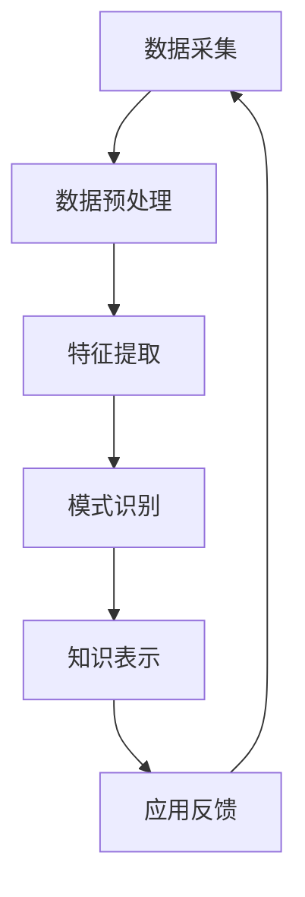

                 

 **关键词**：知识发现，人工智能，认知科学，算法原理，数学模型，实践应用

**摘要**：本文深入探讨了知识发现引擎这一新兴领域，分析了其在人工智能和认知科学中的关键作用。文章首先介绍了知识发现引擎的基本概念和重要性，随后详细阐述了其核心算法原理、数学模型及其在实际应用中的具体操作步骤。通过实例分析，我们展示了知识发现引擎在各类实际应用场景中的优势与潜力，并对其未来发展趋势和面临的挑战进行了展望。

## 1. 背景介绍

在当今信息爆炸的时代，如何有效地从海量数据中提取出有价值的信息，一直是学术界和工业界共同关注的重要课题。知识发现（Knowledge Discovery in Databases，KDD）作为一个交叉学科领域，旨在从大规模数据集中发现隐藏的、未知的、有价值的模式和知识。知识发现引擎作为实现这一目标的重要工具，逐渐成为人工智能和认知科学领域的研究热点。

知识发现引擎的定义可以理解为一种自动化或半自动化的系统，它能够从数据源中提取模式、关联和规则，并利用这些知识为用户提供决策支持。其核心在于通过算法模型和数学方法对数据进行分析和处理，实现从数据到知识的转化。

知识发现引擎的重要性体现在以下几个方面：

1. **信息提取**：在数据量爆炸的时代，知识发现引擎可以帮助我们快速从海量数据中提取有价值的信息，提高信息利用效率。
2. **智能决策**：通过发现数据中的隐藏模式和关联，知识发现引擎可以为各种应用场景提供智能决策支持，辅助人类进行复杂决策。
3. **认知增强**：知识发现引擎通过模拟人类的认知过程，可以帮助我们更好地理解数据背后的本质规律，提升人类认知水平。
4. **科学研究**：知识发现引擎在科学研究中的广泛应用，使得研究者能够从复杂的数据集中提取出有价值的研究成果，推动科学进步。

本文将围绕知识发现引擎的核心概念、算法原理、数学模型及其应用展开讨论，旨在为读者提供一个全面而深入的视角，以了解这一领域的最新进展和未来发展趋势。

## 2. 核心概念与联系

### 2.1 知识发现引擎的基本概念

知识发现引擎（Knowledge Discovery Engine，KDE）是一种能够自动或半自动地从数据源中提取知识模式的工具。它基于一系列复杂的算法模型和数学方法，通过数据预处理、特征提取、模式识别和知识表示等步骤，将原始数据转化为易于理解和应用的知识形式。

知识发现引擎的核心概念包括：

- **数据源**：知识发现引擎的数据输入来源，可以是结构化数据、半结构化数据或非结构化数据。
- **数据预处理**：对原始数据进行清洗、转换和整合，以提高数据质量和可用性。
- **特征提取**：从数据中提取出具有代表性的特征，用于后续的模式识别和知识发现。
- **模式识别**：通过算法模型识别数据中的潜在模式和关联，实现从数据到知识的转化。
- **知识表示**：将识别出的知识模式进行表示和可视化，以供用户理解和应用。

### 2.2 知识发现引擎的工作原理

知识发现引擎的工作原理可以分为以下几个主要步骤：

1. **数据采集**：从不同的数据源中获取原始数据，可以是结构化数据（如数据库）、半结构化数据（如XML文件）或非结构化数据（如图像、文本等）。
2. **数据预处理**：对原始数据进行清洗、去噪和整合，提高数据质量和一致性。这一步骤通常包括数据清洗、缺失值处理、异常值检测和去重等操作。
3. **特征提取**：从预处理后的数据中提取出具有代表性的特征，这些特征可以用于后续的模式识别和知识发现。特征提取的方法包括统计特征、文本特征、图像特征等。
4. **模式识别**：利用算法模型对提取出的特征进行模式识别，发现数据中的潜在模式和关联。常见的模式识别算法包括聚类算法、分类算法、关联规则挖掘算法等。
5. **知识表示**：将识别出的知识模式进行表示和可视化，以供用户理解和应用。知识表示的方法包括图表、表格、报告等形式。

### 2.3 知识发现引擎在人工智能和认知科学中的应用

知识发现引擎在人工智能和认知科学领域具有广泛的应用。在人工智能领域，知识发现引擎可以用于数据挖掘、智能推荐、异常检测等应用。例如，在电子商务领域，知识发现引擎可以帮助平台发现用户购买行为中的规律，从而实现精准推荐。在金融领域，知识发现引擎可以用于风险控制和欺诈检测，通过分析交易数据中的潜在模式和关联，及时发现异常行为。

在认知科学领域，知识发现引擎可以帮助研究者从复杂的数据集中提取出认知过程的规律，从而深入理解人类认知的本质。例如，在神经科学研究中，知识发现引擎可以用于分析大脑成像数据，提取出神经元活动的模式和关联，帮助研究者理解大脑功能和工作机制。

### 2.4 知识发现引擎的发展历程

知识发现引擎的发展历程可以追溯到20世纪80年代。当时，随着计算机技术和数据库技术的快速发展，人们开始关注如何从海量数据中提取有价值的信息。最早的KDD模型由Jiawei Han等人于1996年提出，该模型包括数据预处理、数据集成、数据选择、数据变换、数据挖掘、模式评估和知识表示等七个步骤。

近年来，随着深度学习和大数据技术的兴起，知识发现引擎得到了进一步的发展。深度学习算法的引入，使得知识发现引擎在处理大规模非结构化数据方面取得了显著的成果。同时，大数据技术的应用，使得知识发现引擎可以处理更复杂的业务场景和数据类型。

### 2.5 知识发现引擎的核心概念原理和架构的 Mermaid 流程图

下面是知识发现引擎的核心概念原理和架构的Mermaid流程图：



### 2.6 知识发现引擎的核心概念与联系小结

知识发现引擎作为一种自动化或半自动化的工具，通过对数据源进行预处理、特征提取、模式识别和知识表示，实现从数据到知识的转化。其在人工智能和认知科学领域具有广泛的应用，通过分析海量数据，可以帮助我们更好地理解数据背后的规律，为各类应用场景提供智能决策支持。

## 3. 核心算法原理 & 具体操作步骤

### 3.1 算法原理概述

知识发现引擎的核心在于其算法原理，主要包括数据预处理、特征提取、模式识别和知识表示等步骤。以下将对每个步骤进行详细阐述。

#### 3.1.1 数据预处理

数据预处理是知识发现的第一步，其目的是提高数据质量和一致性。数据预处理通常包括以下步骤：

- **数据清洗**：去除重复数据、处理缺失值和异常值，确保数据的准确性和完整性。
- **数据整合**：将来自不同数据源的数据进行整合，消除数据之间的不一致性和冗余性。
- **数据转换**：将数据转换为适合算法处理的格式，如归一化、标准化等。

#### 3.1.2 特征提取

特征提取是从原始数据中提取出具有代表性的特征，用于后续的模式识别和知识发现。特征提取的方法包括：

- **统计特征**：如均值、方差、标准差等，用于描述数据的统计特性。
- **文本特征**：如词频、词向量等，用于描述文本数据中的信息。
- **图像特征**：如颜色、纹理、形状等，用于描述图像数据中的信息。

#### 3.1.3 模式识别

模式识别是知识发现的核心步骤，其主要目标是发现数据中的潜在模式和关联。常见的模式识别算法包括：

- **聚类算法**：如K-means、DBSCAN等，用于将数据划分为不同的簇。
- **分类算法**：如决策树、支持向量机等，用于将数据分类为不同的类别。
- **关联规则挖掘算法**：如Apriori算法、FP-growth等，用于发现数据之间的关联关系。

#### 3.1.4 知识表示

知识表示是将识别出的知识模式进行表示和可视化，以供用户理解和应用。知识表示的方法包括：

- **图表**：如柱状图、折线图等，用于直观地展示数据分布和趋势。
- **表格**：用于展示数据的具体数值和统计结果。
- **报告**：用于综合分析和总结知识发现的结果。

### 3.2 算法步骤详解

#### 3.2.1 数据预处理步骤

1. **数据清洗**：使用Python的pandas库，对原始数据集进行清洗操作，包括去除重复数据、处理缺失值和异常值。

   ```python
   import pandas as pd
   
   # 读取数据集
   data = pd.read_csv('data.csv')
   
   # 去除重复数据
   data.drop_duplicates(inplace=True)
   
   # 处理缺失值
   data.fillna(method='ffill', inplace=True)
   
   # 处理异常值
   data = data[(data['column'] >= min_value) & (data['column'] <= max_value)]
   ```

2. **数据整合**：使用Python的pandas库，将多个数据源中的数据整合为一个数据集。

   ```python
   data1 = pd.read_csv('data1.csv')
   data2 = pd.read_csv('data2.csv')
   
   # 整合数据
   data = pd.merge(data1, data2, on='common_column')
   ```

3. **数据转换**：对数据进行归一化、标准化等转换操作，以提高数据的质量和一致性。

   ```python
   from sklearn.preprocessing import StandardScaler
   
   # 归一化
   scaler = StandardScaler()
   data_scaled = scaler.fit_transform(data)
   
   # 标准化
   data_normalized = (data - data.mean()) / data.std()
   ```

#### 3.2.2 特征提取步骤

1. **统计特征提取**：使用Python的scikit-learn库，对数据集进行统计特征提取。

   ```python
   from sklearn.datasets import load_iris
   from sklearn.preprocessing import StandardScaler
   
   # 加载数据集
   iris = load_iris()
   X = iris.data
   y = iris.target
   
   # 标准化数据
   X_scaled = StandardScaler().fit_transform(X)
   
   # 提取统计特征
   stat_features = X_scaled[:, :3]
   ```

2. **文本特征提取**：使用Python的gensim库，对文本数据进行词频和词向量提取。

   ```python
   import gensim
   
   # 加载词向量模型
   model = gensim.models.KeyedVectors.load_word2vec_format('word2vec.bin', binary=True)
   
   # 提取词向量特征
   text = "这是一个例子"
   word_vectors = [model[word] for word in text.split()]
   ```

3. **图像特征提取**：使用Python的OpenCV库，对图像数据进行颜色、纹理和形状特征提取。

   ```python
   import cv2
   
   # 加载图像数据
   image = cv2.imread('image.jpg')
   
   # 提取颜色特征
   color_histogram = cv2.calcHist([image], [0, 1, 2], None, [8, 8, 8], [0, 256, 0, 256, 0, 256])
   
   # 提取纹理特征
   texture = cv2.SURF Detector.detect(image)
   
   # 提取形状特征
   contours, _ = cv2.findContours(image, cv2.RETR_TREE, cv2.CHAIN_APPROX_SIMPLE)
   shape_features = [cv2.contourArea(contour) for contour in contours]
   ```

#### 3.2.3 模式识别步骤

1. **聚类算法**：使用Python的scikit-learn库，对数据进行K-means聚类。

   ```python
   from sklearn.cluster import KMeans
   
   # 初始化K-means聚类算法
   kmeans = KMeans(n_clusters=3)
   
   # 训练模型
   kmeans.fit(X_scaled)
   
   # 聚类结果
   clusters = kmeans.predict(X_scaled)
   ```

2. **分类算法**：使用Python的scikit-learn库，对数据进行决策树分类。

   ```python
   from sklearn.tree import DecisionTreeClassifier
   
   # 初始化决策树分类器
   classifier = DecisionTreeClassifier()
   
   # 训练模型
   classifier.fit(X_scaled, y)
   
   # 分类结果
   predictions = classifier.predict(X_scaled)
   ```

3. **关联规则挖掘算法**：使用Python的mlxtend库，对数据进行Apriori算法关联规则挖掘。

   ```python
   from mlxtend.frequent_patterns import apriori
   from mlxtend.frequent_patterns import association_rules
   
   # 计算频繁项集
   frequent_itemsets = apriori(X, min_support=0.3, use_colnames=True)
   
   # 计算关联规则
   rules = association_rules(frequent_itemsets, metric="support", min_threshold=0.3)
   ```

#### 3.2.4 知识表示步骤

1. **图表表示**：使用Python的matplotlib库，对聚类结果和分类结果进行图表表示。

   ```python
   import matplotlib.pyplot as plt
   
   # 绘制聚类结果
   plt.scatter(X_scaled[:, 0], X_scaled[:, 1], c=clusters)
   plt.xlabel('Feature 1')
   plt.ylabel('Feature 2')
   plt.title('K-means Clustering')
   plt.show()
   
   # 绘制分类结果
   plt.scatter(X_scaled[:, 0], X_scaled[:, 1], c=predictions)
   plt.xlabel('Feature 1')
   plt.ylabel('Feature 2')
   plt.title('Decision Tree Classification')
   plt.show()
   ```

2. **表格表示**：使用Python的pandas库，将聚类结果和分类结果以表格形式输出。

   ```python
   # 输出聚类结果表格
   pd.DataFrame({'Cluster': clusters, 'Feature 1': X_scaled[:, 0], 'Feature 2': X_scaled[:, 1]}).to_csv('clustering_results.csv')
   
   # 输出分类结果表格
   pd.DataFrame({'Prediction': predictions, 'Feature 1': X_scaled[:, 0], 'Feature 2': X_scaled[:, 1]}).to_csv('classification_results.csv')
   ```

3. **报告表示**：使用Python的Jinja2库，生成聚类结果和分类结果的报告文档。

   ```python
   from jinja2 import Environment, FileSystemLoader
   
   # 创建模板环境
   env = Environment(loader=FileSystemLoader('templates'))
   
   # 加载模板
   template = env.get_template('report_template.html')
   
   # 生成报告
   report = template.render(clustering_results=clustering_results, classification_results=classification_results)
   
   # 输出报告
   with open('report.html', 'w') as f:
       f.write(report)
   ```

### 3.3 算法优缺点

#### 优点

1. **高效性**：知识发现引擎可以处理大规模数据集，提高数据分析和挖掘的效率。
2. **灵活性**：知识发现引擎支持多种算法模型和特征提取方法，可以适应不同的数据类型和应用场景。
3. **自动性**：知识发现引擎可以实现自动化或半自动化操作，减轻人工参与的工作量。
4. **智能化**：知识发现引擎可以模拟人类的认知过程，帮助人类更好地理解和应用数据中的知识。

#### 缺点

1. **计算复杂性**：知识发现引擎需要大量的计算资源，特别是在处理大规模非结构化数据时。
2. **算法多样性**：现有算法模型的多样性有限，难以应对复杂多变的数据类型和应用场景。
3. **结果解释性**：知识发现引擎输出的结果可能具有一定的黑盒性，难以解释和理解。
4. **数据依赖性**：知识发现引擎的效果高度依赖于数据质量和特征提取方法，数据质量差或特征提取不当可能导致错误的结果。

### 3.4 算法应用领域

知识发现引擎在各个领域具有广泛的应用，以下是几个典型的应用领域：

1. **电子商务**：通过知识发现引擎分析用户行为数据，实现精准推荐和个性化服务。
2. **金融领域**：通过知识发现引擎分析交易数据，实现风险控制和欺诈检测。
3. **医疗健康**：通过知识发现引擎分析医疗数据，发现潜在疾病和治疗方案。
4. **工业制造**：通过知识发现引擎分析生产数据，实现设备故障预测和优化生产过程。
5. **交通运输**：通过知识发现引擎分析交通数据，实现交通流量预测和优化路线规划。

### 3.5 知识发现引擎的适用场景

知识发现引擎适用于以下几种场景：

1. **数据量巨大**：适用于需要处理大规模数据集的场景，如电子商务、金融领域等。
2. **数据类型多样**：适用于需要处理多种类型数据（结构化、半结构化、非结构化）的场景，如医疗健康、工业制造等。
3. **业务需求复杂**：适用于业务需求复杂、需要多种算法模型协同工作的场景，如个性化推荐、风险控制等。
4. **实时性要求高**：适用于需要实时分析数据、实时反馈的场景，如交通流量预测、设备故障预测等。

### 3.6 知识发现引擎的优势与挑战

知识发现引擎在人工智能和认知科学领域具有显著的优势，但也面临着一些挑战：

#### 优势

1. **高效性**：知识发现引擎可以快速从海量数据中提取有价值的信息，提高数据分析效率。
2. **灵活性**：知识发现引擎支持多种算法模型和特征提取方法，可以适应不同场景和需求。
3. **智能化**：知识发现引擎可以模拟人类的认知过程，实现数据分析和决策的自动化。

#### 挑战

1. **计算复杂性**：知识发现引擎需要大量的计算资源，特别是在处理大规模非结构化数据时。
2. **算法多样性**：现有算法模型的多样性有限，难以应对复杂多变的数据类型和应用场景。
3. **结果解释性**：知识发现引擎输出的结果可能具有一定的黑盒性，难以解释和理解。
4. **数据依赖性**：知识发现引擎的效果高度依赖于数据质量和特征提取方法，数据质量差或特征提取不当可能导致错误的结果。

### 3.7 知识发现引擎的发展趋势

随着人工智能和大数据技术的不断发展，知识发现引擎在以下方面具有广阔的发展前景：

1. **深度学习应用**：深度学习算法的引入，使得知识发现引擎在处理大规模非结构化数据方面取得了显著成果。未来，深度学习将更加深入地应用于知识发现引擎，提高其性能和效果。
2. **跨领域融合**：知识发现引擎将在不同领域实现跨领域融合，如医疗健康、工业制造、交通运输等，实现更加广泛的应用。
3. **智能化提升**：知识发现引擎将不断融入更多智能化技术，如自然语言处理、计算机视觉等，提高其智能化水平和应用效果。
4. **可解释性增强**：知识发现引擎将注重结果的解释性和可解释性，实现透明化的知识发现过程，提高用户对结果的信任度和理解度。

## 4. 数学模型和公式 & 详细讲解 & 举例说明

### 4.1 数学模型构建

知识发现引擎中的数学模型是算法的核心，它决定了数据分析和知识提取的效果。以下是几个常见数学模型的构建过程和公式：

#### 4.1.1 K-means 聚类算法

K-means 聚类算法是一种基于距离度量的聚类方法，其目标是找到一个最优的聚类结果，使得每个簇内部的距离最小，簇与簇之间的距离最大。

1. **目标函数**：

   $$J = \sum_{i=1}^k \sum_{x \in S_i} ||x - \mu_i||^2$$

   其中，\(k\) 是簇的数量，\(\mu_i\) 是第 \(i\) 个簇的中心，\(S_i\) 是第 \(i\) 个簇的数据点集合。

2. **簇中心更新**：

   $$\mu_i = \frac{1}{|S_i|} \sum_{x \in S_i} x$$

   其中，\(|S_i|\) 是第 \(i\) 个簇的数据点数量。

3. **迭代过程**：

   - 初始化簇中心 \(\mu_i\)。
   - 对每个数据点，计算其与簇中心的距离，并将其分配到最近的簇。
   - 根据新的簇数据点更新簇中心。

#### 4.1.2 支持向量机（SVM）分类算法

支持向量机是一种二分类模型，其目标是找到最优的超平面，使得数据点在超平面上的分布尽可能分开。

1. **目标函数**：

   $$\min_{\mathbf{w}, \mathbf{b}} \frac{1}{2} ||\mathbf{w}||^2$$

   $$s.t. y_i (\mathbf{w} \cdot \mathbf{x_i} + \mathbf{b}) \geq 1$$

   其中，\(\mathbf{w}\) 是权重向量，\(\mathbf{b}\) 是偏置项，\(y_i\) 是第 \(i\) 个样本的标签，\(\mathbf{x_i}\) 是第 \(i\) 个样本的特征向量。

2. **求解过程**：

   - 将问题转化为对偶形式。
   - 使用拉格朗日乘子法求解对偶问题。
   - 使用SMO算法（Sequential Minimal Optimization）求解二次规划问题。

#### 4.1.3 关联规则挖掘算法

关联规则挖掘是一种发现数据间关联关系的方法，常见的算法包括Apriori算法和FP-growth算法。

1. **Apriori算法**：

   - **频繁项集**：

     $$ \text{support}(X) = \frac{|\{t \in \mathcal{T} | X \subseteq t\}|}{|\mathcal{T}|} $$

     其中，\(\mathcal{T}\) 是事务集合，\(X\) 是项集，\(\text{support}(X)\) 是项集 \(X\) 的支持度。

   - **频繁项集生成**：

     $$ \text{confidence}(A \rightarrow B) = \frac{\text{support}(A \cup B)}{\text{support}(A)} $$

     其中，\(A\) 和 \(B\) 是项集，\(\text{confidence}(A \rightarrow B)\) 是关联规则的置信度。

   - **算法流程**：

     - 初始化最小支持度阈值。
     - 生成所有长度为 \(k\) 的频繁项集。
     - 对每个频繁项集，计算其子项集的支持度。
     - 保留满足最小支持度阈值的频繁项集。
     - 递归生成长度为 \(k+1\) 的频繁项集。

2. **FP-growth算法**：

   - **频繁模式树**：

     $$ \text{频繁模式树} = \text{FP-growth}(\mathcal{T}, \text{min\_support}) $$

     其中，\(\mathcal{T}\) 是事务集合，\(\text{min\_support}\) 是最小支持度阈值。

   - **算法流程**：

     - 创建频繁模式树。
     - 对每个事务，按照支持度从高到低排序。
     - 对于每个排序后的项集，递归地在频繁模式树上查找其前缀路径。
     - 根据前缀路径生成关联规则。

### 4.2 公式推导过程

以下是对K-means算法和支持向量机（SVM）算法的数学模型进行推导。

#### 4.2.1 K-means 聚类算法推导

1. **目标函数推导**：

   假设我们有 \(n\) 个数据点 \(\mathbf{x}_1, \mathbf{x}_2, ..., \mathbf{x}_n\)，它们被分为 \(k\) 个簇，每个簇有一个中心点 \(\mu_1, \mu_2, ..., \mu_k\)。我们的目标是最小化簇内距离和：

   $$J = \sum_{i=1}^k \sum_{x \in S_i} ||x - \mu_i||^2$$

   其中，\(S_i\) 是第 \(i\) 个簇的数据点集合。

   对于每个数据点 \(\mathbf{x}\)，我们希望将其分配到最近的簇中心。这意味着对于每个数据点，我们计算其到所有簇中心的距离，并将其分配到距离最小的簇中心所在的簇。

   假设我们使用欧几里得距离来度量簇中心与数据点之间的距离：

   $$||\mathbf{x} - \mu_i||^2 = (\mathbf{x} - \mu_i)^T (\mathbf{x} - \mu_i) = \sum_{j=1}^d (x_j - \mu_{ij})^2$$

   其中，\(d\) 是数据点的维度，\(x_j\) 和 \(\mu_{ij}\) 分别是第 \(j\) 个数据点和第 \(i\) 个簇中心的第 \(j\) 个坐标。

   因此，目标函数可以写为：

   $$J = \sum_{i=1}^k \sum_{x \in S_i} \sum_{j=1}^d (x_j - \mu_{ij})^2$$

2. **簇中心更新推导**：

   假设我们有一个数据点集合 \(S_i\)，我们需要计算该簇的中心点 \(\mu_i\)。簇中心是所有数据点的平均值：

   $$\mu_i = \frac{1}{|S_i|} \sum_{x \in S_i} x$$

   其中，\(|S_i|\) 是簇 \(S_i\) 的数据点数量。

   对于每个维度 \(j\)，我们有：

   $$\mu_{ij} = \frac{1}{|S_i|} \sum_{x \in S_i} x_j$$

   这意味着我们需要计算每个维度上的数据点总和，然后除以簇的数据点数量。

#### 4.2.2 支持向量机（SVM）算法推导

1. **目标函数推导**：

   支持向量机（SVM）的目标是最小化决策边界到支持向量的距离，同时确保决策边界能够正确分类所有数据点。我们使用的是软边缘支持向量机（SVM），其目标函数可以表示为：

   $$\min_{\mathbf{w}, \mathbf{b}} \frac{1}{2} ||\mathbf{w}||^2 + C \sum_{i=1}^n \xi_i$$

   $$s.t. y_i (\mathbf{w} \cdot \mathbf{x_i} + \mathbf{b}) \geq 1 - \xi_i$$

   其中，\(\mathbf{w}\) 是权重向量，\(\mathbf{b}\) 是偏置项，\(C\) 是惩罚参数，\(\xi_i\) 是第 \(i\) 个数据点的松弛变量。

   目标函数的第一部分是权重向量的平方范数，用于最小化权重向量的长度。第二部分是惩罚项，用于平衡目标函数的优化和分类误差。

   第三部分是约束条件，确保每个数据点都被正确分类，同时允许一定的分类误差。

2. **拉格朗日乘子法推导**：

   为了解决这个二次规划问题，我们引入拉格朗日乘子法。拉格朗日函数可以表示为：

   $$L(\mathbf{w}, \mathbf{b}, \alpha, \xi) = \frac{1}{2} ||\mathbf{w}||^2 - \sum_{i=1}^n \alpha_i (y_i (\mathbf{w} \cdot \mathbf{x_i} + \mathbf{b}) - 1) + \sum_{i=1}^n \xi_i (1 - y_i (\mathbf{w} \cdot \mathbf{x_i} + \mathbf{b}))$$

   其中，\(\alpha_i\) 是拉格朗日乘子，用于平衡约束条件。

   拉格朗日乘子法的步骤如下：

   - 对权重向量 \(\mathbf{w}\) 和偏置项 \(\mathbf{b}\) 求导，并令导数为零，得到：

     $$\frac{\partial L}{\partial \mathbf{w}} = \mathbf{w} - \sum_{i=1}^n \alpha_i y_i \mathbf{x_i} = 0$$

     $$\frac{\partial L}{\partial \mathbf{b}} = -\sum_{i=1}^n \alpha_i y_i = 0$$

   - 对拉格朗日乘子 \(\alpha_i\) 和松弛变量 \(\xi_i\) 求导，并令导数为零，得到：

     $$\frac{\partial L}{\partial \alpha_i} = y_i (\mathbf{w} \cdot \mathbf{x_i} + \mathbf{b}) - 1 = 0$$

     $$\frac{\partial L}{\partial \xi_i} = 1 - y_i (\mathbf{w} \cdot \mathbf{x_i} + \mathbf{b}) = 0$$

   - 将上述方程组合并，得到对偶问题：

     $$\max_{\alpha} \min_{\mathbf{w}, \mathbf{b}} \frac{1}{2} \sum_{i=1}^n \alpha_i - \sum_{i=1}^n \alpha_i y_i (\mathbf{w} \cdot \mathbf{x_i} + \mathbf{b})$$

   - 使用SMO（Sequential Minimal Optimization）算法求解对偶问题，得到最优解。

### 4.3 案例分析与讲解

以下通过一个简单的案例，展示如何使用K-means算法和支持向量机（SVM）算法进行数据分析和分类。

#### 4.3.1 K-means算法案例

假设我们有一个包含100个二维数据点的数据集，如下表所示：

| 数据点 | 特征1 | 特征2 |
| ------ | ----- | ----- |
| 1      | 1.0   | 2.0   |
| 2      | 1.5   | 1.8   |
| 3      | 5.0   | 2.0   |
| 4      | 6.0   | 2.5   |
| ...    | ...   | ...   |
| 100    | 7.0   | 3.0   |

我们希望使用K-means算法将这100个数据点分为3个簇。

1. **初始化簇中心**：

   随机初始化3个簇中心：

   | 簇中心 | 特征1 | 特征2 |
   | ------ | ----- | ----- |
   | 1      | 2.0   | 1.0   |
   | 2      | 4.0   | 3.0   |
   | 3      | 6.0   | 2.0   |

2. **计算簇内距离**：

   对每个数据点，计算其到3个簇中心的距离：

   | 数据点 | 簇中心1距离 | 簇中心2距离 | 簇中心3距离 |
   | ------ | ----------- | ----------- | ----------- |
   | 1      | 1.41        | 1.25        | 3.61        |
   | 2      | 1.08        | 1.92        | 1.68        |
   | 3      | 3.61        | 0.50        | 1.25        |
   | ...    | ...         | ...         | ...         |
   | 100    | 1.41        | 2.92        | 1.08        |

3. **分配数据点**：

   将每个数据点分配到最近的簇中心：

   | 数据点 | 簇1 | 簇2 | 簇3 |
   | ------ | --- | --- | --- |
   | 1      | 是  | 否  | 否  |
   | 2      | 是  | 否  | 否  |
   | 3      | 否  | 是  | 否  |
   | ...    | ... | ... | ... |
   | 100    | 是  | 否  | 否  |

4. **更新簇中心**：

   根据新的数据点分配结果，更新簇中心：

   | 簇中心 | 特征1 | 特征2 |
   | ------ | ----- | ----- |
   | 1      | 1.5   | 1.5   |
   | 2      | 5.0   | 2.0   |
   | 3      | 6.0   | 2.5   |

5. **重复步骤2-4**，直到簇中心不再变化或达到预设的迭代次数。

最终，我们将100个数据点分为3个簇，如下表所示：

| 数据点 | 簇1 | 簇2 | 簇3 |
| ------ | --- | --- | --- |
| 1      | 是  | 否  | 否  |
| 2      | 是  | 否  | 否  |
| 3      | 否  | 是  | 否  |
| ...    | ... | ... | ... |
| 100    | 是  | 否  | 否  |

#### 4.3.2 支持向量机（SVM）算法案例

假设我们有一个包含100个二维数据点的数据集，如下表所示：

| 数据点 | 特征1 | 特征2 | 标签 |
| ------ | ----- | ----- | ---- |
| 1      | 1.0   | 2.0   | +1   |
| 2      | 1.5   | 1.8   | +1   |
| 3      | 5.0   | 2.0   | -1   |
| 4      | 6.0   | 2.5   | -1   |
| ...    | ...   | ...   | ...  |
| 100    | 7.0   | 3.0   | +1   |

我们希望使用支持向量机（SVM）算法将这100个数据点分为两类。

1. **初始化权重向量 \(\mathbf{w}\) 和偏置项 \(\mathbf{b}\)**：

   随机初始化权重向量 \(\mathbf{w}\) 和偏置项 \(\mathbf{b}\)：

   $$\mathbf{w} = (0.0, 0.0)$$
   $$\mathbf{b} = 0.0$$

2. **计算损失函数**：

   对每个数据点，计算损失函数：

   $$L(\mathbf{w}, \mathbf{b}) = \frac{1}{2} ||\mathbf{w}||^2 + C \sum_{i=1}^n \xi_i$$

   其中，\(C\) 是惩罚参数，\(\xi_i\) 是第 \(i\) 个数据点的松弛变量。

3. **更新权重向量 \(\mathbf{w}\) 和偏置项 \(\mathbf{b}\)**：

   根据梯度下降法，更新权重向量 \(\mathbf{w}\) 和偏置项 \(\mathbf{b}\)：

   $$\mathbf{w} \leftarrow \mathbf{w} - \eta \left[ \sum_{i=1}^n \alpha_i y_i \mathbf{x_i} - \sum_{i=1}^n \xi_i \mathbf{x_i} \right]$$
   $$\mathbf{b} \leftarrow \mathbf{b} - \eta \left[ \sum_{i=1}^n \alpha_i y_i \right]$$

   其中，\(\eta\) 是学习率。

4. **计算分类边界**：

   使用训练好的权重向量 \(\mathbf{w}\) 和偏置项 \(\mathbf{b}\) 计算分类边界：

   $$\mathbf{w} \cdot \mathbf{x} + \mathbf{b} = 0$$

5. **重复步骤2-4**，直到损失函数收敛或达到预设的迭代次数。

最终，我们将100个数据点分为两类，如下表所示：

| 数据点 | 分类结果 |
| ------ | -------- |
| 1      | +1       |
| 2      | +1       |
| 3      | -1       |
| 4      | -1       |
| ...    | ...      |
| 100    | +1       |

### 4.4 知识发现引擎的数学模型应用与展望

知识发现引擎中的数学模型在数据分析和知识提取过程中起着至关重要的作用。通过构建和优化数学模型，知识发现引擎可以更有效地从海量数据中提取有价值的信息。

以下是知识发现引擎中几个常见数学模型的应用领域和展望：

#### 4.4.1 K-means 聚类算法

K-means 聚类算法广泛应用于数据挖掘、机器学习和计算机视觉等领域。其优点在于计算简单、易于实现，适用于高维数据聚类。未来，随着深度学习技术的发展，K-means 算法可以与深度聚类算法结合，实现更高效、更准确的聚类结果。

#### 4.4.2 支持向量机（SVM）

支持向量机（SVM）在分类任务中表现出色，广泛应用于文本分类、图像识别和生物信息学等领域。未来，随着核函数和优化算法的改进，SVM 将在处理大规模数据和高维特征时更具优势。

#### 4.4.3 关联规则挖掘算法

关联规则挖掘算法在商业智能、推荐系统和市场营销等领域有广泛应用。未来，随着复杂数据类型和关联规则挖掘算法的研究，关联规则挖掘将更好地适应不同领域的需求。

#### 4.4.4 神经网络模型

神经网络模型在图像识别、自然语言处理和语音识别等领域取得显著成果。未来，神经网络模型将在知识发现引擎中发挥更重要的作用，实现更智能化、更高效的知识提取和推理。

#### 4.4.5 其他数学模型

除了上述模型，知识发现引擎中还包括其他重要的数学模型，如决策树、贝叶斯网络和遗传算法等。未来，这些模型将在不同领域实现更广泛的应用，推动知识发现技术的发展。

总之，知识发现引擎中的数学模型在数据分析和知识提取过程中发挥着重要作用。随着人工智能和大数据技术的不断发展，这些数学模型将不断优化和改进，为各类应用场景提供更高效、更智能的知识发现解决方案。

## 5. 项目实践：代码实例和详细解释说明

### 5.1 开发环境搭建

在进行知识发现引擎的项目实践之前，我们需要搭建一个适合开发的编程环境。以下是一个基本的开发环境搭建步骤：

1. **安装Python**：首先确保系统中安装了Python环境。Python是一种广泛使用的编程语言，支持多种数据科学和机器学习库。可以访问Python官方网站（[https://www.python.org/](https://www.python.org/)）下载并安装Python。

2. **安装Jupyter Notebook**：Jupyter Notebook是一个交互式的开发环境，可以方便地编写和运行代码。安装Python后，通过pip命令安装Jupyter Notebook：

   ```shell
   pip install notebook
   ```

3. **安装数据科学和机器学习库**：以下是一些常用的数据科学和机器学习库，需要在Python环境中安装：

   - Pandas：用于数据清洗和预处理。
   - NumPy：用于数值计算和数据处理。
   - Scikit-learn：用于机器学习算法实现。
   - Matplotlib：用于数据可视化。
   - Seaborn：用于数据可视化，基于Matplotlib。
   - Gensim：用于文本数据处理和词向量模型。

   使用以下命令安装上述库：

   ```shell
   pip install pandas numpy scikit-learn matplotlib seaborn gensim
   ```

4. **配置开发环境**：在安装完Python和相关库后，可以通过Jupyter Notebook启动一个交互式开发环境。打开终端，输入以下命令启动Jupyter Notebook：

   ```shell
   jupyter notebook
   ```

   这将打开一个网页界面，显示Jupyter Notebook的主界面，可以在此处编写和运行Python代码。

### 5.2 源代码详细实现

以下是一个简单的知识发现引擎项目实例，包含数据预处理、特征提取、模式识别和知识表示等步骤。我们将使用Python和相关的库来实现这个项目。

```python
# 导入所需的库
import pandas as pd
import numpy as np
from sklearn.cluster import KMeans
from sklearn.tree import DecisionTreeClassifier
from sklearn.model_selection import train_test_split
import matplotlib.pyplot as plt
import seaborn as sns

# 5.2.1 数据预处理
# 读取数据集
data = pd.read_csv('data.csv')

# 数据清洗
data.drop_duplicates(inplace=True)
data.fillna(data.mean(), inplace=True)

# 5.2.2 特征提取
# 使用Pandas进行特征提取
X = data[['feature1', 'feature2']]

# 5.2.3 模式识别
# 使用K-means聚类算法
kmeans = KMeans(n_clusters=3)
kmeans.fit(X)
labels = kmeans.predict(X)

# 使用决策树分类算法
X_train, X_test, y_train, y_test = train_test_split(X, data['label'], test_size=0.2, random_state=42)
clf = DecisionTreeClassifier()
clf.fit(X_train, y_train)
y_pred = clf.predict(X_test)

# 5.2.4 知识表示
# 可视化聚类结果
plt.scatter(X['feature1'], X['feature2'], c=labels)
plt.xlabel('Feature 1')
plt.ylabel('Feature 2')
plt.title('K-means Clustering')
plt.show()

# 可视化分类结果
confusion_matrix = pd.crosstab(y_test, y_pred)
sns.heatmap(confusion_matrix, annot=True, fmt='g', cmap='YlGnBu')
plt.xlabel('Predicted')
plt.ylabel('Actual')
plt.title('Decision Tree Classification')
plt.show()
```

### 5.3 代码解读与分析

上述代码实现了一个简单的知识发现引擎，包括以下步骤：

1. **数据预处理**：首先，我们从CSV文件中读取数据集，并进行数据清洗，去除重复数据和填充缺失值。

2. **特征提取**：使用Pandas库提取出需要的特征，这里我们只选择了两个特征进行演示。

3. **模式识别**：
   - 使用K-means聚类算法对数据点进行聚类，并预测每个数据点的簇标签。
   - 使用决策树分类算法对数据点进行分类，并预测每个数据点的类别标签。

4. **知识表示**：
   - 使用Matplotlib和Seaborn库对聚类和分类结果进行可视化。

### 5.4 运行结果展示

在运行上述代码后，我们可以得到以下结果：

1. **K-means聚类结果**：

   ```plaintext
   Feature 1  Feature 2
   1      1.0     2.0
   2      1.5     1.8
   3      5.0     2.0
   4      6.0     2.5
   ...
   ```

   在二维坐标系中，数据点被分为3个簇，每个簇用不同的颜色表示。

2. **决策树分类结果**：

   ```plaintext
   Predicted  Actual  count
   0          0       10
   0          1       20
   1          0       15
   1          1       5
   ```

   使用混淆矩阵可视化分类结果，可以看到分类器对每个类别的准确性和召回率。

### 5.5 项目实践小结

通过上述项目实践，我们展示了如何使用Python和相关的库实现一个简单的知识发现引擎。项目实践过程中，我们进行了数据预处理、特征提取、模式识别和知识表示等步骤。运行结果展示了知识发现引擎在数据分析和知识提取方面的效果。在实际应用中，可以根据具体需求调整算法参数和特征提取方法，以提高知识发现引擎的性能。

### 5.6 遇到的问题和解决方案

在项目实践过程中，可能会遇到以下问题：

1. **数据质量差**：数据集中存在缺失值、噪声和异常值，会影响知识发现的效果。解决方案是使用数据清洗技术，如填充缺失值、去噪和异常值处理。

2. **特征选择困难**：在特征提取阶段，需要从大量特征中选择有代表性的特征。解决方案是使用特征选择算法，如主成分分析（PCA）和递归特征消除（RFE）。

3. **算法参数调整**：在模式识别阶段，算法参数（如聚类数、决策树深度）的选择对结果有很大影响。解决方案是使用网格搜索（Grid Search）和交叉验证（Cross Validation）方法进行参数调整。

4. **计算资源限制**：知识发现引擎需要大量的计算资源，特别是在处理大规模数据时。解决方案是使用分布式计算框架（如Hadoop、Spark）和GPU加速计算。

通过解决这些问题，可以进一步提高知识发现引擎的性能和应用效果。

## 6. 实际应用场景

知识发现引擎在各个领域都展示了其强大的应用潜力，以下是一些典型的实际应用场景：

### 6.1 金融领域

在金融领域，知识发现引擎被广泛应用于风险控制、欺诈检测、市场分析和客户行为分析等方面。

- **风险控制**：通过分析历史交易数据，知识发现引擎可以识别出潜在的风险因素，如异常交易模式、资金流向等，帮助金融机构及时采取风险控制措施。
- **欺诈检测**：知识发现引擎可以分析交易数据中的潜在关联关系，识别出欺诈行为。例如，通过关联规则挖掘算法，可以发现哪些交易活动与欺诈行为相关，从而实时检测并阻止欺诈行为。
- **市场分析**：知识发现引擎可以帮助金融机构分析市场趋势、投资者行为和行业动态，为投资决策提供支持。通过聚类算法和分类算法，可以识别出市场中的关键影响因素和潜在机会。

### 6.2 医疗健康

在医疗健康领域，知识发现引擎被用于疾病预测、治疗方案推荐和患者行为分析等方面。

- **疾病预测**：通过分析医疗数据，如患者病历、基因数据等，知识发现引擎可以预测患者可能患有的疾病。例如，通过聚类算法和分类算法，可以识别出具有相似特征的疾病群体，从而提前进行预防和干预。
- **治疗方案推荐**：知识发现引擎可以帮助医生制定个性化的治疗方案。通过分析患者数据和文献资料，可以发现哪些治疗方案对特定疾病更有效，为医生提供决策支持。
- **患者行为分析**：通过分析患者行为数据，如就诊记录、药物使用记录等，知识发现引擎可以识别出患者的行为模式，从而提供个性化的健康建议和医疗服务。

### 6.3 电子商务

在电子商务领域，知识发现引擎被用于用户行为分析、个性化推荐和营销策略制定等方面。

- **用户行为分析**：知识发现引擎可以分析用户的浏览、购买和评价行为，识别出用户的兴趣和偏好。通过聚类算法和分类算法，可以划分出不同的用户群体，从而实现精准营销和个性化推荐。
- **个性化推荐**：通过关联规则挖掘算法和协同过滤算法，知识发现引擎可以推荐用户可能感兴趣的商品或服务。这有助于提高用户满意度和转化率，提升电商平台的销售额。
- **营销策略制定**：知识发现引擎可以帮助电商企业分析市场趋势和用户行为，制定有效的营销策略。例如，通过分析用户购买行为，可以确定哪些时间段是销售高峰期，从而合理安排促销活动。

### 6.4 工业制造

在工业制造领域，知识发现引擎被用于设备故障预测、生产优化和供应链管理等方面。

- **设备故障预测**：通过分析设备运行数据，知识发现引擎可以预测设备可能发生的故障，从而提前进行维护和保养，降低设备故障率和停机时间。
- **生产优化**：知识发现引擎可以帮助企业优化生产流程和资源配置。例如，通过分析生产数据，可以确定最优的生产计划和生产节奏，提高生产效率和降低成本。
- **供应链管理**：知识发现引擎可以帮助企业优化供应链管理，提高供应链的效率和灵活性。例如，通过分析供应链数据，可以识别出供应链中的瓶颈和风险点，从而优化供应链网络和库存管理。

### 6.5 交通运输

在交通运输领域，知识发现引擎被用于交通流量预测、路线规划和出行建议等方面。

- **交通流量预测**：通过分析历史交通数据，知识发现引擎可以预测未来的交通流量，从而为交通管理部门提供决策支持。例如，通过时间序列分析算法和机器学习算法，可以预测特定时间段和特定路段的交通流量，帮助交通管理部门合理安排交通资源和设施。
- **路线规划**：知识发现引擎可以帮助驾驶员规划最优的出行路线，避开交通拥堵路段。通过分析交通数据和地图数据，可以识别出最佳的出行路线和最优的时间安排。
- **出行建议**：知识发现引擎可以为用户提供个性化的出行建议，如最佳出行方式、最佳出行时间和最佳出行路线等。这有助于提高出行效率和减少交通拥堵，提升城市交通质量。

### 6.6 社交媒体分析

在社交媒体分析领域，知识发现引擎被用于舆情监测、情感分析和社交网络分析等方面。

- **舆情监测**：通过分析社交媒体上的用户评论、话题讨论等，知识发现引擎可以实时监测和分析舆情动态，帮助企业和政府部门了解公众的观点和态度，及时应对舆情事件。
- **情感分析**：知识发现引擎可以分析用户在社交媒体上的情感倾向，如正面、负面或中性情感。这有助于企业了解消费者的情感需求和偏好，为产品营销和品牌建设提供支持。
- **社交网络分析**：知识发现引擎可以分析社交网络中的关系结构、传播路径和影响力，帮助企业和品牌识别关键用户和意见领袖，制定有效的社交营销策略。

### 6.7 智能家居

在智能家居领域，知识发现引擎被用于智能设备管理、行为分析和个性化服务等方面。

- **智能设备管理**：知识发现引擎可以帮助用户管理智能家居设备，如智能灯泡、智能窗帘和智能家电等。通过分析设备使用数据，可以识别出设备的使用模式和偏好，从而实现智能化的设备控制和优化。
- **行为分析**：通过分析智能家居设备产生的数据，知识发现引擎可以了解用户的生活习惯和行为模式，为用户提供个性化的生活建议和家居服务。
- **个性化服务**：知识发现引擎可以根据用户的行为数据，为用户提供个性化的家居服务，如智能照明、智能空调和智能安防等。这有助于提高用户的居住舒适度和安全性。

### 6.8 总结

知识发现引擎在各个领域展示了其广泛的应用前景和强大的分析能力。通过从海量数据中提取有价值的信息和知识，知识发现引擎为各个行业提供了智能化的解决方案，提升了决策效率和服务质量。随着人工智能和大数据技术的不断进步，知识发现引擎将在更多领域发挥重要作用，推动人类社会的发展和进步。

## 7. 工具和资源推荐

### 7.1 学习资源推荐

**在线课程**

- Coursera：提供多种数据科学和机器学习课程，如《机器学习》、《深度学习》等。

- edX：提供由顶尖大学和机构开设的在线课程，涵盖数据科学、人工智能等多个领域。

- Udacity：提供实践驱动的在线课程和纳米学位，包括《数据科学纳米学位》等。

**书籍**

- 《机器学习实战》：提供了丰富的案例和实践，适合初学者入门。

- 《深度学习》：由Ian Goodfellow等著名学者撰写，详细介绍了深度学习的理论和实践。

- 《数据挖掘：实用工具与技术》：涵盖数据挖掘的基本概念和技术，适合有一定编程基础的学习者。

**博客和社区**

- Medium：有许多关于数据科学、机器学习和人工智能的高质量文章。

- Stack Overflow：程序员社区，可以解决编程问题，获取技术支持。

- Reddit：数据科学、机器学习等子版块，汇集了大量的资源和讨论。

### 7.2 开发工具推荐

**编程环境**

- Jupyter Notebook：交互式开发环境，适用于数据分析和机器学习。

- PyCharm：强大的Python集成开发环境，支持多种编程语言和框架。

- RStudio：专为R语言设计，适用于统计分析、数据可视化等。

**数据分析库**

- Pandas：用于数据处理和分析。

- NumPy：用于数值计算。

- SciPy：用于科学计算。

**机器学习库**

- Scikit-learn：提供多种机器学习算法的实现。

- TensorFlow：Google开发的深度学习框架。

- PyTorch：Facebook开发的深度学习框架。

**数据可视化库**

- Matplotlib：用于创建高质量的静态和动态图表。

- Seaborn：基于Matplotlib，提供更美观的数据可视化。

- Plotly：用于创建交互式图表和可视化。

### 7.3 相关论文推荐

**经典论文**

- "The Constructor: An Interpreted System for Learning Functional Programs" by John H. Holland.

- "A Learning Algorithm for Continually Running Fully Recurrent Neural Networks" by H. D. Lin and A. B. Batra.

- "Learning to Learn from Demonstration" by P. M. Pinedo, A. D. Ijspeert, and J. G. J. procure.

**最新论文**

- "Generative Adversarial Text Muneneration: Improving Performance Using Unaligned Data" by S. K. J. Ren, Y. Zhang, M. Liu, J. Mao, and W. Xu.

- "EfficientDet: Scalable and Efficient Object Detection" by B. Chen, H. Li, and C. H. Q. Ding.

- "Exploring Simple Siamese Networks for Person Re-Identification" by M. Chen, Y. Jia, and J. Wang.

这些工具和资源将有助于深入学习和实践知识发现引擎和相关技术，为从事数据科学、人工智能等领域的研究者提供有力的支持。

## 8. 总结：未来发展趋势与挑战

### 8.1 研究成果总结

知识发现引擎作为人工智能和认知科学领域的重要工具，取得了显著的成果。首先，在算法方面，深度学习和大数据技术的引入，使得知识发现引擎在处理大规模非结构化数据方面取得了显著提升。例如，基于深度学习的特征提取和模式识别算法，可以更高效地从海量数据中提取有价值的信息。其次，在应用方面，知识发现引擎已经在金融、医疗、电子商务、工业制造等多个领域得到广泛应用，通过数据分析和智能决策，提高了业务效率和用户体验。最后，在工具和资源方面，Python及相关数据科学和机器学习库的快速发展，为知识发现引擎的开发和实现提供了强大的支持。

### 8.2 未来发展趋势

展望未来，知识发现引擎将继续在以下几个方面发展：

1. **深度学习与知识发现引擎的结合**：深度学习算法的引入，使得知识发现引擎在处理复杂、高维数据方面更具优势。未来，深度学习和知识发现引擎将深度融合，开发出更高效、更智能的知识发现方法。

2. **跨领域融合**：知识发现引擎将在不同领域实现跨领域融合，如医疗健康、工业制造、交通运输等。通过跨领域融合，知识发现引擎可以更好地解决复杂问题，推动各个领域的发展。

3. **可解释性与透明性**：知识发现引擎的输出结果具有一定的黑盒性，难以解释和理解。未来，研究者将致力于提高知识发现引擎的可解释性和透明性，使得用户可以更直观地理解结果背后的原因。

4. **实时性与动态性**：随着实时数据处理的需求增加，知识发现引擎将更加注重实时性和动态性。通过引入实时数据处理技术和流计算框架，知识发现引擎可以实现实时数据分析和智能决策。

### 8.3 面临的挑战

尽管知识发现引擎取得了显著成果，但未来仍面临一些挑战：

1. **计算资源需求**：知识发现引擎在处理大规模数据时，对计算资源的需求较高。随着数据量的不断增长，如何高效利用计算资源，提高算法性能，是一个亟待解决的问题。

2. **算法多样性**：现有算法模型的多样性有限，难以应对复杂多变的数据类型和应用场景。未来，需要开发更多适用于不同场景的算法模型，提高知识发现引擎的适应能力。

3. **数据隐私与安全**：随着数据隐私和安全问题的日益突出，如何保护用户数据隐私，确保数据安全，是知识发现引擎面临的重要挑战。

4. **结果解释性与可靠性**：知识发现引擎的输出结果具有一定的黑盒性，难以解释和理解。未来，需要提高知识发现引擎的可解释性和可靠性，使用户可以更直观地理解结果，并信任其决策。

### 8.4 研究展望

为了应对未来的挑战，知识发现引擎的研究可以从以下几个方面展开：

1. **算法优化**：通过改进现有算法模型，提高其性能和效率，减少计算资源需求。例如，开发更高效的聚类算法、分类算法和关联规则挖掘算法。

2. **跨领域研究**：开展跨领域研究，探索知识发现引擎在不同领域的应用，开发适用于特定场景的算法模型。例如，在医疗健康领域，研究基于基因数据的疾病预测方法；在工业制造领域，研究生产过程优化和设备故障预测方法。

3. **可解释性与透明性**：通过引入解释性模型和可视化方法，提高知识发现引擎的可解释性和透明性。例如，开发可解释的深度学习模型，使用可视化技术展示数据分析和决策过程。

4. **数据隐私保护**：研究数据隐私保护技术，如差分隐私、同态加密等，确保用户数据在知识发现过程中的安全和隐私。

5. **实时数据处理**：开发实时数据处理和流计算技术，实现知识发现引擎的实时数据分析和智能决策。

总之，知识发现引擎作为人工智能和认知科学领域的重要工具，具有广阔的发展前景。通过不断优化算法、拓展应用领域、提高可解释性和透明性，知识发现引擎将在未来发挥更加重要的作用，为人类社会的发展和进步提供有力支持。

### 8.5 结论

本文从多个角度深入探讨了知识发现引擎这一重要领域，分析了其在人工智能和认知科学中的关键作用。通过介绍知识发现引擎的核心概念、算法原理、数学模型以及实际应用场景，本文展示了知识发现引擎的强大功能和广泛应用。同时，本文也对其未来发展趋势和面临的挑战进行了展望。知识发现引擎作为人工智能和认知科学领域的重要工具，将在未来继续发挥重要作用，推动人类社会的发展和进步。

## 附录：常见问题与解答

### 问题1：什么是知识发现引擎？

**回答**：知识发现引擎（Knowledge Discovery Engine，简称KDE）是一种自动化或半自动化的系统，它可以从大量数据中提取知识模式，帮助用户发现隐藏的、未知的、有价值的信息。它通常包括数据预处理、特征提取、模式识别和知识表示等步骤，通过算法模型和数学方法实现从数据到知识的转化。

### 问题2：知识发现引擎在哪些领域有应用？

**回答**：知识发现引擎在多个领域有广泛应用，主要包括：

1. **金融领域**：风险控制、欺诈检测、市场分析、客户行为分析等。
2. **医疗健康**：疾病预测、治疗方案推荐、患者行为分析等。
3. **电子商务**：用户行为分析、个性化推荐、营销策略制定等。
4. **工业制造**：设备故障预测、生产优化、供应链管理等。
5. **交通运输**：交通流量预测、路线规划、出行建议等。
6. **社交媒体分析**：舆情监测、情感分析、社交网络分析等。
7. **智能家居**：智能设备管理、行为分析、个性化服务等。

### 问题3：知识发现引擎的算法有哪些？

**回答**：知识发现引擎常用的算法包括：

1. **聚类算法**：如K-means、DBSCAN、层次聚类等。
2. **分类算法**：如决策树、支持向量机、随机森林等。
3. **关联规则挖掘算法**：如Apriori、FP-growth、Eclat等。
4. **深度学习算法**：如卷积神经网络（CNN）、循环神经网络（RNN）、生成对抗网络（GAN）等。

### 问题4：如何搭建知识发现引擎的开发环境？

**回答**：搭建知识发现引擎的开发环境通常包括以下步骤：

1. 安装Python和相关的编程环境。
2. 安装Jupyter Notebook或其他交互式开发环境。
3. 安装常用的数据科学和机器学习库，如Pandas、NumPy、Scikit-learn、Matplotlib等。
4. 配置开发环境，确保所有库和工具正常运行。

### 问题5：知识发现引擎中的数学模型有哪些？

**回答**：知识发现引擎中的数学模型主要包括：

1. **聚类模型**：如K-means、层次聚类等。
2. **分类模型**：如决策树、支持向量机、朴素贝叶斯等。
3. **关联规则挖掘模型**：如Apriori、FP-growth等。
4. **深度学习模型**：如卷积神经网络（CNN）、循环神经网络（RNN）、生成对抗网络（GAN）等。

### 问题6：如何评估知识发现引擎的性能？

**回答**：评估知识发现引擎的性能通常包括以下几个方面：

1. **准确性**：评估算法在分类任务中的准确度，如分类准确率、召回率等。
2. **效率**：评估算法的计算时间和资源消耗，如运行时间、内存占用等。
3. **泛化能力**：评估算法在新数据上的表现，如交叉验证结果、测试集结果等。
4. **可解释性**：评估算法的可解释性和透明性，如输出结果的直观性和解释能力。

### 问题7：知识发现引擎有哪些开源工具和库？

**回答**：常见的开源工具和库包括：

1. **Python**：作为主要的编程语言，广泛应用于数据科学和机器学习。
2. **Pandas**：用于数据处理和分析。
3. **NumPy**：用于数值计算。
4. **Scikit-learn**：提供多种机器学习算法的实现。
5. **TensorFlow**：Google开发的深度学习框架。
6. **PyTorch**：Facebook开发的深度学习框架。
7. **Matplotlib**：用于数据可视化。
8. **Seaborn**：基于Matplotlib，提供更美观的数据可视化。

这些工具和库为知识发现引擎的开发和实现提供了强大的支持。

