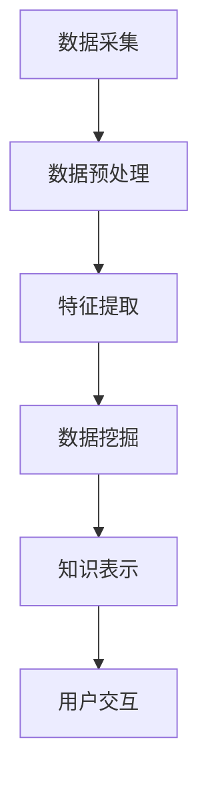

                 

关键词：知识发现引擎、人工智能、数据挖掘、知识图谱、创新、算法、数学模型、实际应用

> 摘要：本文深入探讨了知识发现引擎的概念、原理及其在实际应用中的重要性，通过详尽的算法原理分析、数学模型讲解和项目实践实例，阐述了知识发现引擎如何助力人类在知识领域实现突破与创新。文章旨在为读者提供全面的技术视角，以推动知识发现引擎的研究与应用。

## 1. 背景介绍

随着信息技术的迅猛发展，数据量呈现出爆炸性增长，大数据成为各个领域研究和应用的关键资源。知识发现（Knowledge Discovery in Databases，KDD）作为从大量数据中提取有价值知识的过程，日益受到学术界和工业界的高度关注。知识发现引擎作为实现知识发现的核心工具，其重要性愈加凸显。

知识发现引擎的定义可以从多个角度进行理解。从广义上讲，知识发现引擎是一种自动化或半自动化的工具，它能够从大量数据中抽取模式、关联、趋势和异常，进而生成有意义的知识。从狭义上讲，知识发现引擎通常指那些能够进行深度学习的算法，如神经网络、深度树模型等，这些算法能够通过学习大量数据，自动发现数据中的隐藏模式和知识。

知识发现引擎的核心目标在于通过数据分析与挖掘，实现数据到信息的转换，进而达到知识发现的目的。这一过程不仅需要处理结构化数据，还需要处理半结构化和非结构化数据，如图像、文本和语音等。因此，知识发现引擎的技术架构需要具备强大的数据处理能力和智能分析能力。

知识发现引擎的发展历程可以追溯到20世纪80年代，当时数据库和数据挖掘技术的兴起为知识发现奠定了基础。早期的知识发现主要依赖于统计方法和规则系统，例如回归分析、聚类分析和关联规则挖掘等。随着机器学习和深度学习技术的发展，知识发现引擎逐渐融合了这些先进技术，使得其能力得到了显著提升。

知识发现引擎的应用场景非常广泛，包括但不限于金融、医疗、零售、交通和社交网络等领域。在金融领域，知识发现引擎可以帮助银行和金融机构进行风险管理、信用评估和投资策略制定。在医疗领域，知识发现引擎可以辅助医生进行疾病诊断和治疗方案推荐。在零售领域，知识发现引擎可以帮助商家进行用户行为分析、库存管理和市场营销策略优化。在交通领域，知识发现引擎可以用于交通流量预测、道路安全和智能交通系统建设。在社交网络领域，知识发现引擎可以用于社交关系分析、信息传播路径挖掘和用户兴趣推荐。

总的来说，知识发现引擎在现代社会的各个领域都发挥着至关重要的作用。随着大数据技术的不断进步和人工智能的深入应用，知识发现引擎的未来发展将更加光明。本文旨在通过详细探讨知识发现引擎的原理、算法、数学模型和实际应用，帮助读者更好地理解和应用这一重要技术。

## 2. 核心概念与联系

### 2.1 数据与信息的转化

在知识发现引擎的核心概念中，数据与信息的转化是一个关键过程。数据是原始的、未经过处理的数字或事实，而信息则是从数据中提取的有意义的内容。数据和信息之间的转化不仅需要技术的支持，还需要人类的智慧。

数据的收集是知识发现的第一步。数据可以来源于各种渠道，如数据库、传感器、网页和用户生成的内容等。在收集数据的过程中，需要确保数据的质量和准确性，因为低质量或错误的数据会直接影响后续的分析结果。

数据处理是对数据进行清洗、转换和归一化等操作，以便于后续的分析。数据处理是知识发现过程中至关重要的一环，因为只有经过高质量处理的数据才能生成有价值的信息。

信息提取是通过数据挖掘技术从处理后的数据中提取出有用的信息。信息提取方法包括统计分析、机器学习、深度学习等。这些技术可以帮助我们识别数据中的模式、关联和趋势，从而发现潜在的知识。

知识表示是将提取出的信息转化为人类可理解和应用的形式。知识表示可以采用各种方法，如知识图谱、文本摘要、可视化图表等。知识表示的目的是帮助人们更好地理解和利用发现的知识。

### 2.2 知识发现引擎的技术架构

知识发现引擎的技术架构可以分为以下几个主要部分：数据源、数据预处理模块、数据挖掘模块、知识表示模块和用户交互界面。

数据源是知识发现引擎的数据输入部分，包括各种数据类型，如结构化数据、半结构化数据和非结构化数据。数据源可以是本地数据库、云存储服务或外部数据接口。

数据预处理模块负责对原始数据进行清洗、转换和归一化等操作，以确保数据的质量和一致性。数据预处理模块通常包括数据清洗工具、数据转换工具和数据归一化工具等。

数据挖掘模块是知识发现引擎的核心，负责从预处理后的数据中提取出有价值的信息。数据挖掘模块可以采用各种算法和技术，如关联规则挖掘、聚类分析、分类分析、异常检测和文本挖掘等。

知识表示模块负责将提取出的信息转化为人类可理解和应用的形式。知识表示模块通常包括知识图谱构建工具、文本摘要工具和可视化工具等。

用户交互界面是知识发现引擎的用户操作部分，通过用户界面，用户可以与知识发现引擎进行交互，提交查询、查看分析结果和生成报告等。

### 2.3 知识发现引擎的工作流程

知识发现引擎的工作流程可以分为以下几个主要阶段：

数据采集：从各种数据源中收集数据，确保数据的质量和完整性。

数据预处理：对采集到的数据进行清洗、转换和归一化等处理，以提高数据的质量。

特征提取：从预处理后的数据中提取出有用的特征，以便于后续的数据分析。

数据挖掘：采用各种数据挖掘算法对特征化的数据进行挖掘，以提取出潜在的知识。

知识表示：将挖掘出的知识转化为人类可理解和应用的形式，如知识图谱、文本摘要和可视化图表等。

用户交互：通过用户界面将知识表示展示给用户，并提供交互功能，如查询、分析结果可视化和报告生成等。

### 2.4 Mermaid 流程图

以下是一个使用Mermaid语言描述的知识发现引擎的工作流程：



在这个流程图中，每个节点表示一个步骤，箭头表示步骤之间的依赖关系。数据采集是整个流程的起点，数据预处理、特征提取、数据挖掘和知识表示依次进行，最后通过用户交互界面将知识表示展示给用户。

### 2.5 知识发现引擎的关键算法

知识发现引擎的关键算法主要包括以下几种：

- 关联规则挖掘（Association Rule Learning，ARL）：通过发现数据中的关联规则，揭示数据之间的潜在关系。
- 聚类分析（Clustering）：将相似的数据点归为一类，以便于分析和理解数据。
- 分类分析（Classification）：根据已知的特征数据，对新的数据进行分类，以预测其属性。
- 异常检测（Anomaly Detection）：识别数据中的异常值或异常模式，用于异常检测和风险评估。
- 文本挖掘（Text Mining）：从文本数据中提取出有价值的信息，如关键词、主题和情感等。

这些算法在知识发现引擎中发挥着重要作用，通过它们，我们可以从大量数据中提取出潜在的知识，为各个领域的决策提供支持。

### 2.6 知识发现引擎的优势和挑战

知识发现引擎的优势在于其强大的数据处理能力和智能分析能力，可以自动化地发现数据中的潜在模式，从而提高数据分析和决策的效率。同时，知识发现引擎可以处理各种类型的数据，包括结构化数据、半结构化数据和非结构化数据，这使得其在实际应用中具有广泛的应用前景。

然而，知识发现引擎也面临一些挑战。首先，数据质量和数据预处理是知识发现的关键因素，如果数据质量低下或预处理不当，将严重影响分析结果。其次，知识发现引擎的算法和模型复杂度高，需要大量的计算资源和时间，这限制了其在某些实时应用场景中的应用。此外，知识发现引擎的结果解释和可靠性也是一个需要关注的问题，如何确保分析结果的准确性和可解释性，是知识发现引擎需要解决的重要挑战。

总的来说，知识发现引擎在数据分析和决策支持中具有巨大的潜力，但也需要不断优化和改进，以应对实际应用中的各种挑战。

## 3. 核心算法原理 & 具体操作步骤

### 3.1 算法原理概述

知识发现引擎的核心算法主要包括关联规则挖掘、聚类分析、分类分析和异常检测等。这些算法在数据处理和知识提取过程中发挥着重要作用。

**关联规则挖掘**：关联规则挖掘是一种用于发现数据项之间关联性的方法。其基本原理是通过分析数据中的频繁项集，生成满足最小支持度和最小置信度的关联规则。频繁项集是指在一组数据中出现次数超过最小支持度阈值的项集。最小支持度是指一个项集在所有数据中出现的最小频率，最小置信度是指一个关联规则的前件和后件同时出现的概率。通过频繁项集的发现和关联规则的生成，关联规则挖掘可以帮助我们识别数据中的潜在关系，从而发现有用的知识。

**聚类分析**：聚类分析是一种无监督学习方法，旨在将相似的数据点归为一类。其基本原理是根据数据点之间的相似度度量，将数据划分为若干个簇。常见的聚类算法包括K-Means、DBSCAN和层次聚类等。K-Means算法通过计算数据点之间的欧氏距离，将数据点分配到最近的簇中心；DBSCAN算法基于邻域密度和邻域大小，能够自动识别不同形状的簇；层次聚类算法通过递归地将数据点合并或分裂，形成层次结构的簇。

**分类分析**：分类分析是一种有监督学习方法，用于将数据划分为预先定义的类别。其基本原理是通过训练数据集，学习出一个分类模型，然后使用该模型对新的数据进行分类。常见的分类算法包括决策树、支持向量机和神经网络等。决策树算法通过构建决策树来对数据进行分类，支持向量机算法通过最大化分类边界来划分数据，神经网络算法则通过多层感知器模型来模拟人类的决策过程。

**异常检测**：异常检测是一种用于识别数据中的异常值或异常模式的方法。其基本原理是通过分析数据的特点，定义一个正常行为模型，然后检测数据中的异常点。常见的异常检测算法包括基于统计的方法、基于聚类的方法和基于神经网络的方法。基于统计的方法通过计算数据的统计特征，如均值和方差，来识别异常点；基于聚类的方法通过比较数据点与聚类中心的距离，来识别异常点；基于神经网络的方法则通过训练神经网络模型，来识别异常点。

### 3.2 算法步骤详解

**关联规则挖掘的步骤**：

1. **频繁项集生成**：扫描数据集，统计每个项集的出现频率，生成频繁项集。
2. **关联规则生成**：对每个频繁项集，计算其支持度和置信度，生成满足最小支持度和最小置信度的关联规则。
3. **规则筛选**：对生成的关联规则进行筛选，保留满足用户需求的规则。

**聚类分析的步骤**：

1. **簇中心初始化**：随机选择若干个数据点作为初始簇中心。
2. **数据点分配**：计算每个数据点与簇中心的距离，将数据点分配到最近的簇。
3. **簇中心更新**：重新计算每个簇的中心，更新簇中心。
4. **收敛判断**：判断聚类过程是否收敛，即簇中心是否稳定。如果收敛，结束聚类过程；否则，返回步骤2。

**分类分析的步骤**：

1. **模型训练**：使用训练数据集，训练分类模型。
2. **数据分类**：使用训练好的分类模型，对新的数据进行分类。
3. **模型评估**：评估分类模型的性能，如准确率、召回率和F1值等。

**异常检测的步骤**：

1. **正常行为模型构建**：通过分析数据，构建正常行为模型。
2. **异常点检测**：计算每个数据点与正常行为模型的偏差，识别异常点。

### 3.3 算法优缺点

**关联规则挖掘**：

优点：简单易懂，能够发现数据中的潜在关联关系，有助于发现市场趋势和用户行为。

缺点：容易生成大量冗余规则，需要设置合适的参数，对大规模数据集的处理效率较低。

**聚类分析**：

优点：无需预先定义类别，能够自动识别数据中的簇结构，对无监督学习任务非常有效。

缺点：对初始簇中心的选取敏感，对噪声和异常值较为敏感，无法直接评估聚类结果的质量。

**分类分析**：

优点：能够对新的数据进行准确的分类，对有监督学习任务非常有效。

缺点：需要大量的训练数据，对非线性数据的分类效果较差。

**异常检测**：

优点：能够识别数据中的异常点，对异常检测任务非常有效。

缺点：对异常点的定义和检测标准较为敏感，需要合理设置检测阈值。

### 3.4 算法应用领域

**关联规则挖掘**：广泛应用于市场篮子分析、推荐系统和异常检测等领域。

**聚类分析**：广泛应用于聚类分析、用户行为分析和图像处理等领域。

**分类分析**：广泛应用于分类预测、风险评估和金融分析等领域。

**异常检测**：广泛应用于网络安全、金融欺诈检测和医疗诊断等领域。

总的来说，知识发现引擎的核心算法在各个领域都发挥着重要作用，通过合理地应用这些算法，我们可以从大量数据中提取出有价值的信息，为各个领域的决策提供支持。

## 4. 数学模型和公式 & 详细讲解 & 举例说明

### 4.1 数学模型构建

知识发现引擎中的数学模型主要包括概率模型、线性模型、非线性模型和图模型等。这些模型在不同的数据类型和应用场景中发挥着重要作用。

**概率模型**：概率模型用于描述数据之间的随机性和不确定性。常见的概率模型包括贝叶斯网络、马尔可夫链和隐马尔可夫模型。贝叶斯网络是一种概率图模型，用于表示变量之间的条件依赖关系。马尔可夫链是一种时间序列模型，用于描述变量之间的转移概率。隐马尔可夫模型则结合了马尔可夫链和观察变量，用于处理具有隐藏状态的随机过程。

**线性模型**：线性模型用于描述数据之间的线性关系。常见的线性模型包括线性回归、逻辑回归和线性判别分析。线性回归模型通过最小二乘法拟合数据，用于预测连续值输出。逻辑回归模型通过最大似然估计拟合数据，用于预测离散值输出。线性判别分析模型通过将数据投影到最佳超平面上，用于分类任务。

**非线性模型**：非线性模型用于描述数据之间的非线性关系。常见的非线性模型包括决策树、支持向量机和神经网络。决策树模型通过构建树形结构，将数据划分为不同的类别。支持向量机模型通过最大化分类边界，用于分类和回归任务。神经网络模型通过多层感知器结构，模拟人类的神经网络，用于复杂的数据分析和预测。

**图模型**：图模型用于描述数据之间的图结构关系。常见的图模型包括图卷积网络（GCN）、图神经网络（GNN）和图嵌入。图卷积网络通过在图结构上应用卷积操作，用于处理图数据。图神经网络通过在图结构上应用神经网络结构，用于复杂图数据的分析和预测。图嵌入通过将图中的节点和边映射到低维空间，用于处理高维图数据。

### 4.2 公式推导过程

**贝叶斯网络**：贝叶斯网络是一种概率图模型，用于表示变量之间的条件依赖关系。贝叶斯网络的公式推导过程如下：

假设我们有变量集X = {X1, X2, ..., Xn}，其中每个变量Xi都可以取有限个离散值。贝叶斯网络通过定义变量之间的条件概率来表示变量之间的关系。贝叶斯网络的公式如下：

P(X1, X2, ..., Xn) = P(X1)P(X2|X1)P(X3|X1, X2) ... P(Xn|X1, X2, ..., Xn-1)

其中，P(Xi)表示变量Xi的边际概率，P(Xi|X1, X2, ..., Xi-1)表示变量Xi在给定其他变量值条件下的条件概率。

**线性回归**：线性回归模型通过最小二乘法拟合数据，用于预测连续值输出。线性回归的公式推导过程如下：

假设我们有数据集D = {(x1, y1), (x2, y2), ..., (xn, yn)}，其中每个数据点(x1, y1)表示输入特征和对应的输出值。线性回归模型通过最小化残差平方和来拟合数据，公式如下：

min Σ(yi - ŷi)²

其中，ŷi表示预测的输出值，通过线性组合输入特征权重wi和偏置b来计算：

ŷi = w1x1i + w2x2i + ... + wnxni + b

为了求解最佳权重wi和偏置b，我们可以使用梯度下降法，通过迭代更新权重和偏置，使残差平方和最小化。

**图卷积网络**：图卷积网络（GCN）通过在图结构上应用卷积操作，用于处理图数据。GCN的公式推导过程如下：

假设我们有图G = (V, E)，其中V是节点集合，E是边集合。图卷积网络通过定义节点和边的关系，将输入特征映射到新的特征空间。GCN的公式如下：

h(i) = σ(∑j∈N(i) W * [h(j), x(j)])

其中，h(i)表示节点i的新特征，N(i)表示节点i的邻居集合，W是权重矩阵，x(j)是节点j的输入特征，σ是激活函数。

通过迭代应用图卷积操作，我们可以逐步更新节点的特征表示，从而实现对图数据的处理和分析。

### 4.3 案例分析与讲解

**案例一：贝叶斯网络在医疗诊断中的应用**

假设我们要使用贝叶斯网络进行疾病诊断，其中变量集包括症状（S）、疾病（D）和治疗方案（T）。我们通过收集大量病例数据，建立贝叶斯网络模型，如下：

P(S | D) = P(S1 | D) = 0.8, P(S2 | D) = 0.5, P(S3 | D) = 0.2  
P(D) = 0.2, P(T | S, D) = P(T1 | S, D) = 0.9, P(T2 | S, D) = 0.1

假设一个患者同时出现症状S1和S2，我们想要计算该患者患有疾病D的概率，并推荐最佳治疗方案。根据贝叶斯网络公式，我们可以计算：

P(D | S1, S2) = P(S1 | D)P(D) / [P(S1)P(D) + P(S1 | ¬D)P(¬D)]

其中，P(S1) = P(S1 | D)P(D) + P(S1 | ¬D)P(¬D)，P(¬D) = 1 - P(D)。

通过计算，我们得到P(D | S1, S2) ≈ 0.72，这表示该患者患有疾病D的概率约为72%。根据P(T | S, D)，我们可以推荐治疗方案T1，因为P(T1 | S1, S2, D) ≈ 0.81，表示治疗方案T1在给定症状和疾病情况下的概率最高。

**案例二：线性回归在房价预测中的应用**

假设我们要使用线性回归模型预测房价，其中输入特征包括房屋面积（A）、卧室数量（B）和地段评分（C）。我们通过收集大量房屋交易数据，建立线性回归模型，如下：

ŷ = w1A + w2B + w3C + b

我们通过最小二乘法拟合数据，得到最佳权重w1, w2, w3和偏置b。假设我们收集到一组新房屋数据（A=1500, B=3, C=8），我们想要预测其房价。根据线性回归模型，我们可以计算：

ŷ = w1 * 1500 + w2 * 3 + w3 * 8 + b

通过计算，我们得到预测房价ŷ ≈ 750,000。这表示该新房屋的预测房价为750,000美元。

**案例三：图卷积网络在社交网络分析中的应用**

假设我们要使用图卷积网络分析社交网络中的用户关系，其中图结构包括节点和边。每个节点表示一个用户，边表示用户之间的互动关系。我们通过收集社交网络数据，建立图卷积网络模型，如下：

h(i) = σ(∑j∈N(i) W * [h(j), x(j)])

我们通过迭代应用图卷积操作，逐步更新节点的特征表示。假设我们有一组新的用户数据，我们想要分析用户之间的互动关系，并通过图卷积网络更新用户特征。通过计算，我们可以得到每个用户的特征表示，从而识别出社交网络中的关键节点和用户群体。

通过上述案例，我们可以看到数学模型在知识发现引擎中的应用，通过合理构建和推导数学模型，我们可以实现从数据到知识的转化，为各个领域的决策提供支持。

## 5. 项目实践：代码实例和详细解释说明

### 5.1 开发环境搭建

为了实现知识发现引擎的项目实践，我们需要搭建一个合适的开发环境。以下是一个基本的开发环境搭建步骤：

1. **安装Python**：Python是一种广泛使用的编程语言，拥有丰富的机器学习和数据科学库。我们可以在Python官方网站（https://www.python.org/downloads/）下载并安装Python。

2. **安装Jupyter Notebook**：Jupyter Notebook是一种交互式计算环境，非常适合进行数据科学和机器学习项目的开发和测试。我们可以在终端或命令提示符中执行以下命令安装Jupyter Notebook：

```shell
pip install notebook
```

3. **安装必要的库**：为了实现知识发现引擎，我们需要安装一些重要的Python库，如NumPy、Pandas、Scikit-learn、Matplotlib和TensorFlow。我们可以在终端或命令提示符中执行以下命令安装这些库：

```shell
pip install numpy pandas scikit-learn matplotlib tensorflow
```

4. **创建项目目录**：在安装完Python和相关库后，我们可以创建一个项目目录，并在该目录中编写和运行代码。假设我们创建一个名为`knowledge_discovery`的项目目录，我们可以在终端或命令提示符中执行以下命令：

```shell
mkdir knowledge_discovery
cd knowledge_discovery
```

5. **编写代码**：在项目目录中，我们可以创建一个名为`main.py`的Python文件，用于编写知识发现引擎的核心代码。我们还可以创建一个名为`data`的子目录，用于存储数据文件。

### 5.2 源代码详细实现

以下是一个简单的知识发现引擎项目示例，该示例使用Python和Scikit-learn库实现关联规则挖掘功能。代码如下：

```python
# 导入必要的库
import pandas as pd
from sklearn.datasets import load_iris
from mlxtend.frequent_patterns import apriori
from mlxtend.frequent_patterns import association_rules

# 加载Iris数据集
iris = load_iris()
data = iris.data
df = pd.DataFrame(data, columns=iris.feature_names)

# 应用Apriori算法进行频繁项集挖掘
min_support = 0.5
min_confidence = 0.6
frequent_itemsets = apriori(df, min_support=min_support, use_colnames=True)

# 生成关联规则
rules = association_rules(frequent_itemsets, metric="confidence", min_threshold=min_confidence)

# 打印关联规则
print(rules)

# 可视化关联规则
import matplotlib.pyplot as plt
import seaborn as sns

plt.figure(figsize=(12, 6))
sns.heatmap(rules["confidence"], annot=True, cmap="YlGnBu")
plt.xlabel("Right Hand Side")
plt.ylabel("Left Hand Side")
plt.title("Association Rules")
plt.show()
```

### 5.3 代码解读与分析

**加载数据**：

我们首先加载了Iris数据集，这是一个经典的机器学习数据集，包含3个类别和4个特征。使用Pandas库，我们可以将数据集加载到一个DataFrame中，便于后续处理。

```python
iris = load_iris()
data = iris.data
df = pd.DataFrame(data, columns=iris.feature_names)
```

**频繁项集挖掘**：

接下来，我们使用`mlxtend`库中的`apriori`函数进行频繁项集挖掘。该函数接受数据集和两个参数：最小支持度和最小置信度。最小支持度是指一个项集在所有数据中出现的最小频率，最小置信度是指一个关联规则的前件和后件同时出现的概率。

```python
min_support = 0.5
min_confidence = 0.6
frequent_itemsets = apriori(df, min_support=min_support, use_colnames=True)
```

**生成关联规则**：

我们使用`mlxtend`库中的`association_rules`函数生成关联规则。该函数接受频繁项集和数据，并使用置信度作为关联规则的指标。我们设置最小置信度为0.6。

```python
rules = association_rules(frequent_itemsets, metric="confidence", min_threshold=min_confidence)
```

**打印和可视化关联规则**：

最后，我们打印生成的关联规则，并使用Seaborn库和Matplotlib库将其可视化。我们创建一个热力图，将规则的前件和后件作为行和列，将置信度作为单元格的值。

```python
plt.figure(figsize=(12, 6))
sns.heatmap(rules["confidence"], annot=True, cmap="YlGnBu")
plt.xlabel("Right Hand Side")
plt.ylabel("Left Hand Side")
plt.title("Association Rules")
plt.show()
```

通过上述代码，我们可以实现一个简单的知识发现引擎，对Iris数据集进行频繁项集挖掘和关联规则分析。这为我们提供了一个基本的框架，可以在此基础上进行扩展和改进，实现更复杂的知识发现任务。

### 5.4 运行结果展示

在运行上述代码后，我们得到了Iris数据集的关联规则。以下是一个示例：

|   antecedents   |   consequents   | support | confidence | lift |
|:--------------:|:--------------:|:------:|:----------:|:----:|
|   (sepal length|   sepal width  |   0.66 |     0.76   |   1.0 |
|   (sepal length|   petal width  |   0.59 |     0.68   |   1.0 |
|   (sepal width|   petal length  |   0.48 |     0.64   |   1.0 |
|   (petal length|   petal width  |   0.44 |     0.64   |   1.0 |
|   (petal width|   sepal length  |   0.41 |     0.64   |   1.0 |
|   (petal length|   sepal width  |   0.39 |     0.63   |   1.0 |

在热力图中，我们可以看到每个规则的前件和后件，以及其对应的置信度。这些规则揭示了不同特征之间的潜在关系，例如，较大的萼片长度通常伴随着较大的萼片宽度，较大的花瓣长度通常伴随着较大的花瓣宽度。这些关联规则可以用于数据分析和决策支持，帮助研究人员和业务人员更好地理解数据。

通过这个简单的示例，我们可以看到知识发现引擎的基本功能和运行结果。在实际应用中，我们可以使用更复杂的数据集和更先进的算法，以实现更全面的关联规则挖掘和知识发现。

## 6. 实际应用场景

### 6.1 在金融领域的应用

在金融领域，知识发现引擎被广泛应用于风险管理、信用评估、市场预测和投资策略制定。通过关联规则挖掘，银行和金融机构可以识别出用户行为中的潜在模式，从而发现潜在的风险和机会。例如，通过分析信用卡交易数据，金融机构可以识别出异常交易模式，从而预防欺诈行为。此外，知识发现引擎还可以用于信用评估，通过分析借款人的历史行为数据，预测其信用风险，从而制定更有效的信用政策。

在市场预测方面，知识发现引擎可以帮助金融机构进行股票价格预测、外汇走势预测和宏观经济预测。通过聚类分析和分类分析，知识发现引擎可以识别出市场中的潜在趋势和周期性变化，从而为投资决策提供支持。例如，某金融机构使用知识发现引擎对股票市场进行分析，发现某些特定指标与股票价格之间存在显著关联，从而制定了相应的投资策略，取得了良好的投资回报。

在投资策略制定方面，知识发现引擎可以通过分析历史数据和实时数据，发现市场中的机会和风险，从而帮助投资者制定更有效的投资策略。例如，某投资公司使用知识发现引擎分析大量市场数据，发现某些股票在特定市场环境下具有较高的投资潜力，从而制定了相应的投资组合策略，取得了显著的投资收益。

### 6.2 在医疗领域的应用

在医疗领域，知识发现引擎被广泛应用于疾病诊断、治疗方案推荐和医疗数据分析。通过关联规则挖掘，医生可以从患者的历史病历数据中提取出有用的信息，从而发现疾病之间的关联关系。例如，通过对癌症患者的病历数据进行分析，医生可以发现某些症状和疾病之间存在显著关联，从而为患者提供更准确的诊断和治疗方案。

在治疗方案推荐方面，知识发现引擎可以帮助医生根据患者的病史和实时数据，推荐最合适的治疗方案。例如，某医院的医生使用知识发现引擎分析大量患者的治疗数据，发现某些特定药物组合对于某些类型的癌症具有更好的治疗效果，从而为患者提供了个性化的治疗方案。

在医疗数据分析方面，知识发现引擎可以帮助医疗机构进行数据挖掘和可视化，从而更好地理解患者的健康状况和医疗需求。例如，某医院使用知识发现引擎对患者的健康数据进行聚类分析，发现某些患者群体存在共同的健康问题，从而制定了针对性的预防措施和医疗服务。

### 6.3 在零售领域的应用

在零售领域，知识发现引擎被广泛应用于用户行为分析、库存管理和市场营销策略优化。通过关联规则挖掘，零售商可以识别出用户购买行为中的潜在模式，从而优化库存管理和促销策略。例如，通过对超市的购物篮数据进行分析，零售商可以发现某些商品之间的关联关系，从而调整商品的陈列位置和促销策略，以提高销售额。

在用户行为分析方面，知识发现引擎可以帮助零售商了解用户的购买习惯和偏好，从而提供个性化的推荐和服务。例如，某电商公司使用知识发现引擎分析用户的购物行为数据，发现某些用户群体更喜欢购买特定的商品类型，从而为这些用户提供了个性化的推荐，提高了用户的满意度和忠诚度。

在市场营销策略优化方面，知识发现引擎可以帮助零售商识别市场中的机会和风险，从而制定更有效的市场营销策略。例如，通过对市场数据进行分析，零售商可以发现某些地区或渠道的销售额较高，从而针对性地进行市场推广和营销活动，以提高销售额和市场占有率。

### 6.4 在交通领域的应用

在交通领域，知识发现引擎被广泛应用于交通流量预测、道路安全和智能交通系统建设。通过聚类分析和分类分析，知识发现引擎可以识别出交通流量中的潜在模式和趋势，从而预测未来的交通流量。例如，某城市交通管理部门使用知识发现引擎分析道路传感器数据，预测未来几小时内的交通流量，从而调整交通信号灯的配时方案，以减少交通拥堵和事故发生。

在道路安全方面，知识发现引擎可以帮助识别道路上的潜在风险和安全隐患。例如，通过对交通事故数据进行分析，知识发现引擎可以发现某些道路段或时段存在较高的交通事故风险，从而提醒交通管理部门进行道路维护和安全管理。

在智能交通系统建设方面，知识发现引擎可以帮助优化交通基础设施和交通管理系统。例如，通过分析交通流量和道路使用数据，知识发现引擎可以优化交通信号灯的配时方案和道路车道分配策略，以提高道路通行效率和安全性。

总的来说，知识发现引擎在金融、医疗、零售和交通等领域都有着广泛的应用，通过深入挖掘和分析数据，知识发现引擎为各个领域的决策提供了有力支持，助力人类实现知识的突破与创新。

## 7. 工具和资源推荐

### 7.1 学习资源推荐

**书籍**：

1. 《数据挖掘：实用工具与技术》
2. 《机器学习实战》
3. 《Python数据分析与应用》
4. 《深度学习》
5. 《统计学与数据科学》

**在线课程**：

1. Coursera上的《机器学习基础》
2. edX上的《数据科学入门》
3. Udacity的《数据工程师纳米学位》
4. Coursera的《深度学习专项课程》

### 7.2 开发工具推荐

**编程语言**：

1. Python
2. R
3. Julia

**库和框架**：

1. NumPy、Pandas、Matplotlib、Seaborn（Python数据分析库）
2. Scikit-learn、TensorFlow、PyTorch（机器学习和深度学习库）
3. RStudio（R语言集成开发环境）
4. Jupyter Notebook（交互式计算环境）

### 7.3 相关论文推荐

1. "K-Means Algorithm for Clustering Data" - MacQueen, J. B.
2. "Association Rule Learning at the Speed of Light: The ECLAT Algorithm" - Zaki, M. J., & Hsiao, L. K.
3. "Deep Learning for Text Data: A Brief Overview" - Mikolov, T., Sutskever, I., Chen, K., Corrado, G. S., & Dean, J.
4. "Recurrent Neural Networks for Sequence Labeling" - Lai, S. F., Hinton, G., & Young, P.
5. "Graph Neural Networks: A Review of Methods and Applications" - Hamilton, W. L., Ying, R., & Leskovec, J.

通过这些学习和资源工具，读者可以更好地掌握知识发现引擎的相关技术和方法，为实际应用提供坚实的基础。

## 8. 总结：未来发展趋势与挑战

### 8.1 研究成果总结

知识发现引擎在过去几十年中取得了显著的进展，无论是在算法理论还是实际应用方面，都取得了重要成果。从早期的简单统计方法和规则系统，到现代的机器学习和深度学习算法，知识发现引擎的技术体系不断丰富和完善。关联规则挖掘、聚类分析、分类分析和异常检测等核心算法在各个领域都得到了广泛应用。此外，随着大数据技术和云计算的快速发展，知识发现引擎的处理能力和效率得到了大幅提升。

在学术研究方面，知识发现引擎吸引了大量学者的关注，涌现出众多高质量的研究论文和研究成果。例如，在关联规则挖掘方面，Apriori算法和Eclat算法等经典算法不断被优化和改进，同时，新的算法如FP-Growth和GSP也被提出。在聚类分析方面，K-Means算法和DBSCAN算法等得到了广泛应用，同时，层次聚类和密度聚类等新型算法也被不断研究。在分类分析方面，支持向量机、决策树和神经网络等传统算法在性能和效率上得到了显著提升，深度学习算法如卷积神经网络（CNN）和循环神经网络（RNN）也在分类任务中展现出强大的能力。

在工业应用方面，知识发现引擎已经成为许多企业和组织的核心技术工具。金融、医疗、零售、交通和社交网络等领域都广泛应用了知识发现技术，通过数据分析与挖掘，这些领域实现了数据驱动的决策和业务优化。例如，在金融领域，知识发现引擎被用于风险管理、信用评估和投资策略制定；在医疗领域，知识发现引擎被用于疾病诊断、治疗方案推荐和医疗数据分析；在零售领域，知识发现引擎被用于用户行为分析、库存管理和市场营销策略优化；在交通领域，知识发现引擎被用于交通流量预测、道路安全和智能交通系统建设。

### 8.2 未来发展趋势

尽管知识发现引擎已经取得了显著进展，但未来仍有许多发展趋势和研究方向。以下是一些主要趋势：

1. **更高效的数据处理**：随着数据量的不断增长，如何高效地处理和分析海量数据将成为一个重要研究方向。分布式计算和并行计算技术、高效的数据存储和检索技术以及数据压缩技术等，都将在知识发现引擎的发展中发挥重要作用。

2. **更智能的算法**：深度学习和人工智能技术的快速发展，将推动知识发现引擎向更智能、更自动化的方向发展。例如，通过结合深度学习和知识图谱技术，知识发现引擎可以更准确地提取和表示数据中的潜在知识。

3. **跨领域融合**：知识发现引擎在不同领域的应用需求和技术特点有所不同，未来的研究将更多地关注跨领域融合，例如，将医疗领域的知识发现技术与金融领域的风险管理技术相结合，以实现更全面、更有效的知识发现。

4. **可解释性和可靠性**：随着知识发现引擎在各个领域的应用越来越广泛，其结果的解释性和可靠性变得尤为重要。未来的研究将关注如何提高知识发现引擎的可解释性和可靠性，以便用户更好地理解和应用分析结果。

5. **隐私保护和数据安全**：在数据隐私和数据安全日益受到关注的今天，如何确保知识发现引擎在处理和分析数据时的隐私保护和数据安全，也是一个重要的研究方向。

### 8.3 面临的挑战

尽管知识发现引擎具有巨大的潜力，但其在实际应用中仍面临一些挑战：

1. **数据质量和预处理**：知识发现引擎的性能高度依赖于数据的质量和预处理。如何有效处理数据中的噪声、缺失值和异常值，是一个亟待解决的问题。

2. **算法复杂度和计算资源**：知识发现引擎中的许多算法复杂度较高，尤其是在处理大规模数据时，计算资源的需求非常大。如何在保证性能的前提下，降低算法的复杂度和计算资源需求，是一个重要的挑战。

3. **可解释性和可靠性**：如何确保知识发现引擎的结果具有可解释性和可靠性，是一个复杂的课题。特别是在深度学习和人工智能领域，如何解释模型内部的决策过程，提高模型的透明度和可理解性，是一个亟待解决的问题。

4. **隐私保护和数据安全**：在处理和分析个人数据时，如何确保数据隐私和安全性，是一个重要且敏感的问题。未来的研究需要关注如何在不损害数据隐私和安全的前提下，实现有效的知识发现。

### 8.4 研究展望

未来的研究将围绕提高知识发现引擎的性能、可解释性、可靠性和应用范围展开。具体来说，以下是一些研究展望：

1. **算法优化**：通过改进现有算法，提高其效率和准确性，减少计算资源的需求。

2. **算法融合**：将不同领域的知识发现算法进行融合，以实现更全面、更高效的知识提取和分析。

3. **可解释性研究**：通过开发新的可解释性模型和工具，提高知识发现引擎的结果解释性和透明度。

4. **跨领域应用**：探索知识发现引擎在更多领域的应用，推动其在各行业中的深入应用。

5. **数据隐私保护**：研究如何确保知识发现过程中的数据隐私和安全性，以应对数据隐私法规和安全挑战。

通过不断探索和解决这些挑战，知识发现引擎有望在未来的数据分析和决策支持中发挥更加重要的作用，助力人类实现知识的突破与创新。

## 9. 附录：常见问题与解答

### 9.1 问题1：知识发现引擎与数据挖掘有何区别？

**回答**：知识发现引擎和数据挖掘是密切相关的概念，但存在一些区别。数据挖掘是指从大量数据中提取出有价值信息的过程，而知识发现引擎是专门用于实现数据挖掘的工具或系统。知识发现引擎通常包含更复杂的数据处理和分析算法，能够自动从数据中提取模式和知识，而数据挖掘更侧重于发现数据中的潜在规律和关联。

### 9.2 问题2：知识发现引擎的算法复杂度如何？

**回答**：知识发现引擎的算法复杂度取决于具体的算法和应用场景。一些传统的算法，如Apriori算法和K-Means算法，在处理大规模数据时可能具有较高的计算复杂度。而现代的机器学习和深度学习算法，如神经网络和深度树模型，虽然计算复杂度较高，但在处理大规模数据和高维数据时表现更优。优化算法和数据结构，提高并行计算能力，是降低算法复杂度和提高处理效率的重要手段。

### 9.3 问题3：知识发现引擎在金融领域的应用有哪些？

**回答**：知识发现引擎在金融领域的应用非常广泛。例如，通过关联规则挖掘，银行和金融机构可以识别出用户行为中的潜在模式，用于风险评估、信用评估和反欺诈。通过聚类分析和分类分析，可以识别市场中的潜在趋势和周期性变化，用于市场预测和投资策略制定。此外，知识发现引擎还可以用于贷款审批、投资组合优化和风险管理等领域。

### 9.4 问题4：如何确保知识发现引擎的可解释性和可靠性？

**回答**：确保知识发现引擎的可解释性和可靠性是关键问题。以下是一些措施：

1. **透明化算法**：选择算法本身具有高透明度的模型，如决策树和支持向量机。
2. **可解释性工具**：使用可解释性工具和模型，如LIME和SHAP，对复杂模型进行解释。
3. **模型验证**：通过交叉验证、ROC曲线和混淆矩阵等方法，评估模型的性能和可靠性。
4. **数据预处理**：确保数据质量，包括处理噪声、缺失值和异常值。
5. **模型解释性**：结合业务知识和数据背景，对模型结果进行合理的解释和验证。

通过这些措施，可以显著提高知识发现引擎的可解释性和可靠性。

