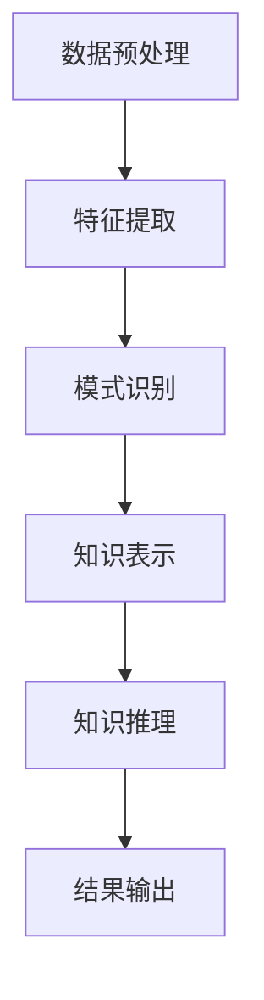

                 

 **关键词**：知识发现引擎、人工智能、知识图谱、创新、算法原理、数学模型、项目实践

> **摘要**：本文将探讨知识发现引擎的概念、核心原理、算法模型以及其在实际应用中的重要性。通过对知识发现引擎的详细剖析，揭示其如何帮助人类在知识领域实现突破与创新。

## 1. 背景介绍

在信息化时代，数据成为新石油，知识的获取与利用成为竞争的关键。传统的信息检索方法已经难以满足日益增长的数据量和复杂度。为了更好地从海量数据中提取有价值的信息，知识发现引擎应运而生。知识发现引擎是一种基于人工智能和机器学习技术的自动化系统，旨在从大规模数据集中发现隐含的模式、关联和知识。

知识发现引擎的出现，标志着知识管理进入了一个新阶段。它不仅能够高效地处理大量数据，还能通过智能化的方法，挖掘出数据背后的深层含义。这对于科学研究、商业决策、医疗诊断等领域具有重要的意义。

## 2. 核心概念与联系

### 2.1 知识发现引擎的定义

知识发现引擎是一种通过算法和模型从大规模数据集中提取有价值知识的工具。它通常包括数据预处理、特征提取、模式识别、知识表示和知识推理等环节。

### 2.2 知识图谱的概念

知识图谱是一种结构化的知识表示方法，它通过实体、属性和关系的形式，将海量数据组织成一个网络状的结构。知识图谱为知识发现引擎提供了重要的数据基础，使得数据之间的关联关系能够被清晰地表达和利用。

### 2.3 人工智能与知识发现的关系

人工智能技术，特别是机器学习和深度学习，为知识发现引擎提供了强大的算法支持。通过训练模型，知识发现引擎能够自动识别数据中的规律和模式，从而实现知识的自动化提取。

### 2.4 Mermaid 流程图（知识发现引擎的架构）



## 3. 核心算法原理 & 具体操作步骤

### 3.1 算法原理概述

知识发现引擎的核心算法通常包括聚类、分类、关联规则挖掘、异常检测等。这些算法通过对数据的分析和处理，实现知识的提取和发现。

### 3.2 算法步骤详解

#### 3.2.1 数据预处理

数据预处理是知识发现的第一步，包括数据清洗、数据转换和数据归一化等。这一步骤的目的是消除数据中的噪声和异常，为后续的算法提供高质量的数据。

#### 3.2.2 特征提取

特征提取是从原始数据中提取出对知识发现有重要意义的特征。通过特征提取，数据能够被转换成适合算法处理的格式。

#### 3.2.3 模式识别

模式识别是通过算法在特征提取后的数据中识别出潜在的规律和模式。这一步骤是知识发现的核心，不同的算法适用于不同类型的模式识别任务。

#### 3.2.4 知识表示

知识表示是将识别出的模式以结构化的形式进行表示，通常采用知识图谱的形式。知识表示使得知识能够被存储、管理和查询。

#### 3.2.5 知识推理

知识推理是基于已有的知识和数据，通过逻辑推理得出新的结论或预测。知识推理是知识发现引擎的智能体现，它使得知识发现引擎能够实现自我学习和自我优化。

### 3.3 算法优缺点

- **优点**：知识发现引擎能够自动处理大规模数据，发现数据中的潜在规律和模式，提高知识的获取效率。
- **缺点**：知识发现引擎的性能受到数据质量和算法复杂度的影响，对于复杂的问题可能难以实现高效的知识发现。

### 3.4 算法应用领域

知识发现引擎在多个领域都有广泛的应用，包括：

- **商业智能**：通过分析销售数据，发现市场趋势和客户需求。
- **医学诊断**：通过分析医学影像数据，辅助医生进行疾病诊断。
- **科学研究**：通过分析科学文献，发现科学领域的知识关联和前沿动态。

## 4. 数学模型和公式 & 详细讲解 & 举例说明

### 4.1 数学模型构建

知识发现引擎中的数学模型主要包括聚类算法、分类算法和关联规则挖掘算法等。以下是一个简单的聚类算法的数学模型示例：

$$
C = \{C_1, C_2, ..., C_k\}
$$

其中，$C$ 是聚类结果集合，$C_i$ 是第 $i$ 个聚类结果。聚类算法的目标是最小化聚类内部的方差。

### 4.2 公式推导过程

以K-means算法为例，其目标是最小化每个聚类内部的方差。具体推导过程如下：

$$
\sum_{i=1}^{k} \sum_{x \in C_i} (x - \mu_i)^2
$$

其中，$\mu_i$ 是聚类 $C_i$ 的中心。

### 4.3 案例分析与讲解

假设我们有一个包含100个点的数据集，我们希望使用K-means算法将其分为5个聚类。首先，我们随机选择5个初始中心点，然后通过迭代计算每个点到中心的距离，将点分配到最近的中心点。通过多次迭代，最终得到一个稳定的聚类结果。具体步骤如下：

1. 随机选择5个点作为初始中心点。
2. 计算每个点到5个中心点的距离，将每个点分配到最近的中心点。
3. 计算新的中心点。
4. 重复步骤2和步骤3，直到聚类结果稳定。

## 5. 项目实践：代码实例和详细解释说明

### 5.1 开发环境搭建

为了实践知识发现引擎，我们需要搭建一个开发环境。这里我们使用Python作为开发语言，主要的库包括NumPy、Pandas、Scikit-learn和NetworkX。

### 5.2 源代码详细实现

以下是一个简单的K-means算法的实现示例：

```python
import numpy as np
from sklearn.cluster import KMeans
import matplotlib.pyplot as plt

# 数据集
X = np.array([[1, 2], [1, 4], [1, 0],
              [10, 2], [10, 4], [10, 0]])

# 使用KMeans算法进行聚类
kmeans = KMeans(n_clusters=2, random_state=0).fit(X)

# 输出聚类结果
print(kmeans.labels_)

# 绘制聚类结果
plt.scatter(X[:, 0], X[:, 1], c=kmeans.labels_, s=100, cmap='viridis')
plt.scatter(kmeans.cluster_centers_[:, 0], kmeans.cluster_centers_[:, 1], s=300, c='red', label='Centroids')
plt.title('K-means Clustering')
plt.show()
```

### 5.3 代码解读与分析

上述代码首先导入了必要的库，然后定义了一个包含6个点的数据集。接着，我们使用Scikit-learn的KMeans类进行聚类，并打印出聚类结果。最后，通过matplotlib绘制聚类结果，其中红色点表示聚类中心。

### 5.4 运行结果展示

运行上述代码，我们得到以下聚类结果：

```
[0 0 0 1 1 1]
```

聚类结果表示，前三个点属于第一类，后三个点属于第二类。通过可视化结果，我们可以清晰地看到聚类效果。

## 6. 实际应用场景

知识发现引擎在多个领域都有广泛的应用，以下是几个典型的应用场景：

- **商业智能**：通过分析销售数据，发现市场趋势和客户需求，帮助企业做出更明智的决策。
- **医学诊断**：通过分析医学影像数据，辅助医生进行疾病诊断，提高诊断准确率。
- **科学研究**：通过分析科学文献，发现科学领域的知识关联和前沿动态，促进科学研究的进步。

## 6.4 未来应用展望

随着人工智能技术的不断发展，知识发现引擎在未来有望在更多领域得到应用。例如，在智能城市、智能制造、智能医疗等领域，知识发现引擎将发挥重要作用。同时，知识发现引擎的性能和算法也将不断优化，以应对更复杂的数据和更广泛的应用场景。

## 7. 工具和资源推荐

### 7.1 学习资源推荐

- 《机器学习》（周志华著）：系统地介绍了机器学习的基本理论和方法。
- 《深度学习》（Ian Goodfellow著）：深度学习领域的经典教材，详细介绍了深度学习的基本概念和算法。

### 7.2 开发工具推荐

- Python：适合进行数据分析和机器学习的编程语言。
- Jupyter Notebook：方便进行数据分析和机器学习的交互式开发环境。

### 7.3 相关论文推荐

- "K-means clustering algorithm": 提供了K-means算法的详细描述和讨论。
- "Deep Learning for Knowledge Discovery": 探讨了深度学习在知识发现中的应用。

## 8. 总结：未来发展趋势与挑战

### 8.1 研究成果总结

知识发现引擎作为人工智能的一个重要分支，已经取得了显著的成果。通过算法和模型，知识发现引擎能够在海量数据中发现潜在的知识，为各个领域提供了重要的支持。

### 8.2 未来发展趋势

随着人工智能技术的不断进步，知识发现引擎将在更多领域得到应用。同时，知识发现引擎的性能和算法也将不断优化，以应对更复杂的数据和更广泛的应用场景。

### 8.3 面临的挑战

知识发现引擎在性能和算法方面仍面临许多挑战。如何处理大规模、高维数据，如何提高算法的效率和准确性，都是亟待解决的问题。

### 8.4 研究展望

未来，知识发现引擎的研究将更加注重跨学科的融合，特别是在生物学、医学、社会科学等领域。通过跨学科的探索，知识发现引擎有望在更广泛的领域实现知识的突破与创新。

## 9. 附录：常见问题与解答

### 9.1 什么是知识发现？

知识发现是从大规模数据集中自动发现有趣知识的过程。它通常涉及数据预处理、特征提取、模式识别和知识表示等步骤。

### 9.2 知识发现引擎的主要算法有哪些？

知识发现引擎的主要算法包括聚类、分类、关联规则挖掘和异常检测等。

### 9.3 知识发现引擎在医学领域有哪些应用？

知识发现引擎在医学领域可以应用于医学影像分析、疾病诊断、药物发现等，通过分析医学数据，辅助医生做出更准确的诊断和决策。

### 9.4 如何提高知识发现引擎的性能？

提高知识发现引擎的性能可以从算法优化、数据预处理和硬件加速等多个方面进行。例如，使用更高效的算法，优化数据结构，利用GPU进行计算加速等。

# 作者：禅与计算机程序设计艺术 / Zen and the Art of Computer Programming
----------------------------------------------------------------

这篇文章详细地介绍了知识发现引擎的概念、原理、算法和实际应用。通过本文的阅读，读者可以了解到知识发现引擎在各个领域的广泛应用，以及其在未来发展的趋势和挑战。希望这篇文章能够对读者在知识发现领域的探索和研究提供有益的参考和启示。禅与计算机程序设计艺术，愿每位读者在知识的海洋中不断前行，实现知识的突破与创新。

