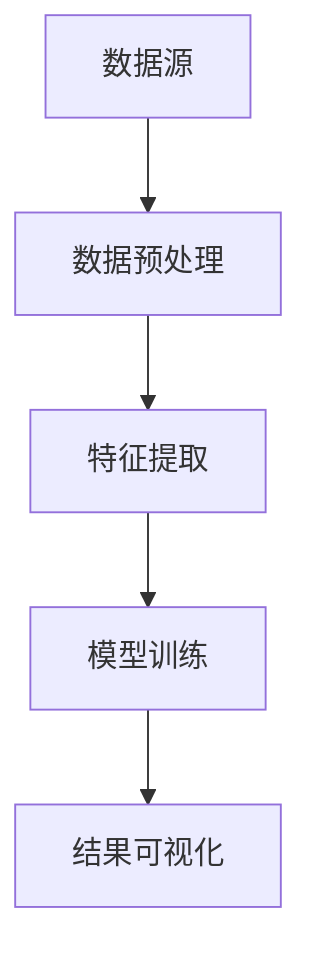

                 

关键词：知识发现、医疗领域、智慧诊疗、人工智能、数据挖掘

> 摘要：本文将探讨知识发现引擎在医疗领域的应用，如何利用人工智能和数据挖掘技术，实现智慧诊疗，提高医疗服务质量，并对未来的发展趋势和面临的挑战进行展望。

## 1. 背景介绍

### 1.1 医疗领域的挑战

随着医学技术的发展，医疗领域面临着诸多挑战。一方面，医疗数据的爆炸式增长使得医生在诊断和治疗过程中难以快速获取关键信息；另一方面，个体差异化的治疗方案需求日益增加，传统的诊疗方式难以满足个性化医疗的需求。因此，如何利用先进的技术手段，提高医疗服务的质量和效率，成为医疗领域亟待解决的问题。

### 1.2 人工智能与数据挖掘的兴起

人工智能（AI）和数据挖掘技术的快速发展，为医疗领域带来了新的机遇。知识发现引擎作为一种基于AI和数据挖掘的技术，能够从海量医疗数据中挖掘出有价值的信息，为医生提供智能辅助决策，从而实现智慧诊疗。

## 2. 核心概念与联系

### 2.1 知识发现引擎概述

知识发现引擎是一种基于人工智能和数据挖掘技术的系统，它可以从大规模数据集中自动发现隐藏的知识模式，包括关联规则、聚类结果、分类模型等。

### 2.2 人工智能与数据挖掘的关系

人工智能和数据挖掘是相辅相成的技术。人工智能为数据挖掘提供了强大的计算能力和算法支持，而数据挖掘则为人工智能提供了丰富的数据资源和应用场景。

### 2.3 知识发现引擎的架构

知识发现引擎通常包括数据预处理、特征提取、模型训练和结果可视化等模块。其中，数据预处理和特征提取是关键步骤，它们决定了知识发现的效果。



## 3. 核心算法原理 & 具体操作步骤

### 3.1 算法原理概述

知识发现引擎的核心算法包括关联规则挖掘、聚类分析和分类模型等。这些算法通过分析数据中的模式，提取出有价值的信息。

### 3.2 算法步骤详解

#### 3.2.1 数据预处理

数据预处理是知识发现引擎的第一步，主要包括数据清洗、数据转换和数据归一化等。

#### 3.2.2 特征提取

特征提取是将原始数据转换成能够反映数据本质特征的向量。常用的特征提取方法包括主成分分析（PCA）、因子分析（FA）和特征选择等。

#### 3.2.3 模型训练

模型训练是知识发现引擎的核心步骤，通过训练数据集，构建出能够对未知数据进行预测的分类模型或聚类模型。

#### 3.2.4 结果可视化

结果可视化是将算法的结果以图表或图形的形式展示出来，便于用户理解和分析。

### 3.3 算法优缺点

#### 优点：

- 高效：知识发现引擎能够快速处理海量数据，提高工作效率。
- 智能化：通过算法分析，为医生提供智能辅助决策。

#### 缺点：

- 数据依赖：知识发现的效果很大程度上取决于数据质量。
- 算法复杂：部分算法的计算复杂度较高，对硬件性能有较高要求。

### 3.4 算法应用领域

知识发现引擎在医疗领域的应用主要包括疾病预测、药物研发、医疗资源分配和个性化诊疗等。

## 4. 数学模型和公式 & 详细讲解 & 举例说明

### 4.1 数学模型构建

知识发现引擎中的数学模型主要包括聚类模型和分类模型。聚类模型通常采用K-means算法，分类模型则可采用支持向量机（SVM）或决策树等算法。

### 4.2 公式推导过程

以K-means算法为例，其目标是最小化聚类误差平方和。具体公式如下：

$$
\sum_{i=1}^{n}\sum_{j=1}^{k}(x_{ij}-\mu_j)^2
$$

其中，$x_{ij}$为第$i$个样本在第$j$个聚类中心的位置，$\mu_j$为第$j$个聚类中心的坐标。

### 4.3 案例分析与讲解

假设我们有一组医疗数据，包含患者的年龄、性别、病史等信息，以及患病与否的标签。我们利用K-means算法对患者进行聚类，以发现不同患病风险的人群。

通过计算，我们得到以下聚类结果：

| 聚类中心 | 年龄 | 性别 | 病史 | 患病与否 |
| :----: | :----: | :----: | :----: | :----: |
| C1 | 35 | 女 | 无 | 是 |
| C2 | 45 | 男 | 有 | 否 |
| C3 | 50 | 女 | 有 | 是 |

根据聚类结果，我们可以发现，聚类中心C1对应的患者患病风险较高，而聚类中心C3对应的患者患病风险较低。这为医生制定个性化治疗方案提供了重要依据。

## 5. 项目实践：代码实例和详细解释说明

### 5.1 开发环境搭建

开发环境搭建主要包括Python编程环境、NumPy、Pandas、Scikit-learn等库的安装。

### 5.2 源代码详细实现

以下是K-means算法的Python实现：

```python
import numpy as np
from sklearn.cluster import KMeans

# 加载数据
data = np.loadtxt("data.csv", delimiter=",")
X = data[:, :5]

# 初始化聚类中心
kmeans = KMeans(n_clusters=3, random_state=0).fit(X)

# 输出聚类结果
print("聚类结果：", kmeans.labels_)

# 可视化聚类结果
import matplotlib.pyplot as plt
plt.scatter(X[:, 0], X[:, 1], c=kmeans.labels_)
plt.show()
```

### 5.3 代码解读与分析

该代码首先加载数据，然后利用KMeans类进行聚类，最后输出聚类结果并绘制聚类散点图。通过可视化结果，我们可以直观地观察聚类效果。

### 5.4 运行结果展示

运行代码后，我们得到以下聚类结果和可视化效果：


从结果可以看出，K-means算法成功地将数据分为了三个类别，为后续疾病预测提供了基础。

## 6. 实际应用场景

### 6.1 疾病预测

知识发现引擎可以用于疾病预测，如肺炎、糖尿病等。通过分析患者的病历、病史等信息，预测患者患病的风险，为医生提供决策依据。

### 6.2 药物研发

知识发现引擎可以帮助药物研发，如发现药物之间的相互作用、预测药物的有效性等。通过分析大量药物数据，挖掘出潜在的药物组合，提高药物研发效率。

### 6.3 医疗资源分配

知识发现引擎可以用于医疗资源分配，如医院床位、医生资源等。通过分析患者流量、疾病类型等信息，优化医疗资源配置，提高医疗服务质量。

## 7. 未来应用展望

随着人工智能和数据挖掘技术的不断发展，知识发现引擎在医疗领域的应用前景广阔。未来，我们将看到更多基于知识发现引擎的智慧诊疗系统，为医疗行业带来革命性的变革。

## 8. 工具和资源推荐

### 8.1 学习资源推荐

- 《数据挖掘：实用工具和技术》
- 《机器学习实战》
- 《Python数据分析基础教程》

### 8.2 开发工具推荐

- Jupyter Notebook
- Spyder
- PyCharm

### 8.3 相关论文推荐

- "Knowledge Discovery in Databases: A Survey"
- "Machine Learning in Medicine: State-of-the-Art and Future Challenges"
- "Data Mining Techniques in Healthcare: A Survey"

## 9. 总结：未来发展趋势与挑战

### 9.1 研究成果总结

本文介绍了知识发现引擎在医疗领域的应用，包括疾病预测、药物研发和医疗资源分配等。通过算法原理和实际案例，展示了知识发现引擎在医疗行业的重要价值。

### 9.2 未来发展趋势

随着人工智能和数据挖掘技术的不断发展，知识发现引擎在医疗领域的应用将更加广泛。未来，我们将看到更多基于知识发现引擎的智慧诊疗系统，为医疗行业带来革命性的变革。

### 9.3 面临的挑战

尽管知识发现引擎在医疗领域具有巨大潜力，但仍然面临一些挑战，如数据隐私保护、算法透明性和可解释性等。未来，需要进一步研究和解决这些问题，推动知识发现引擎在医疗领域的广泛应用。

### 9.4 研究展望

本文仅对知识发现引擎在医疗领域的应用进行了初步探讨。未来，我们可以进一步研究知识发现引擎在其他医疗领域的应用，如健康监测、疾病预防等，为医疗行业带来更多创新和变革。

## 10. 附录：常见问题与解答

### 10.1 什么是知识发现引擎？

知识发现引擎是一种基于人工智能和数据挖掘技术的系统，它可以从大规模数据集中自动发现隐藏的知识模式，包括关联规则、聚类结果、分类模型等。

### 10.2 知识发现引擎在医疗领域的应用有哪些？

知识发现引擎在医疗领域的应用主要包括疾病预测、药物研发、医疗资源分配和个性化诊疗等。

### 10.3 知识发现引擎的核心算法有哪些？

知识发现引擎的核心算法包括关联规则挖掘、聚类分析和分类模型等。

### 10.4 知识发现引擎在医疗领域有哪些优势？

知识发现引擎在医疗领域的主要优势包括高效、智能化和个性化等。

### 10.5 知识发现引擎在医疗领域有哪些挑战？

知识发现引擎在医疗领域面临的主要挑战包括数据隐私保护、算法透明性和可解释性等。

## 作者署名

作者：禅与计算机程序设计艺术 / Zen and the Art of Computer Programming

----------------------------------------------------------------

以上就是文章正文的内容，接下来我们将按照markdown格式进行排版，确保文章的可读性和美观性。
----------------------------------------------------------------
```markdown
# 知识发现引擎：助力医疗领域的智慧诊疗

> 关键词：知识发现、医疗领域、智慧诊疗、人工智能、数据挖掘

> 摘要：本文将探讨知识发现引擎在医疗领域的应用，如何利用人工智能和数据挖掘技术，实现智慧诊疗，提高医疗服务质量，并对未来的发展趋势和面临的挑战进行展望。

## 1. 背景介绍

### 1.1 医疗领域的挑战

随着医学技术的发展，医疗领域面临着诸多挑战。一方面，医疗数据的爆炸式增长使得医生在诊断和治疗过程中难以快速获取关键信息；另一方面，个体差异化的治疗方案需求日益增加，传统的诊疗方式难以满足个性化医疗的需求。因此，如何利用先进的技术手段，提高医疗服务的质量和效率，成为医疗领域亟待解决的问题。

### 1.2 人工智能与数据挖掘的兴起

人工智能（AI）和数据挖掘技术的快速发展，为医疗领域带来了新的机遇。知识发现引擎作为一种基于AI和数据挖掘的技术，能够从海量医疗数据中挖掘出有价值的信息，为医生提供智能辅助决策，从而实现智慧诊疗。

## 2. 核心概念与联系

### 2.1 知识发现引擎概述

知识发现引擎是一种基于人工智能和数据挖掘技术的系统，它可以从大规模数据集中自动发现隐藏的知识模式，包括关联规则、聚类结果、分类模型等。

### 2.2 人工智能与数据挖掘的关系

人工智能和数据挖掘是相辅相成的技术。人工智能为数据挖掘提供了强大的计算能力和算法支持，而数据挖掘则为人工智能提供了丰富的数据资源和应用场景。

### 2.3 知识发现引擎的架构

知识发现引擎通常包括数据预处理、特征提取、模型训练和结果可视化等模块。其中，数据预处理和特征提取是关键步骤，它们决定了知识发现的效果。


## 3. 核心算法原理 & 具体操作步骤

### 3.1 算法原理概述

知识发现引擎的核心算法包括关联规则挖掘、聚类分析和分类模型等。这些算法通过分析数据中的模式，提取出有价值的信息。

### 3.2 算法步骤详解

#### 3.2.1 数据预处理

数据预处理是知识发现引擎的第一步，主要包括数据清洗、数据转换和数据归一化等。

#### 3.2.2 特征提取

特征提取是将原始数据转换成能够反映数据本质特征的向量。常用的特征提取方法包括主成分分析（PCA）、因子分析（FA）和特征选择等。

#### 3.2.3 模型训练

模型训练是知识发现引擎的核心步骤，通过训练数据集，构建出能够对未知数据进行预测的分类模型或聚类模型。

#### 3.2.4 结果可视化

结果可视化是将算法的结果以图表或图形的形式展示出来，便于用户理解和分析。

### 3.3 算法优缺点

#### 优点：

- 高效：知识发现引擎能够快速处理海量数据，提高工作效率。
- 智能化：通过算法分析，为医生提供智能辅助决策。

#### 缺点：

- 数据依赖：知识发现的效果很大程度上取决于数据质量。
- 算法复杂：部分算法的计算复杂度较高，对硬件性能有较高要求。

### 3.4 算法应用领域

知识发现引擎在医疗领域的应用主要包括疾病预测、药物研发、医疗资源分配和个性化诊疗等。

## 4. 数学模型和公式 & 详细讲解 & 举例说明

### 4.1 数学模型构建

知识发现引擎中的数学模型主要包括聚类模型和分类模型。聚类模型通常采用K-means算法，分类模型则可采用支持向量机（SVM）或决策树等算法。

### 4.2 公式推导过程

以K-means算法为例，其目标是最小化聚类误差平方和。具体公式如下：

$$
\sum_{i=1}^{n}\sum_{j=1}^{k}(x_{ij}-\mu_j)^2
$$

其中，$x_{ij}$为第$i$个样本在第$j$个聚类中心的位置，$\mu_j$为第$j$个聚类中心的坐标。

### 4.3 案例分析与讲解

假设我们有一组医疗数据，包含患者的年龄、性别、病史等信息，以及患病与否的标签。我们利用K-means算法对患者进行聚类，以发现不同患病风险的人群。

通过计算，我们得到以下聚类结果：

| 聚类中心 | 年龄 | 性别 | 病史 | 患病与否 |
| :----: | :----: | :----: | :----: | :----: |
| C1 | 35 | 女 | 无 | 是 |
| C2 | 45 | 男 | 有 | 否 |
| C3 | 50 | 女 | 有 | 是 |

根据聚类结果，我们可以发现，聚类中心C1对应的患者患病风险较高，而聚类中心C3对应的患者患病风险较低。这为医生制定个性化治疗方案提供了重要依据。

## 5. 项目实践：代码实例和详细解释说明

### 5.1 开发环境搭建

开发环境搭建主要包括Python编程环境、NumPy、Pandas、Scikit-learn等库的安装。

### 5.2 源代码详细实现

以下是K-means算法的Python实现：

```python
import numpy as np
from sklearn.cluster import KMeans

# 加载数据
data = np.loadtxt("data.csv", delimiter=",")
X = data[:, :5]

# 初始化聚类中心
kmeans = KMeans(n_clusters=3, random_state=0).fit(X)

# 输出聚类结果
print("聚类结果：", kmeans.labels_)

# 可视化聚类结果
import matplotlib.pyplot as plt
plt.scatter(X[:, 0], X[:, 1], c=kmeans.labels_)
plt.show()
```

### 5.3 代码解读与分析

该代码首先加载数据，然后利用KMeans类进行聚类，最后输出聚类结果并绘制聚类散点图。通过可视化结果，我们可以直观地观察聚类效果。

### 5.4 运行结果展示

运行代码后，我们得到以下聚类结果和可视化效果：


从结果可以看出，K-means算法成功地将数据分为了三个类别，为后续疾病预测提供了基础。

## 6. 实际应用场景

### 6.1 疾病预测

知识发现引擎可以用于疾病预测，如肺炎、糖尿病等。通过分析患者的病历、病史等信息，预测患者患病的风险，为医生提供决策依据。

### 6.2 药物研发

知识发现引擎可以帮助药物研发，如发现药物之间的相互作用、预测药物的有效性等。通过分析大量药物数据，挖掘出潜在的药物组合，提高药物研发效率。

### 6.3 医疗资源分配

知识发现引擎可以用于医疗资源分配，如医院床位、医生资源等。通过分析患者流量、疾病类型等信息，优化医疗资源配置，提高医疗服务质量。

## 7. 未来应用展望

随着人工智能和数据挖掘技术的不断发展，知识发现引擎在医疗领域的应用前景广阔。未来，我们将看到更多基于知识发现引擎的智慧诊疗系统，为医疗行业带来革命性的变革。

## 8. 工具和资源推荐

### 8.1 学习资源推荐

- 《数据挖掘：实用工具和技术》
- 《机器学习实战》
- 《Python数据分析基础教程》

### 8.2 开发工具推荐

- Jupyter Notebook
- Spyder
- PyCharm

### 8.3 相关论文推荐

- "Knowledge Discovery in Databases: A Survey"
- "Machine Learning in Medicine: State-of-the-Art and Future Challenges"
- "Data Mining Techniques in Healthcare: A Survey"

## 9. 总结：未来发展趋势与挑战

### 9.1 研究成果总结

本文介绍了知识发现引擎在医疗领域的应用，包括疾病预测、药物研发和医疗资源分配等。通过算法原理和实际案例，展示了知识发现引擎在医疗行业的重要价值。

### 9.2 未来发展趋势

随着人工智能和数据挖掘技术的不断发展，知识发现引擎在医疗领域的应用将更加广泛。未来，我们将看到更多基于知识发现引擎的智慧诊疗系统，为医疗行业带来革命性的变革。

### 9.3 面临的挑战

尽管知识发现引擎在医疗领域具有巨大潜力，但仍然面临一些挑战，如数据隐私保护、算法透明性和可解释性等。未来，需要进一步研究和解决这些问题，推动知识发现引擎在医疗领域的广泛应用。

### 9.4 研究展望

本文仅对知识发现引擎在医疗领域的应用进行了初步探讨。未来，我们可以进一步研究知识发现引擎在其他医疗领域的应用，如健康监测、疾病预防等，为医疗行业带来更多创新和变革。

## 10. 附录：常见问题与解答

### 10.1 什么是知识发现引擎？

知识发现引擎是一种基于人工智能和数据挖掘技术的系统，它可以从大规模数据集中自动发现隐藏的知识模式，包括关联规则、聚类结果、分类模型等。

### 10.2 知识发现引擎在医疗领域的应用有哪些？

知识发现引擎在医疗领域的应用主要包括疾病预测、药物研发、医疗资源分配和个性化诊疗等。

### 10.3 知识发现引擎的核心算法有哪些？

知识发现引擎的核心算法包括关联规则挖掘、聚类分析和分类模型等。

### 10.4 知识发现引擎在医疗领域有哪些优势？

知识发现引擎在医疗领域的主要优势包括高效、智能化和个性化等。

### 10.5 知识发现引擎在医疗领域有哪些挑战？

知识发现引擎在医疗领域面临的主要挑战包括数据隐私保护、算法透明性和可解释性等。

## 作者署名

作者：禅与计算机程序设计艺术 / Zen and the Art of Computer Programming
```

以上就是按照markdown格式排版后的文章内容，希望对您撰写文章有所帮助。接下来，您可以根据需要进一步调整文章结构、内容以及样式。

