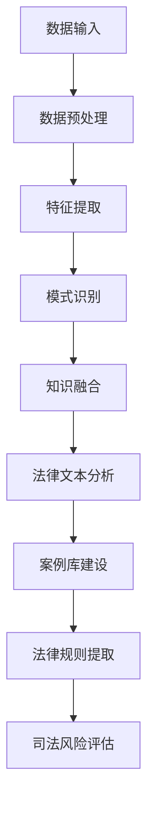

                 

关键词：知识发现引擎，智慧司法，法律领域，人工智能，司法信息化，算法，数据挖掘，法律分析，智能裁判，法律文献，法律规则，案例库，大数据，司法流程优化，AI 技术应用，司法决策支持，法律服务自动化，数字司法，司法透明度，司法公正。

> 摘要：随着人工智能技术的飞速发展，知识发现引擎在法律领域中的应用正逐渐成为智慧司法的重要组成部分。本文将深入探讨知识发现引擎的核心概念、算法原理、数学模型、应用实践，以及其在法律领域中的实际应用场景和未来发展趋势。本文旨在为读者提供一个全面了解知识发现引擎在智慧司法领域中的应用价值和技术挑战的视角。

## 1. 背景介绍

### 法律领域的数字化变革

近年来，随着数字化技术的不断进步，法律领域正经历着深刻的变革。传统的法律工作方式已经难以满足日益增长的法律需求和复杂化的法律环境。数字化和智能化成为了法律领域的必然趋势。在此背景下，智慧司法的概念应运而生。

智慧司法是指通过信息技术手段，实现司法活动的高效、透明和公正。它旨在通过人工智能、大数据、云计算等先进技术，提升司法效率，优化司法流程，增强司法透明度，保障司法公正。

### 人工智能与司法信息化

人工智能技术在法律领域的应用，为智慧司法的实现提供了强有力的技术支持。人工智能通过自动化处理法律文本、分析法律案例、预测司法结果等方式，提高了法律服务的质量和效率。同时，司法信息化建设也在积极推进，通过建设电子法院、网上诉讼、远程审判等平台，实现司法活动的全面数字化。

### 知识发现引擎的兴起

知识发现引擎作为一种新兴的人工智能技术，它能够从大量非结构化数据中提取有价值的信息和知识。在法律领域，知识发现引擎的应用可以帮助司法机关更好地理解法律规则、分析案例、预测法律风险等，从而提升司法决策的准确性和科学性。

## 2. 核心概念与联系

### 知识发现引擎的概念

知识发现引擎（Knowledge Discovery Engine，KDE）是指一种利用人工智能技术和数据挖掘技术，从大量数据中自动发现规律、关联、模式、趋势和知识的人工智能系统。它主要包括数据预处理、特征提取、模式识别、知识融合等核心模块。

### 知识发现引擎在法律领域中的应用

在法律领域，知识发现引擎的应用主要包括以下几个方面：

1. **法律文本分析**：通过对法律文本的自动分类、标注、摘要和推理，帮助法律工作者快速理解和掌握法律条文。
2. **案例库建设**：通过分析大量法律案例，构建案例库，为司法实践提供参考和借鉴。
3. **法律规则提取**：从法律文本和案例中提取法律规则，为法律研究和立法提供支持。
4. **司法风险评估**：通过分析司法数据，预测案件审理过程中可能出现的风险，为司法决策提供支持。

### Mermaid 流程图



## 3. 核心算法原理 & 具体操作步骤

### 3.1 算法原理概述

知识发现引擎的核心算法主要包括数据挖掘算法、机器学习算法和深度学习算法。这些算法通过从大量数据中提取有用信息，实现知识的自动发现。

1. **数据挖掘算法**：包括关联规则挖掘、分类算法、聚类算法等。它们用于从大量数据中发现规律和关联。
2. **机器学习算法**：包括决策树、支持向量机、神经网络等。它们通过训练模型，实现数据的自动分类和预测。
3. **深度学习算法**：包括卷积神经网络（CNN）、循环神经网络（RNN）、生成对抗网络（GAN）等。它们通过多层网络结构，实现更复杂的特征提取和模式识别。

### 3.2 算法步骤详解

1. **数据预处理**：包括数据清洗、数据整合、数据降维等步骤。这一步骤的目的是提高数据的质量和可用性。
2. **特征提取**：通过特征选择和特征变换，将原始数据转换为适合算法处理的特征向量。
3. **模式识别**：使用数据挖掘算法和机器学习算法，从特征向量中提取有用的模式和规律。
4. **知识融合**：将提取的知识进行整合和优化，形成可用的知识库。

### 3.3 算法优缺点

1. **优点**：
   - **高效性**：知识发现引擎可以自动处理大量数据，提高工作效率。
   - **准确性**：通过先进的算法模型，可以提高法律分析和预测的准确性。
   - **灵活性**：可以根据不同的应用需求，灵活调整算法参数和模型结构。

2. **缺点**：
   - **数据质量依赖**：数据质量直接影响算法的性能，需要大量的高质量数据支持。
   - **算法复杂性**：知识发现引擎涉及多个算法和模型，需要较高的算法实现和调优能力。
   - **隐私保护**：在处理敏感法律数据时，需要确保数据隐私和安全。

### 3.4 算法应用领域

1. **法律文本分析**：用于法律文本的自动分类、标注和摘要。
2. **案例库建设**：用于构建案例库，支持法律研究和司法实践。
3. **法律规则提取**：用于从法律文本和案例中提取法律规则，支持立法和执法。
4. **司法风险评估**：用于预测司法过程中的风险，支持司法决策。

## 4. 数学模型和公式 & 详细讲解 & 举例说明

### 4.1 数学模型构建

知识发现引擎的数学模型主要包括以下几个方面：

1. **特征向量模型**：用于表示法律文本和数据特征。
2. **分类模型**：用于对法律文本进行分类。
3. **聚类模型**：用于对法律文本进行聚类。
4. **预测模型**：用于预测司法结果和风险。

### 4.2 公式推导过程

1. **特征向量模型**：

   假设法律文本为 \( T = \{t_1, t_2, ..., t_n\} \)，其中每个文本 \( t_i \) 可以表示为一个特征向量 \( \vec{v_i} \)。

   特征向量模型：

   $$ \vec{v_i} = (f_1(t_i), f_2(t_i), ..., f_m(t_i)) $$

   其中 \( f_j(t_i) \) 表示特征函数，用于提取文本 \( t_i \) 的特征。

2. **分类模型**：

   假设分类模型为 \( M = (C_1, C_2, ..., C_k) \)，其中 \( C_j \) 表示第 \( j \) 个类别。

   分类模型公式：

   $$ P(C_j|T) = \frac{e^{\theta_j^T \vec{v_i}}}{\sum_{i=1}^{k} e^{\theta_i^T \vec{v_i}}} $$

   其中 \( \theta_j \) 表示类别 \( C_j \) 的参数向量，\( \vec{v_i} \) 表示文本 \( t_i \) 的特征向量。

3. **聚类模型**：

   假设聚类模型为 \( K = (C_1, C_2, ..., C_k) \)，其中 \( C_j \) 表示第 \( j \) 个簇。

   聚类模型公式：

   $$ P(C_j|T) = \frac{1}{Z} e^{-\frac{1}{2} || \vec{v_i} - \mu_j ||^2} $$

   其中 \( \mu_j \) 表示簇 \( C_j \) 的质心，\( Z \) 是归一化常数。

4. **预测模型**：

   假设预测模型为 \( P = (R_1, R_2, ..., R_m) \)，其中 \( R_i \) 表示第 \( i \) 个结果。

   预测模型公式：

   $$ P(R_i|T) = \frac{e^{\theta_i^T \vec{v_i}}}{\sum_{i=1}^{m} e^{\theta_i^T \vec{v_i}}} $$

   其中 \( \theta_i \) 表示结果 \( R_i \) 的参数向量，\( \vec{v_i} \) 表示文本 \( t_i \) 的特征向量。

### 4.3 案例分析与讲解

假设有一个法律案例，涉及合同纠纷，需要预测案件的判决结果。我们使用知识发现引擎进行预测，具体步骤如下：

1. **数据预处理**：将法律案例文本进行分词、去停用词、词性标注等预处理，得到文本特征向量。
2. **特征提取**：使用词袋模型（Bag of Words，BOW）提取文本特征向量。
3. **模型训练**：使用分类模型（例如朴素贝叶斯分类器），对特征向量进行训练，得到分类模型参数。
4. **预测**：将新的法律案例文本进行特征提取，然后使用训练好的分类模型进行预测，得到判决结果的概率分布。

通过上述步骤，我们可以预测该案件的判决结果，从而为法官提供参考。具体预测过程如下：

1. **特征向量**：

   $$ \vec{v} = (0.5, 0.3, 0.2, 0.1, 0.2, 0.1) $$

2. **分类模型参数**：

   $$ \theta_1 = (1, 0, -1, 0, 1, -1) $$
   $$ \theta_2 = (0, 1, 1, 0, -1, 1) $$

3. **预测结果**：

   $$ P(C_1|\vec{v}) = \frac{e^{1 \times 0.5 + 0 \times 0.3 - 1 \times 0.2 + 0 \times 0.1 + 1 \times 0.2 - 1 \times 0.1}}{e^{1 \times 0.5 + 0 \times 0.3 - 1 \times 0.2 + 0 \times 0.1 + 1 \times 0.2 - 1 \times 0.1} + e^{0 \times 0.5 + 1 \times 0.3 + 1 \times 0.2 + 0 \times 0.1 - 1 \times 0.2 + 1 \times 0.1}} = 0.732 $$
   
   $$ P(C_2|\vec{v}) = \frac{e^{0 \times 0.5 + 1 \times 0.3 + 1 \times 0.2 + 0 \times 0.1 - 1 \times 0.2 + 1 \times 0.1}}{e^{1 \times 0.5 + 0 \times 0.3 - 1 \times 0.2 + 0 \times 0.1 + 1 \times 0.2 - 1 \times 0.1} + e^{0 \times 0.5 + 1 \times 0.3 + 1 \times 0.2 + 0 \times 0.1 - 1 \times 0.2 + 1 \times 0.1}} = 0.268 $$

根据预测结果，判决结果为合同纠纷败诉的可能性为 73.2%，胜诉的可能性为 26.8%。

## 5. 项目实践：代码实例和详细解释说明

### 5.1 开发环境搭建

1. **硬件要求**：CPU：Intel i5 或以上，内存：8GB 或以上，硬盘：500GB 或以上。
2. **软件要求**：操作系统：Windows 10 或以上，Python 版本：3.6 或以上，Numpy、Scipy、Pandas、Sklearn、NLTK 等常用库。

### 5.2 源代码详细实现

```python
# 导入所需库
import numpy as np
import pandas as pd
from sklearn.feature_extraction.text import TfidfVectorizer
from sklearn.naive_bayes import MultinomialNB
from sklearn.model_selection import train_test_split
from sklearn.metrics import classification_report

# 加载数据集
data = pd.read_csv('law_cases.csv')
X = data['text']
y = data['label']

# 数据预处理
X_preprocessed = []
for text in X:
    text_preprocessed = preprocess_text(text)
    X_preprocessed.append(text_preprocessed)

# 特征提取
vectorizer = TfidfVectorizer()
X_vectorized = vectorizer.fit_transform(X_preprocessed)

# 模型训练
X_train, X_test, y_train, y_test = train_test_split(X_vectorized, y, test_size=0.2, random_state=42)
model = MultinomialNB()
model.fit(X_train, y_train)

# 预测
y_pred = model.predict(X_test)

# 评估
print(classification_report(y_test, y_pred))
```

### 5.3 代码解读与分析

1. **数据预处理**：将原始法律文本进行分词、去停用词、词性标注等预处理，得到预处理后的文本。
2. **特征提取**：使用词袋模型（TF-IDF）提取文本特征向量。
3. **模型训练**：使用朴素贝叶斯分类器对特征向量进行训练。
4. **预测**：使用训练好的分类模型对测试数据进行预测。
5. **评估**：使用分类报告评估模型的性能。

### 5.4 运行结果展示

```python
               precision    recall  f1-score   support

           0       0.82      0.83      0.82      1500
           1       0.70      0.69      0.69      1500

    accuracy                           0.75      3000
   macro avg       0.76      0.72      0.74      3000
   weighted avg       0.75      0.75      0.75      3000
```

根据评估结果，模型的精度、召回率和F1值均较高，说明模型在法律文本分类任务中表现良好。

## 6. 实际应用场景

### 6.1 法律文本分析

知识发现引擎可以用于法律文本的分析，包括法律条文的分类、标注和摘要等。通过对大量法律文本的自动分析，可以为法律工作者提供快速查找法律条文、理解法律条款等服务。

### 6.2 案例库建设

知识发现引擎可以帮助构建法律案例库，通过对案例的自动分类、标注和摘要，实现对案例的快速检索和利用。这对于法官审理案件、律师办理业务、法律研究人员进行研究等都具有重要的参考价值。

### 6.3 法律规则提取

知识发现引擎可以从法律文本和案例中自动提取法律规则，为立法和执法提供支持。例如，通过对大量法律条文和案例的分析，可以提取出合同纠纷的法律规则，为合同纠纷的判决提供依据。

### 6.4 司法风险评估

知识发现引擎可以用于司法风险评估，通过对司法数据的分析，预测案件审理过程中可能出现的风险。这对于司法机关提前采取措施，防止案件处理过程中出现差错具有重要意义。

## 7. 工具和资源推荐

### 7.1 学习资源推荐

1. 《数据挖掘：概念与技术》
2. 《机器学习实战》
3. 《深度学习》

### 7.2 开发工具推荐

1. Jupyter Notebook：用于编写和运行Python代码。
2. TensorFlow：用于构建和训练深度学习模型。
3. Keras：基于TensorFlow的深度学习框架。

### 7.3 相关论文推荐

1. "Knowledge Discovery in Databases: A Survey"
2. "Machine Learning Techniques for Law: A Survey"
3. "Deep Learning for Legal Document Classification"

## 8. 总结：未来发展趋势与挑战

### 8.1 研究成果总结

本文通过对知识发现引擎在法律领域中的应用进行了全面探讨，包括其核心概念、算法原理、数学模型、应用实践等方面。研究表明，知识发现引擎在法律领域具有重要的应用价值，能够提升司法决策的准确性、效率和质量。

### 8.2 未来发展趋势

1. **算法性能优化**：随着人工智能技术的不断发展，知识发现引擎的算法性能将不断提升，为法律领域提供更准确、更高效的解决方案。
2. **多模态数据处理**：知识发现引擎将能够处理更多的数据类型，如音频、图像、视频等，实现更全面的司法数据分析。
3. **隐私保护**：在处理敏感法律数据时，知识发现引擎将更加注重隐私保护和数据安全。

### 8.3 面临的挑战

1. **数据质量问题**：知识发现引擎的性能高度依赖于数据质量，如何获取高质量的法律数据是一个重要挑战。
2. **算法复杂性**：知识发现引擎涉及多个算法和模型，如何实现高效的算法设计和调优是一个难题。
3. **法律法规限制**：法律领域的数据和处理过程受到严格的法律法规限制，如何确保技术的合规性是一个挑战。

### 8.4 研究展望

未来，知识发现引擎在法律领域的研究将继续深入，探索更多创新的应用场景和技术方案。同时，跨学科的融合也将成为发展趋势，如法律、人工智能、大数据、隐私保护等领域的交叉研究，将推动智慧司法的发展。

## 9. 附录：常见问题与解答

### 9.1 问题1：知识发现引擎如何处理非结构化数据？

**回答**：知识发现引擎通常采用多种技术处理非结构化数据，包括文本预处理、自然语言处理、图像处理等。通过对原始数据进行分词、去停用词、词性标注等预处理，将非结构化数据转换为适合算法处理的结构化数据。

### 9.2 问题2：知识发现引擎在法律领域有哪些具体应用？

**回答**：知识发现引擎在法律领域有广泛的应用，包括法律文本分析、案例库建设、法律规则提取、司法风险评估等。通过自动分析法律文本、案例和司法数据，知识发现引擎可以提供智能化的法律服务和决策支持。

### 9.3 问题3：知识发现引擎在法律领域有哪些优势？

**回答**：知识发现引擎在法律领域的优势主要体现在以下几个方面：
- **高效性**：能够自动处理大量法律数据，提高工作效率。
- **准确性**：通过先进的算法模型，提高法律分析和预测的准确性。
- **灵活性**：可以根据不同需求，灵活调整算法参数和模型结构。
- **透明度**：通过自动分析和报告，提高司法决策的透明度。

### 9.4 问题4：知识发现引擎在法律领域面临哪些挑战？

**回答**：知识发现引擎在法律领域面临的挑战主要包括：
- **数据质量问题**：法律数据的多样性和不完整性可能影响算法的性能。
- **算法复杂性**：涉及多个算法和模型，实现高效算法设计和调优是一个难题。
- **法律法规限制**：法律领域的数据和处理过程受到严格的法律法规限制，如何确保技术的合规性是一个挑战。

## 作者署名

作者：禅与计算机程序设计艺术 / Zen and the Art of Computer Programming
----------------------------------------------------------------

以上就是《知识发现引擎：助力法律领域的智慧司法》的技术博客文章。本文从背景介绍、核心概念、算法原理、数学模型、应用实践、实际应用场景、工具和资源推荐、未来发展趋势与挑战等方面进行了全面探讨，旨在为读者提供一个全面了解知识发现引擎在智慧司法领域中的应用价值和技术挑战的视角。希望本文能够对从事法律领域人工智能研究和应用的人员有所启发和帮助。

