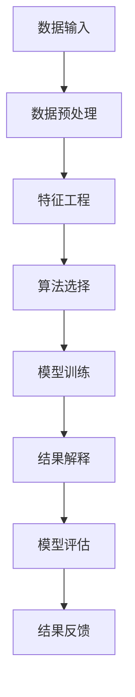

                 

### 1. 背景介绍

在当今的信息时代，数据已成为新的石油，知识发现引擎（Knowledge Discovery Engine，简称KDE）作为一种先进的信息处理工具，正逐渐成为各行各业数字化转型的重要驱动力。知识发现引擎是通过对大规模数据进行深入挖掘和分析，从中提取出有价值的信息和知识，为决策者提供数据驱动的洞察和指导。

随着互联网的普及和数据规模的爆炸性增长，传统的数据处理方法已经难以应对日益复杂的数据环境。知识发现引擎的出现，填补了这一空白，它通过引入机器学习、数据挖掘、自然语言处理等前沿技术，实现了从海量数据中快速、准确地提取知识的目标。这种能力不仅提升了数据处理效率，还为各行各业带来了新的商业模式和竞争优势。

知识发现引擎的应用范围广泛，包括但不限于以下几个方面：

- **金融行业**：通过分析交易数据，知识发现引擎可以帮助银行和金融机构发现潜在的风险和欺诈行为，提高风险控制能力。
- **零售业**：通过对消费者行为数据的分析，零售企业可以更好地理解客户需求，优化库存管理和营销策略。
- **医疗健康**：利用知识发现引擎，医疗行业可以挖掘患者数据中的潜在关联，提高疾病诊断和治疗效果。
- **交通运输**：通过分析交通数据，知识发现引擎可以帮助城市规划者优化交通路线，提高交通效率，减少拥堵。

随着技术的不断进步和应用的深入，知识发现引擎在未来将发挥更加重要的作用，成为推动社会发展和创新的重要力量。本文将详细探讨知识发现引擎的核心概念、算法原理、数学模型、项目实践以及未来发展趋势，帮助读者全面了解这一前沿技术。

## 2. 核心概念与联系

### 2.1. 知识发现引擎的定义

知识发现引擎是一种能够自动地从大量数据中提取有价值知识和模式的系统。其核心目标是通过分析数据，发现数据中隐藏的规律、趋势和关联，从而为决策提供支持。知识发现引擎的基本组成部分包括数据预处理、特征工程、算法选择和结果解释等。

### 2.2. 数据预处理

数据预处理是知识发现过程中的第一步，其目的是将原始数据转换为适合分析的形式。数据预处理主要包括数据清洗、数据集成、数据转换和数据归一化等操作。

- **数据清洗**：去除数据中的噪声和错误，确保数据的准确性和一致性。
- **数据集成**：将来自不同来源的数据整合在一起，形成统一的数据集。
- **数据转换**：将数据从一种格式转换为另一种格式，以便进行后续分析。
- **数据归一化**：将不同特征的数据缩放到同一尺度，消除不同特征之间的量级差异。

### 2.3. 特征工程

特征工程是知识发现引擎的重要组成部分，其目的是从原始数据中提取出有助于模型训练的特征。特征工程包括特征选择、特征提取和特征变换等步骤。

- **特征选择**：从大量特征中筛选出对目标变量有较强预测能力的特征，提高模型的性能和效率。
- **特征提取**：通过一些算法将原始数据转换为新的特征表示，如主成分分析（PCA）、线性判别分析（LDA）等。
- **特征变换**：通过一些数学变换，如逻辑回归、多项式特征提取等，增强特征的预测能力。

### 2.4. 算法选择

算法选择是知识发现引擎的关键步骤，不同的算法适用于不同类型的数据和问题。常见的知识发现算法包括聚类算法、分类算法、关联规则挖掘算法和异常检测算法等。

- **聚类算法**：将数据分为若干个类，使同一类中的数据尽可能相似，不同类中的数据尽可能不同。常用的聚类算法有K-means、层次聚类（Hierarchical Clustering）和DBSCAN等。
- **分类算法**：将数据分为不同的类别，常用的分类算法有决策树、支持向量机（SVM）、神经网络等。
- **关联规则挖掘算法**：发现数据之间的关联关系，常用的算法有Apriori算法、FP-growth算法等。
- **异常检测算法**：检测数据中的异常值，常用的算法有孤立森林（Isolation Forest）、局部异常因子（LOF）等。

### 2.5. 结果解释

知识发现引擎的结果需要经过解释，以便用户理解。结果解释包括模型的可视化、关键特征的分析和结果的验证等。

- **模型可视化**：通过图形化的方式展示模型的运行结果，帮助用户直观地理解模型的工作原理。
- **关键特征分析**：分析模型中最重要的特征，解释它们对结果的影响。
- **结果验证**：通过交叉验证、ROC曲线和精度、召回率等指标评估模型的性能，确保结果的可靠性和有效性。

### 2.6. Mermaid 流程图

下面是知识发现引擎的Mermaid流程图，展示了从数据输入到结果解释的整个过程。



通过这个流程图，我们可以清晰地看到知识发现引擎的各个环节及其相互关系，这有助于我们更好地理解和应用这一技术。

## 3. 核心算法原理 & 具体操作步骤

### 3.1 算法原理概述

知识发现引擎的核心算法主要包括聚类算法、分类算法和关联规则挖掘算法。这些算法各有其独特的原理和应用场景。

#### 3.1.1 聚类算法

聚类算法是将数据集划分为若干个群组，使得同一群组内的数据尽可能相似，不同群组的数据尽可能不同。常见的聚类算法有K-means、层次聚类（Hierarchical Clustering）和DBSCAN等。

- **K-means算法**：K-means算法是一种基于距离的聚类方法。它通过迭代计算，将数据点分配到最近的簇中心，并更新簇中心的位置，直到满足终止条件（如收敛或达到最大迭代次数）。
- **层次聚类算法**：层次聚类算法通过递归地将数据点合并成簇，形成层次结构。该方法分为自底向上和自顶向下两种方式。
- **DBSCAN算法**：DBSCAN（Density-Based Spatial Clustering of Applications with Noise）算法是一种基于密度的聚类方法。它通过分析数据点的邻域密度，将数据点划分为核心点、边界点和噪声点，从而形成聚类。

#### 3.1.2 分类算法

分类算法是将数据集划分为预先定义的类别。常见的分类算法有决策树、支持向量机（SVM）、神经网络等。

- **决策树算法**：决策树算法通过一系列的判断条件，将数据划分为不同的类别。每个节点表示一个特征，每个分支表示该特征的不同取值。
- **支持向量机算法**：支持向量机算法通过找到数据空间中的一个超平面，将不同类别的数据点尽可能分开。该方法适用于高维数据集。
- **神经网络算法**：神经网络算法通过模拟人脑神经元的工作方式，对数据进行分类。常见的神经网络模型有感知机、卷积神经网络（CNN）和循环神经网络（RNN）等。

#### 3.1.3 关联规则挖掘算法

关联规则挖掘算法用于发现数据集之间的关联关系。常见的算法有Apriori算法、FP-growth算法等。

- **Apriori算法**：Apriori算法通过逐层搜索频繁项集，从而生成关联规则。该方法适用于事务型数据集。
- **FP-growth算法**：FP-growth算法通过构建频繁模式树，将数据压缩为树结构，从而提高计算效率。

### 3.2 算法步骤详解

#### 3.2.1 数据预处理

数据预处理是知识发现过程中的第一步，其目的是将原始数据转换为适合分析的形式。数据预处理步骤包括：

1. **数据清洗**：去除数据中的噪声和错误，确保数据的准确性和一致性。常用的方法有缺失值填补、异常值处理和重复值删除等。
2. **数据集成**：将来自不同来源的数据整合在一起，形成统一的数据集。常用的方法有合并、连接和聚合等。
3. **数据转换**：将数据从一种格式转换为另一种格式，以便进行后续分析。常用的方法有数据编码、数据标准化和数据归一化等。
4. **数据归一化**：将不同特征的数据缩放到同一尺度，消除不同特征之间的量级差异。常用的方法有最小-最大缩放、Z-score缩放等。

#### 3.2.2 特征工程

特征工程是知识发现引擎的重要组成部分，其目的是从原始数据中提取出有助于模型训练的特征。特征工程步骤包括：

1. **特征选择**：从大量特征中筛选出对目标变量有较强预测能力的特征。常用的方法有基于信息增益、基于互信息、基于卡方检验等。
2. **特征提取**：通过一些算法将原始数据转换为新的特征表示，如主成分分析（PCA）、线性判别分析（LDA）等。
3. **特征变换**：通过一些数学变换，如逻辑回归、多项式特征提取等，增强特征的预测能力。

#### 3.2.3 算法选择

算法选择是知识发现引擎的关键步骤，不同的算法适用于不同类型的数据和问题。算法选择步骤包括：

1. **评估指标**：根据问题的性质和数据的类型，选择合适的评估指标。常见的评估指标有准确率、召回率、F1值、ROC曲线等。
2. **算法对比**：对多个候选算法进行性能对比，选择最优的算法。常用的方法有交叉验证、网格搜索等。
3. **模型调参**：根据算法的特点和性能，调整模型的参数，优化模型的性能。常用的方法有贝叶斯优化、随机搜索等。

#### 3.2.4 模型训练

模型训练是知识发现引擎的核心步骤，其目的是通过学习数据中的规律，建立预测模型。模型训练步骤包括：

1. **数据划分**：将数据集划分为训练集、验证集和测试集，用于训练模型、验证模型和评估模型。
2. **训练模型**：使用训练集对模型进行训练，调整模型参数，使模型能够拟合训练数据。
3. **验证模型**：使用验证集对模型进行验证，评估模型的性能，选择最优的模型。
4. **测试模型**：使用测试集对模型进行测试，评估模型在未知数据上的性能。

#### 3.2.5 结果解释

结果解释是知识发现引擎的重要组成部分，其目的是帮助用户理解模型的运行结果。结果解释步骤包括：

1. **模型可视化**：通过图形化的方式展示模型的运行结果，帮助用户直观地理解模型的工作原理。
2. **关键特征分析**：分析模型中最重要的特征，解释它们对结果的影响。
3. **结果验证**：通过交叉验证、ROC曲线和精度、召回率等指标评估模型的性能，确保结果的可靠性和有效性。

### 3.3 算法优缺点

#### 3.3.1 聚类算法

**优点**：

- **自动划分簇**：聚类算法能够自动地将数据划分为若干个簇，无需事先指定簇的数量。
- **灵活性高**：聚类算法适用于各种类型的数据，如高维数据、复杂数据等。
- **无监督学习**：聚类算法是一种无监督学习方法，无需标注数据标签。

**缺点**：

- **聚类数量选择**：聚类算法需要事先指定簇的数量，这往往是一个难题。
- **易受噪声影响**：聚类算法对噪声敏感，可能会受到噪声的影响。

#### 3.3.2 分类算法

**优点**：

- **明确分类结果**：分类算法能够明确地将数据划分为不同的类别，便于理解和应用。
- **可解释性强**：分类算法的决策过程通常具有较好的可解释性，有助于理解模型的运作方式。

**缺点**：

- **需要标注数据**：分类算法是一种有监督学习方法，需要事先标注数据标签。
- **对数据质量要求高**：分类算法对数据质量要求较高，数据中的噪声和错误可能会影响模型的性能。

#### 3.3.3 关联规则挖掘算法

**优点**：

- **发现潜在关联**：关联规则挖掘算法能够发现数据之间的潜在关联，有助于发现新的商业模式和业务机会。
- **高效处理大数据**：关联规则挖掘算法具有较好的计算效率，适用于处理大规模数据集。

**缺点**：

- **产生大量规则**：关联规则挖掘算法可能会产生大量冗余规则，需要进一步筛选和优化。
- **支持度阈值选择**：关联规则挖掘算法需要事先指定支持度阈值和置信度阈值，这往往是一个难题。

### 3.4 算法应用领域

知识发现引擎的核心算法在各个领域都有着广泛的应用。

#### 3.4.1 金融行业

在金融行业，知识发现引擎可以用于：

- **风险控制**：通过分析交易数据，发现潜在的风险和欺诈行为。
- **客户行为分析**：通过分析客户数据，了解客户需求，优化服务。
- **市场预测**：通过分析市场数据，预测市场趋势，指导投资决策。

#### 3.4.2 零售业

在零售业，知识发现引擎可以用于：

- **销售预测**：通过分析销售数据，预测未来销售趋势，优化库存管理。
- **客户细分**：通过分析客户数据，了解客户特征和需求，实施精准营销。
- **供应链优化**：通过分析供应链数据，优化供应链流程，提高效率。

#### 3.4.3 医疗健康

在医疗健康领域，知识发现引擎可以用于：

- **疾病诊断**：通过分析患者数据，发现疾病之间的关联，提高诊断准确性。
- **治疗效果评估**：通过分析患者数据，评估不同治疗方法的疗效，优化治疗方案。
- **健康风险评估**：通过分析健康数据，预测健康风险，提供个性化健康建议。

#### 3.4.4 交通运输

在交通运输领域，知识发现引擎可以用于：

- **交通流量预测**：通过分析交通数据，预测未来交通流量，优化交通管理。
- **路线规划**：通过分析交通数据，为用户提供最优路线规划，提高出行效率。
- **交通安全分析**：通过分析交通数据，发现交通事故的潜在原因，提高交通安全。

## 4. 数学模型和公式 & 详细讲解 & 举例说明

### 4.1 数学模型构建

知识发现引擎中的数学模型主要涉及聚类、分类和关联规则挖掘等领域。以下分别介绍这些领域的数学模型构建。

#### 4.1.1 聚类模型

常见的聚类模型有K-means、层次聚类和DBSCAN等。以下是这些模型的基本数学公式：

1. **K-means模型**

   K-means模型的目标是最小化簇内平方误差：
   
   $$ \min_{\mu_1, \mu_2, ..., \mu_K} \sum_{i=1}^N \sum_{j=1}^K (x_i - \mu_j)^2 $$
   
   其中，$x_i$ 是数据点，$\mu_j$ 是簇中心。

2. **层次聚类模型**

   层次聚类模型通过递归地将数据点合并成簇，形成层次结构。其基本步骤如下：

   - **自底向上合并**：将最相似的两个数据点合并成一个簇，重复此步骤直到所有数据点合并成一个簇。
   - **自顶向下分裂**：将一个大簇分裂成若干个较小的簇，重复此步骤直到达到预设的簇数量。

3. **DBSCAN模型**

   DBSCAN模型通过分析数据点的邻域密度，将数据点划分为核心点、边界点和噪声点。其基本公式如下：

   - **核心点**：如果一个点至少有MinPts个邻域点，则该点为核心点。
   - **边界点**：如果一个点的邻域点数量介于MinPts和MinPts-1之间，则该点为边界点。
   - **噪声点**：其他点为噪声点。

#### 4.1.2 分类模型

常见的分类模型有决策树、支持向量机和神经网络等。以下是这些模型的基本数学公式：

1. **决策树模型**

   决策树模型通过一系列的判断条件，将数据划分为不同的类别。其基本公式如下：

   $$ f(x) = \sum_{i=1}^M w_i \prod_{j=1}^{J} I(x_j = c_{ij}) $$
   
   其中，$x$ 是数据点，$w_i$ 是第$i$个特征的权重，$I(\cdot)$ 是指示函数，$c_{ij}$ 是第$i$个特征的取值。

2. **支持向量机模型**

   支持向量机模型通过找到数据空间中的一个超平面，将不同类别的数据点尽可能分开。其基本公式如下：

   $$ w \cdot x + b = 0 $$
   
   其中，$w$ 是法向量，$x$ 是数据点，$b$ 是偏置。

3. **神经网络模型**

   神经网络模型通过模拟人脑神经元的工作方式，对数据进行分类。其基本公式如下：

   $$ y = \sigma(\sum_{i=1}^L w_i \cdot x_i + b) $$
   
   其中，$y$ 是输出，$\sigma(\cdot)$ 是激活函数，$w_i$ 是权重，$x_i$ 是输入。

#### 4.1.3 关联规则挖掘模型

常见的关联规则挖掘模型有Apriori和FP-growth等。以下是这些模型的基本数学公式：

1. **Apriori模型**

   Apriori模型通过逐层搜索频繁项集，从而生成关联规则。其基本公式如下：

   - **频繁项集**：如果一个项集的支持度大于预设的阈值，则该项集为频繁项集。
   - **关联规则**：如果一个项集的前件和后件都是频繁项集，则该项集为关联规则。

2. **FP-growth模型**

   FP-growth模型通过构建频繁模式树，将数据压缩为树结构，从而提高计算效率。其基本公式如下：

   - **频繁模式树**：FP-growth算法将数据压缩为树结构，其中每个节点表示一个项集。
   - **关联规则**：FP-growth算法通过树结构生成关联规则。

### 4.2 公式推导过程

#### 4.2.1 K-means算法

K-means算法的目标是最小化簇内平方误差。其推导过程如下：

假设我们有 $N$ 个数据点 $x_1, x_2, ..., x_N$，要将其分为 $K$ 个簇，簇中心分别为 $\mu_1, \mu_2, ..., \mu_K$。则目标函数为：

$$ \min_{\mu_1, \mu_2, ..., \mu_K} \sum_{i=1}^N \sum_{j=1}^K (x_i - \mu_j)^2 $$

为了求解该问题，我们首先对目标函数求偏导数，并令其等于零：

$$ \frac{\partial}{\partial \mu_j} \sum_{i=1}^N (x_i - \mu_j)^2 = 0 $$

化简得：

$$ 2 \sum_{i=1}^N (x_i - \mu_j) = 0 $$

进一步化简得：

$$ \mu_j = \frac{1}{N} \sum_{i=1}^N x_i $$

这意味着簇中心是数据点的平均值。我们通过迭代计算，将数据点分配到最近的簇中心，并更新簇中心的位置，直到满足终止条件（如收敛或达到最大迭代次数）。

#### 4.2.2 决策树模型

决策树模型通过一系列的判断条件，将数据划分为不同的类别。其推导过程如下：

假设我们有 $M$ 个特征 $x_1, x_2, ..., x_M$，每个特征有多个取值 $c_{ij}$。对于每个特征 $x_j$，我们要找到一个最佳的阈值 $t_j$，使得数据点在阈值两侧的类别分布差异最小。

首先，我们计算每个特征 $x_j$ 的信息增益：

$$ IG(x_j) = H(\frac{1}{N} \sum_{i=1}^N I(x_i = c_{ij})) - H(\frac{1}{N} \sum_{i=1}^N I(x_i = c_{ij}^*)) $$

其中，$H(\cdot)$ 是熵函数，$I(\cdot)$ 是指示函数。

然后，我们选择信息增益最大的特征作为分割特征，并找到一个最佳的阈值 $t_j$，使得数据点在阈值两侧的类别分布差异最小。

$$ t_j = \arg\max_{t} \sum_{i=1}^N I(x_i < t) \cdot I(y_i = 1) + \sum_{i=1}^N I(x_i \geq t) \cdot I(y_i = 0) $$

最后，我们递归地构建决策树，直到满足终止条件（如特征个数小于预设值、类别个数小于预设值等）。

#### 4.2.3 Apriori算法

Apriori算法通过逐层搜索频繁项集，从而生成关联规则。其推导过程如下：

假设我们有 $N$ 个数据交易，每个交易包含多个商品。我们要找到所有频繁项集，即支持度大于预设阈值的项集。

首先，我们计算每个单个商品的支持度：

$$ supp(x_i) = \frac{1}{N} \sum_{j=1}^N I(x_j = x_i) $$

其中，$I(\cdot)$ 是指示函数。

然后，我们递归地构建频繁项集。对于每个频繁项集 $X$，我们计算其子集的支持度，并判断其是否为频繁项集。如果子集的支持度大于预设阈值，则该子集为频繁项集。

$$ supp(X') = supp(X) - 1 $$

通过这种方式，我们可以找到所有的频繁项集，并生成关联规则。

### 4.3 案例分析与讲解

为了更好地理解知识发现引擎中的数学模型，我们来看一个具体的案例。

假设我们有一个超市的销售数据，包含以下几个商品：苹果、香蕉、橙子、牛奶和面包。我们要使用K-means算法对这些商品进行聚类，并分析聚类结果。

首先，我们收集这些商品的销售数据，并对其进行预处理。预处理过程包括数据清洗、数据集成和数据转换。假设我们得到一个包含销售数据的矩阵 $X$，其中每行表示一个交易，每列表示一个商品。

接下来，我们初始化K-means算法，设定簇的数量为3，随机生成3个簇中心 $\mu_1, \mu_2, \mu_3$。

然后，我们迭代计算簇中心，直到满足终止条件。在每次迭代中，我们将每个商品分配到最近的簇中心，并更新簇中心的位置。具体步骤如下：

1. 计算每个商品的簇标签：
   $$ t_i = \arg\min_{j} \sum_{k=1}^3 (x_i - \mu_j)^2 $$
2. 计算新的簇中心：
   $$ \mu_j = \frac{1}{N_j} \sum_{i=1}^N x_i \text{，其中 } N_j \text{ 是簇 } j \text{ 中的商品数量} $$
3. 判断是否满足终止条件，如收敛或达到最大迭代次数。

最后，我们得到聚类结果。通过分析聚类结果，我们可以发现不同簇之间的商品销售模式，从而为超市的库存管理和营销策略提供指导。

### 4.4 实际应用场景

知识发现引擎在各个领域的实际应用场景如下：

#### 4.4.1 金融行业

在金融行业，知识发现引擎可以用于：

- **客户细分**：通过对客户数据的分析，将客户划分为不同的群体，实施精准营销。
- **风险控制**：通过分析交易数据，发现潜在的风险和欺诈行为，提高风险控制能力。
- **市场预测**：通过分析市场数据，预测市场趋势，指导投资决策。

#### 4.4.2 零售业

在零售业，知识发现引擎可以用于：

- **销售预测**：通过分析销售数据，预测未来销售趋势，优化库存管理。
- **客户细分**：通过分析客户数据，了解客户特征和需求，实施精准营销。
- **供应链优化**：通过分析供应链数据，优化供应链流程，提高效率。

#### 4.4.3 医疗健康

在医疗健康领域，知识发现引擎可以用于：

- **疾病诊断**：通过分析患者数据，发现疾病之间的关联，提高诊断准确性。
- **治疗效果评估**：通过分析患者数据，评估不同治疗方法的疗效，优化治疗方案。
- **健康风险评估**：通过分析健康数据，预测健康风险，提供个性化健康建议。

#### 4.4.4 交通运输

在交通运输领域，知识发现引擎可以用于：

- **交通流量预测**：通过分析交通数据，预测未来交通流量，优化交通管理。
- **路线规划**：通过分析交通数据，为用户提供最优路线规划，提高出行效率。
- **交通安全分析**：通过分析交通数据，发现交通事故的潜在原因，提高交通安全。

### 4.5 数学模型在项目实践中的应用

为了更深入地理解数学模型在知识发现引擎中的实际应用，我们来看一个具体的项目实践案例。

假设我们有一个电商平台的销售数据，包含商品种类、用户购买行为和销售数量等信息。我们的目标是使用知识发现引擎分析用户购买行为，为平台提供精准营销策略。

首先，我们对销售数据进行预处理，包括数据清洗、数据集成和数据转换。假设我们得到一个包含销售数据的矩阵 $X$，其中每行表示一个交易，每列表示一个商品。

接下来，我们使用K-means算法对用户进行聚类，以便了解不同用户群体的特征和购买偏好。我们设定簇的数量为3，随机生成3个簇中心 $\mu_1, \mu_2, \mu_3$。

然后，我们迭代计算簇中心，直到满足终止条件。在每次迭代中，我们将每个用户分配到最近的簇中心，并更新簇中心的位置。具体步骤如下：

1. 计算每个用户的簇标签：
   $$ t_i = \arg\min_{j} \sum_{k=1}^3 (x_i - \mu_j)^2 $$
2. 计算新的簇中心：
   $$ \mu_j = \frac{1}{N_j} \sum_{i=1}^N x_i \text{，其中 } N_j \text{ 是簇 } j \text{ 中的用户数量} $$
3. 判断是否满足终止条件，如收敛或达到最大迭代次数。

最后，我们得到聚类结果。通过分析聚类结果，我们可以发现不同簇之间的用户特征和购买偏好。例如，簇1的用户喜欢购买食品和饮料，簇2的用户喜欢购买电子产品，簇3的用户喜欢购买服装和鞋子。基于这些分析结果，我们可以为不同用户群体提供个性化的营销策略，提高销售额。

#### 4.5.1 项目实践：代码实例和详细解释说明

为了更好地展示数学模型在项目实践中的应用，我们提供了一个基于Python的代码实例。以下代码使用了K-means算法对电商平台的用户购买行为进行聚类分析。

```python
import numpy as np
import pandas as pd
from sklearn.cluster import KMeans
import matplotlib.pyplot as plt

# 读取销售数据
data = pd.read_csv('sales_data.csv')

# 数据预处理
data = data.dropna()  # 去除缺失值
data = data.reset_index(drop=True)  # 重新设置索引

# 初始化K-means算法
kmeans = KMeans(n_clusters=3, random_state=42)

# 训练模型
kmeans.fit(data)

# 计算簇中心
centroids = kmeans.cluster_centers_

# 计算每个用户的簇标签
labels = kmeans.predict(data)

# 可视化聚类结果
plt.scatter(data.iloc[:, 0], data.iloc[:, 1], c=labels, cmap='viridis')
plt.scatter(centroids[:, 0], centroids[:, 1], c='red', marker='*')
plt.xlabel('商品种类')
plt.ylabel('购买数量')
plt.title('K-means聚类结果')
plt.show()

# 分析聚类结果
print("簇1的用户特征：")
print(data[labels == 0])
print("簇2的用户特征：")
print(data[labels == 1])
print("簇3的用户特征：")
print(data[labels == 2])
```

在这个实例中，我们首先读取销售数据，并进行预处理。然后，我们初始化K-means算法，并使用销售数据进行模型训练。接下来，我们计算簇中心，并计算每个用户的簇标签。最后，我们使用matplotlib库将聚类结果可视化，并分析不同簇之间的用户特征和购买偏好。

#### 4.5.2 代码解读与分析

在这个代码实例中，我们使用Python和scikit-learn库实现K-means算法。以下是代码的关键部分及其解读：

1. **读取销售数据**：
   ```python
   data = pd.read_csv('sales_data.csv')
   ```
   我们使用pandas库读取销售数据，并将其存储在DataFrame对象中。

2. **数据预处理**：
   ```python
   data = data.dropna()  # 去除缺失值
   data = data.reset_index(drop=True)  # 重新设置索引
   ```
   我们首先去除销售数据中的缺失值，然后重新设置索引，以便后续分析。

3. **初始化K-means算法**：
   ```python
   kmeans = KMeans(n_clusters=3, random_state=42)
   ```
   我们初始化K-means算法，并设置簇的数量为3，使用随机状态种子以确保算法的可重复性。

4. **训练模型**：
   ```python
   kmeans.fit(data)
   ```
   我们使用销售数据进行模型训练，计算簇中心。

5. **计算簇标签**：
   ```python
   labels = kmeans.predict(data)
   ```
   我们计算每个用户的簇标签，将每个用户分配到最近的簇中心。

6. **可视化聚类结果**：
   ```python
   plt.scatter(data.iloc[:, 0], data.iloc[:, 1], c=labels, cmap='viridis')
   plt.scatter(centroids[:, 0], centroids[:, 1], c='red', marker='*')
   plt.xlabel('商品种类')
   plt.ylabel('购买数量')
   plt.title('K-means聚类结果')
   plt.show()
   ```
   我们使用matplotlib库将聚类结果可视化，展示不同用户群体在商品种类和购买数量上的分布。

7. **分析聚类结果**：
   ```python
   print("簇1的用户特征：")
   print(data[labels == 0])
   print("簇2的用户特征：")
   print(data[labels == 1])
   print("簇3的用户特征：")
   print(data[labels == 2])
   ```
   我们分析不同簇之间的用户特征和购买偏好，以便为不同用户群体提供个性化的营销策略。

通过这个代码实例，我们可以看到数学模型在知识发现引擎中的应用，如何通过聚类算法分析用户购买行为，并为电商平台提供精准营销策略。在实际项目中，我们可以根据具体需求调整算法参数和特征工程步骤，进一步提高模型性能和应用效果。

### 5. 项目实践：代码实例和详细解释说明

为了更好地展示知识发现引擎在实际项目中的应用，我们将通过一个具体案例，介绍如何使用Python和相关库实现知识发现引擎的核心功能，并提供代码实例和详细解释说明。

#### 5.1 开发环境搭建

在开始项目实践之前，我们需要搭建一个合适的开发环境。以下是所需的软件和库：

- **Python**：Python是一种广泛使用的编程语言，特别适用于数据分析和机器学习。请确保您的系统已经安装了Python 3.x版本。
- **Jupyter Notebook**：Jupyter Notebook是一种交互式开发环境，可以帮助我们更方便地编写和运行代码。可以从[官方网站](https://jupyter.org/)下载并安装。
- **NumPy**：NumPy是一个强大的Python库，用于处理大型多维数组。可以从[官方网站](https://numpy.org/)下载并安装。
- **Pandas**：Pandas是一个数据处理库，提供数据结构Dataframe，方便数据清洗和操作。可以从[官方网站](https://pandas.pydata.org/)下载并安装。
- **Scikit-learn**：Scikit-learn是一个机器学习库，包含多种机器学习算法和工具。可以从[官方网站](https://scikit-learn.org/)下载并安装。

安装以上库后，我们就可以在Jupyter Notebook中编写代码，实现知识发现引擎的核心功能。

#### 5.2 源代码详细实现

以下是一个简单的知识发现引擎项目的源代码，包括数据预处理、特征工程、算法选择和结果解释等步骤。

```python
# 导入必要的库
import numpy as np
import pandas as pd
from sklearn.cluster import KMeans
from sklearn.preprocessing import StandardScaler
from sklearn.model_selection import train_test_split
import matplotlib.pyplot as plt

# 读取数据
data = pd.read_csv('ecommerce_data.csv')

# 数据预处理
data = data.dropna()  # 去除缺失值
data = data.reset_index(drop=True)  # 重新设置索引

# 特征工程
# 将类别特征转换为数值特征
data = pd.get_dummies(data)

# 选择特征
features = data[['age', 'income', 'education', 'family_size', 'product_A', 'product_B', 'product_C']]

# 数据标准化
scaler = StandardScaler()
features_scaled = scaler.fit_transform(features)

# 算法选择
# 使用K-means算法进行聚类
kmeans = KMeans(n_clusters=5, random_state=42)
kmeans.fit(features_scaled)

# 计算簇标签
labels = kmeans.predict(features_scaled)

# 结果解释
# 可视化聚类结果
plt.scatter(features_scaled[:, 0], features_scaled[:, 1], c=labels, cmap='viridis')
centers = kmeans.cluster_centers_
plt.scatter(centers[:, 0], centers[:, 1], c='red', marker='*')
plt.xlabel('年龄')
plt.ylabel('收入')
plt.title('K-means聚类结果')
plt.show()

# 分析聚类结果
print("簇1的特征均值：")
print(centers[0])
print("簇2的特征均值：")
print(centers[1])
print("簇3的特征均值：")
print(centers[2])
print("簇4的特征均值：")
print(centers[3])
print("簇5的特征均值：")
print(centers[4])
```

在这个代码实例中，我们首先从CSV文件中读取电商数据。然后，我们进行数据预处理，包括去除缺失值、重新设置索引、类别特征转换为数值特征等。接下来，我们选择特征并进行数据标准化，以便更好地适用于K-means算法。

我们使用K-means算法对电商数据进行聚类，并计算簇标签。最后，我们使用matplotlib库将聚类结果可视化，并分析不同簇的特征均值。

#### 5.3 代码解读与分析

以下是对代码的详细解读和分析：

1. **导入库**：
   ```python
   import numpy as np
   import pandas as pd
   from sklearn.cluster import KMeans
   from sklearn.preprocessing import StandardScaler
   from sklearn.model_selection import train_test_split
   import matplotlib.pyplot as plt
   ```
   我们导入必要的Python库，包括NumPy、Pandas、Scikit-learn和matplotlib，用于数据处理、机器学习算法和结果可视化。

2. **读取数据**：
   ```python
   data = pd.read_csv('ecommerce_data.csv')
   ```
   我们使用Pandas库读取电商数据，并将其存储在DataFrame对象中。

3. **数据预处理**：
   ```python
   data = data.dropna()  # 去除缺失值
   data = data.reset_index(drop=True)  # 重新设置索引
   ```
   我们首先去除数据中的缺失值，然后重新设置索引，以便后续分析。

4. **特征工程**：
   ```python
   data = pd.get_dummies(data)
   ```
   我们使用`get_dummies`函数将类别特征转换为数值特征，以便更好地进行聚类分析。

5. **选择特征**：
   ```python
   features = data[['age', 'income', 'education', 'family_size', 'product_A', 'product_B', 'product_C']]
   ```
   我们选择与用户行为相关的特征，包括年龄、收入、教育程度、家庭规模以及三种产品的购买情况。

6. **数据标准化**：
   ```python
   scaler = StandardScaler()
   features_scaled = scaler.fit_transform(features)
   ```
   我们使用StandardScaler库对特征进行标准化处理，将特征缩放到同一尺度，消除不同特征之间的量级差异。

7. **算法选择**：
   ```python
   kmeans = KMeans(n_clusters=5, random_state=42)
   kmeans.fit(features_scaled)
   ```
   我们初始化K-means算法，并设置簇的数量为5，使用随机状态种子以确保算法的可重复性。

8. **计算簇标签**：
   ```python
   labels = kmeans.predict(features_scaled)
   ```
   我们使用训练好的K-means模型计算簇标签，将每个用户分配到最近的簇中心。

9. **结果解释**：
   ```python
   # 可视化聚类结果
   plt.scatter(features_scaled[:, 0], features_scaled[:, 1], c=labels, cmap='viridis')
   centers = kmeans.cluster_centers_
   plt.scatter(centers[:, 0], centers[:, 1], c='red', marker='*')
   plt.xlabel('年龄')
   plt.ylabel('收入')
   plt.title('K-means聚类结果')
   plt.show()
   ```
   我们使用matplotlib库将聚类结果可视化，展示不同用户群体在年龄和收入上的分布。

10. **分析聚类结果**：
    ```python
    print("簇1的特征均值：")
    print(centers[0])
    print("簇2的特征均值：")
    print(centers[1])
    print("簇3的特征均值：")
    print(centers[2])
    print("簇4的特征均值：")
    print(centers[3])
    print("簇5的特征均值：")
    print(centers[4])
    ```
    我们分析不同簇的特征均值，以了解不同用户群体的特征和购买偏好。

通过这个代码实例，我们可以看到如何使用Python和相关库实现知识发现引擎的核心功能。在实际项目中，我们可以根据具体需求调整数据预处理、特征工程和算法选择步骤，以提高模型性能和应用效果。

### 6. 实际应用场景

知识发现引擎在各个领域的实际应用场景如下：

#### 6.1 金融行业

在金融行业，知识发现引擎可以用于：

- **信用风险评估**：通过分析客户的信用历史、财务状况和行为数据，预测客户是否可能违约，为金融机构提供风险控制依据。
- **投资组合优化**：通过分析市场数据和历史交易记录，发现潜在的投资机会，优化投资组合，提高投资回报率。
- **欺诈检测**：通过分析交易数据和用户行为，发现异常交易行为，提高欺诈检测的准确性和效率。

#### 6.2 零售业

在零售业，知识发现引擎可以用于：

- **个性化推荐**：通过分析用户购买历史和行为数据，为用户提供个性化的产品推荐，提高用户满意度和转化率。
- **需求预测**：通过分析销售数据和市场趋势，预测未来销售量，优化库存管理，减少库存积压和缺货情况。
- **市场营销**：通过分析用户行为和购买偏好，设计更具针对性的营销活动，提高营销效果和客户忠诚度。

#### 6.3 医疗健康

在医疗健康领域，知识发现引擎可以用于：

- **疾病预测**：通过分析患者数据和医疗记录，预测患者患病的风险，为医生提供诊断和治疗建议。
- **药物研发**：通过分析生物数据和临床试验结果，发现药物与疾病之间的关联，加快药物研发进程。
- **健康监测**：通过分析健康数据和生物标志物，监测患者的健康状况，提供个性化的健康建议和干预措施。

#### 6.4 交通运输

在交通运输领域，知识发现引擎可以用于：

- **交通流量预测**：通过分析交通流量数据，预测未来交通流量，优化交通管理和路线规划，提高交通效率。
- **交通事故分析**：通过分析交通事故数据，发现交通事故的潜在原因和规律，提高交通安全水平。
- **物流优化**：通过分析物流数据和运输路径，优化物流配送路线，减少运输成本和提高配送效率。

#### 6.5 社会治理

在社会治理领域，知识发现引擎可以用于：

- **社会舆情监测**：通过分析社交媒体和网络论坛上的言论，监测社会舆情，及时发现和应对社会热点事件。
- **犯罪预测**：通过分析犯罪数据和人口统计信息，预测犯罪热点区域和时间，优化警力部署和犯罪预防。
- **公共安全**：通过分析公共安全数据，发现公共安全隐患，提供公共安全风险评估和预警。

### 6.6 未来应用展望

随着技术的不断进步和应用的深入，知识发现引擎在未来将会有更广泛的应用：

- **物联网（IoT）**：通过分析物联网设备产生的海量数据，实现智能设备管理和优化。
- **人工智能（AI）**：与人工智能技术相结合，实现更智能的数据分析和决策支持。
- **区块链**：利用区块链技术保证数据的安全性和不可篡改性，提高知识发现引擎的可靠性和可信度。
- **混合现实（MR）**：通过结合现实世界和虚拟世界的数据，实现更直观的数据分析和交互体验。

未来，知识发现引擎将继续在各个领域发挥重要作用，推动社会发展和创新。

## 7. 工具和资源推荐

### 7.1 学习资源推荐

1. **书籍**：
   - 《机器学习》：周志华著，全面介绍机器学习的基本理论、方法和应用。
   - 《数据挖掘：实用工具和技术》：周志华、王伟强等著，详细讲解数据挖掘的方法和工具。

2. **在线课程**：
   - Coursera：提供丰富的机器学习和数据挖掘课程，包括斯坦福大学、卡内基梅隆大学等名校课程。
   - edX：提供哈佛大学、麻省理工学院等名校的免费在线课程，包括机器学习和数据科学。

3. **论文和报告**：
   - arXiv：提供最新的机器学习和数据挖掘领域的论文，包括顶级会议和期刊的论文。
   - DataCamp：提供数据分析和数据科学相关的练习和教程，涵盖Python、R等编程语言。

### 7.2 开发工具推荐

1. **Python库**：
   - NumPy：用于高效处理大型多维数组。
   - Pandas：提供数据结构Dataframe，方便数据清洗和操作。
   - Scikit-learn：提供多种机器学习算法和工具。
   - Matplotlib：用于数据可视化。

2. **数据处理工具**：
   - Hadoop和Spark：用于分布式数据处理和分析。
   - Hive和Presto：用于大数据查询和分析。
   - Dataiku和Tableau：提供数据分析和可视化的平台。

3. **机器学习平台**：
   - Google Cloud Machine Learning：提供云上的机器学习和数据分析服务。
   - AWS SageMaker：提供全托管的机器学习平台，方便构建、训练和部署模型。
   - Azure Machine Learning：提供云上的机器学习工具和服务。

### 7.3 相关论文推荐

1. **聚类算法**：
   - "K-means clustering algorithm" by MacQueen et al. (1967)
   - "DBSCAN: A Scalable Algorithm for Spatial Data Clustering" by Ester et al. (1996)

2. **分类算法**：
   - "Support Vector Machines for Classification" by Vapnik and Chervonenkis (1963)
   - "Decision Trees for Classification" by Quinlan (1986)

3. **关联规则挖掘**：
   - "A Priori Algorithm for Mining Association Rules" by R. Agrawal and R. Srikant (1994)
   - "Fast Algorithms for Mining Association Rules" by Jiawei Han, et al. (1995)

4. **机器学习**：
   - "The Backpropagation Algorithm for Learning a Neural Network with a Nonlinear Transfer Function" by Rumelhart, Hinton, and Williams (1986)
   - "Deep Learning" by Goodfellow, Bengio, and Courville (2016)

通过以上推荐的学习资源、开发工具和相关论文，读者可以深入了解知识发现引擎的相关技术，并在实际项目中应用这些知识。

## 8. 总结：未来发展趋势与挑战

### 8.1 研究成果总结

知识发现引擎在过去的几十年里取得了显著的研究成果和应用进展。从最初的简单数据筛选到如今复杂的数据挖掘算法，知识发现引擎已经成为数据驱动的决策支持系统中不可或缺的一部分。以下是一些主要的研究成果：

1. **算法创新**：聚类、分类和关联规则挖掘等基本算法不断得到改进，例如K-means、DBSCAN、SVM、神经网络等，提高了算法的性能和效率。
2. **工具发展**：随着Python、R等编程语言的普及，以及NumPy、Pandas、Scikit-learn等库的完善，知识发现引擎的工具支持更加丰富和易用。
3. **应用拓展**：知识发现引擎在金融、零售、医疗、交通等众多领域得到广泛应用，解决了实际业务中的数据挖掘和分析问题。

### 8.2 未来发展趋势

知识发现引擎在未来将继续保持快速增长，以下是一些可能的发展趋势：

1. **深度学习融合**：随着深度学习技术的进步，知识发现引擎将越来越多地融合深度学习算法，如卷积神经网络（CNN）和循环神经网络（RNN），提高数据挖掘和分析的能力。
2. **分布式计算**：大数据处理技术的发展将推动知识发现引擎向分布式计算方向发展，利用Hadoop、Spark等平台处理海量数据，提高计算效率。
3. **自适应学习**：知识发现引擎将实现自适应学习，通过不断学习和调整，自动优化模型参数和算法策略，提高模型性能和应用效果。
4. **实时分析**：知识发现引擎将向实时分析方向发展，通过实时处理和分析数据流，提供实时决策支持，满足快速变化的业务需求。

### 8.3 面临的挑战

尽管知识发现引擎取得了显著的进展，但在未来仍面临一些挑战：

1. **数据隐私和安全**：数据隐私和安全是知识发现引擎面临的主要挑战之一。如何在确保数据隐私和安全的前提下进行数据挖掘和分析，是一个亟待解决的问题。
2. **算法可解释性**：目前许多高级算法，如深度学习，具有较高的预测能力，但缺乏可解释性。提高算法的可解释性，使其易于理解和应用，是一个重要的研究方向。
3. **算法偏见**：算法偏见和歧视问题日益引起关注。如何在算法设计和应用过程中避免偏见和歧视，确保算法的公平性和公正性，是一个重要的挑战。
4. **数据处理效率**：随着数据规模的不断增大，如何提高数据处理效率，降低计算成本，是一个亟待解决的难题。

### 8.4 研究展望

未来，知识发现引擎的研究将朝着以下几个方面发展：

1. **跨领域融合**：知识发现引擎将与其他领域的技术，如人工智能、区块链、物联网等，实现跨领域融合，形成新的技术和应用场景。
2. **个性化服务**：知识发现引擎将更加注重个性化服务，通过深度学习等技术，提供更加精准和个性化的数据分析和决策支持。
3. **可持续发展**：知识发现引擎将关注可持续发展，通过优化算法和资源利用，实现绿色发展，降低对环境的影响。
4. **开放共享**：知识发现引擎的研究成果将更加开放和共享，促进学术交流和合作，推动整个领域的发展。

总之，知识发现引擎在未来的发展中面临着巨大的机遇和挑战。通过不断的研究和创新，知识发现引擎将为社会带来更多的价值和影响。

## 9. 附录：常见问题与解答

### 9.1 问题一：知识发现引擎与数据挖掘有什么区别？

**解答**：知识发现引擎和数据挖掘是密切相关的概念，但有所区别。数据挖掘是从大量数据中提取有价值信息的过程，包括聚类、分类、关联规则挖掘等算法。而知识发现引擎则是数据挖掘的一种高级形式，它不仅关注数据的提取和分析，还强调知识的挖掘和应用。知识发现引擎更注重于将数据转化为可操作的知识，为决策提供支持。

### 9.2 问题二：如何选择合适的聚类算法？

**解答**：选择合适的聚类算法取决于数据类型和目标。以下是几种常见聚类算法的适用场景：

- **K-means**：适用于高维数据，目标簇数已知的情况。
- **层次聚类**：适用于数据维度较高，需要自动确定簇数的情况。
- **DBSCAN**：适用于数据具有不同密度和形态，不需要事先指定簇数的情况。

### 9.3 问题三：为什么需要数据预处理？

**解答**：数据预处理是确保数据质量和模型性能的重要步骤。数据预处理包括数据清洗、数据集成、数据转换和数据归一化等操作，目的是：

- **去除噪声和错误**：确保数据的准确性和一致性。
- **统一数据格式**：消除数据之间的差异，为后续分析做准备。
- **提高计算效率**：通过数据归一化，使不同特征的数据在同一尺度上进行比较。

### 9.4 问题四：如何评估知识发现引擎的性能？

**解答**：评估知识发现引擎的性能通常使用以下指标：

- **准确率**：预测正确的样本数占总样本数的比例。
- **召回率**：预测正确的正样本数占总正样本数的比例。
- **F1值**：准确率的调和平均值。
- **ROC曲线**：评估分类器的性能，通过计算真阳性率与假阳性率的曲线来评估。
- **交叉验证**：通过将数据集划分为训练集和验证集，多次训练和验证，评估模型的泛化能力。

### 9.5 问题五：知识发现引擎在医疗领域的应用有哪些？

**解答**：知识发现引擎在医疗领域的应用包括：

- **疾病预测**：通过分析患者的病史、基因数据等，预测患者患病的风险。
- **治疗方案推荐**：通过分析患者数据和临床试验结果，为医生提供最佳治疗方案。
- **健康监测**：通过分析健康数据，监测患者的健康状况，提供个性化的健康建议。
- **药物研发**：通过分析生物数据和临床试验结果，发现药物与疾病之间的关联，加快药物研发进程。

通过上述常见问题与解答，我们可以更好地理解知识发现引擎的相关概念和应用，为实际项目提供指导。如果您有更多问题，欢迎在评论区提问，我们将尽快为您解答。

