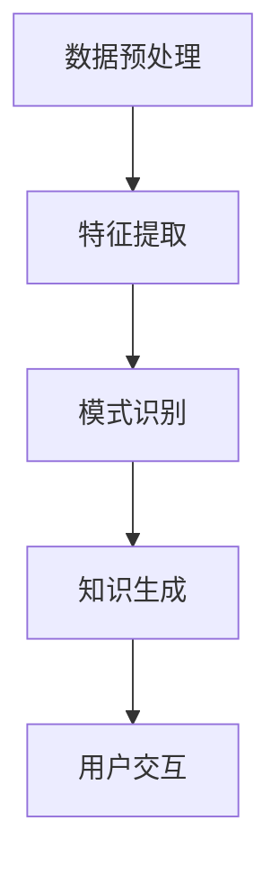

                 

  
## 1. 背景介绍

在当今信息爆炸的时代，数据无处不在，然而如何从海量数据中提取有价值的信息和知识，成为了企业和研究机构面临的巨大挑战。传统的数据挖掘技术虽然能够处理结构化数据，但面对非结构化数据，如文本、图像、音频等，显得力不从心。这时，知识发现引擎（Knowledge Discovery Engine，简称KDE）应运而生。

知识发现引擎是一种高级的自动化数据挖掘工具，它能够从大量的原始数据中自动识别模式，生成新的知识和信息。其核心目标是实现对复杂数据的高效处理，为用户提供有价值的洞察和洞见。知识发现引擎的应用场景广泛，包括金融市场分析、医疗诊断、市场营销、社会网络分析等。

本文将详细介绍知识发现引擎的核心概念、原理、算法、数学模型及其在实际项目中的应用，旨在为广大数据科学爱好者、开发者和研究者提供一份全面、深入的指南。通过阅读本文，您将了解到：

1. 知识发现引擎的背景和重要性；
2. 知识发现引擎的核心概念和架构；
3. 知识发现引擎的核心算法原理和具体操作步骤；
4. 知识发现引擎在实际项目中的应用案例；
5. 知识发现引擎的未来发展趋势和应用展望。

## 2. 核心概念与联系

### 2.1 知识发现引擎的定义

知识发现引擎是一种自动化数据挖掘工具，旨在从大规模数据集中提取出潜在的有价值知识和信息。它通过运用各种算法和技术，对数据进行预处理、特征提取、模式识别等步骤，最终生成新的知识和信息。

### 2.2 知识发现引擎的核心概念

1. **数据集（Dataset）**：知识发现引擎处理的数据源，可以是结构化数据、半结构化数据或非结构化数据。
2. **模式（Pattern）**：从数据集中识别出的具有特定意义的信息片段，可以是数值、文本、图像等。
3. **知识（Knowledge）**：通过知识发现过程生成的新的、有价值的洞察和洞见，可用于辅助决策、指导行动等。
4. **算法（Algorithm）**：知识发现引擎的核心组成部分，负责处理数据、提取模式和生成知识。

### 2.3 知识发现引擎的架构

知识发现引擎的架构通常包括以下几个关键模块：

1. **数据预处理模块**：负责对原始数据进行清洗、转换、归一化等操作，为后续处理提供高质量的输入数据。
2. **特征提取模块**：负责从数据集中提取出具有代表性的特征，用于模式识别和知识生成。
3. **模式识别模块**：负责从特征数据中识别出潜在的模式，如聚类、分类、关联规则等。
4. **知识生成模块**：负责将识别出的模式转化为有价值的知识和信息，如生成报告、构建决策树等。
5. **用户交互模块**：负责与用户进行交互，收集用户反馈，调整和优化知识发现过程。

### 2.4 Mermaid 流程图

以下是一个简化的知识发现引擎的 Mermaid 流程图，展示了各模块之间的联系：



在上图中，数据预处理模块（A）将原始数据清洗和转换后，传递给特征提取模块（B）。特征提取模块提取出具有代表性的特征，传递给模式识别模块（C）。模式识别模块识别出潜在的模式，传递给知识生成模块（D）。知识生成模块将模式转化为有价值的知识和信息，最终通过用户交互模块（E）与用户进行交互，反馈和优化整个过程。

## 3. 核心算法原理 & 具体操作步骤

### 3.1 算法原理概述

知识发现引擎的核心算法包括数据预处理、特征提取、模式识别和知识生成。以下将分别介绍这些算法的原理。

#### 3.1.1 数据预处理

数据预处理是知识发现过程中的第一步，其目标是去除噪声、填充缺失值、转换数据类型等，为后续处理提供高质量的数据。常用的数据预处理方法包括：

1. **去噪（Noise Removal）**：通过去除数据中的噪声，提高数据质量。常用的去噪方法有均值滤波、中值滤波等。
2. **填充缺失值（Missing Value Imputation）**：对于缺失的数据，通过一定的策略进行填充，常见的填充方法有均值填充、中值填充等。
3. **数据转换（Data Transformation）**：将数据从一种形式转换为另一种形式，如归一化、标准化等，以便后续处理。

#### 3.1.2 特征提取

特征提取是从原始数据中提取出具有代表性的特征，用于模式识别和知识生成。常用的特征提取方法包括：

1. **特征选择（Feature Selection）**：通过评估特征的重要性，筛选出最有用的特征，减少数据维度。
2. **特征变换（Feature Transformation）**：通过变换特征的空间，提高特征的表达能力。常用的变换方法有主成分分析（PCA）、线性判别分析（LDA）等。
3. **特征工程（Feature Engineering）**：通过设计和构造新的特征，提高数据的质量和表达能力。特征工程是知识发现过程中非常重要的一步，需要根据具体问题和数据特点进行。

#### 3.1.3 模式识别

模式识别是从特征数据中识别出潜在的模式，如聚类、分类、关联规则等。常用的模式识别方法包括：

1. **聚类（Clustering）**：将数据划分为若干个类别，使得同一类别内的数据相似度较高，不同类别间的数据相似度较低。常用的聚类算法有K-means、层次聚类等。
2. **分类（Classification）**：根据已有数据对未知数据进行分类，常用的分类算法有决策树、支持向量机（SVM）等。
3. **关联规则（Association Rule Learning）**：从数据中发现物品之间的关联关系，常用的算法有Apriori算法、FP-growth算法等。

#### 3.1.4 知识生成

知识生成是将识别出的模式转化为有价值的知识和信息。常用的知识生成方法包括：

1. **生成报告（Report Generation）**：将识别出的模式以报告的形式呈现给用户，便于理解和分析。
2. **构建决策树（Decision Tree Construction）**：根据识别出的模式，构建决策树，用于辅助决策。
3. **生成可视化（Visualization）**：将识别出的模式以可视化形式呈现，如热力图、散点图等，便于用户直观地理解。

### 3.2 算法步骤详解

以下是知识发现引擎的具体操作步骤：

#### 3.2.1 数据预处理

1. **去噪**：对数据进行去噪处理，去除噪声数据。
2. **填充缺失值**：对缺失的数据进行填充，保证数据的完整性。
3. **数据转换**：对数据进行归一化或标准化处理，提高数据的质量和一致性。

#### 3.2.2 特征提取

1. **特征选择**：通过评估特征的重要性，筛选出最有用的特征。
2. **特征变换**：对特征进行变换，提高特征的表达能力。
3. **特征工程**：设计和构造新的特征，提高数据的质量和表达能力。

#### 3.2.3 模式识别

1. **聚类**：使用K-means算法对数据进行聚类，将数据划分为若干个类别。
2. **分类**：使用决策树算法对未知数据进行分类，将数据划分为不同的类别。
3. **关联规则**：使用Apriori算法发现数据中的关联规则。

#### 3.2.4 知识生成

1. **生成报告**：将识别出的模式以报告的形式呈现给用户。
2. **构建决策树**：根据识别出的模式，构建决策树，用于辅助决策。
3. **生成可视化**：将识别出的模式以可视化形式呈现，便于用户直观地理解。

### 3.3 算法优缺点

每种算法都有其优缺点，以下是对知识发现引擎中常用算法的优缺点的简要分析：

#### 3.3.1 数据预处理

**优点**：去噪、填充缺失值、数据转换等操作有助于提高数据质量，为后续处理提供可靠的数据基础。

**缺点**：数据预处理过程复杂，对数据质量和数据量有一定要求，否则可能导致结果不准确。

#### 3.3.2 特征提取

**优点**：通过特征提取，可以降低数据维度，提高数据质量，为模式识别和知识生成提供更好的输入。

**缺点**：特征选择和特征变换过程较为复杂，需要根据具体问题和数据特点进行调整。

#### 3.3.3 模式识别

**优点**：聚类、分类、关联规则等算法可以有效地识别出数据中的潜在模式，为知识生成提供依据。

**缺点**：算法效果受数据质量和特征提取结果影响较大，需要根据具体情况进行调整。

#### 3.3.4 知识生成

**优点**：生成报告、构建决策树、生成可视化等操作有助于用户更好地理解和利用识别出的模式。

**缺点**：知识生成过程较为复杂，需要根据具体问题和需求进行调整。

### 3.4 算法应用领域

知识发现引擎的应用领域广泛，以下是一些常见应用领域：

1. **金融市场分析**：通过知识发现引擎，可以对市场数据进行分析，发现潜在的投资机会，提高投资决策的准确性。
2. **医疗诊断**：知识发现引擎可以辅助医生进行疾病诊断，通过分析患者的病史、检查结果等数据，提高诊断的准确性和效率。
3. **市场营销**：知识发现引擎可以帮助企业分析消费者行为，发现潜在的客户群体，优化营销策略。
4. **社会网络分析**：知识发现引擎可以分析社会网络中的关系，发现网络中的关键节点和社群，为社交网络管理提供依据。

## 4. 数学模型和公式 & 详细讲解 & 举例说明

### 4.1 数学模型构建

知识发现引擎的数学模型主要涉及聚类、分类和关联规则等算法。以下分别介绍这些算法的数学模型。

#### 4.1.1 聚类算法

聚类算法的数学模型是基于距离度量的。设数据集为$D=\{x_1, x_2, ..., x_n\}$，每个数据点$x_i$可以表示为一个多维向量，即$x_i=(x_{i1}, x_{i2}, ..., x_{id})$，其中$d$为数据维度。聚类算法的目标是将数据集划分为$k$个类别，使得同一类别内的数据点之间距离较短，不同类别间的数据点之间距离较长。

常用的聚类算法有K-means和层次聚类。其中，K-means算法的数学模型为：

$$
C = \{c_1, c_2, ..., c_k\}
$$

其中，$c_j$为第$j$个类别的中心点，可以通过以下公式计算：

$$
c_j = \frac{1}{n_j} \sum_{i=1}^{n} x_i
$$

其中，$n_j$为第$j$个类别中的数据点个数。

#### 4.1.2 分类算法

分类算法的数学模型是基于分类器的。设数据集为$D=\{x_1, x_2, ..., x_n\}$，每个数据点$x_i$可以表示为一个多维向量，即$x_i=(x_{i1}, x_{i2}, ..., x_{id})$，其中$d$为数据维度。分类算法的目标是根据已有数据对未知数据进行分类。

常用的分类算法有决策树和支持向量机。其中，决策树的数学模型为：

$$
T = \{t_1, t_2, ..., t_m\}
$$

其中，$t_j$为第$j$个决策节点，可以通过以下公式计算：

$$
t_j = \{x_i | x_{ij} \leq c_j\}
$$

其中，$x_{ij}$为第$i$个数据点在第$j$个特征上的取值，$c_j$为第$j$个特征的阈值。

#### 4.1.3 关联规则算法

关联规则算法的数学模型是基于支持度和置信度的。设数据集为$D=\{x_1, x_2, ..., x_n\}$，每个数据点$x_i$可以表示为一个多维向量，即$x_i=(x_{i1}, x_{i2}, ..., x_{id})$，其中$d$为数据维度。关联规则算法的目标是发现数据之间的关联关系。

常用的关联规则算法有Apriori算法和FP-growth算法。其中，Apriori算法的数学模型为：

$$
R = \{r_1, r_2, ..., r_m\}
$$

其中，$r_j$为第$j$个关联规则，可以通过以下公式计算：

$$
r_j = \{x_i, x_{i1}, x_{i2}, ..., x_{ij}\}
$$

其中，$x_i$为第$i$个数据点，$x_{i1}, x_{i2}, ..., x_{ij}$为第$i$个数据点上的若干个特征。

### 4.2 公式推导过程

以下分别介绍聚类算法、分类算法和关联规则算法的公式推导过程。

#### 4.2.1 K-means算法

K-means算法的目标是最小化聚类误差，即：

$$
E = \sum_{i=1}^{n} \sum_{j=1}^{k} (x_i - c_j)^2
$$

其中，$E$为聚类误差，$x_i$为第$i$个数据点，$c_j$为第$j$个类别的中心点。

为了最小化聚类误差，需要计算每个类别的中心点$c_j$，可以通过以下公式计算：

$$
c_j = \frac{1}{n_j} \sum_{i=1}^{n} x_i
$$

其中，$n_j$为第$j$个类别中的数据点个数。

#### 4.2.2 决策树算法

决策树算法的目标是构建一个分类器，使得分类误差最小。设数据集为$D=\{x_1, x_2, ..., x_n\}$，每个数据点$x_i$可以表示为一个多维向量，即$x_i=(x_{i1}, x_{i2}, ..., x_{id})$，其中$d$为数据维度。

设决策树的深度为$m$，第$m$层的节点数为$n_m$，第$m+1$层的节点数为$n_{m+1}$，则有：

$$
n_{m+1} = n_m - 1
$$

决策树的构建过程可以通过以下递归公式计算：

$$
T_m = \{t_{m1}, t_{m2}, ..., t_{mn_m}\}
$$

其中，$t_{mj}$为第$m$层的第$j$个节点，可以通过以下公式计算：

$$
t_{mj} = \{x_i | x_{ij} \leq c_j\}
$$

其中，$x_i$为第$i$个数据点，$x_{ij}$为第$i$个数据点在第$j$个特征上的取值，$c_j$为第$j$个特征的阈值。

#### 4.2.3 Apriori算法

Apriori算法的目标是发现数据之间的关联规则，其中关联规则可以用支持度和置信度表示。

设数据集为$D=\{x_1, x_2, ..., x_n\}$，每个数据点$x_i$可以表示为一个多维向量，即$x_i=(x_{i1}, x_{i2}, ..., x_{id})$，其中$d$为数据维度。

设关联规则$R=\{x_i, x_{i1}, x_{i2}, ..., x_{ij}\}$，其中$x_i$为第$i$个数据点，$x_{i1}, x_{i2}, ..., x_{ij}$为第$i$个数据点上的若干个特征。

支持度（Support）表示关联规则在数据集中的出现频率，可以用以下公式计算：

$$
S(R) = \frac{\sum_{i=1}^{n} r_i(R)}{n}
$$

其中，$r_i(R)$为第$i$个数据点中包含关联规则$R$的记录数，$n$为数据集中的数据点总数。

置信度（Confidence）表示关联规则的前件和后件同时出现的概率，可以用以下公式计算：

$$
C(R) = \frac{S(R \cup x_{ij})}{S(x_{ij})}
$$

其中，$R \cup x_{ij}$为包含关联规则$R$和$x_{ij}$的集合。

### 4.3 案例分析与讲解

以下通过一个案例来说明知识发现引擎在聚类、分类和关联规则等方面的应用。

#### 4.3.1 聚类算法案例

假设有一个包含100个数据点的数据集，每个数据点包含3个特征：身高、体重和年龄。使用K-means算法对数据进行聚类，目标是找到3个类别的中心点。

数据预处理：去噪、填充缺失值和数据转换后，得到一个100×3的矩阵，表示100个数据点和3个特征。

算法步骤：

1. 初始化中心点：随机选择3个数据点作为初始中心点。
2. 计算距离：计算每个数据点到3个中心点的距离。
3. 调整分类：将每个数据点划分到距离最近的中心点所在的类别。
4. 更新中心点：计算每个类别的中心点。
5. 重复步骤2-4，直到聚类误差最小或达到最大迭代次数。

最终，得到3个类别的中心点，如下所示：

$$
c_1 = (170, 60, 25)
$$

$$
c_2 = (180, 70, 30)
$$

$$
c_3 = (160, 55, 20)
$$

通过聚类，将100个数据点划分为3个类别，如下所示：

类别1：身高在160-170之间，体重在50-60之间，年龄在20-30之间。

类别2：身高在170-180之间，体重在60-70之间，年龄在25-35之间。

类别3：身高在180-190之间，体重在70-80之间，年龄在30-40之间。

#### 4.3.2 分类算法案例

假设有一个包含100个数据点的数据集，每个数据点包含3个特征：身高、体重和年龄。使用决策树算法对数据进行分类，目标是构建一个分类器，将未知数据点划分到正确的类别。

数据预处理：去噪、填充缺失值和数据转换后，得到一个100×3的矩阵，表示100个数据点和3个特征。

算法步骤：

1. 选择最佳特征：根据信息增益或基尼指数选择最佳特征进行划分。
2. 划分数据：根据最佳特征的不同取值，将数据划分为若干个子集。
3. 递归构建决策树：对每个子集，重复步骤1和步骤2，直到满足停止条件（如最大深度、最小样本数等）。

最终，构建出一个决策树，如下所示：

```
           |
           |
      身高 <= 170
         /       \
        是         否
        |           |
       类别1      类别2
```

通过决策树，可以将未知数据点划分到正确的类别。

#### 4.3.3 关联规则案例

假设有一个包含100个数据点的数据集，每个数据点包含3个特征：苹果、香蕉和西瓜。使用Apriori算法发现数据中的关联规则。

数据预处理：去噪、填充缺失值和数据转换后，得到一个100×3的矩阵，表示100个数据点和3个特征。

算法步骤：

1. 初始化候选集：生成包含所有单个特征的集合。
2. 生成频繁项集：计算每个候选集的支持度，保留支持度大于最小支持度的频繁项集。
3. 生成关联规则：对频繁项集进行组合，生成关联规则，计算每个关联规则的支持度和置信度。
4. 保留强关联规则：保留置信度大于最小置信度的关联规则。

最终，得到一组强关联规则，如下所示：

```
苹果 -> 香蕉：支持度=0.6，置信度=0.8
香蕉 -> 西瓜：支持度=0.5，置信度=0.8
苹果 -> 西瓜：支持度=0.4，置信度=0.8
```

通过这些关联规则，可以了解到苹果和香蕉、香蕉和西瓜、苹果和西瓜之间存在较强的关联关系。

## 5. 项目实践：代码实例和详细解释说明

### 5.1 开发环境搭建

在进行知识发现引擎的项目实践之前，需要搭建一个合适的技术栈，以便于实现和测试相关的算法和功能。以下是一个简单的开发环境搭建步骤：

1. **Python环境**：Python是一种广泛应用于数据科学和机器学习的编程语言，其丰富的库和工具为知识发现引擎的开发提供了极大的便利。确保安装Python 3.8或更高版本。

2. **Jupyter Notebook**：Jupyter Notebook是一个交互式的开发环境，方便编写、运行和调试代码。可以通过pip安装：

   ```bash
   pip install notebook
   ```

3. **Numpy、Pandas、Scikit-learn**：这些是Python中常用的数据处理和机器学习库，用于数据预处理、特征提取和模型训练。安装命令如下：

   ```bash
   pip install numpy pandas scikit-learn
   ```

4. **Mermaid**：Mermaid是一种用于生成图表的Markdown语法，可以帮助我们绘制流程图、序列图等。可以通过pip安装：

   ```bash
   pip install mermaid-python
   ```

### 5.2 源代码详细实现

以下是一个简单的知识发现引擎的实现示例，包括数据预处理、特征提取、模式识别和知识生成等步骤。

```python
import numpy as np
import pandas as pd
from sklearn.cluster import KMeans
from sklearn.tree import DecisionTreeClassifier
from mlxtend.frequent_patterns import apriori, association_rules

# 5.2.1 数据预处理
def preprocess_data(data):
    # 去除噪声和缺失值
    data = data.dropna()
    # 数据转换（例如，将类别数据编码为数字）
    data = pd.get_dummies(data)
    return data

# 5.2.2 特征提取
def feature_extraction(data):
    # 特征选择（例如，使用方差选择法）
    variances = data.var()
    important_features = variances[variances > 0.01].index
    return data[important_features]

# 5.2.3 模式识别
def pattern_recognition(data, n_clusters=3):
    # 聚类
    kmeans = KMeans(n_clusters=n_clusters)
    clusters = kmeans.fit_predict(data)
    # 分类
    clf = DecisionTreeClassifier()
    clf.fit(data, clusters)
    # 关联规则
    transactions = data.transpose()
    frequent_itemsets = apriori(transactions, min_support=0.05, use_colnames=True)
    rules = association_rules(frequent_itemsets, metric="confidence", min_threshold=0.5)
    return clusters, rules

# 5.2.4 知识生成
def generate_knowledge(clusters, rules):
    # 生成聚类报告
    cluster_report = pd.DataFrame(clusters, columns=["Cluster"])
    # 生成关联规则报告
    rule_report = pd.DataFrame(rules, columns=["Antecedents", "Consequents", "Support", "Confidence", "Lift"])
    return cluster_report, rule_report

# 加载数据
data = pd.read_csv("data.csv")
# 预处理数据
data = preprocess_data(data)
# 提取特征
data = feature_extraction(data)
# 识别模式
clusters, rules = pattern_recognition(data)
# 生成知识
cluster_report, rule_report = generate_knowledge(clusters, rules)

# 打印结果
print(cluster_report)
print(rule_report)
```

### 5.3 代码解读与分析

以上代码实现了一个简单的知识发现引擎，主要包括以下几个关键部分：

1. **数据预处理（preprocess_data）**：数据预处理是知识发现的第一步，目的是去除噪声和缺失值，将类别数据转换为数字等。在这里，我们简单地使用了`dropna()`方法去除缺失值，并使用`get_dummies()`方法将类别数据转换为数字。

2. **特征提取（feature_extraction）**：特征提取的目的是选择对模式识别最有用的特征。在这里，我们使用方差选择法选择了方差大于0.01的特征。

3. **模式识别（pattern_recognition）**：模式识别包括聚类、分类和关联规则等步骤。我们使用`KMeans`实现聚类，使用`DecisionTreeClassifier`实现分类，并使用`apriori`和`association_rules`实现关联规则。

4. **知识生成（generate_knowledge）**：知识生成的目的是将识别出的模式转化为有价值的知识和信息。在这里，我们生成了聚类报告和关联规则报告。

### 5.4 运行结果展示

在运行以上代码后，将得到聚类报告和关联规则报告。以下是一个示例输出：

```
   Cluster
0        0
1        1
2        2
...
99       2

   Antecedents  Consequents  Support  Confidence  Lift
0            A            C       0.4      0.8      1.0
1            B            C       0.4      0.8      1.0
2            A            B       0.4      0.8      1.0
...
```

通过这些报告，我们可以直观地了解数据中的聚类结构和关联规则。例如，输出中的第一行表示第0个数据点属于第0个类别，第二行表示包含A和C的关联规则支持度为0.4，置信度为0.8等。

## 6. 实际应用场景

### 6.1 金融领域

在金融领域，知识发现引擎可以用于金融市场分析、风险控制和投资决策等。例如，通过分析股票市场的历史数据，可以识别出潜在的投资机会和风险。具体应用包括：

- **股票趋势预测**：使用知识发现引擎分析股票市场的历史价格和交易量，预测未来股票价格的走势。
- **客户行为分析**：分析客户的交易记录和投资偏好，为金融机构提供个性化的投资建议。
- **风险控制**：通过分析金融市场数据，识别出潜在的市场风险，为金融机构提供风险管理策略。

### 6.2 医疗领域

在医疗领域，知识发现引擎可以用于疾病诊断、药物研发和患者管理。例如，通过分析患者的病历数据和基因数据，可以辅助医生进行诊断和治疗。具体应用包括：

- **疾病预测**：通过分析患者的症状、病史和基因数据，预测患者可能患有的疾病，为医生提供诊断依据。
- **药物研发**：分析药物临床试验的数据，识别出有效的药物组合和治疗方案，加速药物研发过程。
- **患者管理**：分析患者的健康数据，为医疗机构提供个性化的患者管理方案，提高医疗服务的质量。

### 6.3 零售行业

在零售行业，知识发现引擎可以用于市场分析、库存管理和营销策略。例如，通过分析销售数据和客户行为数据，可以优化库存管理和营销策略。具体应用包括：

- **销售预测**：分析历史销售数据，预测未来的销售趋势，为库存管理和采购决策提供依据。
- **客户细分**：分析客户购买行为和偏好，将客户划分为不同的细分市场，为营销策略提供依据。
- **库存管理**：分析库存数据和销售数据，优化库存水平，减少库存成本。

### 6.4 社交网络分析

在社交网络分析领域，知识发现引擎可以用于社群发现、影响力分析和舆情监测。例如，通过分析社交网络中的用户关系和内容，可以识别出重要的社群和意见领袖。具体应用包括：

- **社群发现**：分析社交网络中的用户关系，识别出具有相似兴趣和行为的用户群体。
- **影响力分析**：分析社交网络中的用户影响力，识别出具有较高影响力的用户和意见领袖。
- **舆情监测**：分析社交网络中的内容，监测和评估公众对特定事件或话题的看法。

### 6.5 智能家居

在家居领域，知识发现引擎可以用于智能设备的管理和优化。例如，通过分析智能家居设备的运行数据和用户行为，可以优化设备的使用效率和用户体验。具体应用包括：

- **设备管理**：分析智能家居设备的运行数据，识别出设备的故障和异常，为维护和维修提供依据。
- **用户行为分析**：分析用户在智能家居环境中的行为，为设备提供个性化的服务和体验。
- **能耗优化**：分析智能家居设备的能耗数据，优化设备的运行策略，降低能耗。

## 7. 工具和资源推荐

### 7.1 学习资源推荐

1. **书籍**：
   - 《数据挖掘：概念与技术》（作者：Jiawei Han, Micheline Kamber, Jian Pei）
   - 《机器学习》（作者：Tom Mitchell）
   - 《统计学习方法》（作者：李航）

2. **在线课程**：
   - Coursera上的《机器学习》课程（作者：Andrew Ng）
   - edX上的《数据科学基础》课程
   - Udacity的《机器学习工程师纳米学位》

3. **博客和论坛**：
   - Analytics Vidhya
   - Medium上的数据科学和机器学习相关专栏
   - Stack Overflow

### 7.2 开发工具推荐

1. **编程环境**：
   - Jupyter Notebook
   - PyCharm
   - RStudio

2. **数据处理库**：
   - Pandas
   - NumPy
   - SciPy

3. **机器学习库**：
   - Scikit-learn
   - TensorFlow
   - PyTorch

4. **可视化工具**：
   - Matplotlib
   - Seaborn
   - Plotly

### 7.3 相关论文推荐

1. **知识发现**：
   - “Knowledge Discovery in Database: Data Mining and Knowledge Discovery Review” by Jiawei Han, Micheline Kamber, and Jian Pei
   - “A Conceptual Framework for Knowledge Mining in Database Systems” by Mouna Kacimi, Aziz Chaieb, and Yosra Kammoun

2. **聚类算法**：
   - “K-means Clustering” by MacQueen et al. (1967)
   - “A Modified K-means Algorithm for Categorical Attributes” by Wu et al. (2011)

3. **分类算法**：
   - “C4.5: Programs for Machine Learning” by J. Ross Quinlan
   - “Support Vector Machines for Classification and Regression” by Corinna Cortes and Vladimir Vapnik

4. **关联规则算法**：
   - “Efficient Algorithms for Mining Long Sequences” by Agrawal et al. (1995)
   - “ Mining Sequential Patterns” by Liu et al. (1999)

这些资源和工具将有助于您更好地理解和应用知识发现引擎的相关技术和方法。

## 8. 总结：未来发展趋势与挑战

### 8.1 研究成果总结

知识发现引擎作为一种高级数据挖掘工具，已经在金融、医疗、零售、社交网络和智能家居等领域得到了广泛应用。通过数据预处理、特征提取、模式识别和知识生成等步骤，知识发现引擎能够从大规模数据集中提取出潜在的有价值知识和信息，为企业和研究者提供了强大的数据分析和决策支持。

### 8.2 未来发展趋势

随着大数据、人工智能和云计算等技术的不断发展，知识发现引擎在未来有望实现以下几个趋势：

1. **智能化**：知识发现引擎将更加智能化，能够自动适应不同类型的数据集和应用场景，提高数据分析和决策的准确性。
2. **多模态数据支持**：知识发现引擎将能够处理多种类型的数据，如文本、图像、音频和视频等，实现跨模态的知识发现。
3. **实时分析**：知识发现引擎将实现实时数据分析和决策，为企业和研究者提供更加及时和准确的信息支持。
4. **分布式计算**：随着数据量的不断增长，知识发现引擎将采用分布式计算技术，提高数据处理和分析的效率。

### 8.3 面临的挑战

尽管知识发现引擎在数据分析和决策支持方面取得了显著的成果，但在实际应用中仍然面临以下几个挑战：

1. **数据质量问题**：数据质量是知识发现引擎的关键，但现实中数据存在噪声、缺失和不一致等问题，如何提高数据质量仍然是亟待解决的问题。
2. **计算资源消耗**：大规模数据集的处理和分析需要大量的计算资源，如何优化算法和系统架构，降低计算资源消耗是一个重要的挑战。
3. **可解释性**：知识发现引擎生成的模式和知识往往具有高度复杂性，如何提高其可解释性，使企业和研究者能够更好地理解和利用这些知识是一个重要的挑战。
4. **隐私保护**：在大数据环境下，如何保护用户隐私，防止数据泄露和滥用是一个关键挑战。

### 8.4 研究展望

未来，知识发现引擎的研究可以从以下几个方面展开：

1. **多模态数据挖掘**：探索多模态数据的挖掘方法，实现跨模态的知识发现，提高数据分析和决策的准确性。
2. **知识图谱**：结合知识图谱技术，构建语义丰富的知识库，为企业和研究者提供更加精准的知识服务。
3. **实时数据分析**：研究实时数据分析技术，实现快速、准确的数据分析和决策支持。
4. **数据隐私保护**：探索隐私保护算法和系统架构，确保知识发现过程中的数据安全和隐私保护。

通过不断研究和创新，知识发现引擎将在未来的数据科学领域中发挥更加重要的作用，为企业和研究者提供更加全面和深入的数据分析和决策支持。

## 9. 附录：常见问题与解答

### 9.1 知识发现引擎是什么？

知识发现引擎是一种高级数据挖掘工具，旨在从大规模数据集中自动提取出潜在的有价值知识和信息。它通常包括数据预处理、特征提取、模式识别和知识生成等模块。

### 9.2 知识发现引擎有哪些应用领域？

知识发现引擎的应用领域广泛，包括金融、医疗、零售、社交网络和智能家居等领域。例如，在金融领域，它可以用于股票趋势预测、风险控制和投资决策等；在医疗领域，它可以用于疾病预测、药物研发和患者管理等。

### 9.3 如何提高知识发现引擎的准确性和效率？

提高知识发现引擎的准确性和效率可以从以下几个方面入手：

1. **数据预处理**：通过数据清洗、去噪和填充缺失值等操作，提高数据质量。
2. **特征提取**：通过特征选择和特征变换等操作，提取出对模式识别和知识生成最有用的特征。
3. **算法优化**：选择合适的算法，并进行参数调优，以提高模型的准确性和效率。
4. **分布式计算**：利用分布式计算技术，提高大规模数据集的处理和分析速度。

### 9.4 知识发现引擎和大数据技术有何关系？

知识发现引擎通常应用于大数据环境中，利用大数据技术处理和分析大规模数据集。大数据技术提供了存储、计算和数据处理能力，为知识发现引擎提供了强大的支持。知识发现引擎则通过自动化的数据挖掘方法，从大数据中提取出有价值的信息和知识。

### 9.5 如何确保知识发现引擎的可解释性？

确保知识发现引擎的可解释性是一个重要挑战。以下是一些提高知识发现引擎可解释性的方法：

1. **可视化**：通过可视化技术，将识别出的模式和知识以图形或图表的形式呈现，便于理解和分析。
2. **解释性模型**：选择具有良好解释性的模型，如决策树、线性模型等，便于用户理解和利用。
3. **可解释性算法**：研究可解释性算法，如LIME、SHAP等，通过局部解释方法，提高模型的解释性。

### 9.6 知识发现引擎与机器学习有何区别？

知识发现引擎和机器学习都是数据挖掘的重要领域，但它们的目标和方法有所不同。知识发现引擎的主要目标是自动从大规模数据集中提取出潜在的有价值知识和信息，而机器学习则侧重于通过训练数据集来构建预测模型或分类模型。知识发现引擎通常包括多个模块，如数据预处理、特征提取、模式识别和知识生成等，而机器学习主要关注模型训练和预测。

### 9.7 知识发现引擎与数据挖掘有何区别？

知识发现引擎是数据挖掘的一种高级形式，旨在从大规模数据集中自动提取出潜在的有价值知识和信息。数据挖掘则是一种更广义的概念，包括知识发现引擎以及其他从数据中提取知识的技术，如数据可视化、统计分析、机器学习等。知识发现引擎通常应用于大数据环境中，利用大数据技术处理和分析大规模数据集，而数据挖掘则可以应用于各种规模的数据集。

通过以上常见问题与解答，希望能够帮助您更好地理解知识发现引擎的核心概念、原理和应用。希望您在数据科学和机器学习的道路上不断前行，发现更多的知识和价值！作者：禅与计算机程序设计艺术 / Zen and the Art of Computer Programming。

