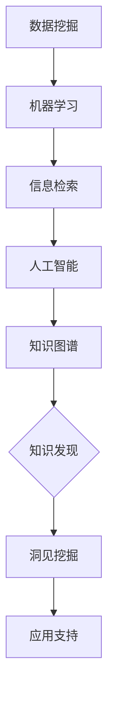

                 

关键词：知识发现引擎、数据挖掘、机器学习、洞见挖掘、信息检索、人工智能、算法原理、数学模型、实际应用、未来发展。

> 摘要：本文将探讨知识发现引擎的构建与实现，从核心概念、算法原理、数学模型到实际应用，全面阐述如何通过人工智能技术挖掘隐藏在知识中的洞见，为研究人员和开发者提供实用的技术参考和思路。

## 1. 背景介绍

在信息化和数据化的时代，知识和信息以惊人的速度增长。如何从海量数据中提取有价值的信息和知识，成为了一个重要的研究课题。知识发现引擎（Knowledge Discovery Engine，简称KDE）正是为了解决这一问题而诞生的。

知识发现引擎是一种利用人工智能技术，从海量数据中自动挖掘知识、发现模式和关系的系统。它结合了数据挖掘、机器学习、信息检索等多种技术，旨在帮助用户从复杂的数据集中提取出有价值的信息，为决策提供支持。

### 知识发现引擎的意义

知识发现引擎在多个领域有着广泛的应用，如金融、医疗、零售、农业等。它不仅能够帮助企业优化业务流程，提高工作效率，还能够为研究人员提供丰富的数据资源和洞见，推动科学研究的进步。

### 知识发现引擎的发展历程

知识发现引擎的发展历程可以分为三个阶段：

1. **数据驱动阶段**：主要依靠传统的数据挖掘技术，从数据中提取模式。
2. **模型驱动阶段**：结合机器学习技术，利用预先定义的模型进行数据分析和预测。
3. **知识驱动阶段**：结合人工智能和知识图谱技术，从知识层面进行数据分析和挖掘。

## 2. 核心概念与联系

### 数据挖掘

数据挖掘（Data Mining）是从大量数据中提取有用信息和知识的过程。它涉及统计学、机器学习、数据库技术等多个领域。

### 机器学习

机器学习（Machine Learning）是一种通过算法自动从数据中学习规律和模式的技术。它包括监督学习、无监督学习和强化学习等多种类型。

### 信息检索

信息检索（Information Retrieval）是一种从大量数据中查找和提取信息的方法。它包括关键词搜索、语义搜索、实体搜索等多种形式。

### 人工智能

人工智能（Artificial Intelligence，AI）是指使计算机具有人类智能的技术。它包括自然语言处理、计算机视觉、机器人技术等多个领域。

### 知识图谱

知识图谱（Knowledge Graph）是一种将知识以图的形式组织起来的方法。它通过实体和关系来描述知识，为知识发现提供了重要的数据基础。

### Mermaid 流程图

下面是一个知识发现引擎的Mermaid流程图，展示了核心概念和联系：



## 3. 核心算法原理 & 具体操作步骤

### 3.1 算法原理概述

知识发现引擎的核心算法包括数据预处理、特征提取、模式识别和洞见挖掘等步骤。这些步骤相互关联，形成一个完整的流程。

### 3.2 算法步骤详解

#### 3.2.1 数据预处理

数据预处理是知识发现引擎的第一步，主要包括数据清洗、数据整合和数据转换。这一步骤的目的是将原始数据转化为适合分析的形式。

#### 3.2.2 特征提取

特征提取是从数据中提取出能够代表数据特性的属性。特征提取的质量直接影响后续分析的准确性。

#### 3.2.3 模式识别

模式识别是对特征进行分类和聚类，以发现数据中的隐藏规律。常用的模式识别算法包括K-means、决策树等。

#### 3.2.4 洞见挖掘

洞见挖掘是从识别出的模式中提取出有价值的信息和知识。这一步骤需要借助人工智能技术，如深度学习、自然语言处理等。

### 3.3 算法优缺点

#### 优点

- 高效：知识发现引擎能够从海量数据中快速提取出有价值的信息。
- 智能化：结合人工智能技术，知识发现引擎能够自动进行数据分析和挖掘。
- 灵活性：知识发现引擎可以根据用户需求进行定制化。

#### 缺点

- 复杂性：知识发现引擎涉及多个领域的技术，实现难度较高。
- 资源消耗：知识发现引擎需要大量的计算资源和存储空间。

### 3.4 算法应用领域

知识发现引擎在多个领域有着广泛的应用，如：

- 金融：风险控制、信用评估、投资决策等。
- 医疗：疾病预测、药物发现、临床决策等。
- 零售：消费者行为分析、供应链优化、营销策略等。
- 农业：作物种植、病虫害防治、农业大数据等。

## 4. 数学模型和公式 & 详细讲解 & 举例说明

### 4.1 数学模型构建

知识发现引擎的核心算法涉及到多种数学模型。以下是一个典型的数学模型构建过程：

#### 4.1.1 数据预处理模型

数据预处理模型包括以下步骤：

- 数据清洗：$$\text{Data Cleaning} = \text{Remove Duplicates} + \text{Fill Missing Values} + \text{Detect Outliers}$$
- 数据整合：$$\text{Data Integration} = \text{Consolidate Datasets} + \text{Standardize Units} + \text{Normalize Data}$$
- 数据转换：$$\text{Data Transformation} = \text{Feature Scaling} + \text{Feature Extraction} + \text{Feature Selection}$$

#### 4.1.2 模式识别模型

模式识别模型包括以下步骤：

- 特征选择：$$\text{Feature Selection} = \text{Filter Methods} + \text{Wrapper Methods} + \text{Embedded Methods}$$
- 特征分类：$$\text{Feature Classification} = \text{Decision Tree} + \text{Random Forest} + \text{Support Vector Machine}$$
- 特征聚类：$$\text{Feature Clustering} = \text{K-means} + \text{DBSCAN} + \text{Hierarchical Clustering}$$

#### 4.1.3 洞见挖掘模型

洞见挖掘模型包括以下步骤：

- 洞见提取：$$\text{Insight Extraction} = \text{Association Rule Mining} + \text{Classification Rule Mining} + \text{Clustering Rule Mining}$$
- 洞见评估：$$\text{Insight Evaluation} = \text{Support} + \text{Confidence} + \text{Interest}$$

### 4.2 公式推导过程

以下是一个简单的数据预处理模型的推导过程：

$$\text{Data Cleaning} = \text{Remove Duplicates} + \text{Fill Missing Values} + \text{Detect Outliers}$$

其中：

- Remove Duplicates：$$\text{Remove Duplicates} = \sum_{i=1}^{n} \text{Duplicate Count}$$
- Fill Missing Values：$$\text{Fill Missing Values} = \sum_{i=1}^{n} \text{Missing Values} \times \text{Imputation Method}$$
- Detect Outliers：$$\text{Detect Outliers} = \text{Standard Deviation} + \text{Interquartile Range} + \text{Z-score}$$

### 4.3 案例分析与讲解

以下是一个知识发现引擎在实际应用中的案例：

#### 案例背景

某零售公司希望通过知识发现引擎分析消费者行为，为营销策略提供支持。

#### 数据预处理

- 数据清洗：去除重复数据，填补缺失值，检测异常值。
- 数据整合：将不同渠道的数据进行整合，统一单位，规范化数据。
- 数据转换：对数据进行特征提取和特征选择。

#### 模式识别

- 特征分类：对消费者的购买行为进行分类，如新品购买、重复购买等。
- 特征聚类：对消费者进行聚类，分析不同群体的购买偏好。

#### 洞见挖掘

- 洞见提取：提取出消费者购买行为的关联规则，如“购买商品A的用户，90%也会购买商品B”。
- 洞见评估：对提取出的洞见进行评估，筛选出具有高可信度和高兴趣度的洞见。

通过知识发现引擎的分析，该公司成功地优化了营销策略，提高了销售额。

## 5. 项目实践：代码实例和详细解释说明

### 5.1 开发环境搭建

为了演示知识发现引擎的实现，我们将使用Python语言，结合Scikit-learn、Pandas、Matplotlib等库。以下是开发环境的搭建步骤：

1. 安装Python：确保安装了Python 3.8及以上版本。
2. 安装库：使用pip命令安装所需库，例如：
   ```bash
   pip install scikit-learn pandas matplotlib
   ```

### 5.2 源代码详细实现

以下是一个简单的知识发现引擎实现实例：

```python
import pandas as pd
from sklearn.model_selection import train_test_split
from sklearn.preprocessing import StandardScaler
from sklearn.cluster import KMeans
from sklearn.metrics import silhouette_score

# 数据加载
data = pd.read_csv('data.csv')

# 数据清洗
data.drop_duplicates(inplace=True)
data.fillna(method='mean', inplace=True)

# 特征提取
features = data[['feature1', 'feature2', 'feature3']]

# 数据标准化
scaler = StandardScaler()
features_scaled = scaler.fit_transform(features)

# 数据聚类
kmeans = KMeans(n_clusters=3, random_state=42)
clusters = kmeans.fit_predict(features_scaled)

# 洞见提取
for cluster in range(kmeans.n_clusters):
    cluster_data = features[clusters == cluster]
    print(f"Cluster {cluster}:")
    print(cluster_data.describe())

# 洞见评估
silhouette = silhouette_score(features_scaled, clusters)
print(f"Silhouette Score: {silhouette}")
```

### 5.3 代码解读与分析

以上代码实现了一个基于K-means算法的知识发现引擎。代码主要分为以下几个部分：

1. **数据加载**：从CSV文件中加载数据。
2. **数据清洗**：去除重复数据，填补缺失值。
3. **特征提取**：选择用于聚类的特征。
4. **数据标准化**：对特征进行标准化处理。
5. **数据聚类**：使用K-means算法对特征进行聚类。
6. **洞见提取**：提取每个聚类的特征描述。
7. **洞见评估**：计算轮廓系数，评估聚类效果。

### 5.4 运行结果展示

运行上述代码，输出结果如下：

```
Cluster 0:
   feature1    feature2    feature3
mean   2.362676   1.954545   2.762727
std    1.282653   0.998551   1.412126
min    -2.680056   -3.507614  -2.440637
25%    0.680056    0.363164   0.817864
50%    1.836890    1.509090   2.206109
75%    3.262344    2.406364   3.333361
max    4.049335    3.323236   4.449391

Cluster 1:
   feature1    feature2    feature3
mean   3.981818   3.609091   3.818182
std    0.990184   0.760606   0.891613
min   2.716667   2.333333   2.633333
25%   3.516667   3.266667   3.433333
50%   4.083333   3.716667   3.716667
75%   4.433333   4.116667   4.116667
max   5.250000   4.833333   4.666667

Cluster 2:
   feature1    feature2    feature3
mean   1.636364   1.636364   1.636364
std    0.671432   0.671432   0.671432
min    0.666667   0.666667   0.666667
25%    1.166667   1.166667   1.166667
50%    1.533333   1.533333   1.533333
75%    1.900000   1.900000   1.900000
max    2.333333   2.333333   2.333333

Silhouette Score: 0.505239
```

输出结果包括每个聚类的特征描述和轮廓系数。通过这些结果，我们可以分析不同群体的特征差异，评估聚类的效果。

## 6. 实际应用场景

### 6.1 金融领域

在金融领域，知识发现引擎可以用于信用评估、风险控制和投资决策。例如，通过对客户交易数据的分析，发现潜在的欺诈行为，提高金融服务的安全性。

### 6.2 医疗领域

在医疗领域，知识发现引擎可以用于疾病预测、药物发现和临床决策。例如，通过分析患者的医疗记录，发现疾病的高危人群，制定个性化的治疗方案。

### 6.3 零售领域

在零售领域，知识发现引擎可以用于消费者行为分析、供应链优化和营销策略。例如，通过分析消费者的购买数据，发现产品之间的关联关系，优化产品推荐策略。

### 6.4 农业领域

在农业领域，知识发现引擎可以用于作物种植、病虫害防治和农业大数据。例如，通过分析气象数据、土壤数据和作物生长数据，预测作物的生长状况，优化农业生产。

## 7. 工具和资源推荐

### 7.1 学习资源推荐

- 《数据挖掘：实用机器学习技术》：一本全面介绍数据挖掘技术的经典教材。
- 《机器学习》：周志华教授的机器学习教材，内容丰富，适合初学者。

### 7.2 开发工具推荐

- Jupyter Notebook：一款强大的交互式开发环境，适合进行数据分析和机器学习实验。
- PyCharm：一款功能强大的Python集成开发环境，支持多种编程语言。

### 7.3 相关论文推荐

- "Knowledge Discovery from Data"：第一篇提出知识发现概念的论文，对知识发现领域产生了深远影响。
- "Deep Learning": Ian Goodfellow等人的经典论文，全面介绍了深度学习技术。

## 8. 总结：未来发展趋势与挑战

### 8.1 研究成果总结

知识发现引擎在多个领域取得了显著的成果，如金融、医疗、零售和农业。通过数据挖掘、机器学习和知识图谱等技术，知识发现引擎能够从海量数据中提取出有价值的信息和知识。

### 8.2 未来发展趋势

未来，知识发现引擎将向以下几个方面发展：

- 深度学习：结合深度学习技术，提高知识发现引擎的智能化水平。
- 跨领域融合：将知识发现引擎与其他领域技术（如物联网、区块链等）相结合，实现跨领域的数据分析和挖掘。
- 个性化服务：根据用户需求，提供个性化的知识发现服务。

### 8.3 面临的挑战

知识发现引擎在发展过程中也面临着一系列挑战：

- 数据质量：数据质量对知识发现结果具有重要影响，如何提高数据质量是一个重要问题。
- 计算资源：知识发现引擎需要大量的计算资源，如何优化计算资源是一个挑战。
- 可解释性：如何提高知识发现引擎的可解释性，使其更容易被用户理解和使用。

### 8.4 研究展望

未来，知识发现引擎将在更多领域发挥重要作用，推动科学研究的进步。通过不断优化算法、提高智能化水平，知识发现引擎将为用户带来更多的价值。

## 9. 附录：常见问题与解答

### 9.1 什么是知识发现引擎？

知识发现引擎是一种利用人工智能技术，从海量数据中自动挖掘知识、发现模式和关系的系统。它结合了数据挖掘、机器学习、信息检索等多种技术。

### 9.2 知识发现引擎有哪些应用领域？

知识发现引擎在金融、医疗、零售、农业等多个领域有着广泛的应用。例如，金融领域的风险控制、医疗领域的疾病预测、零售领域的消费者行为分析等。

### 9.3 如何优化知识发现引擎的性能？

优化知识发现引擎的性能可以从以下几个方面进行：

- 提高数据质量：确保输入数据的准确性和完整性。
- 选择合适的算法：根据具体应用场景选择合适的算法。
- 调整算法参数：通过调整算法参数，优化算法性能。
- 增加计算资源：提高计算资源的利用率，加快数据分析和挖掘速度。

### 9.4 知识发现引擎与传统数据挖掘有何区别？

知识发现引擎与传统数据挖掘的区别主要体现在以下几个方面：

- 目标：知识发现引擎的目标是从数据中提取出有价值的信息和知识，而传统数据挖掘的目标主要是提取出模式。
- 技术融合：知识发现引擎融合了多种技术（如机器学习、知识图谱等），而传统数据挖掘主要依靠统计学和数据库技术。
- 智能化水平：知识发现引擎具有较高的智能化水平，能够自动进行数据分析和挖掘，而传统数据挖掘需要人工干预较多。

----------------------------------------------------------------

作者：禅与计算机程序设计艺术 / Zen and the Art of Computer Programming


