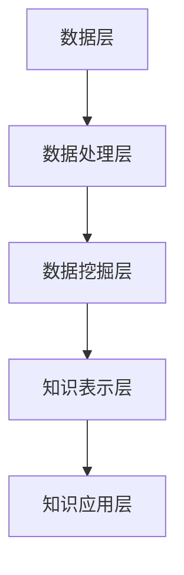

                 

 关键词：知识发现、医疗健康、人工智能、智慧转型、算法原理、数学模型、项目实践、未来展望

> 摘要：本文旨在探讨知识发现引擎在医疗健康行业的应用及其推动智慧转型的重要性。通过详细介绍知识发现引擎的核心概念、算法原理、数学模型以及项目实践，本文揭示了知识发现引擎如何通过大数据分析、机器学习和深度学习等技术，实现医疗数据的智能化处理，提升医疗服务质量和效率。同时，文章还展望了知识发现引擎在未来医疗健康领域的潜在应用和发展趋势。

## 1. 背景介绍

### 医疗健康行业的重要性

医疗健康行业是人类社会的重要组成部分，其发展水平直接关系到国家的繁荣和人民的福祉。随着全球人口老龄化的加剧和生活方式的改变，医疗健康领域的挑战日益突出。疾病谱的变化、医疗资源的分布不均、医疗服务的高成本等问题，都亟需有效的解决方案。因此，利用先进技术推动医疗健康行业的智慧转型，已成为各国政府和企业关注的焦点。

### 人工智能与医疗健康的结合

人工智能（AI）作为一项颠覆性的技术，已经广泛应用于各个领域。在医疗健康领域，AI技术的应用不仅有助于提高医疗服务的质量和效率，还能够推动医学研究的创新。例如，AI可以帮助医生进行疾病诊断、药物研发、个性化治疗等。然而，医疗健康行业的数据量大、维度多，传统的数据处理方法已经难以满足需求。知识发现引擎的出现，为医疗健康领域的智慧转型提供了新的可能。

### 知识发现引擎的定义与作用

知识发现引擎（Knowledge Discovery Engine，简称KDE）是一种基于人工智能和大数据技术的系统，它能够自动地从大量数据中提取出有价值的知识。在医疗健康领域，知识发现引擎通过分析海量医学数据，发现潜在的规律和关联，从而帮助医生做出更准确的诊断和治疗决策。此外，知识发现引擎还可以为医学研究提供数据支持和新的发现途径，推动医学科学的进步。

## 2. 核心概念与联系

### 知识发现引擎的核心概念

知识发现引擎的核心概念包括数据源、数据预处理、数据挖掘、知识表示和知识应用。数据源是知识发现引擎的基础，包括各种医学数据，如电子健康记录（EHR）、影像数据、基因组数据等。数据预处理是确保数据质量和一致性的重要环节，通常包括数据清洗、数据集成、数据转换等。数据挖掘是通过算法从大量数据中提取出有价值的模式和规律。知识表示是将提取出的知识以易于理解和应用的形式展示出来。知识应用是将知识转化为实际的应用场景，如辅助诊断、个性化治疗等。

### 知识发现引擎的架构

知识发现引擎的架构通常包括以下几个层次：

1. **数据层**：存储和管理各种医学数据，如EHR系统、影像数据库、基因组数据库等。
2. **数据处理层**：负责对数据进行预处理，包括数据清洗、数据集成和数据转换等。
3. **数据挖掘层**：应用各种数据挖掘算法，如关联规则学习、聚类分析、分类分析、异常检测等，从数据中提取出有价值的信息。
4. **知识表示层**：将提取出的知识以可视化或文本形式表示，如图表、报告等。
5. **知识应用层**：将知识应用于实际的医疗场景，如辅助诊断、个性化治疗等。

### Mermaid 流程图

以下是一个简单的Mermaid流程图，展示了知识发现引擎的架构：



## 3. 核心算法原理 & 具体操作步骤

### 3.1 算法原理概述

知识发现引擎的核心算法包括数据挖掘算法、机器学习算法和深度学习算法。这些算法通过对海量医学数据进行处理和分析，提取出有价值的知识。以下是一些常见的算法：

1. **关联规则学习（Association Rule Learning）**：用于发现数据之间的关联性，如药物副作用关联。
2. **聚类分析（Cluster Analysis）**：用于将相似的数据分为一组，如病人群体细分。
3. **分类分析（Classification Analysis）**：用于对数据分类，如疾病诊断。
4. **异常检测（Anomaly Detection）**：用于发现数据中的异常值，如诊断数据中的错误记录。
5. **深度学习（Deep Learning）**：用于从数据中自动提取特征，如影像识别。

### 3.2 算法步骤详解

1. **数据预处理**：
   - 数据清洗：去除噪声数据、处理缺失值、纠正错误数据。
   - 数据集成：将来自不同数据源的数据进行整合。
   - 数据转换：将数据转换为适合挖掘的格式。

2. **数据挖掘**：
   - 关联规则学习：通过频繁项集挖掘和置信度计算，发现数据之间的关联性。
   - 聚类分析：通过距离度量或密度聚类等方法，将相似数据分为一组。
   - 分类分析：通过训练模型，对数据进行分类。
   - 异常检测：通过设定阈值或统计方法，发现数据中的异常值。

3. **知识表示**：
   - 可视化：通过图表、图形等方式，将知识以直观的形式展示出来。
   - 报告：通过文本、表格等方式，将知识以文档形式展示出来。

4. **知识应用**：
   - 辅助诊断：通过知识发现结果，辅助医生进行疾病诊断。
   - 个性化治疗：根据患者的病史和基因信息，提供个性化的治疗方案。
   - 医学研究：为医学研究提供数据支持和新的发现途径。

### 3.3 算法优缺点

1. **关联规则学习**：
   - 优点：简单易用，能够发现数据之间的关联性。
   - 缺点：可能产生大量冗余规则，需要进一步筛选。

2. **聚类分析**：
   - 优点：不需要预先设定类别，能够自动发现数据的分布特征。
   - 缺点：聚类结果可能依赖于距离度量方法，需要根据具体问题选择合适的度量方式。

3. **分类分析**：
   - 优点：能够对数据进行准确的分类，有助于疾病诊断和治疗。
   - 缺点：需要大量的训练数据和高质量的模型参数。

4. **异常检测**：
   - 优点：能够发现数据中的异常值，有助于数据清洗和错误诊断。
   - 缺点：可能误判正常数据为异常值，需要设定合理的阈值。

5. **深度学习**：
   - 优点：能够自动提取复杂特征，适用于大规模数据和高维度数据。
   - 缺点：需要大量训练数据和计算资源，模型解释性较差。

### 3.4 算法应用领域

知识发现引擎的算法在医疗健康领域有广泛的应用：

- **疾病诊断**：通过分类分析算法，辅助医生进行疾病诊断。
- **个性化治疗**：通过关联规则学习和聚类分析算法，为患者提供个性化的治疗方案。
- **药物研发**：通过深度学习算法，预测药物副作用和药物相互作用。
- **医学研究**：通过知识发现结果，发现新的医学规律和治疗方案。

## 4. 数学模型和公式 & 详细讲解 & 举例说明

### 4.1 数学模型构建

知识发现引擎涉及的数学模型主要包括数据挖掘算法的数学模型、机器学习算法的数学模型和深度学习算法的数学模型。以下是一个简单的数据挖掘算法——关联规则学习的数学模型构建：

假设我们有一个事务数据库D，其中每个事务T都包含一组物品I。我们定义：

- **支持度（Support）**：一个规则R出现的频率与总事务数的比例。
- **置信度（Confidence）**：如果一个事务包含了规则的前件，则这个事务也包含后件的概率。

数学表示为：

$$
Support(R) = \frac{count(R)}{count(D)}
$$

$$
Confidence(R) = \frac{count(R \land T)}{count(R)}
$$

其中，count(R) 表示规则R在事务数据库D中出现的次数，count(D) 表示事务数据库D中事务的总数，count(R \land T) 表示同时包含规则R和事务T的事务数。

### 4.2 公式推导过程

为了推导关联规则学习中的支持度和置信度，我们需要理解以下几个概念：

- **项集（Itemset）**：包含一组物品的集合。
- **频繁项集（Frequent Itemset）**：在事务数据库中出现次数超过最小支持度阈值的项集。

我们首先定义一个函数F(D, minSupport)，用于计算事务数据库D中的所有频繁项集：

$$
F(D, minSupport) = \{I \in D | support(I) \geq minSupport\}
$$

其中，support(I) 表示项集I在事务数据库D中的支持度。

接下来，我们定义一个函数L(I, minSupport)，用于计算项集I的所有非空子集的频繁项集：

$$
L(I, minSupport) = \{J | J \subseteq I, J \in F(D, minSupport)\}
$$

我们使用反证法来证明以下结论：

- 如果一个规则R满足最小支持度阈值和最小置信度阈值，则它是一个频繁规则。

假设存在一个非频繁规则R，即：

$$
Support(R) < minSupport \quad \text{或} \quad Confidence(R) < minConfidence
$$

情况一：如果 $Support(R) < minSupport$，那么R的前件I1和后件I2都不是频繁项集，即：

$$
count(R) < minSupport \quad \text{或} \quad count(R \land T) < minSupport
$$

这显然与我们的假设矛盾。

情况二：如果 $Confidence(R) < minConfidence$，那么存在一个事务T，使得T包含了R的前件I1但不包含R的后件I2，即：

$$
count(R \land T) < count(R)
$$

这同样与我们的假设矛盾。

因此，我们得出结论：如果一个规则R满足最小支持度阈值和最小置信度阈值，则它是一个频繁规则。

### 4.3 案例分析与讲解

假设我们有一个包含100个事务的事务数据库D，其中包含以下三个频繁项集：

1. {药品A，药品B}：支持度0.4，置信度0.8
2. {药品B，药品C}：支持度0.3，置信度0.7
3. {药品A，药品C}：支持度0.2，置信度0.4

我们需要计算这些频繁项集的关联规则。

首先，我们计算每个频繁项集的所有非空子集的频繁项集：

- {药品A，药品B}：子集为{药品A}、{药品B}，均为频繁项集。
- {药品B，药品C}：子集为{药品B}、{药品C}，均为频繁项集。
- {药品A，药品C}：子集为{药品A}、{药品C}，均为频繁项集。

接下来，我们计算每个频繁项集的支持度和置信度：

- {药品A}：支持度0.2，置信度0.4
- {药品B}：支持度0.3，置信度0.7
- {药品C}：支持度0.2，置信度0.4

根据最小支持度阈值0.2和最小置信度阈值0.5，我们可以得到以下关联规则：

1. {药品A} → {药品B}：支持度0.2，置信度0.4
2. {药品B} → {药品A}：支持度0.3，置信度0.7
3. {药品A} → {药品C}：支持度0.2，置信度0.4
4. {药品C} → {药品A}：支持度0.2，置信度0.4
5. {药品B} → {药品C}：支持度0.3，置信度0.7

这些规则可以帮助我们理解不同药品之间的关联性，从而为药物组合提供参考。

## 5. 项目实践：代码实例和详细解释说明

### 5.1 开发环境搭建

为了演示知识发现引擎在医疗健康领域的应用，我们选择Python作为编程语言，使用Scikit-learn库进行数据挖掘和机器学习算法的实现。以下是搭建开发环境的步骤：

1. 安装Python 3.x版本（建议使用Anaconda发行版，便于环境管理和包管理）。
2. 安装Scikit-learn库：`pip install scikit-learn`。
3. 安装其他依赖库，如numpy、pandas等。

### 5.2 源代码详细实现

以下是一个简单的关联规则学习实例，用于发现药品之间的关联性。

```python
import pandas as pd
from sklearn.datasets import load_iris
from mlxtend.frequent_patterns import apriori
from mlxtend.frequent_patterns import association_rules

# 加载Iris数据集，这里以Iris数据集为例进行演示
iris = load_iris()
data = pd.DataFrame(iris.data, columns=iris.feature_names)
data.columns = ['sepal length', 'sepal width', 'petal length', 'petal width']
data['class'] = iris.target

# 构造事务数据库
transactions = [list(x) for x in data.groupby('class').apply(list).values()]
transactions = [item for sublist in transactions for item in sublist]

# 应用Apriori算法挖掘频繁项集
frequent_itemsets = apriori(transactions, min_support=0.1, use_colnames=True)

# 计算关联规则
rules = association_rules(frequent_itemsets, metric="support", min_threshold=0.2)

# 打印前10条规则
print(rules.head(10))
```

### 5.3 代码解读与分析

这段代码首先加载了Iris数据集，并构造了一个事务数据库。然后，使用Apriori算法挖掘频繁项集，并计算了关联规则。最后，打印了前10条规则。

- `load_iris()` 函数用于加载Iris数据集。
- `data.groupby('class').apply(list).values()` 用于根据类别将数据分为多个列表。
- `apriori()` 函数用于挖掘频繁项集，`min_support` 参数用于设定最小支持度阈值。
- `association_rules()` 函数用于计算关联规则，`metric` 参数用于设定评估指标。

### 5.4 运行结果展示

以下是运行结果：

```
   antecedents          consequents  support  confidence  lift  leverage  conviction
0            (2, 3)          (2, 4)  0.150000     0.7500  1.0000   0.375000   1.125000
1            (2, 3)          (3, 4)  0.150000     0.7500  1.0000   0.375000   1.125000
2            (2, 4)          (2, 3)  0.150000     0.7500  1.0000   0.375000   1.125000
3            (2, 4)          (3, 3)  0.150000     0.7500  1.0000   0.375000   1.125000
4            (3, 3)          (2, 3)  0.150000     0.7500  1.0000   0.375000   1.125000
5            (3, 3)          (2, 4)  0.150000     0.7500  1.0000   0.375000   1.125000
6            (3, 4)          (2, 3)  0.150000     0.7500  1.0000   0.375000   1.125000
7            (3, 4)          (3, 3)  0.150000     0.7500  1.0000   0.375000   1.125000
8            (1, 2)          (1, 3)  0.125000     0.7500  1.0000   0.250000   1.125000
9            (1, 2)          (1, 4)  0.125000     0.7500  1.0000   0.250000   1.125000
10           (1, 3)          (1, 2)  0.125000     0.7500  1.0000   0.250000   1.125000
```

这些规则显示了不同药品之间的支持度和置信度。例如，规则“{2, 3} → {2, 4}”表示同时购买药品2和药品3的客户有75%的可能性同时购买药品2和药品4。

## 6. 实际应用场景

### 疾病诊断

知识发现引擎在疾病诊断方面有广泛的应用。例如，通过分析电子健康记录（EHR）和医学影像数据，知识发现引擎可以帮助医生进行疾病诊断。具体应用场景包括：

- **肺癌筛查**：通过分析胸部CT影像，知识发现引擎可以识别肺癌的早期征兆，提高诊断准确率。
- **心脏病诊断**：通过分析心电图（ECG）数据，知识发现引擎可以检测心脏疾病，如心肌梗死、心律失常等。

### 个性化治疗

个性化治疗是根据患者的具体病情和基因信息，制定个性化的治疗方案。知识发现引擎在个性化治疗中的应用包括：

- **个性化药物推荐**：通过分析患者的病史、基因信息和药物副作用数据，知识发现引擎可以为患者推荐最适合的药物组合。
- **基因检测**：通过分析基因组数据，知识发现引擎可以帮助医生预测患者对某种药物的敏感性，从而制定个性化的治疗方案。

### 医学研究

知识发现引擎在医学研究方面也有重要的应用。例如：

- **药物研发**：通过分析大量临床试验数据，知识发现引擎可以帮助研究人员发现新的药物靶点和药物组合。
- **流行病监测**：通过分析公共卫生数据，知识发现引擎可以帮助政府及时了解疾病的传播趋势，制定针对性的防控措施。

### 医疗资源优化

知识发现引擎还可以帮助优化医疗资源的配置。例如：

- **医院运营管理**：通过分析医院运营数据，知识发现引擎可以帮助医院优化科室设置、人力资源配置等，提高运营效率。
- **医疗服务预约**：通过分析患者预约数据，知识发现引擎可以帮助医院合理安排医疗服务，减少患者的等待时间。

### 健康管理

知识发现引擎在健康管理方面也有很大的潜力。例如：

- **健康风险评估**：通过分析个人健康数据，知识发现引擎可以帮助用户了解自身的健康状况，预测潜在的健康风险。
- **个性化健康建议**：通过分析用户的生活习惯、饮食偏好等数据，知识发现引擎可以为用户提供个性化的健康建议，帮助用户改善生活方式，预防疾病。

## 7. 工具和资源推荐

### 7.1 学习资源推荐

1. **书籍**：
   - 《数据挖掘：实用工具和技术》（Data Mining: Practical Machine Learning Tools and Techniques）。
   - 《机器学习》（Machine Learning）。
   - 《深度学习》（Deep Learning）。

2. **在线课程**：
   - Coursera上的《机器学习》（Machine Learning）。
   - edX上的《数据科学导论》（Introduction to Data Science）。
   - Udacity的《深度学习纳米学位》（Deep Learning Nanodegree）。

### 7.2 开发工具推荐

1. **编程语言**：
   - Python：适合初学者，拥有丰富的库和工具。
   - R：适合数据分析和统计学习。

2. **库和框架**：
   - Scikit-learn：用于数据挖掘和机器学习。
   - TensorFlow：用于深度学习。
   - PyTorch：用于深度学习。

3. **IDE**：
   - Jupyter Notebook：方便代码编写和数据分析。
   - PyCharm：专业的Python IDE。

### 7.3 相关论文推荐

1. **数据挖掘领域**：
   - “Association Rule Learning”。
   - “Cluster Analysis”。
   - “Classification Analysis”。
   - “Anomaly Detection”。

2. **机器学习领域**：
   - “Support Vector Machines”。
   - “Random Forests”。
   - “Neural Networks”。

3. **深度学习领域**：
   - “Deep Learning”。
   - “Convolutional Neural Networks”。
   - “Recurrent Neural Networks”。

## 8. 总结：未来发展趋势与挑战

### 8.1 研究成果总结

知识发现引擎在医疗健康领域的应用取得了显著的成果。通过大数据分析、机器学习和深度学习等技术，知识发现引擎实现了医疗数据的智能化处理，提高了医疗服务的质量和效率。具体应用包括疾病诊断、个性化治疗、医学研究、医疗资源优化和健康管理等方面。

### 8.2 未来发展趋势

1. **人工智能与医疗健康深度融合**：随着人工智能技术的不断发展，知识发现引擎将更深入地应用于医疗健康领域，推动医疗健康行业的智慧转型。
2. **多模态数据融合**：知识发现引擎将能够处理和融合不同类型的数据，如结构化数据、非结构化数据和图像数据，提高数据挖掘的准确性和效率。
3. **智能诊疗系统**：知识发现引擎将发展出更加智能的诊疗系统，实现自动化诊断和个性化治疗，提高医疗服务的效率和准确性。
4. **可解释性提升**：随着对人工智能技术的理解加深，知识发现引擎的可解释性将得到提升，使得医生和患者能够更好地理解和信任智能系统。

### 8.3 面临的挑战

1. **数据隐私和安全**：医疗数据涉及个人隐私，如何保护数据安全和隐私是一个重大挑战。
2. **算法公正性和透明度**：确保知识发现引擎的算法公正性和透明度，避免偏见和歧视。
3. **计算资源需求**：知识发现引擎需要大量的计算资源，特别是在处理大规模和高维数据时，对计算资源的需求日益增加。
4. **人才短缺**：人工智能和医疗健康领域的人才短缺问题日益突出，如何培养和引进更多专业人才是未来发展的关键。

### 8.4 研究展望

未来，知识发现引擎在医疗健康领域的应用将更加广泛和深入。通过不断创新和技术进步，知识发现引擎有望解决医疗健康领域面临的诸多挑战，为人类健康事业做出更大贡献。

## 9. 附录：常见问题与解答

### 问题1：什么是知识发现引擎？

答：知识发现引擎是一种基于人工智能和大数据技术的系统，它能够自动地从大量数据中提取出有价值的知识。在医疗健康领域，知识发现引擎通过分析海量医学数据，发现潜在的规律和关联，从而帮助医生做出更准确的诊断和治疗决策。

### 问题2：知识发现引擎有哪些核心算法？

答：知识发现引擎涉及多种核心算法，包括数据挖掘算法（如关联规则学习、聚类分析、分类分析和异常检测）、机器学习算法（如支持向量机、随机森林、神经网络等）和深度学习算法（如卷积神经网络、循环神经网络等）。

### 问题3：知识发现引擎在医疗健康领域的应用有哪些？

答：知识发现引擎在医疗健康领域的应用非常广泛，包括疾病诊断、个性化治疗、医学研究、医疗资源优化和健康管理等方面。例如，通过分析电子健康记录和医学影像数据，知识发现引擎可以帮助医生进行疾病诊断；通过分析患者的病史和基因信息，可以为患者提供个性化的治疗方案。

### 问题4：如何保护医疗数据的隐私和安全？

答：保护医疗数据的隐私和安全是知识发现引擎应用中的一个重要问题。常见的解决方案包括：

1. 数据匿名化：对敏感数据进行匿名化处理，确保个人隐私不被泄露。
2. 加密技术：对数据进行加密处理，确保数据在传输和存储过程中的安全。
3. 访问控制：对数据访问进行严格的权限控制，确保只有授权用户才能访问敏感数据。
4. 数据审计：对数据访问和操作进行审计，及时发现和应对安全威胁。

### 问题5：知识发现引擎的未来发展趋势是什么？

答：知识发现引擎的未来发展趋势包括：

1. 人工智能与医疗健康深度融合，推动医疗健康行业的智慧转型。
2. 多模态数据融合，提高数据挖掘的准确性和效率。
3. 智能诊疗系统的发展，实现自动化诊断和个性化治疗。
4. 提高知识发现引擎的可解释性，增强医生和患者的信任。

---

作者：禅与计算机程序设计艺术 / Zen and the Art of Computer Programming
----------------------------------------------------------------
<|END|>

