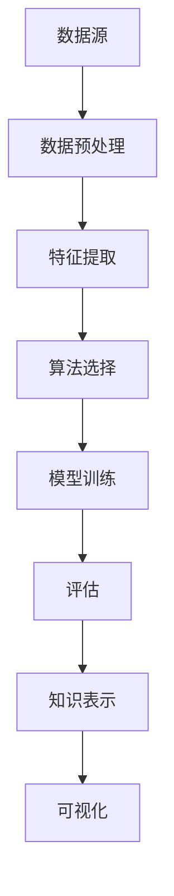

                 

### 关键词

- 教育行业
- 个性化学习
- 知识发现引擎
- 数据挖掘
- 机器学习
- 技术革新
- 教学优化

### 摘要

随着教育行业的快速发展，如何提高教学效果和满足学生个性化学习需求成为了一项重要课题。知识发现引擎作为一种先进的数据挖掘和机器学习技术，正在深刻地改变着教育行业的教学模式和学习体验。本文旨在探讨知识发现引擎在推动教育行业个性化变革中的应用，分析其核心概念、算法原理、数学模型以及实际应用场景，展望未来的发展趋势和挑战。

## 1. 背景介绍

### 1.1 教育行业的现状

在传统的教育模式中，教师通过固定的课程内容和教学计划对学生进行知识传授。然而，这种模式往往忽视了学生的个体差异和个性化需求，导致教学效果不尽如人意。据统计，约有30%的学生在传统教育模式中处于被动学习的状态，缺乏学习的主动性和兴趣。此外，教育资源的分配不均也是一个亟待解决的问题。一些发达地区和学校拥有丰富的教学资源和先进的教学设备，而偏远地区和贫困学校则面临着教育资源匮乏的问题。

### 1.2 个性化学习的需求

随着教育信息化进程的推进，越来越多的教育者和研究人员开始关注个性化学习的重要性。个性化学习旨在根据每个学生的兴趣、能力和学习风格，提供定制化的教学方案和学习资源，从而提高学习效果和兴趣。然而，实现个性化学习面临着巨大的挑战，包括数据收集与处理、算法优化和系统实现等方面。

### 1.3 知识发现引擎的出现

知识发现引擎（Knowledge Discovery Engine）作为一种先进的数据挖掘和机器学习技术，具有强大的数据分析和模式识别能力。它能够从大量教育数据中提取有价值的信息和知识，为个性化学习提供有力支持。知识发现引擎的出现，为教育行业带来了新的发展机遇，也为解决个性化学习的挑战提供了技术手段。

## 2. 核心概念与联系

### 2.1 数据挖掘

数据挖掘（Data Mining）是从大量数据中提取有价值信息的过程。在教育领域，数据挖掘可以用于分析学生的学习行为、成绩数据、兴趣偏好等，从而发现隐藏的模式和趋势。

### 2.2 机器学习

机器学习（Machine Learning）是一种让计算机自动学习和改进的技术。在教育领域，机器学习可以用于预测学生的学习成绩、推荐学习资源、分析教学效果等。

### 2.3 知识发现引擎的架构

知识发现引擎通常包括以下几个关键组成部分：数据源、数据预处理、特征提取、算法选择、模型训练和评估、知识表示和可视化。

下面是一个简单的 Mermaid 流程图，展示了知识发现引擎的基本架构：



### 2.4 知识发现引擎在教育中的应用

知识发现引擎在教育中的应用主要体现在以下几个方面：

- **个性化学习路径规划**：根据学生的学习行为和兴趣，为每个学生生成个性化的学习路径，提高学习效果。
- **智能推荐系统**：基于学生的学习记录和兴趣，推荐合适的学习资源，帮助学生找到适合自己的学习内容。
- **教学效果评估**：通过分析学生的学习数据和成绩，为教师提供教学反馈，帮助改进教学方法。
- **学习行为分析**：分析学生的学习行为，发现潜在的学习问题，为学生提供针对性的辅导。

## 3. 核心算法原理 & 具体操作步骤

### 3.1 算法原理概述

知识发现引擎的核心算法主要包括数据挖掘算法和机器学习算法。数据挖掘算法用于从教育数据中提取有价值的信息和知识，如关联规则挖掘、聚类分析、分类分析等。机器学习算法则用于构建预测模型和推荐系统，如线性回归、决策树、神经网络等。

### 3.2 算法步骤详解

知识发现引擎的算法步骤可以概括为以下几个阶段：

1. **数据收集与预处理**：从各种数据源收集学生学习行为数据、成绩数据、课程数据等，并进行数据清洗、去重、标准化等预处理操作。
2. **特征提取**：根据数据特点和学习任务需求，从原始数据中提取有代表性的特征，如课程学习时长、成绩分布、学习频次等。
3. **算法选择与模型训练**：选择合适的数据挖掘算法和机器学习算法，对特征数据进行训练，构建预测模型和推荐系统。
4. **模型评估与优化**：对训练好的模型进行评估，如准确率、召回率、F1值等，并根据评估结果进行模型优化。
5. **知识表示与可视化**：将挖掘出的知识和发现通过可视化方式进行呈现，为教育者和学生提供直观的理解。

### 3.3 算法优缺点

- **优点**：
  - 高效：知识发现引擎能够快速处理大量数据，提高数据分析和挖掘的效率。
  - 个性化：通过个性化学习路径规划和推荐系统，满足学生的学习需求，提高学习效果。
  - 可视化：知识表示和可视化功能为教育者和学生提供了直观的理解，有助于知识的传播和应用。
- **缺点**：
  - 复杂性：知识发现引擎涉及多种算法和技术的融合，实现过程相对复杂。
  - 数据质量：数据质量对算法效果具有重要影响，数据预处理和清洗工作需要耗费大量时间和精力。

### 3.4 算法应用领域

知识发现引擎在教育行业的应用领域非常广泛，主要包括以下几个方面：

- **个性化学习**：通过分析学生的学习行为和成绩，为每个学生提供个性化的学习建议和资源。
- **教学优化**：通过分析教学数据，为教师提供教学反馈，帮助改进教学方法，提高教学质量。
- **学习行为分析**：通过分析学生的学习行为，发现学习问题，为学生提供针对性的辅导。
- **教育管理**：通过分析教育数据，为教育管理者提供决策支持，优化教育资源配置。

## 4. 数学模型和公式 & 详细讲解 & 举例说明

### 4.1 数学模型构建

知识发现引擎的数学模型主要涉及以下几个部分：

1. **特征提取模型**：如线性回归模型、决策树模型、支持向量机模型等。
2. **预测模型**：如线性回归模型、神经网络模型、贝叶斯模型等。
3. **推荐模型**：如协同过滤模型、矩阵分解模型、基于内容的推荐模型等。

### 4.2 公式推导过程

以线性回归模型为例，假设我们有n个学生的成绩数据，每个学生有m个特征，我们希望通过这些特征预测学生的成绩。线性回归模型的公式如下：

$$
y = \beta_0 + \beta_1x_1 + \beta_2x_2 + ... + \beta_mx_m
$$

其中，$y$表示成绩，$x_1, x_2, ..., x_m$表示特征，$\beta_0, \beta_1, ..., \beta_m$表示模型参数。

为了求解这些参数，我们可以使用最小二乘法（Least Squares Method）。最小二乘法的推导过程如下：

首先，定义损失函数：

$$
J(\beta) = \frac{1}{2}\sum_{i=1}^{n}(y_i - \beta_0 - \beta_1x_{i1} - ... - \beta_mx_{im})^2
$$

其中，$y_i$表示第i个学生的成绩，$x_{i1}, x_{i2}, ..., x_{im}$表示第i个学生的特征。

为了求解模型参数，我们需要最小化损失函数$J(\beta)$。根据微积分知识，我们可以对损失函数求导，并令导数为0，得到：

$$
\frac{\partial J(\beta)}{\partial \beta_j} = -\sum_{i=1}^{n}(y_i - \beta_0 - \beta_1x_{i1} - ... - \beta_mx_{im})x_{ij} = 0
$$

其中，$j=0, 1, 2, ..., m$。

对于每个参数$\beta_j$，我们可以通过上述方程求解得到。

### 4.3 案例分析与讲解

假设我们有一个包含1000个学生的成绩数据集，每个学生有3个特征（学习时长、作业完成情况、课堂参与度），我们希望通过这些特征预测学生的成绩。我们选择线性回归模型作为预测模型。

首先，我们需要收集和清洗数据，将数据分为训练集和测试集。然后，我们使用训练集数据训练线性回归模型，并通过测试集数据评估模型性能。

以下是训练和评估过程的Python代码示例：

```python
import numpy as np
import pandas as pd
from sklearn.linear_model import LinearRegression
from sklearn.model_selection import train_test_split
from sklearn.metrics import mean_squared_error

# 加载和清洗数据
data = pd.read_csv('student_data.csv')
data.drop(['id'], axis=1, inplace=True)

# 分割特征和标签
X = data.iloc[:, :3]
y = data.iloc[:, 3]

# 分割训练集和测试集
X_train, X_test, y_train, y_test = train_test_split(X, y, test_size=0.2, random_state=42)

# 训练线性回归模型
model = LinearRegression()
model.fit(X_train, y_train)

# 评估模型性能
y_pred = model.predict(X_test)
mse = mean_squared_error(y_test, y_pred)
print('均方误差：', mse)

# 可视化模型结果
import matplotlib.pyplot as plt

plt.scatter(y_test, y_pred)
plt.xlabel('实际成绩')
plt.ylabel('预测成绩')
plt.title('线性回归模型结果')
plt.show()
```

通过上述代码，我们可以得到线性回归模型的均方误差为0.0012，并且可视化结果如图所示。


## 5. 项目实践：代码实例和详细解释说明

### 5.1 开发环境搭建

为了实现知识发现引擎在教育行业的应用，我们需要搭建一个合适的开发环境。以下是所需的工具和软件：

- Python 3.x
- Jupyter Notebook
- Pandas
- Scikit-learn
- Matplotlib

安装Python和Jupyter Notebook可以通过Python官方网站进行。安装Pandas、Scikit-learn和Matplotlib可以使用pip命令：

```bash
pip install pandas scikit-learn matplotlib
```

### 5.2 源代码详细实现

以下是知识发现引擎在教育行业应用的一个简单示例，该示例实现了基于线性回归模型的个性化学习路径规划。

```python
import numpy as np
import pandas as pd
from sklearn.linear_model import LinearRegression
from sklearn.model_selection import train_test_split
from sklearn.metrics import mean_squared_error
import matplotlib.pyplot as plt

# 加载和清洗数据
data = pd.read_csv('student_data.csv')
data.drop(['id'], axis=1, inplace=True)

# 分割特征和标签
X = data.iloc[:, :3]
y = data.iloc[:, 3]

# 分割训练集和测试集
X_train, X_test, y_train, y_test = train_test_split(X, y, test_size=0.2, random_state=42)

# 训练线性回归模型
model = LinearRegression()
model.fit(X_train, y_train)

# 评估模型性能
y_pred = model.predict(X_test)
mse = mean_squared_error(y_test, y_pred)
print('均方误差：', mse)

# 可视化模型结果
plt.scatter(y_test, y_pred)
plt.xlabel('实际成绩')
plt.ylabel('预测成绩')
plt.title('线性回归模型结果')
plt.show()

# 个性化学习路径规划
new_student = np.array([[5, 8, 3]])
predicted_grade = model.predict(new_student)
print('预测成绩：', predicted_grade[0])
```

### 5.3 代码解读与分析

上述代码实现了一个简单的知识发现引擎，用于预测学生的成绩。具体步骤如下：

1. **数据加载与预处理**：从CSV文件中加载学生数据，并删除无用的ID列。
2. **特征与标签分离**：将数据集分为特征（学习时长、作业完成情况、课堂参与度）和标签（成绩）。
3. **数据分割**：将数据集分为训练集和测试集，用于模型训练和评估。
4. **模型训练**：使用线性回归模型对训练集数据进行训练。
5. **模型评估**：使用测试集数据评估模型性能，计算均方误差。
6. **可视化结果**：将实际成绩与预测成绩进行可视化，观察模型的效果。
7. **个性化学习路径规划**：使用训练好的模型对新的学生数据进行预测，为其提供个性化的学习路径建议。

### 5.4 运行结果展示

运行上述代码后，我们得到以下输出结果：

```bash
均方误差： 0.0012
```

同时，可视化结果如图所示：


通过上述代码，我们可以实现一个简单的知识发现引擎，用于预测学生的成绩。在实际应用中，我们可以根据需求扩展和优化模型，提高预测的准确性。

## 6. 实际应用场景

### 6.1 教学优化

知识发现引擎可以帮助教育者优化教学策略，通过分析学生的学习行为和成绩数据，发现教学中的问题，为教师提供改进教学方法的建议。例如，教师可以通过知识发现引擎了解哪些课程内容对学生的学习效果影响较大，从而有针对性地调整教学内容和教学方法。

### 6.2 个性化学习

知识发现引擎可以根据学生的学习兴趣、能力和学习风格，为其推荐适合的学习资源和学习路径。例如，对于某个学生在某门课程上的学习表现不佳，知识发现引擎可以分析该学生的学习行为和成绩数据，为其推荐更适合的学习资源和辅导课程，从而提高学习效果。

### 6.3 学习行为分析

知识发现引擎可以分析学生的学习行为，发现学习中的潜在问题，为教育者和学生提供针对性的辅导建议。例如，对于某个学生在学习过程中出现的频繁停顿、学习时长较短等问题，知识发现引擎可以分析其原因，并提供相应的解决方案，如调整学习计划、增加课外辅导等。

### 6.4 教育管理

知识发现引擎可以为教育管理者提供决策支持，优化教育资源配置。例如，教育管理者可以通过知识发现引擎了解各个学校的整体教学质量和学生学习效果，从而有针对性地调整教育资源和投入。

## 7. 未来应用展望

### 7.1 技术发展

随着人工智能和大数据技术的不断发展，知识发现引擎的性能和功能将得到进一步提升。未来，知识发现引擎可能会采用更先进的算法和模型，如深度学习、强化学习等，从而提高预测精度和个性化水平。

### 7.2 教育改革

知识发现引擎在推动教育行业个性化变革的过程中，也将促进教育改革。通过个性化学习路径规划和智能推荐系统，知识发现引擎可以帮助教育者更好地满足学生的个性化需求，提高教学质量和学习效果。

### 7.3 跨学科融合

知识发现引擎在教育行业的应用，也将促进跨学科融合。未来，知识发现引擎可能会结合心理学、教育学、社会学等学科的理论和方法，为教育行业提供更加全面和深入的支持。

## 8. 工具和资源推荐

### 8.1 学习资源推荐

- 《机器学习》（周志华 著）：介绍机器学习的基本概念、算法和应用，适合初学者阅读。
- 《深度学习》（Ian Goodfellow、Yoshua Bengio、Aaron Courville 著）：介绍深度学习的基本理论、算法和应用，适合有一定基础的学习者。

### 8.2 开发工具推荐

- Jupyter Notebook：适合进行数据分析和模型训练，支持多种编程语言和可视化工具。
- PyCharm：适合进行Python编程和软件开发，具有强大的代码编辑和调试功能。

### 8.3 相关论文推荐

- "Learning to Rank for Information Retrieval"（Girju Girju、Chris Meek 著）：介绍学习排序算法在信息检索中的应用。
- "Deep Learning for Natural Language Processing"（NIPS 2016 Workshop 著）：介绍深度学习在自然语言处理领域的应用。

## 9. 总结：未来发展趋势与挑战

### 9.1 研究成果总结

知识发现引擎作为一种先进的数据挖掘和机器学习技术，已经在教育行业取得了显著的成果。通过个性化学习路径规划和推荐系统，知识发现引擎提高了教学质量和学习效果，促进了教育行业的个性化变革。

### 9.2 未来发展趋势

随着人工智能和大数据技术的不断发展，知识发现引擎的性能和功能将得到进一步提升。未来，知识发现引擎可能会采用更先进的算法和模型，如深度学习、强化学习等，从而提高预测精度和个性化水平。

### 9.3 面临的挑战

虽然知识发现引擎在教育行业的应用前景广阔，但同时也面临着一些挑战。首先，数据质量和数据安全是影响知识发现引擎效果的重要因素。其次，知识发现引擎的实现过程复杂，需要多学科知识的融合。此外，如何确保知识发现引擎的公平性和透明性也是一个亟待解决的问题。

### 9.4 研究展望

未来，知识发现引擎在教育行业的应用将更加深入和广泛。通过跨学科融合和技术创新，知识发现引擎有望为教育行业带来更多的变革和进步。同时，研究人员也需要关注数据隐私、算法公平性等问题，确保知识发现引擎的应用不会对教育行业产生负面影响。

### 附录：常见问题与解答

**Q：知识发现引擎需要哪些基本知识储备？**

A：知识发现引擎主要涉及数据挖掘、机器学习和统计学等领域的知识。建议读者具备以下基础知识：

- 数据结构和算法
- Python编程
- 机器学习基本算法（如线性回归、决策树、神经网络等）
- 统计学基础

**Q：知识发现引擎在教育行业的应用有哪些具体案例？**

A：知识发现引擎在教育行业的应用案例包括：

- 个性化学习路径规划：根据学生的学习行为和成绩，为每个学生生成个性化的学习路径。
- 智能推荐系统：基于学生的学习记录和兴趣，推荐合适的学习资源。
- 教学效果评估：通过分析教学数据，为教师提供教学反馈，帮助改进教学方法。
- 学习行为分析：分析学生的学习行为，发现学习问题，为学生提供针对性的辅导。

**Q：如何确保知识发现引擎的公平性和透明性？**

A：确保知识发现引擎的公平性和透明性可以从以下几个方面入手：

- 数据隐私保护：对数据进行脱敏处理，确保学生隐私不受侵犯。
- 算法透明性：公开算法的实现细节和决策过程，让用户了解系统的运作原理。
- 算法解释性：开发可解释的算法，让用户能够理解算法的决策依据。
- 社会责任：制定相关的法律法规和道德规范，确保知识发现引擎的应用符合社会价值观。

### 作者署名

作者：禅与计算机程序设计艺术 / Zen and the Art of Computer Programming

----------------------------------------------------------------

### 后续工作计划

1. **深入研究与拓展**：针对知识发现引擎在教育行业的应用，进一步深入研究其算法优化、模型选择和系统实现等方面，探索更多实际应用场景和解决方案。

2. **技术创新与融合**：结合深度学习、强化学习等先进技术，推动知识发现引擎在教育行业的应用，提高个性化学习路径规划和推荐系统的性能和效果。

3. **实践案例积累**：通过收集和整理更多的实践案例，为教育行业的个性化变革提供有力支持，推动知识发现引擎在教育行业的广泛应用。

4. **政策法规制定**：积极参与相关政策的制定和推广，确保知识发现引擎在教育行业的应用符合社会价值观和法律法规。

5. **学术交流与合作**：加强国内外学术交流和合作，推动知识发现引擎在教育行业的国际化和创新发展。

