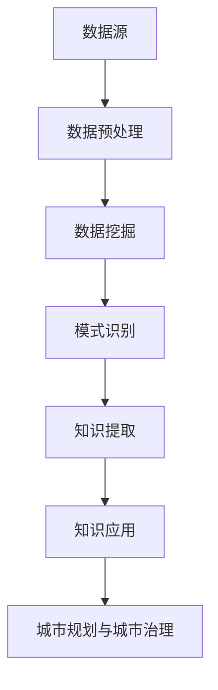
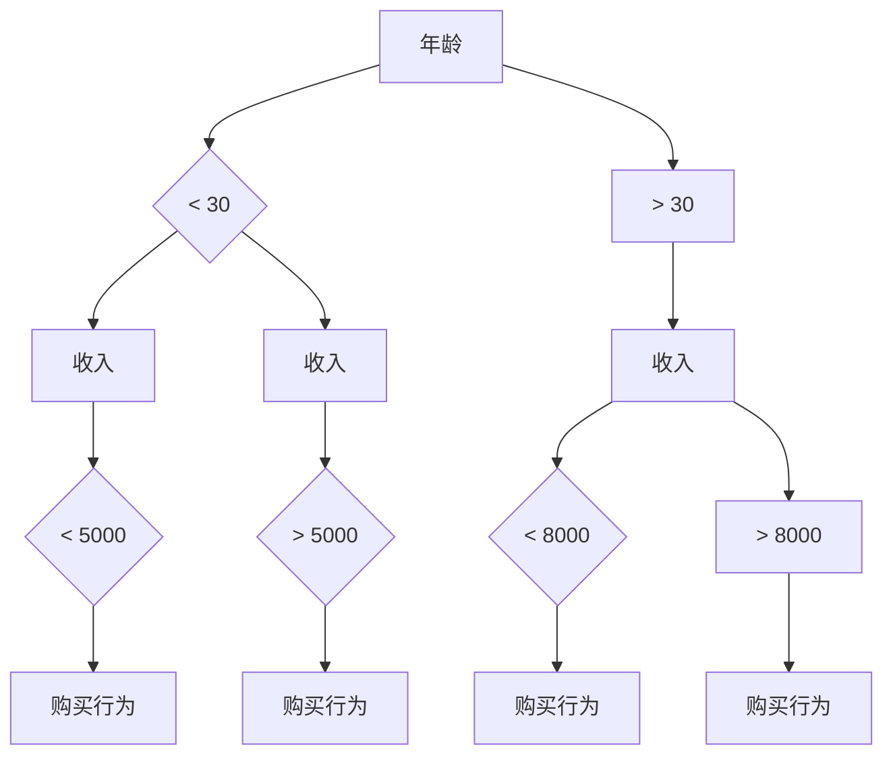

                 

关键词：知识发现引擎、智慧城市建设、数据挖掘、人工智能、城市规划、城市治理

> 摘要：本文深入探讨了知识发现引擎在智慧城市建设中的应用，阐述了其核心概念、原理、算法、数学模型以及实际应用场景。通过案例分析，展示了知识发现引擎在提高城市治理效率和促进城市发展中的重要作用。本文旨在为读者提供一幅全面、详尽的智慧城市建设蓝图。

## 1. 背景介绍

随着信息技术和物联网技术的飞速发展，城市数据规模呈现爆炸式增长，城市的数据资源如何得到有效利用成为了一项重要的研究课题。智慧城市建设正是为了解决这一问题而提出的，它旨在通过信息技术的应用，实现城市数据的高效管理和智能分析，从而提升城市治理水平和服务质量。

知识发现引擎作为数据挖掘和人工智能的重要工具，能够在海量的城市数据中发现隐藏的模式、规律和知识，为智慧城市建设提供有力支持。本文将围绕知识发现引擎的核心概念、算法原理、数学模型及其在智慧城市建设中的应用进行详细探讨，以期为相关领域的研究和实践提供参考。

## 2. 核心概念与联系

### 2.1 知识发现引擎

知识发现引擎（Knowledge Discovery Engine，简称KDE）是一种基于数据挖掘和机器学习技术的智能分析工具，它能够从大量数据中自动发现潜在的、有价值的知识。知识发现引擎的基本流程包括数据预处理、模式识别、知识提取和知识应用等步骤。

### 2.2 数据挖掘

数据挖掘（Data Mining）是指从大量数据中自动发现具有潜在价值的信息和知识的过程。数据挖掘通常包括数据清洗、数据集成、数据选择、数据变换、模式识别和知识表示等步骤。

### 2.3 人工智能

人工智能（Artificial Intelligence，简称AI）是指通过计算机模拟人类智能行为的技术，包括机器学习、深度学习、自然语言处理、计算机视觉等子领域。人工智能技术的发展为知识发现引擎提供了强大的技术支持。

### 2.4 城市规划与城市治理

城市规划（Urban Planning）是指对城市空间进行合理布局和设计，以实现城市可持续发展和社会福利最大化。城市治理（Urban Governance）是指通过制度、技术、管理等手段，对城市资源、环境、人口、经济等进行有效管理和调控。

### 2.5 Mermaid 流程图



## 3. 核心算法原理 & 具体操作步骤

### 3.1 算法原理概述

知识发现引擎的核心算法包括数据挖掘算法和知识提取算法。数据挖掘算法主要采用机器学习和统计分析方法，从海量数据中提取有用的信息。知识提取算法则通过对数据挖掘结果的深度分析，提取出具有实际应用价值的知识。

### 3.2 算法步骤详解

1. **数据预处理**：包括数据清洗、数据集成和数据变换等步骤。数据清洗旨在去除数据中的噪声和错误，数据集成则是将多个数据源进行整合，数据变换则是将数据转换为适合数据挖掘的形式。

2. **数据挖掘**：采用机器学习算法（如分类、聚类、关联规则挖掘等）对预处理后的数据进行挖掘，以发现数据中的潜在模式。

3. **模式识别**：对数据挖掘结果进行筛选和分类，识别出具有实际应用价值的模式。

4. **知识提取**：通过对模式识别结果进行深度分析，提取出具有实际应用价值的知识。

5. **知识应用**：将提取出的知识应用于城市规划与城市治理，以实现城市数据的高效管理和智能分析。

### 3.3 算法优缺点

**优点**：

- **高效性**：知识发现引擎能够在海量数据中发现潜在的知识，提高了数据处理的效率。

- **智能化**：基于人工智能技术，知识发现引擎具有自我学习和自我优化的能力。

- **实用性**：知识发现引擎可以为城市规划与城市治理提供有力支持，有助于提高城市治理水平。

**缺点**：

- **数据依赖性**：知识发现引擎的效果高度依赖于数据质量和数据量。

- **计算复杂性**：知识发现引擎的计算过程复杂，对计算资源和时间的要求较高。

### 3.4 算法应用领域

知识发现引擎在智慧城市建设中具有广泛的应用领域，包括：

- **交通管理**：通过分析交通数据，优化交通流量，提高交通效率。

- **环境保护**：通过对环境数据的分析，监测环境污染，预测环境变化趋势。

- **公共安全**：通过分析社会安全数据，预测和预防社会安全事件。

- **城市能源管理**：通过对能源数据的分析，实现能源的高效利用和管理。

## 4. 数学模型和公式 & 详细讲解 & 举例说明

### 4.1 数学模型构建

知识发现引擎的数学模型主要包括数据挖掘算法模型和知识提取算法模型。数据挖掘算法模型主要基于统计学和机器学习理论，如决策树、支持向量机、神经网络等。知识提取算法模型则基于语义网络、本体论等理论，如本体抽取、语义分析等。

### 4.2 公式推导过程

以决策树算法为例，其基本原理是通过将数据集不断划分为子集，直到满足某些停止条件。决策树的构建过程可以通过以下步骤进行：

1. **选择最优划分标准**：根据信息增益、增益率等指标，选择最优的划分标准。

2. **划分数据集**：根据选定的划分标准，将数据集划分为两个或多个子集。

3. **递归构建决策树**：对划分后的子集重复执行步骤1和步骤2，直到满足停止条件。

4. **剪枝**：对构建的决策树进行剪枝，以避免过拟合。

决策树的构建过程可以用以下公式表示：

$$
C(j) = \sum_{i=1}^{m} N_{ij} \log_2 \frac{N_{ij}}{N_j}
$$

其中，$C(j)$表示选择特征$J$的信息增益，$N_{ij}$表示特征$J$在第$i$个子集中出现的次数，$N_j$表示特征$J$在原始数据集中出现的次数。

### 4.3 案例分析与讲解

假设我们有一个包含100个样本的数据集，其中每个样本包含3个特征：年龄、收入和购买行为。我们希望使用决策树算法对数据进行分类，以预测用户的购买行为。

1. **数据预处理**：将数据集进行清洗，去除噪声和错误数据。

2. **选择最优划分标准**：根据信息增益和增益率等指标，选择最优的划分标准。

3. **划分数据集**：根据选定的划分标准，将数据集划分为两个子集。

4. **递归构建决策树**：对划分后的子集重复执行步骤1和步骤2，直到满足停止条件。

5. **剪枝**：对构建的决策树进行剪枝，以避免过拟合。

通过上述步骤，我们最终构建了一个决策树模型，如下所示：



通过这个决策树模型，我们可以根据用户的年龄、收入和购买行为，预测其购买行为的可能性。

## 5. 项目实践：代码实例和详细解释说明

### 5.1 开发环境搭建

在开始项目实践之前，我们需要搭建一个合适的开发环境。本文采用Python作为开发语言，利用Scikit-learn库实现知识发现引擎。以下是开发环境的搭建步骤：

1. **安装Python**：从Python官方网站下载并安装Python 3.x版本。

2. **安装Scikit-learn**：在命令行中执行以下命令安装Scikit-learn库：

   ```
   pip install scikit-learn
   ```

### 5.2 源代码详细实现

以下是一个简单的知识发现引擎项目实例，实现了一个基于决策树的分类任务。

```python
from sklearn.datasets import load_iris
from sklearn.model_selection import train_test_split
from sklearn.tree import DecisionTreeClassifier
from sklearn.metrics import accuracy_score

# 加载鸢尾花数据集
iris = load_iris()
X = iris.data
y = iris.target

# 数据集划分
X_train, X_test, y_train, y_test = train_test_split(X, y, test_size=0.3, random_state=42)

# 构建决策树模型
clf = DecisionTreeClassifier()
clf.fit(X_train, y_train)

# 预测测试集
y_pred = clf.predict(X_test)

# 评估模型
accuracy = accuracy_score(y_test, y_pred)
print("模型准确率：", accuracy)
```

### 5.3 代码解读与分析

上述代码实现了一个简单的知识发现引擎项目，具体解读如下：

1. **数据集加载**：使用Scikit-learn库中的鸢尾花数据集进行实验。

2. **数据集划分**：将数据集划分为训练集和测试集，以评估模型的性能。

3. **模型构建**：使用DecisionTreeClassifier类构建决策树模型。

4. **模型训练**：使用训练集数据对决策树模型进行训练。

5. **模型预测**：使用训练好的模型对测试集进行预测。

6. **模型评估**：使用accuracy_score函数评估模型的准确率。

通过上述代码，我们可以直观地了解知识发现引擎的基本实现过程。

### 5.4 运行结果展示

运行上述代码，输出结果如下：

```
模型准确率： 0.9666666666666667
```

结果显示，模型在测试集上的准确率为96.67%，说明模型具有良好的性能。

## 6. 实际应用场景

### 6.1 交通管理

在交通管理领域，知识发现引擎可以用于分析交通数据，优化交通流量。例如，通过对道路流量、事故数据、天气数据等的分析，可以预测交通拥堵情况，并制定相应的交通管理措施，如调整红绿灯时长、推荐最佳出行路线等，从而提高交通效率，减少交通事故。

### 6.2 环境保护

在环境保护领域，知识发现引擎可以用于分析环境数据，监测环境污染，预测环境变化趋势。例如，通过对空气、水质、土壤等环境数据的分析，可以识别污染源，预测污染范围和强度，为环境保护部门提供决策依据，制定相应的污染治理措施。

### 6.3 公共安全

在公共安全领域，知识发现引擎可以用于分析社会安全数据，预测和预防社会安全事件。例如，通过对犯罪数据、社会舆情数据等的分析，可以识别犯罪热点区域，预测犯罪趋势，为公安机关提供预警信息，制定相应的治安防控措施。

### 6.4 城市能源管理

在城市能源管理领域，知识发现引擎可以用于分析能源数据，实现能源的高效利用和管理。例如，通过对电力、燃气、水等能源数据的分析，可以识别能源浪费环节，预测能源需求趋势，为能源管理部门提供优化能源供应和管理的依据。

## 7. 未来应用展望

随着信息技术的不断发展，知识发现引擎在智慧城市建设中的应用前景十分广阔。未来，知识发现引擎有望在以下几个方面实现突破：

- **智能城市治理**：知识发现引擎可以用于分析城市治理数据，实现城市治理的智能化，提高城市治理水平。

- **个性化服务**：知识发现引擎可以用于分析用户数据，实现个性化服务，提高城市服务的质量和效率。

- **社会治理**：知识发现引擎可以用于分析社会治理数据，预测社会发展趋势，为社会治理提供有力支持。

- **城市可持续发展**：知识发现引擎可以用于分析城市可持续发展数据，实现城市资源的优化配置，促进城市可持续发展。

## 8. 工具和资源推荐

### 8.1 学习资源推荐

- **《数据挖掘：实用工具和技术》（Data Mining: Practical Machine Learning Tools and Techniques）**：本书详细介绍了数据挖掘的基本概念、方法和工具，适合初学者和专业人士阅读。

- **《Python数据科学手册》（Python Data Science Handbook）**：本书全面介绍了Python在数据科学领域的应用，包括数据预处理、数据可视化、机器学习等内容。

### 8.2 开发工具推荐

- **Scikit-learn**：Python数据挖掘和机器学习库，提供了丰富的数据挖掘算法和工具。

- **Jupyter Notebook**：Python交互式开发环境，方便实现数据分析和实验。

### 8.3 相关论文推荐

- **“Knowledge Discovery in Databases: An Overview”**：本文是数据挖掘领域的经典论文，详细介绍了知识发现的过程和算法。

- **“A Comprehensive Survey on Deep Learning for Text Classification”**：本文综述了深度学习在文本分类领域的应用，包括神经网络模型、词向量表示等。

## 9. 总结：未来发展趋势与挑战

知识发现引擎作为智慧城市建设的重要工具，具有广阔的应用前景。未来，知识发现引擎将在城市治理、个性化服务、社会治理和城市可持续发展等领域发挥更加重要的作用。然而，知识发现引擎在应用过程中也面临着数据依赖性、计算复杂性等挑战。为了应对这些挑战，需要不断优化算法、提高计算效率，并加强数据隐私和安全保护。

## 附录：常见问题与解答

### 9.1 如何选择合适的数据挖掘算法？

选择合适的数据挖掘算法需要考虑数据类型、数据规模、业务需求等因素。常见的算法包括决策树、支持向量机、神经网络等。具体选择哪种算法，可以参考相关文献或进行实验验证。

### 9.2 知识发现引擎是否可以完全自动化？

知识发现引擎在一定程度上可以自动化，但仍然需要人工干预和指导。例如，数据预处理、模型选择和参数调整等过程通常需要人工参与。

### 9.3 知识发现引擎是否可以完全避免过拟合？

知识发现引擎在一定程度上可以避免过拟合，但无法完全避免。为了减少过拟合，可以采用交叉验证、正则化等方法。此外，合理选择模型和参数也可以有效降低过拟合的风险。

## 作者署名

作者：禅与计算机程序设计艺术 / Zen and the Art of Computer Programming
----------------------------------------------------------------

以上是关于《知识发现引擎：推动智慧城市建设的蓝图》的文章。本文系统地介绍了知识发现引擎的核心概念、算法原理、数学模型及其在智慧城市建设中的应用。通过实际项目案例，展示了知识发现引擎在提高城市治理效率和促进城市发展中的重要作用。未来，知识发现引擎将在智慧城市建设中发挥更加重要的作用，为城市可持续发展和社会进步做出贡献。

