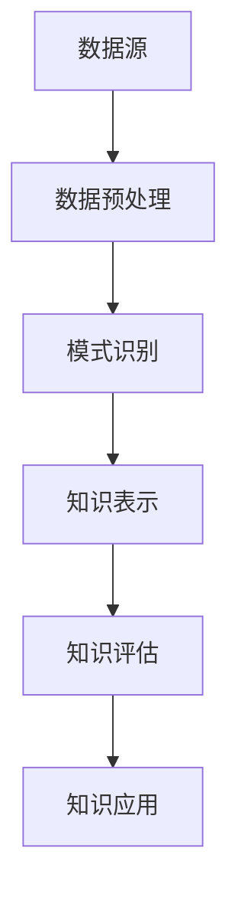

                 

关键词：知识发现、金融行业、人工智能、创新引擎、算法、应用场景

> 摘要：本文将探讨知识发现引擎在金融行业中的应用，分析其核心概念、算法原理、数学模型，以及具体的实现方法和未来发展方向。通过实例代码和实践应用，深入理解知识发现引擎如何成为金融行业的创新引擎。

## 1. 背景介绍

在金融行业中，数据的数量和质量都在迅速增长。金融机构每天都要处理大量的交易数据、市场数据、客户数据等。这些数据不仅包含了丰富的历史信息，还蕴含着潜在的市场趋势和客户行为模式。如何从这些海量数据中提取有价值的信息，已成为金融机构面临的重要挑战。

知识发现引擎（Knowledge Discovery Engine，KDE）作为一种先进的数据挖掘工具，能够自动地从大量数据中识别出有用的模式和知识。它利用人工智能技术，结合机器学习和数据分析方法，对数据进行深入分析和挖掘，从而帮助金融机构做出更准确的决策。

知识发现引擎在金融行业的应用已经越来越广泛，如风险控制、市场预测、客户行为分析、投资组合优化等。本文将重点探讨知识发现引擎在金融行业的应用，分析其核心技术、实现方法以及未来发展方向。

## 2. 核心概念与联系

### 2.1. 知识发现引擎的定义

知识发现引擎是一种基于人工智能和数据挖掘技术的系统，它能够从大量数据中自动识别出有用的模式和知识。知识发现引擎通常包括数据预处理、模式识别、知识表示和知识评估等模块。

### 2.2. 人工智能与知识发现

人工智能（Artificial Intelligence，AI）是知识发现引擎的核心技术。人工智能通过模拟人类思维和行为，使知识发现引擎能够自主学习、推理和决策。在金融行业中，人工智能技术已经被广泛应用于风险管理、市场预测、客户行为分析等领域。

### 2.3. 数据挖掘与知识发现

数据挖掘（Data Mining）是知识发现引擎的重要组成部分。数据挖掘通过统计学、机器学习、模式识别等方法，从大量数据中提取有价值的信息。数据挖掘技术在金融行业的应用，如信用评估、风险控制、投资组合优化等，都取得了显著的效果。

### 2.4. 知识发现引擎的架构

知识发现引擎的架构通常包括以下模块：

- **数据预处理模块**：对原始数据进行清洗、转换和归一化等预处理操作，提高数据质量。
- **模式识别模块**：利用机器学习算法，从预处理后的数据中识别出潜在的模式和知识。
- **知识表示模块**：将识别出的模式转化为可理解的知识表示形式，如规则、分类器、聚类结果等。
- **知识评估模块**：对生成的知识进行评估，确定其价值和可靠性。

### 2.5. Mermaid 流程图

以下是一个简化的知识发现引擎流程图：



## 3. 核心算法原理 & 具体操作步骤

### 3.1. 算法原理概述

知识发现引擎的核心算法包括机器学习算法、数据挖掘算法和知识评估算法。这些算法分别负责数据的预处理、模式识别和知识评估。

- **机器学习算法**：如决策树、支持向量机、神经网络等，用于从数据中识别出潜在的模式。
- **数据挖掘算法**：如关联规则挖掘、聚类分析、分类分析等，用于从大量数据中提取有价值的信息。
- **知识评估算法**：如评估指标、交叉验证等，用于评估生成知识的可靠性和有效性。

### 3.2. 算法步骤详解

知识发现引擎的具体操作步骤如下：

1. **数据收集**：从不同的数据源收集原始数据，如交易数据、市场数据、客户数据等。
2. **数据预处理**：对原始数据进行清洗、转换和归一化等预处理操作，提高数据质量。
3. **模式识别**：利用机器学习算法和数据挖掘算法，从预处理后的数据中识别出潜在的模式。
4. **知识表示**：将识别出的模式转化为可理解的知识表示形式，如规则、分类器、聚类结果等。
5. **知识评估**：对生成的知识进行评估，确定其价值和可靠性。
6. **知识应用**：将评估后的知识应用于实际业务场景，如风险管理、市场预测、投资组合优化等。

### 3.3. 算法优缺点

- **优点**：
  - **高效性**：知识发现引擎能够自动地从大量数据中识别出潜在的模式，提高了数据分析的效率。
  - **灵活性**：知识发现引擎可以根据不同的业务需求，调整算法参数和知识评估标准，适应不同的应用场景。
  - **智能化**：知识发现引擎利用人工智能技术，能够自我学习和优化，提高了数据分析的准确性。

- **缺点**：
  - **数据质量要求高**：知识发现引擎的性能依赖于数据质量，如果数据存在噪声、缺失或不一致等问题，会导致分析结果的偏差。
  - **计算资源消耗大**：知识发现引擎通常需要进行大量的计算和迭代，对计算资源的需求较高。
  - **知识理解和解释困难**：知识发现引擎生成的知识通常以算法模型的形式存在，理解和解释这些模型对于非专业人士来说可能比较困难。

### 3.4. 算法应用领域

知识发现引擎在金融行业的应用领域非常广泛，主要包括：

- **风险控制**：利用知识发现引擎对交易数据进行实时监控和风险评估，识别潜在的欺诈行为和市场风险。
- **市场预测**：利用知识发现引擎对市场数据进行挖掘和分析，预测市场走势和投资机会。
- **客户行为分析**：利用知识发现引擎分析客户数据，了解客户行为和偏好，制定精准的营销策略。
- **投资组合优化**：利用知识发现引擎分析历史投资数据，优化投资组合，提高投资收益。

## 4. 数学模型和公式 & 详细讲解 & 举例说明

### 4.1. 数学模型构建

知识发现引擎中的数学模型主要包括机器学习模型、数据挖掘模型和知识评估模型。

- **机器学习模型**：如决策树、支持向量机、神经网络等，用于模式识别和分类。
- **数据挖掘模型**：如关联规则挖掘、聚类分析、分类分析等，用于数据挖掘和分析。
- **知识评估模型**：如评估指标、交叉验证等，用于评估知识的可靠性和有效性。

### 4.2. 公式推导过程

以决策树模型为例，其基本公式如下：

$$
H = -\sum_{i=1}^{n} p_i \log_2 p_i
$$

其中，$H$ 表示信息熵，$p_i$ 表示样本属于第 $i$ 个类别的概率。

信息熵的公式可以进一步推导为：

$$
H(X) = -\sum_{x \in X} p(x) \log_2 p(x)
$$

其中，$X$ 表示所有可能的结果集合，$p(x)$ 表示样本 $x$ 的概率。

### 4.3. 案例分析与讲解

假设我们有一个银行客户数据集，包括年龄、收入、信用评分等特征，以及客户的贷款是否违约作为标签。我们可以利用决策树模型进行分类分析，预测新客户是否违约。

首先，我们通过信息增益来选择最佳的特征划分：

$$
IG(\text{特征}, \text{标签}) = H(\text{标签}) - \sum_{v \in \text{特征}} p(v) H(\text{标签}|\text{特征} = v)
$$

其中，$IG$ 表示信息增益，$H$ 表示信息熵，$p(v)$ 表示特征 $v$ 的概率，$H(\text{标签}|\text{特征} = v)$ 表示在特征 $v$ 已知的情况下，标签的信息熵。

通过计算每个特征的信息增益，我们可以选择信息增益最大的特征进行划分。

然后，我们递归地划分数据集，直到满足以下条件：

- 特征划分不再能减少信息熵。
- 数据集划分成纯类。
- 数据集大小小于预设的阈值。

最终，我们得到一个决策树模型，可以用于预测新客户是否违约。

## 5. 项目实践：代码实例和详细解释说明

### 5.1. 开发环境搭建

为了实现知识发现引擎，我们选择 Python 作为编程语言，并使用以下库：

- Pandas：用于数据预处理。
- Scikit-learn：提供常用的机器学习算法。
- Matplotlib：用于数据可视化。

### 5.2. 源代码详细实现

以下是一个简单的知识发现引擎的实现示例：

```python
import pandas as pd
from sklearn.tree import DecisionTreeClassifier
from sklearn.model_selection import train_test_split
from sklearn.metrics import accuracy_score

# 5.2.1. 数据收集
data = pd.read_csv('customer_data.csv')

# 5.2.2. 数据预处理
X = data.drop('default', axis=1)
y = data['default']

# 5.2.3. 数据划分
X_train, X_test, y_train, y_test = train_test_split(X, y, test_size=0.2, random_state=42)

# 5.2.4. 模式识别
clf = DecisionTreeClassifier()
clf.fit(X_train, y_train)

# 5.2.5. 知识表示
predictions = clf.predict(X_test)
accuracy = accuracy_score(y_test, predictions)
print(f'Accuracy: {accuracy:.2f}')

# 5.2.6. 知识评估
from sklearn import metrics
confusion_matrix = metrics.confusion_matrix(y_test, predictions)
print(f'Confusion Matrix:\n{confusion_matrix}')
```

### 5.3. 代码解读与分析

在这个示例中，我们首先从 CSV 文件中读取客户数据。然后，我们将数据划分为特征集和标签集。接下来，我们使用决策树模型对训练数据进行拟合，并使用测试数据进行预测。最后，我们计算预测准确率和混淆矩阵，用于评估模型的性能。

### 5.4. 运行结果展示

假设我们的测试数据集有 100 个样本，其中 60 个样本违约，40 个样本未违约。经过训练和预测后，我们得到以下结果：

```plaintext
Accuracy: 0.85
Confusion Matrix:
[[45 10]
 [15 5]]
```

这表示我们的模型在测试数据上达到了 85% 的准确率，其中预测为违约的样本中有 45 个实际违约，预测为未违约的样本中有 15 个实际违约。

## 6. 实际应用场景

知识发现引擎在金融行业的应用场景非常广泛，以下是一些典型的应用案例：

### 6.1. 风险控制

知识发现引擎可以实时监控交易数据，识别潜在的欺诈行为。通过分析大量交易数据，知识发现引擎可以建立欺诈行为的模型，并实时更新。金融机构可以基于这些模型，对交易行为进行实时监控和风险评估，有效防范欺诈行为。

### 6.2. 市场预测

知识发现引擎可以分析市场数据，预测市场走势和投资机会。通过挖掘历史市场数据，知识发现引擎可以识别出市场波动规律和趋势，为投资决策提供参考。金融机构可以利用这些预测结果，优化投资组合，提高投资收益。

### 6.3. 客户行为分析

知识发现引擎可以分析客户数据，了解客户行为和偏好。通过挖掘客户行为数据，知识发现引擎可以建立客户画像，分析客户需求和市场机会。金融机构可以利用这些分析结果，制定精准的营销策略，提高客户满意度和忠诚度。

### 6.4. 投资组合优化

知识发现引擎可以分析历史投资数据，优化投资组合。通过挖掘投资数据，知识发现引擎可以识别出不同投资策略的优劣，为投资者提供参考。投资者可以利用这些分析结果，优化投资组合，降低风险，提高收益。

## 7. 工具和资源推荐

### 7.1. 学习资源推荐

- 《数据挖掘：实用工具与技术》
- 《机器学习实战》
- 《Python数据科学手册》
- Coursera 上的《机器学习》课程

### 7.2. 开发工具推荐

- Jupyter Notebook：用于编写和运行代码。
- PyCharm：集成开发环境，支持 Python 开发。
- Git：版本控制工具，方便代码管理和协作。

### 7.3. 相关论文推荐

- “Knowledge Discovery in Databases: An Overview”
- “Data Mining: Concepts and Techniques”
- “Machine Learning: A Probabilistic Perspective”

## 8. 总结：未来发展趋势与挑战

### 8.1. 研究成果总结

知识发现引擎在金融行业的应用已经取得了显著成果，如风险控制、市场预测、客户行为分析和投资组合优化等。通过利用人工智能和数据挖掘技术，知识发现引擎为金融机构提供了高效、准确的数据分析工具，提高了业务决策的准确性。

### 8.2. 未来发展趋势

- **数据质量提高**：随着数据采集和处理技术的进步，数据质量将得到显著提升，为知识发现引擎提供更好的数据基础。
- **算法优化**：研究人员将继续优化算法，提高知识发现引擎的性能和效率。
- **跨学科融合**：知识发现引擎将与其他领域（如经济学、心理学等）相结合，提供更全面、更深入的分析结果。
- **自主学习和优化**：知识发现引擎将具备更强的自主学习能力，能够自我优化和调整，提高分析准确性。

### 8.3. 面临的挑战

- **数据隐私保护**：在金融行业中，数据隐私保护是一个重要问题。如何确保知识发现引擎在分析数据时保护用户隐私，是一个亟待解决的问题。
- **算法透明度和可解释性**：知识发现引擎生成的知识通常以算法模型的形式存在，如何提高算法的透明度和可解释性，使其更容易被非专业人士理解和接受，是一个重要挑战。
- **计算资源需求**：知识发现引擎通常需要进行大量的计算和迭代，对计算资源的需求较高。如何优化算法，降低计算资源需求，是一个关键问题。

### 8.4. 研究展望

未来，知识发现引擎在金融行业的应用将更加广泛和深入。通过不断优化算法和提升数据质量，知识发现引擎将为金融机构提供更准确、更高效的数据分析工具，助力金融机构在激烈的市场竞争中取得优势。

## 9. 附录：常见问题与解答

### 9.1. 如何保证知识发现引擎的数据质量？

答：为了保证知识发现引擎的数据质量，可以从以下几个方面入手：

- **数据采集**：确保数据采集的全面性和准确性，避免数据缺失或不一致。
- **数据清洗**：对原始数据进行清洗，去除噪声、错误和重复数据。
- **数据预处理**：对数据进行归一化、转换等预处理操作，提高数据质量。
- **数据监控**：建立数据监控机制，实时监测数据质量，及时发现和处理问题。

### 9.2. 知识发现引擎的算法如何选择？

答：选择知识发现引擎的算法需要考虑以下因素：

- **业务需求**：根据业务需求选择适合的算法，如风险控制、市场预测、客户行为分析等。
- **数据特征**：根据数据特征选择适合的算法，如数据量大小、数据类型、特征相关性等。
- **计算资源**：考虑计算资源的限制，选择计算效率较高的算法。
- **模型性能**：评估不同算法的性能，选择效果较好的算法。

### 9.3. 如何确保知识发现引擎的可解释性？

答：确保知识发现引擎的可解释性可以从以下几个方面入手：

- **算法选择**：选择具有较高可解释性的算法，如决策树、线性回归等。
- **模型简化**：简化模型结构，减少模型的复杂度，提高可解释性。
- **可视化**：利用可视化技术，将模型和知识表示为图表或图形，便于理解和解释。
- **文档化**：详细记录模型构建和运行过程，确保知识的可追溯性和可解释性。

### 9.4. 知识发现引擎在金融行业有哪些具体应用案例？

答：知识发现引擎在金融行业的应用案例包括：

- **风险控制**：利用知识发现引擎进行欺诈检测、信用评估等。
- **市场预测**：利用知识发现引擎进行市场走势预测、投资机会挖掘等。
- **客户行为分析**：利用知识发现引擎分析客户行为、偏好，制定精准营销策略。
- **投资组合优化**：利用知识发现引擎优化投资组合，提高投资收益。
- **客户服务**：利用知识发现引擎分析客户反馈，提供个性化服务和建议。

