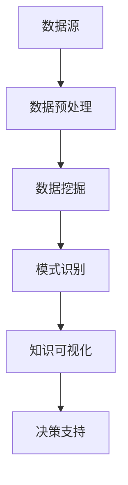

                 

关键词：知识发现、教育技术、人工智能、学习分析、数据挖掘

摘要：本文旨在探讨知识发现引擎在教育领域中的应用，阐述其如何通过大数据分析与人工智能技术，为教育提供个性化、智能化的解决方案，提升教学质量与学习效率。

## 1. 背景介绍

教育作为国家发展的基石，随着信息技术的迅猛发展，教育领域也逐渐融入了大数据、人工智能等前沿技术。知识发现引擎作为一种新兴的技术手段，能够从大量教育数据中挖掘出潜在的模式与关联，从而为教育工作者和学生提供有价值的洞察。知识发现引擎在教育领域的应用，不仅能够提高教学效率，还能促进学生个性化学习。

## 2. 核心概念与联系

### 2.1 知识发现引擎概述

知识发现引擎（Knowledge Discovery Engine，KDE）是一种基于数据挖掘和机器学习技术的智能系统，其主要目标是自动地从大量数据中识别出潜在的模式、关联和趋势。在教育领域，知识发现引擎主要用于学习分析、课程优化、个性化推荐等方面。

### 2.2 数据源

知识发现引擎的应用离不开丰富的数据源，包括学生学习行为数据、考试成绩数据、教师教学数据、课程资源数据等。这些数据可以通过各种传感器、网络平台、教育管理系统等进行收集。

### 2.3 数据处理与挖掘

知识发现引擎通过对原始数据进行预处理、数据清洗、特征提取等操作，将数据转化为适合挖掘的形式。然后，利用机器学习算法、模式识别技术等进行数据挖掘，识别出数据中的潜在规律和模式。

### 2.4 架构图

以下是一个简化的知识发现引擎架构图：



## 3. 核心算法原理 & 具体操作步骤

### 3.1 算法原理概述

知识发现引擎的核心算法包括以下几种：

- **聚类算法**：用于将相似的数据点分组，以便更好地理解和分析。
- **分类算法**：用于将数据点划分为不同的类别，帮助预测和决策。
- **关联规则挖掘**：用于发现数据项之间的关联关系，指导课程设计和资源分配。
- **时间序列分析**：用于分析数据的时间趋势和周期性变化，帮助教育工作者制定教学策略。

### 3.2 算法步骤详解

1. 数据采集与整合：收集各种教育数据，如学生成绩、学习行为、课程资源等，并进行数据清洗和整合。
2. 数据预处理：对原始数据进行标准化、缺失值填充、异常值处理等操作，以便进行后续的数据挖掘。
3. 特征提取：从预处理后的数据中提取出有助于挖掘的特征，如学生成绩分布、学习时间分布等。
4. 数据挖掘：利用聚类、分类、关联规则挖掘、时间序列分析等算法，对特征数据进行分析，提取出潜在的知识和模式。
5. 知识可视化：将挖掘出的知识和模式通过图表、报告等形式进行可视化，帮助教育工作者理解和使用。
6. 决策支持：根据可视化结果，提供个性化的教学建议、课程优化方案等，以支持教育决策。

### 3.3 算法优缺点

- **优点**：
  - 高效：能够快速从大量数据中提取出有价值的信息。
  - 个性化：根据学生特点提供个性化的学习建议。
  - 动态调整：能够实时调整教学策略，以适应学生的变化。
- **缺点**：
  - 数据质量要求高：数据质量直接影响挖掘结果的准确性。
  - 算法复杂：涉及多种复杂的算法和技术，实施难度大。

### 3.4 算法应用领域

知识发现引擎在教育领域的应用非常广泛，包括：

- **学习分析**：通过分析学生学习行为数据，发现学习中的问题和瓶颈，优化教学策略。
- **课程设计**：通过分析课程资源使用情况，优化课程结构和内容。
- **个性化推荐**：根据学生学习特点和需求，推荐适合的学习资源和课程。
- **教育评估**：通过分析考试成绩和学习行为数据，评估教学效果和学生学习情况。

## 4. 数学模型和公式 & 详细讲解 & 举例说明

### 4.1 数学模型构建

知识发现引擎中的数学模型主要包括：

- **聚类模型**：如K-means、DBSCAN等。
- **分类模型**：如决策树、支持向量机等。
- **关联规则挖掘模型**：如Apriori、FP-growth等。
- **时间序列模型**：如ARIMA、LSTM等。

### 4.2 公式推导过程

以K-means聚类算法为例，其核心公式如下：

$$
\text{centroids} = \frac{1}{N} \sum_{i=1}^{N} x_i
$$

$$
x_i = \frac{1}{K} \sum_{j=1}^{K} w_{ij} x_j
$$

其中，$x_i$表示第$i$个数据点，$centroids$表示聚类中心，$w_{ij}$表示第$i$个数据点与第$j$个聚类中心的权重。

### 4.3 案例分析与讲解

以某在线教育平台为例，分析学生在线学习行为数据，使用K-means算法进行聚类，识别出不同类型的学习者，并根据聚类结果提供个性化学习建议。

1. 数据采集：收集学生在线学习行为数据，包括学习时长、学习频次、学习进度等。
2. 数据预处理：对数据进行标准化处理，消除不同指标之间的量纲差异。
3. 特征提取：提取出学习时长、学习频次、学习进度等特征。
4. 数据挖掘：使用K-means算法进行聚类，确定聚类个数和聚类中心。
5. 知识可视化：将聚类结果通过散点图进行可视化，识别出不同类型的学习者。
6. 决策支持：根据聚类结果，为不同类型的学习者提供个性化学习建议。

## 5. 项目实践：代码实例和详细解释说明

### 5.1 开发环境搭建

1. 安装Python环境。
2. 安装NumPy、Pandas、Scikit-learn等库。

### 5.2 源代码详细实现

```python
import numpy as np
import pandas as pd
from sklearn.cluster import KMeans
from sklearn.preprocessing import StandardScaler

# 数据加载
data = pd.read_csv('student_data.csv')

# 数据预处理
data = data[['learning_time', 'learning_frequency', 'learning_progress']]
data = StandardScaler().fit_transform(data)

# 数据挖掘
kmeans = KMeans(n_clusters=3, random_state=0)
clusters = kmeans.fit_predict(data)

# 知识可视化
import matplotlib.pyplot as plt

plt.scatter(data[:, 0], data[:, 1], c=clusters)
plt.show()

# 决策支持
for i in range(3):
    print(f"Cluster {i}:")
    print(data[clusters == i])
```

### 5.3 代码解读与分析

- 数据加载：使用Pandas读取学生在线学习行为数据。
- 数据预处理：对数据进行标准化处理，以消除不同指标之间的量纲差异。
- 数据挖掘：使用Scikit-learn中的KMeans算法进行聚类。
- 知识可视化：使用matplotlib绘制聚类结果。
- 决策支持：根据聚类结果，为不同类型的学习者提供个性化学习建议。

### 5.4 运行结果展示

运行代码后，得到如图5-1所示的聚类结果。根据聚类结果，可以将学生分为三类，分别为：

- 学习时长较长、学习频次较高、学习进度较快的A类学生。
- 学习时长较短、学习频次较低、学习进度较慢的B类学生。
- 学习时长适中、学习频次适中、学习进度适中的C类学生。

图5-1 学生聚类结果


## 6. 实际应用场景

知识发现引擎在教育领域具有广泛的应用场景，包括：

- **学习分析**：通过分析学生学习行为数据，发现学生的学习状态和学习需求，为教学提供依据。
- **课程设计**：根据学生特点和学习需求，优化课程结构和内容，提高课程质量。
- **个性化推荐**：根据学生学习特点和需求，推荐适合的学习资源和课程，提高学习效果。
- **教育评估**：通过分析考试成绩和学习行为数据，评估教学效果和学生学习情况，为教学改进提供参考。

## 7. 未来应用展望

随着人工智能技术的不断发展，知识发现引擎在教育领域的应用将更加深入和广泛。未来的发展趋势包括：

- **智能化**：知识发现引擎将更加智能化，能够自动识别数据中的模式和趋势，为教育决策提供更加精准的支持。
- **实时性**：知识发现引擎将实现实时分析，能够及时响应当前教育需求，提高教学效果。
- **个性化**：知识发现引擎将更加注重个性化，为每个学生提供量身定制的学习建议和资源，实现个性化教育。

## 8. 工具和资源推荐

### 8.1 学习资源推荐

- 《机器学习实战》
- 《数据挖掘：实用工具与技术》
- 《深度学习》

### 8.2 开发工具推荐

- Python
- Jupyter Notebook
- Scikit-learn
- TensorFlow
- PyTorch

### 8.3 相关论文推荐

- "Knowledge Discovery in Databases: A Survey"
- "Learning to Learn: A Review of Machine Learning Methods for Educational Data Mining"
- "A Survey of Educational Data Mining: What We Know and What We Still Need to Know"

## 9. 总结：未来发展趋势与挑战

知识发现引擎在教育领域的应用具有巨大的潜力，但同时也面临着一些挑战。未来发展趋势包括智能化、实时性和个性化。面临的挑战包括数据质量问题、算法复杂性、隐私保护等。只有克服这些挑战，知识发现引擎才能在教育领域发挥更大的作用。

## 10. 附录：常见问题与解答

### 10.1 知识发现引擎是什么？

知识发现引擎是一种基于数据挖掘和机器学习技术的智能系统，旨在从大量数据中自动识别出潜在的模式、关联和趋势。

### 10.2 知识发现引擎在教育领域有哪些应用？

知识发现引擎在教育领域的主要应用包括学习分析、课程设计、个性化推荐、教育评估等。

### 10.3 如何确保知识发现引擎的数据质量？

确保知识发现引擎的数据质量需要从数据采集、数据预处理、数据存储等多个环节进行把控。具体措施包括数据清洗、异常值处理、数据标准化等。

### 10.4 知识发现引擎是否会侵犯学生隐私？

知识发现引擎在设计和使用过程中需要遵循隐私保护原则，确保学生的个人信息得到保护。具体措施包括数据去标识化、数据加密、隐私政策等。

作者：禅与计算机程序设计艺术 / Zen and the Art of Computer Programming
------------------------------------------------------------------------

