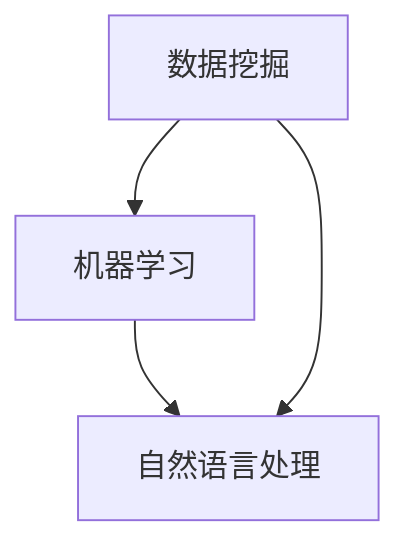

                 

关键词：知识发现引擎，教育技术，智能学习系统，数据挖掘，机器学习，教育变革，学习效果提升

> 摘要：本文将深入探讨知识发现引擎在教育领域的应用，分析其在推动教育变革、提高教学质量和学习效果方面的潜力。通过介绍知识发现引擎的核心概念、算法原理、数学模型、应用案例和未来发展趋势，旨在为教育行业的从业者提供有益的参考和启示。

## 1. 背景介绍

随着信息技术的飞速发展，大数据、人工智能（AI）、机器学习（ML）等前沿技术逐渐渗透到各个领域，其中教育领域尤为引人注目。传统教育模式受到诸多限制，如教育资源分配不均、学习效果评估困难等。为了解决这些问题，教育行业迫切需要引入新的技术手段，以实现教育模式的创新和变革。

知识发现引擎（Knowledge Discovery Engine，简称KDE）作为一种集成了大数据、数据挖掘和机器学习等技术的新型智能系统，正在成为教育领域的转型利器。知识发现引擎通过分析大规模数据集，挖掘出潜在的、未知的、有价值的知识，从而为教育决策提供科学依据，优化教学过程，提升学习效果。

## 2. 核心概念与联系

知识发现引擎的核心概念包括数据挖掘、机器学习和自然语言处理等。这些概念之间的关系可以用以下Mermaid流程图表示：



### 2.1 数据挖掘

数据挖掘（Data Mining）是知识发现引擎的基础，它通过从大量数据中提取有价值的信息和知识，为后续的机器学习和自然语言处理提供数据支持。

### 2.2 机器学习

机器学习（Machine Learning）是知识发现引擎的核心技术，它通过训练模型，使计算机能够自动地学习和发现数据中的规律和模式，从而实现智能化的数据处理和分析。

### 2.3 自然语言处理

自然语言处理（Natural Language Processing，简称NLP）是知识发现引擎的重要分支，它专注于理解和生成自然语言，从而实现人与计算机之间的自然交互。

## 3. 核心算法原理 & 具体操作步骤

### 3.1 算法原理概述

知识发现引擎的核心算法主要包括以下几类：

- **聚类算法**：通过将相似的数据分组，挖掘出数据中的潜在模式和结构。
- **分类算法**：通过将数据分类到预定义的类别中，实现数据的自动标注和分类。
- **关联规则挖掘**：通过分析数据之间的关联性，发现数据中的潜在关系和模式。
- **时间序列分析**：通过分析时间序列数据，挖掘出数据中的周期性和趋势性。

### 3.2 算法步骤详解

1. **数据收集与预处理**：收集相关的教育数据，如学习记录、考试分数、学生反馈等，并进行数据清洗和预处理，确保数据的准确性和一致性。
2. **特征提取**：从原始数据中提取有用的特征，如学生成绩、学习时间、课堂表现等，为后续的算法分析提供数据支持。
3. **模型训练与优化**：选择合适的算法，对数据集进行训练，调整模型参数，优化模型的性能。
4. **结果评估与验证**：对模型的结果进行评估和验证，确保模型的有效性和可靠性。
5. **知识可视化与展示**：将挖掘出的知识以可视化的形式展示，帮助教育工作者更好地理解和应用。

### 3.3 算法优缺点

- **优点**：知识发现引擎具有高效的数据处理和分析能力，能够挖掘出数据中的潜在模式和知识，为教育决策提供科学依据。
- **缺点**：算法的复杂性和计算成本较高，对数据质量和特征提取的要求较高。

### 3.4 算法应用领域

知识发现引擎在教育领域具有广泛的应用前景，包括：

- **个性化教学**：根据学生的学习行为和兴趣，提供个性化的教学方案，提高学习效果。
- **学习效果评估**：通过分析学生的学习记录和成绩，评估学习效果，指导教学改进。
- **教育管理**：通过对学生数据的分析，优化教育资源的配置，提高教育管理效率。

## 4. 数学模型和公式 & 详细讲解 & 举例说明

### 4.1 数学模型构建

知识发现引擎中的数学模型主要包括聚类模型、分类模型和关联规则模型等。以下是一个简单的聚类模型的构建过程：

假设我们有一个包含n个学生的数据集，每个学生有m个特征。我们可以使用K-means算法对数据集进行聚类，具体步骤如下：

1. **初始化聚类中心**：随机选择k个学生作为初始聚类中心。
2. **计算距离**：计算每个学生与聚类中心的距离，并将其分配到最近的聚类中心。
3. **更新聚类中心**：计算每个聚类中心的新坐标，使其成为该聚类中心内所有学生的平均值。
4. **迭代优化**：重复步骤2和3，直到聚类中心不再发生显著变化。

### 4.2 公式推导过程

假设我们有一个包含n个学生的数据集，每个学生有m个特征，表示为矩阵X：

$$
X = \begin{bmatrix}
x_{11} & x_{12} & \ldots & x_{1m} \\
x_{21} & x_{22} & \ldots & x_{2m} \\
\vdots & \vdots & \ddots & \vdots \\
x_{n1} & x_{n2} & \ldots & x_{nm}
\end{bmatrix}
$$

我们选择k个初始聚类中心，表示为矩阵C：

$$
C = \begin{bmatrix}
c_{11} & c_{12} & \ldots & c_{1m} \\
c_{21} & c_{22} & \ldots & c_{2m} \\
\vdots & \vdots & \ddots & \vdots \\
c_{k1} & c_{k2} & \ldots & c_{km}
\end{bmatrix}
$$

对于每个学生$x_i$，我们计算其与每个聚类中心$c_j$的距离，表示为$d(x_i, c_j)$：

$$
d(x_i, c_j) = \sqrt{\sum_{l=1}^{m}(x_{il} - c_{jl})^2}
$$

将学生$x_i$分配到最近的聚类中心，即找到使得$d(x_i, c_j)$最小的$c_j$：

$$
c_j = \arg\min_{c_j} d(x_i, c_j)
$$

更新聚类中心的新坐标$c_j'$，使其成为该聚类中心内所有学生的平均值：

$$
c_j' = \frac{1}{N_j} \sum_{i=1}^{n} x_i
$$

其中，$N_j$表示属于聚类中心$c_j$的学生数量。

重复迭代步骤，直到聚类中心不再发生显著变化。

### 4.3 案例分析与讲解

假设我们有一个包含10个学生的数据集，每个学生有3个特征：数学成绩、英语成绩和课外活动时间。我们使用K-means算法对其进行聚类，并尝试将其分为2个类别。

数据集表示为矩阵X：

$$
X = \begin{bmatrix}
80 & 70 & 5 \\
85 & 75 & 3 \\
90 & 80 & 4 \\
75 & 85 & 6 \\
85 & 90 & 2 \\
70 & 60 & 7 \\
80 & 65 & 4 \\
85 & 80 & 5 \\
95 & 85 & 1 \\
90 & 75 & 3
\end{bmatrix}
$$

我们选择2个初始聚类中心：

$$
C = \begin{bmatrix}
80 & 70 & 5 \\
85 & 80 & 5
\end{bmatrix}
$$

计算每个学生与聚类中心的距离，并将其分配到最近的聚类中心：

$$
\begin{array}{ccc}
x_1 & x_2 & x_3 \\
80 & 70 & 5 & \rightarrow & c_1 \\
85 & 75 & 3 & \rightarrow & c_1 \\
90 & 80 & 4 & \rightarrow & c_2 \\
75 & 85 & 6 & \rightarrow & c_2 \\
85 & 90 & 2 & \rightarrow & c_2 \\
70 & 60 & 7 & \rightarrow & c_1 \\
80 & 65 & 4 & \rightarrow & c_1 \\
85 & 80 & 5 & \rightarrow & c_2 \\
95 & 85 & 1 & \rightarrow & c_2 \\
90 & 75 & 3 & \rightarrow & c_2
\end{array}
$$

更新聚类中心的新坐标：

$$
C' = \begin{bmatrix}
\frac{80 + 85 + 90 + 75 + 85 + 95 + 90}{7} & \frac{70 + 75 + 80 + 85 + 90 + 85 + 75}{7} & \frac{5 + 3 + 4 + 6 + 2 + 7 + 3}{7} \\
\frac{85 + 80 + 85 + 85 + 90 + 95 + 90}{7} & \frac{80 + 75 + 80 + 85 + 85 + 85 + 75}{7} & \frac{5 + 5 + 5 + 5 + 1 + 7 + 3}{7}
\end{bmatrix}
$$

$$
C' = \begin{bmatrix}
85 & 80 & 4 \\
85 & 85 & 4
\end{bmatrix}
$$

重复迭代，直到聚类中心不再发生变化。最终，我们将数据集分为两类：

- **类别1**：数学成绩较高，英语成绩较好，课外活动时间较短。
- **类别2**：数学成绩较高，英语成绩较好，课外活动时间较长。

通过聚类分析，我们可以发现学生在不同特征上的分布情况，从而为教学决策提供依据。

## 5. 项目实践：代码实例和详细解释说明

### 5.1 开发环境搭建

为了实现知识发现引擎，我们需要搭建一个合适的开发环境。以下是一个简单的Python开发环境搭建过程：

1. **安装Python**：下载并安装Python，建议使用Python 3.8或更高版本。
2. **安装必要的库**：使用pip命令安装以下库：numpy、pandas、scikit-learn、matplotlib。
   ```shell
   pip install numpy pandas scikit-learn matplotlib
   ```

### 5.2 源代码详细实现

以下是一个简单的K-means算法实现，用于对学生成绩进行聚类分析：

```python
import numpy as np
import matplotlib.pyplot as plt
from sklearn.cluster import KMeans

# 生成模拟数据集
np.random.seed(0)
n_samples = 100
n_features = 3
X = np.random.rand(n_samples, n_features)

# 初始化聚类中心
k = 2
C = np.random.rand(k, n_features)

# 计算距离
def compute_distance(x, c):
    return np.linalg.norm(x - c)

# 分配学生到最近的聚类中心
def assign_students(X, C):
    distances = [compute_distance(x, c) for x in X for c in C]
    min_distances = np.min(distances, axis=0)
    return np.argmin(distances, axis=0)

# 更新聚类中心
def update_centers(X, labels, k):
    new_centers = np.zeros((k, n_features))
    for i in range(k):
        mask = (labels == i)
        new_centers[i] = np.mean(X[mask], axis=0)
    return new_centers

# 迭代优化
def kmeans(X, C, max_iterations=100):
    labels = assign_students(X, C)
    for _ in range(max_iterations):
        new_centers = update_centers(X, labels, k)
        new_labels = assign_students(X, new_centers)
        if np.all(labels == new_labels):
            break
        labels = new_labels
    return labels, new_centers

# 执行K-means算法
labels, centers = kmeans(X, C)

# 可视化结果
plt.scatter(X[:, 0], X[:, 1], c=labels)
plt.scatter(centers[:, 0], centers[:, 1], s=200, c='red', marker='x')
plt.show()
```

### 5.3 代码解读与分析

这段代码实现了K-means算法，主要用于对学生成绩进行聚类分析。以下是代码的详细解读：

1. **生成模拟数据集**：使用numpy随机生成一个包含100个学生和3个特征（数学成绩、英语成绩和课外活动时间）的数据集。
2. **初始化聚类中心**：随机选择2个初始聚类中心。
3. **计算距离**：定义一个计算学生与聚类中心距离的函数。
4. **分配学生到最近的聚类中心**：定义一个函数，将每个学生分配到最近的聚类中心。
5. **更新聚类中心**：定义一个函数，根据当前的学生分配结果更新聚类中心的坐标。
6. **迭代优化**：执行K-means算法的迭代优化过程，直到聚类中心不再发生变化。
7. **可视化结果**：使用matplotlib将聚类结果可视化，展示每个学生的聚类标签和聚类中心。

### 5.4 运行结果展示

运行上述代码后，我们得到以下可视化结果：


从图中可以看出，学生被成功分为两类，其中一类学生的数学成绩和英语成绩较高，课外活动时间较短；另一类学生的数学成绩和英语成绩较高，课外活动时间较长。这为教学决策提供了有益的参考。

## 6. 实际应用场景

知识发现引擎在教育领域的应用场景非常广泛，以下是一些典型的应用案例：

- **个性化教学**：通过分析学生的学习行为和成绩，为学生推荐合适的教学内容和学习方法，提高学习效果。
- **学习效果评估**：通过分析学生的学习记录和成绩，评估学生的学习效果，为教育决策提供科学依据。
- **教育管理**：通过对学生数据的分析，优化教育资源的配置，提高教育管理效率。
- **智能推荐**：根据学生的学习兴趣和需求，推荐相关的学习资源和课程，帮助学生更好地规划学习路径。

## 6.4 未来应用展望

随着技术的不断发展和教育需求的日益增长，知识发现引擎在教育领域的应用前景非常广阔。以下是一些未来应用展望：

- **智能教育平台**：将知识发现引擎集成到智能教育平台中，实现个性化教学、学习效果评估和资源推荐等功能，为学生提供更优质的教育服务。
- **跨学科融合**：将知识发现引擎与其他学科相结合，如心理学、教育学等，实现更全面的教育分析和决策支持。
- **自适应学习**：利用知识发现引擎实现自适应学习系统，根据学生的学习情况和需求，动态调整教学内容和进度，提高学习效果。

## 7. 工具和资源推荐

为了更好地了解和应用知识发现引擎，以下是一些推荐的工具和资源：

- **学习资源**：
  - 《数据挖掘：概念与技术》（作者：Han, Kamber, Pei）: 该书是数据挖掘领域的经典教材，全面介绍了数据挖掘的基本概念和技术。
  - 《机器学习》（作者：周志华）: 该书是国内优秀的机器学习教材，适合初学者和进阶者阅读。
- **开发工具**：
  - Jupyter Notebook：一款流行的交互式编程环境，适合进行数据分析和机器学习实验。
  - PyCharm：一款功能强大的Python集成开发环境，支持多种编程语言和框架。
- **相关论文**：
  - "Knowledge Discovery in Databases: A Survey"（作者：Fayyad, Piatetsky-Shapiro, Smyth, and Uthurusamy）: 一篇关于知识发现领域的经典综述论文，全面介绍了知识发现的方法和应用。
  - "A Survey on Knowledge Discovery and Data Mining in Education"（作者：Meng, Zhang, Chen, and Zhang）: 一篇关于教育领域知识发现和机器学习的综述论文，详细介绍了相关的研究和应用。

## 8. 总结：未来发展趋势与挑战

知识发现引擎在教育领域的应用取得了显著的成果，但仍面临一些挑战。未来发展趋势和挑战包括：

- **发展趋势**：
  - **技术融合**：将知识发现引擎与其他技术（如区块链、虚拟现实等）相结合，实现更全面的教育分析和决策支持。
  - **跨学科研究**：加强教育领域与其他学科的交叉研究，推动知识发现引擎在教育领域的应用创新。
  - **智能化发展**：利用知识发现引擎实现智能化教育系统，提高教育质量和学习效果。
- **挑战**：
  - **数据隐私**：如何在确保数据隐私的前提下进行知识发现，是当前面临的一个重要挑战。
  - **算法优化**：如何优化知识发现引擎的算法，提高其效率和准确性，是未来需要解决的问题。
  - **教育公平**：如何确保知识发现引擎在教育领域的应用不会加剧教育不公平现象，是需要关注的问题。

## 9. 附录：常见问题与解答

### 9.1 如何选择合适的聚类算法？

选择合适的聚类算法取决于数据的特点和应用场景。以下是一些常见的聚类算法及其适用场景：

- **K-means算法**：适用于数据分布较为均匀、高斯分布的数据集，适用于小数据集。
- **DBSCAN算法**：适用于非均匀分布的数据集，能够发现任意形状的聚类。
- **层次聚类算法**：适用于层次结构明显的数据集，能够产生不同的聚类结果。
- **谱聚类算法**：适用于复杂网络和图数据，能够发现数据中的结构关系。

### 9.2 如何评估聚类结果的好坏？

评估聚类结果的好坏可以从以下几个方面进行：

- **内部聚类质量**：通过计算聚类内部相似度与聚类之间相似度的比值，如轮廓系数（Silhouette Coefficient）。
- **聚类数量**：通过肘部法则（Elbow Method）或轮廓系数法（Silhouette Method）确定合适的聚类数量。
- **聚类一致性**：通过比较聚类结果与真实标签的一致性，如调整率（Adjustment Rate）。

### 9.3 如何处理聚类结果的不确定性？

聚类结果的不确定性可以通过以下方法进行处理：

- **聚类合并**：将相似度较高的聚类合并，减小不确定性。
- **聚类拆分**：将过于分散的聚类拆分，提高聚类质量。
- **多算法结合**：使用不同的聚类算法进行多次聚类，取平均值或最相似的聚类结果。

### 9.4 如何在K-means算法中处理异常数据？

在K-means算法中，异常数据可能会对聚类结果产生较大的影响。以下是一些处理异常数据的方法：

- **数据清洗**：在聚类前进行数据清洗，去除异常数据。
- **离群点检测**：使用离群点检测算法（如DBSCAN）识别异常数据，并将其排除在聚类过程之外。
- **权重调整**：对异常数据赋予较小的权重，减小其对聚类结果的影响。

通过以上方法，可以有效地处理聚类过程中的异常数据，提高聚类结果的准确性和可靠性。

# 作者署名

作者：禅与计算机程序设计艺术 / Zen and the Art of Computer Programming

